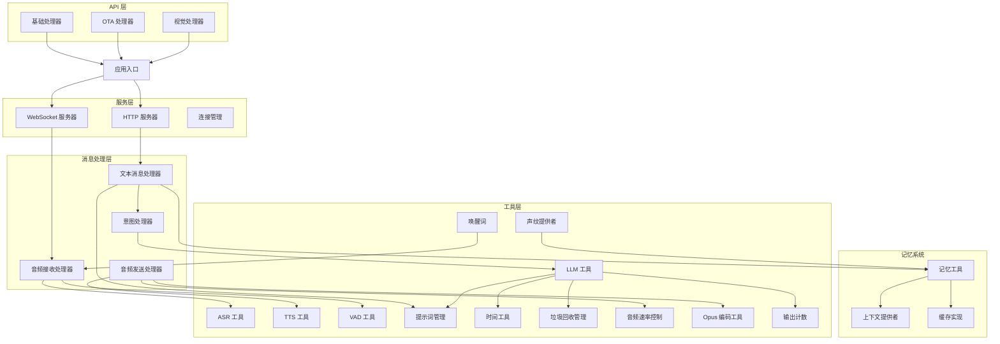
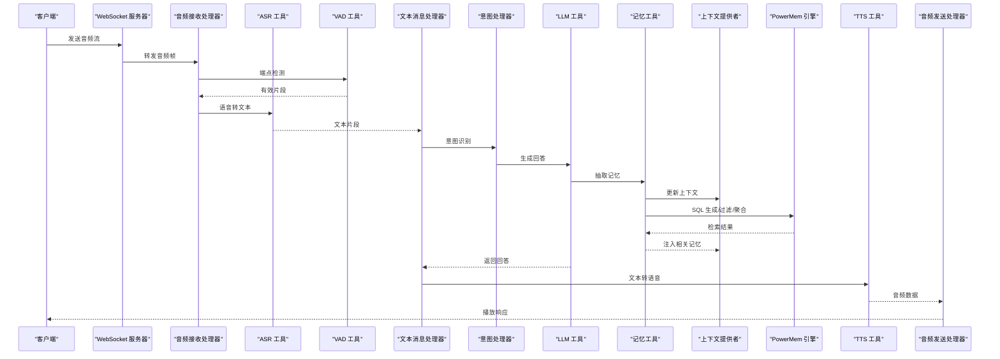
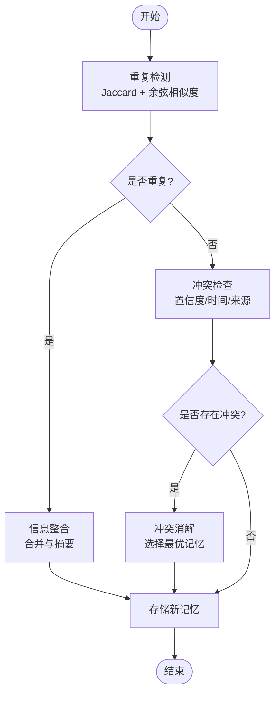
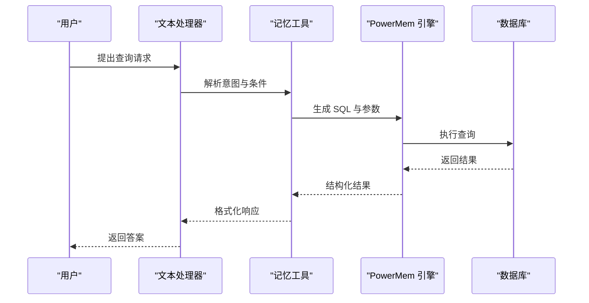
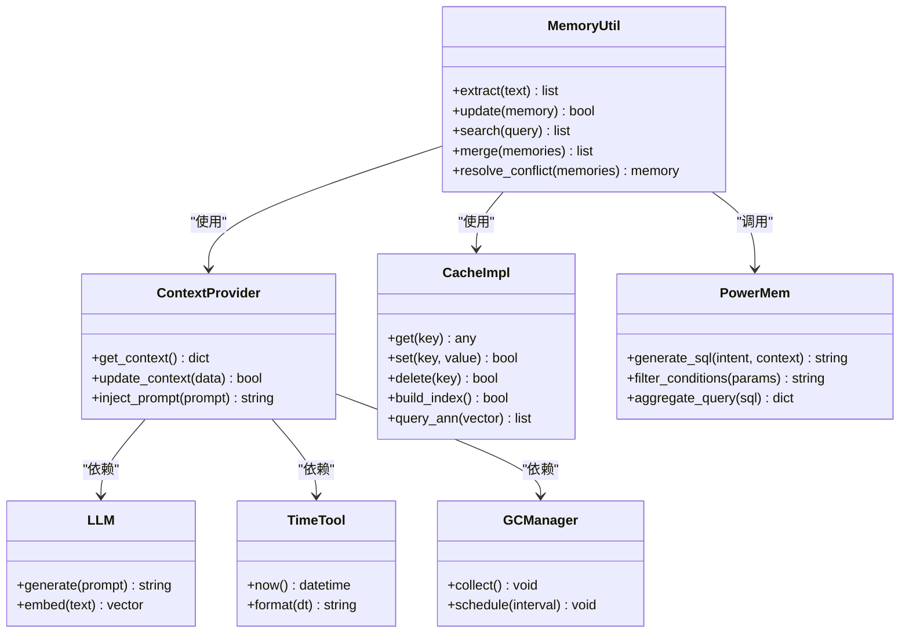

# 记忆提取算法

<cite>
**本文引用的文件**   
- [memory_system_architecture.html](file://main/xiaozhi-server/docs/architecture/memory_system_architecture.html)
- [Memory_System_Architecture_Blueprint.md](file://main/xiaozhi-server/docs/architecture/Memory_System_Architecture_Blueprint.md)
- [powermem-analysis-report.md](file://main/xiaozhi-server/docs/powermem-analysis-report.md)
- [cache-implementation.md](file://main/xiaozhi-server/docs/cache-implementation.md)
- [performance_tester.py](file://main/xiaozhi-server/performance_tester.py)
- [app.py](file://main/xiaozhi-server/app.py)
- [settings.py](file://main/xiaozhi-server/config/settings.py)
- [memory.py](file://main/xiaozhi-server/core/utils/memory.py)
- [context_provider.py](file://main/xiaozhi-server/core/utils/context_provider.py)
- [textMessageHandlerRegistry.py](file://main/xiaozhi-server/core/handle/textMessageHandlerRegistry.py)
- [textMessageProcessor.py](file://main/xiaozhi-server/core/handle/textMessageProcessor.py)
- [receiveAudioHandle.py](file://main/xiaozhi-server/core/handle/receiveAudioHandle.py)
- [sendAudioHandle.py](file://main/xiaozhi-server/core/handle/sendAudioHandle.py)
- [intentHandler.py](file://main/xiaozhi-server/core/handle/intentHandler.py)
- [llm.py](file://main/xiaozhi-server/core/utils/llm.py)
- [asr.py](file://main/xiaozhi-server/core/utils/asr.py)
- [tts.py](file://main/xiaozhi-server/core/utils/tts.py)
- [vad.py](file://main/xiaozhi-server/core/utils/vad.py)
- [util.py](file://main/xiaozhi-server/core/utils/util.py)
- [dialogue.py](file://main/xiaozhi-server/core/utils/dialogue.py)
- [prompt_manager.py](file://main/xiaozhi-server/core/utils/prompt_manager.py)
- [current_time.py](file://main/xiaozhi-server/core/utils/current_time.py)
- [gc_manager.py](file://main/xiaozhi-server/core/utils/gc_manager.py)
- [audioRateController.py](file://main/xiaozhi-server/core/utils/audioRateController.py)
- [opus_encoder_utils.py](file://main/xiaozhi-server/core/utils/opus_encoder_utils.py)
- [voiceprint_provider.py](file://main/xiaozhi-server/core/utils/voiceprint_provider.py)
- [wakeup_word.py](file://main/xiaozhi-server/core/utils/wakeup_word.py)
- [output_counter.py](file://main/xiaozhi-server/core/utils/output_counter.py)
- [auth.py](file://main/xiaozhi-server/core/auth.py)
- [connection.py](file://main/xiaozhi-server/core/connection.py)
- [http_server.py](file://main/xiaozhi-server/core/http_server.py)
- [websocket_server.py](file://main/xiaozhi-server/core/websocket_server.py)
- [base_handler.py](file://main/xiaozhi-server/core/api/base_handler.py)
- [ota_handler.py](file://main/xiaozhi-server/core/api/ota_handler.py)
- [vision_handler.py](file://main/xiaozhi-server/core/api/vision_handler.py)
</cite>

## 目录
1. [引言](#引言)
2. [项目结构](#项目结构)
3. [核心组件](#核心组件)
4. [架构总览](#架构总览)
5. [详细组件分析](#详细组件分析)
6. [依赖关系分析](#依赖关系分析)
7. [性能考量](#性能考量)
8. [故障排查指南](#故障排查指南)
9. [结论](#结论)
10. [附录](#附录)

## 引言
本技术文档围绕“记忆提取算法”展开，聚焦相似度计算、相关性评分、记忆融合策略与 PowerMem 智能处理流程（SQL 生成、条件过滤、聚合查询），并给出向量检索优化方案、参数调优指南与性能基准测试方法。文档面向具备不同技术背景的读者，既提供高层概览，也深入到代码级实现路径与调用链，帮助读者理解系统在对话交互中如何抽取、存储、检索与融合记忆，从而提升语义理解与上下文关联能力。

## 项目结构
本项目采用模块化分层设计：
- 核心运行时：HTTP/WebSocket 服务、连接管理、消息路由与处理器
- 工具层：LLM、ASR、TTS、VAD、Prompt 管理、时间、GC、音频编码等
- 记忆系统：内存缓存、上下文提供者、记忆工具与持久化接口
- 业务处理器：文本消息、意图识别、音频收发等
- 配置与启动：应用入口、设置加载、日志与初始化

图表来源 
- [app.py](file://main/xiaozhi-server/app.py)
- [http_server.py](file://main/xiaozhi-server/core/http_server.py)
- [websocket_server.py](file://main/xiaozhi-server/core/websocket_server.py)
- [textMessageProcessor.py](file://main/xiaozhi-server/core/handle/textMessageProcessor.py)
- [intentHandler.py](file://main/xiaozhi-server/core/handle/intentHandler.py)
- [receiveAudioHandle.py](file://main/xiaozhi-server/core/handle/receiveAudioHandle.py)
- [sendAudioHandle.py](file://main/xiaozhi-server/core/handle/sendAudioHandle.py)
- [memory.py](file://main/xiaozhi-server/core/utils/memory.py)
- [context_provider.py](file://main/xiaozhi-server/core/utils/context_provider.py)
- [cache-implementation.md](file://main/xiaozhi-server/docs/cache-implementation.md)
- [llm.py](file://main/xiaozhi-server/core/utils/llm.py)
- [asr.py](file://main/xiaozhi-server/core/utils/asr.py)
- [tts.py](file://main/xiaozhi-server/core/utils/tts.py)
- [vad.py](file://main/xiaozhi-server/core/utils/vad.py)
- [prompt_manager.py](file://main/xiaozhi-server/core/utils/prompt_manager.py)
- [current_time.py](file://main/xiaozhi-server/core/utils/current_time.py)
- [gc_manager.py](file://main/xiaozhi-server/core/utils/gc_manager.py)
- [audioRateController.py](file://main/xiaozhi-server/core/utils/audioRateController.py)
- [opus_encoder_utils.py](file://main/xiaozhi-server/core/utils/opus_encoder_utils.py)
- [voiceprint_provider.py](file://main/xiaozhi-server/core/utils/voiceprint_provider.py)
- [wakeup_word.py](file://main/xiaozhi-server/core/utils/wakeup_word.py)
- [output_counter.py](file://main/xiaozhi-server/core/utils/output_counter.py)

章节来源
- [memory_system_architecture.html](file://main/xiaozhi-server/docs/architecture/memory_system_architecture.html)
- [Memory_System_Architecture_Blueprint.md](file://main/xiaozhi-server/docs/architecture/Memory_System_Architecture_Blueprint.md)

## 核心组件
- 记忆工具（memory.py）：负责记忆的抽取、更新、检索与融合，封装相似度计算、关键词匹配、语义理解与上下文关联逻辑，并提供与持久化层的接口。
- 上下文提供者（context_provider.py）：维护会话上下文、历史摘要与外部知识注入，为 LLM 与记忆系统提供结构化上下文。
- 缓存实现（cache-implementation.md）：定义缓存策略、过期机制、索引结构与近似最近邻搜索的加速方案。
- 应用入口与配置（app.py, settings.py）：加载配置、初始化模块、注册处理器与中间件，确保记忆系统与运行时环境正确集成。

章节来源
- [memory.py](file://main/xiaozhi-server/core/utils/memory.py)
- [context_provider.py](file://main/xiaozhi-server/core/utils/context_provider.py)
- [cache-implementation.md](file://main/xiaozhi-server/docs/cache-implementation.md)
- [app.py](file://main/xiaozhi-server/app.py)
- [settings.py](file://main/xiaozhi-server/config/settings.py)

## 架构总览
记忆系统贯穿对话全链路：从音频输入到文本输出，期间通过 ASR/VAD 进行语音切分与转写，LLM 进行意图识别与回答生成，同时记忆工具在关键节点抽取与更新记忆，并通过上下文提供者将相关记忆注入提示词，形成闭环。PowerMem 作为智能处理引擎，负责 SQL 生成、条件过滤与聚合查询，支撑高效检索与融合。

图表来源 
- [websocket_server.py](file://main/xiaozhi-server/core/websocket_server.py)
- [receiveAudioHandle.py](file://main/xiaozhi-server/core/handle/receiveAudioHandle.py)
- [asr.py](file://main/xiaozhi-server/core/utils/asr.py)
- [vad.py](file://main/xiaozhi-server/core/utils/vad.py)
- [textMessageProcessor.py](file://main/xiaozhi-server/core/handle/textMessageProcessor.py)
- [intentHandler.py](file://main/xiaozhi-server/core/handle/intentHandler.py)
- [llm.py](file://main/xiaozhi-server/core/utils/llm.py)
- [memory.py](file://main/xiaozhi-server/core/utils/memory.py)
- [context_provider.py](file://main/xiaozhi-server/core/utils/context_provider.py)
- [tts.py](file://main/xiaozhi-server/core/utils/tts.py)
- [sendAudioHandle.py](file://main/xiaozhi-server/core/handle/sendAudioHandle.py)

## 详细组件分析

### 相似度计算算法
- 余弦相似度：用于衡量向量方向一致性，适合高维稀疏特征；在记忆检索中常用于文本嵌入与用户画像向量的匹配。
- 欧几里得距离：衡量向量空间中的绝对距离，适用于数值型特征或归一化后的嵌入；对尺度敏感，需标准化。
- Jaccard 系数：基于集合交集与并集的比例，适合关键词集合或标签集合的重叠度评估；可用于去重与快速初筛。

实现要点：
- 向量维度与归一化：统一维度、L2 归一化以提升余弦相似度稳定性。
- 阈值与权重：为不同相似度指标设定阈值与权重，组合成综合相似度分数。
- 批量计算与缓存：对高频查询进行结果缓存，减少重复计算开销。

章节来源
- [memory.py](file://main/xiaozhi-server/core/utils/memory.py)
- [cache-implementation.md](file://main/xiaozhi-server/docs/cache-implementation.md)

### 相关性评分机制
- 关键词匹配：基于 TF-IDF 或 BM25 的关键词打分，快速定位相关记忆片段。
- 语义理解：使用 LLM 或嵌入模型生成语义向量，结合相似度计算获得语义相关性。
- 上下文关联：根据会话历史、时间戳、设备信息等元数据进行加权，提升上下文一致性。

评分融合：
- 多指标加权：关键词得分、语义得分、上下文得分按权重融合。
- 动态权重：根据场景（如问答、推荐、诊断）调整权重策略。
- 排序与截断：按综合得分排序，截取 Top-K 结果供后续使用。

章节来源
- [memory.py](file://main/xiaozhi-server/core/utils/memory.py)
- [context_provider.py](file://main/xiaozhi-server/core/utils/context_provider.py)

### 记忆融合策略
- 重复检测：利用 Jaccard 系数与余弦相似度判断记忆片段是否重复，避免冗余存储。
- 信息整合：合并相似记忆，保留关键信息与时间顺序，生成更完整的摘要。
- 冲突消解：当多条记忆存在矛盾时，依据置信度、时间新旧与来源可靠性进行决策。

流程图：

图表来源 
- [memory.py](file://main/xiaozhi-server/core/utils/memory.py)

章节来源
- [memory.py](file://main/xiaozhi-server/core/utils/memory.py)

### PowerMem 智能处理流程
PowerMem 作为记忆系统的智能引擎，负责：
- SQL 生成：根据查询意图与上下文自动生成 SQL，支持动态条件与聚合。
- 条件过滤：将自然语言条件转换为 SQL WHERE 子句，支持多字段与逻辑组合。
- 聚合查询：执行 SUM、COUNT、AVG 等聚合操作，返回统计结果用于决策。

序列图：

图表来源 
- [memory.py](file://main/xiaozhi-server/core/utils/memory.py)
- [powermem-analysis-report.md](file://main/xiaozhi-server/docs/powermem-analysis-report.md)

章节来源
- [powermem-analysis-report.md](file://main/xiaozhi-server/docs/powermem-analysis-report.md)
- [memory.py](file://main/xiaozhi-server/core/utils/memory.py)

### 向量检索优化
- 近似最近邻搜索（ANN）：使用 FAISS、HNSW 等索引结构加速高维向量检索。
- 索引构建：离线构建索引，支持增量更新与定期重建。
- 查询加速：缓存热点查询结果，预计算常用相似度矩阵，降低在线延迟。

优化建议：
- 维度降维：PCA 或 t-SNE 降低维度，提升检索速度。
- 分区与分片：按用户或时间分区，减少单次查询范围。
- 并行与批处理：并发执行多个查询，批量更新索引。

章节来源
- [cache-implementation.md](file://main/xiaozhi-server/docs/cache-implementation.md)
- [memory.py](file://main/xiaozhi-server/core/utils/memory.py)

## 依赖关系分析
记忆系统依赖多个工具与服务，形成清晰的依赖链：
- 记忆工具依赖上下文提供者与缓存实现
- 上下文提供者依赖 LLM、时间工具与 GC 管理
- PowerMem 依赖数据库与 SQL 生成器
- 音频与文本处理依赖 ASR、VAD、TTS 等

图表来源 
- [memory.py](file://main/xiaozhi-server/core/utils/memory.py)
- [context_provider.py](file://main/xiaozhi-server/core/utils/context_provider.py)
- [cache-implementation.md](file://main/xiaozhi-server/docs/cache-implementation.md)
- [powermem-analysis-report.md](file://main/xiaozhi-server/docs/powermem-analysis-report.md)
- [llm.py](file://main/xiaozhi-server/core/utils/llm.py)
- [current_time.py](file://main/xiaozhi-server/core/utils/current_time.py)
- [gc_manager.py](file://main/xiaozhi-server/core/utils/gc_manager.py)

章节来源
- [memory.py](file://main/xiaozhi-server/core/utils/memory.py)
- [context_provider.py](file://main/xiaozhi-server/core/utils/context_provider.py)
- [cache-implementation.md](file://main/xiaozhi-server/docs/cache-implementation.md)
- [powermem-analysis-report.md](file://main/xiaozhi-server/docs/powermem-analysis-report.md)

## 性能考量
- 相似度计算复杂度：余弦相似度 O(d)，欧几里得距离 O(d)，Jaccard 系数 O(n)；在高维与大数据集下需优化。
- 向量检索延迟：ANN 索引构建耗时，查询时需平衡召回率与速度。
- 缓存命中率：热点数据缓存可显著降低重复计算与 I/O 开销。
- 并发与批处理：合理设置线程池与队列长度，避免阻塞与内存溢出。

基准测试：
- 使用 performance_tester.py 进行端到端性能测试，覆盖 ASR、LLM、TTS 与记忆检索。
- 监控指标：延迟、吞吐、内存占用、CPU 利用率与错误率。

章节来源
- [performance_tester.py](file://main/xiaozhi-server/performance_tester.py)
- [cache-implementation.md](file://main/xiaozhi-server/docs/cache-implementation.md)

## 故障排查指南
常见问题与解决方案：
- 记忆抽取失败：检查 ASR 输出质量与 LLM 提示词有效性。
- 检索结果不准确：调整相似度阈值与权重，优化向量索引。
- SQL 生成错误：验证 PowerMem 的条件解析与 SQL 语法。
- 内存泄漏：启用 GC 管理，监控对象生命周期。

调试步骤：
- 启用详细日志，记录关键节点输入输出。
- 使用单元测试与集成测试验证各组件行为。
- 逐步隔离问题，定位具体模块。

章节来源
- [memory.py](file://main/xiaozhi-server/core/utils/memory.py)
- [context_provider.py](file://main/xiaozhi-server/core/utils/context_provider.py)
- [powermem-analysis-report.md](file://main/xiaozhi-server/docs/powermem-analysis-report.md)

## 结论
记忆提取算法通过多维度相似度计算、相关性评分与融合策略，实现了高效的记忆抽取与检索。PowerMem 的智能处理流程提升了 SQL 生成与查询效率，向量检索优化进一步降低了延迟。通过合理的参数调优与性能基准测试，系统可在复杂场景中保持高可用性与准确性。

## 附录
- 参数调优指南：
  - 相似度阈值：根据业务需求调整，平衡召回率与精确率。
  - 权重分配：关键词、语义、上下文权重按场景动态调整。
  - 索引参数：ANN 索引的 k、efConstruction 等参数影响速度与精度。
- 性能基准测试：
  - 使用 performance_tester.py 模拟真实负载，收集关键指标。
  - 对比不同配置下的性能表现，选择最优参数组合。

章节来源
- [performance_tester.py](file://main/xiaozhi-server/performance_tester.py)
- [cache-implementation.md](file://main/xiaozhi-server/docs/cache-implementation.md)