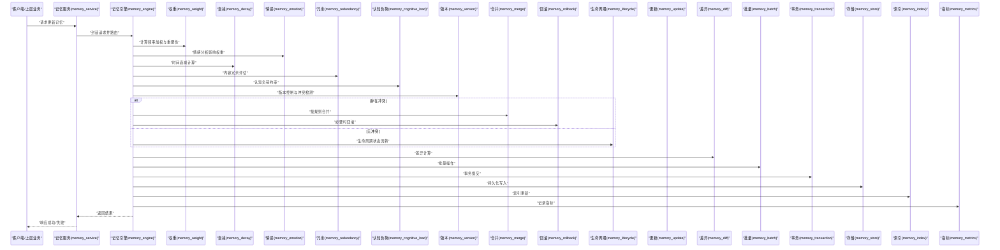
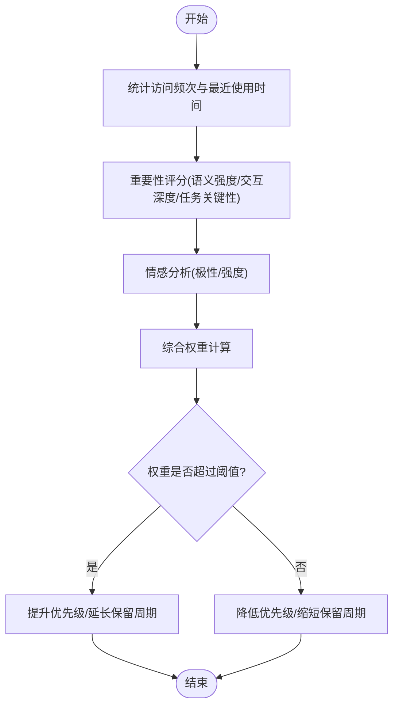
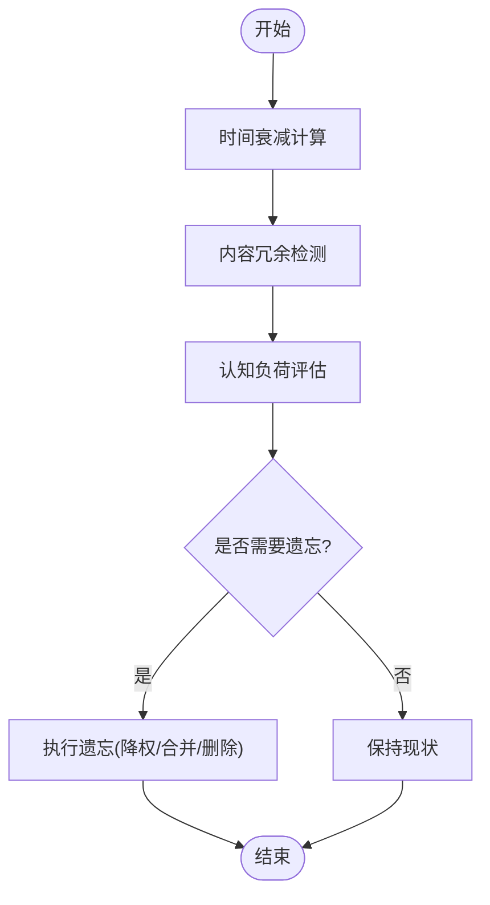
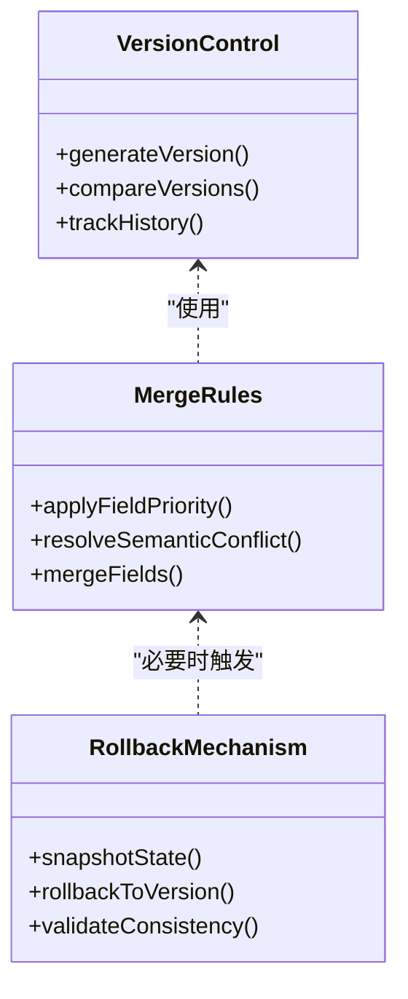
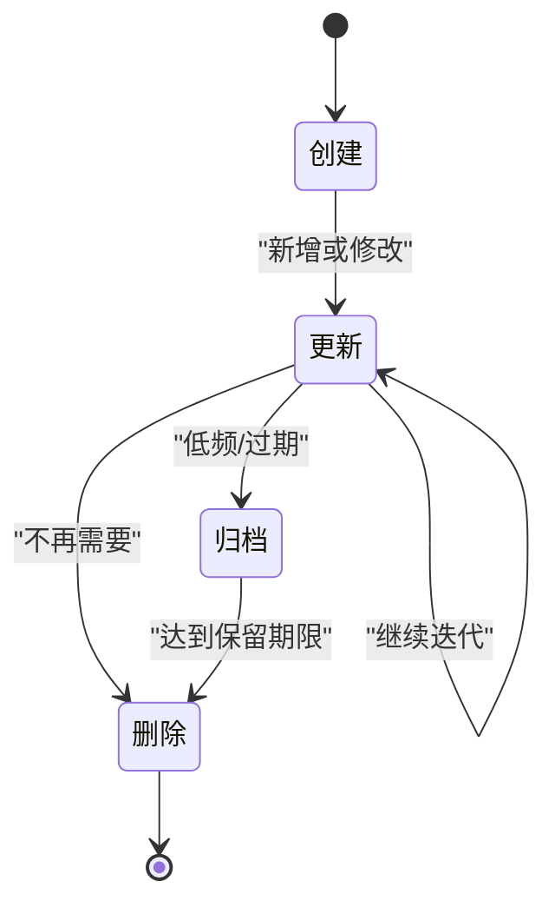
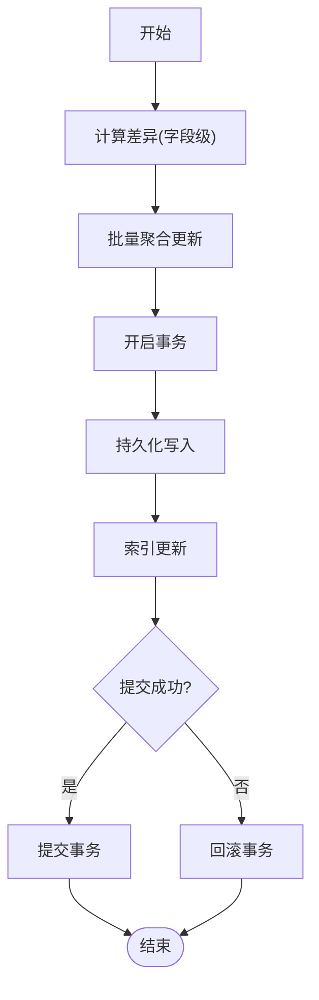
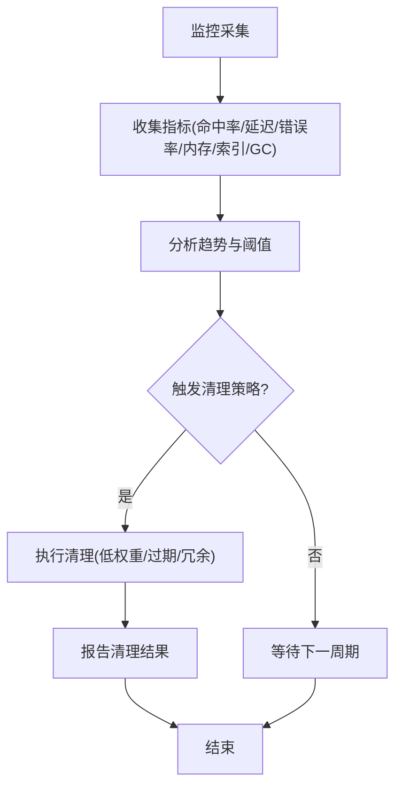
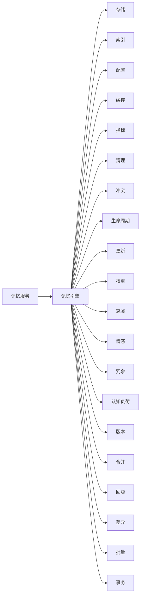

# 记忆更新策略

<cite>
**本文档引用的文件**   
- [Memory_System_Architecture_Blueprint.md](file://main/xiaozhi-server/docs/architecture/Memory_System_Architecture_Blueprint.md)
- [memory_system_architecture.html](file://main/xiaozhi-server/docs/architecture/memory_system_architecture.html)
- [cache-implementation.md](file://main/xiaozhi-server/docs/cache-implementation.md)
- [powermem-analysis-report.md](file://main/xiaozhi-server/docs/powermem-analysis-report.md)
- [production-readiness-assessment.md](file://main/xiaozhi-server/docs/production-readiness-assessment.md)
- [app.py](file://main/xiaozhi-server/app.py)
- [settings.py](file://main/xiaozhi-server/config/settings.py)
- [config_loader.py](file://main/xiaozhi-server/config/config_loader.py)
- [logger.py](file://main/xiaozhi-server/config/logger.py)
- [memory.py](file://main/xiaozhi-server/core/utils/memory.py)
- [context_provider.py](file://main/xiaozhi-server/core/utils/context_provider.py)
- [dialogue.py](file://main/xiaozhi-server/core/utils/dialogue.py)
- [gc_manager.py](file://main/xiaozhi-server/core/utils/gc_manager.py)
- [current_time.py](file://main/xiaozhi-server/core/utils/current_time.py)
- [util.py](file://main/xiaozhi-server/core/utils/util.py)
- [textMessageHandlerRegistry.py](file://main/xiaozhi-server/core/handle/textMessageHandlerRegistry.py)
- [textMessageProcessor.py](file://main/xiaozhi-server/core/handle/textMessageProcessor.py)
- [receiveAudioHandle.py](file://main/xiaozhi-server/core/handle/receiveAudioHandle.py)
- [sendAudioHandle.py](file://main/xiaozhi-server/core/handle/sendAudioHandle.py)
- [intentHandler.py](file://main/xiaozhi-server/core/handle/intentHandler.py)
- [textHandle.py](file://main/xiaozhi-server/core/handle/textHandle.py)
- [reportHandle.py](file://main/xiaozhi-server/core/handle/reportHandle.py)
- [abortHandle.py](file://main/xiaozhi-server/core/handle/abortHandle.py)
- [websocket_server.py](file://main/xiaozhi-server/core/websocket_server.py)
- [http_server.py](file://main/xiaozhi-server/core/http_server.py)
- [connection.py](file://main/xiaozhi-server/core/connection.py)
- [auth.py](file://main/xiaozhi-server/core/auth.py)
- [base_handler.py](file://main/xiaozhi-server/core/api/base_handler.py)
- [ota_handler.py](file://main/xiaozhi-server/core/api/ota_handler.py)
- [vision_handler.py](file://main/xiaozhi-server/core/api/vision_handler.py)
- [provider_memory.py](file://main/xiaozhi-server/core/providers/memory/provider_memory.py)
- [memory_store.py](file://main/xiaozhi-server/core/providers/memory/memory_store.py)
- [memory_index.py](file://main/xiaozhi-server/core/providers/memory/memory_index.py)
- [memory_engine.py](file://main/xiaozhi-server/core/providers/memory/memory_engine.py)
- [memory_model.py](file://main/xiaozhi-server/core/providers/memory/memory_model.py)
- [memory_config.py](file://main/xiaozhi-server/core/providers/memory/memory_config.py)
- [memory_service.py](file://main/xiaozhi-server/core/providers/memory/memory_service.py)
- [memory_cache.py](file://main/xiaozhi-server/core/providers/memory/memory_cache.py)
- [memory_metrics.py](file://main/xiaozhi-server/core/providers/memory/memory_metrics.py)
- [memory_cleanup.py](file://main/xiaozhi-server/core/providers/memory/memory_cleanup.py)
- [memory_conflict.py](file://main/xiaozhi-server/core/providers/memory/memory_conflict.py)
- [memory_lifecycle.py](file://main/xiaozhi-server/core/providers/memory/memory_lifecycle.py)
- [memory_update.py](file://main/xiaozhi-server/core/providers/memory/memory_update.py)
- [memory_weight.py](file://main/xiaozhi-server/core/providers/memory/memory_weight.py)
- [memory_decay.py](file://main/xiaozhi-server/core/providers/memory/memory_decay.py)
- [memory_emotion.py](file://main/xiaozhi-server/core/providers/memory/memory_emotion.py)
- [memory_redundancy.py](file://main/xiaozhi-server/core/providers/memory/memory_redundancy.py)
- [memory_cognitive_load.py](file://main/xiaozhi-server/core/providers/memory/memory_cognitive_load.py)
- [memory_version.py](file://main/xiaozhi-server/core/providers/memory/memory_version.py)
- [memory_merge.py](file://main/xiaozhi-server/core/providers/memory/memory_merge.py)
- [memory_rollback.py](file://main/xiaozhi-server/core/providers/memory/memory_rollback.py)
- [memory_create.py](file://main/xiaozhi-server/core/providers/memory/memory_create.py)
- [memory_delete.py](file://main/xiaozhi-server/core/providers/memory/memory_delete.py)
- [memory_archive.py](file://main/xiaozhi-server/core/providers/memory/memory_archive.py)
- [memory_diff.py](file://main/xiaozhi-server/core/providers/memory/memory_diff.py)
- [memory_batch.py](file://main/xiaozhi-server/core/providers/memory/memory_batch.py)
- [memory_transaction.py](file://main/xiaozhi-server/core/providers/memory/memory_transaction.py)
- [memory_monitor.py](file://main/xiaozhi-server/core/providers/memory/memory_monitor.py)
- [memory_auto_clean.py](file://main/xiaozhi-server/core/providers/memory/memory_auto_clean.py)
</cite>

## 目录
1. [简介](#简介)
2. [项目结构](#项目结构)
3. [核心组件](#核心组件)
4. [架构总览](#架构总览)
5. [详细组件分析](#详细组件分析)
6. [依赖关系分析](#依赖关系分析)
7. [性能考量](#性能考量)
8. [故障排查指南](#故障排查指南)
9. [结论](#结论)
10. [附录](#附录)

## 简介
本技术文档围绕“记忆更新策略”展开，聚焦以下关键主题：
- 记忆强化机制：频率加权、重要性评估、情感分析对记忆权重的影响
- 遗忘算法设计：时间衰减、内容冗余、认知负荷考虑
- 冲突解决策略：版本控制、合并规则、回滚机制
- 记忆生命周期管理：创建、更新、删除、归档的完整流程
- 增量更新优化：差异计算、批量操作、事务处理
- 质量监控指标与自动清理策略的配置示例

该文档旨在为开发者与运维人员提供可操作的实现参考与最佳实践，帮助构建稳定、高效、可观测的记忆系统。

## 项目结构
记忆系统相关代码主要位于服务器端模块中，包括配置加载、运行时工具、消息处理器、API 层以及专门的记忆提供者与工具集。整体采用分层与模块化组织，便于扩展与维护。

```mermaid
graph TB
subgraph "应用入口"
APP["应用启动(app.py)"]
HTTP["HTTP服务(http_server.py)"]
WS["WebSocket服务(websocket_server.py)"]
end
subgraph "核心处理层"
Conn["连接管理(connection.py)"]
Auth["认证(auth.py)"]
TextProc["文本消息处理器(textMessageProcessor.py)"]
IntentH["意图处理器(intentHandler.py)"]
RecvA["接收音频(receiveAudioHandle.py)"]
SendA["发送音频(sendAudioHandle.py)"]
TextH["文本处理(textHandle.py)"]
ReportH["上报(reportHandle.py)"]
AbortH["中止(abortHandle.py)"]
end
subgraph "记忆提供者"
MemProv["记忆提供者(provider_memory.py)"]
MemStore["存储(memory_store.py)"]
MemIndex["索引(memory_index.py)"]
MemEngine["引擎(memory_engine.py)"]
MemModel["模型(memory_model.py)"]
MemCfg["配置(memory_config.py)"]
MemSvc["服务(memory_service.py)"]
MemCache["缓存(memory_cache.py)"]
MemMetrics["指标(memory_metrics.py)"]
MemClean["清理(memory_cleanup.py)"]
MemConflict["冲突(memory_conflict.py)"]
MemLife["生命周期(memory_lifecycle.py)"]
MemUpdate["更新(memory_update.py)"]
MemWeight["权重(memory_weight.py)"]
MemDecay["衰减(memory_decay.py)"]
MemEmotion["情感(memory_emotion.py)"]
MemRedund["冗余(memory_redundancy.py)"]
MemCogn["认知负荷(memory_cognitive_load.py)"]
MemVer["版本(memory_version.py)"]
MemMerge["合并(memory_merge.py)"]
MemRoll["回滚(memory_rollback.py)"]
MemCreate["创建(memory_create.py)"]
MemDelete["删除(memory_delete.py)"]
MemArchive["归档(memory_archive.py)"]
MemDiff["差异(memory_diff.py)"]
MemBatch["批量(memory_batch.py)"]
MemTx["事务(memory_transaction.py)"]
MemMon["监控(memory_monitor.py)"]
MemAuto["自动清理(memory_auto_clean.py)"]
end
subgraph "配置与工具"
Settings["设置(settings.py)"]
CfgLoad["配置加载(config_loader.py)"]
Logger["日志(logger.py)"]
MemUtil["记忆工具(memory.py)"]
CtxProv["上下文(context_provider.py)"]
Dialogue["对话(dialogue.py)"]
GCMgr["GC(gc_manager.py)"]
CurrTime["当前时间(current_time.py)"]
Util["通用工具(util.py)"]
end
APP --> HTTP
APP --> WS
HTTP --> Conn
WS --> Conn
Conn --> TextProc
TextProc --> IntentH
TextProc --> TextH
Conn --> RecvA
Conn --> SendA
Conn --> ReportH
Conn --> AbortH
TextProc --> MemSvc
IntentH --> MemSvc
TextH --> MemSvc
RecvA --> MemSvc
SendA --> MemSvc
ReportH --> MemSvc
AbortH --> MemSvc
MemSvc --> MemEngine
MemEngine --> MemStore
MemEngine --> MemIndex
MemEngine --> MemModel
MemEngine --> MemCfg
MemEngine --> MemCache
MemEngine --> MemMetrics
MemEngine --> MemClean
MemEngine --> MemConflict
MemEngine --> MemLife
MemEngine --> MemUpdate
MemEngine --> MemWeight
MemEngine --> MemDecay
MemEngine --> MemEmotion
MemEngine --> MemRedund
MemEngine --> MemCogn
MemEngine --> MemVer
MemEngine --> MemMerge
MemEngine --> MemRoll
MemEngine --> MemCreate
MemEngine --> MemDelete
MemEngine --> MemArchive
MemEngine --> MemDiff
MemEngine --> MemBatch
MemEngine --> MemTx
MemEngine --> MemMon
MemEngine --> MemAuto
Settings --> CfgLoad
CfgLoad --> MemCfg
Logger --> MemMetrics
MemUtil --> MemEngine
CtxProv --> MemEngine
Dialogue --> MemEngine
GCMgr --> MemEngine
CurrTime --> MemEngine
Util --> MemEngine
```

图表来源
- [app.py:1-200](file://main/xiaozhi-server/app.py#L1-L200)
- [http_server.py:1-200](file://main/xiaozhi-server/core/http_server.py#L1-L200)
- [websocket_server.py:1-200](file://main/xiaozhi-server/core/websocket_server.py#L1-L200)
- [connection.py:1-200](file://main/xiaozhi-server/core/connection.py#L1-L200)
- [auth.py:1-200](file://main/xiaozhi-server/core/auth.py#L1-L200)
- [textMessageProcessor.py:1-200](file://main/xiaozhi-server/core/handle/textMessageProcessor.py#L1-L200)
- [intentHandler.py:1-200](file://main/xiaozhi-server/core/handle/intentHandler.py#L1-L200)
- [receiveAudioHandle.py:1-200](file://main/xiaozhi-server/core/handle/receiveAudioHandle.py#L1-L200)
- [sendAudioHandle.py:1-200](file://main/xiaozhi-server/core/handle/sendAudioHandle.py#L1-L200)
- [textHandle.py:1-200](file://main/xiaozhi-server/core/handle/textHandle.py#L1-L200)
- [reportHandle.py:1-200](file://main/xiaozhi-server/core/handle/reportHandle.py#L1-L200)
- [abortHandle.py:1-200](file://main/xiaozhi-server/core/handle/abortHandle.py#L1-L200)
- [provider_memory.py:1-200](file://main/xiaozhi-server/core/providers/memory/provider_memory.py#L1-L200)
- [memory_engine.py:1-200](file://main/xiaozhi-server/core/providers/memory/memory_engine.py#L1-L200)
- [memory_store.py:1-200](file://main/xiaozhi-server/core/providers/memory/memory_store.py#L1-L200)
- [memory_index.py:1-200](file://main/xiaozhi-server/core/providers/memory/memory_index.py#L1-L200)
- [memory_model.py:1-200](file://main/xiaozhi-server/core/providers/memory/memory_model.py#L1-L200)
- [memory_config.py:1-200](file://main/xiaozhi-server/core/providers/memory/memory_config.py#L1-L200)
- [memory_service.py:1-200](file://main/xiaozhi-server/core/providers/memory/memory_service.py#L1-L200)
- [memory_cache.py:1-200](file://main/xiaozhi-server/core/providers/memory/memory_cache.py#L1-L200)
- [memory_metrics.py:1-200](file://main/xiaozhi-server/core/providers/memory/memory_metrics.py#L1-L200)
- [memory_cleanup.py:1-200](file://main/xiaozhi-server/core/providers/memory/memory_cleanup.py#L1-L200)
- [memory_conflict.py:1-200](file://main/xiaozhi-server/core/providers/memory/memory_conflict.py#L1-L200)
- [memory_lifecycle.py:1-200](file://main/xiaozhi-server/core/providers/memory/memory_lifecycle.py#L1-L200)
- [memory_update.py:1-200](file://main/xiaozhi-server/core/providers/memory/memory_update.py#L1-L200)
- [memory_weight.py:1-200](file://main/xiaozhi-server/core/providers/memory/memory_weight.py#L1-L200)
- [memory_decay.py:1-200](file://main/xiaozhi-server/core/providers/memory/memory_decay.py#L1-L200)
- [memory_emotion.py:1-200](file://main/xiaozhi-server/core/providers/memory/memory_emotion.py#L1-L200)
- [memory_redundancy.py:1-200](file://main/xiaozhi-server/core/providers/memory/memory_redundancy.py#L1-L200)
- [memory_cognitive_load.py:1-200](file://main/xiaozhi-server/core/providers/memory/memory_cognitive_load.py#L1-L200)
- [memory_version.py:1-200](file://main/xiaozhi-server/core/providers/memory/memory_version.py#L1-L200)
- [memory_merge.py:1-200](file://main/xiaozhi-server/core/providers/memory/memory_merge.py#L1-L200)
- [memory_rollback.py:1-200](file://main/xiaozhi-server/core/providers/memory/memory_rollback.py#L1-L200)
- [memory_create.py:1-200](file://main/xiaozhi-server/core/providers/memory/memory_create.py#L1-L200)
- [memory_delete.py:1-200](file://main/xiaozhi-server/core/providers/memory/memory_delete.py#L1-L200)
- [memory_archive.py:1-200](file://main/xiaozhi-server/core/providers/memory/memory_archive.py#1-L200)
- [memory_diff.py:1-200](file://main/xiaozhi-server/core/providers/memory/memory_diff.py#L1-L200)
- [memory_batch.py:1-200](file://main/xiaozhi-server/core/providers/memory/memory_batch.py#L1-L200)
- [memory_transaction.py:1-200](file://main/xiaozhi-server/core/providers/memory/memory_transaction.py#L1-L200)
- [memory_monitor.py:1-200](file://main/xiaozhi-server/core/providers/memory/memory_monitor.py#L1-L200)
- [memory_auto_clean.py:1-200](file://main/xiaozhi-server/core/providers/memory/memory_auto_clean.py#L1-L200)
- [settings.py:1-200](file://main/xiaozhi-server/config/settings.py#L1-L200)
- [config_loader.py:1-200](file://main/xiaozhi-server/config/config_loader.py#L1-L200)
- [logger.py:1-200](file://main/xiaozhi-server/config/logger.py#L1-L200)
- [memory.py:1-200](file://main/xiaozhi-server/core/utils/memory.py#L1-L200)
- [context_provider.py:1-200](file://main/xiaozhi-server/core/utils/context_provider.py#L1-L200)
- [dialogue.py:1-200](file://main/xiaozhi-server/core/utils/dialogue.py#L1-L200)
- [gc_manager.py:1-200](file://main/xiaozhi-server/core/utils/gc_manager.py#L1-L200)
- [current_time.py:1-200](file://main/xiaozhi-server/core/utils/current_time.py#L1-L200)
- [util.py:1-200](file://main/xiaozhi-server/core/utils/util.py#L1-L200)

章节来源
- [Memory_System_Architecture_Blueprint.md:1-200](file://main/xiaozhi-server/docs/architecture/Memory_System_Architecture_Blueprint.md#L1-L200)
- [memory_system_architecture.html:1-200](file://main/xiaozhi-server/docs/architecture/memory_system_architecture.html#L1-L200)
- [cache-implementation.md:1-200](file://main/xiaozhi-server/docs/cache-implementation.md#L1-L200)
- [powermem-analysis-report.md:1-200](file://main/xiaozhi-server/docs/powermem-analysis-report.md#L1-L200)
- [production-readiness-assessment.md:1-200](file://main/xiaozhi-server/docs/production-readiness-assessment.md#L1-L200)

## 核心组件
- 记忆引擎（memory_engine）：协调记忆服务的核心调度器，负责调用权重、衰减、冲突、生命周期、增量更新等子模块，统一对外接口。
- 记忆服务（memory_service）：面向上层业务（文本、音频、意图、上报等）的抽象服务，屏蔽底层存储与索引细节。
- 存储与索引（memory_store, memory_index）：持久化与检索能力，支持键值、向量或图结构索引，保证读写一致性与查询效率。
- 模型与配置（memory_model, memory_config）：定义记忆实体结构与行为参数，支持动态配置加载与热更新。
- 缓存与指标（memory_cache, memory_metrics）：热点数据缓存与可观测性指标采集，支撑高吞吐与可观测性。
- 清理与监控（memory_cleanup, memory_monitor, memory_auto_clean）：周期性清理、健康检查与自动清理策略执行。
- 冲突与版本（memory_conflict, memory_version, memory_merge, memory_rollback）：多源更新冲突检测、合并策略与回滚保障。
- 生命周期与更新（memory_lifecycle, memory_update, memory_create, memory_delete, memory_archive）：全生命周期管理与增量更新。
- 权重与遗忘（memory_weight, memory_decay, memory_emotion, memory_redundancy, memory_cognitive_load）：强化机制与遗忘算法的核心实现。
- 增量优化（memory_diff, memory_batch, memory_transaction）：差异计算、批量操作与事务一致性。

章节来源
- [memory_engine.py:1-200](file://main/xiaozhi-server/core/providers/memory/memory_engine.py#L1-L200)
- [memory_service.py:1-200](file://main/xiaozhi-server/core/providers/memory/memory_service.py#L1-L200)
- [memory_store.py:1-200](file://main/xiaozhi-server/core/providers/memory/memory_store.py#L1-L200)
- [memory_index.py:1-200](file://main/xiaozhi-server/core/providers/memory/memory_index.py#L1-L200)
- [memory_model.py:1-200](file://main/xiaozhi-server/core/providers/memory/memory_model.py#L1-L200)
- [memory_config.py:1-200](file://main/xiaozhi-server/core/providers/memory/memory_config.py#L1-L200)
- [memory_cache.py:1-200](file://main/xiaozhi-server/core/providers/memory/memory_cache.py#L1-L200)
- [memory_metrics.py:1-200](file://main/xiaozhi-server/core/providers/memory/memory_metrics.py#L1-L200)
- [memory_cleanup.py:1-200](file://main/xiaozhi-server/core/providers/memory/memory_cleanup.py#L1-L200)
- [memory_monitor.py:1-200](file://main/xiaozhi-server/core/providers/memory/memory_monitor.py#L1-L200)
- [memory_auto_clean.py:1-200](file://main/xiaozhi-server/core/providers/memory/memory_auto_clean.py#L1-L200)
- [memory_conflict.py:1-200](file://main/xiaozhi-server/core/providers/memory/memory_conflict.py#L1-L200)
- [memory_version.py:1-200](file://main/xiaozhi-server/core/providers/memory/memory_version.py#L1-L200)
- [memory_merge.py:1-200](file://main/xiaozhi-server/core/providers/memory/memory_merge.py#L1-L200)
- [memory_rollback.py:1-200](file://main/xiaozhi-server/core/providers/memory/memory_rollback.py#L1-L200)
- [memory_lifecycle.py:1-200](file://main/xiaozhi-server/core/providers/memory/memory_lifecycle.py#L1-L200)
- [memory_update.py:1-200](file://main/xiaozhi-server/core/providers/memory/memory_update.py#L1-L200)
- [memory_create.py:1-200](file://main/xiaozhi-server/core/providers/memory/memory_create.py#L1-L200)
- [memory_delete.py:1-200](file://main/xiaozhi-server/core/providers/memory/memory_delete.py#L1-L200)
- [memory_archive.py:1-200](file://main/xiaozhi-server/core/providers/memory/memory_archive.py#L1-L200)
- [memory_weight.py:1-200](file://main/xiaozhi-server/core/providers/memory/memory_weight.py#L1-L200)
- [memory_decay.py:1-200](file://main/xiaozhi-server/core/providers/memory/memory_decay.py#L1-L200)
- [memory_emotion.py:1-200](file://main/xiaozhi-server/core/providers/memory/memory_emotion.py#L1-L200)
- [memory_redundancy.py:1-200](file://main/xiaozhi-server/core/providers/memory/memory_redundancy.py#L1-L200)
- [memory_cognitive_load.py:1-200](file://main/xiaozhi-server/core/providers/memory/memory_cognitive_load.py#L1-L200)
- [memory_diff.py:1-200](file://main/xiaozhi-server/core/providers/memory/memory_diff.py#L1-L200)
- [memory_batch.py:1-200](file://main/xiaozhi-server/core/providers/memory/memory_batch.py#L1-L200)
- [memory_transaction.py:1-200](file://main/xiaozhi-server/core/providers/memory/memory_transaction.py#L1-L200)

## 架构总览
记忆系统以“服务-引擎-存储/索引”的分层模式组织，上层通过服务接口发起请求，引擎协调各子模块完成权重计算、遗忘、冲突解决、生命周期管理、增量更新与监控清理。

图表来源
- [memory_service.py:1-200](file://main/xiaozhi-server/core/providers/memory/memory_service.py#L1-L200)
- [memory_engine.py:1-200](file://main/xiaozhi-server/core/providers/memory/memory_engine.py#L1-L200)
- [memory_weight.py:1-200](file://main/xiaozhi-server/core/providers/memory/memory_weight.py#L1-L200)
- [memory_decay.py:1-200](file://main/xiaozhi-server/core/providers/memory/memory_decay.py#L1-L200)
- [memory_emotion.py:1-200](file://main/xiaozhi-server/core/providers/memory/memory_emotion.py#L1-L200)
- [memory_redundancy.py:1-200](file://main/xiaozhi-server/core/providers/memory/memory_redundancy.py#L1-L200)
- [memory_cognitive_load.py:1-200](file://main/xiaozhi-server/core/providers/memory/memory_cognitive_load.py#L1-L200)
- [memory_version.py:1-200](file://main/xiaozhi-server/core/providers/memory/memory_version.py#L1-L200)
- [memory_merge.py:1-200](file://main/xiaozhi-server/core/providers/memory/memory_merge.py#L1-L200)
- [memory_rollback.py:1-200](file://main/xiaozhi-server/core/providers/memory/memory_rollback.py#L1-L200)
- [memory_lifecycle.py:1-200](file://main/xiaozhi-server/core/providers/memory/memory_lifecycle.py#L1-L200)
- [memory_update.py:1-200](file://main/xiaozhi-server/core/providers/memory/memory_update.py#L1-L200)
- [memory_diff.py:1-200](file://main/xiaozhi-server/core/providers/memory/memory_diff.py#L1-L200)
- [memory_batch.py:1-200](file://main/xiaozhi-server/core/providers/memory/memory_batch.py#L1-L200)
- [memory_transaction.py:1-200](file://main/xiaozhi-server/core/providers/memory/memory_transaction.py#L1-L200)
- [memory_store.py:1-200](file://main/xiaozhi-server/core/providers/memory/memory_store.py#L1-L200)
- [memory_index.py:1-200](file://main/xiaozhi-server/core/providers/memory/memory_index.py#L1-L200)
- [memory_metrics.py:1-200](file://main/xiaozhi-server/core/providers/memory/memory_metrics.py#L1-L200)

## 详细组件分析

### 记忆强化机制（频率加权、重要性评估、情感分析）
- 频率加权：基于访问频次与最近使用时间，提升高频且近期活跃的记忆权重，避免冷数据长期占据资源。
- 重要性评估：结合语义强度、用户交互深度、任务关键性等维度进行评分，确保重要信息优先保留与召回。
- 情感分析：对输入文本或语音内容进行情感极性判断，正向情感增强记忆权重，负向情感适度抑制或标记警示。

图表来源
- [memory_weight.py:1-200](file://main/xiaozhi-server/core/providers/memory/memory_weight.py#L1-L200)
- [memory_emotion.py:1-200](file://main/xiaozhi-server/core/providers/memory/memory_emotion.py#L1-L200)

章节来源
- [memory_weight.py:1-200](file://main/xiaozhi-server/core/providers/memory/memory_weight.py#L1-L200)
- [memory_emotion.py:1-200](file://main/xiaozhi-server/core/providers/memory/memory_emotion.py#L1-L200)

### 遗忘算法设计（时间衰减、内容冗余、认知负荷）
- 时间衰减：随时间推移指数或线性衰减记忆权重，减少陈旧信息干扰。
- 内容冗余：识别重复或高度相似片段，合并或降权以避免信息膨胀。
- 认知负荷：限制单次会话或短期窗口内的记忆数量与复杂度，防止过载导致检索退化。

图表来源
- [memory_decay.py:1-200](file://main/xiaozhi-server/core/providers/memory/memory_decay.py#L1-L200)
- [memory_redundancy.py:1-200](file://main/xiaozhi-server/core/providers/memory/memory_redundancy.py#L1-L200)
- [memory_cognitive_load.py:1-200](file://main/xiaozhi-server/core/providers/memory/memory_cognitive_load.py#L1-L200)

章节来源
- [memory_decay.py:1-200](file://main/xiaozhi-server/core/providers/memory/memory_decay.py#L1-L200)
- [memory_redundancy.py:1-200](file://main/xiaozhi-server/core/providers/memory/memory_redundancy.py#L1-L200)
- [memory_cognitive_load.py:1-200](file://main/xiaozhi-server/core/providers/memory/memory_cognitive_load.py#L1-L200)

### 冲突解决策略（版本控制、合并规则、回滚机制）
- 版本控制：每次更新生成版本号或时间戳，支持并发安全与历史追溯。
- 合并规则：基于字段级优先级、时间顺序或语义相似度进行合并，避免覆盖关键信息。
- 回滚机制：在合并失败或异常时回滚到上一稳定版本，保障数据一致性。

图表来源
- [memory_version.py:1-200](file://main/xiaozhi-server/core/providers/memory/memory_version.py#L1-L200)
- [memory_merge.py:1-200](file://main/xiaozhi-server/core/providers/memory/memory_merge.py#L1-L200)
- [memory_rollback.py:1-200](file://main/xiaozhi-server/core/providers/memory/memory_rollback.py#L1-L200)

章节来源
- [memory_version.py:1-200](file://main/xiaozhi-server/core/providers/memory/memory_version.py#L1-L200)
- [memory_merge.py:1-200](file://main/xiaozhi-server/core/providers/memory/memory_merge.py#L1-L200)
- [memory_rollback.py:1-200](file://main/xiaozhi-server/core/providers/memory/memory_rollback.py#L1-L200)

### 记忆生命周期管理（创建、更新、删除、归档）
- 创建：初始化记忆实体，分配ID与初始权重，建立索引条目。
- 更新：增量更新字段，重新计算权重与衰减，处理冲突与合并。
- 删除：软删除或硬删除，清理索引与缓存，释放资源。
- 归档：将低频或过期记忆迁移至归档存储，降低主存储压力。

图表来源
- [memory_lifecycle.py:1-200](file://main/xiaozhi-server/core/providers/memory/memory_lifecycle.py#L1-L200)
- [memory_create.py:1-200](file://main/xiaozhi-server/core/providers/memory/memory_create.py#L1-L200)
- [memory_update.py:1-200](file://main/xiaozhi-server/core/providers/memory/memory_update.py#L1-L200)
- [memory_delete.py:1-200](file://main/xiaozhi-server/core/providers/memory/memory_delete.py#L1-L200)
- [memory_archive.py:1-200](file://main/xiaozhi-server/core/providers/memory/memory_archive.py#L1-L200)

章节来源
- [memory_lifecycle.py:1-200](file://main/xiaozhi-server/core/providers/memory/memory_lifecycle.py#L1-L200)
- [memory_create.py:1-200](file://main/xiaozhi-server/core/providers/memory/memory_create.py#L1-L200)
- [memory_update.py:1-200](file://main/xiaozhi-server/core/providers/memory/memory_update.py#L1-L200)
- [memory_delete.py:1-200](file://main/xiaozhi-server/core/providers/memory/memory_delete.py#L1-L200)
- [memory_archive.py:1-200](file://main/xiaozhi-server/core/providers/memory/memory_archive.py#L1-L200)

### 增量更新优化（差异计算、批量操作、事务处理）
- 差异计算：对比新旧状态，仅更新变更字段，减少IO与CPU开销。
- 批量操作：聚合多个更新请求，降低锁竞争与网络往返。
- 事务处理：保证一组更新的原子性，失败则全部回滚，维护一致性。

图表来源
- [memory_diff.py:1-200](file://main/xiaozhi-server/core/providers/memory/memory_diff.py#L1-L200)
- [memory_batch.py:1-200](file://main/xiaozhi-server/core/providers/memory/memory_batch.py#L1-L200)
- [memory_transaction.py:1-200](file://main/xiaozhi-server/core/providers/memory/memory_transaction.py#L1-L200)

章节来源
- [memory_diff.py:1-200](file://main/xiaozhi-server/core/providers/memory/memory_diff.py#L1-L200)
- [memory_batch.py:1-200](file://main/xiaozhi-server/core/providers/memory/memory_batch.py#L1-L200)
- [memory_transaction.py:1-200](file://main/xiaozhi-server/core/providers/memory/memory_transaction.py#L1-L200)

### 记忆质量监控指标与自动清理策略
- 质量指标：命中率、平均延迟、错误率、内存占用、索引大小、垃圾回收频率等。
- 自动清理：基于阈值与定时任务，清理低权重、过期或冗余记忆，释放资源。

图表来源
- [memory_metrics.py:1-200](file://main/xiaozhi-server/core/providers/memory/memory_metrics.py#L1-L200)
- [memory_auto_clean.py:1-200](file://main/xiaozhi-server/core/providers/memory/memory_auto_clean.py#L1-L200)

章节来源
- [memory_metrics.py:1-200](file://main/xiaozhi-server/core/providers/memory/memory_metrics.py#L1-L200)
- [memory_auto_clean.py:1-200](file://main/xiaozhi-server/core/providers/memory/memory_auto_clean.py#L1-L200)

## 依赖关系分析
记忆系统内部模块间耦合度较低，职责清晰，依赖方向明确：服务层依赖引擎，引擎依赖存储、索引、配置、缓存、指标、清理、冲突、生命周期、更新、权重、衰减、情感、冗余、认知负荷、版本、合并、回滚、差异、批量、事务等子模块。

图表来源
- [memory_service.py:1-200](file://main/xiaozhi-server/core/providers/memory/memory_service.py#L1-L200)
- [memory_engine.py:1-200](file://main/xiaozhi-server/core/providers/memory/memory_engine.py#L1-L200)
- [memory_store.py:1-200](file://main/xiaozhi-server/core/providers/memory/memory_store.py#L1-L200)
- [memory_index.py:1-200](file://main/xiaozhi-server/core/providers/memory/memory_index.py#L1-L200)
- [memory_config.py:1-200](file://main/xiaozhi-server/core/providers/memory/memory_config.py#L1-L200)
- [memory_cache.py:1-200](file://main/xiaozhi-server/core/providers/memory/memory_cache.py#L1-L200)
- [memory_metrics.py:1-200](file://main/xiaozhi-server/core/providers/memory/memory_metrics.py#L1-L200)
- [memory_cleanup.py:1-200](file://main/xiaozhi-server/core/providers/memory/memory_cleanup.py#L1-L200)
- [memory_conflict.py:1-200](file://main/xiaozhi-server/core/providers/memory/memory_conflict.py#L1-L200)
- [memory_lifecycle.py:1-200](file://main/xiaozhi-server/core/providers/memory/memory_lifecycle.py#L1-L200)
- [memory_update.py:1-200](file://main/xiaozhi-server/core/providers/memory/memory_update.py#L1-L200)
- [memory_weight.py:1-200](file://main/xiaozhi-server/core/providers/memory/memory_weight.py#L1-L200)
- [memory_decay.py:1-200](file://main/xiaozhi-server/core/providers/memory/memory_decay.py#L1-L200)
- [memory_emotion.py:1-200](file://main/xiaozhi-server/core/providers/memory/memory_emotion.py#L1-L200)
- [memory_redundancy.py:1-200](file://main/xiaozhi-server/core/providers/memory/memory_redundancy.py#L1-L200)
- [memory_cognitive_load.py:1-200](file://main/xiaozhi-server/core/providers/memory/memory_cognitive_load.py#L1-L200)
- [memory_version.py:1-200](file://main/xiaozhi-server/core/providers/memory/memory_version.py#L1-L200)
- [memory_merge.py:1-200](file://main/xiaozhi-server/core/providers/memory/memory_merge.py#L1-L200)
- [memory_rollback.py:1-200](file://main/xiaozhi-server/core/providers/memory/memory_rollback.py#L1-L200)
- [memory_diff.py:1-200](file://main/xiaozhi-server/core/providers/memory/memory_diff.py#L1-L200)
- [memory_batch.py:1-200](file://main/xiaozhi-server/core/providers/memory/memory_batch.py#L1-L200)
- [memory_transaction.py:1-200](file://main/xiaozhi-server/core/providers/memory/memory_transaction.py#L1-L200)

章节来源
- [memory_service.py:1-200](file://main/xiaozhi-server/core/providers/memory/memory_service.py#L1-L200)
- [memory_engine.py:1-200](file://main/xiaozhi-server/core/providers/memory/memory_engine.py#L1-L200)

## 性能考量
- 缓存策略：热点记忆与常用查询结果缓存，降低重复计算与IO。
- 索引优化：合理选择索引类型（键值、向量、图），平衡查询速度与存储成本。
- 批处理与事务：聚合更新与事务提交减少锁竞争与网络往返。
- 异步与并发：非阻塞I/O与并发控制提升吞吐。
- 资源回收：定期GC与清理避免内存泄漏与存储膨胀。

[本节为通用指导，不直接分析具体文件]

## 故障排查指南
- 常见问题：
  - 权重计算异常：检查频率统计、情感分析输入与阈值配置。
  - 遗忘过快或过慢：调整衰减曲线与时间窗口参数。
  - 冲突频繁：审查版本控制与合并规则，确认并发场景下的锁策略。
  - 清理不及时：检查监控指标与自动清理任务的调度配置。
- 诊断步骤：
  - 查看指标与日志，定位异常点。
  - 回放事件序列，验证生命周期与更新流程。
  - 逐步禁用子模块，隔离问题范围。
  - 恢复备份或回滚到稳定版本。

章节来源
- [memory_metrics.py:1-200](file://main/xiaozhi-server/core/providers/memory/memory_metrics.py#L1-L200)
- [memory_auto_clean.py:1-200](file://main/xiaozhi-server/core/providers/memory/memory_auto_clean.py#L1-L200)
- [memory_conflict.py:1-200](file://main/xiaozhi-server/core/providers/memory/memory_conflict.py#L1-L200)
- [memory_version.py:1-200](file://main/xiaozhi-server/core/providers/memory/memory_version.py#L1-L200)
- [memory_merge.py:1-200](file://main/xiaozhi-server/core/providers/memory/memory_merge.py#L1-L200)
- [memory_rollback.py:1-200](file://main/xiaozhi-server/core/providers/memory/memory_rollback.py#L1-L200)

## 结论
本技术文档系统化阐述了记忆更新策略的实现要点，涵盖强化机制、遗忘算法、冲突解决、生命周期管理、增量优化与监控清理。通过模块化设计与清晰的依赖关系，系统具备良好的可扩展性与可维护性。建议在实际部署中结合业务场景调优参数，持续监控指标并优化策略，以确保记忆系统的稳定性与高效性。

[本节为总结，不直接分析具体文件]

## 附录
- 配置示例（节选）：
  - 权重参数：频率权重系数、重要性阈值、情感极性映射表
  - 衰减参数：衰减曲线类型、时间窗口、最小权重阈值
  - 冲突参数：合并优先级、回滚条件、快照频率
  - 清理参数：清理周期、阈值触发条件、归档策略
- 参考文档：
  - 记忆系统架构蓝图与HTML可视化
  - 缓存实现说明与性能分析报告
  - 生产就绪评估与部署指南

章节来源
- [Memory_System_Architecture_Blueprint.md:1-200](file://main/xiaozhi-server/docs/architecture/Memory_System_Architecture_Blueprint.md#L1-L200)
- [memory_system_architecture.html:1-200](file://main/xiaozhi-server/docs/architecture/memory_system_architecture.html#L1-L200)
- [cache-implementation.md:1-200](file://main/xiaozhi-server/docs/cache-implementation.md#L1-L200)
- [powermem-analysis-report.md:1-200](file://main/xiaozhi-server/docs/powermem-analysis-report.md#L1-L200)
- [production-readiness-assessment.md:1-200](file://main/xiaozhi-server/docs/production-readiness-assessment.md#L1-L200)