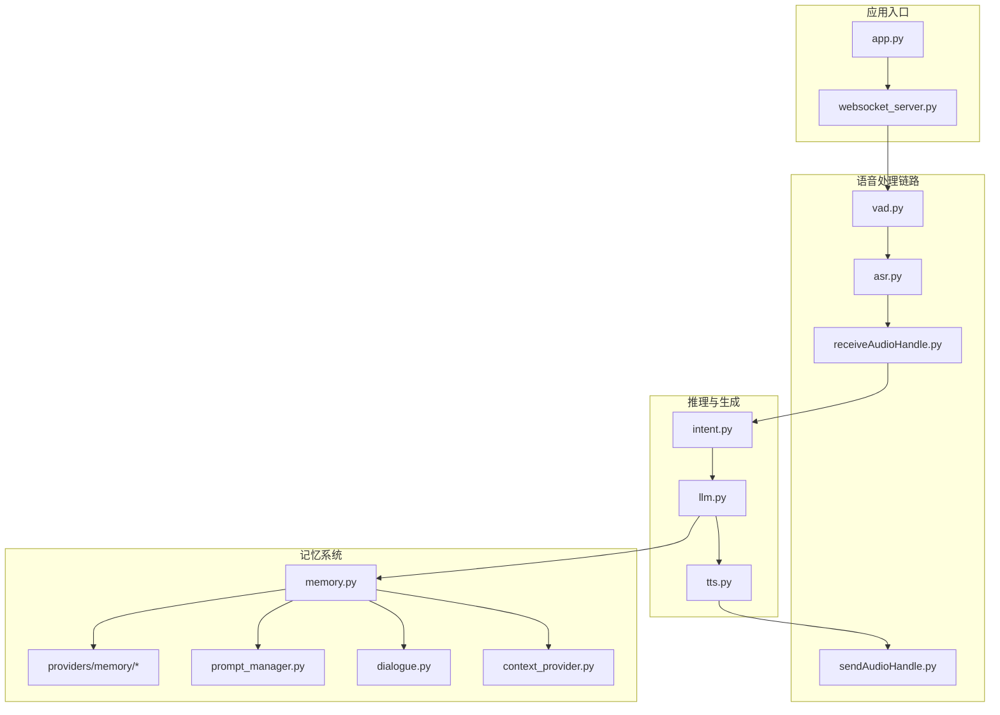
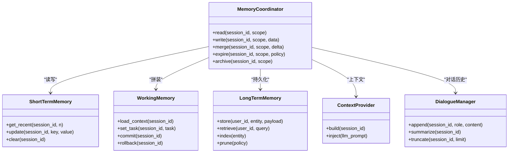
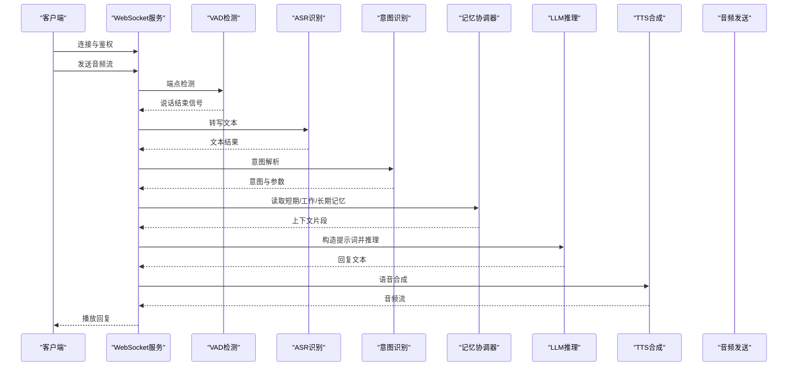
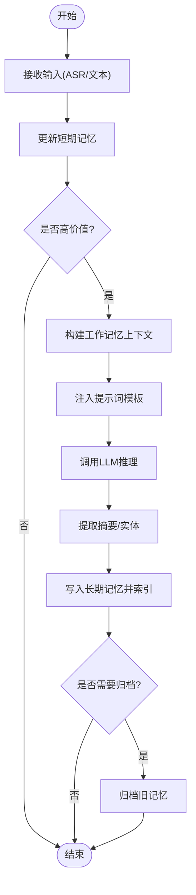
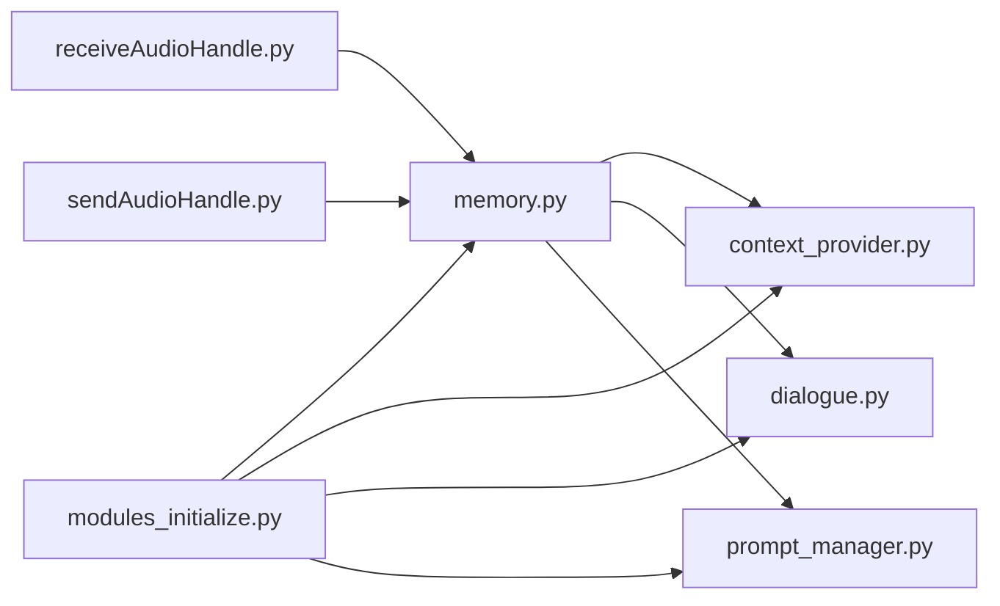

# 记忆架构设计

<cite>
**本文引用的文件**   
- [memory_system_architecture.html](file://main/xiaozhi-server/docs/architecture/memory_system_architecture.html)
- [Memory_System_Architecture_Blueprint.md](file://main/xiaozhi-server/docs/architecture/Memory_System_Architecture_Blueprint.md)
- [memory.py](file://main/xiaozhi-server/core/utils/memory.py)
- [modules_initialize.py](file://main/xiaozhi-server/core/utils/modules_initialize.py)
- [context_provider.py](file://main/xiaozhi-server/core/utils/context_provider.py)
- [dialogue.py](file://main/xiaozhi-server/core/utils/dialogue.py)
- [receiveAudioHandle.py](file://main/xiaozhi-server/core/handle/receiveAudioHandle.py)
- [sendAudioHandle.py](file://main/xiaozhi-server/core/handle/sendAudioHandle.py)
- [textMessageProcessor.py](file://main/xiaozhi-server/core/handle/textMessageProcessor.py)
- [llm.py](file://main/xiaozhi-server/core/utils/llm.py)
- [tts.py](file://main/xiaozhi-server/core/utils/tts.py)
- [vad.py](file://main/xiaozhi-server/core/utils/vad.py)
- [asr.py](file://main/xiaozhi-server/core/utils/asr.py)
- [intent.py](file://main/xiaozhi-server/core/utils/intent.py)
- [prompt_manager.py](file://main/xiaozhi-server/core/utils/prompt_manager.py)
- [app.py](file://main/xiaozhi-server/app.py)
- [websocket_server.py](file://main/xiaozhi-server/core/websocket_server.py)
</cite>

## 目录
1. [引言](#引言)
2. [项目结构](#项目结构)
3. [核心组件](#核心组件)
4. [架构总览](#架构总览)
5. [详细组件分析](#详细组件分析)
6. [依赖关系分析](#依赖关系分析)
7. [性能考量](#性能考量)
8. [故障排查指南](#故障排查指南)
9. [结论](#结论)
10. [附录](#附录)

## 引言
本技术文档围绕“记忆系统”的架构设计与实现展开，目标是帮助读者理解短期记忆、长期记忆与工作记忆的层次结构与职责分工，掌握数据流转机制与存储策略选择，明确记忆抽象接口的设计要点（统一数据模型、生命周期管理、扩展点），并说明记忆系统与 LLM、对话管理、用户系统的集成方式。文档同时提供架构图与数据流图，解释记忆在语音交互流程中的作用，并给出配置示例与最佳实践建议。

## 项目结构
记忆系统相关代码主要位于 xiaozhi-server 的核心模块中：
- 核心工具层：utils/memory.py、utils/context_provider.py、utils/dialogue.py、utils/prompt_manager.py
- 提供者层：core/providers/memory/*（按不同存储后端或能力划分）
- 初始化与装配：utils/modules_initialize.py
- 语音处理链路：handle/receiveAudioHandle.py、handle/sendAudioHandle.py、core/utils/asr.py、core/utils/vad.py
- 推理与生成：core/utils/llm.py、core/utils/tts.py
- 意图识别：core/utils/intent.py
- 应用入口与服务：app.py、core/websocket_server.py
- 架构蓝图与可视化：docs/architecture/Memory_System_Architecture_Blueprint.md、docs/architecture/memory_system_architecture.html

图表来源
- [app.py](file://main/xiaozhi-server/app.py)
- [websocket_server.py](file://main/xiaozhi-server/core/websocket_server.py)
- [vad.py](file://main/xiaozhi-server/core/utils/vad.py)
- [asr.py](file://main/xiaozhi-server/core/utils/asr.py)
- [receiveAudioHandle.py](file://main/xiaozhi-server/core/handle/receiveAudioHandle.py)
- [sendAudioHandle.py](file://main/xiaozhi-server/core/handle/sendAudioHandle.py)
- [llm.py](file://main/xiaozhi-server/core/utils/llm.py)
- [tts.py](file://main/xiaozhi-server/core/utils/tts.py)
- [intent.py](file://main/xiaozhi-server/core/utils/intent.py)
- [memory.py](file://main/xiaozhi-server/core/utils/memory.py)
- [context_provider.py](file://main/xiaozhi-server/core/utils/context_provider.py)
- [dialogue.py](file://main/xiaozhi-server/core/utils/dialogue.py)
- [prompt_manager.py](file://main/xiaozhi-server/core/utils/prompt_manager.py)

章节来源
- [Memory_System_Architecture_Blueprint.md](file://main/xiaozhi-server/docs/architecture/Memory_System_Architecture_Blueprint.md)
- [memory_system_architecture.html](file://main/xiaozhi-server/docs/architecture/memory_system_architecture.html)

## 核心组件
- 记忆抽象与协调器（memory.py）
  - 职责：定义统一的记忆接口与数据模型，协调短期/工作/长期记忆的读写与合并，暴露扩展点供不同存储后端接入。
  - 关键点：会话级上下文聚合、记忆项的生命周期（创建、更新、过期、归档）、跨会话迁移策略。
- 上下文提供者（context_provider.py）
  - 职责：为 LLM 与上层逻辑提供结构化上下文，包括用户画像、设备信息、当前任务状态等。
  - 关键点：上下文模板化、按需注入、版本兼容。
- 对话管理（dialogue.py）
  - 职责：维护对话历史、轮次控制、打断与恢复、多轮语义连贯性。
  - 关键点：消息序列、时间戳、角色标记、摘要与压缩策略。
- 提示词管理（prompt_manager.py）
  - 职责：动态组装提示词，融合记忆片段与系统指令，保证输出一致性。
  - 关键点：模板引擎、变量替换、优先级与冲突消解。
- 记忆提供者集合（providers/memory/*）
  - 职责：具体存储实现（内存缓存、持久化存储、向量检索等）。
  - 关键点：可插拔、读写分离、索引策略、容量与过期策略。

章节来源
- [memory.py](file://main/xiaozhi-server/core/utils/memory.py)
- [context_provider.py](file://main/xiaozhi-server/core/utils/context_provider.py)
- [dialogue.py](file://main/xiaozhi-server/core/utils/dialogue.py)
- [prompt_manager.py](file://main/xiaozhi-server/core/utils/prompt_manager.py)
- [modules_initialize.py](file://main/xiaozhi-server/core/utils/modules_initialize.py)

## 架构总览
记忆系统采用分层架构：短期记忆用于高频、低延迟的会话内状态；工作记忆负责当前任务与意图的上下文拼装；长期记忆承载跨会话的用户偏好、知识片段与经验总结。三者通过统一接口协作，由 memory.py 作为协调器，结合 context_provider.py 与 dialogue.py 完成上下文构建，再由 prompt_manager.py 注入到 LLM 调用链中。

图表来源
- [memory.py](file://main/xiaozhi-server/core/utils/memory.py)
- [context_provider.py](file://main/xiaozhi-server/core/utils/context_provider.py)
- [dialogue.py](file://main/xiaozhi-server/core/utils/dialogue.py)

章节来源
- [Memory_System_Architecture_Blueprint.md](file://main/xiaozhi-server/docs/architecture/Memory_System_Architecture_Blueprint.md)
- [memory_system_architecture.html](file://main/xiaozhi-server/docs/architecture/memory_system_architecture.html)

## 详细组件分析

### 记忆抽象接口与数据模型
- 统一数据模型
  - 记忆项包含：标识、作用域（会话/用户/全局）、类型（事实/偏好/事件/摘要）、内容、元数据（时间戳、来源、权重）、生命周期状态（活跃/归档/过期）。
- 生命周期管理
  - 创建：写入短期记忆，触发工作记忆更新与提示词重建。
  - 更新：增量合并，避免覆盖关键上下文。
  - 过期：基于时间窗口与访问频率策略清理。
  - 归档：将低频但重要的记忆迁移至长期记忆。
- 扩展点定义
  - 存储后端接口：读/写/索引/查询/清理。
  - 策略接口：过期策略、压缩策略、检索策略。
  - 钩子接口：写入前后回调、冲突解决回调。

章节来源
- [memory.py](file://main/xiaozhi-server/core/utils/memory.py)
- [modules_initialize.py](file://main/xiaozhi-server/core/utils/modules_initialize.py)

### 短期记忆（Short-Term Memory）
- 职责：保存最近 N 条消息、临时变量、中间结果，支持快速读取与覆盖。
- 存储策略：内存缓存为主，必要时落盘；设置 TTL 与最大条目数。
- 数据流转：ASR 输出进入短期记忆，工作记忆据此更新任务状态。

章节来源
- [memory.py](file://main/xiaozhi-server/core/utils/memory.py)

### 工作记忆（Working Memory）
- 职责：拼装当前对话轮次的上下文，整合用户意图、设备状态、系统指令。
- 存储策略：轻量对象，随会话生命周期存在；支持快照与回滚。
- 数据流转：从短期记忆与长期记忆中抽取相关片段，经 prompt_manager 注入 LLM。

章节来源
- [dialogue.py](file://main/xiaozhi-server/core/utils/dialogue.py)
- [prompt_manager.py](file://main/xiaozhi-server/core/utils/prompt_manager.py)

### 长期记忆（Long-Term Memory）
- 职责：持久化用户画像、偏好、历史事件、知识片段，支持跨会话检索。
- 存储策略：结构化存储（键值/关系型）+ 向量检索（语义相似）；支持索引与分片。
- 数据流转：定期从工作记忆摘要提取重要信息，建立索引并归档。

章节来源
- [memory.py](file://main/xiaozhi-server/core/utils/memory.py)

### 上下文提供者（Context Provider）
- 职责：将记忆片段与系统指令组合成 LLM 可读的结构化上下文。
- 关键点：模板化、版本兼容、按需注入、冲突消解。

章节来源
- [context_provider.py](file://main/xiaozhi-server/core/utils/context_provider.py)
- [prompt_manager.py](file://main/xiaozhi-server/core/utils/prompt_manager.py)

### 对话管理（Dialogue Manager）
- 职责：维护对话历史、轮次控制、打断与恢复、摘要与压缩。
- 关键点：消息序列、时间戳、角色标记、滚动窗口与截断策略。

章节来源
- [dialogue.py](file://main/xiaozhi-server/core/utils/dialogue.py)

### 语音交互中的数据流与记忆的作用

图表来源
- [websocket_server.py](file://main/xiaozhi-server/core/websocket_server.py)
- [vad.py](file://main/xiaozhi-server/core/utils/vad.py)
- [asr.py](file://main/xiaozhi-server/core/utils/asr.py)
- [intent.py](file://main/xiaozhi-server/core/utils/intent.py)
- [memory.py](file://main/xiaozhi-server/core/utils/memory.py)
- [llm.py](file://main/xiaozhi-server/core/utils/llm.py)
- [tts.py](file://main/xiaozhi-server/core/utils/tts.py)

章节来源
- [receiveAudioHandle.py](file://main/xiaozhi-server/core/handle/receiveAudioHandle.py)
- [sendAudioHandle.py](file://main/xiaozhi-server/core/handle/sendAudioHandle.py)
- [textMessageProcessor.py](file://main/xiaozhi-server/core/handle/textMessageProcessor.py)

### 复杂逻辑流程图：记忆写入与归档

图表来源
- [memory.py](file://main/xiaozhi-server/core/utils/memory.py)
- [prompt_manager.py](file://main/xiaozhi-server/core/utils/prompt_manager.py)
- [llm.py](file://main/xiaozhi-server/core/utils/llm.py)

章节来源
- [memory.py](file://main/xiaozhi-server/core/utils/memory.py)

## 依赖关系分析
- 组件耦合
  - memory.py 依赖 context_provider.py、dialogue.py、prompt_manager.py 以构建上下文与提示词。
  - 语音链路（VAD/ASR/Intent）通过 receiveAudioHandle.py 与 sendAudioHandle.py 驱动，最终与 memory.py 交互。
  - modules_initialize.py 负责加载各提供者与策略，确保运行时可用。
- 外部依赖
  - LLM/TTS/ASR/VAD 等外部服务通过 utils 层封装，便于替换与扩展。
- 潜在循环依赖
  - 通过接口隔离与初始化顺序控制避免循环导入。

图表来源
- [memory.py](file://main/xiaozhi-server/core/utils/memory.py)
- [context_provider.py](file://main/xiaozhi-server/core/utils/context_provider.py)
- [dialogue.py](file://main/xiaozhi-server/core/utils/dialogue.py)
- [prompt_manager.py](file://main/xiaozhi-server/core/utils/prompt_manager.py)
- [receiveAudioHandle.py](file://main/xiaozhi-server/core/handle/receiveAudioHandle.py)
- [sendAudioHandle.py](file://main/xiaozhi-server/core/handle/sendAudioHandle.py)
- [modules_initialize.py](file://main/xiaozhi-server/core/utils/modules_initialize.py)

章节来源
- [modules_initialize.py](file://main/xiaozhi-server/core/utils/modules_initialize.py)

## 性能考量
- 短期记忆
  - 使用内存缓存与 TTL，限制最大条目数，避免内存膨胀。
  - 批量写入与合并减少频繁 I/O。
- 工作记忆
  - 按需构建与快照，避免全量复制；支持增量更新。
- 长期记忆
  - 索引策略（哈希/向量）提升检索效率；分片与冷热分离优化存储成本。
  - 异步归档与压缩，降低主链路延迟。
- 并发与线程安全
  - 会话级锁与无锁数据结构结合，提高吞吐。
- 监控与调优
  - 指标采集（命中率、延迟、内存占用）与自动降级策略。

[本节为通用指导，不直接分析具体文件]

## 故障排查指南
- 常见问题
  - 上下文缺失：检查 context_provider 模板与注入顺序。
  - 记忆未持久化：确认长期记忆提供者初始化与索引构建。
  - 对话断裂：审查 dialogue 的截断与摘要策略。
  - 提示词冲突：查看 prompt_manager 的优先级与冲突消解规则。
- 调试手段
  - 启用详细日志，记录记忆读写与合并过程。
  - 使用测试用例验证记忆生命周期与边界条件。
  - 对语音链路进行端到端回放，定位瓶颈。

章节来源
- [memory.py](file://main/xiaozhi-server/core/utils/memory.py)
- [context_provider.py](file://main/xiaozhi-server/core/utils/context_provider.py)
- [dialogue.py](file://main/xiaozhi-server/core/utils/dialogue.py)
- [prompt_manager.py](file://main/xiaozhi-server/core/utils/prompt_manager.py)

## 结论
记忆系统通过短期、工作、长期三层协同，结合统一的抽象接口与可扩展的存储策略，实现了高效、可靠的上下文管理与持久化。在语音交互流程中，记忆系统贯穿 ASR→意图→LLM→TTS 的全链路，显著提升对话连贯性与个性化体验。建议在生产环境中完善监控与降级策略，持续优化索引与压缩算法，保障性能与稳定性。

[本节为总结，不直接分析具体文件]

## 附录
- 配置示例（建议）
  - 短期记忆：TTL=300s，最大条目=200，写入合并阈值=10。
  - 工作记忆：快照间隔=每轮，回滚深度=3。
  - 长期记忆：索引类型=向量+哈希，归档周期=每日，压缩阈值=相似度<0.6。
- 最佳实践
  - 明确记忆作用域与生命周期，避免跨会话污染。
  - 使用模板化上下文与提示词，保持版本兼容。
  - 对高价值记忆进行摘要与索引，降低检索成本。
  - 监控关键指标，设置自动降级与熔断。

[本节为通用指导，不直接分析具体文件]