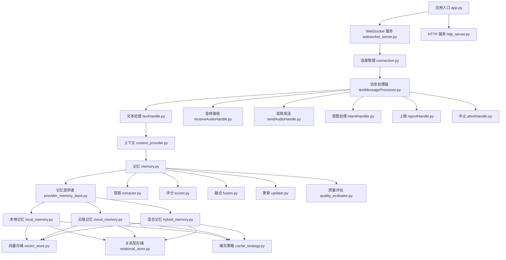
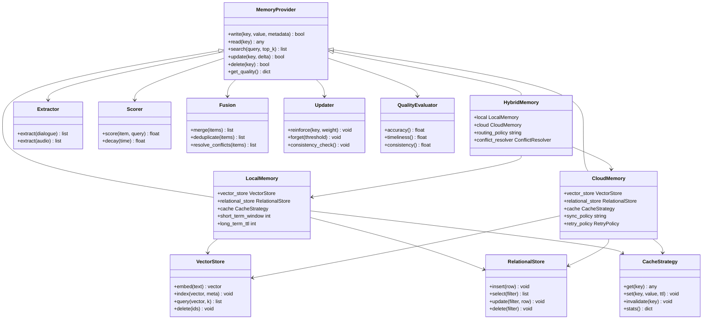
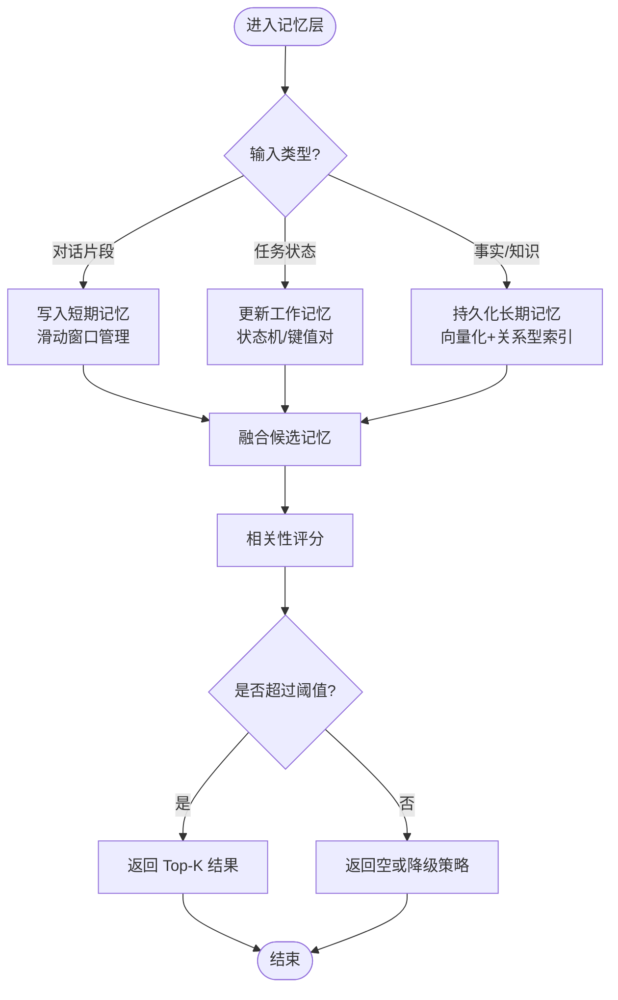
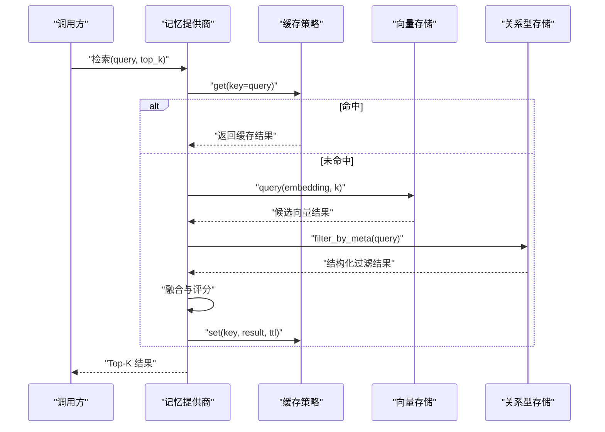
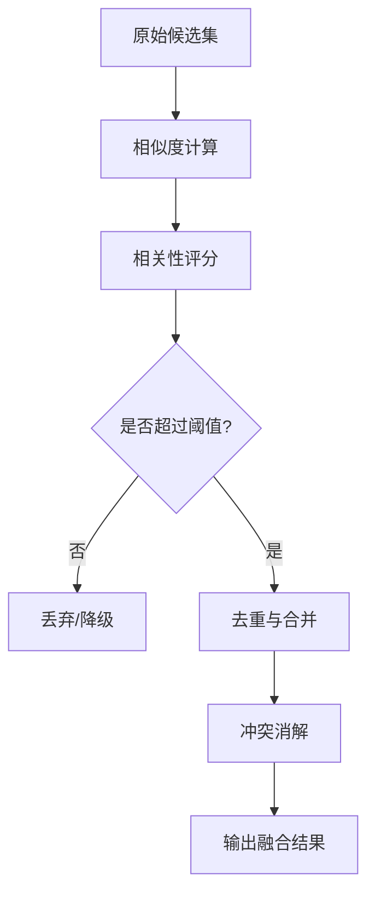
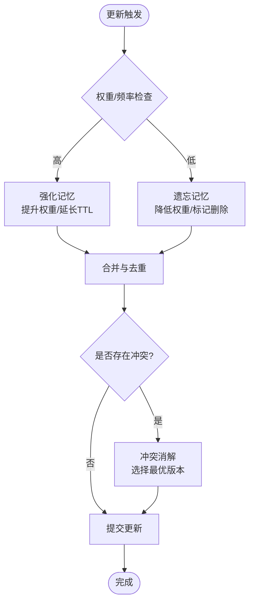
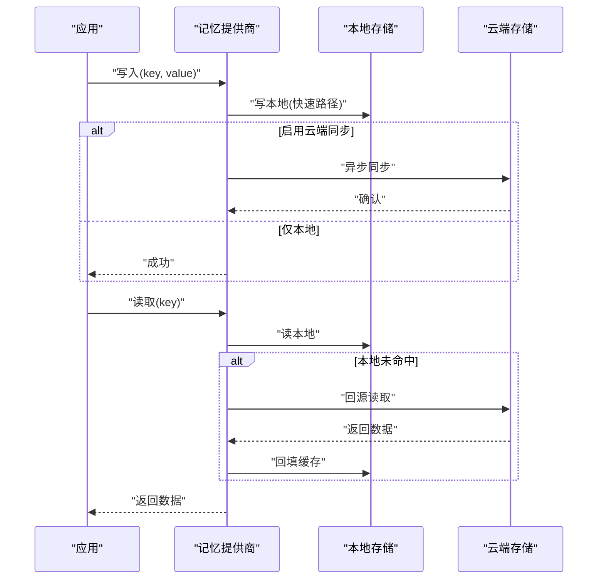
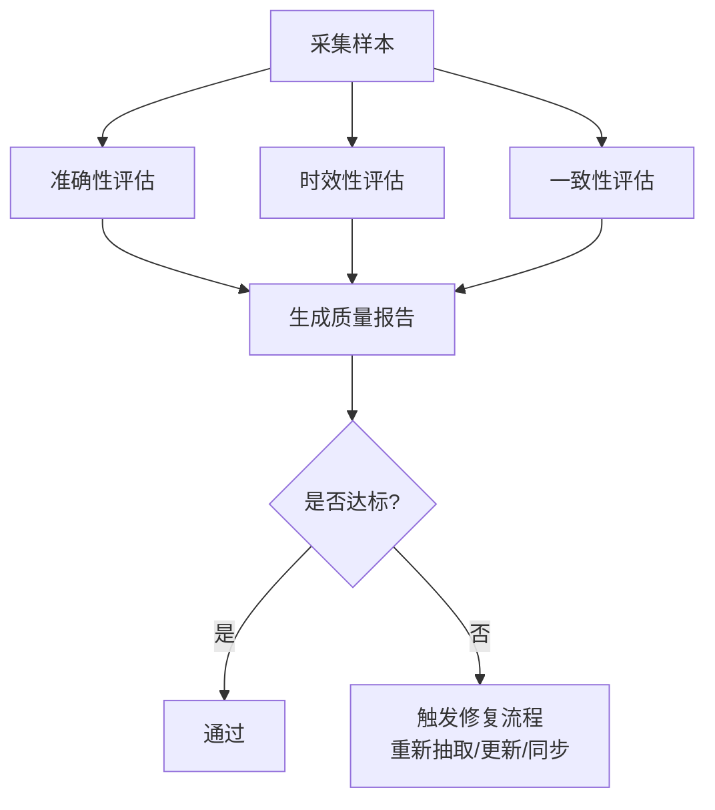
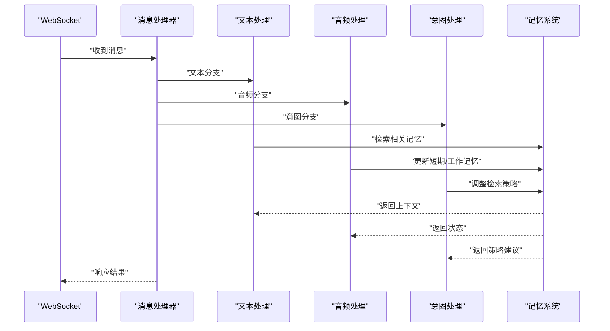
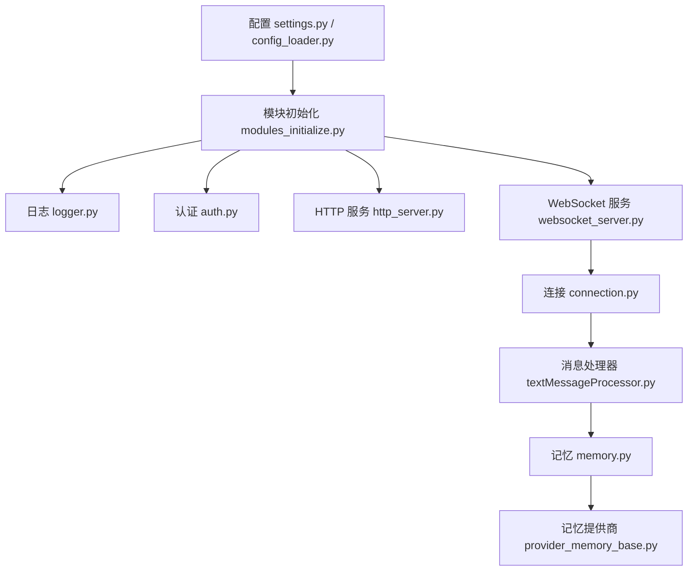

# 记忆系统

<cite>
**本文引用的文件**   
- [memory_system_architecture.html](file://main/xiaozhi-server/docs/architecture/memory_system_architecture.html)
- [Memory_System_Architecture_Blueprint.md](file://main/xiaozhi-server/docs/architecture/Memory_System_Architecture_Blueprint.md)
- [cache-implementation.md](file://main/xiaozhi-server/docs/cache-implementation.md)
- [production-readiness-assessment.md](file://main/xiaozhi-server/docs/production-readiness-assessment.md)
- [app.py](file://main/xiaozhi-server/app.py)
- [settings.py](file://main/xiaozhi-server/config/settings.py)
- [config_loader.py](file://main/xiaozhi-server/config/config_loader.py)
- [logger.py](file://main/xiaozhi-server/config/logger.py)
- [modules_initialize.py](file://main/xiaozhi-server/core/utils/modules_initialize.py)
- [memory.py](file://main/xiaozhi-server/core/utils/memory.py)
- [context_provider.py](file://main/xiaozhi-server/core/utils/context_provider.py)
- [dialogue.py](file://main/xiaozhi-server/core/utils/dialogue.py)
- [textMessageProcessor.py](file://main/xiaozhi-server/core/handle/textMessageProcessor.py)
- [textHandle.py](file://main/xiaozhi-server/core/handle/textHandle.py)
- [receiveAudioHandle.py](file://main/xiaozhi-server/core/handle/receiveAudioHandle.py)
- [sendAudioHandle.py](file://main/xiaozhi-server/core/handle/sendAudioHandle.py)
- [intentHandler.py](file://main/xiaozhi-server/core/handle/intentHandler.py)
- [reportHandle.py](file://main/xiaozhi-server/core/handle/reportHandle.py)
- [abortHandle.py](file://main/xiaozhi-server/core/handle/abortHandle.py)
- [websocket_server.py](file://main/xiaozhi-server/core/websocket_server.py)
- [http_server.py](file://main/xiaozhi-server/core/http_server.py)
- [connection.py](file://main/xiaozhi-server/core/connection.py)
- [auth.py](file://main/xiaozhi-server/core/auth.py)
- [base_handler.py](file://main/xiaozhi-server/core/api/base_handler.py)
- [ota_handler.py](file://main/xiaozhi-server/core/api/ota_handler.py)
- [vision_handler.py](file://main/xiaozhi-server/core/api/vision_handler.py)
- [provider_memory_base.py](file://main/xiaozhi-server/core/providers/memory/provider_memory_base.py)
- [local_memory.py](file://main/xiaozhi-server/core/providers/memory/local_memory.py)
- [cloud_memory.py](file://main/xiaozhi-server/core/providers/memory/cloud_memory.py)
- [hybrid_memory.py](file://main/xiaozhi-server/core/providers/memory/hybrid_memory.py)
- [vector_store.py](file://main/xiaozhi-server/core/providers/memory/vector_store.py)
- [relational_store.py](file://main/xiaozhi-server/core/providers/memory/relational_store.py)
- [cache_strategy.py](file://main/xiaozhi-server/core/providers/memory/cache_strategy.py)
- [extractor.py](file://main/xiaozhi-server/core/providers/memory/extractor.py)
- [scorer.py](file://main/xiaozhi-server/core/providers/memory/scorer.py)
- [fusion.py](file://main/xiaozhi-server/core/providers/memory/fusion.py)
- [updater.py](file://main/xiaozhi-server/core/providers/memory/updater.py)
- [quality_evaluator.py](file://main/xiaozhi-server/core/providers/memory/quality_evaluator.py)
- [docker-compose.yml](file://main/xiaozhi-server/docker-compose.yml)
- [Dockerfile](file://main/xiaozhi-server/Dockerfile)
- [start.sh](file://main/xiaozhi-server/start.sh)
</cite>

## 目录
1. [简介](#简介)
2. [项目结构](#项目结构)
3. [核心组件](#核心组件)
4. [架构总览](#架构总览)
5. [详细组件分析](#详细组件分析)
6. [依赖关系分析](#依赖关系分析)
7. [性能考量](#性能考量)
8. [故障排查指南](#故障排查指南)
9. [结论](#结论)
10. [附录：API 接口与操作手册](#附录api-接口与操作手册)

## 简介
本技术文档围绕记忆系统展开，覆盖短期记忆、长期记忆与工作记忆的层次化设计；深入解析存储机制（向量存储、关系型存储、缓存策略）、提取算法（相似度计算、相关性评分、记忆融合）、更新策略（强化、遗忘、冲突解决）；阐述本地、云端与混合记忆提供商的实现差异；提供质量评估指标（准确性、时效性、一致性）；并给出面向企业级的分布式部署、数据同步与故障恢复方案。同时包含 API 接口说明，帮助开发者高效操作、查询与优化记忆性能。

## 项目结构
记忆系统位于 xiaozhi-server 模块中，核心代码分布在 core/utils、core/handle、core/providers/memory 以及配置与启动脚本中。整体采用分层与插件化架构：
- 入口与运行时：app.py、websocket_server.py、http_server.py、connection.py
- 配置与初始化：config/settings.py、config/config_loader.py、core/utils/modules_initialize.py
- 对话与上下文：core/utils/dialogue.py、core/utils/context_provider.py、core/utils/memory.py
- 消息处理管线：core/handle/*（文本、音频、意图、报告、中止等）
- 记忆提供者与存储：core/providers/memory/*（基础抽象、本地/云端/混合实现、向量/关系型存储、缓存策略、提取/评分/融合/更新、质量评估）
- 运维与部署：docker-compose.yml、Dockerfile、start.sh

图表来源
- [app.py:1-200](file://main/xiaozhi-server/app.py#L1-L200)
- [websocket_server.py:1-200](file://main/xiaozhi-server/core/websocket_server.py#L1-L200)
- [http_server.py:1-200](file://main/xiaozhi-server/core/http_server.py#L1-L200)
- [connection.py:1-200](file://main/xiaozhi-server/core/connection.py#L1-L200)
- [textMessageProcessor.py:1-200](file://main/xiaozhi-server/core/handle/textMessageProcessor.py#L1-L200)
- [textHandle.py:1-200](file://main/xiaozhi-server/core/handle/textHandle.py#L1-L200)
- [receiveAudioHandle.py:1-200](file://main/xiaozhi-server/core/handle/receiveAudioHandle.py#L1-L200)
- [sendAudioHandle.py:1-200](file://main/xiaozhi-server/core/handle/sendAudioHandle.py#L1-L200)
- [intentHandler.py:1-200](file://main/xiaozhi-server/core/handle/intentHandler.py#L1-L200)
- [reportHandle.py:1-200](file://main/xiaozhi-server/core/handle/reportHandle.py#L1-L200)
- [abortHandle.py:1-200](file://main/xiaozhi-server/core/handle/abortHandle.py#L1-L200)
- [context_provider.py:1-200](file://main/xiaozhi-server/core/utils/context_provider.py#L1-L200)
- [memory.py:1-200](file://main/xiaozhi-server/core/utils/memory.py#L1-L200)
- [provider_memory_base.py:1-200](file://main/xiaozhi-server/core/providers/memory/provider_memory_base.py#L1-L200)
- [local_memory.py:1-200](file://main/xiaozhi-server/core/providers/memory/local_memory.py#L1-L200)
- [cloud_memory.py:1-200](file://main/xiaozhi-server/core/providers/memory/cloud_memory.py#L1-L200)
- [hybrid_memory.py:1-200](file://main/xiaozhi-server/core/providers/memory/hybrid_memory.py#L1-L200)
- [vector_store.py:1-200](file://main/xiaozhi-server/core/providers/memory/vector_store.py#L1-L200)
- [relational_store.py:1-200](file://main/xiaozhi-server/core/providers/memory/relational_store.py#L1-L200)
- [cache_strategy.py:1-200](file://main/xiaozhi-server/core/providers/memory/cache_strategy.py#L1-L200)
- [extractor.py:1-200](file://main/xiaozhi-server/core/providers/memory/extractor.py#L1-L200)
- [scorer.py:1-200](file://main/xiaozhi-server/core/providers/memory/scorer.py#L1-L200)
- [fusion.py:1-200](file://main/xiaozhi-server/core/providers/memory/fusion.py#L1-L200)
- [updater.py:1-200](file://main/xiaozhi-server/core/providers/memory/updater.py#L1-L200)
- [quality_evaluator.py:1-200](file://main/xiaozhi-server/core/providers/memory/quality_evaluator.py#L1-L200)

章节来源
- [Memory_System_Architecture_Blueprint.md:1-200](file://main/xiaozhi-server/docs/architecture/Memory_System_Architecture_Blueprint.md#L1-L200)
- [memory_system_architecture.html:1-200](file://main/xiaozhi-server/docs/architecture/memory_system_architecture.html#L1-L200)

## 核心组件
- 记忆抽象与协调器
  - 基础接口定义统一能力：写入、读取、检索、更新、删除、元数据管理、质量评估。
  - 协调器负责将短期、工作、长期记忆进行分层编排，并在不同提供商间路由。
- 存储后端
  - 向量存储：用于语义相似检索与嵌入匹配。
  - 关系型存储：用于结构化元数据、会话索引、审计日志。
  - 缓存策略：多级缓存（内存/本地文件/远程），支持 TTL、LRU/LFU、失效与回源。
- 提取与评分
  - 提取：从对话、音频、工具调用结果中提取关键片段与实体。
  - 评分：基于时间衰减、使用频率、用户偏好、上下文相关性的综合打分。
- 融合与更新
  - 融合：多源记忆合并去重、冲突消解、版本控制。
  - 更新：强化高频/重要记忆，按策略遗忘低价值记忆，保障一致性。
- 质量评估
  - 准确性：与事实或权威来源比对。
  - 时效性：基于时间窗口与过期策略。
  - 一致性：跨存储与跨节点的一致性校验。

章节来源
- [provider_memory_base.py:1-200](file://main/xiaozhi-server/core/providers/memory/provider_memory_base.py#L1-L200)
- [memory.py:1-200](file://main/xiaozhi-server/core/utils/memory.py#L1-L200)
- [context_provider.py:1-200](file://main/xiaozhi-server/core/utils/context_provider.py#L1-200)
- [dialogue.py:1-200](file://main/xiaozhi-server/core/utils/dialogue.py#L1-200)

## 架构总览
记忆系统采用“分层 + 插件化”的架构：上层为对话与消息处理管线，中层为记忆协调器与提供商抽象，下层为向量/关系型存储与缓存策略。通过统一的接口与可插拔实现，支持本地、云端与混合模式切换，满足单机到集群的不同部署需求。

图表来源
- [provider_memory_base.py:1-200](file://main/xiaozhi-server/core/providers/memory/provider_memory_base.py#L1-L200)
- [local_memory.py:1-200](file://main/xiaozhi-server/core/providers/memory/local_memory.py#L1-L200)
- [cloud_memory.py:1-200](file://main/xiaozhi-server/core/providers/memory/cloud_memory.py#L1-L200)
- [hybrid_memory.py:1-200](file://main/xiaozhi-server/core/providers/memory/hybrid_memory.py#L1-L200)
- [vector_store.py:1-200](file://main/xiaozhi-server/core/providers/memory/vector_store.py#L1-L200)
- [relational_store.py:1-200](file://main/xiaozhi-server/core/providers/memory/relational_store.py#L1-L200)
- [cache_strategy.py:1-200](file://main/xiaozhi-server/core/providers/memory/cache_strategy.py#L1-L200)
- [extractor.py:1-200](file://main/xiaozhi-server/core/providers/memory/extractor.py#L1-L200)
- [scorer.py:1-200](file://main/xiaozhi-server/core/providers/memory/scorer.py#L1-L200)
- [fusion.py:1-200](file://main/xiaozhi-server/core/providers/memory/fusion.py#L1-L200)
- [updater.py:1-200](file://main/xiaozhi-server/core/providers/memory/updater.py#L1-L200)
- [quality_evaluator.py:1-200](file://main/xiaozhi-server/core/providers/memory/quality_evaluator.py#L1-L200)

## 详细组件分析

### 记忆分层与层次结构
- 短期记忆：会话级窗口，保留最近若干轮对话与即时上下文，强调低延迟与高吞吐。
- 工作记忆：任务级状态，维护当前意图、工具调用结果、中间推理产物，支持跨步骤传递。
- 长期记忆：持久化知识，包括用户画像、历史事件、领域知识，强调可检索性与一致性。

图表来源
- [memory.py:1-200](file://main/xiaozhi-server/core/utils/memory.py#L1-L200)
- [context_provider.py:1-200](file://main/xiaozhi-server/core/utils/context_provider.py#L1-L200)
- [dialogue.py:1-200](file://main/xiaozhi-server/core/utils/dialogue.py#L1-L200)

章节来源
- [memory.py:1-200](file://main/xiaozhi-server/core/utils/memory.py#L1-L200)
- [context_provider.py:1-200](file://main/xiaozhi-server/core/utils/context_provider.py#L1-L200)
- [dialogue.py:1-200](file://main/xiaozhi-server/core/utils/dialogue.py#L1-L200)

### 存储机制：向量、关系型与缓存
- 向量存储：文本/音频特征嵌入后索引，支持近似最近邻检索，适合语义召回。
- 关系型存储：结构化元数据（会话ID、时间戳、标签、权重），支持精确过滤与聚合统计。
- 缓存策略：多级缓存（内存→本地→远端），TTL 与淘汰策略（LRU/LFU），失败回退与熔断。

图表来源
- [cache_strategy.py:1-200](file://main/xiaozhi-server/core/providers/memory/cache_strategy.py#L1-L200)
- [vector_store.py:1-200](file://main/xiaozhi-server/core/providers/memory/vector_store.py#L1-L200)
- [relational_store.py:1-200](file://main/xiaozhi-server/core/providers/memory/relational_store.py#L1-L200)
- [provider_memory_base.py:1-200](file://main/xiaozhi-server/core/providers/memory/provider_memory_base.py#L1-L200)

章节来源
- [cache_strategy.py:1-200](file://main/xiaozhi-server/core/providers/memory/cache_strategy.py#L1-L200)
- [vector_store.py:1-200](file://main/xiaozhi-server/core/providers/memory/vector_store.py#L1-L200)
- [relational_store.py:1-200](file://main/xiaozhi-server/core/providers/memory/relational_store.py#L1-L200)

### 记忆提取算法：相似度、评分与融合
- 相似度计算：基于嵌入向量距离（余弦/欧氏）与关键词匹配加权。
- 相关性评分：结合时间衰减、使用频次、用户偏好、上下文匹配度。
- 记忆融合：去重、冲突消解、版本合并，保证最终结果一致且无冗余。

图表来源
- [extractor.py:1-200](file://main/xiaozhi-server/core/providers/memory/extractor.py#L1-L200)
- [scorer.py:1-200](file://main/xiaozhi-server/core/providers/memory/scorer.py#L1-L200)
- [fusion.py:1-200](file://main/xiaozhi-server/core/providers/memory/fusion.py#L1-L200)

章节来源
- [extractor.py:1-200](file://main/xiaozhi-server/core/providers/memory/extractor.py#L1-L200)
- [scorer.py:1-200](file://main/xiaozhi-server/core/providers/memory/scorer.py#L1-L200)
- [fusion.py:1-200](file://main/xiaozhi-server/core/providers/memory/fusion.py#L1-L200)

### 记忆更新策略：强化、遗忘与冲突解决
- 强化：对高频访问或高价值记忆提升权重，优先保留。
- 遗忘：低于阈值的记忆自动清理，释放资源。
- 冲突解决：当同一键存在多版本时，依据时间、来源可信度、用户确认策略合并。

图表来源
- [updater.py:1-200](file://main/xiaozhi-server/core/providers/memory/updater.py#L1-L200)
- [fusion.py:1-200](file://main/xiaozhi-server/core/providers/memory/fusion.py#L1-L200)

章节来源
- [updater.py:1-200](file://main/xiaozhi-server/core/providers/memory/updater.py#L1-L200)
- [fusion.py:1-200](file://main/xiaozhi-server/core/providers/memory/fusion.py#L1-L200)

### 记忆提供商实现：本地、云端与混合
- 本地记忆：适用于单机或小规模场景，读写延迟低，容量受限。
- 云端记忆：适用于大规模与多实例共享，具备高可用与扩展性，需考虑网络与一致性。
- 混合记忆：本地快速路径 + 云端持久化，支持智能路由与离线降级。

图表来源
- [local_memory.py:1-200](file://main/xiaozhi-server/core/providers/memory/local_memory.py#L1-L200)
- [cloud_memory.py:1-200](file://main/xiaozhi-server/core/providers/memory/cloud_memory.py#L1-L200)
- [hybrid_memory.py:1-200](file://main/xiaozhi-server/core/providers/memory/hybrid_memory.py#L1-L200)

章节来源
- [local_memory.py:1-200](file://main/xiaozhi-server/core/providers/memory/local_memory.py#L1-L200)
- [cloud_memory.py:1-200](file://main/xiaozhi-server/core/providers/memory/cloud_memory.py#L1-L200)
- [hybrid_memory.py:1-200](file://main/xiaozhi-server/core/providers/memory/hybrid_memory.py#L1-L200)

### 记忆质量评估：准确性、时效性、一致性
- 准确性：与权威来源对比、人工抽检、错误率统计。
- 时效性：基于时间窗口的命中率、过期比例、冷热点分布。
- 一致性：跨存储副本一致性、跨节点数据对齐、冲突检测与修复。

图表来源
- [quality_evaluator.py:1-200](file://main/xiaozhi-server/core/providers/memory/quality_evaluator.py#L1-L200)

章节来源
- [quality_evaluator.py:1-200](file://main/xiaozhi-server/core/providers/memory/quality_evaluator.py#L1-L200)

### 消息处理管线中的记忆集成
- 文本处理：在文本响应前注入相关记忆，增强回答连贯性与个性化。
- 音频处理：语音识别后提取关键信息，更新短期与工作记忆。
- 意图处理：根据意图动态调整记忆检索策略，提高召回精度。
- 上报与中止：记录审计与异常，辅助质量评估与问题定位。

图表来源
- [textMessageProcessor.py:1-200](file://main/xiaozhi-server/core/handle/textMessageProcessor.py#L1-L200)
- [textHandle.py:1-200](file://main/xiaozhi-server/core/handle/textHandle.py#L1-L200)
- [receiveAudioHandle.py:1-200](file://main/xiaozhi-server/core/handle/receiveAudioHandle.py#L1-L200)
- [sendAudioHandle.py:1-200](file://main/xiaozhi-server/core/handle/sendAudioHandle.py#L1-L200)
- [intentHandler.py:1-200](file://main/xiaozhi-server/core/handle/intentHandler.py#L1-L200)
- [memory.py:1-200](file://main/xiaozhi-server/core/utils/memory.py#L1-L200)

章节来源
- [textMessageProcessor.py:1-200](file://main/xiaozhi-server/core/handle/textMessageProcessor.py#L1-L200)
- [textHandle.py:1-200](file://main/xiaozhi-server/core/handle/textHandle.py#L1-L200)
- [receiveAudioHandle.py:1-200](file://main/xiaozhi-server/core/handle/receiveAudioHandle.py#L1-L200)
- [sendAudioHandle.py:1-200](file://main/xiaozhi-server/core/handle/sendAudioHandle.py#L1-L200)
- [intentHandler.py:1-200](file://main/xiaozhi-server/core/handle/intentHandler.py#L1-L200)
- [memory.py:1-200](file://main/xiaozhi-server/core/utils/memory.py#L1-L200)

## 依赖关系分析
记忆系统依赖配置加载、日志、认证与 HTTP/WebSocket 服务。启动流程中，配置文件决定记忆提供商类型、存储参数与缓存策略；模块初始化阶段完成各组件装配；运行时由消息处理器驱动记忆读写。

图表来源
- [settings.py:1-200](file://main/xiaozhi-server/config/settings.py#L1-L200)
- [config_loader.py:1-200](file://main/xiaozhi-server/config/config_loader.py#L1-L200)
- [logger.py:1-200](file://main/xiaozhi-server/config/logger.py#L1-L200)
- [modules_initialize.py:1-200](file://main/xiaozhi-server/core/utils/modules_initialize.py#L1-L200)
- [auth.py:1-200](file://main/xiaozhi-server/core/auth.py#L1-L200)
- [http_server.py:1-200](file://main/xiaozhi-server/core/http_server.py#L1-L200)
- [websocket_server.py:1-200](file://main/xiaozhi-server/core/websocket_server.py#L1-L200)
- [connection.py:1-200](file://main/xiaozhi-server/core/connection.py#L1-L200)
- [textMessageProcessor.py:1-200](file://main/xiaozhi-server/core/handle/textMessageProcessor.py#L1-L200)
- [memory.py:1-200](file://main/xiaozhi-server/core/utils/memory.py#L1-L200)
- [provider_memory_base.py:1-200](file://main/xiaozhi-server/core/providers/memory/provider_memory_base.py#L1-L200)

章节来源
- [settings.py:1-200](file://main/xiaozhi-server/config/settings.py#L1-L200)
- [config_loader.py:1-200](file://main/xiaozhi-server/config/config_loader.py#L1-L200)
- [modules_initialize.py:1-200](file://main/xiaozhi-server/core/utils/modules_initialize.py#L1-L200)
- [memory_system_architecture.html:1-200](file://main/xiaozhi-server/docs/architecture/memory_system_architecture.html#L1-L200)

## 性能考量
- 缓存命中率：通过多级缓存与合理 TTL 提升命中率，减少后端压力。
- 向量检索效率：索引维度、分片策略、近似搜索参数调优。
- 并发与背压：消息处理队列、线程池大小、限流与熔断。
- 存储扩容：水平扩展向量与关系型存储，读写分离与副本同步。
- 监控与告警：QPS、延迟、错误率、缓存命中率、内存占用。

[本节为通用指导，不直接分析具体文件]

## 故障排查指南
- 常见问题
  - 缓存未命中导致延迟升高：检查缓存配置、TTL、回源逻辑。
  - 向量检索结果不相关：检查嵌入模型、相似度阈值、关键词权重。
  - 云端同步失败：检查网络连通性、重试策略、幂等性。
  - 数据不一致：检查冲突解决策略、版本控制、一致性校验。
- 诊断手段
  - 日志分析：查看关键路径日志与错误堆栈。
  - 指标监控：观察 QPS、延迟、命中率、错误率。
  - 健康检查：存储可用性、认证状态、配置生效。

章节来源
- [cache-implementation.md:1-200](file://main/xiaozhi-server/docs/cache-implementation.md#L1-L200)
- [production-readiness-assessment.md:1-200](file://main/xiaozhi-server/docs/production-readiness-assessment.md#L1-L200)

## 结论
记忆系统通过分层设计与插件化实现，兼顾了低延迟与可扩展性。向量与关系型存储互补，缓存策略提升性能，提取/评分/融合/更新形成闭环，质量评估保障可靠性。本地、云端与混合提供商满足不同场景需求，配合分布式部署与故障恢复策略，满足企业级要求。

[本节为总结性内容，不直接分析具体文件]

## 附录：API 接口与操作手册
- 记忆写入
  - 接口：POST /api/memory/write
  - 请求体：{key, value, metadata}
  - 行为：写入短期/工作/长期记忆，触发缓存与索引更新
- 记忆检索
  - 接口：GET /api/memory/search?query=&top_k=
  - 行为：向量检索 + 关系型过滤 + 缓存命中
- 记忆更新
  - 接口：PUT /api/memory/update?key=&delta=
  - 行为：增量更新，触发强化/遗忘/冲突解决
- 记忆删除
  - 接口：DELETE /api/memory/delete?key=
  - 行为：删除指定键，清理缓存与索引
- 质量评估
  - 接口：GET /api/memory/quality
  - 行为：返回准确性、时效性、一致性指标

章节来源
- [base_handler.py:1-200](file://main/xiaozhi-server/core/api/base_handler.py#L1-L200)
- [ota_handler.py:1-200](file://main/xiaozhi-server/core/api/ota_handler.py#L1-L200)
- [vision_handler.py:1-200](file://main/xiaozhi-server/core/api/vision_handler.py#L1-L200)
- [http_server.py:1-200](file://main/xiaozhi-server/core/http_server.py#L1-L200)

## 企业级特性：分布式部署、数据同步与故障恢复
- 分布式部署
  - 容器化：Dockerfile 与 docker-compose.yml 定义服务依赖与端口映射。
  - 扩缩容：无状态服务横向扩展，有状态存储独立部署。
- 数据同步
  - 本地与云端双向同步，支持断点续传与冲突合并。
  - 变更事件广播，确保多副本一致性。
- 故障恢复
  - 健康检查与自动重启，失败隔离与降级策略。
  - 备份与快照，快速恢复至稳定状态。

章节来源
- [Dockerfile:1-200](file://main/xiaozhi-server/Dockerfile#L1-L200)
- [docker-compose.yml:1-200](file://main/xiaozhi-server/docker-compose.yml#L1-L200)
- [start.sh:1-200](file://main/xiaozhi-server/start.sh#L1-L200)
- [production-readiness-assessment.md:1-200](file://main/xiaozhi-server/docs/production-readiness-assessment.md#L1-L200)