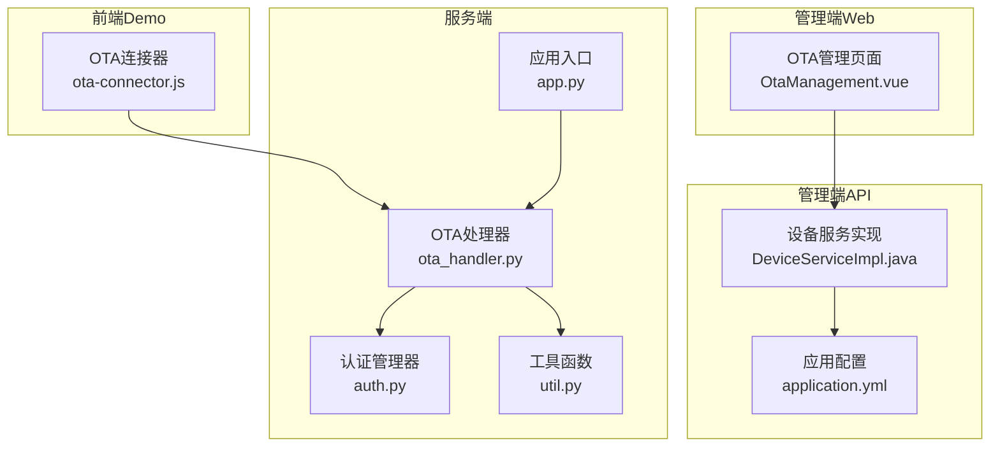
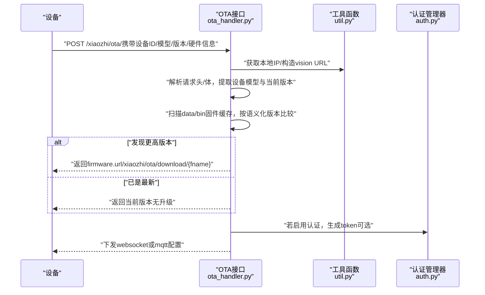
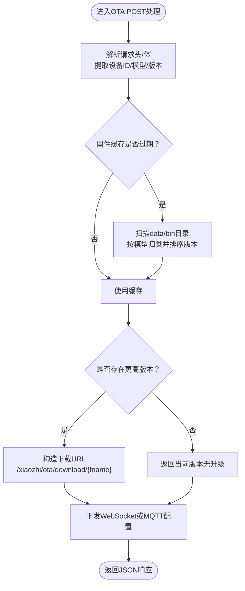
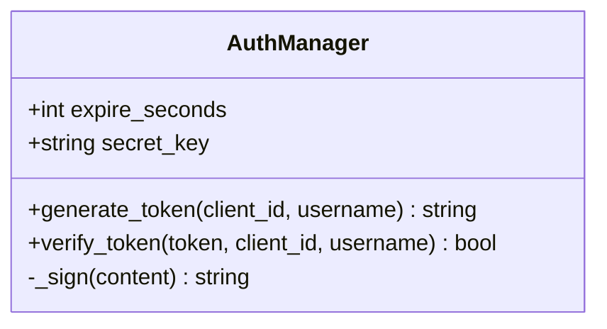
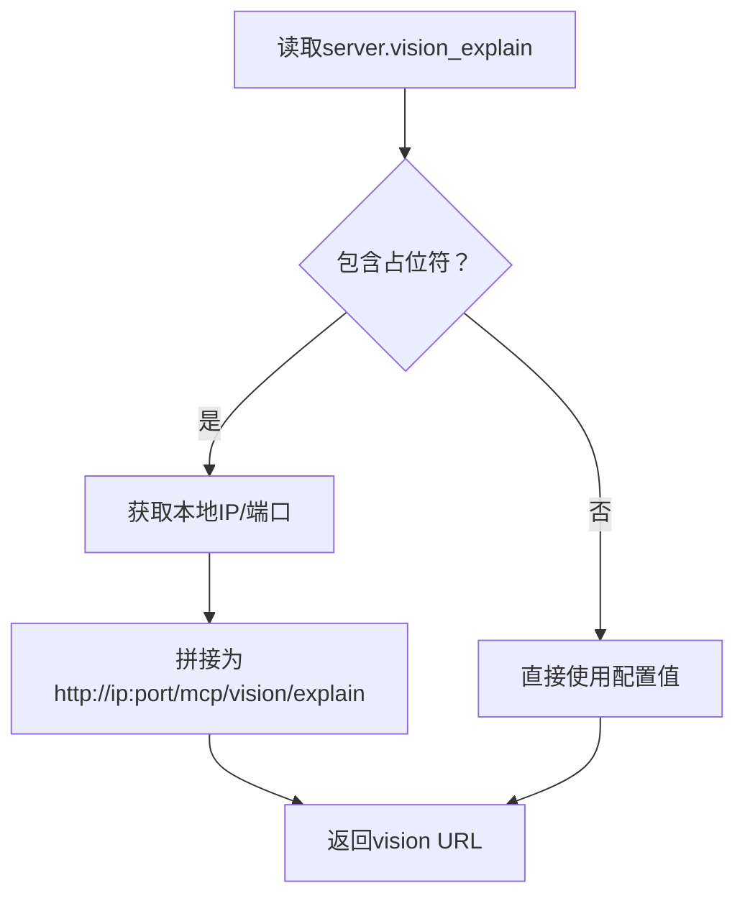
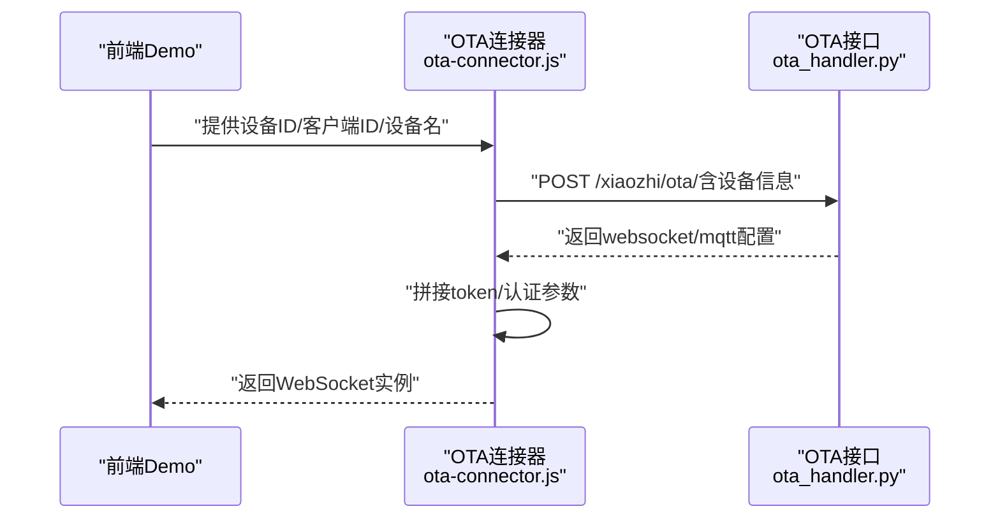
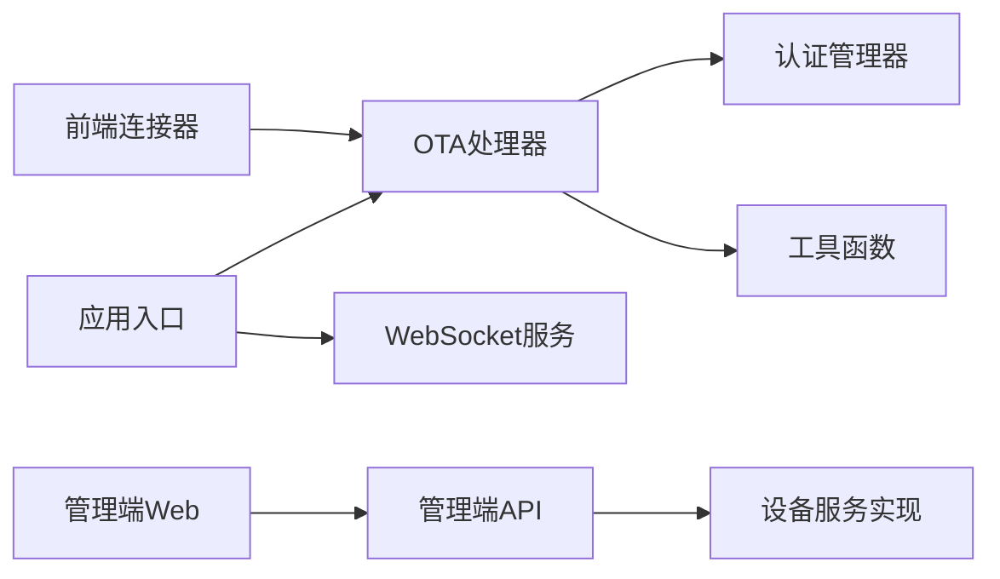
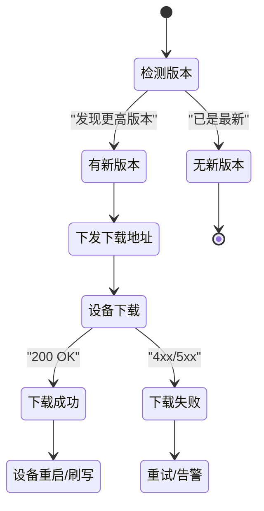

# OTA升级管理

<cite>
**本文引用的文件**
- [ota_handler.py](file://main/xiaozhi-server/core/api/ota_handler.py)
- [auth.py](file://main/xiaozhi-server/core/auth.py)
- [util.py](file://main/xiaozhi-server/core/utils/util.py)
- [app.py](file://main/xiaozhi-server/app.py)
- [ota-connector.js](file://main/demo-web/js/core/network/ota-connector.js)
- [OtaManagement.vue](file://main/manager-web/src/views/OtaManagement.vue)
- [DeviceServiceImpl.java](file://main/manager-api/src/main/java/xiaozhi/modules/device/service/impl/DeviceServiceImpl.java)
- [application.yml](file://main/manager-api/src/main/resources/application.yml)
- [ota-upgrade-guide.md](file://docs/ota-upgrade-guide.md)
</cite>

## 目录
1. [简介](#简介)
2. [项目结构](#项目结构)
3. [核心组件](#核心组件)
4. [架构总览](#架构总览)
5. [详细组件分析](#详细组件分析)
6. [依赖关系分析](#依赖关系分析)
7. [性能考量](#性能考量)
8. [故障排查指南](#故障排查指南)
9. [结论](#结论)
10. [附录](#附录)

## 简介
本文件面向小智ESP32服务器的OTA升级管理模块，系统化阐述固件版本管理、升级包发布与设备升级流程，覆盖升级任务的创建、调度与监控机制，升级进度跟踪、状态反馈与异常处理策略，以及批量升级、灰度发布与回滚的实现思路。同时，结合现有代码实现，给出签名验证、完整性检查与安全加固建议，并提供成功率统计与失败原因分析及优化建议。

## 项目结构
OTA升级管理涉及前后端与服务端协同：
- 服务端Python模块负责OTA接口、固件缓存与下载、认证与签名、WebSocket地址下发；
- Demo前端通过OTA连接器向OTA接口发起握手，获取WebSocket地址并建立长连接；
- 管理端Web提供固件列表与下载链接管理；
- Java后端服务负责设备上报、固件匹配与WebSocket/MQTT下发。

图表来源
- [ota_handler.py:46-353](file://main/xiaozhi-server/core/api/ota_handler.py#L46-L353)
- [auth.py:13-73](file://main/xiaozhi-server/core/auth.py#L13-L73)
- [util.py:522-537](file://main/xiaozhi-server/core/utils/util.py#L522-L537)
- [app.py:78-83](file://main/xiaozhi-server/app.py#L78-L83)
- [ota-connector.js:4-49](file://main/demo-web/js/core/network/ota-connector.js#L4-L49)
- [OtaManagement.vue:173-202](file://main/manager-web/src/views/OtaManagement.vue#L173-L202)
- [DeviceServiceImpl.java:200-291](file://main/manager-api/src/main/java/xiaozhi/modules/device/service/impl/DeviceServiceImpl.java#L200-L291)
- [application.yml:1-66](file://main/manager-api/src/main/resources/application.yml#L1-L66)

章节来源
- [ota_handler.py:46-353](file://main/xiaozhi-server/core/api/ota_handler.py#L46-L353)
- [app.py:78-97](file://main/xiaozhi-server/app.py#L78-L97)

## 核心组件
- OTA处理器：负责解析设备上报、匹配固件版本、生成下载地址、下发WebSocket/MQTT配置、处理固件下载请求。
- 认证管理器：基于HMAC-SHA256生成与校验token，支持过期时间控制。
- 工具函数：提供本地IP获取、vision URL构造、版本比较等通用能力。
- 应用入口：启动HTTP与WebSocket服务，打印接口地址，统一管理生命周期。
- 前端连接器：向OTA接口发送握手请求，解析响应中的WebSocket配置并建立连接。
- 管理端页面：展示固件列表、分页与搜索、批量操作与下载链接生成。
- 设备服务实现：根据设备绑定状态与自动升级开关，返回固件信息与WebSocket/MQTT配置。

章节来源
- [ota_handler.py:46-353](file://main/xiaozhi-server/core/api/ota_handler.py#L46-L353)
- [auth.py:13-73](file://main/xiaozhi-server/core/auth.py#L13-L73)
- [util.py:522-537](file://main/xiaozhi-server/core/utils/util.py#L522-L537)
- [app.py:78-97](file://main/xiaozhi-server/app.py#L78-L97)
- [ota-connector.js:4-49](file://main/demo-web/js/core/network/ota-connector.js#L4-L49)
- [OtaManagement.vue:173-202](file://main/manager-web/src/views/OtaManagement.vue#L173-L202)
- [DeviceServiceImpl.java:200-291](file://main/manager-api/src/main/java/xiaozhi/modules/device/service/impl/DeviceServiceImpl.java#L200-L291)

## 架构总览
OTA升级管理采用“服务端接口 + 前端握手 + 管理端发布”的三层协作模式：
- 设备侧通过OTA接口上报自身信息，服务端匹配固件并下发下载地址与通信通道；
- 前端Demo通过OTA连接器完成握手，获取WebSocket地址并建立长连接；
- 管理端Web提供固件上传与列表管理，Java后端按设备维度下发升级策略。

图表来源
- [ota_handler.py:143-353](file://main/xiaozhi-server/core/api/ota_handler.py#L143-L353)
- [util.py:522-537](file://main/xiaozhi-server/core/utils/util.py#L522-L537)
- [auth.py:36-50](file://main/xiaozhi-server/core/auth.py#L36-L50)

## 详细组件分析

### OTA处理器（固件版本管理与下发）
- 版本解析与比较：支持语义化版本字符串解析与逐段数值比较，确保升级决策准确。
- 固件缓存：扫描data/bin目录，按“模型_版本.bin”命名规则解析固件，按版本降序缓存，带TTL控制。
- 下发策略：优先从请求头提取设备模型与版本，其次从请求体解析；若发现更高版本，替换下载路径为“/xiaozhi/ota/download/{fname}”，并返回给设备。
- 通信通道：若配置MQTT网关则下发MQTT参数；否则下发WebSocket地址与可选token。
- 安全与合规：下载接口严格限制文件名模式与路径越权，仅允许data/bin目录内文件。

图表来源
- [ota_handler.py:66-104](file://main/xiaozhi-server/core/api/ota_handler.py#L66-L104)
- [ota_handler.py:300-335](file://main/xiaozhi-server/core/api/ota_handler.py#L300-L335)
- [ota_handler.py:282-298](file://main/xiaozhi-server/core/api/ota_handler.py#L282-L298)

章节来源
- [ota_handler.py:66-104](file://main/xiaozhi-server/core/api/ota_handler.py#L66-L104)
- [ota_handler.py:300-335](file://main/xiaozhi-server/core/api/ota_handler.py#L300-L335)
- [ota_handler.py:282-298](file://main/xiaozhi-server/core/api/ota_handler.py#L282-L298)

### 认证管理器（token生成与校验）
- 生成：基于client_id、username与时间戳拼接，经HMAC-SHA256签名并Base64编码，附加时间戳形成token。
- 校验：验证时间戳未过期、签名一致，避免重放攻击。
- 应用：在WebSocket握手时作为Authorization携带，或在MQTT场景中生成密码。

图表来源
- [auth.py:13-73](file://main/xiaozhi-server/core/auth.py#L13-L73)

章节来源
- [auth.py:13-73](file://main/xiaozhi-server/core/auth.py#L13-L73)

### 工具函数（本地IP与vision URL）
- 本地IP：通过UDP连接探测获取，兼容IPv4/IPv6私有地址判断。
- vision URL：从配置读取，若包含占位符则动态拼接本地IP与端口，保证设备可访问。

图表来源
- [util.py:20-29](file://main/xiaozhi-server/core/utils/util.py#L20-L29)
- [util.py:522-537](file://main/xiaozhi-server/core/utils/util.py#L522-L537)

章节来源
- [util.py:20-29](file://main/xiaozhi-server/core/utils/util.py#L20-L29)
- [util.py:522-537](file://main/xiaozhi-server/core/utils/util.py#L522-L537)

### 应用入口（服务启动与生命周期）
- 启动HTTP与WebSocket服务，打印OTA与视觉分析接口地址，便于调试与联调。
- 统一管理任务取消与资源释放，确保优雅停机。

章节来源
- [app.py:78-97](file://main/xiaozhi-server/app.py#L78-L97)
- [app.py:132-151](file://main/xiaozhi-server/app.py#L132-L151)

### 前端连接器（握手与连接）
- 校验配置（设备MAC、客户端ID）；
- 向OTA接口发送POST请求，携带设备硬件与应用信息；
- 从响应中提取WebSocket配置，拼接token与认证参数，建立WebSocket连接。

图表来源
- [ota-connector.js:4-49](file://main/demo-web/js/core/network/ota-connector.js#L4-L49)
- [ota_handler.py:143-353](file://main/xiaozhi-server/core/api/ota_handler.py#L143-L353)

章节来源
- [ota-connector.js:4-49](file://main/demo-web/js/core/network/ota-connector.js#L4-L49)
- [ota_handler.py:143-353](file://main/xiaozhi-server/core/api/ota_handler.py#L143-L353)

### 管理端页面（固件列表与下载）
- 列表展示固件名称、类型、版本、大小、备注、创建/更新时间；
- 支持搜索、分页、全选与批量删除；
- 下载链接通过后端接口生成，前端打开下载地址。

章节来源
- [OtaManagement.vue:173-202](file://main/manager-web/src/views/OtaManagement.vue#L173-L202)

### 设备服务实现（设备上报与策略下发）
- 设备未绑定：返回当前应用版本与无效固件URL，兼容旧固件；
- 设备已绑定且自动升级开启：按设备板型与当前版本构建固件信息；
- 下发WebSocket地址（支持多地址随机选择）与可选token；
- 若配置MQTT网关：下发MQTT参数。

章节来源
- [DeviceServiceImpl.java:200-291](file://main/manager-api/src/main/java/xiaozhi/modules/device/service/impl/DeviceServiceImpl.java#L200-L291)

## 依赖关系分析
- OTA处理器依赖认证管理器与工具函数，用于token生成与vision URL构造；
- 应用入口同时启动HTTP与WebSocket服务，分别承载OTA接口与实时通信；
- 前端连接器依赖OTA接口返回的WebSocket配置；
- 管理端Web与Java后端通过REST接口交互，Java后端负责设备维度策略下发。

图表来源
- [ota_handler.py:46-353](file://main/xiaozhi-server/core/api/ota_handler.py#L46-L353)
- [auth.py:13-73](file://main/xiaozhi-server/core/auth.py#L13-L73)
- [util.py:522-537](file://main/xiaozhi-server/core/utils/util.py#L522-L537)
- [app.py:78-83](file://main/xiaozhi-server/app.py#L78-L83)
- [ota-connector.js:4-49](file://main/demo-web/js/core/network/ota-connector.js#L4-L49)
- [DeviceServiceImpl.java:200-291](file://main/manager-api/src/main/java/xiaozhi/modules/device/service/impl/DeviceServiceImpl.java#L200-L291)

章节来源
- [ota_handler.py:46-353](file://main/xiaozhi-server/core/api/ota_handler.py#L46-L353)
- [auth.py:13-73](file://main/xiaozhi-server/core/auth.py#L13-L73)
- [util.py:522-537](file://main/xiaozhi-server/core/utils/util.py#L522-L537)
- [app.py:78-83](file://main/xiaozhi-server/app.py#L78-L83)
- [ota-connector.js:4-49](file://main/demo-web/js/core/network/ota-connector.js#L4-L49)
- [DeviceServiceImpl.java:200-291](file://main/manager-api/src/main/java/xiaozhi/modules/device/service/impl/DeviceServiceImpl.java#L200-L291)

## 性能考量
- 固件缓存：默认30秒TTL，减少频繁扫描磁盘；可通过配置调整，平衡实时性与性能。
- 版本比较：语义化版本解析与元组比较，复杂度与版本段数线性相关，建议控制版本号长度。
- 下载接口：使用FileResponse流式传输，避免一次性加载至内存。
- 并发与连接：WebSocket服务与HTTP服务分离，降低相互影响；合理设置线程池与连接上限。

章节来源
- [ota_handler.py:66-104](file://main/xiaozhi-server/core/api/ota_handler.py#L66-L104)
- [ota_handler.py:372-415](file://main/xiaozhi-server/core/api/ota_handler.py#L372-L415)
- [application.yml:1-66](file://main/manager-api/src/main/resources/application.yml#L1-L66)

## 故障排查指南
- 设备收不到固件更新
  - 检查固件命名是否符合“{型号}_{版本号}.bin”；
  - 确认固件位于data/bin目录；
  - 确认设备型号与固件文件名中的型号一致；
  - 确认固件版本高于设备当前版本；
  - 查看服务器日志确认OTA请求处理与缓存刷新。
- 下载地址无法访问
  - 检查server.vision_explain配置是否正确；
  - 确认端口与网络可达性；
  - Docker部署避免使用127.0.0.1或localhost；
  - 若使用反向代理，填写对外地址与端口。
- 固件放置后未生效
  - 等待缓存TTL到期或重启服务；
  - 调整firmware_cache_ttl配置缩短生效时间。
- WebSocket连接失败
  - 确认前端已正确拼接token与认证参数；
  - 检查服务端WebSocket端口与地址配置；
  - 查看服务端日志定位异常。

章节来源
- [ota-upgrade-guide.md:106-142](file://docs/ota-upgrade-guide.md#L106-L142)
- [ota_handler.py:355-370](file://main/xiaozhi-server/core/api/ota_handler.py#L355-L370)
- [ota-connector.js:24-48](file://main/demo-web/js/core/network/ota-connector.js#L24-L48)

## 结论
本OTA升级管理模块以简洁的接口与清晰的职责划分实现了固件版本管理与下发，结合认证与安全策略，满足单模块部署场景下的自动升级需求。通过固件缓存、流式下载与WebSocket长连接，兼顾性能与实时性。建议在生产环境进一步完善升级任务调度、灰度发布与回滚策略，并强化签名与完整性校验以提升安全性。

## 附录

### 升级流程与状态反馈（概念图）

[本图为概念示意，无需图表来源]

### 安全加固建议
- 固件签名与校验：在下载接口增加SHA256摘要校验与签名验证，防止篡改。
- 完整性检查：设备侧在刷写前校验下载文件的哈希值与长度。
- 传输加密：建议使用HTTPS与WSS，避免明文传输。
- 白名单与鉴权：结合设备白名单与token校验，限制非法设备接入。
- 回滚策略：在升级前备份当前固件，失败时自动回滚至上一版本。

[本节为通用建议，无需章节来源]