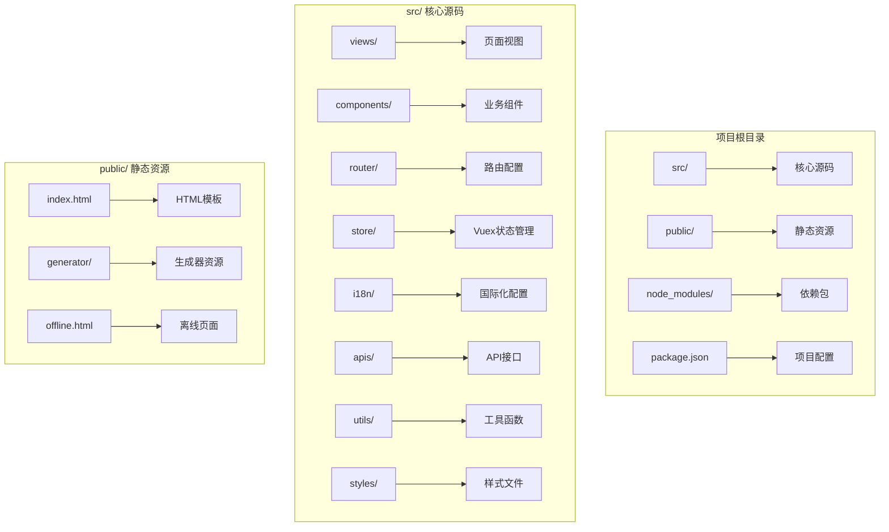
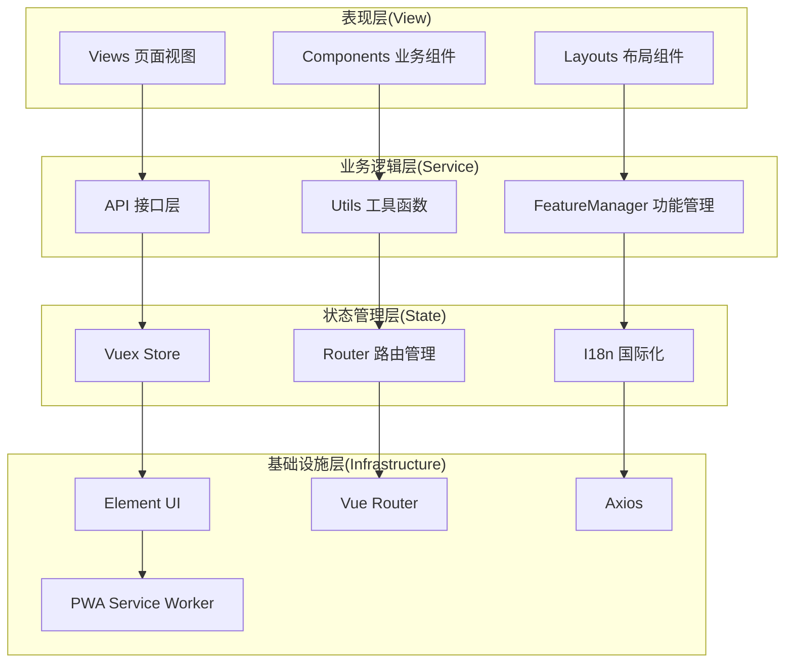
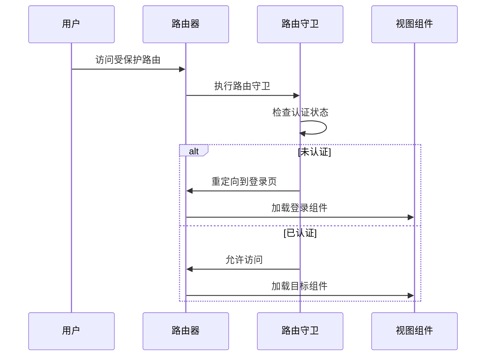
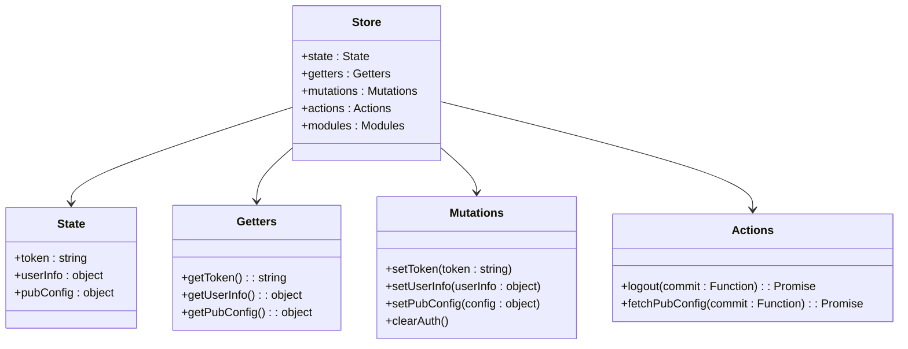
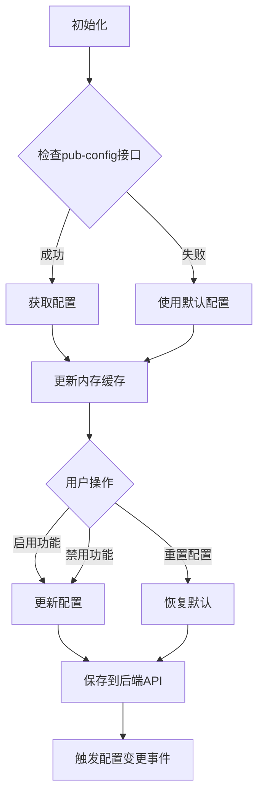
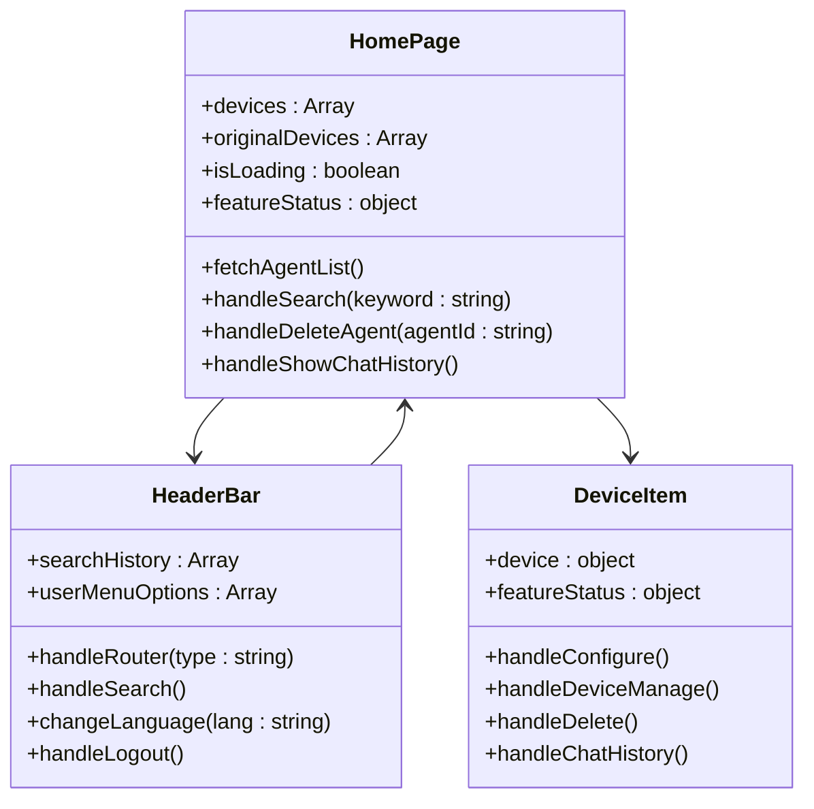
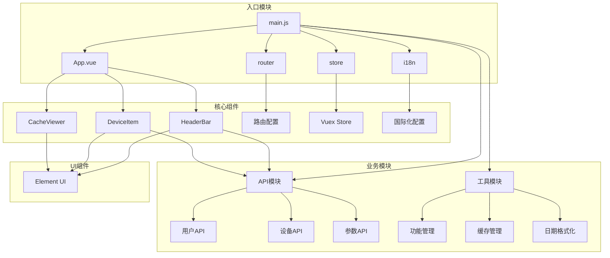
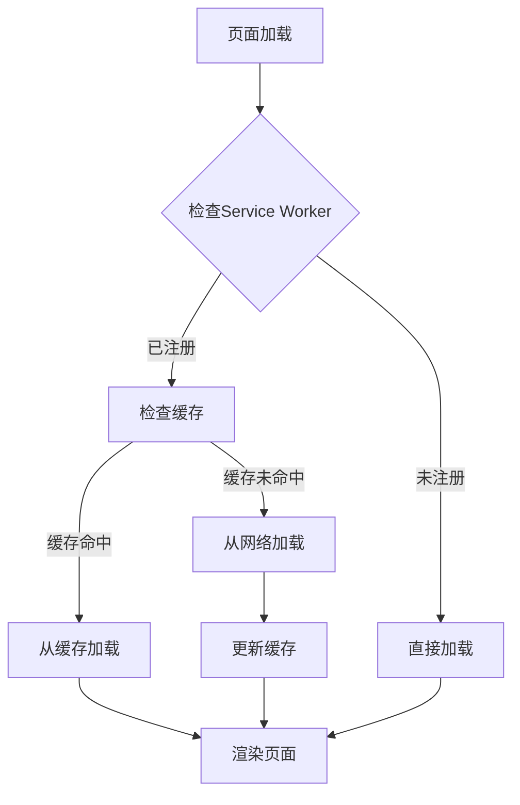

# Web管理界面

<cite>
**本文档引用的文件**
- [package.json](file://main/manager-web/package.json)
- [vue.config.js](file://main/manager-web/vue.config.js)
- [main.js](file://main/manager-web/src/main.js)
- [App.vue](file://main/manager-web/src/App.vue)
- [router/index.js](file://main/manager-web/src/router/index.js)
- [store/index.js](file://main/manager-web/src/store/index.js)
- [i18n/index.js](file://main/manager-web/src/i18n/index.js)
- [views/home.vue](file://main/manager-web/src/views/home.vue)
- [components/HeaderBar.vue](file://main/manager-web/src/components/HeaderBar.vue)
- [apis/api.js](file://main/manager-web/src/apis/api.js)
- [utils/featureManager.js](file://main/manager-web/src/utils/featureManager.js)
- [styles/global.scss](file://main/manager-web/src/styles/global.scss)
- [i18n/zh_CN.js](file://main/manager-web/src/i18n/zh_CN.js)
- [i18n/en.js](file://main/manager-web/src/i18n/en.js)
- [public/index.html](file://main/manager-web/public/index.html)
- [registerServiceWorker.js](file://main/manager-web/src/registerServiceWorker.js)
</cite>

## 目录
1. [简介](#简介)
2. [项目结构](#项目结构)
3. [核心组件](#核心组件)
4. [架构概览](#架构概览)
5. [详细组件分析](#详细组件分析)
6. [依赖关系分析](#依赖关系分析)
7. [性能考虑](#性能考虑)
8. [故障排除指南](#故障排除指南)
9. [结论](#结论)
10. [附录](#附录)

## 简介

小智ESP32服务器的Web管理界面是一个基于Vue.js 2.6.14的单页应用(SPA)，采用Element UI组件库构建。该系统提供了完整的设备管理、用户管理、参数配置等功能模块，支持多语言国际化和响应式设计。

系统采用前后端分离架构，前端负责用户界面展示和交互逻辑，后端提供RESTful API接口。通过Vue Router实现客户端路由管理，Vuex进行状态管理，Element UI提供丰富的UI组件库。

## 项目结构

小智Web管理界面位于`main/manager-web`目录下，采用标准的Vue CLI项目结构：



**图表来源**
- [package.json:1-51](file://main/manager-web/package.json#L1-L51)
- [vue.config.js:1-182](file://main/manager-web/vue.config.js#L1-L182)

**章节来源**
- [package.json:1-51](file://main/manager-web/package.json#L1-L51)
- [vue.config.js:1-182](file://main/manager-web/vue.config.js#L1-L182)

## 核心组件

### 技术栈架构

系统采用现代化的前端技术栈，主要技术组件包括：

- **Vue.js 2.6.14**: 核心框架，提供响应式数据绑定和组件化开发
- **Element UI 2.15.14**: 前端UI组件库，提供丰富的交互组件
- **Vue Router 3.6.5**: 客户端路由管理，支持单页应用的页面导航
- **Vuex 3.6.2**: 状态管理模式，集中管理应用的所有组件状态
- **Vue I18n 8.28.2**: 国际化插件，支持多语言切换
- **Axios**: HTTP客户端，用于API请求处理

### 构建配置

项目使用Vue CLI 5.0进行构建管理，配置了多种优化策略：

- **CDN资源加载**: 支持通过CDN加速第三方依赖包的加载
- **代码分割**: 自动进行代码分割，提升首屏加载性能
- **Gzip压缩**: 生产环境启用Gzip压缩，减小传输体积
- **Service Worker**: 支持PWA功能，提供离线缓存能力

**章节来源**
- [package.json:10-39](file://main/manager-web/package.json#L10-L39)
- [vue.config.js:41-182](file://main/manager-web/vue.config.js#L41-L182)

## 架构概览

小智Web管理界面采用分层架构设计，各层职责清晰：



**图表来源**
- [main.js:1-30](file://main/manager-web/src/main.js#L1-L30)
- [router/index.js:1-250](file://main/manager-web/src/router/index.js#L1-L250)
- [store/index.js:1-77](file://main/manager-web/src/store/index.js#L1-L77)

## 详细组件分析

### 路由系统

系统采用Vue Router实现客户端路由管理，支持动态导入和路由守卫：



**图表来源**
- [router/index.js:234-247](file://main/manager-web/src/router/index.js#L234-L247)

系统路由配置包含以下主要页面：

| 路由路径 | 组件名称 | 功能描述 |
|---------|----------|----------|
| `/` | welcome | 欢迎页面 |
| `/login` | login | 用户登录 |
| `/home` | home | 主页仪表板 |
| `/device-management` | DeviceManagement | 设备管理 |
| `/user-management` | UserManagement | 用户管理 |
| `/params-management` | ParamsManagement | 参数管理 |
| `/knowledge-base-management` | KnowledgeBaseManagement | 知识库管理 |

**章节来源**
- [router/index.js:6-211](file://main/manager-web/src/router/index.js#L6-L211)

### 状态管理系统

系统使用Vuex进行集中状态管理，包含以下核心状态：



**图表来源**
- [store/index.js:9-77](file://main/manager-web/src/store/index.js#L9-L77)

状态管理特性：
- **认证状态**: 存储JWT令牌和用户信息
- **公共配置**: 系统配置和功能开关
- **持久化存储**: 自动同步到localStorage
- **响应式更新**: 通过Vuex实现组件间状态共享

**章节来源**
- [store/index.js:10-74](file://main/manager-web/src/store/index.js#L10-L74)

### 国际化系统

系统支持多语言国际化，包含以下语言：

| 语言代码 | 语言名称 | 文件名 |
|---------|----------|--------|
| zh_CN | 中文简体 | zh_CN.js |
| zh_TW | 中文繁体 | zh_TW.js |
| en | 英语 | en.js |
| de | 德语 | de.js |
| vi | 越南语 | vi.js |
| pt_BR | 巴西葡萄牙语 | pt_BR.js |

国际化实现方式：
- **自动语言检测**: 基于浏览器语言设置
- **本地存储**: 用户偏好语言持久化
- **动态切换**: 运行时语言切换支持
- **组件级翻译**: `$t()` 方法支持

**章节来源**
- [i18n/index.js:12-58](file://main/manager-web/src/i18n/index.js#L12-L58)
- [i18n/zh_CN.js:1-800](file://main/manager-web/src/i18n/zh_CN.js#L1-L800)
- [i18n/en.js:1-800](file://main/manager-web/src/i18n/en.js#L1-L800)

### 功能管理器

FeatureManager提供统一的功能配置管理：



**图表来源**
- [utils/featureManager.js:58-176](file://main/manager-web/src/utils/featureManager.js#L58-L176)

功能管理特性：
- **动态配置**: 运行时功能开关管理
- **配置缓存**: localStorage持久化存储
- **实时更新**: 配置变更即时生效
- **回滚机制**: 支持配置重置和恢复

**章节来源**
- [utils/featureManager.js:5-353](file://main/manager-web/src/utils/featureManager.js#L5-L353)

### 主页组件

主页作为核心仪表板，集成了多个功能模块：



**图表来源**
- [views/home.vue:67-205](file://main/manager-web/src/views/home.vue#L67-L205)
- [components/HeaderBar.vue:199-617](file://main/manager-web/src/components/HeaderBar.vue#L199-L617)

主页核心功能：
- **设备列表管理**: 实时显示和管理智能体设备
- **搜索功能**: 支持按名称、MAC地址搜索
- **功能状态控制**: 基于FeatureManager的功能开关
- **聊天历史**: 查看设备对话记录

**章节来源**
- [views/home.vue:58-205](file://main/manager-web/src/views/home.vue#L58-L205)
- [components/HeaderBar.vue:192-617](file://main/manager-web/src/components/HeaderBar.vue#L192-L617)

## 依赖关系分析

系统采用模块化设计，各组件间依赖关系清晰：



**图表来源**
- [main.js:3-29](file://main/manager-web/src/main.js#L3-L29)
- [router/index.js:1-5](file://main/manager-web/src/router/index.js#L1-L5)
- [store/index.js:1-7](file://main/manager-web/src/store/index.js#L1-L7)

**章节来源**
- [main.js:1-30](file://main/manager-web/src/main.js#L1-L30)
- [apis/api.js:1-48](file://main/manager-web/src/apis/api.js#L1-L48)

## 性能考虑

### 构建优化

系统实现了多项性能优化策略：

1. **CDN资源加载**: 第三方依赖通过CDN加载，减少打包体积
2. **代码分割**: 自动进行代码分割，按需加载组件
3. **Gzip压缩**: 生产环境启用压缩，减小传输体积
4. **缓存策略**: Service Worker提供离线缓存支持

### 运行时优化

- **懒加载**: 路由组件采用动态导入实现懒加载
- **虚拟滚动**: 大数据列表使用虚拟滚动优化渲染性能
- **防抖节流**: 搜索和滚动事件使用防抖节流优化
- **内存管理**: 及时清理事件监听器和定时器

### 缓存策略



**图表来源**
- [registerServiceWorker.js:3-101](file://main/manager-web/src/registerServiceWorker.js#L3-L101)

**章节来源**
- [vue.config.js:56-173](file://main/manager-web/vue.config.js#L56-L173)
- [registerServiceWorker.js:1-113](file://main/manager-web/src/registerServiceWorker.js#L1-L113)

## 故障排除指南

### 常见问题诊断

1. **登录认证问题**
   - 检查localStorage中token是否存在
   - 验证后端API接口连通性
   - 确认JWT令牌格式正确

2. **路由跳转问题**
   - 检查路由守卫逻辑
   - 验证受保护路由配置
   - 确认用户权限状态

3. **国际化切换问题**
   - 检查本地存储的语言设置
   - 验证翻译文件完整性
   - 确认i18n插件初始化

4. **CDN资源加载问题**
   - 检查网络连接状态
   - 验证CDN域名可用性
   - 确认浏览器缓存策略

### 开发环境配置

```bash
# 开发环境启动
npm run serve

# 生产环境构建
npm run build

# 分析打包结果
npm run analyze

# 环境变量配置
VUE_APP_API_BASE_URL=http://localhost:8002
VUE_APP_USE_CDN=false
VUE_APP_PUBLIC_PATH=/
```

**章节来源**
- [package.json:5-9](file://main/manager-web/package.json#L5-L9)
- [vue.config.js:20-54](file://main/manager-web/vue.config.js#L20-L54)

## 结论

小智ESP32服务器的Web管理界面是一个功能完善、架构清晰的现代前端应用。系统采用了成熟的Vue.js技术栈，结合Element UI组件库，提供了优秀的用户体验和开发体验。

主要优势包括：
- **模块化设计**: 清晰的组件层次和职责划分
- **国际化支持**: 完整的多语言解决方案
- **性能优化**: 多层次的性能优化策略
- **扩展性强**: 灵活的功能管理和配置系统
- **用户体验**: 响应式设计和流畅的交互体验

未来可以考虑的改进方向：
- 升级到Vue 3.x以获得更好的性能和Composition API
- 引入TypeScript增强类型安全
- 实现更完善的错误边界和异常处理
- 添加更多的自动化测试用例

## 附录

### API接口规范

系统API接口遵循RESTful设计原则，主要接口类型包括：

| 接口类型 | 用途 | 示例 |
|---------|------|------|
| GET | 数据查询 | `/api/devices` |
| POST | 数据创建 | `/api/devices` |
| PUT | 数据更新 | `/api/devices/:id` |
| DELETE | 数据删除 | `/api/devices/:id` |

### 样式规范

系统采用SCSS预处理器，样式组织遵循以下规范：
- **全局样式**: 放置于`styles/global.scss`
- **组件样式**: 每个组件独立样式文件
- **主题定制**: 通过CSS变量实现主题切换
- **响应式设计**: 移动优先的设计理念

### 部署指南

```bash
# 构建生产版本
npm run build

# 部署到Nginx
cp -r dist/* /var/www/html/

# 配置反向代理
location /api {
    proxy_pass http://localhost:8002;
}
```