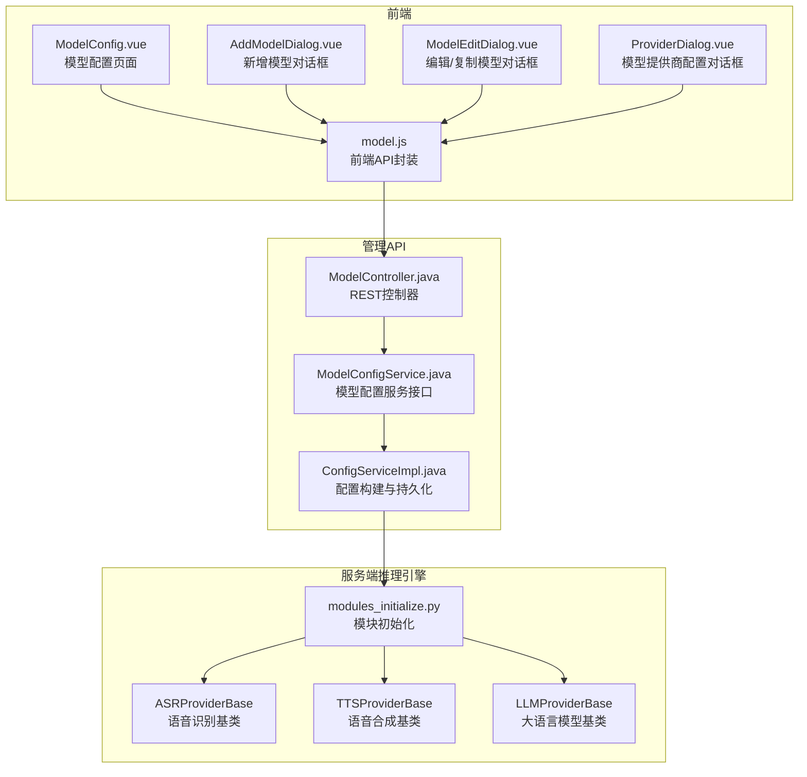
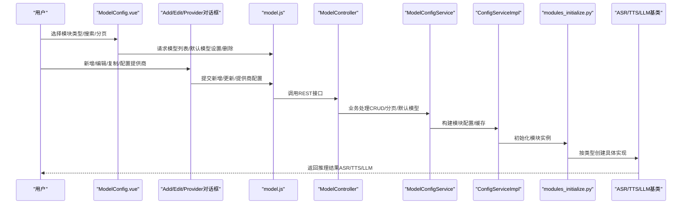
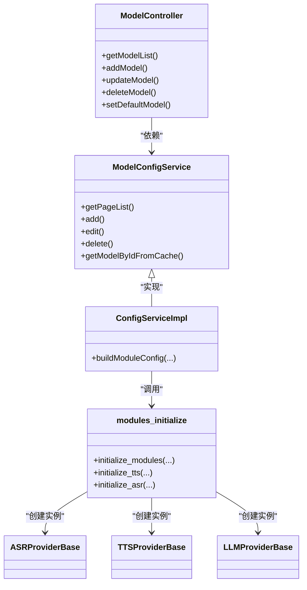
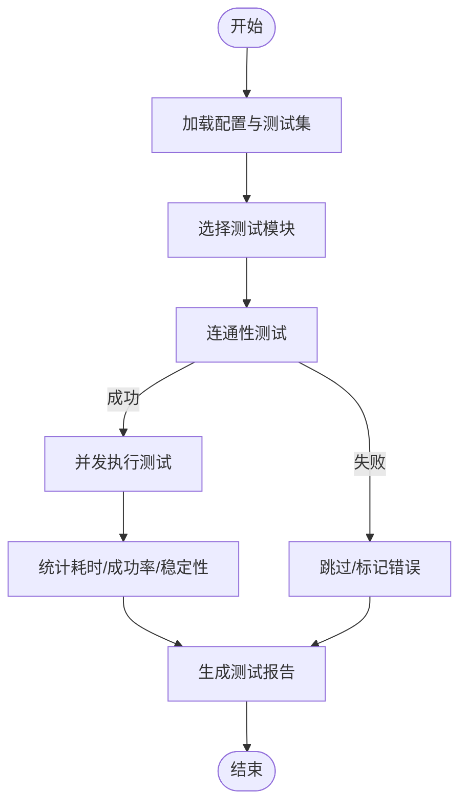
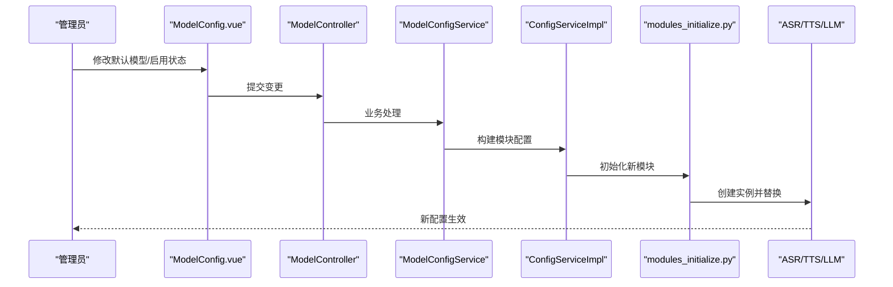

# 模型配置

<cite>
**本文引用的文件**
- [main/manager-web/src/views/ModelConfig.vue](file://main/manager-web/src/views/ModelConfig.vue)
- [main/manager-web/src/components/AddModelDialog.vue](file://main/manager-web/src/components/AddModelDialog.vue)
- [main/manager-web/src/components/ModelEditDialog.vue](file://main/manager-web/src/components/ModelEditDialog.vue)
- [main/manager-web/src/components/ProviderDialog.vue](file://main/manager-web/src/components/ProviderDialog.vue)
- [main/manager-web/src/apis/module/model.js](file://main/manager-web/src/apis/module/model.js)
- [main/manager-api/src/main/java/xiaozhi/modules/model/controller/ModelController.java](file://main/manager-api/src/main/java/xiaozhi/modules/model/controller/ModelController.java)
- [main/manager-api/src/main/java/xiaozhi/modules/model/service/ModelConfigService.java](file://main/manager-api/src/main/java/xiaozhi/modules/model/service/ModelConfigService.java)
- [main/manager-api/src/main/java/xiaozhi/modules/config/service/impl/ConfigServiceImpl.java](file://main/manager-api/src/main/java/xiaozhi/modules/config/service/impl/ConfigServiceImpl.java)
- [main/manager-mobile/src/pages/agent/edit.vue](file://main/manager-mobile/src/pages/agent/edit.vue)
- [main/xiaozhi-server/core/providers/asr/base.py](file://main/xiaozhi-server/core/providers/asr/base.py)
- [main/xiaozhi-server/core/providers/tts/base.py](file://main/xiaozhi-server/core/providers/tts/base.py)
- [main/xiaozhi-server/core/providers/llm/base.py](file://main/xiaozhi-server/core/providers/llm/base.py)
- [main/xiaozhi-server/core/utils/modules_initialize.py](file://main/xiaozhi-server/core/utils/modules_initialize.py)
- [main/xiaozhi-server/performance_tester.py](file://main/xiaozhi-server/performance_tester.py)
- [main/xiaozhi-server/performance_tester/performance_tester_asr.py](file://main/xiaozhi-server/performance_tester/performance_tester_asr.py)
- [main/xiaozhi-server/performance_tester/performance_tester_tts.py](file://main/xiaozhi-server/performance_tester/performance_tester_tts.py)
- [main/xiaozhi-server/performance_tester/performance_tester_llm.py](file://main/xiaozhi-server/performance_tester/performance_tester_llm.py)
- [main/xiaozhi-server/performance_tester/performance_tester_vllm.py](file://main/xiaozhi-server/performance_tester/performance_tester_vllm.py)
</cite>

## 目录
1. [简介](#简介)
2. [项目结构](#项目结构)
3. [核心组件](#核心组件)
4. [架构总览](#架构总览)
5. [详细组件分析](#详细组件分析)
6. [依赖关系分析](#依赖关系分析)
7. [性能考量](#性能考量)
8. [故障排查指南](#故障排查指南)
9. [结论](#结论)
10. [附录](#附录)

## 简介
本文件面向小智ESP32服务器的“模型配置模块”，系统化阐述语音识别（ASR）、语音合成（TTS）、大语言模型（LLM）及视觉大模型（VLLM）的配置管理界面与后端实现，涵盖以下主题：
- 模型提供商选择与参数配置
- 参数调优与性能监控
- 模型切换、热更新与版本管理
- 模型测试、评估与故障诊断
- 导入导出、备份恢复与批量部署
- 兼容性检查、资源占用监控与优化建议

## 项目结构
模型配置模块由三层组成：
- 前端管理界面（Vue + Element UI）：提供模型列表、新增/编辑/复制/删除、启用/禁用、设为默认、音色管理等能力
- 管理API（Spring Boot）：提供模型配置的增删改查、分页查询、默认模型设置、模型提供商管理等接口
- 服务端推理引擎（Python）：抽象出ASR/TTS/LLM/VLLM等模块基类，支持运行时初始化与热切换

图表来源
- [main/manager-web/src/views/ModelConfig.vue:1-800](file://main/manager-web/src/views/ModelConfig.vue#L1-L800)
- [main/manager-web/src/components/AddModelDialog.vue:1-465](file://main/manager-web/src/components/AddModelDialog.vue#L1-L465)
- [main/manager-web/src/components/ModelEditDialog.vue:1-648](file://main/manager-web/src/components/ModelEditDialog.vue#L1-L648)
- [main/manager-web/src/components/ProviderDialog.vue:1-440](file://main/manager-web/src/components/ProviderDialog.vue#L1-L440)
- [main/manager-web/src/apis/module/model.js:46-146](file://main/manager-web/src/apis/module/model.js#L46-L146)
- [main/manager-api/src/main/java/xiaozhi/modules/model/controller/ModelController.java:35-45](file://main/manager-api/src/main/java/xiaozhi/modules/model/controller/ModelController.java#L35-L45)
- [main/manager-api/src/main/java/xiaozhi/modules/model/service/ModelConfigService.java:14-42](file://main/manager-api/src/main/java/xiaozhi/modules/model/service/ModelConfigService.java#L14-L42)
- [main/manager-api/src/main/java/xiaozhi/modules/config/service/impl/ConfigServiceImpl.java:403-446](file://main/manager-api/src/main/java/xiaozhi/modules/config/service/impl/ConfigServiceImpl.java#L403-L446)
- [main/xiaozhi-server/core/utils/modules_initialize.py:9-98](file://main/xiaozhi-server/core/utils/modules_initialize.py#L9-L98)
- [main/xiaozhi-server/core/providers/asr/base.py:32-382](file://main/xiaozhi-server/core/providers/asr/base.py#L32-L382)
- [main/xiaozhi-server/core/providers/tts/base.py:33-637](file://main/xiaozhi-server/core/providers/tts/base.py#L33-L637)
- [main/xiaozhi-server/core/providers/llm/base.py:7-35](file://main/xiaozhi-server/core/providers/llm/base.py#L7-L35)

章节来源
- [main/manager-web/src/views/ModelConfig.vue:1-800](file://main/manager-web/src/views/ModelConfig.vue#L1-L800)
- [main/manager-api/src/main/java/xiaozhi/modules/model/controller/ModelController.java:35-45](file://main/manager-api/src/main/java/xiaozhi/modules/model/controller/ModelController.java#L35-L45)

## 核心组件
- 模型配置页面（ModelConfig.vue）
  - 支持按模块类型（VAD/ASR/LLM/VLLM/Intent/TTS/Memory/RAG）切换查看
  - 提供搜索、分页、批量选择、启用/禁用、设为默认、音色管理入口、新增/编辑/复制/删除等
  - 与后端API交互，刷新表格数据
- 新增/编辑对话框（AddModelDialog.vue / ModelEditDialog.vue）
  - 动态加载模型提供商字段，按提供商类型渲染表单
  - 编辑模式支持复制（Duplicate）与敏感字段掩码/恢复
- 模型提供商配置（ProviderDialog.vue）
  - 配置提供商字段清单（键/标签/类型/默认值），支持批量勾选与全选
- 前端API封装（model.js）
  - 统一封装模型列表、新增、更新、删除、默认模型设置、音色列表等HTTP请求
- 管理API（ModelController.java）
  - 提供模型配置的REST接口，聚合ModelConfigService与TimbreService等
- 配置服务（ModelConfigService.java）
  - 定义模型配置的CRUD、分页、模型代码列表、缓存获取等接口
- 配置构建（ConfigServiceImpl.java）
  - 构建模块配置（VAD/ASR/TTS/Memory/Intent/LLM/VLLM/SLM/RAG），支持缓存与默认模型
- 模块初始化（modules_initialize.py）
  - 按配置选择具体模块实例，支持TTS/ASR/LLM/Intent/Memory/VAD的初始化
- 服务端模块基类（ASR/TTS/LLM）
  - 抽象出统一的接口与生命周期，便于热切换与性能监控

章节来源
- [main/manager-web/src/views/ModelConfig.vue:357-636](file://main/manager-web/src/views/ModelConfig.vue#L357-L636)
- [main/manager-web/src/components/AddModelDialog.vue:155-296](file://main/manager-web/src/components/AddModelDialog.vue#L155-L296)
- [main/manager-web/src/components/ModelEditDialog.vue:212-478](file://main/manager-web/src/components/ModelEditDialog.vue#L212-L478)
- [main/manager-web/src/components/ProviderDialog.vue:161-334](file://main/manager-web/src/components/ProviderDialog.vue#L161-L334)
- [main/manager-web/src/apis/module/model.js:46-146](file://main/manager-web/src/apis/module/model.js#L46-L146)
- [main/manager-api/src/main/java/xiaozhi/modules/model/controller/ModelController.java:35-45](file://main/manager-api/src/main/java/xiaozhi/modules/model/controller/ModelController.java#L35-L45)
- [main/manager-api/src/main/java/xiaozhi/modules/model/service/ModelConfigService.java:14-42](file://main/manager-api/src/main/java/xiaozhi/modules/model/service/ModelConfigService.java#L14-L42)
- [main/manager-api/src/main/java/xiaozhi/modules/config/service/impl/ConfigServiceImpl.java:403-446](file://main/manager-api/src/main/java/xiaozhi/modules/config/service/impl/ConfigServiceImpl.java#L403-L446)
- [main/xiaozhi-server/core/utils/modules_initialize.py:9-98](file://main/xiaozhi-server/core/utils/modules_initialize.py#L9-L98)
- [main/xiaozhi-server/core/providers/asr/base.py:32-382](file://main/xiaozhi-server/core/providers/asr/base.py#L32-L382)
- [main/xiaozhi-server/core/providers/tts/base.py:33-637](file://main/xiaozhi-server/core/providers/tts/base.py#L33-L637)
- [main/xiaozhi-server/core/providers/llm/base.py:7-35](file://main/xiaozhi-server/core/providers/llm/base.py#L7-L35)

## 架构总览
从前端到后端再到推理引擎的完整链路如下：

图表来源
- [main/manager-web/src/views/ModelConfig.vue:583-636](file://main/manager-web/src/views/ModelConfig.vue#L583-L636)
- [main/manager-web/src/apis/module/model.js:46-146](file://main/manager-web/src/apis/module/model.js#L46-L146)
- [main/manager-api/src/main/java/xiaozhi/modules/model/controller/ModelController.java:35-45](file://main/manager-api/src/main/java/xiaozhi/modules/model/controller/ModelController.java#L35-L45)
- [main/manager-api/src/main/java/xiaozhi/modules/model/service/ModelConfigService.java:14-42](file://main/manager-api/src/main/java/xiaozhi/modules/model/service/ModelConfigService.java#L14-L42)
- [main/manager-api/src/main/java/xiaozhi/modules/config/service/impl/ConfigServiceImpl.java:403-446](file://main/manager-api/src/main/java/xiaozhi/modules/config/service/impl/ConfigServiceImpl.java#L403-L446)
- [main/xiaozhi-server/core/utils/modules_initialize.py:9-98](file://main/xiaozhi-server/core/utils/modules_initialize.py#L9-L98)
- [main/xiaozhi-server/core/providers/asr/base.py:32-382](file://main/xiaozhi-server/core/providers/asr/base.py#L32-L382)
- [main/xiaozhi-server/core/providers/tts/base.py:33-637](file://main/xiaozhi-server/core/providers/tts/base.py#L33-L637)
- [main/xiaozhi-server/core/providers/llm/base.py:7-35](file://main/xiaozhi-server/core/providers/llm/base.py#L7-L35)

## 详细组件分析

### 模型配置页面（ModelConfig.vue）
- 功能要点
  - 模块类型切换：VAD/ASR/LLM/VLLM/Intent/TTS/Memory/RAG
  - 表格列：模型ID/名称/提供商/启用/默认/音色管理/动作
  - 搜索与分页：支持关键词过滤与页码跳转
  - 批量操作：全选/新增/删除
  - 单条操作：编辑/复制/删除
  - 启用/禁用与设为默认：调用对应API并刷新
  - TTS音色管理：打开音色配置弹窗
- 数据流
  - 通过model.js封装的API发起请求，接收后端返回的分页数据并渲染

章节来源
- [main/manager-web/src/views/ModelConfig.vue:28-282](file://main/manager-web/src/views/ModelConfig.vue#L28-L282)
- [main/manager-web/src/views/ModelConfig.vue:583-636](file://main/manager-web/src/views/ModelConfig.vue#L583-L636)

### 新增/编辑/复制模型（AddModelDialog.vue / ModelEditDialog.vue）
- 动态字段渲染
  - 根据提供商类型动态加载字段清单（键/标签/类型/默认值）
  - JSON字段以文本域展示，支持校验与格式化
- 敏感字段处理
  - 编辑复制场景下对敏感字段进行掩码显示，并在失焦时恢复原始值
- 校验与提交
  - 校验模型ID合法性（非纯字母、不含空格、允许字母数字下划线连字符）
  - 提交时将configJson补充type字段并调用父组件回调

章节来源
- [main/manager-web/src/components/AddModelDialog.vue:155-296](file://main/manager-web/src/components/AddModelDialog.vue#L155-L296)
- [main/manager-web/src/components/ModelEditDialog.vue:212-478](file://main/manager-web/src/components/ModelEditDialog.vue#L212-L478)

### 模型提供商配置（ProviderDialog.vue）
- 字段管理
  - 支持添加/编辑/删除字段，批量勾选与全选
  - 字段类型包括字符串/数字/布尔/字典/数组/RAG
- 校验与提交
  - 表单必填校验（类别/编码/名称）
  - 提交前确保无未完成编辑项

章节来源
- [main/manager-web/src/components/ProviderDialog.vue:161-334](file://main/manager-web/src/components/ProviderDialog.vue#L161-L334)

### 前端API封装（model.js）
- 接口能力
  - 获取模型列表/分页/搜索
  - 获取LLM模型代码列表
  - 获取模型音色列表
  - 新增/更新/删除模型
  - 设置默认模型
  - 网络失败时自动重试
- 调用流程
  - 统一构造URL与参数，封装成功/失败回调

章节来源
- [main/manager-web/src/apis/module/model.js:46-146](file://main/manager-web/src/apis/module/model.js#L46-L146)

### 管理API与配置服务（ModelController.java / ModelConfigService.java / ConfigServiceImpl.java）
- 控制器职责
  - 暴露REST接口，聚合模型配置、音色、模板等功能
- 服务接口
  - 定义模型配置的CRUD、分页、模型代码列表、缓存获取等
- 配置构建
  - 构建模块配置（VAD/ASR/TTS/Memory/Intent/LLM/VLLM/SLM/RAG）
  - 支持缓存与默认模型标记

章节来源
- [main/manager-api/src/main/java/xiaozhi/modules/model/controller/ModelController.java:35-45](file://main/manager-api/src/main/java/xiaozhi/modules/model/controller/ModelController.java#L35-L45)
- [main/manager-api/src/main/java/xiaozhi/modules/model/service/ModelConfigService.java:14-42](file://main/manager-api/src/main/java/xiaozhi/modules/model/service/ModelConfigService.java#L14-L42)
- [main/manager-api/src/main/java/xiaozhi/modules/config/service/impl/ConfigServiceImpl.java:403-446](file://main/manager-api/src/main/java/xiaozhi/modules/config/service/impl/ConfigServiceImpl.java#L403-L446)

### 模块初始化与热切换（modules_initialize.py）
- 初始化策略
  - 按需初始化TTS/ASR/LLM/Intent/Memory/VAD
  - 依据配置中的selected_module选择具体实现
- 声纹识别动态启用
  - 通过initialize_voiceprint动态启用ASR声纹识别功能

章节来源
- [main/xiaozhi-server/core/utils/modules_initialize.py:9-98](file://main/xiaozhi-server/core/utils/modules_initialize.py#L9-L98)
- [main/xiaozhi-server/core/utils/modules_initialize.py:132-151](file://main/xiaozhi-server/core/utils/modules_initialize.py#L132-L151)

### 服务端模块基类（ASR/TTS/LLM）
- ASRProviderBase
  - 统一音频通道、有序处理、OPUS解码、WAV转换、并发ASR与声纹识别、性能监控
- TTSProviderBase
  - 文本清洗、替换词正则、流式/非流式处理、音频文件/数据流转换、播放线程与上报
- LLMProviderBase
  - 抽象响应生成接口，支持函数调用与非流式响应

章节来源
- [main/xiaozhi-server/core/providers/asr/base.py:32-382](file://main/xiaozhi-server/core/providers/asr/base.py#L32-L382)
- [main/xiaozhi-server/core/providers/tts/base.py:33-637](file://main/xiaozhi-server/core/providers/tts/base.py#L33-L637)
- [main/xiaozhi-server/core/providers/llm/base.py:7-35](file://main/xiaozhi-server/core/providers/llm/base.py#L7-L35)

### 移动端角色配置中的模型显示映射
- 将模型ID映射为显示名称，支持ASR/LLM/TTS/Memory/Intent等类型
- 特殊处理角色音色选项的可见性

章节来源
- [main/manager-mobile/src/pages/agent/edit.vue:258-290](file://main/manager-mobile/src/pages/agent/edit.vue#L258-L290)

## 依赖关系分析

图表来源
- [main/manager-api/src/main/java/xiaozhi/modules/model/controller/ModelController.java:35-45](file://main/manager-api/src/main/java/xiaozhi/modules/model/controller/ModelController.java#L35-L45)
- [main/manager-api/src/main/java/xiaozhi/modules/model/service/ModelConfigService.java:14-42](file://main/manager-api/src/main/java/xiaozhi/modules/model/service/ModelConfigService.java#L14-L42)
- [main/manager-api/src/main/java/xiaozhi/modules/config/service/impl/ConfigServiceImpl.java:403-446](file://main/manager-api/src/main/java/xiaozhi/modules/config/service/impl/ConfigServiceImpl.java#L403-L446)
- [main/xiaozhi-server/core/utils/modules_initialize.py:9-98](file://main/xiaozhi-server/core/utils/modules_initialize.py#L9-L98)
- [main/xiaozhi-server/core/providers/asr/base.py:32-382](file://main/xiaozhi-server/core/providers/asr/base.py#L32-L382)
- [main/xiaozhi-server/core/providers/tts/base.py:33-637](file://main/xiaozhi-server/core/providers/tts/base.py#L33-L637)
- [main/xiaozhi-server/core/providers/llm/base.py:7-35](file://main/xiaozhi-server/core/providers/llm/base.py#L7-L35)

## 性能考量
- 前端
  - 表格分页与搜索减少一次性渲染压力
  - 对网络失败进行自动重试，提升稳定性
- 后端
  - 模块初始化按需进行，避免不必要的资源占用
  - ASR/TTS并发处理与音频文件清理降低延迟与磁盘压力
- 性能测试框架
  - 提供ASR/TTS/LLM/VLLM的独立测试脚本，支持超时控制、成功率统计与排序
  - 通过命令行选择测试模块，便于CI/CD集成

章节来源
- [main/manager-web/src/views/ModelConfig.vue:357-636](file://main/manager-web/src/views/ModelConfig.vue#L357-L636)
- [main/xiaozhi-server/core/providers/asr/base.py:84-180](file://main/xiaozhi-server/core/providers/asr/base.py#L84-L180)
- [main/xiaozhi-server/core/providers/tts/base.py:368-476](file://main/xiaozhi-server/core/providers/tts/base.py#L368-L476)
- [main/xiaozhi-server/performance_tester.py:47-69](file://main/xiaozhi-server/performance_tester.py#L47-L69)
- [main/xiaozhi-server/performance_tester/performance_tester_asr.py:309-354](file://main/xiaozhi-server/performance_tester/performance_tester_asr.py#L309-L354)
- [main/xiaozhi-server/performance_tester/performance_tester_tts.py:167-200](file://main/xiaozhi-server/performance_tester/performance_tester_tts.py#L167-L200)
- [main/xiaozhi-server/performance_tester/performance_tester_llm.py:538-544](file://main/xiaozhi-server/performance_tester/performance_tester_llm.py#L538-L544)
- [main/xiaozhi-server/performance_tester/performance_tester_vllm.py:146-148](file://main/xiaozhi-server/performance_tester/performance_tester_vllm.py#L146-L148)

## 故障排查指南
- 常见问题定位
  - ASR识别失败：检查OPUS解码、WAV转换、磁盘空间与提供商配置
  - TTS生成失败：检查音频文件生成、重试次数与输出目录权限
  - LLM/VLLM测试失败：关注超时、502网关与网络连通性
- 日志与监控
  - 服务端模块基类内置性能监控与异常堆栈记录
  - 前端API封装在网络失败时自动重试，便于快速恢复
- 快速修复建议
  - 确认模型提供商字段完整且非占位符
  - 检查默认模型设置与启用状态
  - 使用性能测试工具定位瓶颈模块

章节来源
- [main/xiaozhi-server/core/providers/asr/base.py:175-180](file://main/xiaozhi-server/core/providers/asr/base.py#L175-L180)
- [main/xiaozhi-server/core/providers/tts/base.py:135-163](file://main/xiaozhi-server/core/providers/tts/base.py#L135-L163)
- [main/xiaozhi-server/performance_tester/performance_tester_asr.py:83-88](file://main/xiaozhi-server/performance_tester/performance_tester_asr.py#L83-L88)
- [main/xiaozhi-server/performance_tester/performance_tester_llm.py:351-365](file://main/xiaozhi-server/performance_tester/performance_tester_llm.py#L351-L365)

## 结论
本模型配置模块通过前后端协同与抽象化的推理引擎基类，实现了：
- 可视化、可扩展的模型配置管理
- 动态提供商字段与敏感信息保护
- 模块化初始化与热切换能力
- 完整的性能测试与故障诊断工具链
建议在生产环境中结合性能测试结果定期评估与优化模型组合，并完善导入导出与批量部署流程以提升运维效率。

## 附录

### 模型测试与评估流程

图表来源
- [main/xiaozhi-server/performance_tester/performance_tester_asr.py:309-354](file://main/xiaozhi-server/performance_tester/performance_tester_asr.py#L309-L354)
- [main/xiaozhi-server/performance_tester/performance_tester_tts.py:167-200](file://main/xiaozhi-server/performance_tester/performance_tester_tts.py#L167-L200)
- [main/xiaozhi-server/performance_tester/performance_tester_llm.py:518-535](file://main/xiaozhi-server/performance_tester/performance_tester_llm.py#L518-L535)
- [main/xiaozhi-server/performance_tester/performance_tester_vllm.py:146-148](file://main/xiaozhi-server/performance_tester/performance_tester_vllm.py#L146-L148)

### 模型切换与热更新序列

图表来源
- [main/manager-web/src/views/ModelConfig.vue:603-635](file://main/manager-web/src/views/ModelConfig.vue#L603-L635)
- [main/manager-api/src/main/java/xiaozhi/modules/model/controller/ModelController.java:35-45](file://main/manager-api/src/main/java/xiaozhi/modules/model/controller/ModelController.java#L35-L45)
- [main/manager-api/src/main/java/xiaozhi/modules/model/service/ModelConfigService.java:14-42](file://main/manager-api/src/main/java/xiaozhi/modules/model/service/ModelConfigService.java#L14-L42)
- [main/manager-api/src/main/java/xiaozhi/modules/config/service/impl/ConfigServiceImpl.java:403-446](file://main/manager-api/src/main/java/xiaozhi/modules/config/service/impl/ConfigServiceImpl.java#L403-L446)
- [main/xiaozhi-server/core/utils/modules_initialize.py:9-98](file://main/xiaozhi-server/core/utils/modules_initialize.py#L9-L98)