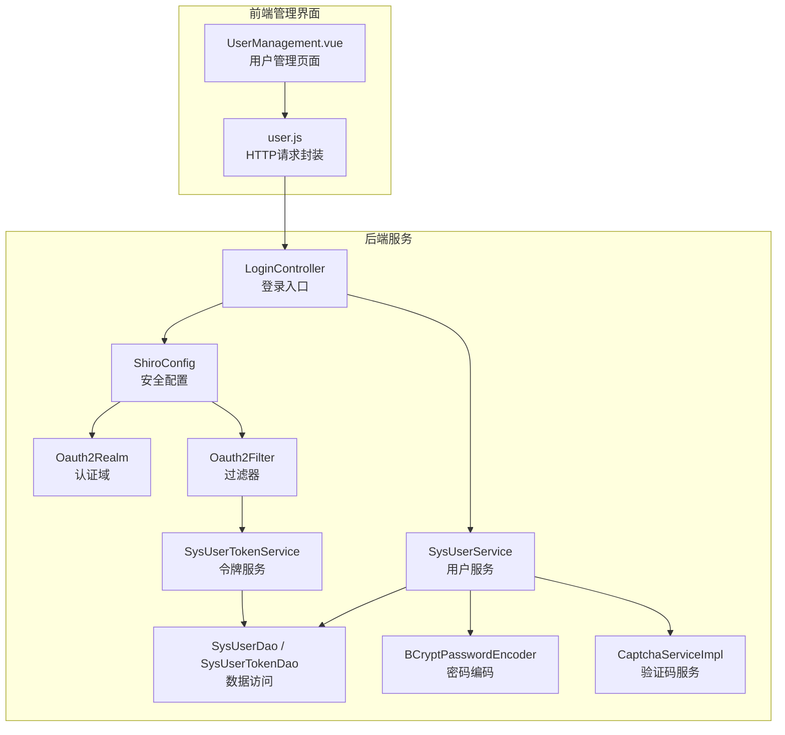
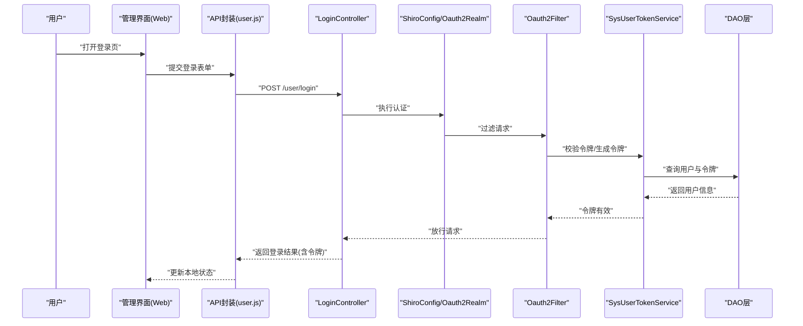
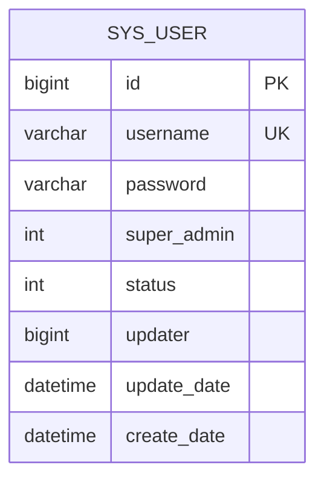
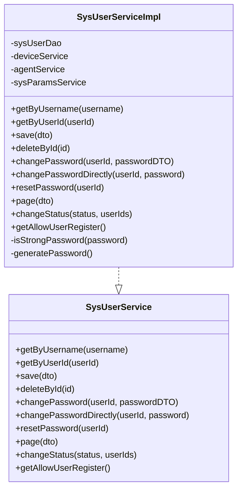
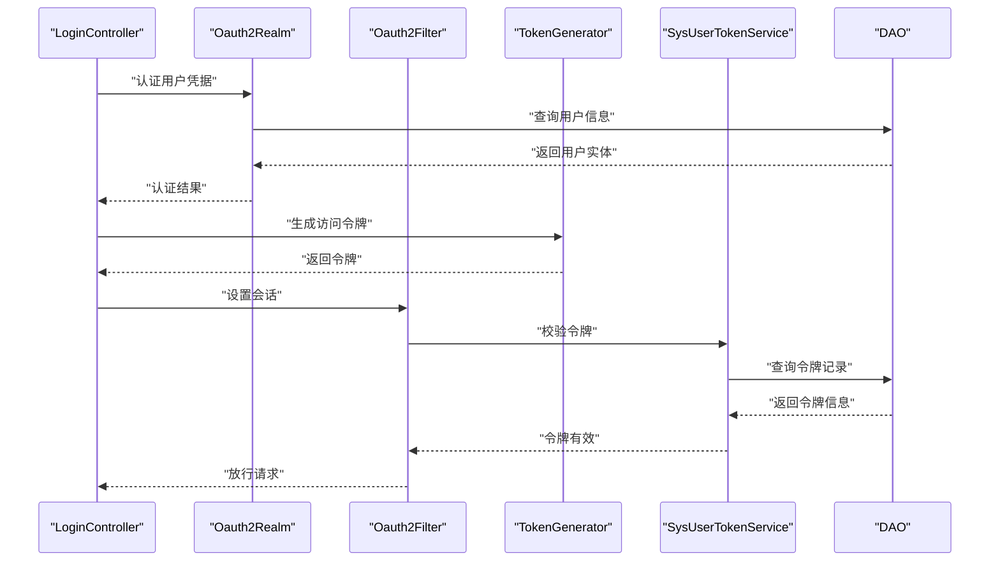
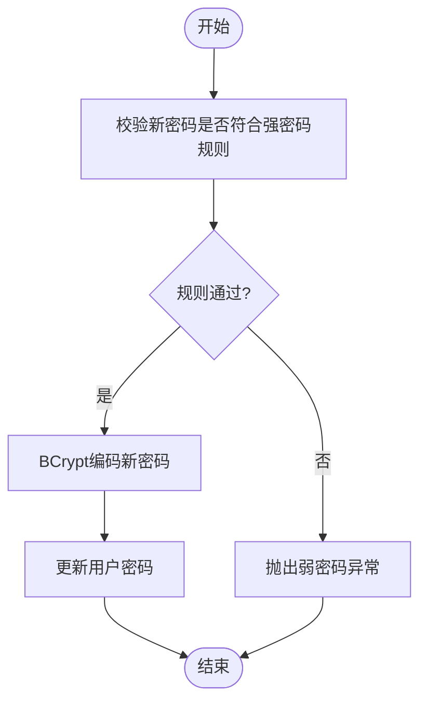
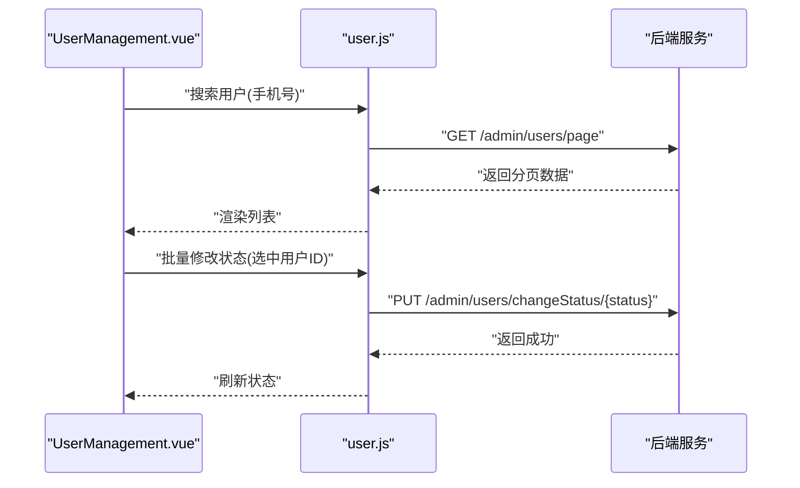
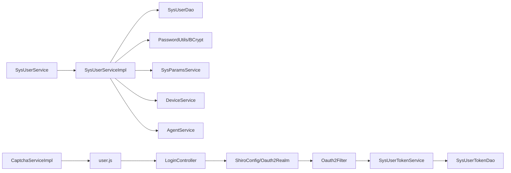

# 用户管理

<cite>
**本文引用的文件**
- [SysUserService.java](file://main/manager-api/src/main/java/xiaozhi/modules/sys/service/SysUserService.java)
- [SysUserServiceImpl.java](file://main/manager-api/src/main/java/xiaozhi/modules/sys/service/impl/SysUserServiceImpl.java)
- [SysUserEntity.java](file://main/manager-api/src/main/java/xiaozhi/modules/sys/entity/SysUserEntity.java)
- [SysUserTokenDao.java](file://main/manager-api/src/main/java/xiaozhi/modules/dao/SysUserTokenDao.java)
- [SysUserTokenEntity.java](file://main/manager-api/src/main/java/xiaozhi/modules/entity/SysUserTokenEntity.java)
- [SysUserTokenService.java](file://main/manager-api/src/main/java/xiaozhi/modules/service/SysUserTokenService.java)
- [SysUserTokenServiceImpl.java](file://main/manager-api/src/main/java/xiaozhi/modules/service/impl/SysUserTokenServiceImpl.java)
- [LoginController.java](file://main/manager-api/src/main/java/xiaozhi/modules/controller/LoginController.java)
- [ShiroConfig.java](file://main/manager-api/src/main/java/xiaozhi/modules/security/config/ShiroConfig.java)
- [Oauth2Realm.java](file://main/manager-api/src/main/java/xiaozhi/modules/security/oauth2/Oauth2Realm.java)
- [Oauth2Filter.java](file://main/manager-api/src/main/java/xiaozhi/modules/security/oauth2/Oauth2Filter.java)
- [TokenGenerator.java](file://main/manager-api/src/main/java/xiaozhi/modules/security/oauth2/TokenGenerator.java)
- [BCryptPasswordEncoder.java](file://main/manager-api/src/main/java/xiaozhi/modules/security/password/BCryptPasswordEncoder.java)
- [PasswordUtils.java](file://main/manager-api/src/main/java/xiaozhi/modules/security/password/PasswordUtils.java)
- [CaptchaServiceImpl.java](file://main/manager-api/src/main/java/xiaozhi/modules/security/service/impl/CaptchaServiceImpl.java)
- [SmsVerificationDTO.java](file://main/manager-api/src/main/java/xiaozhi/modules/dto/SmsVerificationDTO.java)
- [user.js](file://main/manager-web/src/apis/module/user.js)
- [UserManagement.vue](file://main/manager-web/src/views/UserManagement.vue)
- [AdminController.java](file://main/manager-api/src/main/java/xiaozhi/modules/sys/controller/AdminController.java)
- [SysParamsService.java](file://main/manager-api/src/main/java/xiaozhi/modules/sys/service/SysParamsService.java)
- [Constant.java](file://main/manager-api/src/main/java/xiaozhi/common/constant/Constant.java)
- [ErrorCode.java](file://main/manager-api/src/main/java/xiaozhi/common/exception/ErrorCode.java)
- [RenException.java](file://main/manager-api/src/main/java/xiaozhi/common/exception/RenException.java)
</cite>

## 目录
1. [简介](#简介)
2. [项目结构](#项目结构)
3. [核心组件](#核心组件)
4. [架构总览](#架构总览)
5. [详细组件分析](#详细组件分析)
6. [依赖关系分析](#依赖关系分析)
7. [性能考虑](#性能考虑)
8. [故障排查指南](#故障排查指南)
9. [结论](#结论)
10. [附录](#附录)

## 简介
本文件面向小智ESP32服务器的用户管理模块，系统化阐述用户账户创建、权限分配与角色管理、登录认证、会话管理与安全控制、密码策略与重置流程、安全审计与合规检查、管理员权限与操作日志、用户批量导入与状态管理、以及数据保护与隐私合规的最佳实践。文档基于后端Java服务与前端Web管理界面的实际代码实现进行技术解析，并提供可视化图示帮助理解。

## 项目结构
用户管理相关能力由后端Spring Boot微服务与前端Vue管理界面协同实现：
- 后端模块（manager-api）包含系统用户实体、服务层、DAO层、安全框架集成（Shiro/OAuth2）、密码编码与验证码等子模块。
- 前端管理界面（manager-web）提供用户管理页面与API调用封装，支持用户搜索、状态变更、密码修改等操作。

图表来源
- [UserManagement.vue](file://main/manager-web/src/views/UserManagement.vue)
- [user.js](file://main/manager-web/src/apis/module/user.js)
- [LoginController.java](file://main/manager-api/src/main/java/xiaozhi/modules/controller/LoginController.java)
- [ShiroConfig.java](file://main/manager-api/src/main/java/xiaozhi/modules/security/config/ShiroConfig.java)
- [Oauth2Realm.java](file://main/manager-api/src/main/java/xiaozhi/modules/security/oauth2/Oauth2Realm.java)
- [Oauth2Filter.java](file://main/manager-api/src/main/java/xiaozhi/modules/security/oauth2/Oauth2Filter.java)
- [SysUserTokenService.java](file://main/manager-api/src/main/java/xiaozhi/modules/service/SysUserTokenService.java)
- [SysUserService.java](file://main/manager-api/src/main/java/xiaozhi/modules/sys/service/SysUserService.java)
- [SysUserTokenDao.java](file://main/manager-api/src/main/java/xiaozhi/modules/dao/SysUserTokenDao.java)
- [SysUserDao.java](file://main/manager-api/src/main/java/xiaozhi/modules/sys/dao/SysUserDao.java)
- [BCryptPasswordEncoder.java](file://main/manager-api/src/main/java/xiaozhi/modules/security/password/BCryptPasswordEncoder.java)
- [CaptchaServiceImpl.java](file://main/manager-api/src/main/java/xiaozhi/modules/security/service/impl/CaptchaServiceImpl.java)

章节来源
- [UserManagement.vue](file://main/manager-web/src/views/UserManagement.vue)
- [user.js](file://main/manager-web/src/apis/module/user.js)
- [SysUserService.java](file://main/manager-api/src/main/java/xiaozhi/modules/sys/service/SysUserService.java)
- [SysUserServiceImpl.java](file://main/manager-api/src/main/java/xiaozhi/modules/sys/service/impl/SysUserServiceImpl.java)
- [SysUserEntity.java](file://main/manager-api/src/main/java/xiaozhi/modules/sys/entity/SysUserEntity.java)

## 核心组件
- 系统用户服务与实现：负责用户创建、密码校验与修改、重置、状态变更、分页查询、注册许可判断等。
- 用户实体：定义用户名、密码、超级管理员标识、状态及通用审计字段。
- 认证与会话：基于Shiro与OAuth2的登录认证、令牌生成与过滤器拦截。
- 密码策略：强密码规则校验与BCrypt编码存储。
- 验证码与短信：图形验证码生成与短信验证码发送。
- 前端API封装：统一的HTTP请求封装，暴露登录、注册、密码修改、状态变更等接口。

章节来源
- [SysUserService.java](file://main/manager-api/src/main/java/xiaozhi/modules/sys/service/SysUserService.java)
- [SysUserServiceImpl.java](file://main/manager-api/src/main/java/xiaozhi/modules/sys/service/impl/SysUserServiceImpl.java)
- [SysUserEntity.java](file://main/manager-api/src/main/java/xiaozhi/modules/sys/entity/SysUserEntity.java)
- [SysUserTokenService.java](file://main/manager-api/src/main/java/xiaozhi/modules/service/SysUserTokenService.java)
- [SysUserTokenServiceImpl.java](file://main/manager-api/src/main/java/xiaozhi/modules/service/impl/SysUserTokenServiceImpl.java)
- [SysUserTokenDao.java](file://main/manager-api/src/main/java/xiaozhi/modules/dao/SysUserTokenDao.java)
- [SysUserTokenEntity.java](file://main/manager-api/src/main/java/xiaozhi/modules/entity/SysUserTokenEntity.java)
- [LoginController.java](file://main/manager-api/src/main/java/xiaozhi/modules/controller/LoginController.java)
- [ShiroConfig.java](file://main/manager-api/src/main/java/xiaozhi/modules/security/config/ShiroConfig.java)
- [Oauth2Realm.java](file://main/manager-api/src/main/java/xiaozhi/modules/security/oauth2/Oauth2Realm.java)
- [Oauth2Filter.java](file://main/manager-api/src/main/java/xiaozhi/modules/security/oauth2/Oauth2Filter.java)
- [TokenGenerator.java](file://main/manager-api/src/main/java/xiaozhi/modules/security/oauth2/TokenGenerator.java)
- [BCryptPasswordEncoder.java](file://main/manager-api/src/main/java/xiaozhi/modules/security/password/BCryptPasswordEncoder.java)
- [PasswordUtils.java](file://main/manager-api/src/main/java/xiaozhi/modules/security/password/PasswordUtils.java)
- [CaptchaServiceImpl.java](file://main/manager-api/src/main/java/xiaozhi/modules/security/service/impl/CaptchaServiceImpl.java)
- [SmsVerificationDTO.java](file://main/manager-api/src/main/java/xiaozhi/modules/dto/SmsVerificationDTO.java)
- [user.js](file://main/manager-web/src/apis/module/user.js)
- [UserManagement.vue](file://main/manager-web/src/views/UserManagement.vue)

## 架构总览
用户管理采用前后端分离架构，前端通过API封装调用后端REST接口；后端以Spring Boot为基础，集成Shiro进行身份认证与授权，使用OAuth2生成访问令牌并配合过滤器进行会话控制；密码采用BCrypt编码存储；验证码与短信用于增强注册与找回流程的安全性。

图表来源
- [user.js](file://main/manager-web/src/apis/module/user.js)
- [LoginController.java](file://main/manager-api/src/main/java/xiaozhi/modules/controller/LoginController.java)
- [ShiroConfig.java](file://main/manager-api/src/main/java/xiaozhi/modules/security/config/ShiroConfig.java)
- [Oauth2Realm.java](file://main/manager-api/src/main/java/xiaozhi/modules/security/oauth2/Oauth2Realm.java)
- [Oauth2Filter.java](file://main/manager-api/src/main/java/xiaozhi/modules/security/oauth2/Oauth2Filter.java)
- [SysUserTokenService.java](file://main/manager-api/src/main/java/xiaozhi/modules/service/SysUserTokenService.java)
- [SysUserTokenDao.java](file://main/manager-api/src/main/java/xiaozhi/modules/dao/SysUserTokenDao.java)

## 详细组件分析

### 用户实体与数据模型
系统用户实体包含用户名、密码、超级管理员标识、状态及审计字段，持久化映射到数据库表。

图表来源
- [SysUserEntity.java](file://main/manager-api/src/main/java/xiaozhi/modules/sys/entity/SysUserEntity.java)

章节来源
- [SysUserEntity.java](file://main/manager-api/src/main/java/xiaozhi/modules/sys/entity/SysUserEntity.java)

### 用户服务与业务逻辑
用户服务接口定义了用户创建、删除、密码修改、重置、状态变更、分页查询与注册许可判断等能力；实现类完成密码强度校验、BCrypt编码、事务控制、设备与智能体关联数据清理、随机密码生成与打乱等。

图表来源
- [SysUserService.java](file://main/manager-api/src/main/java/xiaozhi/modules/sys/service/SysUserService.java)
- [SysUserServiceImpl.java](file://main/manager-api/src/main/java/xiaozhi/modules/sys/service/impl/SysUserServiceImpl.java)

章节来源
- [SysUserService.java](file://main/manager-api/src/main/java/xiaozhi/modules/sys/service/SysUserService.java)
- [SysUserServiceImpl.java](file://main/manager-api/src/main/java/xiaozhi/modules/sys/service/impl/SysUserServiceImpl.java)

### 登录认证与会话管理
登录控制器接收认证请求，交由Shiro与OAuth2组件完成认证与令牌发放；过滤器对受保护资源进行拦截校验；令牌服务负责令牌的生成与校验。

图表来源
- [LoginController.java](file://main/manager-api/src/main/java/xiaozhi/modules/controller/LoginController.java)
- [Oauth2Realm.java](file://main/manager-api/src/main/java/xiaozhi/modules/security/oauth2/Oauth2Realm.java)
- [Oauth2Filter.java](file://main/manager-api/src/main/java/xiaozhi/modules/security/oauth2/Oauth2Filter.java)
- [TokenGenerator.java](file://main/manager-api/src/main/java/xiaozhi/modules/security/oauth2/TokenGenerator.java)
- [SysUserTokenService.java](file://main/manager-api/src/main/java/xiaozhi/modules/service/SysUserTokenService.java)
- [SysUserTokenDao.java](file://main/manager-api/src/main/java/xiaozhi/modules/dao/SysUserTokenDao.java)

章节来源
- [LoginController.java](file://main/manager-api/src/main/java/xiaozhi/modules/controller/LoginController.java)
- [ShiroConfig.java](file://main/manager-api/src/main/java/xiaozhi/modules/security/config/ShiroConfig.java)
- [Oauth2Realm.java](file://main/manager-api/src/main/java/xiaozhi/modules/security/oauth2/Oauth2Realm.java)
- [Oauth2Filter.java](file://main/manager-api/src/main/java/xiaozhi/modules/security/oauth2/Oauth2Filter.java)
- [TokenGenerator.java](file://main/manager-api/src/main/java/xiaozhi/modules/security/oauth2/TokenGenerator.java)
- [SysUserTokenService.java](file://main/manager-api/src/main/java/xiaozhi/modules/service/SysUserTokenService.java)
- [SysUserTokenServiceImpl.java](file://main/manager-api/src/main/java/xiaozhi/modules/service/impl/SysUserTokenServiceImpl.java)

### 密码策略与安全控制
- 强密码规则：要求包含大小写字母与数字（实现中体现为正则匹配），并在用户创建与密码修改时强制校验。
- 密码编码：使用BCrypt进行不可逆编码，确保存储安全。
- 旧密码校验：修改密码前需验证旧密码正确性。
- 随机密码重置：管理员可重置用户密码并返回明文临时密码（实际应通过安全渠道下发）。

图表来源
- [SysUserServiceImpl.java](file://main/manager-api/src/main/java/xiaozhi/modules/sys/service/impl/SysUserServiceImpl.java)
- [BCryptPasswordEncoder.java](file://main/manager-api/src/main/java/xiaozhi/modules/security/password/BCryptPasswordEncoder.java)
- [PasswordUtils.java](file://main/manager-api/src/main/java/xiaozhi/modules/security/password/PasswordUtils.java)

章节来源
- [SysUserServiceImpl.java](file://main/manager-api/src/main/java/xiaozhi/modules/sys/service/impl/SysUserServiceImpl.java)
- [BCryptPasswordEncoder.java](file://main/manager-api/src/main/java/xiaozhi/modules/security/password/BCryptPasswordEncoder.java)
- [PasswordUtils.java](file://main/manager-api/src/main/java/xiaozhi/modules/security/password/PasswordUtils.java)

### 验证码与短信验证
- 图形验证码：后端生成并返回二进制图像，前端以Blob方式接收展示。
- 短信验证码：前端提交手机号，后端发送短信验证码（具体短信通道实现未在当前上下文中展开）。

章节来源
- [user.js](file://main/manager-web/src/apis/module/user.js)
- [CaptchaServiceImpl.java](file://main/manager-api/src/main/java/xiaozhi/modules/security/service/impl/CaptchaServiceImpl.java)
- [SmsVerificationDTO.java](file://main/manager-api/src/main/java/xiaozhi/modules/dto/SmsVerificationDTO.java)

### 前端用户管理与批量操作
- 用户管理页面支持按手机号搜索、查看用户设备数量与状态、批量修改用户状态。
- API封装提供登录、注册、密码修改、状态变更、验证码获取等方法，统一处理网络失败重试。

图表来源
- [UserManagement.vue](file://main/manager-web/src/views/UserManagement.vue)
- [user.js](file://main/manager-web/src/apis/module/user.js)
- [SysUserService.java](file://main/manager-api/src/main/java/xiaozhi/modules/sys/service/SysUserService.java)

章节来源
- [UserManagement.vue](file://main/manager-web/src/views/UserManagement.vue)
- [user.js](file://main/manager-web/src/apis/module/user.js)
- [SysUserService.java](file://main/manager-api/src/main/java/xiaozhi/modules/sys/service/SysUserService.java)

### 管理员权限与操作日志
- 管理员权限：首次创建的用户自动成为超级管理员；后续用户默认非管理员。
- 操作日志：建议在用户状态变更、密码重置、用户删除等敏感操作处增加审计日志记录（当前实现未见显式日志记录，可在DAO或Service层扩展）。

章节来源
- [SysUserServiceImpl.java](file://main/manager-api/src/main/java/xiaozhi/modules/sys/service/impl/SysUserServiceImpl.java)
- [SysUserService.java](file://main/manager-api/src/main/java/xiaozhi/modules/sys/service/SysUserService.java)

### 批量导入与状态管理
- 批量导入：可通过后端提供的用户创建接口批量导入用户，导入后根据业务需求进行状态初始化。
- 状态管理：支持批量修改用户状态（启用/停用），结合前端多选与后端批量更新实现。

章节来源
- [SysUserService.java](file://main/manager-api/src/main/java/xiaozhi/modules/sys/service/SysUserService.java)
- [SysUserServiceImpl.java](file://main/manager-api/src/main/java/xiaozhi/modules/sys/service/impl/SysUserServiceImpl.java)
- [UserManagement.vue](file://main/manager-web/src/views/UserManagement.vue)

### 数据保护与隐私合规
- 密码保护：BCrypt编码存储，禁止明文或弱密码。
- 传输安全：建议在生产环境启用HTTPS，避免凭证在传输过程中被窃取。
- 最小权限：管理员权限仅授予必要人员，遵循最小权限原则。
- 审计与合规：建议补充操作审计日志（如用户创建、密码修改、状态变更、删除等），并定期审查访问日志。

章节来源
- [SysUserServiceImpl.java](file://main/manager-api/src/main/java/xiaozhi/modules/sys/service/impl/SysUserServiceImpl.java)
- [BCryptPasswordEncoder.java](file://main/manager-api/src/main/java/xiaozhi/modules/security/password/BCryptPasswordEncoder.java)

## 依赖关系分析
用户管理模块的关键依赖关系如下：

图表来源
- [SysUserService.java](file://main/manager-api/src/main/java/xiaozhi/modules/sys/service/SysUserService.java)
- [SysUserServiceImpl.java](file://main/manager-api/src/main/java/xiaozhi/modules/sys/service/impl/SysUserServiceImpl.java)
- [SysUserDao.java](file://main/manager-api/src/main/java/xiaozhi/modules/sys/dao/SysUserDao.java)
- [PasswordUtils.java](file://main/manager-api/src/main/java/xiaozhi/modules/security/password/PasswordUtils.java)
- [SysParamsService.java](file://main/manager-api/src/main/java/xiaozhi/modules/sys/service/SysParamsService.java)
- [LoginController.java](file://main/manager-api/src/main/java/xiaozhi/modules/controller/LoginController.java)
- [ShiroConfig.java](file://main/manager-api/src/main/java/xiaozhi/modules/security/config/ShiroConfig.java)
- [Oauth2Realm.java](file://main/manager-api/src/main/java/xiaozhi/modules/security/oauth2/Oauth2Realm.java)
- [Oauth2Filter.java](file://main/manager-api/src/main/java/xiaozhi/modules/security/oauth2/Oauth2Filter.java)
- [SysUserTokenService.java](file://main/manager-api/src/main/java/xiaozhi/modules/service/SysUserTokenService.java)
- [SysUserTokenDao.java](file://main/manager-api/src/main/java/xiaozhi/modules/dao/SysUserTokenDao.java)
- [CaptchaServiceImpl.java](file://main/manager-api/src/main/java/xiaozhi/modules/security/service/impl/CaptchaServiceImpl.java)
- [user.js](file://main/manager-web/src/apis/module/user.js)

章节来源
- [SysUserService.java](file://main/manager-api/src/main/java/xiaozhi/modules/sys/service/SysUserService.java)
- [SysUserServiceImpl.java](file://main/manager-api/src/main/java/xiaozhi/modules/sys/service/impl/SysUserServiceImpl.java)
- [SysUserDao.java](file://main/manager-api/src/main/java/xiaozhi/modules/sys/dao/SysUserDao.java)
- [LoginController.java](file://main/manager-api/src/main/java/xiaozhi/modules/controller/LoginController.java)
- [ShiroConfig.java](file://main/manager-api/src/main/java/xiaozhi/modules/security/config/ShiroConfig.java)
- [Oauth2Realm.java](file://main/manager-api/src/main/java/xiaozhi/modules/security/oauth2/Oauth2Realm.java)
- [Oauth2Filter.java](file://main/manager-api/src/main/java/xiaozhi/modules/security/oauth2/Oauth2Filter.java)
- [SysUserTokenService.java](file://main/manager-api/src/main/java/xiaozhi/modules/service/SysUserTokenService.java)
- [SysUserTokenDao.java](file://main/manager-api/src/main/java/xiaozhi/modules/dao/SysUserTokenDao.java)
- [CaptchaServiceImpl.java](file://main/manager-api/src/main/java/xiaozhi/modules/security/service/impl/CaptchaServiceImpl.java)
- [user.js](file://main/manager-web/src/apis/module/user.js)

## 性能考虑
- 密码编码成本：BCrypt编码具有较高计算成本，建议在批量导入场景中异步处理并限制并发。
- 查询优化：分页查询已使用MyBatis-Plus分页器，建议在用户名字段建立索引以提升搜索效率。
- 缓存策略：可对用户基本信息与令牌进行缓存，减少数据库压力（需结合具体部署环境评估）。
- 并发控制：密码修改与状态变更涉及事务，应避免高并发下的死锁与长时间占用。

## 故障排查指南
- 登录失败
  - 检查Shiro认证链路与Oauth2Filter拦截逻辑。
  - 核对令牌生成与校验流程，确认SysUserTokenService与DAO层交互正常。
- 密码修改失败
  - 确认旧密码校验通过与新密码符合强密码规则。
  - 检查BCrypt编码是否成功写入数据库。
- 批量状态变更无效
  - 确认前端传入的用户ID数组格式正确，后端循环更新逻辑无误。
- 注册受限
  - 检查系统参数“允许用户注册”与用户数量阈值逻辑。

章节来源
- [LoginController.java](file://main/manager-api/src/main/java/xiaozhi/modules/controller/LoginController.java)
- [Oauth2Filter.java](file://main/manager-api/src/main/java/xiaozhi/modules/security/oauth2/Oauth2Filter.java)
- [SysUserTokenService.java](file://main/manager-api/src/main/java/xiaozhi/modules/service/SysUserTokenService.java)
- [SysUserServiceImpl.java](file://main/manager-api/src/main/java/xiaozhi/modules/sys/service/impl/SysUserServiceImpl.java)
- [SysUserService.java](file://main/manager-api/src/main/java/xiaozhi/modules/sys/service/SysUserService.java)

## 结论
小智ESP32服务器的用户管理模块以Spring Boot与Shiro/OAuth2为核心，实现了从用户创建、密码策略、登录认证到会话管理与批量操作的完整闭环。通过强密码规则与BCrypt编码保障数据安全，结合前后端协作提供良好的用户体验。建议在现有基础上进一步完善操作审计日志与HTTPS部署，以满足更严格的合规与安全要求。

## 附录
- 常用常量与错误码：用于统一管理配置键与异常类型，便于维护与扩展。
- 管理端控制器：提供管理员专用的用户分页查询与状态批量变更接口。

章节来源
- [Constant.java](file://main/manager-api/src/main/java/xiaozhi/common/constant/Constant.java)
- [ErrorCode.java](file://main/manager-api/src/main/java/xiaozhi/common/exception/ErrorCode.java)
- [RenException.java](file://main/manager-api/src/main/java/xiaozhi/common/exception/RenException.java)
- [AdminController.java](file://main/manager-api/src/main/java/xiaozhi/modules/sys/controller/AdminController.java)