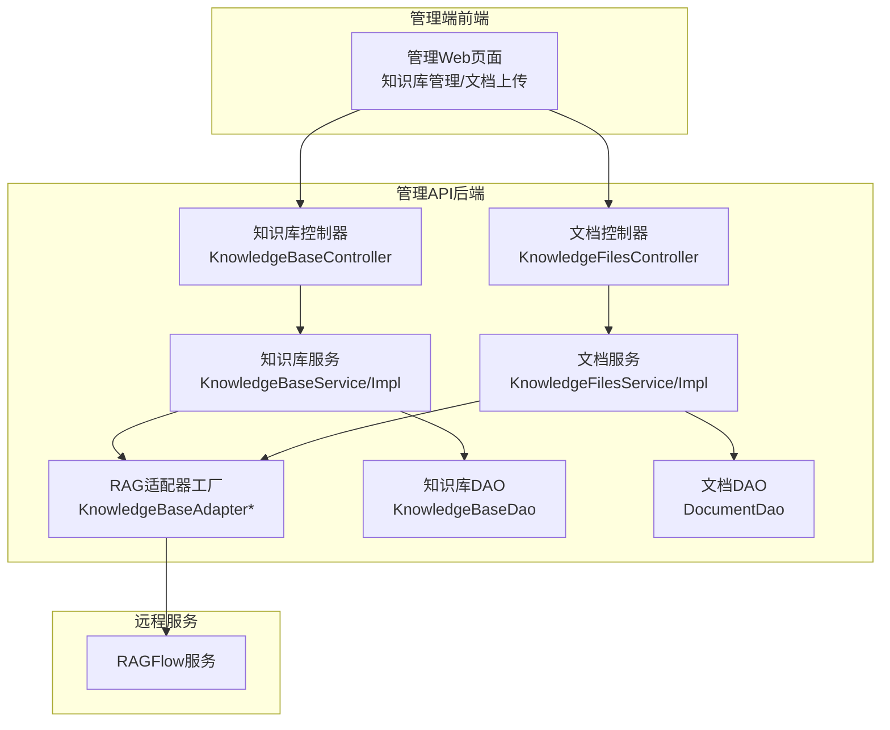
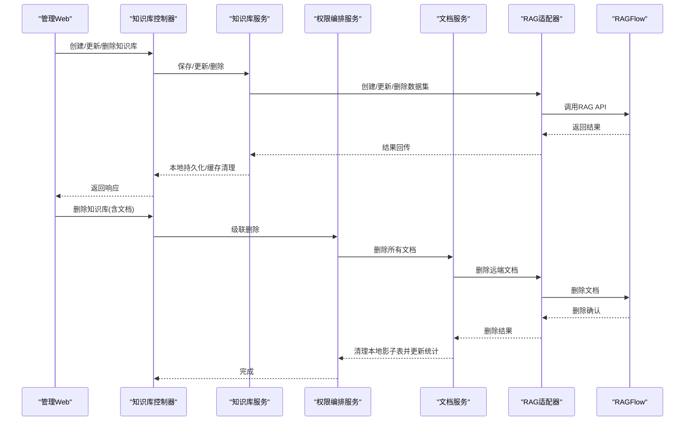
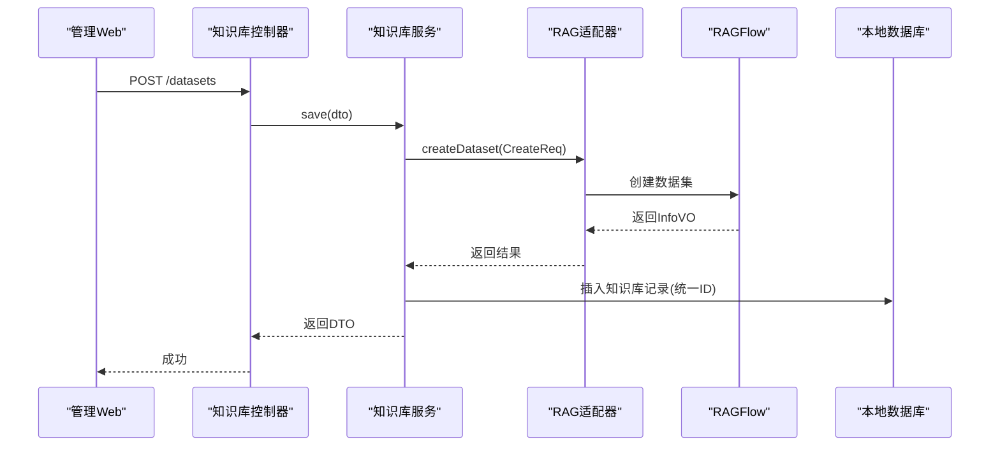
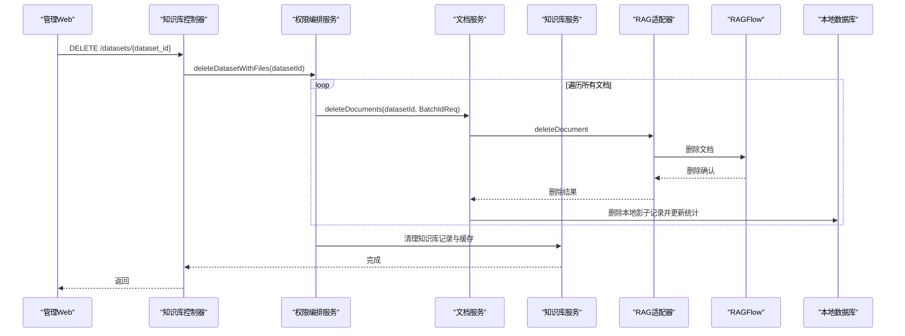
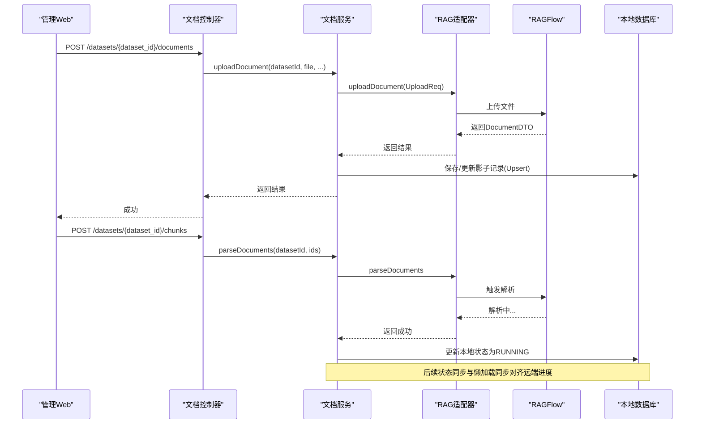
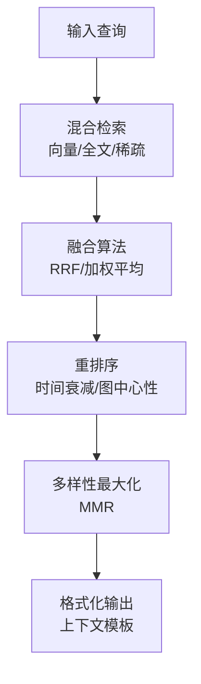
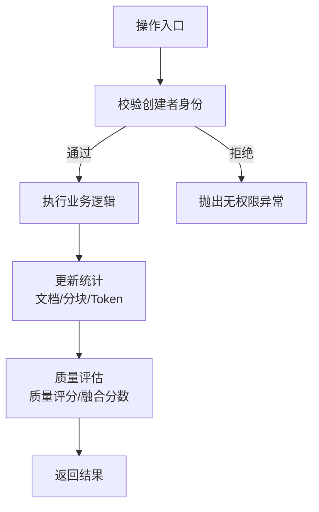
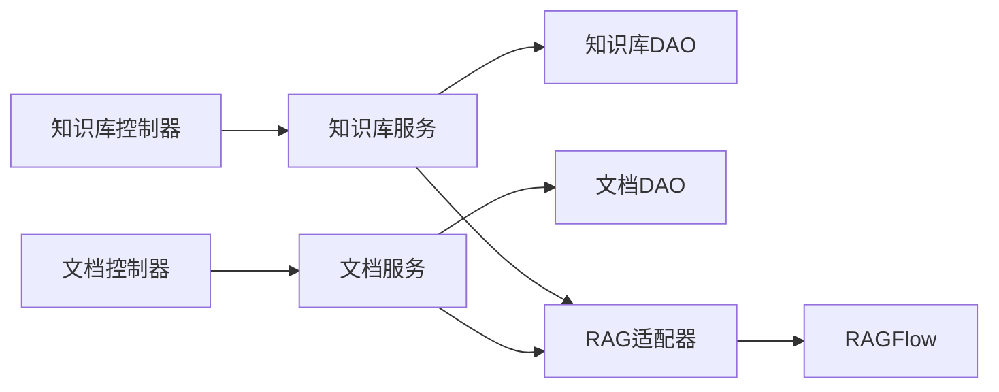

# 知识库管理

<cite>
**本文引用的文件**
- [KnowledgeBaseController.java](file://main/manager-api/src/main/java/xiaozhi/modules/knowledge/controller/KnowledgeBaseController.java)
- [KnowledgeBaseService.java](file://main/manager-api/src/main/java/xiaozhi/modules/knowledge/service/KnowledgeBaseService.java)
- [KnowledgeBaseServiceImpl.java](file://main/manager-api/src/main/java/xiaozhi/modules/knowledge/service/impl/KnowledgeBaseServiceImpl.java)
- [KnowledgeManagerService.java](file://main/manager-api/src/main/java/xiaozhi/modules/knowledge/service/KnowledgeManagerService.java)
- [KnowledgeFilesController.java](file://main/manager-api/src/main/java/xiaozhi/modules/knowledge/controller/KnowledgeFilesController.java)
- [KnowledgeFilesService.java](file://main/manager-api/src/main/java/xiaozhi/modules/knowledge/service/KnowledgeFilesService.java)
- [KnowledgeFilesServiceImpl.java](file://main/manager-api/src/main/java/xiaozhi/modules/knowledge/service/impl/KnowledgeFilesServiceImpl.java)
- [KnowledgeBaseEntity.java](file://main/manager-api/src/main/java/xiaozhi/modules/knowledge/entity/KnowledgeBaseEntity.java)
- [DocumentEntity.java](file://main/manager-api/src/main/java/xiaozhi/modules/knowledge/entity/DocumentEntity.java)
- [PowerMem-质量评分与融合算法.md](file://main/xiaozhi-server/docs/powermem/PowerMem-质量评分与融合算法.md)
- [PowerMem-元数据字段.md](file://main/xiaozhi-server/docs/powermem/PowerMem-Metadata-Fields.md)
- [Memory_System_Architecture_Blueprint.md.bak](file://main/xiaozhi-server/docs/architecture/Memory_System_Architecture_Blueprint.md.bak)
- [memory_system_architecture.html](file://main/xiaozhi-server/docs/architecture/memory_system_architecture.html)
- [知识库管理页面国际化-越南语](file://main/manager-web/src/i18n/vi.js)
- [知识库管理页面国际化-德语](file://main/manager-web/src/i18n/de.js)
</cite>

## 目录
1. [简介](#简介)
2. [项目结构](#项目结构)
3. [核心组件](#核心组件)
4. [架构总览](#架构总览)
5. [详细组件分析](#详细组件分析)
6. [依赖关系分析](#依赖关系分析)
7. [性能考量](#性能考量)
8. [故障排查指南](#故障排查指南)
9. [结论](#结论)
10. [附录](#附录)

## 简介
本文件面向小智ESP32服务器的知识库管理模块，系统性阐述知识库的创建、编辑与删除流程；文档上传、分段处理与向量索引的完整链路；知识检索、语义匹配与结果排序的技术实现；权限控制、访问统计与质量评估机制；以及批量导入、增量更新与版本管理的解决方案，并补充文档格式支持、编码转换与元数据提取的技术细节。

## 项目结构
知识库管理由“管理API”后端与“Web管理端”前端协同构成，后端采用分层架构：控制器层负责鉴权与参数封装，服务层编排业务流程，DAO层访问本地影子表，适配器层对接RAGFlow远程服务；前端提供知识库与文档的可视化管理界面。

图表来源
- [KnowledgeBaseController.java:35-163](file://main/manager-api/src/main/java/xiaozhi/modules/knowledge/controller/KnowledgeBaseController.java#L35-L163)
- [KnowledgeBaseServiceImpl.java:47-499](file://main/manager-api/src/main/java/xiaozhi/modules/knowledge/service/impl/KnowledgeBaseServiceImpl.java#L47-L499)
- [KnowledgeFilesController.java:34-226](file://main/manager-api/src/main/java/xiaozhi/modules/knowledge/controller/KnowledgeFilesController.java#L34-L226)
- [KnowledgeFilesServiceImpl.java:46-799](file://main/manager-api/src/main/java/xiaozhi/modules/knowledge/service/impl/KnowledgeFilesServiceImpl.java#L46-L799)

章节来源
- [KnowledgeBaseController.java:35-163](file://main/manager-api/src/main/java/xiaozhi/modules/knowledge/controller/KnowledgeBaseController.java#L35-L163)
- [KnowledgeFilesController.java:34-226](file://main/manager-api/src/main/java/xiaozhi/modules/knowledge/controller/KnowledgeFilesController.java#L34-L226)

## 核心组件
- 知识库实体与文档实体：分别映射本地影子表，承载知识库元信息与文档解析状态、统计信息。
- 知识库服务：负责知识库的创建、更新、删除、分页查询、RAG配置获取与统计更新。
- 文档服务：负责文档上传、分段解析、切片列表、召回测试、本地影子表维护与状态同步。
- 控制器：统一鉴权与参数校验，调用服务层执行业务。
- 权限编排服务：提供级联删除能力，避免循环依赖与孤儿数据。

章节来源
- [KnowledgeBaseEntity.java:14-81](file://main/manager-api/src/main/java/xiaozhi/modules/knowledge/entity/KnowledgeBaseEntity.java#L14-L81)
- [DocumentEntity.java:19-98](file://main/manager-api/src/main/java/xiaozhi/modules/knowledge/entity/DocumentEntity.java#L19-L98)
- [KnowledgeBaseService.java:12-106](file://main/manager-api/src/main/java/xiaozhi/modules/knowledge/service/KnowledgeBaseService.java#L12-L106)
- [KnowledgeFilesService.java:14-132](file://main/manager-api/src/main/java/xiaozhi/modules/knowledge/service/KnowledgeFilesService.java#L14-L132)
- [KnowledgeManagerService.java:9-24](file://main/manager-api/src/main/java/xiaozhi/modules/knowledge/service/KnowledgeManagerService.java#L9-L24)

## 架构总览
知识库管理采用“本地影子表 + 远程RAGFlow”的双写模式：本地持久化知识库与文档的影子记录，同时通过适配器与RAGFlow保持强一致；列表查询与状态展示优先本地，必要时拉取远端最新状态；删除与更新严格保证一致性，避免脏数据。

图表来源
- [KnowledgeBaseController.java:77-127](file://main/manager-api/src/main/java/xiaozhi/modules/knowledge/controller/KnowledgeBaseController.java#L77-L127)
- [KnowledgeBaseServiceImpl.java:200-424](file://main/manager-api/src/main/java/xiaozhi/modules/knowledge/service/impl/KnowledgeBaseServiceImpl.java#L200-L424)
- [KnowledgeFilesServiceImpl.java:487-566](file://main/manager-api/src/main/java/xiaozhi/modules/knowledge/service/impl/KnowledgeFilesServiceImpl.java#L487-L566)

## 详细组件分析

### 知识库创建与更新
- 创建流程：校验重复名称，选择RAG模型配置，构造数据集创建请求（含用户名前缀），调用适配器创建数据集并回写本地影子表，统一本地ID与远端ID，持久化嵌入模型、分块方法、权限、解析配置与统计字段。
- 更新流程：校验名称冲突与数据集ID冲突，智能补全关键字段（权限、分块方法），构造更新请求，调用适配器更新远端数据集，随后更新本地记录并清理缓存。
- 同步与一致性：列表页实时从RAG同步名称、简介与文档计数；删除后本地清理并清理缓存。

图表来源
- [KnowledgeBaseController.java:77-83](file://main/manager-api/src/main/java/xiaozhi/modules/knowledge/controller/KnowledgeBaseController.java#L77-L83)
- [KnowledgeBaseServiceImpl.java:200-287](file://main/manager-api/src/main/java/xiaozhi/modules/knowledge/service/impl/KnowledgeBaseServiceImpl.java#L200-L287)

章节来源
- [KnowledgeBaseController.java:77-106](file://main/manager-api/src/main/java/xiaozhi/modules/knowledge/controller/KnowledgeBaseController.java#L77-L106)
- [KnowledgeBaseServiceImpl.java:200-370](file://main/manager-api/src/main/java/xiaozhi/modules/knowledge/service/impl/KnowledgeBaseServiceImpl.java#L200-L370)

### 知识库删除与级联删除
- 单个删除：先鉴权，再通过编排服务执行级联删除，确保远端文档与本地影子表一致清理。
- 批量删除：逐条鉴权，调用编排服务逐个删除。
- 本地清理：删除插件映射、删除知识库记录、清理缓存。

图表来源
- [KnowledgeBaseController.java:108-127](file://main/manager-api/src/main/java/xiaozhi/modules/knowledge/controller/KnowledgeBaseController.java#L108-L127)
- [KnowledgeManagerService.java:9-24](file://main/manager-api/src/main/java/xiaozhi/modules/knowledge/service/KnowledgeManagerService.java#L9-L24)
- [KnowledgeFilesServiceImpl.java:487-566](file://main/manager-api/src/main/java/xiaozhi/modules/knowledge/service/impl/KnowledgeFilesServiceImpl.java#L487-L566)
- [KnowledgeBaseServiceImpl.java:372-424](file://main/manager-api/src/main/java/xiaozhi/modules/knowledge/service/impl/KnowledgeBaseServiceImpl.java#L372-L424)

章节来源
- [KnowledgeBaseController.java:108-154](file://main/manager-api/src/main/java/xiaozhi/modules/knowledge/controller/KnowledgeBaseController.java#L108-L154)
- [KnowledgeFilesServiceImpl.java:487-566](file://main/manager-api/src/main/java/xiaozhi/modules/knowledge/service/impl/KnowledgeFilesServiceImpl.java#L487-L566)
- [KnowledgeBaseServiceImpl.java:372-424](file://main/manager-api/src/main/java/xiaozhi/modules/knowledge/service/impl/KnowledgeBaseServiceImpl.java#L372-L424)

### 文档上传、分段与向量索引
- 上传流程：校验参数，构造上传请求（含元数据、分块方法、解析配置），调用适配器上传至RAGFlow，返回结果后原子化保存本地影子记录（Upsert），并递增文档计数。
- 分段解析：下发解析指令后，本地影子表状态立即更新为“解析中”，随后通过状态同步与懒加载同步逐步对齐远端进度与统计。
- 向量索引：RAGFlow内部完成分块、嵌入与向量入库，知识库服务通过统计更新接口对总量进行增量修正。

图表来源
- [KnowledgeFilesController.java:96-162](file://main/manager-api/src/main/java/xiaozhi/modules/knowledge/controller/KnowledgeFilesController.java#L96-L162)
- [KnowledgeFilesServiceImpl.java:360-417](file://main/manager-api/src/main/java/xiaozhi/modules/knowledge/service/impl/KnowledgeFilesServiceImpl.java#L360-L417)
- [KnowledgeFilesServiceImpl.java:638-690](file://main/manager-api/src/main/java/xiaozhi/modules/knowledge/service/impl/KnowledgeFilesServiceImpl.java#L638-L690)

章节来源
- [KnowledgeFilesController.java:96-162](file://main/manager-api/src/main/java/xiaozhi/modules/knowledge/controller/KnowledgeFilesController.java#L96-L162)
- [KnowledgeFilesServiceImpl.java:360-417](file://main/manager-api/src/main/java/xiaozhi/modules/knowledge/service/impl/KnowledgeFilesServiceImpl.java#L360-L417)
- [KnowledgeFilesServiceImpl.java:638-690](file://main/manager-api/src/main/java/xiaozhi/modules/knowledge/service/impl/KnowledgeFilesServiceImpl.java#L638-L690)

### 知识检索、语义匹配与结果排序
- 检索引擎：采用混合检索策略，结合向量相似度、全文检索与稀疏检索，通过融合算法（如RRF）得到最终融合分数，并结合时间衰减与图中心性等信号进行重排序。
- 质量评估：基于多路径相似度的加权平均得到质量评分，用于阈值过滤与整体质量评估。
- 上下文格式化：将检索结果按模板格式化，便于后续对话或提示工程使用。

图表来源
- [Memory_System_Architecture_Blueprint.md.bak:418-430](file://main/xiaozhi-server/docs/architecture/Memory_System_Architecture_Blueprint.md.bak#L418-L430)
- [PowerMem-质量评分与融合算法.md:228-270](file://main/xiaozhi-server/docs/powermem/PowerMem-质量评分与融合算法.md#L228-L270)
- [PowerMem-元数据字段.md:329-380](file://main/xiaozhi-server/docs/powermem/PowerMem-Metadata-Fields.md#L329-L380)

章节来源
- [Memory_System_Architecture_Blueprint.md.bak:418-430](file://main/xiaozhi-server/docs/architecture/Memory_System_Architecture_Blueprint.md.bak#L418-L430)
- [PowerMem-质量评分与融合算法.md:228-270](file://main/xiaozhi-server/docs/powermem/PowerMem-质量评分与融合算法.md#L228-L270)
- [PowerMem-元数据字段.md:228-270](file://main/xiaozhi-server/docs/powermem/PowerMem-Metadata-Fields.md#L228-L270)

### 权限控制、访问统计与质量评估
- 权限控制：控制器在每个操作前校验当前登录用户是否为知识库创建者，防止越权访问。
- 访问统计：文档上传新增计数、删除批量扣减、懒加载同步与定时任务同步均通过服务层统计接口进行增量更新。
- 质量评估：通过质量评分与融合分数辅助阈值过滤与排序，提升检索结果质量。

图表来源
- [KnowledgeBaseController.java:60-75](file://main/manager-api/src/main/java/xiaozhi/modules/knowledge/controller/KnowledgeBaseController.java#L60-L75)
- [KnowledgeFilesController.java:44-55](file://main/manager-api/src/main/java/xiaozhi/modules/knowledge/controller/KnowledgeFilesController.java#L44-L55)
- [KnowledgeBaseServiceImpl.java:454-458](file://main/manager-api/src/main/java/xiaozhi/modules/knowledge/service/impl/KnowledgeBaseServiceImpl.java#L454-L458)
- [KnowledgeFilesServiceImpl.java:152-158](file://main/manager-api/src/main/java/xiaozhi/modules/knowledge/service/impl/KnowledgeFilesServiceImpl.java#L152-L158)

章节来源
- [KnowledgeBaseController.java:60-75](file://main/manager-api/src/main/java/xiaozhi/modules/knowledge/controller/KnowledgeBaseController.java#L60-L75)
- [KnowledgeFilesController.java:44-55](file://main/manager-api/src/main/java/xiaozhi/modules/knowledge/controller/KnowledgeFilesController.java#L44-L55)
- [KnowledgeBaseServiceImpl.java:454-458](file://main/manager-api/src/main/java/xiaozhi/modules/knowledge/service/impl/KnowledgeBaseServiceImpl.java#L454-L458)
- [KnowledgeFilesServiceImpl.java:152-158](file://main/manager-api/src/main/java/xiaozhi/modules/knowledge/service/impl/KnowledgeFilesServiceImpl.java#L152-L158)

### 批量导入、增量更新与版本管理
- 批量导入：通过文档上传接口批量提交文件，服务层逐个调用RAGFlow上传并保存本地影子记录。
- 增量更新：解析完成后，懒加载同步与定时任务同步对Token数等统计进行增量修正，避免远端与本地统计不一致。
- 版本管理：通过RAGFlow的解析与向量化流程实现版本化存储与检索，本地仅维护影子表与元数据。

章节来源
- [KnowledgeFilesController.java:96-115](file://main/manager-api/src/main/java/xiaozhi/modules/knowledge/controller/KnowledgeFilesController.java#L96-L115)
- [KnowledgeFilesServiceImpl.java:152-161](file://main/manager-api/src/main/java/xiaozhi/modules/knowledge/service/impl/KnowledgeFilesServiceImpl.java#L152-L161)
- [KnowledgeFilesServiceImpl.java:764-800](file://main/manager-api/src/main/java/xiaozhi/modules/knowledge/service/impl/KnowledgeFilesServiceImpl.java#L764-L800)

### 文档格式支持、编码转换与元数据提取
- 文档格式支持：识别PDF、DOC/DOCX、TXT、MD/MDX、CSV/XLS/XLSX、PPT/PPTX等常见格式，并归类为document/spreadsheet/presentation等类型。
- 编码转换：上传时保留原始文件名，解析配置与元数据以JSON形式序列化/反序列化，确保跨语言与跨组件稳定传输。
- 元数据提取：支持自定义元数据字段，服务层在保存与同步时进行JSON解析与序列化，确保本地与远端一致。

章节来源
- [KnowledgeFilesServiceImpl.java:568-614](file://main/manager-api/src/main/java/xiaozhi/modules/knowledge/service/impl/KnowledgeFilesServiceImpl.java#L568-L614)
- [KnowledgeFilesServiceImpl.java:190-211](file://main/manager-api/src/main/java/xiaozhi/modules/knowledge/service/impl/KnowledgeFilesServiceImpl.java#L190-L211)
- [KnowledgeFilesServiceImpl.java:436-462](file://main/manager-api/src/main/java/xiaozhi/modules/knowledge/service/impl/KnowledgeFilesServiceImpl.java#L436-L462)

## 依赖关系分析
- 控制器依赖服务层；服务层依赖DAO与适配器工厂；适配器工厂依赖RAGFlow远程服务。
- 知识库服务与文档服务之间通过RAG配置与数据集ID耦合，避免直接互相调用，降低循环依赖风险。
- 本地与远端通过影子表与状态同步机制保持一致性，减少直接依赖带来的复杂性。

图表来源
- [KnowledgeBaseController.java:35-163](file://main/manager-api/src/main/java/xiaozhi/modules/knowledge/controller/KnowledgeBaseController.java#L35-L163)
- [KnowledgeFilesController.java:34-226](file://main/manager-api/src/main/java/xiaozhi/modules/knowledge/controller/KnowledgeFilesController.java#L34-L226)
- [KnowledgeBaseServiceImpl.java:47-499](file://main/manager-api/src/main/java/xiaozhi/modules/knowledge/service/impl/KnowledgeBaseServiceImpl.java#L47-L499)
- [KnowledgeFilesServiceImpl.java:46-799](file://main/manager-api/src/main/java/xiaozhi/modules/knowledge/service/impl/KnowledgeFilesServiceImpl.java#L46-L799)

章节来源
- [KnowledgeBaseController.java:35-163](file://main/manager-api/src/main/java/xiaozhi/modules/knowledge/controller/KnowledgeBaseController.java#L35-L163)
- [KnowledgeFilesController.java:34-226](file://main/manager-api/src/main/java/xiaozhi/modules/knowledge/controller/KnowledgeFilesController.java#L34-L226)

## 性能考量
- 列表查询：本地优先，必要时从RAG拉取最新状态，避免频繁远程调用；对RUNNING/CANCEL/FAIL等状态设置不同冷却时间，降低同步频率。
- 状态同步：懒加载同步与定时任务同步相结合，动态计算Token增量并修正统计，减少不必要的全量扫描。
- 检索性能：采用IVF_FLAT索引、余弦距离预归一化、Top-k剪枝与查询缓存等优化技术，提升检索效率与稳定性。

章节来源
- [KnowledgeFilesServiceImpl.java:113-161](file://main/manager-api/src/main/java/xiaozhi/modules/knowledge/service/impl/KnowledgeFilesServiceImpl.java#L113-L161)
- [Memory_System_Architecture_Blueprint.md.bak:782-793](file://main/xiaozhi-server/docs/architecture/Memory_System_Architecture_Blueprint.md.bak#L782-L793)

## 故障排查指南
- 创建失败：检查RAG配置是否存在、模型类型是否注册、返回ID是否有效；若远端创建成功而本地保存失败，服务层会尝试回滚远端数据集。
- 删除失败：严格一致性要求RAG删除成功后才允许本地删除，若RAG删除失败会抛出异常并回滚事务。
- 文档解析中禁止删除：拦截正在解析中的文档删除请求，避免数据不一致。
- 状态不同步：检查冷却时间与适配器初始化是否成功；关注懒加载同步与定时任务同步的日志。
- 权限异常：确认当前登录用户是否为知识库创建者；控制器会在每次操作前进行校验。

章节来源
- [KnowledgeBaseServiceImpl.java:270-286](file://main/manager-api/src/main/java/xiaozhi/modules/knowledge/service/impl/KnowledgeBaseServiceImpl.java#L270-L286)
- [KnowledgeBaseServiceImpl.java:390-411](file://main/manager-api/src/main/java/xiaozhi/modules/knowledge/service/impl/KnowledgeBaseServiceImpl.java#L390-L411)
- [KnowledgeFilesServiceImpl.java:512-521](file://main/manager-api/src/main/java/xiaozhi/modules/knowledge/service/impl/KnowledgeFilesServiceImpl.java#L512-L521)
- [KnowledgeFilesServiceImpl.java:113-161](file://main/manager-api/src/main/java/xiaozhi/modules/knowledge/service/impl/KnowledgeFilesServiceImpl.java#L113-L161)
- [KnowledgeBaseController.java:69-72](file://main/manager-api/src/main/java/xiaozhi/modules/knowledge/controller/KnowledgeBaseController.java#L69-L72)

## 结论
知识库管理模块通过“本地影子表 + 远程RAGFlow”的双写架构，实现了知识库与文档的强一致性管理；结合权限控制、状态同步与统计更新，保障了系统的可靠性与可维护性；检索侧采用混合检索与融合排序，辅以质量评估指标，显著提升了检索效果与用户体验。

## 附录
- 国际化文本参考：知识库管理页面标题与操作文案在多语言资源中均有体现，便于前端多语言适配。

章节来源
- [知识库管理页面国际化-越南语:1253-1273](file://main/manager-web/src/i18n/vi.js#L1253-L1273)
- [知识库管理页面国际化-德语:1253-1274](file://main/manager-web/src/i18n/de.js#L1253-L1274)