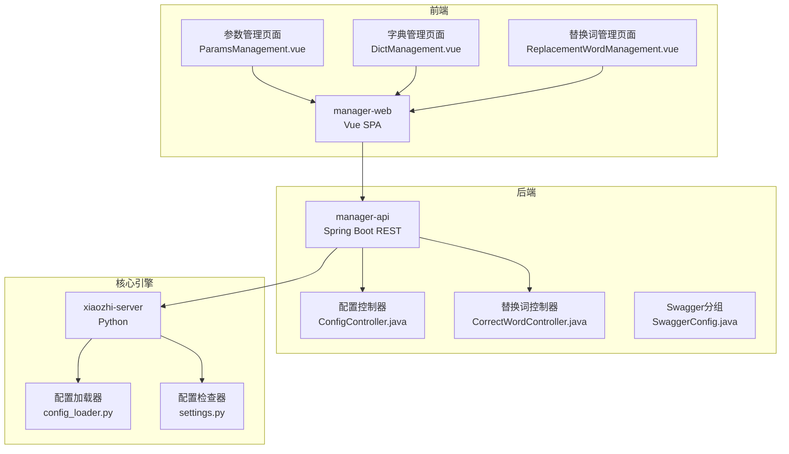
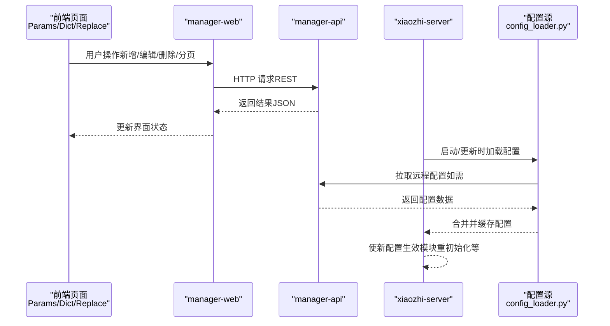
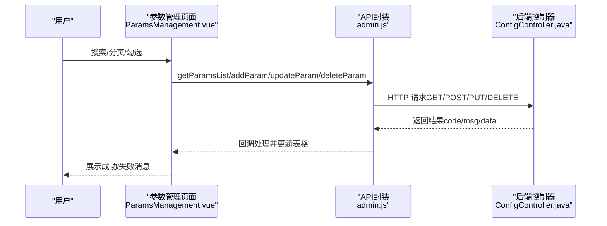
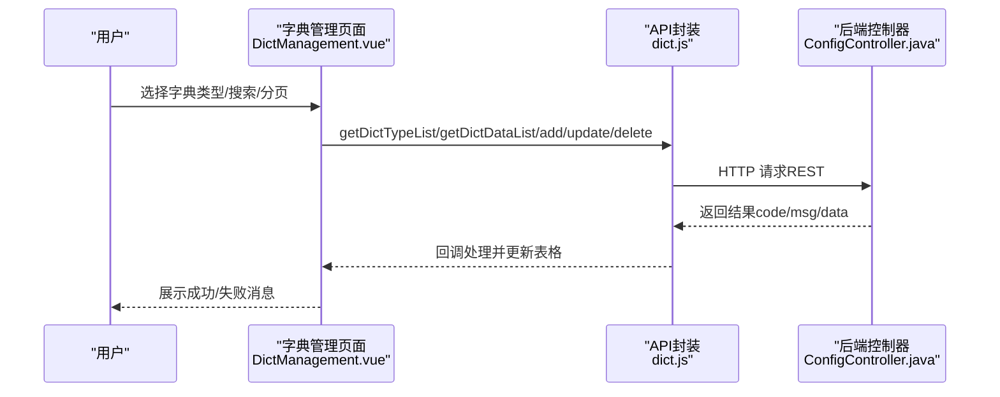
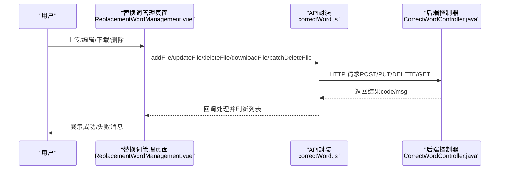
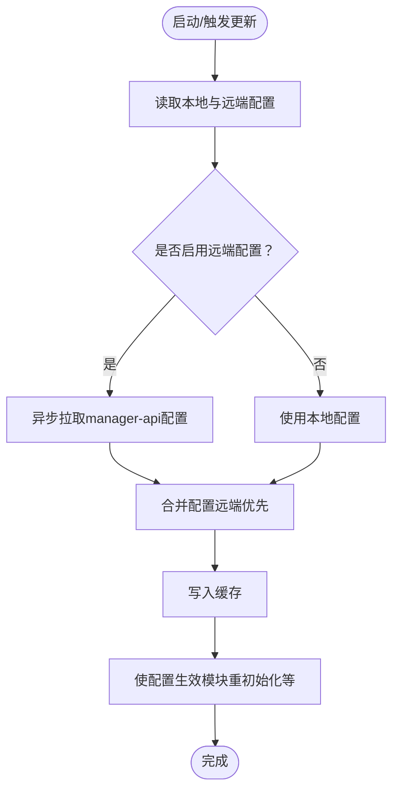
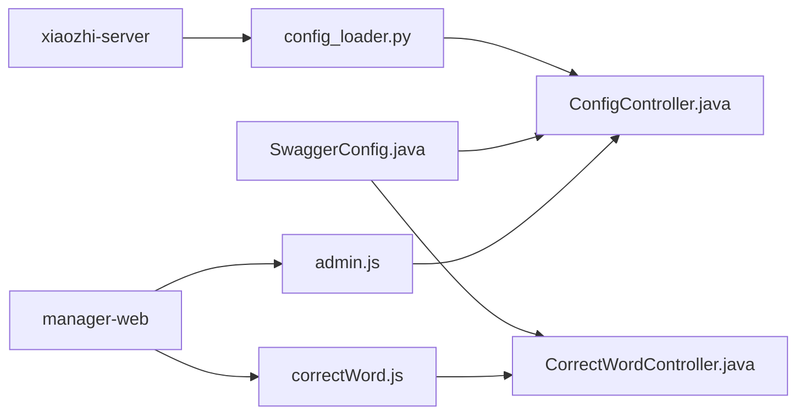

# 系统设置

<cite>
**本文引用的文件**   
- [settings.py](file://main/xiaozhi-server/config/settings.py)
- [config_loader.py](file://main/xiaozhi-server/config/config_loader.py)
- [ParamsManagement.vue](file://main/manager-web/src/views/ParamsManagement.vue)
- [DictManagement.vue](file://main/manager-web/src/views/DictManagement.vue)
- [ReplacementWordManagement.vue](file://main/manager-web/src/views/ReplacementWordManagement.vue)
- [ParamDialog.vue](file://main/manager-web/src/components/ParamDialog.vue)
- [ReplacementWordDialog.vue](file://main/manager-web/src/components/ReplacementWordDialog.vue)
- [admin.js](file://main/manager-web/src/apis/module/admin.js)
- [correctWord.js](file://main/manager-web/src/apis/module/correctWord.js)
- [ConfigController.java](file://main/manager-api/src/main/java/xiaozhi/modules/config/controller/ConfigController.java)
- [CorrectWordController.java](file://main/manager-api/src/main/java/xiaozhi/modules/correctword/controller/CorrectWordController.java)
- [CorrectWordsDTO.java](file://main/manager-api/src/main/java/xiaozhi/modules/config/dto/CorrectWordsDTO.java)
- [SwaggerConfig.java](file://main/manager-api/src/main/java/xiaozhi/common/config/SwaggerConfig.java)
- [README_en.md](file://main/README_en.md)
</cite>

## 目录
1. [简介](#简介)
2. [项目结构](#项目结构)
3. [核心组件](#核心组件)
4. [架构总览](#架构总览)
5. [详细组件分析](#详细组件分析)
6. [依赖分析](#依赖分析)
7. [性能考虑](#性能考虑)
8. [故障排查指南](#故障排查指南)
9. [结论](#结论)
10. [附录](#附录)

## 简介
本文件面向“小智ESP32服务器”的系统设置模块，围绕以下目标展开：系统参数配置、字典管理、替换词表的实现与运维；配置项的分类管理、动态更新与生效机制；字典数据的维护、同步与缓存策略；替换词的规则配置、优先级与匹配算法；以及配置备份、导入导出与版本控制方案，并给出配置验证、错误处理与回滚机制的技术实现思路。

## 项目结构
系统由四部分协同组成：
- ESP32硬件（客户端设备）
- xiaozhi-server（Python核心引擎，负责语音链路与AI交互）
- manager-api（Java后端，提供REST API与持久化）
- manager-web（Vue前端，提供图形化配置界面）

配置在启动时由xiaozhi-server从manager-api拉取，运行期可动态刷新；前端通过manager-web进行参数、字典与替换词的维护。

图表来源
- [README_en.md:308-435](file://main/README_en.md#L308-L435)
- [config_loader.py:1-193](file://main/xiaozhi-server/config/config_loader.py#L1-L193)
- [settings.py:1-34](file://main/xiaozhi-server/config/settings.py#L1-L34)
- [ConfigController.java:39-55](file://main/manager-api/src/main/java/xiaozhi/modules/config/controller/ConfigController.java#L39-L55)
- [CorrectWordController.java:35-57](file://main/manager-api/src/main/java/xiaozhi/modules/correctword/controller/CorrectWordController.java#L35-L57)
- [SwaggerConfig.java:58-114](file://main/manager-api/src/main/java/xiaozhi/common/config/SwaggerConfig.java#L58-L114)

章节来源
- [README_en.md:308-435](file://main/README_en.md#L308-L435)

## 核心组件
- 配置加载与合并：xiaozhi-server在启动或触发更新时，从本地与远端配置源加载并合并，支持缓存与目录预创建。
- 参数管理：前端参数列表、新增/编辑/删除、分页与敏感字段遮罩展示。
- 字典管理：字典类型与字典数据的增删改查、分页与批量操作。
- 替换词管理：替换词文件的上传/下载/编辑/删除、批量操作与内容校验。
- 后端接口：参数、字典、替换词的REST API，以及配置拉取接口。

章节来源
- [config_loader.py:27-193](file://main/xiaozhi-server/config/config_loader.py#L27-L193)
- [ParamsManagement.vue:1-742](file://main/manager-web/src/views/ParamsManagement.vue#L1-L742)
- [DictManagement.vue:1-931](file://main/manager-web/src/views/DictManagement.vue#L1-L931)
- [ReplacementWordManagement.vue:1-763](file://main/manager-web/src/views/ReplacementWordManagement.vue#L1-L763)
- [admin.js:60-136](file://main/manager-web/src/apis/module/admin.js#L60-L136)
- [correctWord.js:5-128](file://main/manager-web/src/apis/module/correctWord.js#L5-L128)

## 架构总览
系统采用“前端-后端-核心引擎-配置源”的分层协作模式。前端通过HTTP API与后端交互，后端持久化配置并通过REST接口向核心引擎提供最新配置；核心引擎在启动或收到更新信号时拉取配置并应用。

图表来源
- [README_en.md:308-435](file://main/README_en.md#L308-L435)
- [config_loader.py:27-94](file://main/xiaozhi-server/config/config_loader.py#L27-L94)
- [ConfigController.java:39-55](file://main/manager-api/src/main/java/xiaozhi/modules/config/controller/ConfigController.java#L39-L55)

## 详细组件分析

### 系统参数配置（参数管理）
- 功能要点
  - 列表分页、搜索、全选/反选、批量删除
  - 新增/编辑参数（含类型校验：string/number/boolean/array/json）
  - 敏感参数自动遮罩，支持切换查看
  - 前端表单校验与后端接口交互
- 数据流
  - 前端ParamsManagement.vue通过admin.js调用后端REST接口，完成参数的增删改查与分页查询。
  - 参数值类型在前端ParamDialog.vue中进行格式化与校验（如JSON压缩、数组分号格式）。

图表来源
- [ParamsManagement.vue:165-324](file://main/manager-web/src/views/ParamsManagement.vue#L165-L324)
- [admin.js:60-136](file://main/manager-web/src/apis/module/admin.js#L60-L136)
- [ParamDialog.vue:117-153](file://main/manager-web/src/components/ParamDialog.vue#L117-L153)

章节来源
- [ParamsManagement.vue:1-742](file://main/manager-web/src/views/ParamsManagement.vue#L1-L742)
- [admin.js:60-136](file://main/manager-web/src/apis/module/admin.js#L60-L136)
- [ParamDialog.vue:1-420](file://main/manager-web/src/components/ParamDialog.vue#L1-L420)

### 字典管理（字典类型与字典数据）
- 功能要点
  - 左侧字典类型列表，右侧字典数据列表，双表联动
  - 支持字典类型新增/编辑/批量删除，字典数据新增/编辑/删除/批量删除
  - 分页与搜索，支持排序字段
- 数据流
  - 前端DictManagement.vue通过dict.js（未在本文列出具体文件）调用后端接口，完成字典类型与数据的增删改查。

图表来源
- [DictManagement.vue:182-351](file://main/manager-web/src/views/DictManagement.vue#L182-L351)

章节来源
- [DictManagement.vue:1-931](file://main/manager-web/src/views/DictManagement.vue#L1-L931)

### 替换词管理（替换词文件）
- 功能要点
  - 文件列表：名称、条目数、内容预览、创建/更新时间、操作（编辑/下载/删除/批量删除）
  - 新增/编辑：文件名必填，内容按行分隔，每行必须包含且仅包含一个“|”，左右均不可为空；支持从文本文件上传覆盖
  - 内容校验：最大条目限制、特殊字符禁止、格式提示
- 数据流
  - 前端ReplacementWordManagement.vue通过correctWord.js调用后端接口，完成文件的增删改查与批量删除；支持下载为.txt文件。

图表来源
- [ReplacementWordManagement.vue:268-374](file://main/manager-web/src/views/ReplacementWordManagement.vue#L268-L374)
- [correctWord.js:5-128](file://main/manager-web/src/apis/module/correctWord.js#L5-L128)
- [ReplacementWordDialog.vue:95-241](file://main/manager-web/src/components/ReplacementWordDialog.vue#L95-L241)

章节来源
- [ReplacementWordManagement.vue:1-763](file://main/manager-web/src/views/ReplacementWordManagement.vue#L1-L763)
- [correctWord.js:1-130](file://main/manager-web/src/apis/module/correctWord.js#L1-L130)
- [ReplacementWordDialog.vue:1-537](file://main/manager-web/src/components/ReplacementWordDialog.vue#L1-L537)

### 配置加载与动态更新机制
- 配置来源与合并
  - 本地config.yaml与data/.config.yaml合并；若启用从manager-api拉取，则优先使用远端配置并覆盖同名键。
  - 启动时检查配置文件存在性与冲突；目录不存在时自动创建（日志、ASR/TTS输出、模型输出等）。
- 运行期更新
  - xiaozhi-server在启动或收到更新触发时，通过异步方式从manager-api拉取配置，合并后写入缓存并使新配置生效。
- 安全与兼容
  - server端配置以本地为准（如IP、端口、鉴权开关等），其他模块配置优先远端返回值。

图表来源
- [config_loader.py:27-94](file://main/xiaozhi-server/config/config_loader.py#L27-L94)
- [config_loader.py:123-162](file://main/xiaozhi-server/config/config_loader.py#L123-L162)
- [settings.py:9-34](file://main/xiaozhi-server/config/settings.py#L9-L34)

章节来源
- [config_loader.py:1-193](file://main/xiaozhi-server/config/config_loader.py#L1-L193)
- [settings.py:1-34](file://main/xiaozhi-server/config/settings.py#L1-L34)

### 替换词规则、优先级与匹配算法
- 规则配置
  - 每行一条记录，格式为“原文|替换词”，中间以“|”分隔；原文与替换词均不可为空，且不得包含指定特殊字符。
  - 支持从文本文件上传覆盖，最大条目数量限制。
- 优先级与匹配
  - 页面未体现显式优先级字段；通常按文件内顺序或服务端解析顺序进行匹配。建议在服务端实现时采用“先匹配先替换”的策略，并支持按长度降序或精确匹配优先的策略以避免歧义。
- 建议
  - 服务端解析时对重复键进行去重或覆盖策略；对长词优先匹配可减少误替换。

章节来源
- [ReplacementWordDialog.vue:95-135](file://main/manager-web/src/components/ReplacementWordDialog.vue#L95-L135)
- [ReplacementWordDialog.vue:177-241](file://main/manager-web/src/components/ReplacementWordDialog.vue#L177-L241)

### 配置验证、错误处理与回滚
- 配置验证
  - 前端参数类型校验（JSON/数组格式）、替换词内容校验（行数、分隔符、空值、特殊字符）。
  - 后端控制器对必填字段进行校验（如CorrectWordsDTO的macAddress非空）。
- 错误处理
  - 前端统一捕获网络失败并重试；后端返回标准响应结构（code/msg/data）。
- 回滚机制
  - 建议在后端实现“事务性更新”：先写临时文件/临时表，校验通过后再原子性替换；失败时回滚至上次有效版本。
  - 对于xiaozhi-server，可在配置更新失败时保留旧配置并记录错误日志，避免服务不可用。

章节来源
- [ParamDialog.vue:117-153](file://main/manager-web/src/components/ParamDialog.vue#L117-L153)
- [ReplacementWordDialog.vue:95-135](file://main/manager-web/src/components/ReplacementWordDialog.vue#L95-L135)
- [CorrectWordsDTO.java:11-14](file://main/manager-api/src/main/java/xiaozhi/modules/config/dto/CorrectWordsDTO.java#L11-L14)

## 依赖分析
- 前端依赖
  - manager-web通过apis/module下的模块封装HTTP请求，分别对接admin与correct-word接口。
- 后端依赖
  - SwaggerConfig.java定义了多个API分组（admin/config/knowledge/bot/correct-word），便于文档化与权限控制。
  - ConfigController与CorrectWordController分别提供参数、字典与替换词的REST接口。
- 核心引擎依赖
  - config_loader.py负责配置加载、合并与缓存；settings.py负责配置文件存在性与冲突检查。

图表来源
- [admin.js:60-136](file://main/manager-web/src/apis/module/admin.js#L60-L136)
- [correctWord.js:5-128](file://main/manager-web/src/apis/module/correctWord.js#L5-L128)
- [ConfigController.java:39-55](file://main/manager-api/src/main/java/xiaozhi/modules/config/controller/ConfigController.java#L39-L55)
- [CorrectWordController.java:35-57](file://main/manager-api/src/main/java/xiaozhi/modules/correctword/controller/CorrectWordController.java#L35-L57)
- [SwaggerConfig.java:58-114](file://main/manager-api/src/main/java/xiaozhi/common/config/SwaggerConfig.java#L58-L114)
- [config_loader.py:27-94](file://main/xiaozhi-server/config/config_loader.py#L27-L94)

章节来源
- [admin.js:1-171](file://main/manager-web/src/apis/module/admin.js#L1-L171)
- [correctWord.js:1-130](file://main/manager-web/src/apis/module/correctWord.js#L1-L130)
- [SwaggerConfig.java:58-114](file://main/manager-api/src/main/java/xiaozhi/common/config/SwaggerConfig.java#L58-L114)
- [config_loader.py:1-193](file://main/xiaozhi-server/config/config_loader.py#L1-L193)

## 性能考虑
- 配置加载
  - 使用缓存避免频繁I/O；目录预创建减少首次访问延迟。
- 前端交互
  - 分页与懒加载提升大列表渲染性能；表单输入时即时校验降低无效请求。
- 后端接口
  - 对高频接口增加限流与缓存；对替换词文件下载采用流式传输与断点续传优化。

## 故障排查指南
- 配置文件问题
  - 若提示找不到data/.config.yaml或存在冲突，检查配置文件路径与内容，确保只保留一种来源（本地或远端）。
- 接口调用失败
  - 查看前端网络失败重试日志与后端返回的错误码；确认manager-api地址与鉴权信息正确。
- 配置不生效
  - 确认xiaozhi-server已触发更新流程并完成缓存写入；检查模块是否支持热更新。

章节来源
- [settings.py:9-34](file://main/xiaozhi-server/config/settings.py#L9-L34)
- [config_loader.py:27-94](file://main/xiaozhi-server/config/config_loader.py#L27-L94)

## 结论
系统设置模块通过前后端协同实现了参数、字典与替换词的全生命周期管理。配置加载与合并机制保证了远端配置的动态性与本地配置的稳定性；前端提供了直观易用的管理界面与完善的校验逻辑；后端通过REST接口与Swagger分组明确了职责边界。建议在服务端进一步完善替换词匹配策略与配置回滚机制，以提升系统的可靠性与可维护性。

## 附录
- 预定义配置方案
  - 参考README中的“入门免费配置”与“全流式配置”两类推荐组合，结合实际资源选择合适的AI服务提供商与参数。
- 版本控制与备份
  - 建议将config.yaml与data/.config.yaml纳入版本控制；对替换词文件采用命名规范与版本号前缀，定期导出备份并在变更前生成快照。

章节来源
- [README_en.md:409-435](file://main/README_en.md#L409-L435)