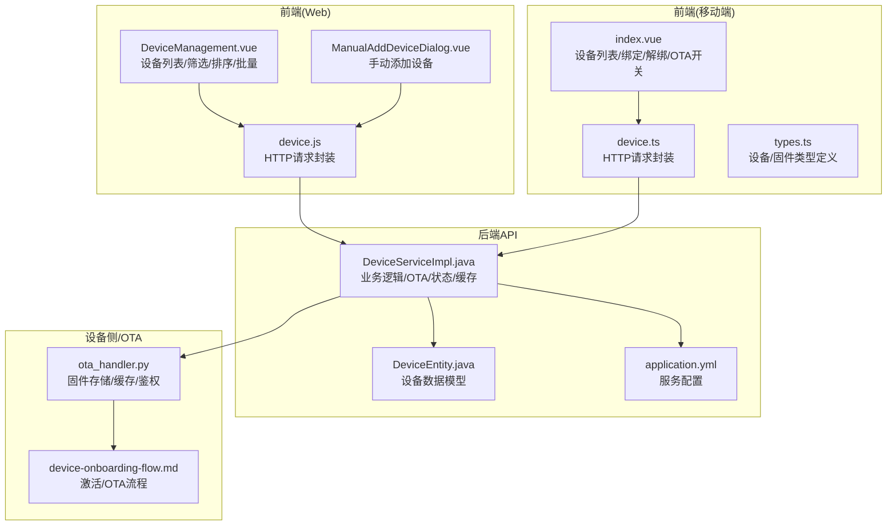
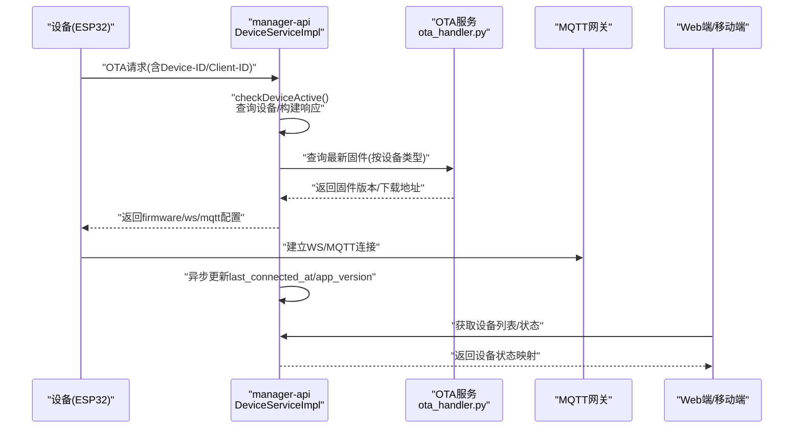
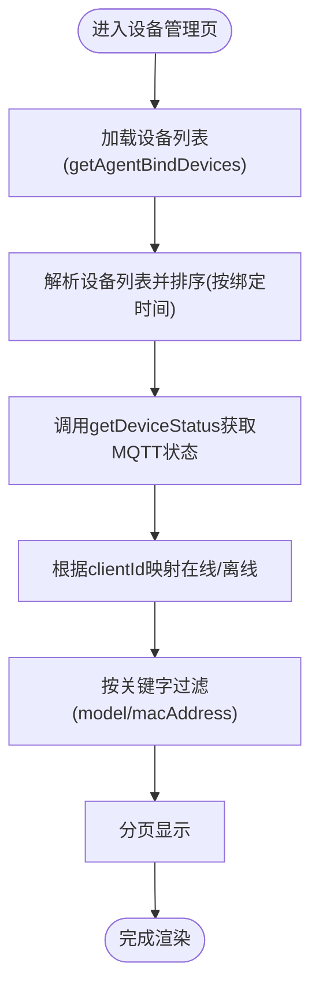
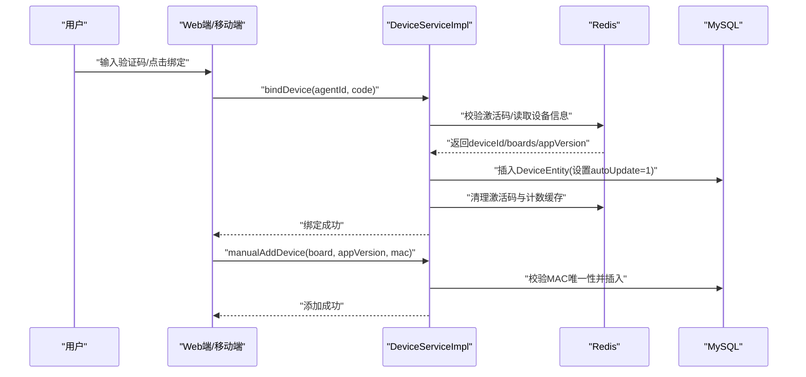
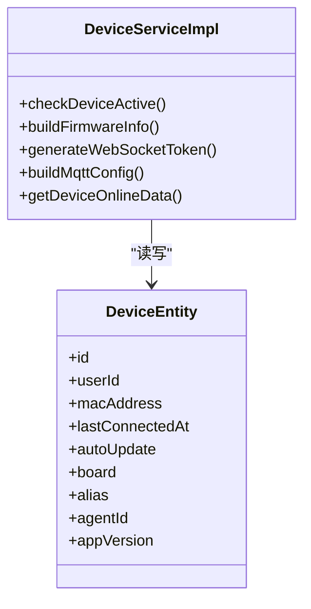
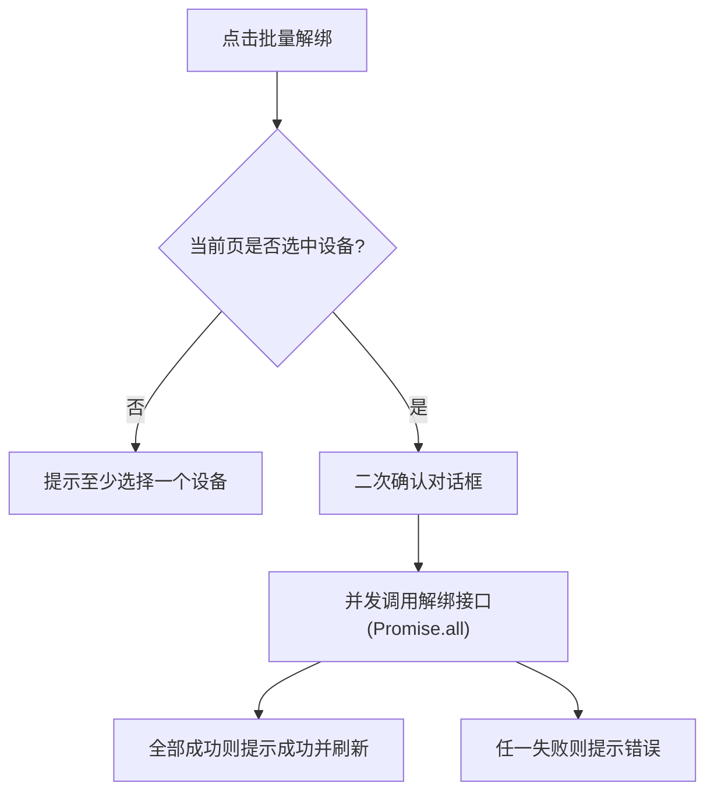
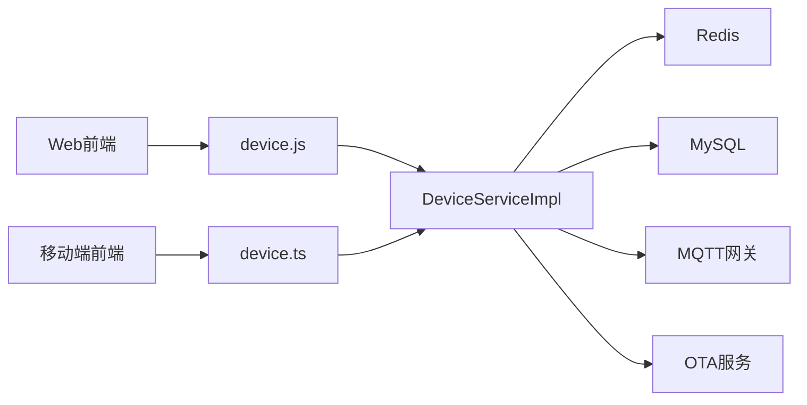

# 设备管理

<cite>
**本文引用的文件**
- [DeviceManagement.vue](file://main/manager-web/src/views/DeviceManagement.vue)
- [device.js](file://main/manager-web/src/apis/module/device.js)
- [ManualAddDeviceDialog.vue](file://main/manager-web/src/components/ManualAddDeviceDialog.vue)
- [index.vue](file://main/manager-mobile/src/pages/device/index.vue)
- [device.ts](file://main/manager-mobile/src/api/device/device.ts)
- [types.ts](file://main/manager-mobile/src/api/device/types.ts)
- [DeviceServiceImpl.java](file://main/manager-api/src/main/java/xiaozhi/modules/device/service/impl/DeviceServiceImpl.java)
- [DeviceEntity.java](file://main/manager-api/src/main/java/xiaozhi/modules/device/entity/DeviceEntity.java)
- [application.yml](file://main/manager-api/src/main/resources/application.yml)
- [device-onboarding-flow.md](file://main/xiaozhi-server/docs/device/device-onboarding-flow.md)
- [ota_handler.py](file://main/xiaozhi-server/core/api/ota_handler.py)
- [data-client.js](file://main/demo-web/js/api/data-client.js)
</cite>

## 目录
1. [简介](#简介)
2. [项目结构](#项目结构)
3. [核心组件](#核心组件)
4. [架构总览](#架构总览)
5. [详细组件分析](#详细组件分析)
6. [依赖分析](#依赖分析)
7. [性能考虑](#性能考虑)
8. [故障排查指南](#故障排查指南)
9. [结论](#结论)
10. [附录](#附录)

## 简介
本文件面向小智ESP32服务器的“设备管理”模块，系统性梳理设备列表展示、筛选与排序、添加设备（自动发现与手动添加）、设备配置管理、固件升级、状态监控、删除与批量操作、连接状态检测与在线离线标识、异常处理、设备信息验证与重复检测、以及数据同步等关键能力。文档以代码级可视化图示呈现模块间交互，并提供可操作的排障建议与最佳实践。

## 项目结构
设备管理涉及三层：前端（Web与移动端）、后端API与服务层、以及设备侧与OTA服务。Web端负责设备列表、筛选、排序、批量操作与状态展示；移动端提供轻量设备管理入口；后端提供设备绑定、解绑、手动添加、OTA与状态查询；设备侧通过OTA接口完成固件升级与状态上报。

**图表来源**
- [DeviceManagement.vue:1-856](file://main/manager-web/src/views/DeviceManagement.vue#L1-L856)
- [device.js:1-108](file://main/manager-web/src/apis/module/device.js#L1-L108)
- [ManualAddDeviceDialog.vue:1-158](file://main/manager-web/src/components/ManualAddDeviceDialog.vue#L1-L158)
- [index.vue:1-632](file://main/manager-mobile/src/pages/device/index.vue#L1-L632)
- [device.ts:1-72](file://main/manager-mobile/src/api/device/device.ts#L1-L72)
- [types.ts:1-21](file://main/manager-mobile/src/api/device/types.ts#L1-L21)
- [DeviceServiceImpl.java:1-876](file://main/manager-api/src/main/java/xiaozhi/modules/device/service/impl/DeviceServiceImpl.java#L1-L876)
- [DeviceEntity.java:1-67](file://main/manager-api/src/main/java/xiaozhi/modules/device/entity/DeviceEntity.java#L1-L67)
- [application.yml:1-66](file://main/manager-api/src/main/resources/application.yml#L1-L66)
- [ota_handler.py:46-77](file://main/xiaozhi-server/core/api/ota_handler.py#L46-L77)
- [device-onboarding-flow.md:47-81](file://main/xiaozhi-server/docs/device/device-onboarding-flow.md#L47-L81)

**章节来源**
- [DeviceManagement.vue:1-856](file://main/manager-web/src/views/DeviceManagement.vue#L1-L856)
- [device.js:1-108](file://main/manager-web/src/apis/module/device.js#L1-L108)
- [ManualAddDeviceDialog.vue:1-158](file://main/manager-web/src/components/ManualAddDeviceDialog.vue#L1-L158)
- [index.vue:1-632](file://main/manager-mobile/src/pages/device/index.vue#L1-L632)
- [device.ts:1-72](file://main/manager-mobile/src/api/device/device.ts#L1-L72)
- [types.ts:1-21](file://main/manager-mobile/src/api/device/types.ts#L1-L21)
- [DeviceServiceImpl.java:1-876](file://main/manager-api/src/main/java/xiaozhi/modules/device/service/impl/DeviceServiceImpl.java#L1-L876)
- [DeviceEntity.java:1-67](file://main/manager-api/src/main/java/xiaozhi/modules/device/entity/DeviceEntity.java#L1-L67)
- [application.yml:1-66](file://main/manager-api/src/main/resources/application.yml#L1-L66)
- [ota_handler.py:46-77](file://main/xiaozhi-server/core/api/ota_handler.py#L46-L77)
- [device-onboarding-flow.md:47-81](file://main/xiaozhi-server/docs/device/device-onboarding-flow.md#L47-L81)

## 核心组件
- Web端设备管理页面：提供设备列表、搜索、分页、全选与批量解绑、备注编辑、OTA自动更新开关、设备状态在线/离线标识。
- 移动端设备管理页面：提供设备列表、绑定/解绑、手动添加、OTA自动更新切换。
- 后端服务：设备绑定/解绑/手动添加、OTA固件下发、设备状态查询、Redis缓存与MQTT网关对接。
- 设备侧与OTA：固件存储、缓存与鉴权、OTA下载与版本比较。

**章节来源**
- [DeviceManagement.vue:1-856](file://main/manager-web/src/views/DeviceManagement.vue#L1-L856)
- [index.vue:1-632](file://main/manager-mobile/src/pages/device/index.vue#L1-L632)
- [DeviceServiceImpl.java:1-876](file://main/manager-api/src/main/java/xiaozhi/modules/device/service/impl/DeviceServiceImpl.java#L1-L876)
- [ota_handler.py:46-77](file://main/xiaozhi-server/core/api/ota_handler.py#L46-L77)

## 架构总览
设备管理的端到端流程包括：设备上报OTA请求、服务端判断绑定状态并返回固件/WS/MQTT配置、设备侧执行升级与连接、Web/移动端展示设备状态与进行管理操作。

**图表来源**
- [DeviceServiceImpl.java:200-291](file://main/manager-api/src/main/java/xiaozhi/modules/device/service/impl/DeviceServiceImpl.java#L200-L291)
- [ota_handler.py:46-77](file://main/xiaozhi-server/core/api/ota_handler.py#L46-L77)
- [device-onboarding-flow.md:47-81](file://main/xiaozhi-server/docs/device/device-onboarding-flow.md#L47-L81)

## 详细组件分析

### 设备列表展示、筛选与排序
- 展示字段：设备型号、固件版本、MAC地址、绑定时间、最近对话时间、备注、OTA自动更新开关、操作列（解绑/主题生成）。
- 筛选：支持按“设备型号/固件版本”关键字模糊匹配。
- 排序：按绑定时间降序排列。
- 分页：每页条数可选10/20/50/100，支持首/上/下/末翻页与可见页码导航。
- 备注编辑：双击进入编辑，失焦或回车保存，长度限制64字符。
- 在线状态：通过MQTT网关查询设备状态，根据clientId映射更新在线/离线标签。

**图表来源**
- [DeviceManagement.vue:364-492](file://main/manager-web/src/views/DeviceManagement.vue#L364-L492)
- [device.js:6-20](file://main/manager-web/src/apis/module/device.js#L6-L20)

**章节来源**
- [DeviceManagement.vue:160-198](file://main/manager-web/src/views/DeviceManagement.vue#L160-L198)
- [DeviceManagement.vue:364-492](file://main/manager-web/src/views/DeviceManagement.vue#L364-L492)
- [device.js:6-20](file://main/manager-web/src/apis/module/device.js#L6-L20)

### 添加设备：自动发现与手动添加
- 自动发现（Web端）：通过“验证码绑定”流程，输入6位激活码，服务端校验Redis缓存并创建设备记录，随后清理缓存。
- 手动添加（Web/移动端）：填写设备类型、固件版本、MAC地址，后端校验MAC唯一性后入库。
- 移动端还提供“扫码绑定”入口，统一走相同后端接口。

**图表来源**
- [DeviceServiceImpl.java:102-155](file://main/manager-api/src/main/java/xiaozhi/modules/device/service/impl/DeviceServiceImpl.java#L102-L155)
- [DeviceServiceImpl.java:522-549](file://main/manager-api/src/main/java/xiaozhi/modules/device/service/impl/DeviceServiceImpl.java#L522-L549)
- [device-onboarding-flow.md:126-144](file://main/xiaozhi-server/docs/device/device-onboarding-flow.md#L126-L144)

**章节来源**
- [DeviceManagement.vue:280-285](file://main/manager-web/src/views/DeviceManagement.vue#L280-L285)
- [ManualAddDeviceDialog.vue:85-107](file://main/manager-web/src/components/ManualAddDeviceDialog.vue#L85-L107)
- [index.vue:194-232](file://main/manager-mobile/src/pages/device/index.vue#L194-L232)
- [device.ts:32-50](file://main/manager-mobile/src/api/device/device.ts#L32-L50)
- [DeviceServiceImpl.java:102-155](file://main/manager-api/src/main/java/xiaozhi/modules/device/service/impl/DeviceServiceImpl.java#L102-L155)
- [DeviceServiceImpl.java:522-549](file://main/manager-api/src/main/java/xiaozhi/modules/device/service/impl/DeviceServiceImpl.java#L522-L549)

### 设备配置管理、固件升级与状态监控
- 固件升级：服务端根据设备类型与当前版本比较，返回最新固件下载地址；移动端/设备侧按需下载。
- WebSocket/MQTT配置：服务端生成WS地址与可选token，MQTT配置包含clientId、用户名、密码签名与订阅主题。
- 状态监控：Web端定时拉取MQTT网关状态，根据clientId映射更新在线/离线标识。

**图表来源**
- [DeviceServiceImpl.java:200-291](file://main/manager-api/src/main/java/xiaozhi/modules/device/service/impl/DeviceServiceImpl.java#L200-L291)
- [DeviceServiceImpl.java:457-491](file://main/manager-api/src/main/java/xiaozhi/modules/device/service/impl/DeviceServiceImpl.java#L457-L491)
- [DeviceServiceImpl.java:581-606](file://main/manager-api/src/main/java/xiaozhi/modules/device/service/impl/DeviceServiceImpl.java#L581-L606)
- [DeviceServiceImpl.java:615-660](file://main/manager-api/src/main/java/xiaozhi/modules/device/service/impl/DeviceServiceImpl.java#L615-L660)
- [DeviceEntity.java:1-67](file://main/manager-api/src/main/java/xiaozhi/modules/device/entity/DeviceEntity.java#L1-L67)

**章节来源**
- [DeviceManagement.vue:400-461](file://main/manager-web/src/views/DeviceManagement.vue#L400-L461)
- [DeviceServiceImpl.java:200-291](file://main/manager-api/src/main/java/xiaozhi/modules/device/service/impl/DeviceServiceImpl.java#L200-L291)
- [ota_handler.py:46-77](file://main/xiaozhi-server/core/api/ota_handler.py#L46-L77)

### 删除、编辑与批量操作
- 单个解绑：确认后调用后端解绑接口，成功后刷新列表。
- 批量解绑：当前页全选后批量调用解绑接口，Promise.all并发处理，统一提示结果。
- 备注编辑：输入框失焦或回车触发保存，带长度限制与错误回滚。

**图表来源**
- [DeviceManagement.vue:234-279](file://main/manager-web/src/views/DeviceManagement.vue#L234-L279)

**章节来源**
- [DeviceManagement.vue:322-343](file://main/manager-web/src/views/DeviceManagement.vue#L322-L343)
- [DeviceManagement.vue:234-279](file://main/manager-web/src/views/DeviceManagement.vue#L234-L279)

### 连接状态检测、在线离线标识与异常处理
- 在线检测：Web端调用getDeviceStatus，解析MQTT网关返回的clientId映射，综合isAlive/exist判定在线/离线。
- 异常处理：网络失败自动重试；MQTT服务不可用时禁用动态表头hover；设备状态解析失败时默认离线。
- 设备侧重连：服务端异步更新last_connected_at与app_version，便于前端排序与展示。

**章节来源**
- [DeviceManagement.vue:400-461](file://main/manager-web/src/views/DeviceManagement.vue#L400-L461)
- [DeviceServiceImpl.java:84-100](file://main/manager-api/src/main/java/xiaozhi/modules/device/service/impl/DeviceServiceImpl.java#L84-L100)

### 设备信息验证、重复检测与数据同步
- 信息验证：MAC地址格式校验（xx:xx:xx:xx:xx:xx），必填项校验。
- 重复检测：手动添加时按MAC地址唯一性检查，避免重复。
- 数据同步：设备OTA上报后异步更新连接时间与版本；MQTT网关状态变更后刷新在线状态。

**章节来源**
- [ManualAddDeviceDialog.vue:40-50](file://main/manager-web/src/components/ManualAddDeviceDialog.vue#L40-L50)
- [index.vue:275-354](file://main/manager-mobile/src/pages/device/index.vue#L275-L354)
- [DeviceServiceImpl.java:522-549](file://main/manager-api/src/main/java/xiaozhi/modules/device/service/impl/DeviceServiceImpl.java#L522-L549)
- [DeviceServiceImpl.java:84-100](file://main/manager-api/src/main/java/xiaozhi/modules/device/service/impl/DeviceServiceImpl.java#L84-L100)

## 依赖分析
- 前端依赖后端REST接口，Web端通过device.js封装请求，移动端通过device.ts封装请求。
- 后端依赖Redis缓存与MySQL持久化，同时对接MQTT网关与OTA服务。
- 设备侧依赖OTA服务提供的固件存储与鉴权策略。

**图表来源**
- [device.js:1-108](file://main/manager-web/src/apis/module/device.js#L1-L108)
- [device.ts:1-72](file://main/manager-mobile/src/api/device/device.ts#L1-L72)
- [DeviceServiceImpl.java:1-876](file://main/manager-api/src/main/java/xiaozhi/modules/device/service/impl/DeviceServiceImpl.java#L1-L876)

**章节来源**
- [device.js:1-108](file://main/manager-web/src/apis/module/device.js#L1-L108)
- [device.ts:1-72](file://main/manager-mobile/src/api/device/device.ts#L1-L72)
- [DeviceServiceImpl.java:1-876](file://main/manager-api/src/main/java/xiaozhi/modules/device/service/impl/DeviceServiceImpl.java#L1-L876)

## 性能考虑
- 前端分页与本地过滤：避免一次性渲染大量设备；对关键字过滤采用本地数组过滤，注意大数据量时的性能影响。
- 并发请求：批量解绑使用Promise.all并发，提升吞吐但需关注后端限流与幂等性。
- 缓存策略：Redis缓存激活码与设备计数，减少数据库压力；OTA固件目录缓存降低IO。
- 异步更新：设备连接信息异步更新，避免阻塞主流程。

[本节为通用指导，无需特定文件引用]

## 故障排查指南
- 绑定失败：检查激活码是否正确、Redis缓存是否存在、设备是否已激活；查看后端日志与返回码。
- 固件升级无效：确认设备类型与当前版本，检查OTA服务配置与下载地址生成；核对server.ota与server.websocket配置。
- 在线状态异常：MQTT网关地址配置错误或返回格式不符会导致状态不可用；检查server.mqtt_manager_api与token生成逻辑。
- 解绑失败：确认deviceId与用户权限，查看后端异常堆栈与数据库状态。
- 数据不同步：检查异步更新任务是否执行、Redis缓存是否清理、MQTT网关是否可达。

**章节来源**
- [DeviceServiceImpl.java:102-155](file://main/manager-api/src/main/java/xiaozhi/modules/device/service/impl/DeviceServiceImpl.java#L102-L155)
- [DeviceServiceImpl.java:200-291](file://main/manager-api/src/main/java/xiaozhi/modules/device/service/impl/DeviceServiceImpl.java#L200-L291)
- [application.yml:1-66](file://main/manager-api/src/main/resources/application.yml#L1-L66)

## 结论
设备管理模块通过前后端协同，实现了设备的完整生命周期管理：从自动发现与手动添加、到OTA升级与状态监控，再到批量操作与异常处理。其核心在于后端服务对设备状态与OTA策略的统一控制，以及前端对用户体验与性能的优化。建议在生产环境中强化缓存与并发控制，完善监控告警，确保设备状态与数据的一致性。

## 附录
- 设备激活与OTA流程参考：[device-onboarding-flow.md:47-81](file://main/xiaozhi-server/docs/device/device-onboarding-flow.md#L47-L81)
- OTA服务端点与鉴权：[ota_handler.py:46-77](file://main/xiaozhi-server/core/api/ota_handler.py#L46-L77)
- 数据客户端示例（设备侧数据访问）：[data-client.js:41-175](file://main/demo-web/js/api/data-client.js#L41-L175)