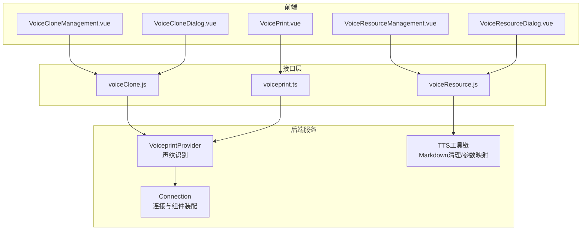
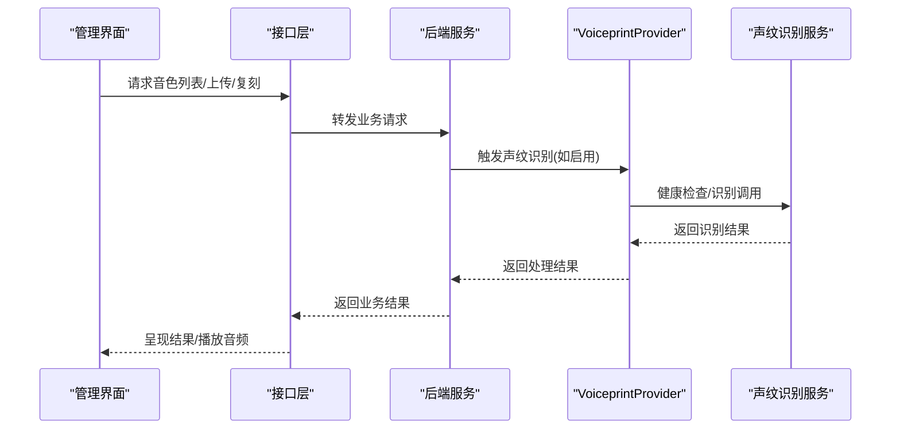
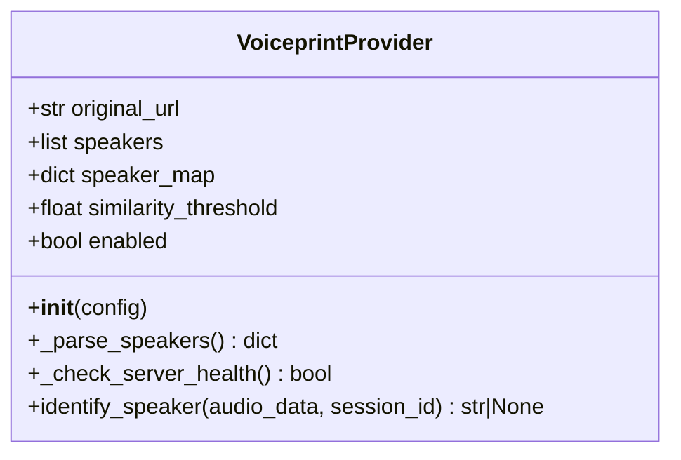
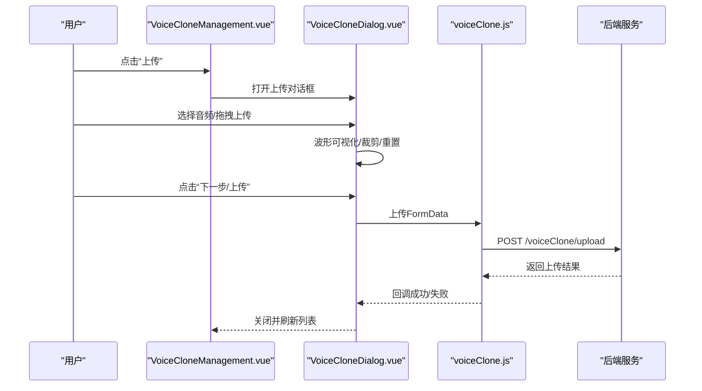
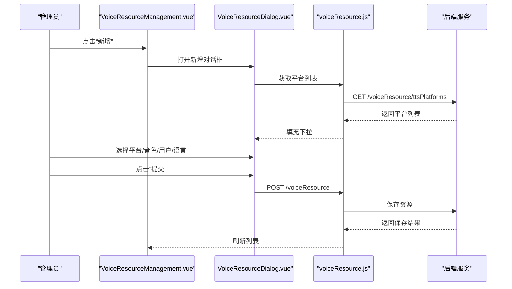
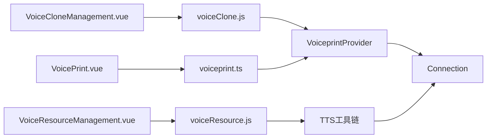

# 语音管理

<cite>
**本文引用的文件**
- [voiceClone.js](file://main/manager-web/src/apis/module/voiceClone.js)
- [voiceResource.js](file://main/manager-web/src/apis/module/voiceResource.js)
- [voiceprint.ts](file://main/manager-mobile/src/api/voiceprint/voiceprint.ts)
- [voiceprint_provider.py](file://main/xiaozhi-server/core/utils/voiceprint_provider.py)
- [VoiceCloneManagement.vue](file://main/manager-web/src/views/VoiceCloneManagement.vue)
- [VoiceResourceManagement.vue](file://main/manager-web/src/views/VoiceResourceManagement.vue)
- [VoiceCloneDialog.vue](file://main/manager-web/src/components/VoiceCloneDialog.vue)
- [VoiceResourceDialog.vue](file://main/manager-web/src/components/VoiceResourceDialog.vue)
- [VoicePrint.vue](file://main/manager-web/src/views/VoicePrint.vue)
- [voiceprint-integration.md](file://docs/voiceprint-integration.md)
- [tts.py](file://main/xiaozhi-server/core/utils/tts.py)
- [connection.py](file://main/xiaozhi-server/core/connection.py)
</cite>

## 目录
1. [简介](#简介)
2. [项目结构](#项目结构)
3. [核心组件](#核心组件)
4. [架构总览](#架构总览)
5. [详细组件分析](#详细组件分析)
6. [依赖关系分析](#依赖关系分析)
7. [性能考量](#性能考量)
8. [故障排查指南](#故障排查指南)
9. [结论](#结论)
10. [附录](#附录)

## 简介
本文件面向小智ESP32服务器的语音管理模块，系统性梳理声纹识别、语音克隆与语音资源管理三大能力。文档覆盖前端交互、后端服务集成、数据流与处理逻辑，并给出安全与隐私保护建议。读者无需深入技术背景亦可理解各模块职责与使用方式。

## 项目结构
语音管理模块由三层构成：
- 前端管理界面：提供音色资源与语音克隆的可视化管理、上传与播放、声纹注册与识别入口。
- 接口层：封装REST API调用，统一错误处理与重试策略。
- 后端服务：对接声纹识别服务、TTS平台与语音资源存储，负责鉴权、缓存与业务编排。

图表来源
- [VoiceCloneManagement.vue](file://main/manager-web/src/views/VoiceCloneManagement.vue)
- [VoiceResourceManagement.vue](file://main/manager-web/src/views/VoiceResourceManagement.vue)
- [VoiceCloneDialog.vue](file://main/manager-web/src/components/VoiceCloneDialog.vue)
- [VoiceResourceDialog.vue](file://main/manager-web/src/components/VoiceResourceDialog.vue)
- [VoicePrint.vue](file://main/manager-web/src/views/VoicePrint.vue)
- [voiceClone.js](file://main/manager-web/src/apis/module/voiceClone.js)
- [voiceResource.js](file://main/manager-web/src/apis/module/voiceResource.js)
- [voiceprint.ts](file://main/manager-mobile/src/api/voiceprint/voiceprint.ts)
- [voiceprint_provider.py](file://main/xiaozhi-server/core/utils/voiceprint_provider.py)
- [tts.py](file://main/xiaozhi-server/core/utils/tts.py)
- [connection.py](file://main/xiaozhi-server/core/connection.py)

章节来源
- [VoiceCloneManagement.vue](file://main/manager-web/src/views/VoiceCloneManagement.vue)
- [VoiceResourceManagement.vue](file://main/manager-web/src/views/VoiceResourceManagement.vue)
- [VoiceCloneDialog.vue](file://main/manager-web/src/components/VoiceCloneDialog.vue)
- [VoiceResourceDialog.vue](file://main/manager-web/src/components/VoiceResourceDialog.vue)
- [VoicePrint.vue](file://main/manager-web/src/views/VoicePrint.vue)
- [voiceClone.js](file://main/manager-web/src/apis/module/voiceClone.js)
- [voiceResource.js](file://main/manager-web/src/apis/module/voiceResource.js)
- [voiceprint.ts](file://main/manager-mobile/src/api/voiceprint/voiceprint.ts)
- [voiceprint_provider.py](file://main/xiaozhi-server/core/utils/voiceprint_provider.py)
- [tts.py](file://main/xiaozhi-server/core/utils/tts.py)
- [connection.py](file://main/xiaozhi-server/core/connection.py)

## 核心组件
- 声纹识别服务提供者：封装外部声纹识别服务的健康检查、鉴权与识别调用，支持阈值判断与未知说话人处理。
- 语音克隆管理：提供音色资源分页查询、上传、名称更新、音频播放与复刻流程。
- 语音资源管理：提供音色资源的保存、删除、按用户查询与TTS平台列表获取。
- 声纹注册与对话历史：移动端API提供声纹列表、对话历史选择、新增/删除/更新声纹与音频下载ID获取。
- TTS工具链：提供Markdown清理、文本预处理与参数映射等辅助能力。

章节来源
- [voiceprint_provider.py](file://main/xiaozhi-server/core/utils/voiceprint_provider.py)
- [voiceClone.js](file://main/manager-web/src/apis/module/voiceClone.js)
- [voiceResource.js](file://main/manager-web/src/apis/module/voiceResource.js)
- [voiceprint.ts](file://main/manager-mobile/src/api/voiceprint/voiceprint.ts)
- [tts.py](file://main/xiaozhi-server/core/utils/tts.py)

## 架构总览
语音管理模块采用前后端分离架构，前端通过HTTP接口与后端交互；后端通过服务提供者对接第三方服务（声纹识别）与本地TTS能力。连接层负责组件装配与生命周期管理，确保声纹识别按需启用与健康检查。

图表来源
- [voiceClone.js](file://main/manager-web/src/apis/module/voiceClone.js)
- [voiceprint_provider.py](file://main/xiaozhi-server/core/utils/voiceprint_provider.py)
- [VoiceCloneManagement.vue](file://main/manager-web/src/views/VoiceCloneManagement.vue)

## 详细组件分析

### 声纹识别服务提供者
- 功能要点
  - 配置解析：从URL解析服务地址与密钥，提取说话人ID列表。
  - 健康检查：定期缓存健康状态，避免频繁探测。
  - 识别调用：构造multipart请求，发送WAV音频，接收识别结果与相似度分数。
  - 阈值判断：低于阈值返回“未知说话人”，否则返回对应说话人名称。
- 关键行为
  - 启用条件：URL、密钥、说话人配置均有效且健康检查通过。
  - 超时与异常：统一捕获并记录日志，避免阻塞主流程。
- 安全与稳定性
  - 使用Bearer Token鉴权，严格校验HTTP状态码。
  - 健康状态缓存降低外部依赖抖动影响。

图表来源
- [voiceprint_provider.py](file://main/xiaozhi-server/core/utils/voiceprint_provider.py)

章节来源
- [voiceprint_provider.py](file://main/xiaozhi-server/core/utils/voiceprint_provider.py)
- [voiceprint-integration.md](file://docs/voiceprint-integration.md)

### 语音克隆管理（前端）
- 功能要点
  - 列表分页：支持按名称搜索、按创建时间排序。
  - 上传与编辑：提供音频上传对话框，支持波形可视化、裁剪与重置。
  - 复刻流程：提交复刻请求，轮询状态并提示结果。
  - 播放与下载：获取音频下载ID后拼接播放URL，支持播放控制。
- 交互细节
  - 上传限制：时长8-60秒，超出范围提示。
  - 状态展示：等待上传、待复刻、训练成功、训练失败等状态。
  - 错误处理：网络失败自动重试，业务失败提示并刷新列表。

图表来源
- [VoiceCloneManagement.vue](file://main/manager-web/src/views/VoiceCloneManagement.vue)
- [VoiceCloneDialog.vue](file://main/manager-web/src/components/VoiceCloneDialog.vue)
- [voiceClone.js](file://main/manager-web/src/apis/module/voiceClone.js)

章节来源
- [VoiceCloneManagement.vue](file://main/manager-web/src/views/VoiceCloneManagement.vue)
- [VoiceCloneDialog.vue](file://main/manager-web/src/components/VoiceCloneDialog.vue)
- [voiceClone.js](file://main/manager-web/src/apis/module/voiceClone.js)

### 语音资源管理（前端）
- 功能要点
  - 资源保存：选择TTS平台、音色ID、用户与语言，提交保存。
  - 批量删除：多选后批量删除。
  - 用户维度查询：按用户ID获取其音色资源列表。
  - 平台列表：动态加载可用TTS平台。
- 交互细节
  - 表单校验：必填项校验，远程搜索用户。
  - 分页与排序：默认按创建时间倒序。

图表来源
- [VoiceResourceManagement.vue](file://main/manager-web/src/views/VoiceResourceManagement.vue)
- [VoiceResourceDialog.vue](file://main/manager-web/src/components/VoiceResourceDialog.vue)
- [voiceResource.js](file://main/manager-web/src/apis/module/voiceResource.js)

章节来源
- [VoiceResourceManagement.vue](file://main/manager-web/src/views/VoiceResourceManagement.vue)
- [VoiceResourceDialog.vue](file://main/manager-web/src/components/VoiceResourceDialog.vue)
- [voiceResource.js](file://main/manager-web/src/apis/module/voiceResource.js)

### 声纹注册与对话历史（移动端）
- 功能要点
  - 列表查询：按智能体ID获取声纹列表。
  - 对话历史：用于选择合适的语音向量样本。
  - 增删改：新增说话人、删除声纹、更新声纹信息。
  - 下载ID：获取音频下载ID，便于后续播放或复用。
- 安全要点
  - 所有请求均携带鉴权信息，避免未授权访问。

章节来源
- [voiceprint.ts](file://main/manager-mobile/src/api/voiceprint/voiceprint.ts)

### TTS工具链与文本预处理
- 功能要点
  - Markdown清理：去除标题、粗体、斜体、图片、链接、表格等，保留必要语义。
  - 文本净化：剔除emoji，保留英文与基本标点，避免TTS异常。
  - 参数映射：将百分比参数映射到目标范围，支持音高、语速等调优。
- 性能与兼容性
  - 预编译正则提升匹配效率。
  - 严格边界检查，避免越界与溢出。

章节来源
- [tts.py](file://main/xiaozhi-server/core/utils/tts.py)

### 连接层与组件装配
- 功能要点
  - 组件装配：VAD、ASR、LLM、TTS、记忆与意图等模块按需组合。
  - 声纹提供者：为每个连接独立管理声纹识别实例，按配置启用。
  - 上报开关：可配置ASR/TTS上报开关，便于调试与性能控制。
- 可扩展性
  - 通过配置中心动态调整组件与策略，降低耦合。

章节来源
- [connection.py](file://main/xiaozhi-server/core/connection.py)

## 依赖关系分析
- 前端依赖后端接口，接口层封装HTTP调用与错误处理。
- 后端通过服务提供者依赖外部声纹识别服务，内部依赖TTS工具链。
- 连接层负责组件生命周期与策略装配，确保声纹识别按需启用。

图表来源
- [VoiceCloneManagement.vue](file://main/manager-web/src/views/VoiceCloneManagement.vue)
- [VoiceResourceManagement.vue](file://main/manager-web/src/views/VoiceResourceManagement.vue)
- [VoicePrint.vue](file://main/manager-web/src/views/VoicePrint.vue)
- [voiceClone.js](file://main/manager-web/src/apis/module/voiceClone.js)
- [voiceResource.js](file://main/manager-web/src/apis/module/voiceResource.js)
- [voiceprint.ts](file://main/manager-mobile/src/api/voiceprint/voiceprint.ts)
- [voiceprint_provider.py](file://main/xiaozhi-server/core/utils/voiceprint_provider.py)
- [tts.py](file://main/xiaozhi-server/core/utils/tts.py)
- [connection.py](file://main/xiaozhi-server/core/connection.py)

## 性能考量
- 声纹识别
  - 健康检查缓存：减少对外部服务的频繁探测，降低延迟波动。
  - 超时控制：识别请求设置合理超时，避免阻塞主线程。
  - 相似度阈值：根据场景调整阈值，平衡召回与误识。
- 语音克隆
  - 上传限制：8-60秒音频有助于训练稳定与资源占用控制。
  - 播放控制：及时释放音频对象，避免内存泄漏。
- 文本预处理
  - 预编译正则与边界检查，减少CPU与内存消耗。
  - 参数映射线性插值，计算开销低且可控。

[本节为通用指导，无需特定文件来源]

## 故障排查指南
- 声纹识别不可用
  - 检查服务URL与密钥配置是否正确，确认健康检查返回健康状态。
  - 若返回“未知说话人”，检查相似度阈值是否过高或样本不足。
- 语音克隆上传失败
  - 确认音频时长在8-60秒之间；检查网络状态与重试机制是否生效。
  - 查看后端日志定位具体错误码与原因。
- 语音资源保存失败
  - 校验必填字段（平台、音色ID、用户、语言）是否完整。
  - 确认TTS平台列表加载成功，平台ID与音色ID匹配。
- 移动端声纹注册
  - 确认鉴权信息正确，网络可达；若无对话历史，需先完成一次语音交互以生成样本。

章节来源
- [voiceprint_provider.py](file://main/xiaozhi-server/core/utils/voiceprint_provider.py)
- [voiceprint-integration.md](file://docs/voiceprint-integration.md)
- [VoiceCloneManagement.vue](file://main/manager-web/src/views/VoiceCloneManagement.vue)
- [VoiceResourceManagement.vue](file://main/manager-web/src/views/VoiceResourceManagement.vue)
- [voiceprint.ts](file://main/manager-mobile/src/api/voiceprint/voiceprint.ts)

## 结论
小智ESP32服务器的语音管理模块以清晰的分层设计实现了声纹识别、语音克隆与语音资源管理的闭环。前端提供直观的交互体验，后端通过服务提供者与工具链保障稳定性与可扩展性。建议在生产环境中结合健康检查缓存、阈值调优与严格的错误处理，持续优化用户体验与系统可靠性。

[本节为总结性内容，无需特定文件来源]

## 附录

### 声纹识别部署与配置要点
- 数据库准备：创建数据库与表，确保MySQL可达。
- 服务启动：使用Docker部署声纹识别服务，暴露健康检查接口。
- 接口配置：在配置文件中填写声纹接口地址与密钥，配置说话人ID列表。
- 最简配置：在本地配置文件中直接声明声纹接口地址与说话人信息。

章节来源
- [voiceprint-integration.md](file://docs/voiceprint-integration.md)

### 语音质量检测与优化建议
- 质量检测
  - 时长与采样率：确保音频时长在8-60秒，采样率与编码符合要求。
  - 信噪比：尽量在安静环境下录制，避免背景噪音与回声。
  - 一致性：同一说话人在不同录音间的音色与语速应尽量一致。
- 优化建议
  - 录音前进行降噪处理，使用高质量麦克风。
  - 录制时保持恒定距离与角度，避免气音与爆破音。
  - 多次录制取平均，提升特征稳定性。

[本节为通用指导，无需特定文件来源]

### 安全存储、访问控制与隐私保护
- 存储安全
  - 音频文件加密存储，访问路径随机化，避免直接暴露文件名。
  - 数据库字段加密：敏感字段（如特征向量）建议加密存储。
- 访问控制
  - 所有接口强制鉴权，移动端与Web端均需携带认证信息。
  - 声纹注册与识别仅限授权用户操作，记录审计日志。
- 隐私保护
  - 遵循最小化原则：仅收集必要的语音片段与元数据。
  - 用户同意：在注册声纹前明确告知用途与存储期限。
  - 数据删除：提供用户申请删除语音数据的通道与自动化清理机制。

[本节为通用指导，无需特定文件来源]