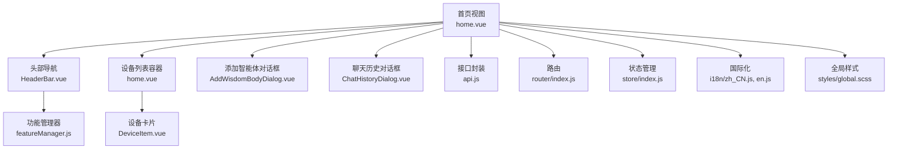
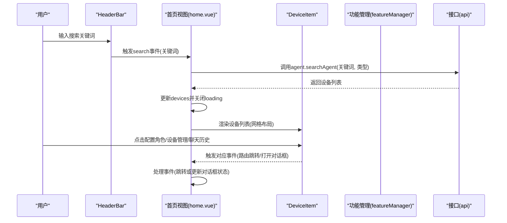
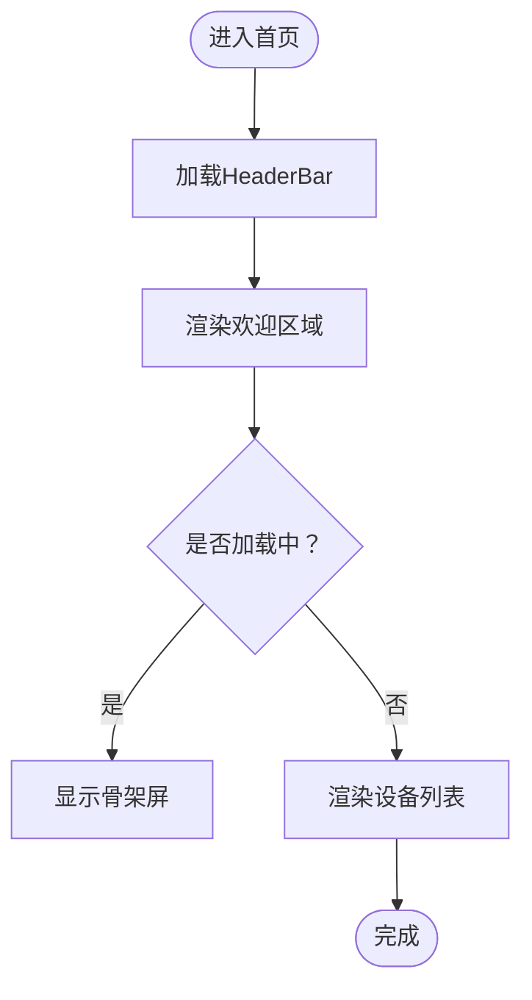
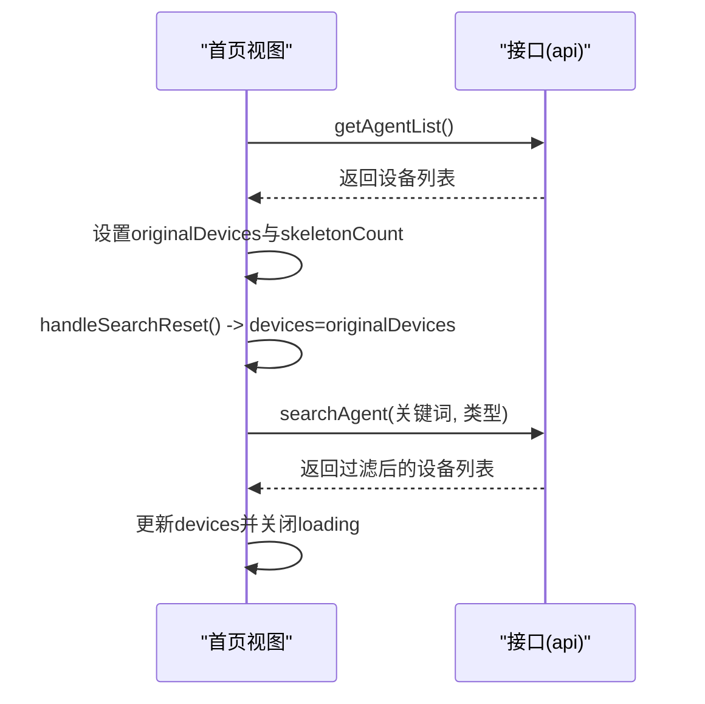
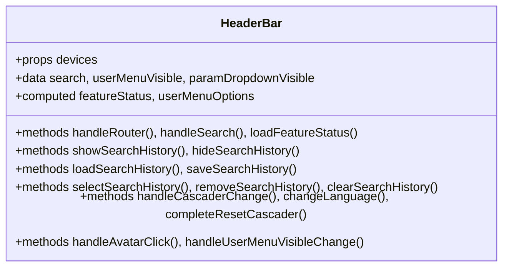
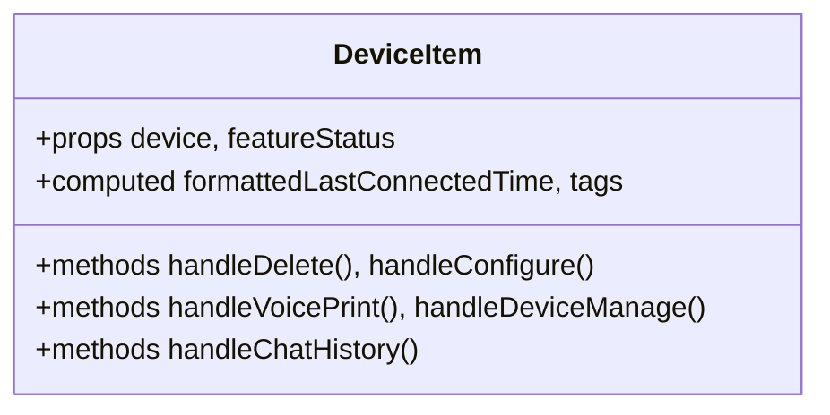
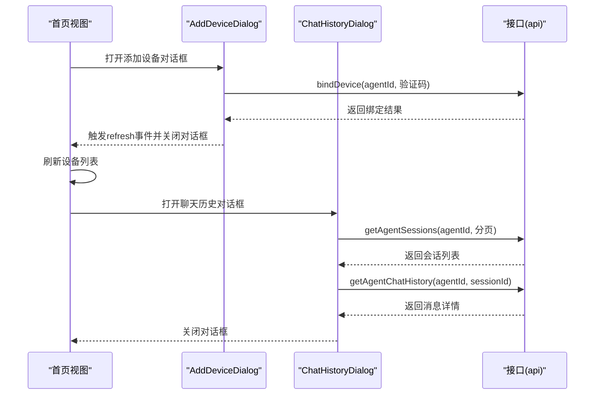
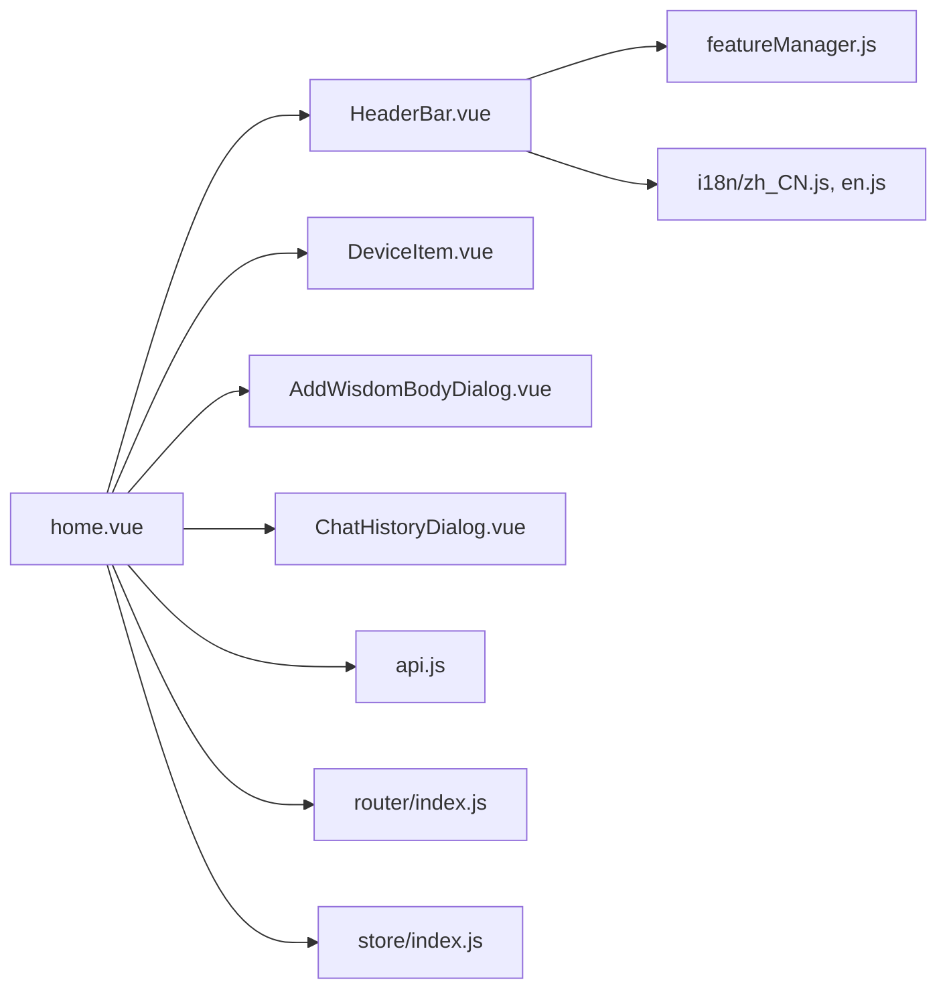

# 首页仪表板

<cite>
**本文档引用的文件**
- [home.vue](file://main/manager-web/src/views/home.vue)
- [HeaderBar.vue](file://main/manager-web/src/components/HeaderBar.vue)
- [DeviceItem.vue](file://main/manager-web/src/components/DeviceItem.vue)
- [AddDeviceDialog.vue](file://main/manager-web/src/components/AddDeviceDialog.vue)
- [AddWisdomBodyDialog.vue](file://main/manager-web/src/components/AddWisdomBodyDialog.vue)
- [ChatHistoryDialog.vue](file://main/manager-web/src/components/ChatHistoryDialog.vue)
- [featureManager.js](file://main/manager-web/src/utils/featureManager.js)
- [api.js](file://main/manager-web/src/apis/api.js)
- [index.js](file://main/manager-web/src/router/index.js)
- [index.js](file://main/manager-web/src/store/index.js)
- [global.scss](file://main/manager-web/src/styles/global.scss)
- [zh_CN.js](file://main/manager-web/src/i18n/zh_CN.js)
- [en.js](file://main/manager-web/src/i18n/en.js)
</cite>

## 目录
1. [简介](#简介)
2. [项目结构](#项目结构)
3. [核心组件](#核心组件)
4. [架构总览](#架构总览)
5. [详细组件分析](#详细组件分析)
6. [依赖关系分析](#依赖关系分析)
7. [性能考虑](#性能考虑)
8. [故障排除指南](#故障排除指南)
9. [结论](#结论)

## 简介
本文件面向小智ESP32服务器的首页仪表板，提供从布局设计到交互实现的完整技术文档。重点涵盖：
- 整体布局设计与响应式适配
- 欢迎区域与设备展示区域的实现
- 设备列表的数据绑定、搜索过滤与动态加载机制
- HeaderBar组件的导航、搜索集成与用户交互
- DeviceItem组件的卡片展示、状态显示与操作按钮
- 添加设备对话框、聊天历史查看与设备管理的交互流程
- 响应式布局、骨架屏加载效果与国际化支持

## 项目结构
首页仪表板位于前端管理端（manager-web），采用Vue生态，结合Element UI组件库与Vuex状态管理。核心文件组织如下：
- 视图层：views/home.vue为主入口，承载欢迎区域与设备列表容器
- 组件层：HeaderBar负责顶部导航与搜索；DeviceItem负责单个设备卡片；对话框组件负责添加设备与查看聊天历史
- 工具层：featureManager统一管理功能开关；api封装后端接口；router与store提供路由与状态管理
- 国际化：i18n目录提供多语言文案；global.scss统一覆盖样式

**图表来源**
- [home.vue:1-387](file://main/manager-web/src/views/home.vue#L1-L387)
- [HeaderBar.vue:1-874](file://main/manager-web/src/components/HeaderBar.vue#L1-L874)
- [DeviceItem.vue:1-215](file://main/manager-web/src/components/DeviceItem.vue#L1-L215)
- [AddWisdomBodyDialog.vue:1-113](file://main/manager-web/src/components/AddWisdomBodyDialog.vue#L1-L113)
- [ChatHistoryDialog.vue:1-630](file://main/manager-web/src/components/ChatHistoryDialog.vue#L1-L630)
- [featureManager.js:1-353](file://main/manager-web/src/utils/featureManager.js#L1-L353)
- [api.js:1-48](file://main/manager-web/src/apis/api.js#L1-L48)
- [index.js:1-250](file://main/manager-web/src/router/index.js#L1-L250)
- [index.js:1-77](file://main/manager-web/src/store/index.js#L1-L77)
- [global.scss:1-32](file://main/manager-web/src/styles/global.scss#L1-L32)
- [zh_CN.js:714-734](file://main/manager-web/src/i18n/zh_CN.js#L714-L734)
- [en.js:716-735](file://main/manager-web/src/i18n/en.js#L716-L735)

**章节来源**
- [home.vue:1-387](file://main/manager-web/src/views/home.vue#L1-L387)
- [HeaderBar.vue:1-874](file://main/manager-web/src/components/HeaderBar.vue#L1-L874)
- [DeviceItem.vue:1-215](file://main/manager-web/src/components/DeviceItem.vue#L1-L215)
- [AddWisdomBodyDialog.vue:1-113](file://main/manager-web/src/components/AddWisdomBodyDialog.vue#L1-L113)
- [ChatHistoryDialog.vue:1-630](file://main/manager-web/src/components/ChatHistoryDialog.vue#L1-L630)
- [featureManager.js:1-353](file://main/manager-web/src/utils/featureManager.js#L1-L353)
- [api.js:1-48](file://main/manager-web/src/apis/api.js#L1-L48)
- [index.js:1-250](file://main/manager-web/src/router/index.js#L1-L250)
- [index.js:1-77](file://main/manager-web/src/store/index.js#L1-L77)
- [global.scss:1-32](file://main/manager-web/src/styles/global.scss#L1-L32)
- [zh_CN.js:714-734](file://main/manager-web/src/i18n/zh_CN.js#L714-L734)
- [en.js:716-735](file://main/manager-web/src/i18n/en.js#L716-L735)

## 核心组件
- 首页视图（home.vue）
  - 负责欢迎区域渲染、设备列表容器、骨架屏加载、搜索与删除交互、聊天历史对话框联动
  - 数据流：mounted时拉取设备列表，搜索时根据关键词调用后端接口，删除时二次确认并刷新列表
- HeaderBar组件（HeaderBar.vue）
  - 提供顶部导航菜单、搜索框、用户菜单与语言切换、功能开关控制
  - 与featureManager协作，按权限动态显示菜单项
- DeviceItem组件（DeviceItem.vue）
  - 单个设备卡片，展示模型信息、连接状态、标签、操作按钮（配置角色、声纹识别、设备管理、聊天历史）
  - 支持禁用态（无记忆时禁用聊天历史）
- 对话框组件
  - AddWisdomBodyDialog：添加智能体
  - AddDeviceDialog：通过验证码绑定设备
  - ChatHistoryDialog：查看设备聊天历史，支持分页加载与音频播放

**章节来源**
- [home.vue:58-206](file://main/manager-web/src/views/home.vue#L58-L206)
- [HeaderBar.vue:192-618](file://main/manager-web/src/components/HeaderBar.vue#L192-L618)
- [DeviceItem.vue:53-118](file://main/manager-web/src/components/DeviceItem.vue#L53-L118)
- [AddWisdomBodyDialog.vue:31-75](file://main/manager-web/src/components/AddWisdomBodyDialog.vue#L31-L75)
- [AddDeviceDialog.vue:32-88](file://main/manager-web/src/components/AddDeviceDialog.vue#L32-L88)
- [ChatHistoryDialog.vue:75-389](file://main/manager-web/src/components/ChatHistoryDialog.vue#L75-L389)

## 架构总览
首页仪表板采用“视图-组件-工具-接口”的分层架构：
- 视图层：home.vue作为主容器，协调HeaderBar与DeviceItem
- 组件层：HeaderBar集中处理导航、搜索与用户交互；DeviceItem专注设备卡片展示
- 工具层：featureManager统一管理功能开关；api封装后端接口；router与store提供路由与状态
- 国际化：i18n提供多语言文案，配合HeaderBar的语言切换菜单

**图表来源**
- [home.vue:122-175](file://main/manager-web/src/views/home.vue#L122-L175)
- [HeaderBar.vue:366-385](file://main/manager-web/src/components/HeaderBar.vue#L366-L385)
- [featureManager.js:47-53](file://main/manager-web/src/utils/featureManager.js#L47-L53)
- [api.js:28-30](file://main/manager-web/src/apis/api.js#L28-L30)

**章节来源**
- [home.vue:91-175](file://main/manager-web/src/views/home.vue#L91-L175)
- [HeaderBar.vue:354-385](file://main/manager-web/src/components/HeaderBar.vue#L354-L385)
- [featureManager.js:47-53](file://main/manager-web/src/utils/featureManager.js#L47-L53)
- [api.js:28-30](file://main/manager-web/src/apis/api.js#L28-L30)

## 详细组件分析

### 首页整体布局与欢迎区域
- 布局结构
  - 顶部HeaderBar占位固定高度，中部为主要内容区，底部VersionFooter
  - 主容器采用flex-column，确保背景与内容自适应
- 欢迎区域
  - 渐变背景与装饰图片，展示问候语、期望语句与“添加智能体”按钮
  - 按钮点击触发AddWisdomBodyDialog弹窗
- 响应式设计
  - 最小宽度约束，保证在窄屏下不被压缩变形
  - 设备列表采用CSS Grid，列宽自适应，间距统一

**图表来源**
- [home.vue:208-387](file://main/manager-web/src/views/home.vue#L208-L387)

**章节来源**
- [home.vue:1-55](file://main/manager-web/src/views/home.vue#L1-L55)
- [home.vue:208-387](file://main/manager-web/src/views/home.vue#L208-L387)

### 设备列表数据绑定与动态加载
- 数据绑定
  - devices与originalDevices分离：originalDevices保存原始数据，搜索时仅更新devices
  - 骨架屏数量根据设备数量动态调整，范围限定在3-10之间
- 动态加载
  - mounted时调用fetchAgentList，成功后计算骨架屏数量并重置为原始列表
  - 搜索时根据关键词格式判断搜索类型（MAC或名称），调用agent.searchAgent接口
- 删除交互
  - 删除前二次确认，成功后刷新列表

**图表来源**
- [home.vue:153-175](file://main/manager-web/src/views/home.vue#L153-L175)
- [home.vue:122-146](file://main/manager-web/src/views/home.vue#L122-L146)

**章节来源**
- [home.vue:70-89](file://main/manager-web/src/views/home.vue#L70-L89)
- [home.vue:153-175](file://main/manager-web/src/views/home.vue#L153-L175)
- [home.vue:122-146](file://main/manager-web/src/views/home.vue#L122-L146)

### HeaderBar组件：导航、搜索与用户交互
- 导航菜单
  - 根据路由高亮当前页面，支持超级管理员下拉菜单（音色克隆、参数字典等）
  - 通过featureManager动态控制菜单项显示（如音色克隆、知识库）
- 搜索集成
  - 在首页路径下显示搜索框，支持回车搜索、聚焦显示历史、失焦隐藏历史
  - 搜索历史本地持久化，支持清空与逐条删除
- 用户交互
  - 头像点击触发用户菜单（语言切换、修改密码、退出登录）
  - 级联选择器兼容多种浏览器行为，确保选择状态正确清理

**图表来源**
- [HeaderBar.vue:192-618](file://main/manager-web/src/components/HeaderBar.vue#L192-L618)

**章节来源**
- [HeaderBar.vue:10-189](file://main/manager-web/src/components/HeaderBar.vue#L10-L189)
- [HeaderBar.vue:354-618](file://main/manager-web/src/components/HeaderBar.vue#L354-L618)
- [featureManager.js:47-53](file://main/manager-web/src/utils/featureManager.js#L47-L53)

### DeviceItem组件：卡片展示、状态与操作
- 展示内容
  - 设备名称、语言模型、语音模型、最后对话时间、标签列表
- 状态显示
  - 最后对话时间人性化格式（刚刚、几分钟前、几小时前）
  - 标签溢出显示tooltip
- 操作按钮
  - 配置角色：跳转角色配置页
  - 声纹识别：跳转声纹识别页（受功能开关控制）
  - 设备管理：跳转设备管理页
  - 聊天历史：打开聊天历史对话框（无记忆时禁用）

**图表来源**
- [DeviceItem.vue:53-118](file://main/manager-web/src/components/DeviceItem.vue#L53-L118)

**章节来源**
- [DeviceItem.vue:1-51](file://main/manager-web/src/components/DeviceItem.vue#L1-L51)
- [DeviceItem.vue:72-118](file://main/manager-web/src/components/DeviceItem.vue#L72-L118)

### 添加设备对话框与聊天历史查看
- 添加设备对话框（AddDeviceDialog）
  - 输入6位验证码，调用device.bindDevice接口绑定设备
  - 成功后提示并关闭对话框，父组件刷新列表
- 聊天历史对话框（ChatHistoryDialog）
  - 分页加载会话列表，支持滚动到底部继续加载
  - 支持消息时间分隔、工具调用结果折叠/展开、音频播放
  - 提供下载当前会话与当前+前20条会话的导出功能

**图表来源**
- [AddDeviceDialog.vue:47-87](file://main/manager-web/src/components/AddDeviceDialog.vue#L47-L87)
- [ChatHistoryDialog.vue:235-285](file://main/manager-web/src/components/ChatHistoryDialog.vue#L235-L285)
- [ChatHistoryDialog.vue:364-386](file://main/manager-web/src/components/ChatHistoryDialog.vue#L364-L386)

**章节来源**
- [AddDeviceDialog.vue:1-126](file://main/manager-web/src/components/AddDeviceDialog.vue#L1-L126)
- [ChatHistoryDialog.vue:1-630](file://main/manager-web/src/components/ChatHistoryDialog.vue#L1-L630)

### 国际化与响应式布局
- 国际化
  - 首页文案（问候语、按钮文本、提示语）均来自i18n配置
  - HeaderBar支持语言切换菜单，实时更新界面语言
- 响应式布局
  - 首页容器设置最小宽度，避免过度压缩
  - 设备列表采用CSS Grid，自动换行适配不同屏幕尺寸
  - 全局样式覆盖Element UI部分组件样式，确保一致性

**章节来源**
- [zh_CN.js:714-734](file://main/manager-web/src/i18n/zh_CN.js#L714-L734)
- [en.js:716-735](file://main/manager-web/src/i18n/en.js#L716-L735)
- [HeaderBar.vue:297-339](file://main/manager-web/src/components/HeaderBar.vue#L297-L339)
- [home.vue:208-307](file://main/manager-web/src/views/home.vue#L208-L307)
- [global.scss:16-32](file://main/manager-web/src/styles/global.scss#L16-L32)

## 依赖关系分析
- 组件耦合
  - home.vue与HeaderBar通过事件通信（search/search-reset），与DeviceItem通过props传递数据
  - DeviceItem与路由交互（跳转配置页/设备管理），与对话框交互（聊天历史）
- 外部依赖
  - featureManager提供功能开关配置，影响HeaderBar与DeviceItem的显示逻辑
  - api封装统一接口调用，router与store提供路由与状态管理
- 潜在循环依赖
  - 组件间通过事件与props传递，未见直接循环导入

**图表来源**
- [home.vue:58-69](file://main/manager-web/src/views/home.vue#L58-L69)
- [HeaderBar.vue:192-203](file://main/manager-web/src/components/HeaderBar.vue#L192-L203)
- [DeviceItem.vue:53-68](file://main/manager-web/src/components/DeviceItem.vue#L53-L68)
- [AddWisdomBodyDialog.vue:31-38](file://main/manager-web/src/components/AddWisdomBodyDialog.vue#L31-L38)
- [ChatHistoryDialog.vue:75-94](file://main/manager-web/src/components/ChatHistoryDialog.vue#L75-L94)
- [featureManager.js:1-5](file://main/manager-web/src/utils/featureManager.js#L1-L5)
- [api.js:1-14](file://main/manager-web/src/apis/api.js#L1-L14)
- [index.js:1-4](file://main/manager-web/src/router/index.js#L1-L4)
- [index.js:1-6](file://main/manager-web/src/store/index.js#L1-L6)

**章节来源**
- [home.vue:58-69](file://main/manager-web/src/views/home.vue#L58-L69)
- [HeaderBar.vue:192-203](file://main/manager-web/src/components/HeaderBar.vue#L192-L203)
- [DeviceItem.vue:53-68](file://main/manager-web/src/components/DeviceItem.vue#L53-L68)
- [AddWisdomBodyDialog.vue:31-38](file://main/manager-web/src/components/AddWisdomBodyDialog.vue#L31-L38)
- [ChatHistoryDialog.vue:75-94](file://main/manager-web/src/components/ChatHistoryDialog.vue#L75-L94)
- [featureManager.js:1-5](file://main/manager-web/src/utils/featureManager.js#L1-L5)
- [api.js:1-14](file://main/manager-web/src/apis/api.js#L1-L14)
- [index.js:1-4](file://main/manager-web/src/router/index.js#L1-L4)
- [index.js:1-6](file://main/manager-web/src/store/index.js#L1-L6)

## 性能考虑
- 骨架屏优化
  - 在数据加载期间显示骨架屏，减少白屏时间，提升感知性能
  - 骨架屏数量随设备数量动态调整，避免过多DOM节点
- 搜索性能
  - 搜索前设置loading与isSearching，避免重复请求
  - 搜索历史本地存储，减少重复网络请求
- 图片与资源
  - 背景图与图标采用懒加载策略，降低首屏压力
- 路由与状态
  - 路由守卫仅对受保护页面生效，避免不必要的拦截
  - Vuex状态集中管理，避免跨组件重复请求

[本节为通用指导，无需特定文件引用]

## 故障排除指南
- 搜索失败
  - 现象：搜索后无结果或报错
  - 排查：检查handleSearch逻辑与agent.searchAgent接口返回；确认关键词格式（MAC或名称）
- 删除失败
  - 现象：删除后仍显示设备或提示失败
  - 排查：确认删除接口返回code与msg；检查handleDeleteAgent的二次确认逻辑
- 聊天历史加载异常
  - 现象：会话列表不更新或音频无法播放
  - 排查：检查getAgentSessions与getAgentChatHistory接口；确认音频播放逻辑与debounce使用
- 功能开关不生效
  - 现象：某些菜单项未显示或显示异常
  - 排查：确认featureManager初始化与getConfig返回值；检查HeaderBar与DeviceItem中featureStatus使用

**章节来源**
- [home.vue:122-146](file://main/manager-web/src/views/home.vue#L122-L146)
- [home.vue:177-198](file://main/manager-web/src/views/home.vue#L177-L198)
- [ChatHistoryDialog.vue:235-285](file://main/manager-web/src/components/ChatHistoryDialog.vue#L235-L285)
- [featureManager.js:259-269](file://main/manager-web/src/utils/featureManager.js#L259-L269)

## 结论
首页仪表板通过清晰的组件分工与完善的交互流程，实现了从欢迎区域到设备管理的完整用户体验。HeaderBar承担导航与搜索职责，DeviceItem专注于设备信息展示与操作，对话框组件提供关键业务能力（添加设备、查看聊天历史）。配合国际化与响应式布局，系统在多语言与多终端环境下具备良好的可用性与扩展性。