# 前端界面

<cite>
**本文引用的文件**
- [main/manager-web/package.json](file://main/manager-web/package.json)
- [main/manager-web/src/main.js](file://main/manager-web/src/main.js)
- [main/manager-web/src/App.vue](file://main/manager-web/src/App.vue)
- [main/manager-web/src/router/index.js](file://main/manager-web/src/router/index.js)
- [main/manager-web/src/store/index.js](file://main/manager-web/src/store/index.js)
- [main/manager-web/src/i18n/index.js](file://main/manager-web/src/i18n/index.js)
- [main/manager-web/src/styles/global.scss](file://main/manager-web/src/styles/global.scss)
- [main/manager-web/src/views/home.vue](file://main/manager-web/src/views/home.vue)
- [main/manager-mobile/package.json](file://main/manager-mobile/package.json)
- [main/manager-mobile/src/main.ts](file://main/manager-mobile/src/main.ts)
- [main/manager-mobile/src/App.vue](file://main/manager-mobile/src/App.vue)
- [main/manager-mobile/src/store/index.ts](file://main/manager-mobile/src/store/index.ts)
- [main/manager-mobile/src/i18n/index.ts](file://main/manager-mobile/src/i18n/index.ts)
- [main/manager-mobile/src/style/index.scss](file://main/manager-mobile/src/style/index.scss)
- [main/manager-mobile/src/pages/index/index.vue](file://main/manager-mobile/src/pages/index/index.vue)
- [main/demo-web/package.json](file://main/demo-web/package.json)
- [main/demo-web/index.html](file://main/demo-web/index.html)
</cite>

## 目录
1. [简介](#简介)
2. [项目结构](#项目结构)
3. [核心组件](#核心组件)
4. [架构总览](#架构总览)
5. [详细组件分析](#详细组件分析)
6. [依赖关系分析](#依赖关系分析)
7. [性能考量](#性能考量)
8. [故障排查指南](#故障排查指南)
9. [结论](#结论)
10. [附录](#附录)

## 简介
本文件面向小智ESP32服务器的前端界面，系统性梳理Web管理端与移动端管理端的架构设计、组件结构与用户交互流程；阐述跨平台实现、响应式设计与用户体验优化；解释前后端API交互模式、数据绑定与状态管理；说明国际化支持与多语言切换；并提供界面定制、样式修改与组件扩展的方法，以及前端开发环境搭建、构建部署与性能优化的最佳实践。

## 项目结构
前端工程由三部分组成：
- Web管理端（基于Vue 2 + Element UI + Vuex）
- 移动端管理端（基于Vue 3 + UniApp + Pinia + Wot Design Uni）
- Demo演示（基于Vite的独立演示页面）

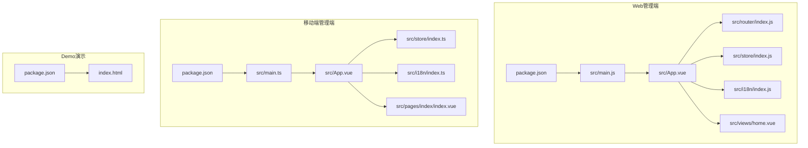

图表来源
- [main/manager-web/package.json:1-51](file://main/manager-web/package.json#L1-L51)
- [main/manager-web/src/main.js:1-30](file://main/manager-web/src/main.js#L1-L30)
- [main/manager-web/src/App.vue:1-179](file://main/manager-web/src/App.vue#L1-L179)
- [main/manager-web/src/router/index.js:1-250](file://main/manager-web/src/router/index.js#L1-L250)
- [main/manager-web/src/store/index.js:1-77](file://main/manager-web/src/store/index.js#L1-L77)
- [main/manager-web/src/i18n/index.js:1-58](file://main/manager-web/src/i18n/index.js#L1-L58)
- [main/manager-web/src/views/home.vue:1-387](file://main/manager-web/src/views/home.vue#L1-L387)
- [main/manager-mobile/package.json:1-163](file://main/manager-mobile/package.json#L1-L163)
- [main/manager-mobile/src/main.ts:1-27](file://main/manager-mobile/src/main.ts#L1-L27)
- [main/manager-mobile/src/App.vue:1-95](file://main/manager-mobile/src/App.vue#L1-L95)
- [main/manager-mobile/src/store/index.ts:1-22](file://main/manager-mobile/src/store/index.ts#L1-L22)
- [main/manager-mobile/src/i18n/index.ts:1-79](file://main/manager-mobile/src/i18n/index.ts#L1-L79)
- [main/manager-mobile/src/pages/index/index.vue:1-591](file://main/manager-mobile/src/pages/index/index.vue#L1-L591)
- [main/demo-web/package.json:1-15](file://main/demo-web/package.json#L1-L15)
- [main/demo-web/index.html:1-399](file://main/demo-web/index.html#L1-L399)

章节来源
- [main/manager-web/package.json:1-51](file://main/manager-web/package.json#L1-L51)
- [main/manager-mobile/package.json:1-163](file://main/manager-mobile/package.json#L1-L163)
- [main/demo-web/package.json:1-15](file://main/demo-web/package.json#L1-L15)

## 核心组件
- Web端核心
  - 应用入口与插件：应用挂载、Element UI、i18n、Vuex、Service Worker注册与CDN缓存调试能力
  - 路由与鉴权：基于VueRouter的路由表与全局守卫，保护受控页面
  - 状态管理：Vuex Store集中存储token、用户信息与公共配置
  - 国际化：基于vue-i18n，支持中英德越葡等多语言，本地存储语言偏好
  - 视图层：首页视图负责设备/智能体列表、搜索、删除、聊天历史弹窗等
  - 样式：全局SCSS覆盖Element UI样式与布局微调

- 移动端核心
  - 应用入口与插件：基于UniApp的SSR应用创建、Pinia、VueQuery、路由拦截器
  - 状态管理：Pinia + 持久化插件，统一导出多个模块（配置、插件、提供商、语速音高、用户）
  - 国际化：基于自研i18n工具，支持语言切换与参数化占位符
  - 页面：首页使用z-paging实现列表分页/空态/FAB，支持滑动删除、导航栏标题动态国际化
  - 样式：UnoCSS + SCSS，主题变量与组件样式定制

章节来源
- [main/manager-web/src/main.js:1-30](file://main/manager-web/src/main.js#L1-L30)
- [main/manager-web/src/App.vue:1-179](file://main/manager-web/src/App.vue#L1-L179)
- [main/manager-web/src/router/index.js:1-250](file://main/manager-web/src/router/index.js#L1-L250)
- [main/manager-web/src/store/index.js:1-77](file://main/manager-web/src/store/index.js#L1-L77)
- [main/manager-web/src/i18n/index.js:1-58](file://main/manager-web/src/i18n/index.js#L1-L58)
- [main/manager-web/src/views/home.vue:1-387](file://main/manager-web/src/views/home.vue#L1-L387)
- [main/manager-mobile/src/main.ts:1-27](file://main/manager-mobile/src/main.ts#L1-L27)
- [main/manager-mobile/src/App.vue:1-95](file://main/manager-mobile/src/App.vue#L1-L95)
- [main/manager-mobile/src/store/index.ts:1-22](file://main/manager-mobile/src/store/index.ts#L1-L22)
- [main/manager-mobile/src/i18n/index.ts:1-79](file://main/manager-mobile/src/i18n/index.ts#L1-L79)
- [main/manager-mobile/src/pages/index/index.vue:1-591](file://main/manager-mobile/src/pages/index/index.vue#L1-L591)

## 架构总览
Web与移动端共享“管理端”定位，但采用不同技术栈实现跨平台兼容与最佳体验：
- Web端：桌面优先，使用Element UI组件库与Vuex进行状态管理
- 移动端：基于UniApp生态，统一H5/小程序/APP，使用Wot Design Uni与z-paging提升移动端体验
- Demo演示：独立Vite工程，用于孵化/聊天等演示场景

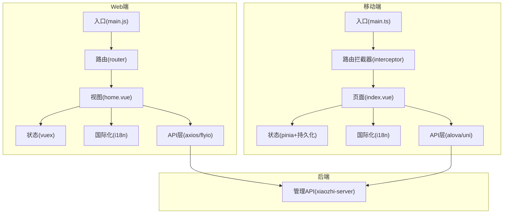

图表来源
- [main/manager-web/src/main.js:1-30](file://main/manager-web/src/main.js#L1-L30)
- [main/manager-web/src/router/index.js:1-250](file://main/manager-web/src/router/index.js#L1-L250)
- [main/manager-web/src/store/index.js:1-77](file://main/manager-web/src/store/index.js#L1-L77)
- [main/manager-web/src/i18n/index.js:1-58](file://main/manager-web/src/i18n/index.js#L1-L58)
- [main/manager-web/src/views/home.vue:1-387](file://main/manager-web/src/views/home.vue#L1-L387)
- [main/manager-mobile/src/main.ts:1-27](file://main/manager-mobile/src/main.ts#L1-L27)
- [main/manager-mobile/src/App.vue:1-95](file://main/manager-mobile/src/App.vue#L1-L95)
- [main/manager-mobile/src/store/index.ts:1-22](file://main/manager-mobile/src/store/index.ts#L1-L22)
- [main/manager-mobile/src/i18n/index.ts:1-79](file://main/manager-mobile/src/i18n/index.ts#L1-L79)
- [main/manager-mobile/src/pages/index/index.vue:1-591](file://main/manager-mobile/src/pages/index/index.vue#L1-L591)

## 详细组件分析

### Web端：应用入口与生命周期
- 初始化顺序：注册Element UI、i18n、Vuex、Service Worker；创建Vue实例并挂载
- CDN与缓存调试：在启用CDN时，提供全局快捷键与控制台提示，检测Service Worker注册与缓存状态
- 移动端跳转：检测移动设备并在配置存在时重定向至H5页面

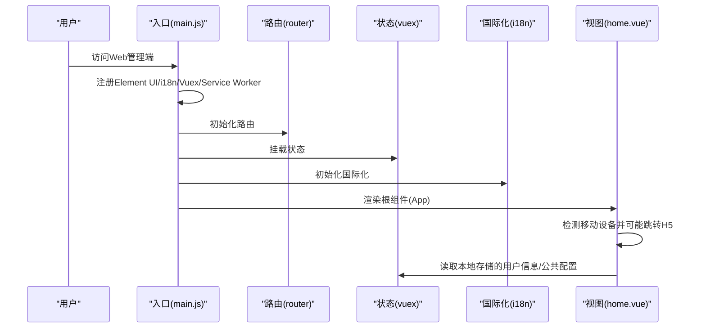

图表来源
- [main/manager-web/src/main.js:1-30](file://main/manager-web/src/main.js#L1-L30)
- [main/manager-web/src/App.vue:62-107](file://main/manager-web/src/App.vue#L62-L107)

章节来源
- [main/manager-web/src/main.js:1-30](file://main/manager-web/src/main.js#L1-L30)
- [main/manager-web/src/App.vue:1-179](file://main/manager-web/src/App.vue#L1-L179)

### Web端：路由与鉴权
- 路由表：包含登录、首页、设备管理、用户管理、模型配置、知识库、OTA、语音资源、音色克隆、字典、提供商、代理模板、功能配置、替换词等页面
- 全局守卫：对受保护路由进行token校验，未登录重定向至登录页并携带redirect参数
- 重复导航处理：捕获NavigationDuplicated错误并刷新页面

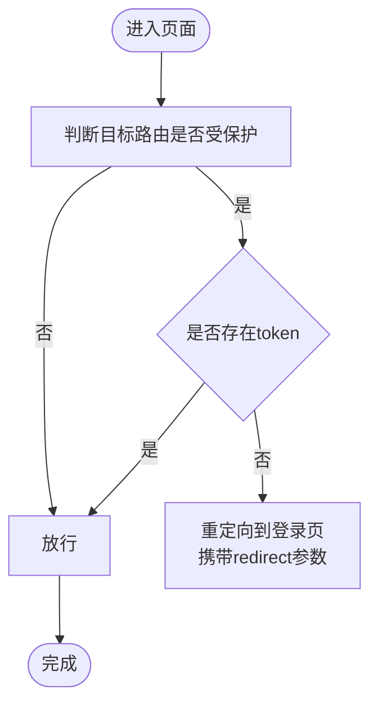

图表来源
- [main/manager-web/src/router/index.js:234-247](file://main/manager-web/src/router/index.js#L234-L247)

章节来源
- [main/manager-web/src/router/index.js:1-250](file://main/manager-web/src/router/index.js#L1-L250)

### Web端：状态管理（Vuex）
- 状态：token、用户信息、公共配置
- Getter：懒加载token与用户信息
- Mutations：设置/清除token与用户信息，持久化到localStorage
- Actions：登出清理并跳转登录；获取公共配置并写入store

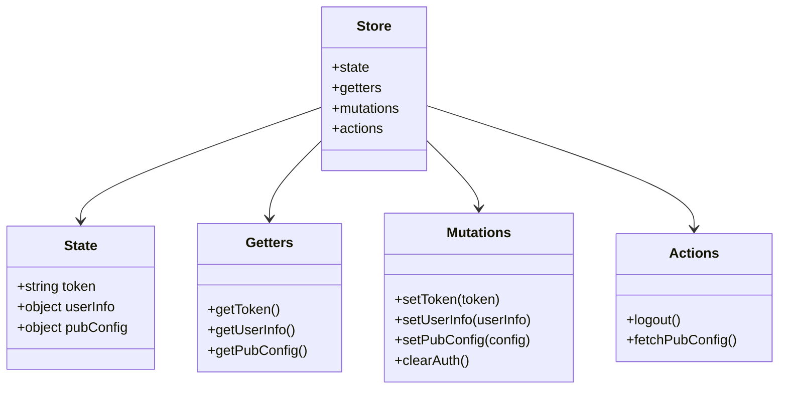

图表来源
- [main/manager-web/src/store/index.js:9-77](file://main/manager-web/src/store/index.js#L9-L77)

章节来源
- [main/manager-web/src/store/index.js:1-77](file://main/manager-web/src/store/index.js#L1-L77)

### Web端：国际化（vue-i18n）
- 默认语言策略：优先本地存储，其次浏览器语言（区分简/繁中文），否则英文
- 切换逻辑：更新i18n.locale并持久化；通过事件总线广播语言变更
- 文案使用：在组件内通过$t与本地化键渲染

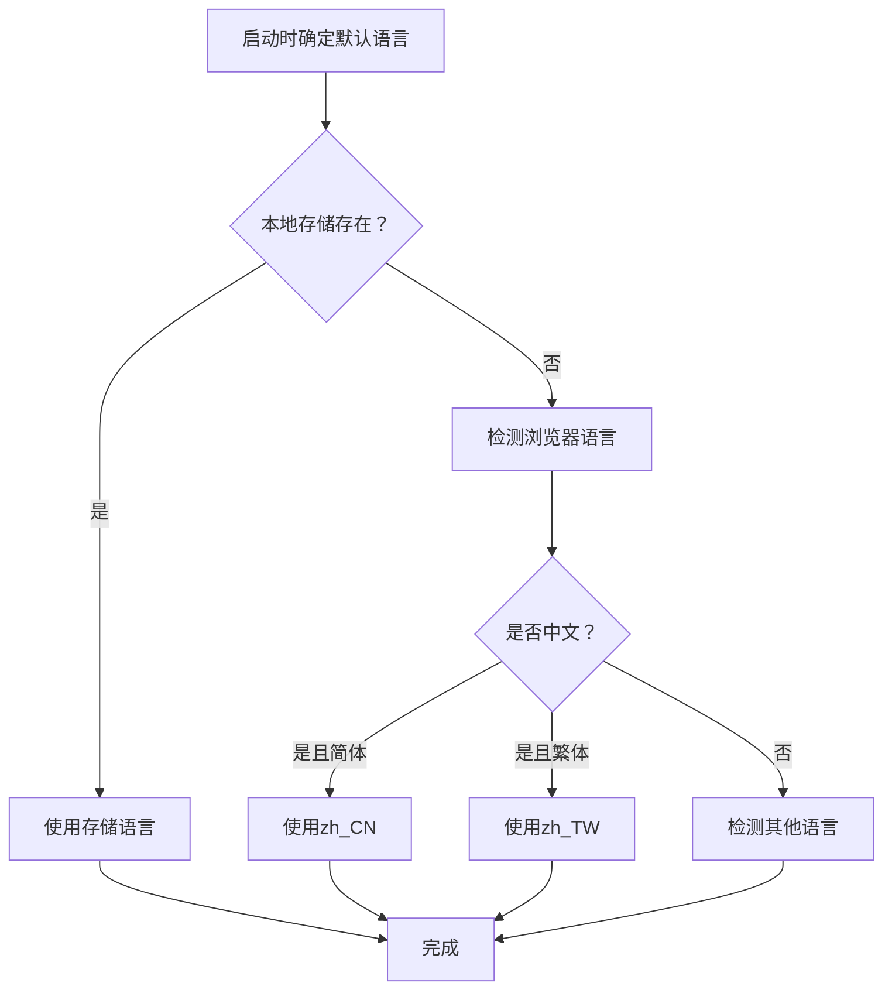

图表来源
- [main/manager-web/src/i18n/index.js:13-35](file://main/manager-web/src/i18n/index.js#L13-L35)

章节来源
- [main/manager-web/src/i18n/index.js:1-58](file://main/manager-web/src/i18n/index.js#L1-L58)

### Web端：首页视图（设备/智能体管理）
- 功能概览：欢迎横幅、新增智能体、设备列表网格、搜索与骨架屏、删除确认、聊天历史弹窗
- 数据流：首次加载获取智能体列表，设置骨架屏数量；搜索根据MAC或名称过滤；删除后刷新列表
- 交互细节：点击卡片进入配置/管理；右上角聊天历史弹窗传入agentId与agentName

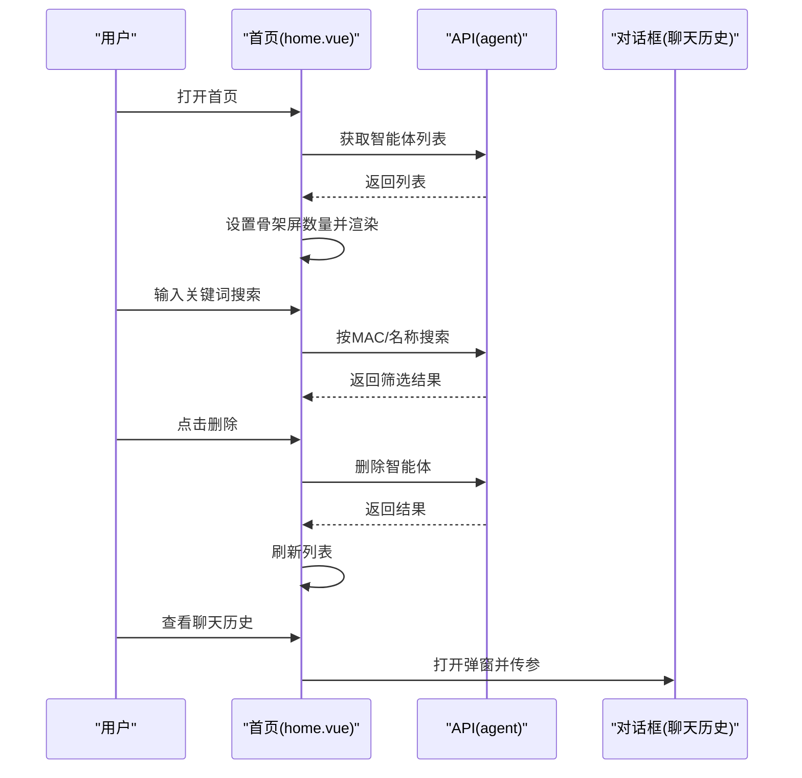

图表来源
- [main/manager-web/src/views/home.vue:91-204](file://main/manager-web/src/views/home.vue#L91-L204)

章节来源
- [main/manager-web/src/views/home.vue:1-387](file://main/manager-web/src/views/home.vue#L1-L387)

### 移动端：应用入口与生命周期
- SSR应用创建：createSSRApp(App)，注册store、路由拦截器、VueQuery
- 国际化初始化：initI18n在应用启动时生效
- 首页tabBar文本动态国际化：onShow时更新，监听语言切换watch实时刷新

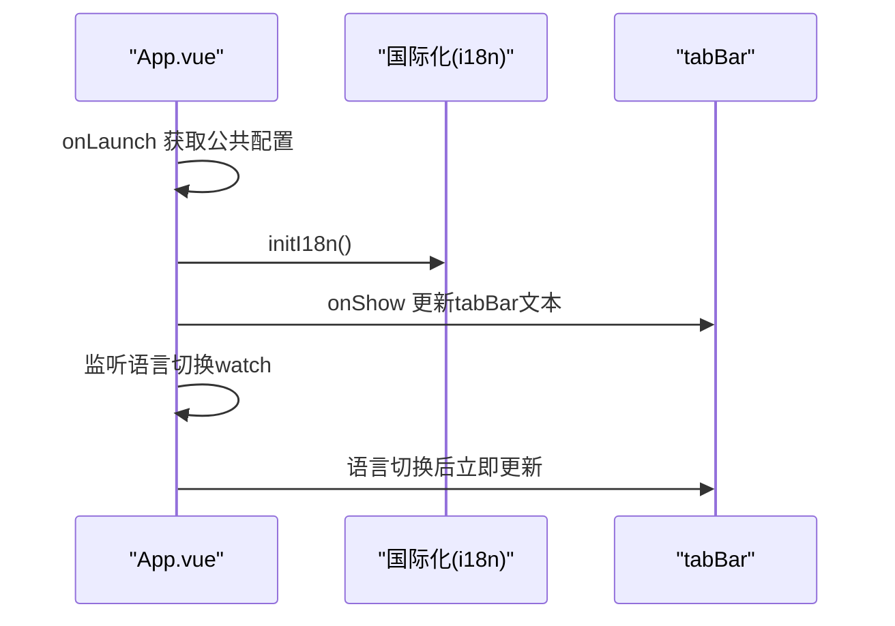

图表来源
- [main/manager-mobile/src/App.vue:15-74](file://main/manager-mobile/src/App.vue#L15-L74)
- [main/manager-mobile/src/main.ts:14-26](file://main/manager-mobile/src/main.ts#L14-L26)

章节来源
- [main/manager-mobile/src/App.vue:1-95](file://main/manager-mobile/src/App.vue#L1-L95)
- [main/manager-mobile/src/main.ts:1-27](file://main/manager-mobile/src/main.ts#L1-L27)

### 移动端：状态管理（Pinia + 持久化）
- 存储：createPinia + pinia-plugin-persistedstate（使用uni.get/setStorageSync）
- 模块：统一导出config、plugin、provider、speedPitch、user等模块
- 作用：跨页面共享配置、用户会话、语言选择等

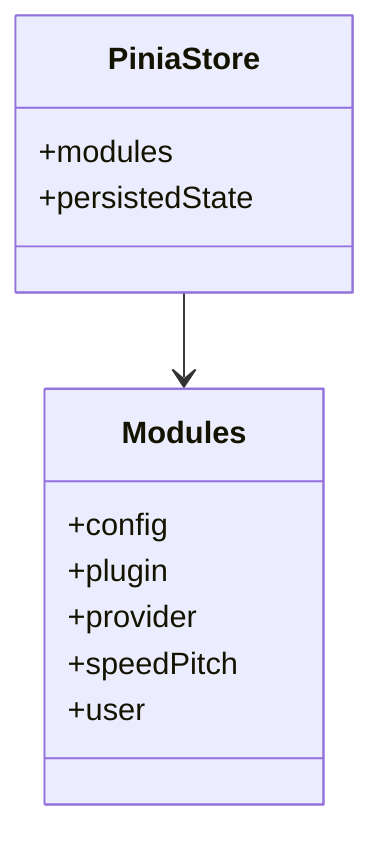

图表来源
- [main/manager-mobile/src/store/index.ts:1-22](file://main/manager-mobile/src/store/index.ts#L1-L22)

章节来源
- [main/manager-mobile/src/store/index.ts:1-22](file://main/manager-mobile/src/store/index.ts#L1-L22)

### 移动端：国际化（自研i18n）
- 语言包映射：zh_CN/en/zh_TW/de/vi/pt_BR
- 切换：changeLanguage更新store中的currentLang并触发组件更新
- 占位符：支持{key}参数替换，返回key本身作为兜底

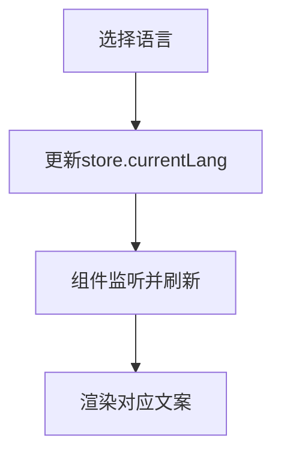

图表来源
- [main/manager-mobile/src/i18n/index.ts:33-62](file://main/manager-mobile/src/i18n/index.ts#L33-L62)

章节来源
- [main/manager-mobile/src/i18n/index.ts:1-79](file://main/manager-mobile/src/i18n/index.ts#L1-L79)

### 移动端：首页页面（z-paging + 滑动操作）
- 列表：z-paging加载智能体列表，空态/下拉刷新/回到顶部
- 交互：滑动删除、点击卡片进入编辑、FAB创建对话框
- 时间格式化：相对时间（刚刚/分钟前/小时前/天前）
- 导航栏：动态国际化标题

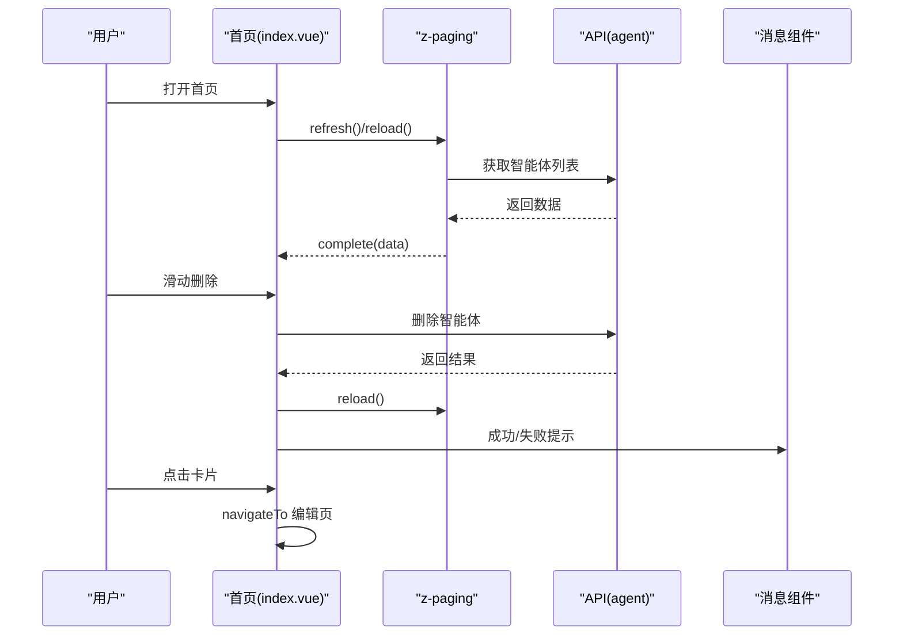

图表来源
- [main/manager-mobile/src/pages/index/index.vue:58-170](file://main/manager-mobile/src/pages/index/index.vue#L58-L170)

章节来源
- [main/manager-mobile/src/pages/index/index.vue:1-591](file://main/manager-mobile/src/pages/index/index.vue#L1-L591)

### Demo演示：孵化/聊天场景
- 结构：场景切换（孵化、出生、聊天）、设置弹窗、MCP工具管理、聊天记录/记忆/用户画像分页
- 交互：开始孵化、进度条、录音、拨号、背景切换、设置面板
- 依赖：libopus.js音频编解码

章节来源
- [main/demo-web/index.html:1-399](file://main/demo-web/index.html#L1-L399)

## 依赖关系分析
- Web端
  - 依赖：vue、element-ui、vue-router、vuex、vue-i18n、flyio、opus相关库
  - 构建：@vue/cli-service，支持分析与PWA相关插件
- 移动端
  - 依赖：@dcloudio/uni-app、pinia、wot-design-uni、z-paging、@tanstack/vue-query、alova
  - 构建：vite + @dcloudio/vite-plugin-uni，支持多端编译与SSR
- Demo演示
  - 依赖：vite，独立运行

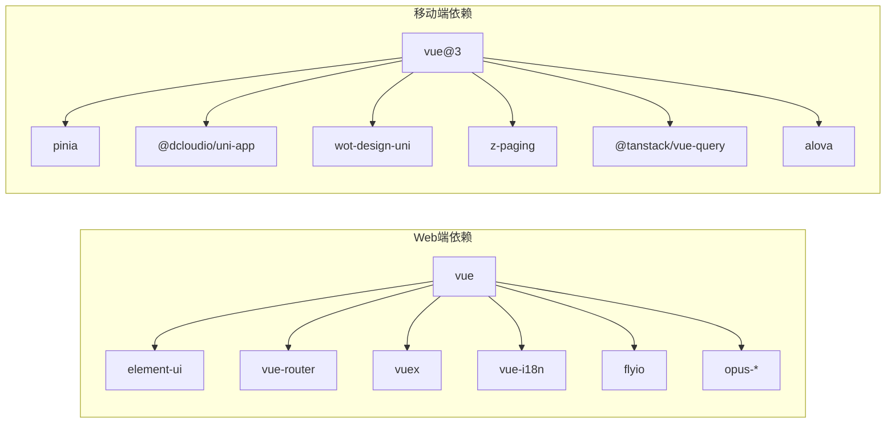

图表来源
- [main/manager-web/package.json:10-38](file://main/manager-web/package.json#L10-L38)
- [main/manager-mobile/package.json:77-106](file://main/manager-mobile/package.json#L77-L106)

章节来源
- [main/manager-web/package.json:1-51](file://main/manager-web/package.json#L1-L51)
- [main/manager-mobile/package.json:1-163](file://main/manager-mobile/package.json#L1-L163)
- [main/demo-web/package.json:1-15](file://main/demo-web/package.json#L1-L15)

## 性能考量
- Web端
  - Service Worker与CDN缓存：在启用CDN时提供缓存状态检查与调试提示，建议生产环境开启
  - 路由重复导航：捕获NavigationDuplicated并刷新，避免重复跳转造成的内存泄漏
  - 骨架屏：首页列表使用骨架屏减少白屏与闪烁
- 移动端
  - z-paging：内置空态、下拉刷新、回到顶部，减少滚动卡顿
  - 持久化状态：Pinia持久化减少页面切换与重启后的状态丢失
  - UnoCSS：原子化样式减少打包体积与冗余样式
- 通用
  - 图片与字体：注意资源体积与懒加载策略
  - 国际化：避免在渲染路径频繁切换语言导致的重绘

[本节为通用指导，无需特定文件引用]

## 故障排查指南
- Web端
  - 登录态失效：路由守卫会重定向至登录页；检查localStorage中的token是否存在
  - CDN/缓存问题：启用CDN后可通过全局快捷键或控制台方法查看缓存状态；开发环境提示需在受支持环境中验证
  - Service Worker：若未注册或无缓存，控制台会输出相应提示；生产环境更易出现缓存效果
- 移动端
  - tabBar文本不更新：确认onShow时机与语言切换watch是否触发；检查initI18n是否正确初始化
  - 列表加载失败：z-paging complete(false)会显式提示；检查网络与API返回
  - 语言切换无效：确认store.lang中的currentLang是否更新，组件是否监听该状态

章节来源
- [main/manager-web/src/router/index.js:234-247](file://main/manager-web/src/router/index.js#L234-L247)
- [main/manager-web/src/App.vue:108-177](file://main/manager-web/src/App.vue#L108-L177)
- [main/manager-mobile/src/App.vue:66-74](file://main/manager-mobile/src/App.vue#L66-L74)
- [main/manager-mobile/src/pages/index/index.vue:58-75](file://main/manager-mobile/src/pages/index/index.vue#L58-L75)

## 结论
小智ESP32前端体系在Web与移动端两端分别采用成熟生态，兼顾桌面与移动端体验。Web端以Element UI与Vuex为主，移动端以UniApp与Pinia为主，两者均具备完善的国际化、路由鉴权与状态管理能力。通过z-paging、Service Worker与CDN缓存等手段，前端在性能与可用性方面均有良好表现。后续可在组件复用、主题定制与国际化扩展上进一步沉淀规范。

[本节为总结，无需特定文件引用]

## 附录

### 前端开发环境搭建与构建部署
- Web端
  - 依赖安装：使用npm或yarn安装依赖
  - 开发：vue-cli-service serve
  - 构建：vue-cli-service build
  - 分析：ANALYZE=true vue-cli-service build
- 移动端
  - 依赖安装：推荐使用pnpm，遵循package.json engines约束
  - 开发：uni命令支持H5/小程序/APP多端预览
  - 构建：uni build支持多端产物
  - Lint：ESLint与lint-staged配合husky
- Demo演示
  - 依赖安装：vite
  - 开发：vite --port 8006
  - 构建：vite build

章节来源
- [main/manager-web/package.json:5-9](file://main/manager-web/package.json#L5-L9)
- [main/manager-mobile/package.json:26-76](file://main/manager-mobile/package.json#L26-L76)
- [main/demo-web/package.json:6-10](file://main/demo-web/package.json#L6-L10)

### 前端与后端API交互模式
- Web端
  - 请求库：flyio（或axios），通过统一API模块封装
  - 鉴权：路由守卫校验token，Vuex存储token并持久化
  - 公共配置：Store提供获取与持久化公共配置的能力
- 移动端
  - 请求库：alova（@alova/adapter-uniapp），结合@tanstack/vue-query进行数据请求与缓存
  - 鉴权：通过拦截器与store管理token与用户信息
  - 公共配置：App启动时拉取公共配置

章节来源
- [main/manager-web/src/router/index.js:234-247](file://main/manager-web/src/router/index.js#L234-L247)
- [main/manager-web/src/store/index.js:55-73](file://main/manager-web/src/store/index.js#L55-L73)
- [main/manager-mobile/src/main.ts:14-18](file://main/manager-mobile/src/main.ts#L14-L18)

### 国际化支持与多语言切换
- Web端：vue-i18n，支持zh_CN/zh_TW/en/de/vi/pt_BR；本地存储语言偏好
- 移动端：自研i18n工具，支持语言切换与参数化占位符；通过store.lang驱动

章节来源
- [main/manager-web/src/i18n/index.js:1-58](file://main/manager-web/src/i18n/index.js#L1-L58)
- [main/manager-mobile/src/i18n/index.ts:1-79](file://main/manager-mobile/src/i18n/index.ts#L1-L79)

### 界面定制、样式修改与组件扩展
- Web端
  - 样式：全局SCSS覆盖Element UI组件样式与布局微调
  - 组件：通过Element UI组件库与自定义对话框、列表项等组合
- 移动端
  - 样式：UnoCSS + SCSS，支持主题变量与组件样式定制
  - 组件：Wot Design Uni与z-paging提供移动端原生体验

章节来源
- [main/manager-web/src/styles/global.scss:1-32](file://main/manager-web/src/styles/global.scss#L1-L32)
- [main/manager-mobile/src/style/index.scss:1-20](file://main/manager-mobile/src/style/index.scss#L1-L20)
- [main/manager-mobile/src/pages/index/index.vue:288-591](file://main/manager-mobile/src/pages/index/index.vue#L288-L591)