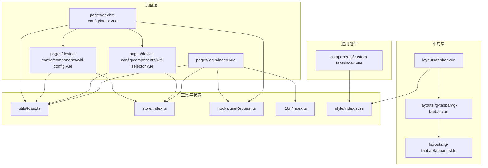
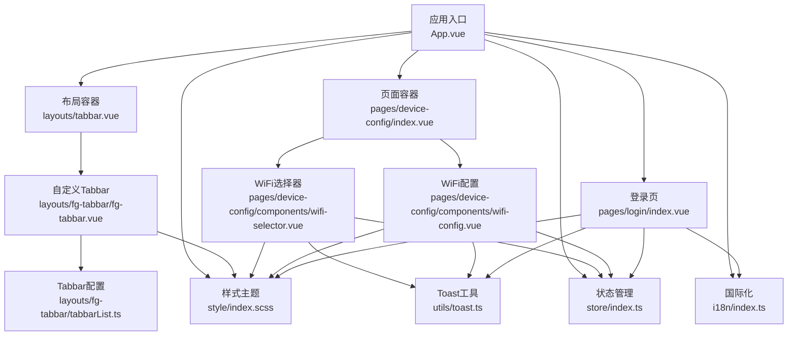
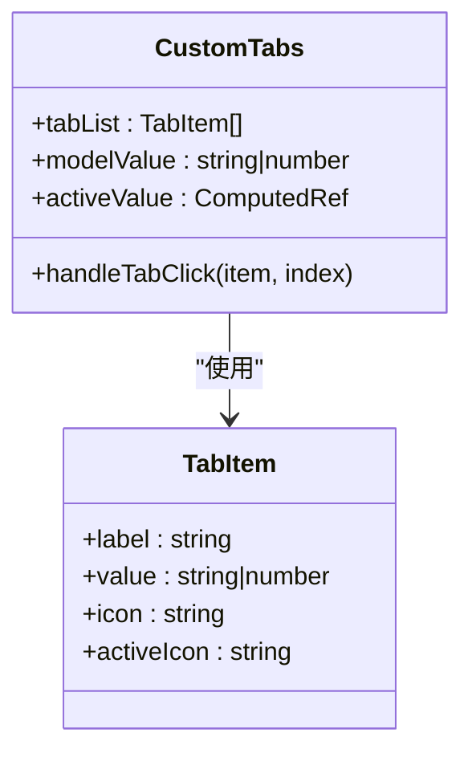
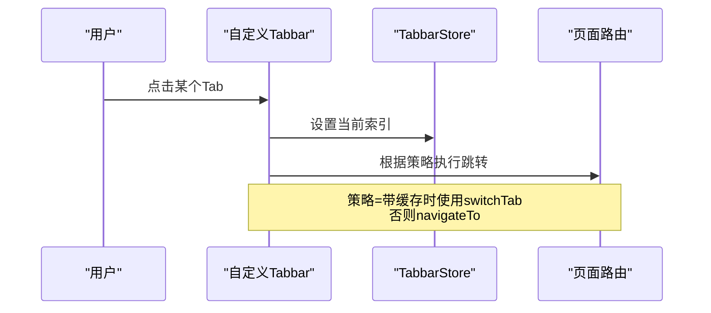
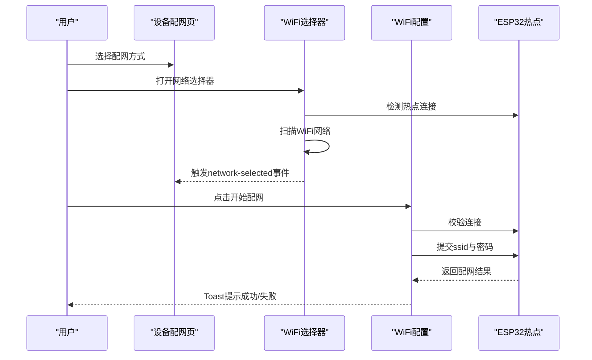
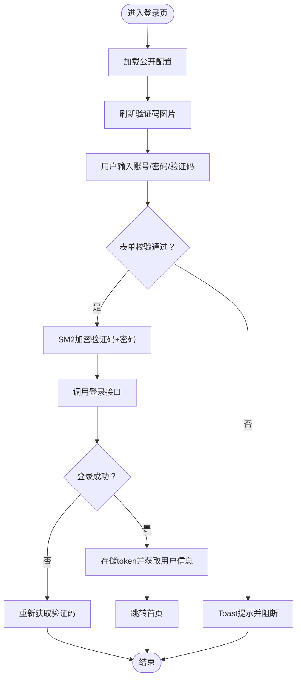
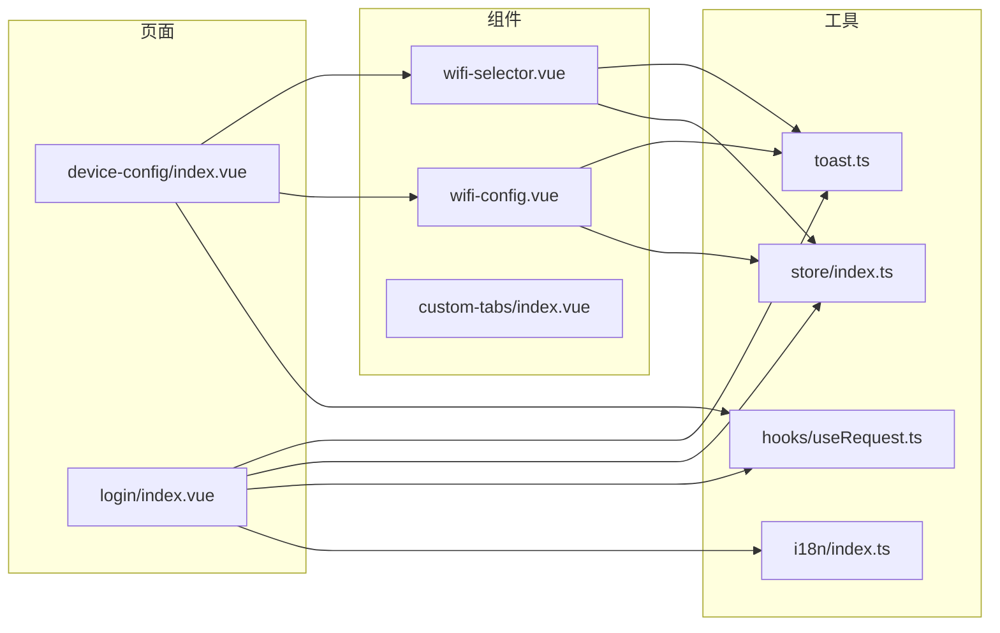

# 移动端UI组件库

<cite>
**本文档引用的文件**
- [index.vue](file://main/manager-mobile/src/components/custom-tabs/index.vue)
- [fg-tabbar.vue](file://main/manager-mobile/src/layouts/fg-tabbar/fg-tabbar.vue)
- [tabbarList.ts](file://main/manager-mobile/src/layouts/fg-tabbar/tabbarList.ts)
- [tabbar.vue](file://main/manager-mobile/src/layouts/tabbar.vue)
- [index.vue](file://main/manager-mobile/src/pages/device-config/index.vue)
- [wifi-selector.vue](file://main/manager-mobile/src/pages/device-config/components/wifi-selector.vue)
- [wifi-config.vue](file://main/manager-mobile/src/pages/device-config/components/wifi-config.vue)
- [index.vue](file://main/manager-mobile/src/pages/login/index.vue)
- [toast.ts](file://main/manager-mobile/src/utils/toast.ts)
- [index.ts](file://main/manager-mobile/src/store/index.ts)
- [useRequest.ts](file://main/manager-mobile/src/hooks/useRequest.ts)
- [index.ts](file://main/manager-mobile/src/i18n/index.ts)
- [index.scss](file://main/manager-mobile/src/style/index.scss)
</cite>

## 目录
1. [简介](#简介)
2. [项目结构](#项目结构)
3. [核心组件](#核心组件)
4. [架构总览](#架构总览)
5. [详细组件分析](#详细组件分析)
6. [依赖关系分析](#依赖关系分析)
7. [性能考虑](#性能考虑)
8. [故障排查指南](#故障排查指南)
9. [结论](#结论)
10. [附录](#附录)

## 简介
本文件面向移动端UI组件库，围绕自定义标签页、弹窗组件（动作面板/选择器）与表单控件展开，系统阐述设计理念、实现方案与最佳实践。重点覆盖移动端专用交互模式（点击、滑动、手势）、动画与过渡效果、手势支持、组件属性配置、事件处理与生命周期管理、组件间通信与状态共享、数据传递、复用与扩展、屏幕适配与性能优化、兼容性处理，以及测试、文档与维护建议。

## 项目结构
移动端UI组件库位于 `main/manager-mobile` 目录，采用基于 Vue 3 + UniApp 的多端统一开发框架。组件组织遵循“布局-页面-组件”分层，配合 Pinia 状态管理、国际化与样式体系，形成可复用、可扩展的移动端UI基础能力。

**图表来源**
- [tabbar.vue:12-19](file://main/manager-mobile/src/layouts/tabbar.vue#L12-L19)
- [fg-tabbar.vue:1-69](file://main/manager-mobile/src/layouts/fg-tabbar/fg-tabbar.vue#L1-L69)
- [tabbarList.ts:1-77](file://main/manager-mobile/src/layouts/fg-tabbar/tabbarList.ts#L1-L77)
- [index.vue:1-156](file://main/manager-mobile/src/pages/device-config/index.vue#L1-L156)
- [wifi-selector.vue:1-568](file://main/manager-mobile/src/pages/device-config/components/wifi-selector.vue#L1-L568)
- [wifi-config.vue:1-237](file://main/manager-mobile/src/pages/device-config/components/wifi-config.vue#L1-L237)
- [index.vue:1-1011](file://main/manager-mobile/src/pages/login/index.vue#L1-L1011)
- [toast.ts:1-66](file://main/manager-mobile/src/utils/toast.ts#L1-L66)
- [index.ts:1-22](file://main/manager-mobile/src/store/index.ts#L1-L22)
- [useRequest.ts:1-52](file://main/manager-mobile/src/hooks/useRequest.ts#L1-L52)
- [index.ts:1-79](file://main/manager-mobile/src/i18n/index.ts#L1-L79)
- [index.scss:1-20](file://main/manager-mobile/src/style/index.scss#L1-L20)

**章节来源**
- [tabbar.vue:12-19](file://main/manager-mobile/src/layouts/tabbar.vue#L12-L19)
- [fg-tabbar.vue:1-69](file://main/manager-mobile/src/layouts/fg-tabbar/fg-tabbar.vue#L1-L69)
- [tabbarList.ts:1-77](file://main/manager-mobile/src/layouts/fg-tabbar/tabbarList.ts#L1-L77)
- [index.vue:1-156](file://main/manager-mobile/src/pages/device-config/index.vue#L1-L156)
- [wifi-selector.vue:1-568](file://main/manager-mobile/src/pages/device-config/components/wifi-selector.vue#L1-L568)
- [wifi-config.vue:1-237](file://main/manager-mobile/src/pages/device-config/components/wifi-config.vue#L1-L237)
- [index.vue:1-1011](file://main/manager-mobile/src/pages/login/index.vue#L1-L1011)
- [toast.ts:1-66](file://main/manager-mobile/src/utils/toast.ts#L1-L66)
- [index.ts:1-22](file://main/manager-mobile/src/store/index.ts#L1-L22)
- [useRequest.ts:1-52](file://main/manager-mobile/src/hooks/useRequest.ts#L1-L52)
- [index.ts:1-79](file://main/manager-mobile/src/i18n/index.ts#L1-L79)
- [index.scss:1-20](file://main/manager-mobile/src/style/index.scss#L1-L20)

## 核心组件
- 自定义标签页：提供可配置的标签项、图标、激活态指示与切换事件，支持响应式布局与屏幕适配。
- 动作面板/选择器：封装弹窗展示、列表滚动、网络扫描、连接状态检测等交互，提供事件回调与暴露方法。
- 表单控件：基于 UI 库输入组件与业务逻辑组合，支持校验、加密、国际化文案与状态反馈。
- 底部导航：支持原生与自定义两种策略，统一主题变量与图标类型，控制缓存与跳转行为。
- 通用工具：Toast 统一提示、Pinia 状态持久化、国际化与样式主题配置。

**章节来源**
- [index.vue:1-132](file://main/manager-mobile/src/components/custom-tabs/index.vue#L1-L132)
- [fg-tabbar.vue:1-69](file://main/manager-mobile/src/layouts/fg-tabbar/fg-tabbar.vue#L1-L69)
- [tabbarList.ts:1-77](file://main/manager-mobile/src/layouts/fg-tabbar/tabbarList.ts#L1-L77)
- [index.vue:1-156](file://main/manager-mobile/src/pages/device-config/index.vue#L1-L156)
- [wifi-selector.vue:1-568](file://main/manager-mobile/src/pages/device-config/components/wifi-selector.vue#L1-L568)
- [wifi-config.vue:1-237](file://main/manager-mobile/src/pages/device-config/components/wifi-config.vue#L1-L237)
- [index.vue:1-1011](file://main/manager-mobile/src/pages/login/index.vue#L1-L1011)
- [toast.ts:1-66](file://main/manager-mobile/src/utils/toast.ts#L1-L66)
- [index.ts:1-22](file://main/manager-mobile/src/store/index.ts#L1-L22)
- [index.ts:1-79](file://main/manager-mobile/src/i18n/index.ts#L1-L79)
- [index.scss:1-20](file://main/manager-mobile/src/style/index.scss#L1-L20)

## 架构总览
移动端UI组件库采用“布局-页面-组件-工具”的分层架构，结合 Wot Design Uni 组件库与 UniApp 运行时，实现跨端一致的交互体验与视觉风格。

**图表来源**
- [tabbar.vue:12-19](file://main/manager-mobile/src/layouts/tabbar.vue#L12-L19)
- [fg-tabbar.vue:1-69](file://main/manager-mobile/src/layouts/fg-tabbar/fg-tabbar.vue#L1-L69)
- [tabbarList.ts:1-77](file://main/manager-mobile/src/layouts/fg-tabbar/tabbarList.ts#L1-L77)
- [index.vue:1-156](file://main/manager-mobile/src/pages/device-config/index.vue#L1-L156)
- [wifi-selector.vue:1-568](file://main/manager-mobile/src/pages/device-config/components/wifi-selector.vue#L1-L568)
- [wifi-config.vue:1-237](file://main/manager-mobile/src/pages/device-config/components/wifi-config.vue#L1-L237)
- [index.vue:1-1011](file://main/manager-mobile/src/pages/login/index.vue#L1-L1011)
- [toast.ts:1-66](file://main/manager-mobile/src/utils/toast.ts#L1-L66)
- [index.ts:1-22](file://main/manager-mobile/src/store/index.ts#L1-L22)
- [index.ts:1-79](file://main/manager-mobile/src/i18n/index.ts#L1-L79)
- [index.scss:1-20](file://main/manager-mobile/src/style/index.scss#L1-L20)

## 详细组件分析

### 自定义标签页组件
- 设计理念：简洁直观的底部导航，支持图标与文字、激活态指示与颜色变化，提供点击切换与双向绑定。
- 关键属性
  - tabList：标签项数组，包含 label、value、icon、activeIcon。
  - modelValue：当前激活值，支持 v-model 双向绑定。
- 事件
  - update:modelValue：内部更新激活值时向外发出。
  - change：点击标签项时发出，携带 item 与 index。
- 交互与动画
  - 激活态颜色与指示条过渡，点击态缩放与高亮。
  - 媒体查询适配小屏字体与图标尺寸。
- 生命周期
  - 通过计算属性确定默认激活值，避免空值导致的渲染异常。

**图表来源**
- [index.vue:1-132](file://main/manager-mobile/src/components/custom-tabs/index.vue#L1-L132)

**章节来源**
- [index.vue:1-132](file://main/manager-mobile/src/components/custom-tabs/index.vue#L1-L132)

### 底部导航组件
- 设计理念：统一主题变量与图标类型，支持原生与自定义两种策略；根据策略决定是否隐藏原生 Tabbar，避免重复显示。
- 关键配置
  - 策略常量：无 Tabbar、原生 Tabbar、带缓存自定义 Tabbar、不带缓存自定义 Tabbar。
  - 图标类型：UI库图标、UnoCSS、Iconfont、本地图片。
- 交互
  - 通过 store 控制当前索引，切换 Tabbar 时根据策略选择 switchTab 或 navigateTo。
  - onLoad 阶段隐藏冗余原生 Tabbar。
- 主题与样式
  - ConfigProvider 注入主题变量，全局生效。

**图表来源**
- [fg-tabbar.vue:11-21](file://main/manager-mobile/src/layouts/fg-tabbar/fg-tabbar.vue#L11-L21)
- [tabbarList.ts:17-24](file://main/manager-mobile/src/layouts/fg-tabbar/tabbarList.ts#L17-L24)

**章节来源**
- [fg-tabbar.vue:1-69](file://main/manager-mobile/src/layouts/fg-tabbar/fg-tabbar.vue#L1-L69)
- [tabbarList.ts:1-77](file://main/manager-mobile/src/layouts/fg-tabbar/tabbarList.ts#L1-L77)
- [tabbar.vue:1-20](file://main/manager-mobile/src/layouts/tabbar.vue#L1-L20)

### WiFi 配网流程（页面级组件）
- 设计理念：将“连接状态检测—WiFi扫描—网络选择—提交配网”串联为完整流程，组件间通过事件与暴露方法协作。
- 关键组件
  - 设备配网页：聚合选择器与配置组件，管理配网模式与选中网络信息。
  - WiFi 选择器：负责 ESP32 连接检测、WiFi 扫描、网络列表展示、密码输入与事件上报。
  - WiFi 配置：负责校验连接、构造请求、提交配网并反馈结果。
- 事件与数据流
  - WiFi 选择器向上游发出 network-selected 与 connection-status 事件。
  - 设备配网页接收事件并更新选中网络与密码。
  - WiFi 配置组件在提交时再次校验连接并发起请求。

**图表来源**
- [index.vue:46-78](file://main/manager-mobile/src/pages/device-config/index.vue#L46-L78)
- [wifi-selector.vue:48-148](file://main/manager-mobile/src/pages/device-config/components/wifi-selector.vue#L48-L148)
- [wifi-config.vue:34-104](file://main/manager-mobile/src/pages/device-config/components/wifi-config.vue#L34-L104)

**章节来源**
- [index.vue:1-156](file://main/manager-mobile/src/pages/device-config/index.vue#L1-L156)
- [wifi-selector.vue:1-568](file://main/manager-mobile/src/pages/device-config/components/wifi-selector.vue#L1-L568)
- [wifi-config.vue:1-237](file://main/manager-mobile/src/pages/device-config/components/wifi-config.vue#L1-L237)

### 登录表单（表单控件与交互）
- 设计理念：支持用户名/手机号双登录方式、区号选择、验证码图片刷新与加密传输、国际化文案与主题样式。
- 关键特性
  - 登录方式切换：用户名与手机号互斥，清空对应输入框。
  - 区号选择：ActionSheet 展示支持的区号列表，选择后写入表单。
  - 验证码：动态生成 UUID 并拼接时间戳刷新图片。
  - 加密：使用 SM2 对“验证码+密码”进行加密后再提交。
  - 国际化：初始化语言、切换语言、页面文案多语言。
  - 安全区域：针对不同平台获取安全区域并设置顶部内边距。
- 事件与生命周期
  - onLoad 时刷新验证码。
  - onMounted 时拉取公开配置，确保 UI 与后端配置一致。
  - 成功后存储 token 并跳转首页。

**图表来源**
- [index.vue:160-249](file://main/manager-mobile/src/pages/login/index.vue#L160-L249)
- [index.vue:251-279](file://main/manager-mobile/src/pages/login/index.vue#L251-L279)

**章节来源**
- [index.vue:1-1011](file://main/manager-mobile/src/pages/login/index.vue#L1-L1011)

### 弹窗与提示（Toast）
- 设计理念：统一 Toast 调用，支持四种状态与位置配置，映射到 uni.showToast 的参数。
- 关键点
  - 类型映射：success/error/warning/info → 对应图标。
  - 位置映射：top/middle/bottom → top/center/bottom。
  - 默认值：持续时间、图标、消息内容。
- 使用场景：登录失败、WiFi 扫描失败、连接状态提示等。

**章节来源**
- [toast.ts:1-66](file://main/manager-mobile/src/utils/toast.ts#L1-L66)

### 状态管理与请求钩子
- Pinia 状态持久化：通过插件将状态持久化到 uni 的本地存储，保证跨页面与重启后的状态一致性。
- useRequest 钩子：封装异步请求的加载、错误与数据状态，支持立即执行与手动触发。

**章节来源**
- [index.ts:1-22](file://main/manager-mobile/src/store/index.ts#L1-L22)
- [useRequest.ts:1-52](file://main/manager-mobile/src/hooks/useRequest.ts#L1-L52)

### 国际化与样式主题
- 国际化：集中管理多语言资源，提供初始化、切换与获取当前语言的方法。
- 样式主题：通过 CSS 变量与 ConfigProvider 覆盖主题色与按钮主色，支持 SCSS 与 UnoCSS。

**章节来源**
- [index.ts:1-79](file://main/manager-mobile/src/i18n/index.ts#L1-L79)
- [index.scss:1-20](file://main/manager-mobile/src/style/index.scss#L1-L20)

## 依赖关系分析

**图表来源**
- [index.vue:1-156](file://main/manager-mobile/src/pages/device-config/index.vue#L1-L156)
- [wifi-selector.vue:1-568](file://main/manager-mobile/src/pages/device-config/components/wifi-selector.vue#L1-L568)
- [wifi-config.vue:1-237](file://main/manager-mobile/src/pages/device-config/components/wifi-config.vue#L1-L237)
- [index.vue:1-1011](file://main/manager-mobile/src/pages/login/index.vue#L1-L1011)
- [toast.ts:1-66](file://main/manager-mobile/src/utils/toast.ts#L1-L66)
- [index.ts:1-22](file://main/manager-mobile/src/store/index.ts#L1-L22)
- [useRequest.ts:1-52](file://main/manager-mobile/src/hooks/useRequest.ts#L1-L52)
- [index.ts:1-79](file://main/manager-mobile/src/i18n/index.ts#L1-L79)

**章节来源**
- [index.vue:1-156](file://main/manager-mobile/src/pages/device-config/index.vue#L1-L156)
- [wifi-selector.vue:1-568](file://main/manager-mobile/src/pages/device-config/components/wifi-selector.vue#L1-L568)
- [wifi-config.vue:1-237](file://main/manager-mobile/src/pages/device-config/components/wifi-config.vue#L1-L237)
- [index.vue:1-1011](file://main/manager-mobile/src/pages/login/index.vue#L1-L1011)
- [toast.ts:1-66](file://main/manager-mobile/src/utils/toast.ts#L1-L66)
- [index.ts:1-22](file://main/manager-mobile/src/store/index.ts#L1-L22)
- [useRequest.ts:1-52](file://main/manager-mobile/src/hooks/useRequest.ts#L1-L52)
- [index.ts:1-79](file://main/manager-mobile/src/i18n/index.ts#L1-L79)

## 性能考虑
- 组件渲染优化
  - 使用 v-model 与计算属性减少不必要的重渲染。
  - 列表渲染时使用唯一 key，避免重复 DOM 更新。
- 网络请求优化
  - useRequest 钩子统一处理 loading/error/data，避免重复请求与竞态。
  - 请求超时与失败重试策略（如 WiFi 扫描与配网）需谨慎设计，避免频繁重试。
- 图标与资源
  - 自定义 Tabbar 支持多种图标类型，优先使用 UI 库或 UnoCSS，减少本地图片体积。
- 动画与过渡
  - 合理使用过渡与缩放，避免在低端设备上造成掉帧。
- 缓存与跳转
  - 根据 Tabbar 策略选择 switchTab 与 navigateTo，提升页面切换性能。

[本节为通用指导，无需具体文件来源]

## 故障排查指南
- 登录失败
  - 检查 SM2 公钥是否配置，加密过程是否抛错。
  - 验证码刷新与输入是否正确，接口返回是否包含 token。
- WiFi 扫描失败
  - 确认已连接 ESP32 热点，网络可达且接口返回格式正确。
  - 检查返回数据结构兼容性（新旧格式）。
- Toast 未显示
  - 检查传入的 position 与 icon 是否符合映射规则。
- Tabbar 重复显示
  - 确认策略选择与 onLoad 中隐藏原生 Tabbar 的调用是否生效。

**章节来源**
- [index.vue:190-249](file://main/manager-mobile/src/pages/login/index.vue#L190-L249)
- [wifi-selector.vue:71-130](file://main/manager-mobile/src/pages/device-config/components/wifi-selector.vue#L71-L130)
- [toast.ts:28-54](file://main/manager-mobile/src/utils/toast.ts#L28-L54)
- [fg-tabbar.vue:22-34](file://main/manager-mobile/src/layouts/fg-tabbar/fg-tabbar.vue#L22-L34)

## 结论
该移动端UI组件库通过清晰的分层与组件化设计，实现了自定义标签页、弹窗与表单控件在移动端的一致体验。结合 Pinia 状态管理、国际化与样式主题体系，提供了良好的可复用性与扩展性。建议在后续迭代中进一步完善组件文档、单元测试与可视化回归测试，持续优化性能与兼容性。

[本节为总结，无需具体文件来源]

## 附录
- 开发指南
  - 复用：将通用交互抽象为可复用的组合式函数与工具模块。
  - 扩展：新增组件遵循现有命名与目录规范，保持事件与状态对外一致。
  - 定制：通过 ConfigProvider 与样式变量快速调整主题风格。
- 测试与文档
  - 单元测试：对工具函数与组合式逻辑进行独立测试。
  - 端到端测试：使用自动化工具覆盖关键流程（登录、WiFi 配网）。
  - 文档：为每个组件补充属性、事件、插槽与使用示例。
- 维护更新
  - 版本升级：关注 UI 库与运行时版本变更，及时修复不兼容问题。
  - 兼容性：针对不同平台（微信小程序、App、H5）分别验证与降级处理。

[本节为通用指导，无需具体文件来源]