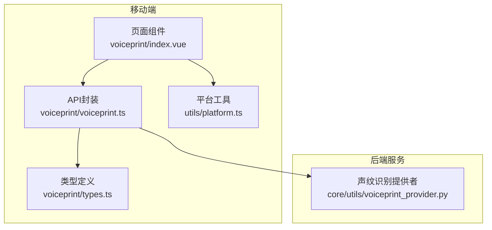
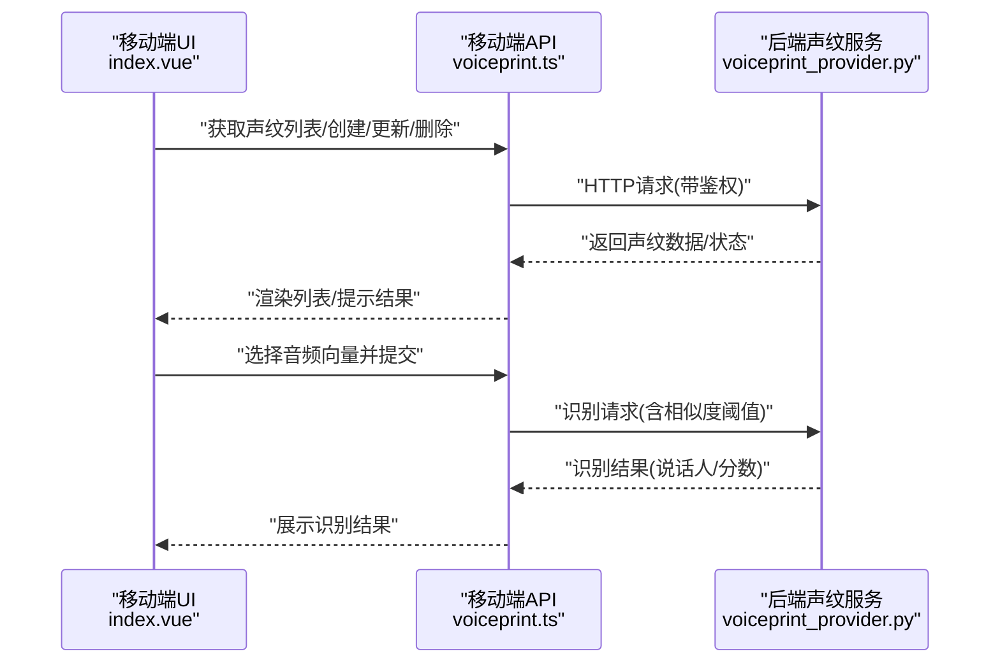
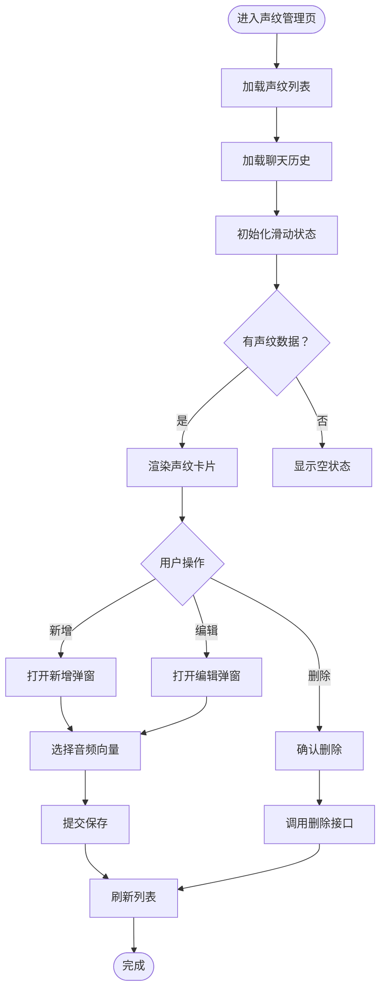
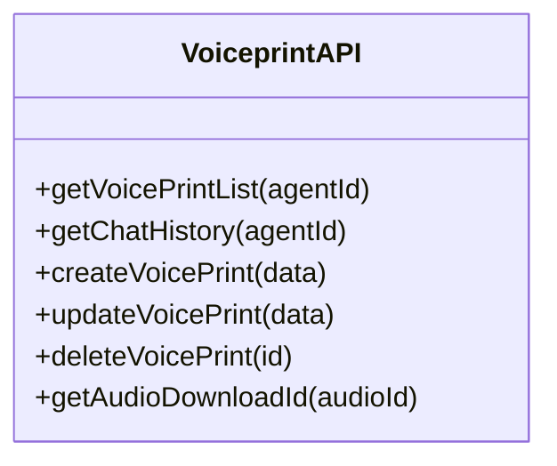
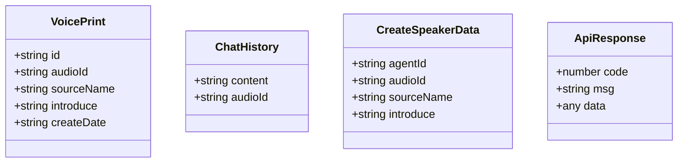
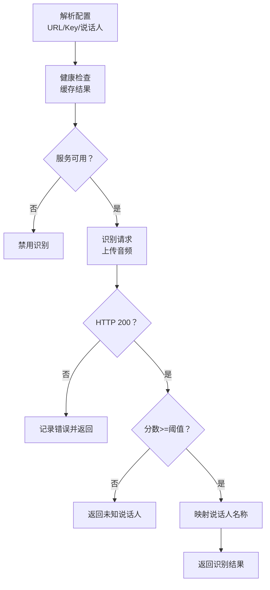
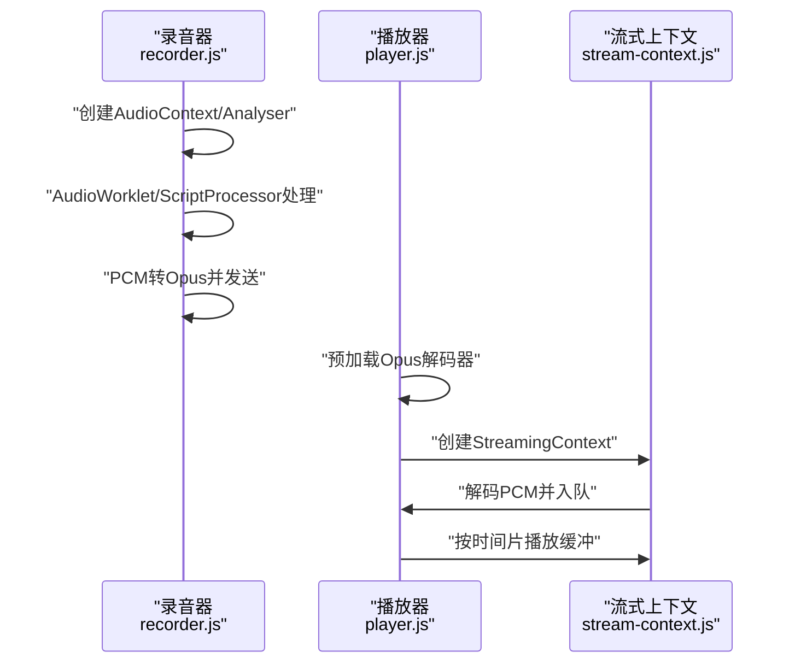
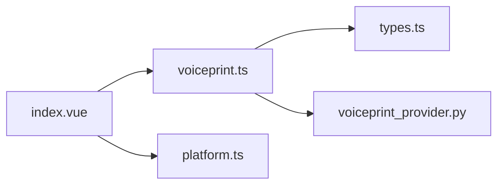

# 移动端声纹管理

<cite>
**本文档引用的文件**
- [index.vue](file://main/manager-mobile/src/pages/voiceprint/index.vue)
- [voiceprint.ts](file://main/manager-mobile/src/api/voiceprint/voiceprint.ts)
- [types.ts](file://main/manager-mobile/src/api/voiceprint/types.ts)
- [index.ts](file://main/manager-mobile/src/api/voiceprint/index.ts)
- [voiceprint_provider.py](file://main/xiaozhi-server/core/utils/voiceprint_provider.py)
- [recorder.js](file://main/demo-web/js/core/audio/recorder.js)
- [player.js](file://main/demo-web/js/core/audio/player.js)
- [stream-context.js](file://main/demo-web/js/core/audio/stream-context.js)
- [platform.ts](file://main/manager-mobile/src/utils/platform.ts)
</cite>

## 目录
1. [简介](#简介)
2. [项目结构](#项目结构)
3. [核心组件](#核心组件)
4. [架构概览](#架构概览)
5. [详细组件分析](#详细组件分析)
6. [依赖分析](#依赖分析)
7. [性能考虑](#性能考虑)
8. [故障排除指南](#故障排除指南)
9. [结论](#结论)
10. [附录](#附录)

## 简介
本文件面向移动端声纹管理功能，系统性阐述声纹录入、识别与管理的完整实现路径。文档覆盖移动端音频采集、录音控制与音频处理技术，声纹特征提取、匹配算法与识别准确度优化策略，声纹注册流程、验证机制与安全防护措施，并提供声纹删除、替换与批量管理的操作指南。同时，结合移动端特性说明音频录制质量控制、噪声抑制与回放功能，以及声纹数据存储、加密保护与隐私安全的技术实现。

## 项目结构
移动端声纹管理功能主要由三部分组成：
- 移动端界面与交互：负责声纹列表展示、新增/编辑/删除、向量选择与回放。
- 移动端网络层：封装对后端声纹服务的HTTP调用，包括声纹列表、创建、更新、删除与音频下载ID获取。
- 后端声纹识别服务：提供声纹识别能力，包含健康检查、相似度阈值控制与说话人映射。

**图表来源**
- [index.vue:1-658](file://main/manager-mobile/src/pages/voiceprint/index.vue#L1-L658)
- [voiceprint.ts:1-73](file://main/manager-mobile/src/api/voiceprint/voiceprint.ts#L1-L73)
- [types.ts:1-30](file://main/manager-mobile/src/api/voiceprint/types.ts#L1-L30)
- [voiceprint_provider.py:1-199](file://main/xiaozhi-server/core/utils/voiceprint_provider.py#L1-L199)

**章节来源**
- [index.vue:1-658](file://main/manager-mobile/src/pages/voiceprint/index.vue#L1-L658)
- [voiceprint.ts:1-73](file://main/manager-mobile/src/api/voiceprint/voiceprint.ts#L1-L73)
- [types.ts:1-30](file://main/manager-mobile/src/api/voiceprint/types.ts#L1-L30)
- [voiceprint_provider.py:1-199](file://main/xiaozhi-server/core/utils/voiceprint_provider.py#L1-L199)

## 核心组件
- 声纹管理页面：提供声纹列表、新增、编辑、删除、向量选择与音频回放功能；集成微信小程序安全区域适配与弹窗交互。
- 声纹API封装：封装声纹列表查询、创建、更新、删除、音频下载ID获取等HTTP接口调用。
- 类型定义：统一声纹信息、聊天历史与响应类型的接口定义。
- 声纹识别提供者：后端服务封装，负责解析配置、健康检查、相似度阈值控制与识别结果处理。

**章节来源**
- [index.vue:1-658](file://main/manager-mobile/src/pages/voiceprint/index.vue#L1-L658)
- [voiceprint.ts:1-73](file://main/manager-mobile/src/api/voiceprint/voiceprint.ts#L1-L73)
- [types.ts:1-30](file://main/manager-mobile/src/api/voiceprint/types.ts#L1-L30)
- [voiceprint_provider.py:15-199](file://main/xiaozhi-server/core/utils/voiceprint_provider.py#L15-L199)

## 架构概览
移动端通过HTTP接口与后端声纹识别服务交互，完成声纹注册与管理；后端服务对接第三方声纹识别API，进行特征提取与匹配，并通过相似度阈值控制识别准确性。

**图表来源**
- [index.vue:85-117](file://main/manager-mobile/src/pages/voiceprint/index.vue#L85-L117)
- [voiceprint.ts:8-72](file://main/manager-mobile/src/api/voiceprint/voiceprint.ts#L8-L72)
- [voiceprint_provider.py:140-198](file://main/xiaozhi-server/core/utils/voiceprint_provider.py#L140-L198)

## 详细组件分析

### 移动端声纹管理页面
- 数据与状态管理：维护声纹列表、聊天历史、滑动状态、加载状态与音频播放上下文。
- 交互流程：
  - 加载声纹列表与聊天历史，初始化滑动状态。
  - 新增/编辑弹窗：填写名称与描述，选择音频向量，提交保存。
  - 删除确认：二次确认后调用删除接口。
  - 音频回放：获取下载ID，创建内建音频上下文，监听播放结束与错误。
- 平台适配：根据平台类型读取系统信息与安全区域，保证在不同小程序平台上的布局一致性。

**图表来源**
- [index.vue:85-117](file://main/manager-mobile/src/pages/voiceprint/index.vue#L85-L117)
- [index.vue:147-186](file://main/manager-mobile/src/pages/voiceprint/index.vue#L147-L186)
- [index.vue:188-288](file://main/manager-mobile/src/pages/voiceprint/index.vue#L188-L288)
- [index.vue:290-355](file://main/manager-mobile/src/pages/voiceprint/index.vue#L290-L355)

**章节来源**
- [index.vue:1-658](file://main/manager-mobile/src/pages/voiceprint/index.vue#L1-L658)

### 移动端声纹API封装
- 接口职责：
  - 获取声纹列表：按智能体ID查询声纹集合。
  - 获取聊天历史：用于选择音频向量。
  - 创建/更新/删除声纹：提交或修改声纹信息。
  - 获取音频下载ID：用于回放音频。
- 请求特点：统一鉴权与提示策略，缓存控制与错误处理。

**图表来源**
- [voiceprint.ts:8-72](file://main/manager-mobile/src/api/voiceprint/voiceprint.ts#L8-L72)

**章节来源**
- [voiceprint.ts:1-73](file://main/manager-mobile/src/api/voiceprint/voiceprint.ts#L1-L73)

### 类型定义
- 声纹信息：包含唯一标识、音频ID、名称、描述与创建时间。
- 聊天历史：包含内容与音频ID。
- 创建数据：包含智能体ID、音频ID、名称与描述。
- 通用响应：统一的code/msg/data结构。

**图表来源**
- [types.ts:2-29](file://main/manager-mobile/src/api/voiceprint/types.ts#L2-L29)

**章节来源**
- [types.ts:1-30](file://main/manager-mobile/src/api/voiceprint/types.ts#L1-L30)

### 后端声纹识别提供者
- 功能概述：
  - 配置解析：从URL中提取API地址与密钥，解析说话人映射。
  - 健康检查：定期缓存健康状态，降低外部依赖失败影响。
  - 识别流程：构造multipart请求，发送音频数据，接收识别结果，应用相似度阈值判断。
- 关键参数：
  - 相似度阈值：低于阈值则判定为“未知说话人”。
  - 说话人ID集合：限定识别范围，提升准确性与安全性。

**图表来源**
- [voiceprint_provider.py:18-71](file://main/xiaozhi-server/core/utils/voiceprint_provider.py#L18-L71)
- [voiceprint_provider.py:140-198](file://main/xiaozhi-server/core/utils/voiceprint_provider.py#L140-L198)

**章节来源**
- [voiceprint_provider.py:15-199](file://main/xiaozhi-server/core/utils/voiceprint_provider.py#L15-L199)

### 移动端音频采集与处理（Web端参考）
虽然移动端采用原生能力，但Web端的音频采集与处理可作为移动端实现的参考：
- 录音器：支持AudioWorklet与ScriptProcessor双通道，实时PCM采集与Opus编码，边录边发至WebSocket。
- 播放器：预加载Opus解码器，基于BlockingQueue与StreamingContext实现低延迟播放。
- 流式上下文：负责解码、队列调度与精确播放时间控制。

**图表来源**
- [recorder.js:94-152](file://main/demo-web/js/core/audio/recorder.js#L94-L152)
- [player.js:247-251](file://main/demo-web/js/core/audio/player.js#L247-L251)
- [stream-context.js:120-215](file://main/demo-web/js/core/audio/stream-context.js#L120-L215)

**章节来源**
- [recorder.js:1-393](file://main/demo-web/js/core/audio/recorder.js#L1-L393)
- [player.js:1-298](file://main/demo-web/js/core/audio/player.js#L1-L298)
- [stream-context.js:1-221](file://main/demo-web/js/core/audio/stream-context.js#L1-L221)

## 依赖分析
- 前端依赖：
  - 页面组件依赖API封装与类型定义，调用HTTP接口完成CRUD与回放。
  - 平台工具提供运行时平台信息，辅助UI适配。
- 后端依赖：
  - 声纹识别提供者依赖外部识别服务，内部通过缓存与阈值控制提升稳定性与安全性。

**图表来源**
- [index.vue:1-658](file://main/manager-mobile/src/pages/voiceprint/index.vue#L1-L658)
- [voiceprint.ts:1-73](file://main/manager-mobile/src/api/voiceprint/voiceprint.ts#L1-L73)
- [types.ts:1-30](file://main/manager-mobile/src/api/voiceprint/types.ts#L1-L30)
- [platform.ts:1-25](file://main/manager-mobile/src/utils/platform.ts#L1-L25)
- [voiceprint_provider.py:1-199](file://main/xiaozhi-server/core/utils/voiceprint_provider.py#L1-L199)

**章节来源**
- [index.vue:1-658](file://main/manager-mobile/src/pages/voiceprint/index.vue#L1-L658)
- [voiceprint.ts:1-73](file://main/manager-mobile/src/api/voiceprint/voiceprint.ts#L1-L73)
- [types.ts:1-30](file://main/manager-mobile/src/api/voiceprint/types.ts#L1-L30)
- [platform.ts:1-25](file://main/manager-mobile/src/utils/platform.ts#L1-L25)
- [voiceprint_provider.py:1-199](file://main/xiaozhi-server/core/utils/voiceprint_provider.py#L1-L199)

## 性能考虑
- 识别延迟与吞吐：
  - 后端识别采用异步HTTP客户端，设置合理超时，避免阻塞主线程。
  - 相似度阈值控制减少误识别，提高整体识别效率。
- 音频处理：
  - Web端采用AudioWorklet优先、ScriptProcessor回退的策略，降低CPU占用。
  - 播放端通过预加载解码器与分片播放，缩短首包延迟。
- 网络与缓存：
  - 健康检查结果缓存，降低频繁探测带来的开销。
  - 前端接口缓存控制为0，确保数据实时性。

[本节为通用性能建议，无需具体文件分析]

## 故障排除指南
- 声纹接口未配置：
  - 现象：尝试获取列表时提示接口未配置。
  - 处理：检查后端配置URL与密钥，确保健康检查通过。
- 识别失败或返回“未知说话人”：
  - 现象：识别分数低于阈值或外部服务异常。
  - 处理：提升录音质量、增加音频长度、调整阈值或检查外部服务状态。
- 音频播放异常：
  - 现象：播放失败或无声。
  - 处理：确认下载ID有效、网络连通、音频格式兼容；移动端需确保内建音频上下文正确创建与销毁。

**章节来源**
- [index.vue:154-183](file://main/manager-mobile/src/pages/voiceprint/index.vue#L154-L183)
- [index.vue:290-355](file://main/manager-mobile/src/pages/voiceprint/index.vue#L290-L355)
- [voiceprint_provider.py:140-198](file://main/xiaozhi-server/core/utils/voiceprint_provider.py#L140-L198)

## 结论
移动端声纹管理通过清晰的前后端分工实现了完整的注册、识别与管理闭环。前端提供直观的交互与回放能力，后端通过健康检查与相似度阈值保障识别稳定性与安全性。后续可在移动端引入更完善的音频质量控制与噪声抑制策略，进一步提升识别准确度与用户体验。

[本节为总结性内容，无需具体文件分析]

## 附录

### 移动端音频录制质量控制与噪声抑制
- 参考Web端实现思路：
  - 使用高通降噪与回声消除参数，固定采样率与单声道，确保数据一致性。
  - 采用AudioWorklet进行低延迟处理，必要时回退至ScriptProcessor。
- 移动端建议：
  - 在录音前进行麦克风可用性检测，避免无效录制。
  - 控制最小录音时长，确保采集足够样本帧。
  - 对异常帧进行丢弃或填充，维持连续性。

**章节来源**
- [recorder.js:229](file://main/demo-web/js/core/audio/recorder.js#L229)
- [recorder.js:367-384](file://main/demo-web/js/core/audio/recorder.js#L367-L384)

### 回放功能与数据流
- 回放流程：
  - 选择历史项触发播放，先获取下载ID，再拼接播放URL。
  - 创建内建音频上下文，设置自动播放，监听结束与错误事件。
  - 同一音频重复点击则停止当前播放，避免资源冲突。
- Web端参考：
  - 播放器预加载解码器，基于队列与流式上下文实现稳定播放。

**章节来源**
- [index.vue:290-355](file://main/manager-mobile/src/pages/voiceprint/index.vue#L290-L355)
- [player.js:247-251](file://main/demo-web/js/core/audio/player.js#L247-L251)
- [stream-context.js:161-215](file://main/demo-web/js/core/audio/stream-context.js#L161-L215)

### 安全与隐私保护
- 传输安全：
  - 后端识别服务通过Authorization头传递密钥，避免明文泄露。
- 存储与访问控制：
  - 建议对声纹向量与音频文件进行加密存储，访问时进行权限校验。
- 隐私合规：
  - 明示数据用途与保留期限，提供删除与导出功能，满足用户权利。

[本节为通用安全建议，无需具体文件分析]