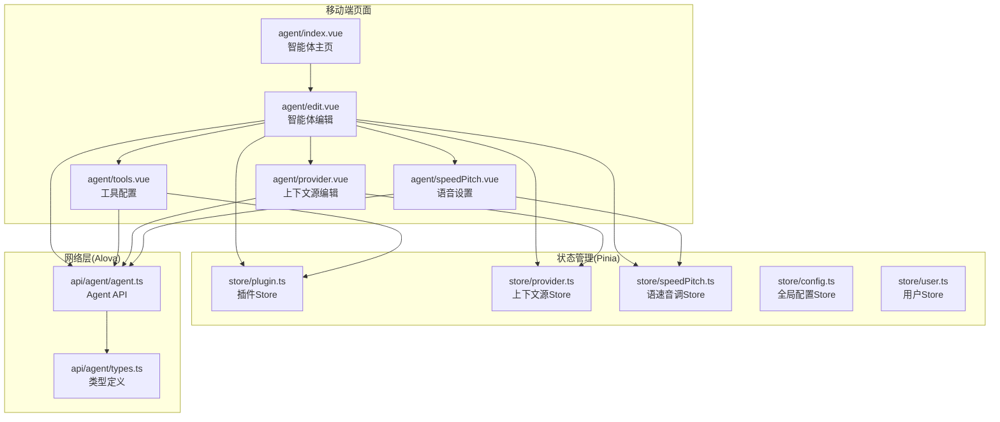
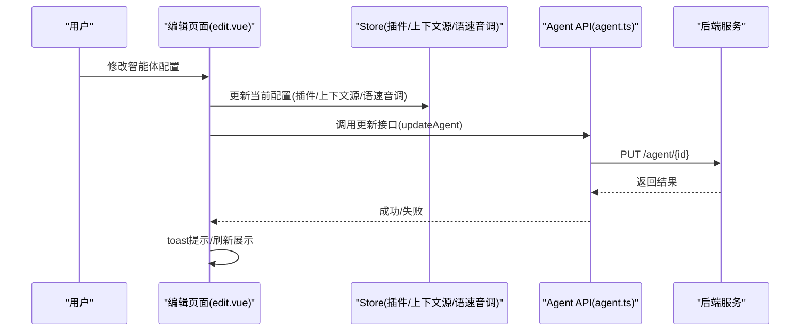
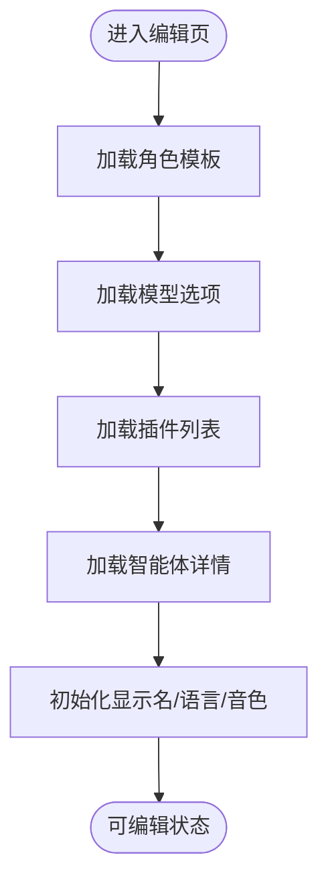
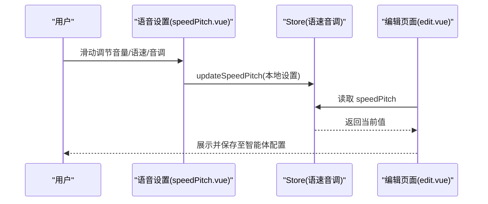
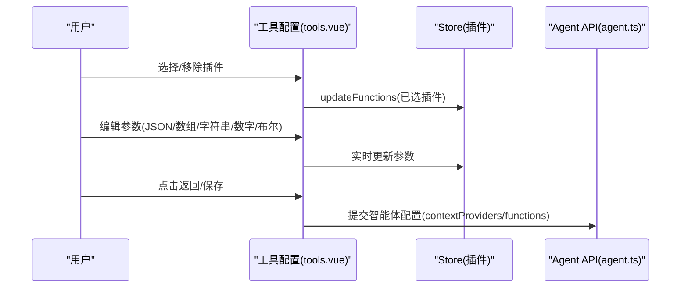
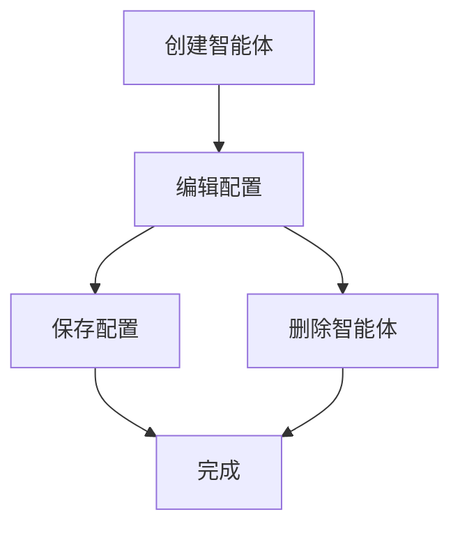
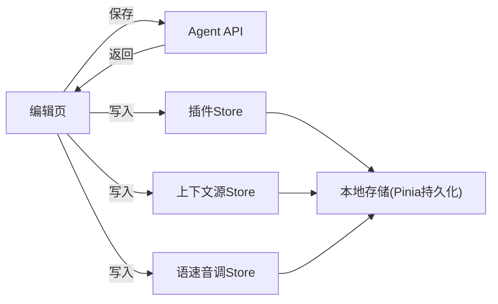
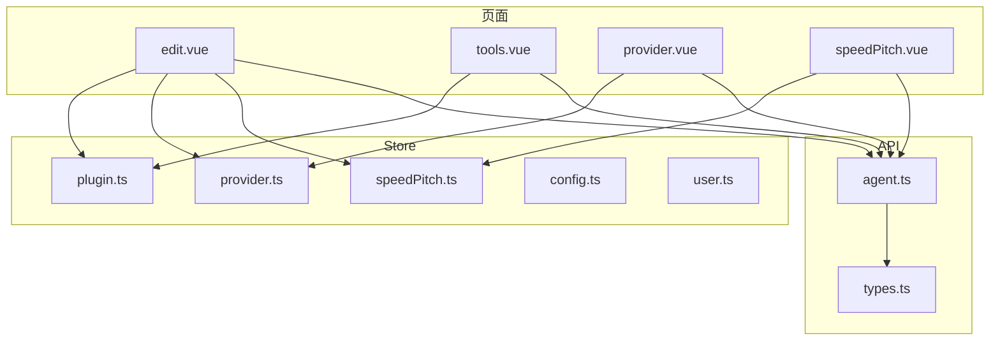

# 移动端智能体配置

<cite>
**本文档引用的文件**
- [index.vue](file://main/manager-mobile/src/pages/agent/index.vue)
- [edit.vue](file://main/manager-mobile/src/pages/agent/edit.vue)
- [provider.vue](file://main/manager-mobile/src/pages/agent/provider.vue)
- [tools.vue](file://main/manager-mobile/src/pages/agent/tools.vue)
- [speedPitch.vue](file://main/manager-mobile/src/pages/agent/speedPitch.vue)
- [agent.ts](file://main/manager-mobile/src/api/agent/agent.ts)
- [types.ts](file://main/manager-mobile/src/api/agent/types.ts)
- [index.ts](file://main/manager-mobile/src/store/index.ts)
- [plugin.ts](file://main/manager-mobile/src/store/plugin.ts)
- [provider.ts](file://main/manager-mobile/src/store/provider.ts)
- [speedPitch.ts](file://main/manager-mobile/src/store/speedPitch.ts)
- [user.ts](file://main/manager-mobile/src/store/user.ts)
- [config.ts](file://main/manager-mobile/src/store/config.ts)
- [zh_CN.ts](file://main/manager-mobile/src/i18n/zh_CN.ts)
</cite>

## 目录
1. [简介](#简介)
2. [项目结构](#项目结构)
3. [核心组件](#核心组件)
4. [架构总览](#架构总览)
5. [详细组件分析](#详细组件分析)
6. [依赖关系分析](#依赖关系分析)
7. [性能考量](#性能考量)
8. [故障排查指南](#故障排查指南)
9. [结论](#结论)
10. [附录](#附录)

## 简介
本文件面向移动端智能体配置功能，系统性阐述以下能力：
- 智能体模板管理、配置编辑与参数调优
- 语音速度与音调调节、工具函数配置与模型提供商选择
- 移动端智能体状态监控、配置预览与实时效果调试
- 智能体创建、编辑与删除的完整流程
- 语音质量优化、个性化配置与批量操作方法
- 移动端特有的配置保存、同步机制与版本管理策略
- 智能体性能监控与配置效果评估方案

## 项目结构
移动端智能体配置位于 manager-mobile 项目中，采用基于页面的组织方式，核心页面包括“智能体主页”“编辑页面”“上下文源编辑”“工具配置”“语音设置”等。通过 Pinia Store 进行状态管理，并通过 Alova HTTP 客户端与后端 API 交互。

**图表来源**
- [index.vue:165-217](file://main/manager-mobile/src/pages/agent/index.vue#L165-L217)
- [edit.vue:1-120](file://main/manager-mobile/src/pages/agent/edit.vue#L1-L120)
- [provider.vue:1-85](file://main/manager-mobile/src/pages/agent/provider.vue#L1-L85)
- [tools.vue:1-86](file://main/manager-mobile/src/pages/agent/tools.vue#L1-L86)
- [speedPitch.vue:1-44](file://main/manager-mobile/src/pages/agent/speedPitch.vue#L1-L44)
- [plugin.ts:1-59](file://main/manager-mobile/src/store/plugin.ts#L1-L59)
- [provider.ts:1-24](file://main/manager-mobile/src/store/provider.ts#L1-L24)
- [speedPitch.ts:1-27](file://main/manager-mobile/src/store/speedPitch.ts#L1-L27)
- [config.ts:1-67](file://main/manager-mobile/src/store/config.ts#L1-L67)
- [user.ts:1-83](file://main/manager-mobile/src/store/user.ts#L1-L83)
- [agent.ts:1-223](file://main/manager-mobile/src/api/agent/agent.ts#L1-L223)
- [types.ts:1-123](file://main/manager-mobile/src/api/agent/types.ts#L1-L123)

**章节来源**
- [index.vue:1-221](file://main/manager-mobile/src/pages/agent/index.vue#L1-L221)
- [edit.vue:1-708](file://main/manager-mobile/src/pages/agent/edit.vue#L1-L708)
- [provider.vue:1-209](file://main/manager-mobile/src/pages/agent/provider.vue#L1-L209)
- [tools.vue:1-595](file://main/manager-mobile/src/pages/agent/tools.vue#L1-L595)
- [speedPitch.vue:1-154](file://main/manager-mobile/src/pages/agent/speedPitch.vue#L1-L154)

## 核心组件
- 智能体主页：负责 Tab 切换与子页面挂载，支持下拉刷新与触底加载。
- 智能体编辑页：聚合模型配置、角色模板、上下文源、工具、语音设置、标签等，统一保存。
- 上下文源编辑页：维护多个外部 API 的 URL 与请求头，支持动态增删。
- 工具配置页：内置插件与 MCP 工具的可视化选择与参数配置，支持实时保存。
- 语音设置页：音量、语速、音调三要素的滑块调节与确认保存。
- Store 层：插件、上下文源、语速音调、全局配置、用户信息等状态持久化或按需持久化。
- API 层：封装智能体详情、模板、模型选项、插件、MCP 地址与工具、声纹、聊天记录、标签等接口。

**章节来源**
- [index.vue:67-92](file://main/manager-mobile/src/pages/agent/index.vue#L67-L92)
- [edit.vue:127-152](file://main/manager-mobile/src/pages/agent/edit.vue#L127-L152)
- [provider.vue:25-76](file://main/manager-mobile/src/pages/agent/provider.vue#L25-L76)
- [tools.vue:44-86](file://main/manager-mobile/src/pages/agent/tools.vue#L44-L86)
- [speedPitch.vue:21-43](file://main/manager-mobile/src/pages/agent/speedPitch.vue#L21-L43)
- [plugin.ts:5-58](file://main/manager-mobile/src/store/plugin.ts#L5-L58)
- [provider.ts:4-23](file://main/manager-mobile/src/store/provider.ts#L4-L23)
- [speedPitch.ts:3-26](file://main/manager-mobile/src/store/speedPitch.ts#L3-L26)
- [agent.ts:10-223](file://main/manager-mobile/src/api/agent/agent.ts#L10-L223)
- [types.ts:1-123](file://main/manager-mobile/src/api/agent/types.ts#L1-L123)

## 架构总览
移动端智能体配置采用“页面-Store-API”三层架构：
- 页面层：负责用户交互与视图渲染，触发 Store 更新与 API 请求。
- Store 层：集中管理智能体配置、上下文源、插件、语音设置等状态，并通过持久化策略保证体验一致性。
- API 层：通过 Alova 封装 HTTP 请求，提供统一的错误处理与缓存控制。

**图表来源**
- [edit.vue:601-642](file://main/manager-mobile/src/pages/agent/edit.vue#L601-L642)
- [agent.ts:102-113](file://main/manager-mobile/src/api/agent/agent.ts#L102-L113)
- [plugin.ts:32-35](file://main/manager-mobile/src/store/plugin.ts#L32-L35)
- [provider.ts:7-9](file://main/manager-mobile/src/store/provider.ts#L7-L9)
- [speedPitch.ts:10-12](file://main/manager-mobile/src/store/speedPitch.ts#L10-L12)

## 详细组件分析

### 智能体模板管理与配置编辑
- 角色模板：支持加载模板列表并在编辑页一键应用模板字段，自动联动模型与语言配置。
- 模型选项：异步加载 VAD/ASR/LLM/VLLM/Intent/Memory/TTS 等模型选项，用于下拉选择与显示名解析。
- 语言与音色：根据所选 TTS 模型加载语言列表与音色详情，支持按语言筛选音色并回填显示名。
- 上下文源：支持跳转至上下文源编辑页，统一维护多个外部 API 的 URL 与请求头。
- 工具函数：支持跳转至工具配置页，进行内置插件与 MCP 工具的选择与参数配置。
- 语音设置：支持跳转至语音设置页，调节音量、语速、音调并保存至 Store。

**图表来源**
- [edit.vue:694-708](file://main/manager-mobile/src/pages/agent/edit.vue#L694-L708)
- [agent.ts:23-51](file://main/manager-mobile/src/api/agent/agent.ts#L23-L51)
- [types.ts:70-93](file://main/manager-mobile/src/api/agent/types.ts#L70-L93)

**章节来源**
- [edit.vue:292-321](file://main/manager-mobile/src/pages/agent/edit.vue#L292-L321)
- [edit.vue:427-457](file://main/manager-mobile/src/pages/agent/edit.vue#L427-L457)
- [edit.vue:303-321](file://main/manager-mobile/src/pages/agent/edit.vue#L303-L321)
- [edit.vue:370-408](file://main/manager-mobile/src/pages/agent/edit.vue#L370-L408)

### 语音速度与音调调节
- 页面提供三轴调节：音量(-100~100)、语速(-100~100)、音调(-100~100)，滑块实时反馈数值。
- 保存后写入 Store，编辑页读取 Store 中的值作为默认展示，确保跨页面一致。
- 支持“试听”音色：在音色选择器中播放示例音频，避免误选。

**图表来源**
- [speedPitch.vue:21-43](file://main/manager-mobile/src/pages/agent/speedPitch.vue#L21-L43)
- [speedPitch.ts:10-12](file://main/manager-mobile/src/store/speedPitch.ts#L10-L12)
- [edit.vue:200-205](file://main/manager-mobile/src/pages/agent/edit.vue#L200-L205)

**章节来源**
- [speedPitch.vue:61-132](file://main/manager-mobile/src/pages/agent/speedPitch.vue#L61-L132)
- [speedPitch.ts:3-26](file://main/manager-mobile/src/store/speedPitch.ts#L3-L26)
- [edit.vue:363-367](file://main/manager-mobile/src/pages/agent/edit.vue#L363-L367)

### 工具函数配置与模型提供商选择
- 工具函数配置：
  - 内置插件：支持“未选/已选”分段查看，点击“+”加入，点击“⚙”进入参数编辑，点击“×”移除。
  - MCP 工具：支持复制 MCP 地址、查看可用工具列表，便于外部集成。
  - 参数编辑：支持字符串、数组、JSON、数字、布尔等多种类型，实时保存至 Store。
- 模型提供商选择：
  - 通过“上下文源编辑”页面维护多个外部 API 的 URL 与请求头，保存至 Store 并随智能体配置一并提交。

**图表来源**
- [tools.vue:88-114](file://main/manager-mobile/src/pages/agent/tools.vue#L88-L114)
- [tools.vue:147-200](file://main/manager-mobile/src/pages/agent/tools.vue#L147-L200)
- [plugin.ts:32-35](file://main/manager-mobile/src/store/plugin.ts#L32-L35)
- [provider.ts:7-9](file://main/manager-mobile/src/store/provider.ts#L7-L9)
- [agent.ts:102-113](file://main/manager-mobile/src/api/agent/agent.ts#L102-L113)

**章节来源**
- [tools.vue:44-86](file://main/manager-mobile/src/pages/agent/tools.vue#L44-L86)
- [tools.vue:88-114](file://main/manager-mobile/src/pages/agent/tools.vue#L88-L114)
- [tools.vue:116-200](file://main/manager-mobile/src/pages/agent/tools.vue#L116-L200)
- [provider.vue:25-76](file://main/manager-mobile/src/pages/agent/provider.vue#L25-L76)

### 智能体创建、编辑与删除流程
- 创建：首页提供创建入口，调用创建接口返回智能体 ID。
- 编辑：进入编辑页后，异步加载模板、模型、插件，再加载智能体详情，最后保存。
- 删除：提供删除接口，删除后返回提示。

**图表来源**
- [agent.ts:66-84](file://main/manager-mobile/src/api/agent/agent.ts#L66-L84)
- [edit.vue:601-642](file://main/manager-mobile/src/pages/agent/edit.vue#L601-L642)

**章节来源**
- [agent.ts:66-84](file://main/manager-mobile/src/api/agent/agent.ts#L66-L84)
- [edit.vue:601-642](file://main/manager-mobile/src/pages/agent/edit.vue#L601-L642)

### 语音质量优化与个性化配置
- 语言与音色：根据 TTS 模型加载语言与音色列表，按语言筛选音色，提升适配度。
- 语速音调：通过滑块精细调节，结合试听音频快速定位最优值。
- 记忆与上报：根据记忆模型切换“不上报/仅文字/文字+语音”，影响历史记忆与上报行为。

**章节来源**
- [edit.vue:370-408](file://main/manager-mobile/src/pages/agent/edit.vue#L370-L408)
- [edit.vue:491-504](file://main/manager-mobile/src/pages/agent/edit.vue#L491-L504)
- [speedPitch.vue:61-132](file://main/manager-mobile/src/pages/agent/speedPitch.vue#L61-L132)

### 批量操作与配置预览
- 批量操作：工具配置页支持一次性选择多个插件，通过“未选/已选”分段管理，减少重复操作。
- 配置预览：编辑页顶部展示当前所选模型与音色的显示名，便于核对配置。
- 实时调试：工具参数编辑支持实时保存，参数变更即时反映在 Store 中，便于快速验证。

**章节来源**
- [tools.vue:296-394](file://main/manager-mobile/src/pages/agent/tools.vue#L296-L394)
- [edit.vue:270-290](file://main/manager-mobile/src/pages/agent/edit.vue#L270-L290)
- [tools.vue:251-258](file://main/manager-mobile/src/pages/agent/tools.vue#L251-L258)

### 移动端配置保存、同步与版本管理
- 配置保存：编辑页保存时将上下文源与语音设置合并到提交数据，统一提交后端。
- 同步机制：Store 通过持久化插件将关键配置持久化到本地存储，保证页面切换与重启后的状态一致。
- 版本管理：全局配置 Store 提供版本字段，可用于前端兼容性判断与灰度发布策略。

**图表来源**
- [edit.vue:624-629](file://main/manager-mobile/src/pages/agent/edit.vue#L624-L629)
- [plugin.ts:55-58](file://main/manager-mobile/src/store/plugin.ts#L55-L58)
- [provider.ts:15-23](file://main/manager-mobile/src/store/provider.ts#L15-L23)
- [speedPitch.ts:18-26](file://main/manager-mobile/src/store/speedPitch.ts#L18-L26)
- [config.ts:57-66](file://main/manager-mobile/src/store/config.ts#L57-L66)

**章节来源**
- [edit.vue:601-642](file://main/manager-mobile/src/pages/agent/edit.vue#L601-L642)
- [index.ts:4-12](file://main/manager-mobile/src/store/index.ts#L4-L12)
- [config.ts:19-66](file://main/manager-mobile/src/store/config.ts#L19-L66)

### 性能监控与配置效果评估
- 加载性能：编辑页使用 Promise.all 并行加载模板、模型与插件，缩短首屏等待时间。
- 交互性能：工具参数编辑采用实时保存策略，避免用户离开页面导致配置丢失。
- 配置效果：通过“试听”音色与滑块数值反馈，快速评估语音质量；通过上下文源与工具列表，验证集成效果。

**章节来源**
- [edit.vue:697-702](file://main/manager-mobile/src/pages/agent/edit.vue#L697-L702)
- [tools.vue:251-258](file://main/manager-mobile/src/pages/agent/tools.vue#L251-L258)
- [speedPitch.vue:53-132](file://main/manager-mobile/src/pages/agent/speedPitch.vue#L53-L132)

## 依赖关系分析
- 页面依赖 Store：编辑页依赖插件、上下文源、语速音调 Store；工具页依赖插件 Store；上下文源页依赖上下文源 Store。
- Store 依赖持久化：插件 Store 不持久化，其他 Store 持久化；全局配置 Store 与用户 Store 也持久化。
- API 依赖类型：Agent API 与类型定义强耦合，确保前后端字段一致。

**图表来源**
- [edit.vue:6-124](file://main/manager-mobile/src/pages/agent/edit.vue#L6-L124)
- [tools.vue:12-28](file://main/manager-mobile/src/pages/agent/tools.vue#L12-L28)
- [provider.vue:11-21](file://main/manager-mobile/src/pages/agent/provider.vue#L11-L21)
- [speedPitch.vue:11-19](file://main/manager-mobile/src/pages/agent/speedPitch.vue#L11-L19)
- [plugin.ts:1-59](file://main/manager-mobile/src/store/plugin.ts#L1-L59)
- [provider.ts:1-24](file://main/manager-mobile/src/store/provider.ts#L1-L24)
- [speedPitch.ts:1-27](file://main/manager-mobile/src/store/speedPitch.ts#L1-L27)
- [config.ts:1-67](file://main/manager-mobile/src/store/config.ts#L1-L67)
- [user.ts:1-83](file://main/manager-mobile/src/store/user.ts#L1-L83)
- [agent.ts:1-223](file://main/manager-mobile/src/api/agent/agent.ts#L1-L223)
- [types.ts:1-123](file://main/manager-mobile/src/api/agent/types.ts#L1-L123)

**章节来源**
- [edit.vue:6-124](file://main/manager-mobile/src/pages/agent/edit.vue#L6-L124)
- [tools.vue:12-28](file://main/manager-mobile/src/pages/agent/tools.vue#L12-L28)
- [provider.vue:11-21](file://main/manager-mobile/src/pages/agent/provider.vue#L11-L21)
- [speedPitch.vue:11-19](file://main/manager-mobile/src/pages/agent/speedPitch.vue#L11-L19)
- [plugin.ts:1-59](file://main/manager-mobile/src/store/plugin.ts#L1-L59)
- [provider.ts:1-24](file://main/manager-mobile/src/store/provider.ts#L1-L24)
- [speedPitch.ts:1-27](file://main/manager-mobile/src/store/speedPitch.ts#L1-L27)
- [agent.ts:1-223](file://main/manager-mobile/src/api/agent/agent.ts#L1-L223)
- [types.ts:1-123](file://main/manager-mobile/src/api/agent/types.ts#L1-L123)

## 性能考量
- 并行加载：编辑页在初始化阶段并行加载模板、模型与插件，减少首屏等待。
- 滑块交互：语音设置页采用滑块交互，数值实时反馈，降低用户认知负担。
- 实时保存：工具参数编辑采用实时保存策略，避免配置丢失，提升调试效率。
- 持久化策略：关键配置持久化，减少重复加载与网络请求，提升启动速度。

[本节为通用指导，无需特定文件分析]

## 故障排查指南
- 加载失败：检查网络请求与后端接口可用性，查看编辑页加载错误提示。
- 保存失败：确认必填项（如智能体名称、角色介绍），查看保存错误提示。
- 音色不可用：检查所选语言与音色的兼容性，必要时切换语言或音色。
- 工具参数异常：检查 JSON/数组格式，确保符合字段定义；若格式错误，弹窗提示。

**章节来源**
- [edit.vue:219-225](file://main/manager-mobile/src/pages/agent/edit.vue#L219-L225)
- [edit.vue:613-641](file://main/manager-mobile/src/pages/agent/edit.vue#L613-L641)
- [tools.vue:197-200](file://main/manager-mobile/src/pages/agent/tools.vue#L197-L200)

## 结论
移动端智能体配置通过清晰的页面分层、完善的 Store 状态管理与标准化的 API 接口，实现了模板管理、模型选择、工具配置、语音参数调节与上下文源维护的完整闭环。配合持久化策略与实时调试能力，显著提升了配置效率与用户体验。后续可在工具参数校验、批量导入导出、配置版本对比等方面进一步增强。

[本节为总结性内容，无需特定文件分析]

## 附录
- 国际化键值：中文语言包覆盖智能体、上下文源、工具、语音设置等模块的文案，便于多语言扩展。
- 类型定义：AgentDetail、AgentFunction、Providers、PluginDefinition 等类型确保前后端字段一致与开发期安全。

**章节来源**
- [zh_CN.ts:81-200](file://main/manager-mobile/src/i18n/zh_CN.ts#L81-L200)
- [types.ts:22-123](file://main/manager-mobile/src/api/agent/types.ts#L22-L123)