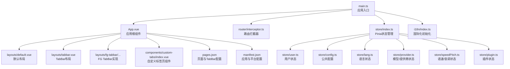
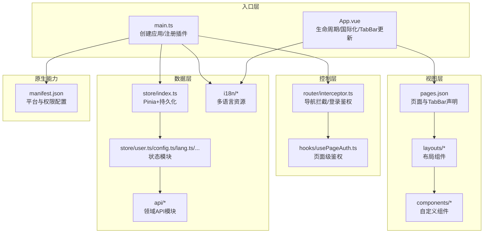
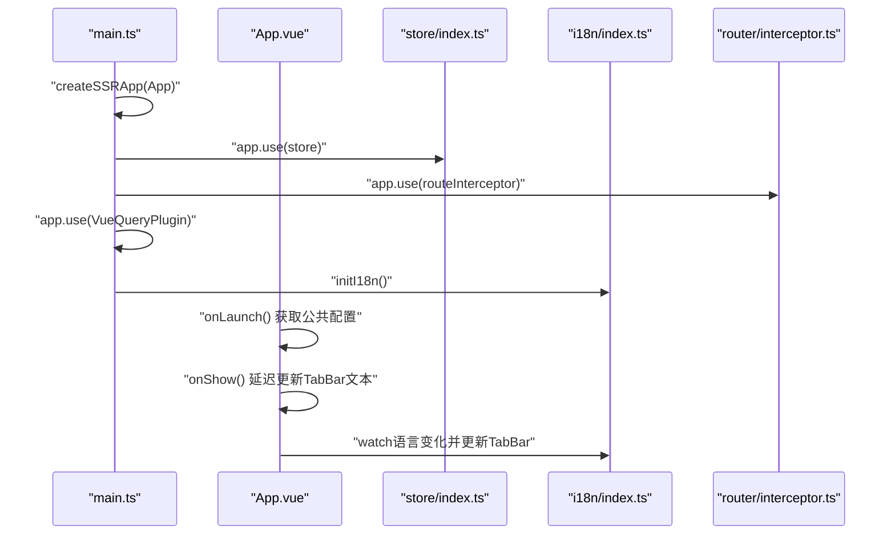
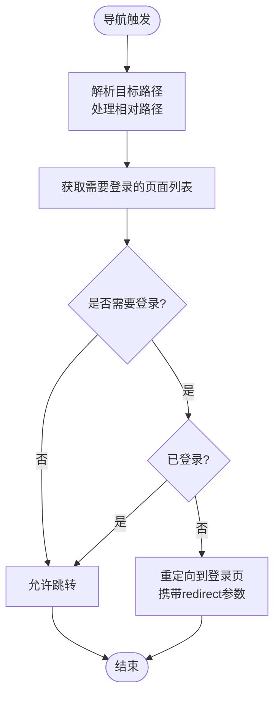
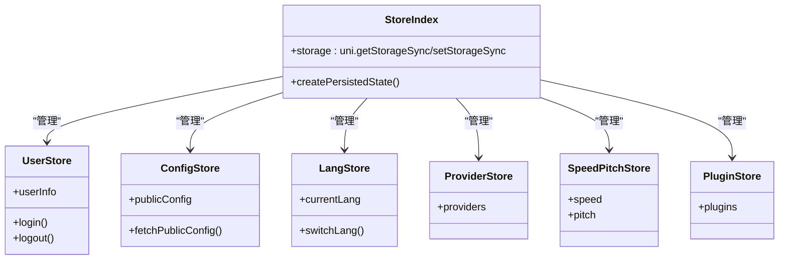
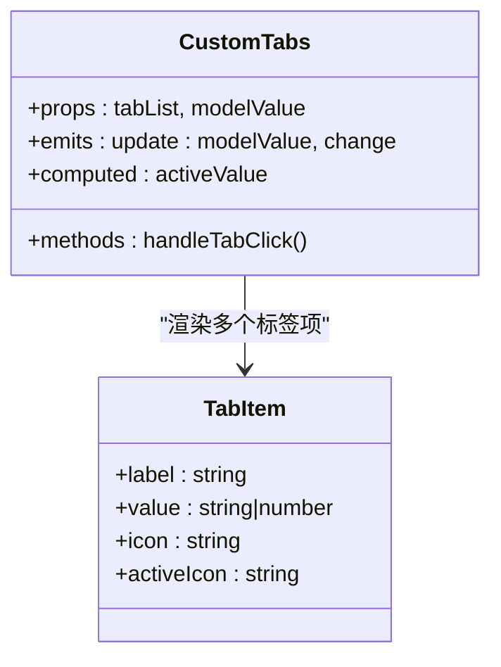
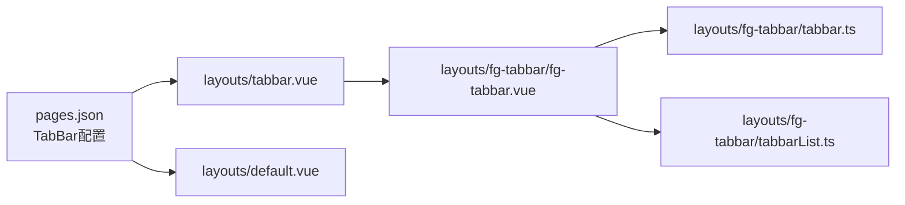
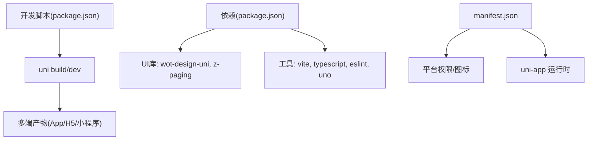

# 移动端管理界面

<cite>
**本文引用的文件**
- [main.ts](file://main/manager-mobile/src/main.ts)
- [App.vue](file://main/manager-mobile/src/App.vue)
- [package.json](file://main/manager-mobile/package.json)
- [manifest.json](file://main/manager-mobile/src/manifest.json)
- [pages.json](file://main/manager-mobile/src/pages.json)
- [interceptor.ts](file://main/manager-mobile/src/router/interceptor.ts)
- [index.ts](file://main/manager-mobile/src/store/index.ts)
- [usePageAuth.ts](file://main/manager-mobile/src/hooks/usePageAuth.ts)
- [index.vue](file://main/manager-mobile/src/components/custom-tabs/index.vue)
- [default.vue](file://main/manager-mobile/src/layouts/default.vue)
- [tabbar.vue](file://main/manager-mobile/src/layouts/tabbar.vue)
- [fg-tabbar.vue](file://main/manager-mobile/src/layouts/fg-tabbar/fg-tabbar.vue)
- [tabbar.ts](file://main/manager-mobile/src/layouts/fg-tabbar/tabbar.ts)
- [tabbarList.ts](file://main/manager-mobile/src/layouts/fg-tabbar/tabbarList.ts)
- [user.ts](file://main/manager-mobile/src/store/user.ts)
- [config.ts](file://main/manager-mobile/src/store/config.ts)
- [lang.ts](file://main/manager-mobile/src/store/lang.ts)
- [provider.ts](file://main/manager-mobile/src/store/provider.ts)
- [speedPitch.ts](file://main/manager-mobile/src/store/speedPitch.ts)
- [plugin.ts](file://main/manager-mobile/src/store/plugin.ts)
- [auth.ts](file://main/manager-mobile/src/api/auth.ts)
- [device.ts](file://main/manager-mobile/src/api/device/device.ts)
- [chat-history.ts](file://main/manager-mobile/src/api/chat-history/chat-history.ts)
- [agent.ts](file://main/manager-mobile/src/api/agent/agent.ts)
- [voiceprint.ts](file://main/manager-mobile/src/api/voiceprint/voiceprint.ts)
- [en.ts](file://main/manager-mobile/src/i18n/en.ts)
- [zh_CN.ts](file://main/manager-mobile/src/i18n/zh_CN.ts)
- [index.ts](file://main/manager-mobile/src/i18n/index.ts)
- [index.scss](file://main/manager-mobile/src/style/index.scss)
- [uni.scss](file://main/manager-mobile/src/uni.scss)
- [index.html](file://main/manager-mobile/index.html)
- [vite.config.ts](file://main/manager-mobile/vite.config.ts)
- [uno.config.ts](file://main/manager-mobile/uno.config.ts)
- [tsconfig.json](file://main/manager-mobile/tsconfig.json)
- [README.md](file://main/manager-mobile/README.md)
</cite>

## 目录
1. [简介](#简介)
2. [项目结构](#项目结构)
3. [核心组件](#核心组件)
4. [架构总览](#架构总览)
5. [详细组件分析](#详细组件分析)
6. [依赖关系分析](#依赖关系分析)
7. [性能考虑](#性能考虑)
8. [故障排查指南](#故障排查指南)
9. [结论](#结论)
10. [附录](#附录)

## 简介
本文件面向小智ESP32服务器的移动端管理界面，基于uni-app生态与Vue 3技术栈，提供跨平台（App、微信小程序、H5等）的一致体验。文档围绕以下目标展开：  
- 移动端特有的交互模式、手势与原生能力集成  
- 页面路由与组件体系设计  
- 状态管理、数据持久化与离线缓存策略  
- 响应式布局、屏幕适配与性能优化  
- UI组件库使用、自定义组件开发与样式定制  
- 多端兼容、平台差异适配与用户体验优化  
- 移动端调试、打包构建与应用发布流程  

## 项目结构
移动端管理界面位于 main/manager-mobile 目录，采用典型的uni-app工程组织方式：  
- 应用入口与全局配置：main.ts、App.vue、manifest.json、pages.json  
- 路由与拦截：router/interceptor.ts  
- 状态管理：store/（Pinia + 持久化插件）  
- 国际化：i18n/  
- 组件与布局：components/、layouts/  
- API层：api/（按模块划分）  
- 样式：style/、uni.scss  
- 构建与工具：package.json、vite.config.ts、uno.config.ts、tsconfig.json 等  

图表来源
- [main.ts:1-27](file://main/manager-mobile/src/main.ts#L1-L27)
- [App.vue:1-95](file://main/manager-mobile/src/App.vue#L1-L95)
- [interceptor.ts:1-67](file://main/manager-mobile/src/router/interceptor.ts#L1-L67)
- [index.ts:1-22](file://main/manager-mobile/src/store/index.ts#L1-L22)
- [pages.json:1-221](file://main/manager-mobile/src/pages.json#L1-L221)
- [manifest.json:1-124](file://main/manager-mobile/src/manifest.json#L1-L124)

章节来源
- [main.ts:1-27](file://main/manager-mobile/src/main.ts#L1-L27)
- [App.vue:1-95](file://main/manager-mobile/src/App.vue#L1-L95)
- [pages.json:1-221](file://main/manager-mobile/src/pages.json#L1-L221)
- [manifest.json:1-124](file://main/manager-mobile/src/manifest.json#L1-L124)

## 核心组件
- 应用入口与初始化：在入口中注册Pinia、路由拦截器、Vue Query、国际化，并注入全局样式与UnoCSS。  
- 应用根组件：负责应用生命周期钩子、动态更新TabBar文案、语言切换监听与国际化资源加载。  
- 路由拦截器：基于“黑名单”策略，对需要登录的页面进行鉴权拦截，支持相对路径解析与重定向。  
- 状态管理：基于Pinia，启用持久化插件，统一管理用户、配置、语言、模型/提供商、语速/音调、插件等状态。  
- 自定义组件：如自定义标签页组件，支持图标、激活态指示器与响应式字体大小。  
- 布局系统：提供默认布局与TabBar布局，并通过EasyCom自动扫描与第三方UI库组件集成。

章节来源
- [main.ts:14-26](file://main/manager-mobile/src/main.ts#L14-L26)
- [App.vue:15-74](file://main/manager-mobile/src/App.vue#L15-L74)
- [interceptor.ts:21-57](file://main/manager-mobile/src/router/interceptor.ts#L21-L57)
- [index.ts:4-12](file://main/manager-mobile/src/store/index.ts#L4-L12)
- [index.vue:1-132](file://main/manager-mobile/src/components/custom-tabs/index.vue#L1-L132)

## 架构总览
移动端管理界面采用“入口初始化 → 全局布局/拦截 → 模块化页面 → 状态持久化”的分层架构。  
- 入口层：创建SSR应用实例，挂载全局插件与国际化。  
- 控制层：路由拦截器统一处理导航安全；页面级鉴权Hook在页面加载时校验登录状态。  
- 视图层：基于pages.json声明页面与TabBar；EasyCom自动引入组件；布局组件提供统一容器。  
- 数据层：Pinia状态树 + 持久化插件；API模块按领域拆分；国际化多语言资源集中管理。  
- 原生能力：通过manifest.json声明权限与平台配置，结合uni-API实现跨端能力。

图表来源
- [main.ts:14-26](file://main/manager-mobile/src/main.ts#L14-L26)
- [App.vue:15-74](file://main/manager-mobile/src/App.vue#L15-L74)
- [interceptor.ts:59-66](file://main/manager-mobile/src/router/interceptor.ts#L59-L66)
- [usePageAuth.ts:12-50](file://main/manager-mobile/src/hooks/usePageAuth.ts#L12-L50)
- [pages.json:17-53](file://main/manager-mobile/src/pages.json#L17-L53)
- [index.ts:4-12](file://main/manager-mobile/src/store/index.ts#L4-L12)
- [manifest.json:8-85](file://main/manager-mobile/src/manifest.json#L8-L85)

## 详细组件分析

### 应用入口与初始化
- 创建SSR应用实例并挂载全局插件：Pinia、路由拦截器、Vue Query、国际化初始化。  
- 注入全局样式与UnoCSS，确保主题与原子化样式一致。  
- 在App.vue中监听应用生命周期，动态更新TabBar文案并监听语言切换事件。

图表来源
- [main.ts:14-26](file://main/manager-mobile/src/main.ts#L14-L26)
- [App.vue:15-74](file://main/manager-mobile/src/App.vue#L15-L74)
- [index.ts:4-12](file://main/manager-mobile/src/store/index.ts#L4-L12)
- [interceptor.ts:59-66](file://main/manager-mobile/src/router/interceptor.ts#L59-L66)

章节来源
- [main.ts:14-26](file://main/manager-mobile/src/main.ts#L14-L26)
- [App.vue:15-74](file://main/manager-mobile/src/App.vue#L15-L74)

### 路由拦截与页面鉴权
- 黑名单策略：除特定页面外，其余页面无需登录即可访问。  
- 支持相对路径解析，兼容不同平台的路由格式。  
- 页面级鉴权Hook在页面加载时检查登录状态，未登录则重定向至登录页并携带redirect参数。

图表来源
- [interceptor.ts:24-56](file://main/manager-mobile/src/router/interceptor.ts#L24-L56)
- [usePageAuth.ts:13-49](file://main/manager-mobile/src/hooks/usePageAuth.ts#L13-L49)

章节来源
- [interceptor.ts:21-57](file://main/manager-mobile/src/router/interceptor.ts#L21-L57)
- [usePageAuth.ts:12-50](file://main/manager-mobile/src/hooks/usePageAuth.ts#L12-L50)

### 状态管理与持久化
- Pinia作为状态中心，启用持久化插件，存储实现基于uni的本地存储API。  
- 状态模块包括：用户信息、公共配置、语言、模型/提供商、语速/音调、插件等。  
- 通过模块化导出，便于在页面与组件中按需导入使用。

图表来源
- [index.ts:4-12](file://main/manager-mobile/src/store/index.ts#L4-L12)
- [user.ts](file://main/manager-mobile/src/store/user.ts)
- [config.ts](file://main/manager-mobile/src/store/config.ts)
- [lang.ts](file://main/manager-mobile/src/store/lang.ts)
- [provider.ts](file://main/manager-mobile/src/store/provider.ts)
- [speedPitch.ts](file://main/manager-mobile/src/store/speedPitch.ts)
- [plugin.ts](file://main/manager-mobile/src/store/plugin.ts)

章节来源
- [index.ts:4-12](file://main/manager-mobile/src/store/index.ts#L4-L12)

### 自定义组件：自定义标签页
- 支持传入标签列表、双向绑定值与变更事件。  
- 激活态显示图标与指示条，非激活态显示普通图标与文字。  
- 响应式适配：在窄屏下调整图标与字号，保证可读性与点击面积。

图表来源
- [index.vue:1-132](file://main/manager-mobile/src/components/custom-tabs/index.vue#L1-L132)

章节来源
- [index.vue:1-132](file://main/manager-mobile/src/components/custom-tabs/index.vue#L1-L132)

### 布局系统：TabBar与默认布局
- 默认布局与TabBar布局分别用于不同页面类型，TabBar布局内置底部导航。  
- FG TabBar提供更丰富的TabBar实现，包含TabBar配置与列表管理。  
- pages.json中声明TabBar图标、标题与页面路径，支持自定义样式与字体大小。

图表来源
- [pages.json:17-53](file://main/manager-mobile/src/pages.json#L17-L53)
- [tabbar.vue](file://main/manager-mobile/src/layouts/tabbar.vue)
- [default.vue](file://main/manager-mobile/src/layouts/default.vue)
- [fg-tabbar.vue](file://main/manager-mobile/src/layouts/fg-tabbar/fg-tabbar.vue)
- [tabbar.ts](file://main/manager-mobile/src/layouts/fg-tabbar/tabbar.ts)
- [tabbarList.ts](file://main/manager-mobile/src/layouts/fg-tabbar/tabbarList.ts)

章节来源
- [pages.json:17-53](file://main/manager-mobile/src/pages.json#L17-L53)

### 国际化与多端适配
- i18n模块集中管理英文与简体中文资源，支持按需切换语言。  
- App.vue监听语言变化，动态更新TabBar文本，确保多语言一致性。  
- manifest.json中针对不同平台（App、微信小程序等）配置权限与图标资源，满足多端发布需求。

章节来源
- [en.ts](file://main/manager-mobile/src/i18n/en.ts)
- [zh_CN.ts](file://main/manager-mobile/src/i18n/zh_CN.ts)
- [index.ts](file://main/manager-mobile/src/i18n/index.ts)
- [App.vue:66-74](file://main/manager-mobile/src/App.vue#L66-L74)
- [manifest.json:8-124](file://main/manager-mobile/src/manifest.json#L8-L124)

### API模块与数据流
- API模块按领域拆分：认证、设备、聊天历史、智能体、声纹等。  
- 结合Alova或uni的网络请求能力，统一处理错误与重试策略。  
- 通过Pinia状态与Vue Query实现数据缓存与刷新，提升移动端交互流畅度。

章节来源
- [auth.ts](file://main/manager-mobile/src/api/auth.ts)
- [device.ts](file://main/manager-mobile/src/api/device/device.ts)
- [chat-history.ts](file://main/manager-mobile/src/api/chat-history/chat-history.ts)
- [agent.ts](file://main/manager-mobile/src/api/agent/agent.ts)
- [voiceprint.ts](file://main/manager-mobile/src/api/voiceprint/voiceprint.ts)

## 依赖关系分析
- 构建与运行：基于Vite与uni-app CLI，支持多端开发与构建。  
- 依赖管理：使用pnpm，统一版本与脚本命令，覆盖App、H5、微信小程序等多端。  
- UI与工具：Wot Design Uni、z-paging、UnoCSS、ESLint、TypeScript等。  
- 原生能力：通过manifest.json声明Android/iOS权限与图标资源，结合uni-API实现跨端能力。

图表来源
- [package.json:26-76](file://main/manager-mobile/package.json#L26-L76)
- [package.json:77-107](file://main/manager-mobile/package.json#L77-L107)
- [manifest.json:8-85](file://main/manager-mobile/src/manifest.json#L8-L85)

章节来源
- [package.json:26-76](file://main/manager-mobile/package.json#L26-L76)
- [package.json:77-107](file://main/manager-mobile/package.json#L77-L107)

## 性能考虑
- 状态持久化：Pinia持久化插件减少重复请求与登录态丢失带来的重载成本。  
- 组件懒加载与分包：pages.json中的分包配置有助于减小主包体积，提升首屏加载速度。  
- 样式与资源：UnoCSS原子化样式减少CSS体积；静态资源按需引入，避免冗余。  
- 网络缓存：结合Vue Query与API模块，合理设置缓存策略与失效时间，降低移动端流量消耗。  
- 屏幕适配：自定义组件与布局使用rpx单位与媒体查询，适配不同屏幕密度与尺寸。  
- 构建优化：Vite与Rollup可视化分析工具可用于识别大体积依赖与重复打包问题。

## 故障排查指南
- 登录拦截异常：检查路由拦截器中的黑名单页面列表与当前页面路径匹配逻辑，确认相对路径解析是否正确。  
- 语言切换无效：确认App.vue中语言监听与TabBar文本更新逻辑是否生效，以及i18n资源是否正确初始化。  
- TabBar图标不显示：核对pages.json中的图标路径与实际资源是否存在，确认图标格式与尺寸符合平台要求。  
- 多端权限问题：检查manifest.json中各平台权限声明，特别是Android权限与iOS隐私描述。  
- 构建失败：查看package.json脚本与依赖版本，确保Node与pnpm版本满足要求；清理node_modules与缓存后重试。

章节来源
- [interceptor.ts:24-56](file://main/manager-mobile/src/router/interceptor.ts#L24-L56)
- [App.vue:31-74](file://main/manager-mobile/src/App.vue#L31-L74)
- [pages.json:17-53](file://main/manager-mobile/src/pages.json#L17-L53)
- [manifest.json:20-80](file://main/manager-mobile/src/manifest.json#L20-L80)
- [package.json:22-25](file://main/manager-mobile/package.json#L22-L25)

## 结论
该移动端管理界面以uni-app为核心，结合Pinia状态管理、路由拦截与国际化机制，构建了跨平台、可扩展且具备良好用户体验的管理后台。通过模块化的API设计、自定义组件与布局系统，以及完善的多端适配与性能优化策略，能够有效支撑小智ESP32服务器的移动端运维与配置场景。

## 附录
- 开发与构建：参考package.json中的脚本命令，选择对应平台进行开发与构建。  
- 配置文件：pages.json与manifest.json是页面与平台配置的关键入口，修改前请备份。  
- 样式规范：统一使用rpx与UnoCSS原子类，保持跨端一致性与可维护性。  
- 发布流程：根据目标平台准备证书与权限，遵循各平台审核规范完成上架。