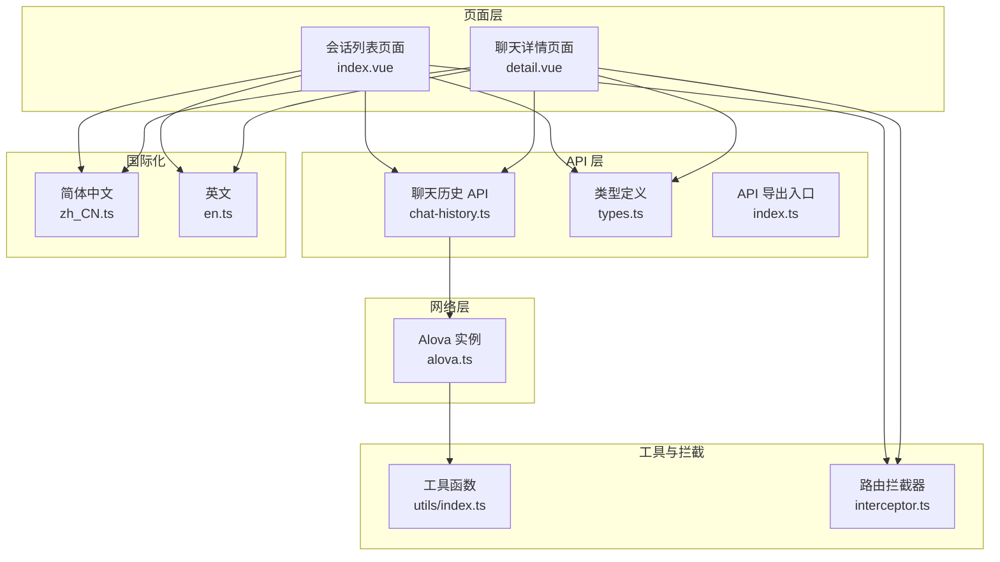
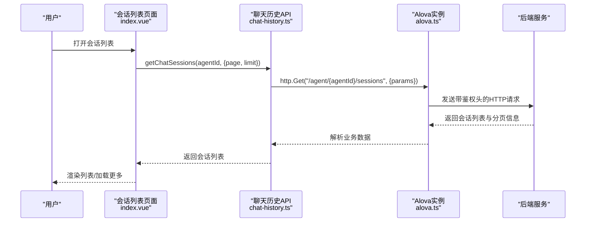
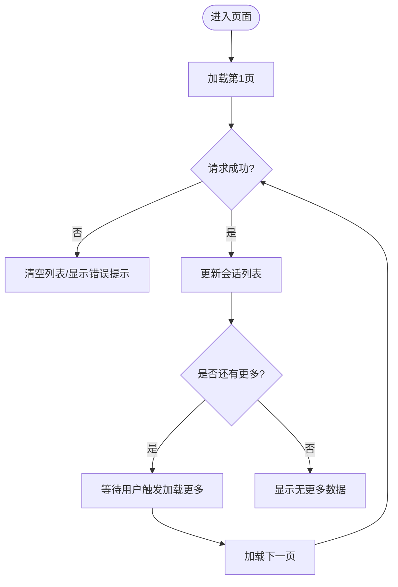
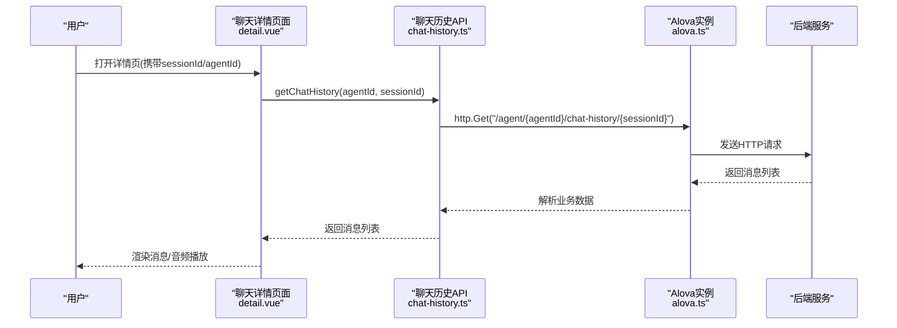
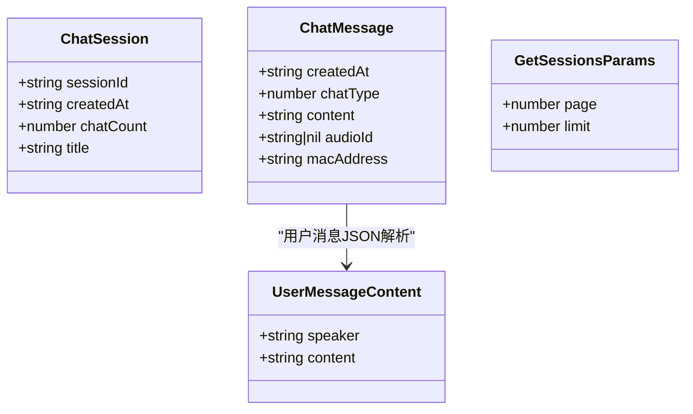
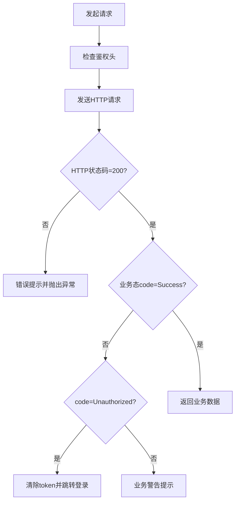
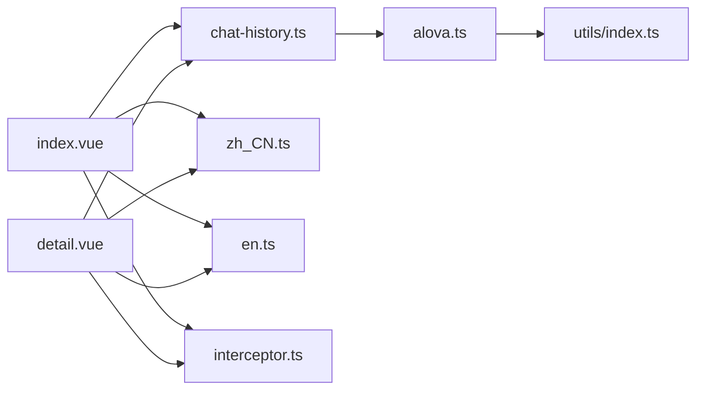

# 移动端聊天历史

<cite>
**本文引用的文件**
- [index.vue](file://main/manager-mobile/src/pages/chat-history/index.vue)
- [detail.vue](file://main/manager-mobile/src/pages/chat-history/detail.vue)
- [chat-history.ts](file://main/manager-mobile/src/api/chat-history/chat-history.ts)
- [types.ts](file://main/manager-mobile/src/api/chat-history/types.ts)
- [alova.ts](file://main/manager-mobile/src/http/request/alova.ts)
- [zh_CN.ts](file://main/manager-mobile/src/i18n/zh_CN.ts)
- [en.ts](file://main/manager-mobile/src/i18n/en.ts)
- [index.ts](file://main/manager-mobile/src/api/chat-history/index.ts)
- [utils/index.ts](file://main/manager-mobile/src/utils/index.ts)
- [interceptor.ts](file://main/manager-mobile/src/router/interceptor.ts)
</cite>

## 目录
1. [简介](#简介)
2. [项目结构](#项目结构)
3. [核心组件](#核心组件)
4. [架构总览](#架构总览)
5. [详细组件分析](#详细组件分析)
6. [依赖关系分析](#依赖关系分析)
7. [性能考量](#性能考量)
8. [故障排查指南](#故障排查指南)
9. [结论](#结论)
10. [附录](#附录)

## 简介
本文件面向移动端“聊天历史”功能，系统性梳理从会话列表到聊天详情、从数据结构到分页加载、从消息类型识别到音频播放、从国际化到网络层封装的完整实现。重点覆盖移动端交互设计、滑动与手势支持、消息状态与离线处理、以及性能优化与用户体验提升策略。

## 项目结构
移动端聊天历史功能主要位于 manager-mobile 的 pages/chat-history 目录，配合 API 层、国际化、HTTP 请求封装与路由拦截器共同构成完整链路。

**图表来源**
- [index.vue:1-411](file://main/manager-mobile/src/pages/chat-history/index.vue#L1-L411)
- [detail.vue:1-501](file://main/manager-mobile/src/pages/chat-history/detail.vue#L1-L501)
- [chat-history.ts:1-64](file://main/manager-mobile/src/api/chat-history/chat-history.ts#L1-L64)
- [types.ts:1-40](file://main/manager-mobile/src/api/chat-history/types.ts#L1-L40)
- [alova.ts:1-152](file://main/manager-mobile/src/http/request/alova.ts#L1-L152)
- [zh_CN.ts:175-200](file://main/manager-mobile/src/i18n/zh_CN.ts#L175-L200)
- [en.ts:175-200](file://main/manager-mobile/src/i18n/en.ts#L175-L200)
- [utils/index.ts:133-167](file://main/manager-mobile/src/utils/index.ts#L133-L167)
- [interceptor.ts:1-67](file://main/manager-mobile/src/router/interceptor.ts#L1-L67)

**章节来源**
- [index.vue:1-411](file://main/manager-mobile/src/pages/chat-history/index.vue#L1-L411)
- [detail.vue:1-501](file://main/manager-mobile/src/pages/chat-history/detail.vue#L1-L501)
- [chat-history.ts:1-64](file://main/manager-mobile/src/api/chat-history/chat-history.ts#L1-L64)
- [types.ts:1-40](file://main/manager-mobile/src/api/chat-history/types.ts#L1-L40)
- [alova.ts:1-152](file://main/manager-mobile/src/http/request/alova.ts#L1-L152)
- [zh_CN.ts:175-200](file://main/manager-mobile/src/i18n/zh_CN.ts#L175-L200)
- [en.ts:175-200](file://main/manager-mobile/src/i18n/en.ts#L175-L200)
- [utils/index.ts:133-167](file://main/manager-mobile/src/utils/index.ts#L133-L167)
- [interceptor.ts:1-67](file://main/manager-mobile/src/router/interceptor.ts#L1-L67)

## 核心组件
- 会话列表页面：负责加载与展示聊天会话，支持分页加载与“加载更多”，并提供刷新能力。
- 聊天详情页面：负责渲染消息列表，支持用户/AI/工具结果三类消息类型，支持音频播放与工具结果展开/折叠。
- API 层：封装会话列表、聊天历史、音频下载等接口调用，并设置缓存策略与元信息。
- 类型定义：统一会话与消息的数据结构，明确字段含义与取值范围。
- 网络层：基于 Alova 的请求实例，统一鉴权、语言头、超时、错误处理与业务态校验。
- 国际化：提供中英双语文案，覆盖时间格式化、空状态、错误提示等。
- 工具与拦截：提供运行时服务端地址覆盖、路由拦截与登录控制。

**章节来源**
- [index.vue:42-188](file://main/manager-mobile/src/pages/chat-history/index.vue#L42-L188)
- [detail.vue:45-306](file://main/manager-mobile/src/pages/chat-history/detail.vue#L45-L306)
- [chat-history.ts:13-63](file://main/manager-mobile/src/api/chat-history/chat-history.ts#L13-L63)
- [types.ts:2-39](file://main/manager-mobile/src/api/chat-history/types.ts#L2-L39)
- [alova.ts:49-149](file://main/manager-mobile/src/http/request/alova.ts#L49-L149)
- [zh_CN.ts:175-200](file://main/manager-mobile/src/i18n/zh_CN.ts#L175-L200)
- [en.ts:175-200](file://main/manager-mobile/src/i18n/en.ts#L175-L200)
- [utils/index.ts:133-167](file://main/manager-mobile/src/utils/index.ts#L133-L167)
- [interceptor.ts:21-56](file://main/manager-mobile/src/router/interceptor.ts#L21-L56)

## 架构总览
移动端聊天历史采用“页面层-接口层-网络层-工具层”的分层架构，页面通过 API 层发起请求，网络层统一处理鉴权与错误，工具层提供运行时配置与路由保护。

**图表来源**
- [index.vue:56-101](file://main/manager-mobile/src/pages/chat-history/index.vue#L56-L101)
- [chat-history.ts:13-24](file://main/manager-mobile/src/api/chat-history/chat-history.ts#L13-L24)
- [alova.ts:55-149](file://main/manager-mobile/src/http/request/alova.ts#L55-L149)

## 详细组件分析

### 会话列表页面（index.vue）
- 数据结构与分页
  - 使用响应式列表与分页变量，支持第一页加载与后续“加载更多”。
  - 通过接口返回的 list 长度与 pageSize 判断是否还有更多数据。
- 交互与渲染
  - 支持点击进入详情页，携带 sessionId 与 agentId。
  - 提供刷新与加载更多暴露方法，便于父组件或容器统一调度。
- 时间格式化
  - 支持“刚刚/分钟前/小时前/天前/具体日期”等本地化文案。
- 安全区域适配
  - 在不同平台（如微信小程序）读取安全区域信息，保证 UI 正确显示。
- 空状态与加载状态
  - 无数据时展示空状态；加载中显示加载指示与文案。

**图表来源**
- [index.vue:56-101](file://main/manager-mobile/src/pages/chat-history/index.vue#L56-L101)

**章节来源**
- [index.vue:42-188](file://main/manager-mobile/src/pages/chat-history/index.vue#L42-L188)
- [types.ts:2-13](file://main/manager-mobile/src/api/chat-history/types.ts#L2-L13)

### 聊天详情页面（detail.vue）
- 消息类型识别与内容提取
  - chatType=1 为用户消息，需解析 content 中的 JSON，提取 speaker 与 content。
  - chatType=2 为 AI 消息，直接显示 content。
  - chatType=3 为工具结果消息，按数组结构渲染文本与工具调用信息。
- 工具结果展开/折叠
  - 通过索引组合键记录展开状态，默认折叠长文本，点击箭头切换。
- 音频播放
  - 通过 getAudioId 获取下载ID，拼接播放地址，使用 InnerAudioContext 播放。
  - 防抖处理避免重复点击导致的并发播放。
  - 播放结束与错误回调中清理资源，避免内存泄漏。
- 滚动与手势
  - 使用 scroll-view 支持纵向滚动，自动滚动至最新消息。
  - 通过安全区域高度适配不同机型状态栏。
- 时间格式化与本地化
  - 与会话列表一致的时间格式化策略，支持多语言文案。

**图表来源**
- [detail.vue:72-90](file://main/manager-mobile/src/pages/chat-history/detail.vue#L72-L90)
- [chat-history.ts:31-41](file://main/manager-mobile/src/api/chat-history/chat-history.ts#L31-L41)
- [alova.ts:102-149](file://main/manager-mobile/src/http/request/alova.ts#L102-L149)

**章节来源**
- [detail.vue:45-306](file://main/manager-mobile/src/pages/chat-history/detail.vue#L45-L306)
- [types.ts:15-29](file://main/manager-mobile/src/api/chat-history/types.ts#L15-L29)

### API 层与类型定义
- 接口定义
  - getChatSessions：分页获取会话列表。
  - getChatHistory：获取指定会话的消息明细。
  - getAudioId：获取音频下载ID。
- 缓存与元信息
  - 会话列表设置 cacheFor.expire=0，避免缓存污染。
  - 详情页设置 cacheFor.expire=-1，按需缓存。
  - meta.ignoreAuth=false，确保鉴权头生效。
- 类型约束
  - ChatSession：会话标识、创建时间、消息总数、标题。
  - ChatMessage：消息创建时间、消息类型、内容、音频ID、设备MAC。
  - GetSessionsParams：分页参数 page/limit。
  - UserMessageContent：用户消息 JSON 结构。

**图表来源**
- [types.ts:2-39](file://main/manager-mobile/src/api/chat-history/types.ts#L2-L39)

**章节来源**
- [chat-history.ts:13-63](file://main/manager-mobile/src/api/chat-history/chat-history.ts#L13-L63)
- [types.ts:1-40](file://main/manager-mobile/src/api/chat-history/types.ts#L1-L40)

### 网络层与路由拦截
- Alova 实例
  - 统一设置 baseURL、Content-Type、Accept-language。
  - beforeRequest 中注入鉴权头，动态域名与协议校验。
  - responded 中处理 HTTP 状态码与业务态，统一错误提示与登出。
- 路由拦截
  - 对需要登录的页面进行拦截，未登录跳转登录页并保留重定向地址。

**图表来源**
- [alova.ts:55-149](file://main/manager-mobile/src/http/request/alova.ts#L55-L149)
- [interceptor.ts:21-56](file://main/manager-mobile/src/router/interceptor.ts#L21-L56)

**章节来源**
- [alova.ts:49-149](file://main/manager-mobile/src/http/request/alova.ts#L49-L149)
- [interceptor.ts:1-67](file://main/manager-mobile/src/router/interceptor.ts#L1-L67)

## 依赖关系分析
- 页面依赖 API 层，API 层依赖网络层实例。
- 页面与国际化模块解耦，通过 t 函数读取文案。
- 工具函数提供运行时服务端地址覆盖，影响网络层 baseURL。
- 路由拦截器保障登录态与页面访问控制。

**图表来源**
- [index.vue:1-10](file://main/manager-mobile/src/pages/chat-history/index.vue#L1-L10)
- [detail.vue:1-18](file://main/manager-mobile/src/pages/chat-history/detail.vue#L1-L18)
- [chat-history.ts:1-6](file://main/manager-mobile/src/api/chat-history/chat-history.ts#L1-L6)
- [alova.ts:1-11](file://main/manager-mobile/src/http/request/alova.ts#L1-L11)
- [zh_CN.ts:175-200](file://main/manager-mobile/src/i18n/zh_CN.ts#L175-L200)
- [en.ts:175-200](file://main/manager-mobile/src/i18n/en.ts#L175-L200)
- [utils/index.ts:133-167](file://main/manager-mobile/src/utils/index.ts#L133-L167)
- [interceptor.ts:1-67](file://main/manager-mobile/src/router/interceptor.ts#L1-L67)

**章节来源**
- [index.vue:1-10](file://main/manager-mobile/src/pages/chat-history/index.vue#L1-L10)
- [detail.vue:1-18](file://main/manager-mobile/src/pages/chat-history/detail.vue#L1-L18)
- [chat-history.ts:1-6](file://main/manager-mobile/src/api/chat-history/chat-history.ts#L1-L6)
- [alova.ts:1-11](file://main/manager-mobile/src/http/request/alova.ts#L1-L11)
- [utils/index.ts:133-167](file://main/manager-mobile/src/utils/index.ts#L133-L167)
- [interceptor.ts:1-67](file://main/manager-mobile/src/router/interceptor.ts#L1-L67)

## 性能考量
- 分页加载与无限滚动
  - 会话列表采用固定页大小，按需加载下一页，避免一次性拉取大量数据。
  - 详情页使用 scroll-view 并自动滚动至最新消息，减少首屏渲染压力。
- 缓存策略
  - 会话列表禁用缓存，确保数据实时性；详情页按需缓存，降低重复请求。
- 资源释放
  - 音频播放结束后销毁 InnerAudioContext，避免内存泄漏。
- 网络优化
  - 统一超时时间与错误处理，减少异常分支对 UI 的影响。
- 本地化与渲染
  - 文案集中管理，减少模板内硬编码；时间格式化统一处理，避免重复计算。

[本节为通用性能建议，无需特定文件引用]

## 故障排查指南
- 会话列表为空或加载失败
  - 检查 agentId 是否有效；确认鉴权头是否注入；查看 responded 中业务态与错误提示。
- 详情页参数缺失
  - 确认路由参数 sessionId/agentId 是否正确传递；页面 onLoad 中进行参数校验。
- 音频播放异常
  - 检查 getAudioId 返回值与播放地址拼接；确认 InnerAudioContext 生命周期与错误回调。
- 登录态问题
  - 路由拦截器会将未登录用户重定向至登录页；检查鉴权头与 token 存储。
- 服务端地址问题
  - 运行时可覆盖 baseURL，确保协议与域名匹配；避免 HTTPS 页面请求 HTTP 地址。

**章节来源**
- [index.vue:56-101](file://main/manager-mobile/src/pages/chat-history/index.vue#L56-L101)
- [detail.vue:72-90](file://main/manager-mobile/src/pages/chat-history/detail.vue#L72-L90)
- [alova.ts:55-149](file://main/manager-mobile/src/http/request/alova.ts#L55-L149)
- [interceptor.ts:21-56](file://main/manager-mobile/src/router/interceptor.ts#L21-L56)
- [utils/index.ts:133-167](file://main/manager-mobile/src/utils/index.ts#L133-L167)

## 结论
移动端聊天历史功能通过清晰的分层设计实现了从会话列表到聊天详情的完整链路，结合统一的网络层与国际化支持，具备良好的可维护性与扩展性。未来可在搜索/筛选/导出、消息状态与离线同步、以及更细粒度的性能优化方面持续演进。

[本节为总结性内容，无需特定文件引用]

## 附录
- 使用指南（概念性说明）
  - 列表查看：打开智能体页面，进入“聊天记录”，浏览会话列表，点击进入详情。
  - 详情查看：在详情页可查看消息时间线、工具调用与结果、音频播放。
  - 搜索/筛选/导出：当前实现未包含搜索与导出功能，如需可在现有 API 基础上扩展查询参数与导出接口。
  - 离线与同步：当前未见离线消息持久化与后台同步逻辑，建议在消息队列与本地缓存层面补充。

[本节为概念性内容，无需特定文件引用]