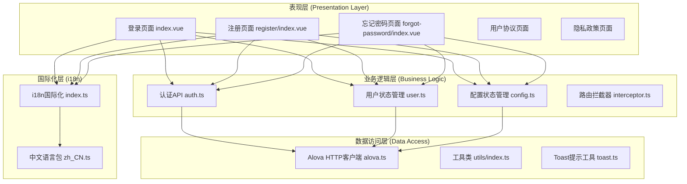
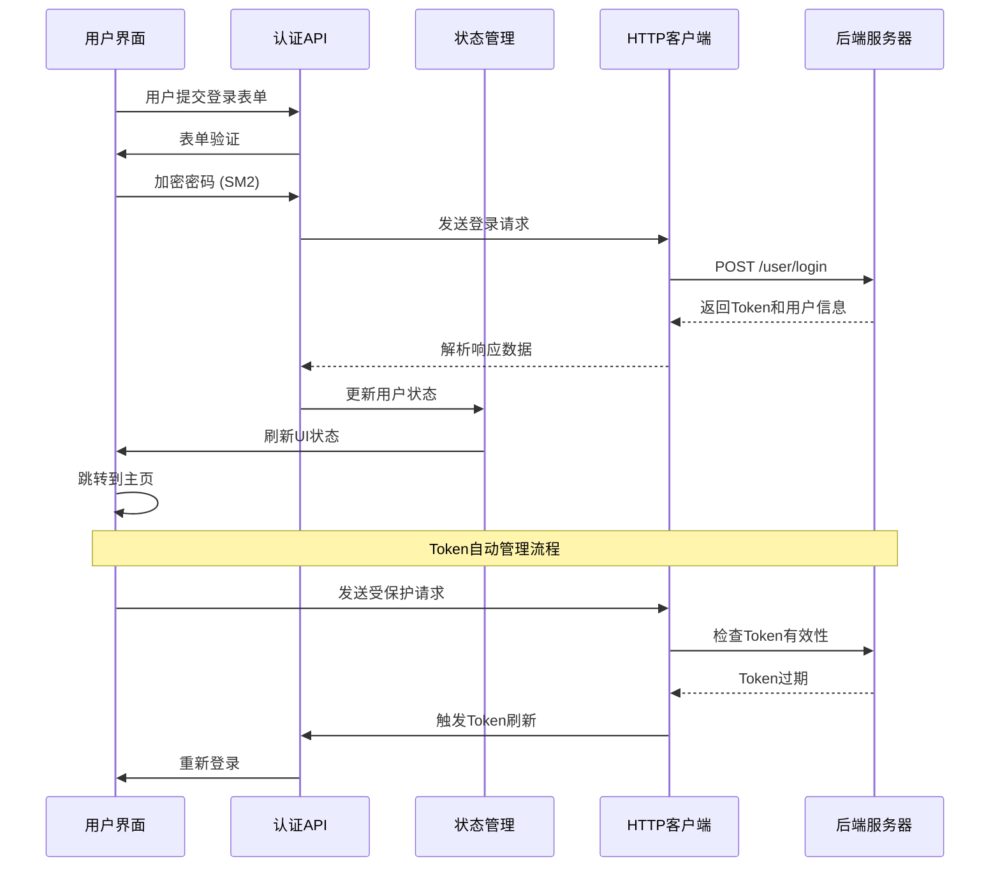
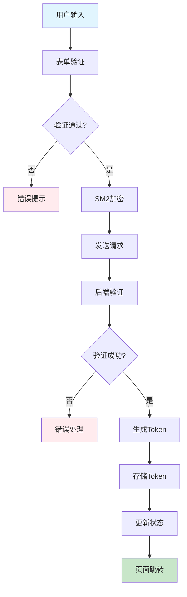
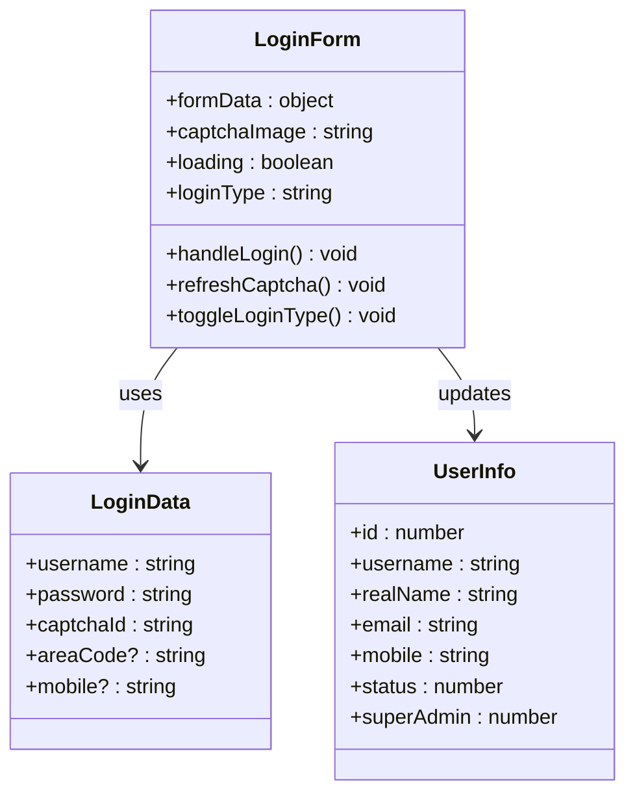
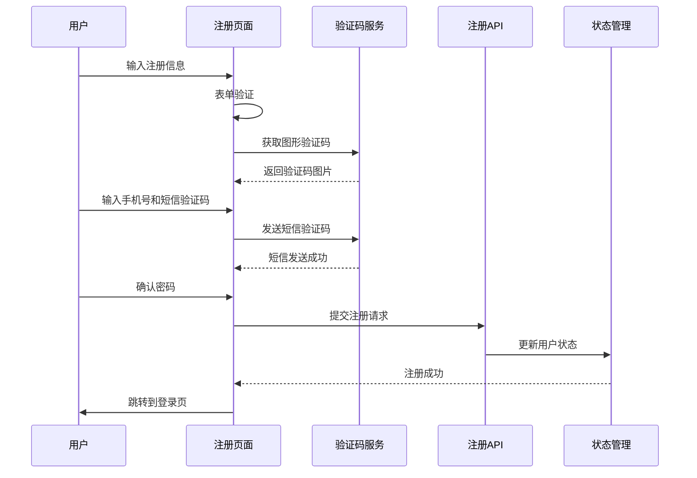
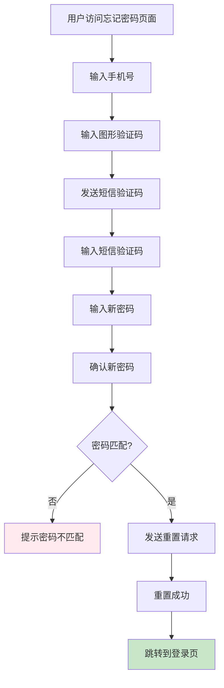
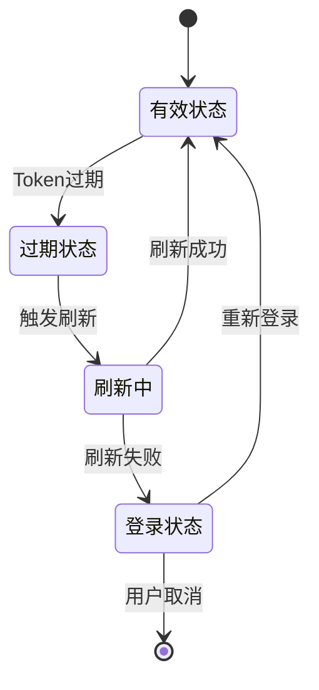
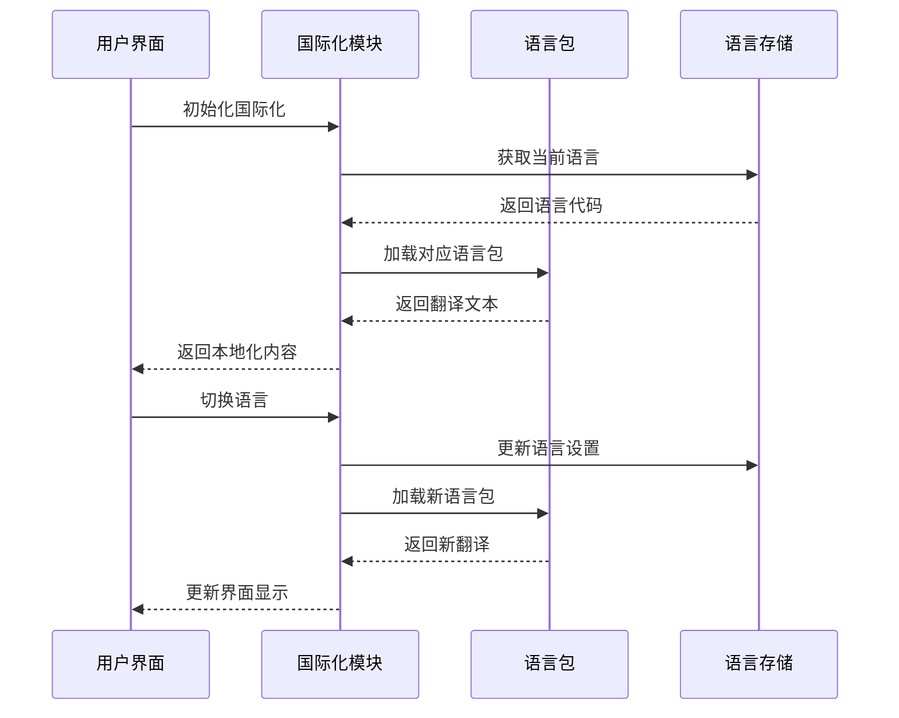
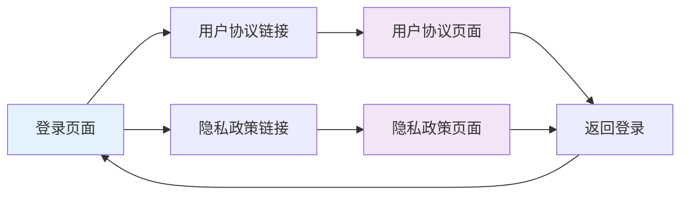
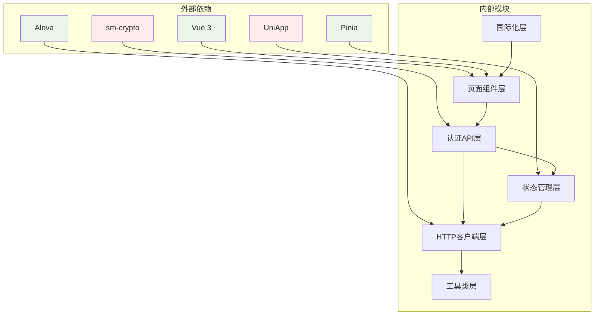

# 移动端认证模块

<cite>
**本文档引用的文件**
- [auth.ts](file://main/manager-mobile/src/api/auth.ts)
- [user.ts](file://main/manager-mobile/src/store/user.ts)
- [config.ts](file://main/manager-mobile/src/store/config.ts)
- [index.vue](file://main/manager-mobile/src/pages/login/index.vue)
- [register/index.vue](file://main/manager-mobile/src/pages/register/index.vue)
- [forgot-password/index.vue](file://main/manager-mobile/src/pages/forgot-password/index.vue)
- [alova.ts](file://main/manager-mobile/src/http/request/alova.ts)
- [interceptor.ts](file://main/manager-mobile/src/router/interceptor.ts)
- [index.ts](file://main/manager-mobile/src/i18n/index.ts)
- [zh_CN.ts](file://main/manager-mobile/src/i18n/zh_CN.ts)
- [user-agreement-zh.vue](file://main/manager-mobile/src/pages/login/user-agreement-zh.vue)
- [privacy-policy-zh.vue](file://main/manager-mobile/src/pages/login/privacy-policy-zh.vue)
- [index.ts](file://main/manager-mobile/src/utils/index.ts)
- [toast.ts](file://main/manager-mobile/src/utils/toast.ts)
</cite>

## 目录
1. [简介](#简介)
2. [项目结构](#项目结构)
3. [核心组件](#核心组件)
4. [架构概览](#架构概览)
5. [详细组件分析](#详细组件分析)
6. [依赖关系分析](#依赖关系分析)
7. [性能考虑](#性能考虑)
8. [故障排除指南](#故障排除指南)
9. [结论](#结论)

## 简介

移动端认证模块是小智ESP32服务器项目的核心安全组件，负责管理用户的登录、注册、密码找回等认证流程。该模块采用现代化的前端架构，结合Pinia状态管理、Alova HTTP客户端和UniApp跨平台框架，实现了完整的移动端认证解决方案。

本模块的主要特性包括：
- 支持用户名/密码和手机号双重登录方式
- 基于SM2国密算法的密码加密传输
- 多语言国际化支持
- 完整的用户协议和隐私政策展示
- 安全的Token管理和会话保持
- 丰富的表单验证和错误处理机制

## 项目结构

移动端认证模块采用清晰的分层架构，主要包含以下几个核心层次：

**图表来源**
- [index.vue:1-800](file://main/manager-mobile/src/pages/login/index.vue#L1-L800)
- [auth.ts:1-144](file://main/manager-mobile/src/api/auth.ts#L1-L144)
- [user.ts:1-83](file://main/manager-mobile/src/store/user.ts#L1-L83)

**章节来源**
- [index.vue:1-800](file://main/manager-mobile/src/pages/login/index.vue#L1-L800)
- [auth.ts:1-144](file://main/manager-mobile/src/api/auth.ts#L1-L144)
- [user.ts:1-83](file://main/manager-mobile/src/store/user.ts#L1-L83)

## 核心组件

### 认证API接口

认证模块通过专门的API接口文件管理所有认证相关的HTTP请求：

| 接口类型 | 方法名 | 功能描述 | 参数类型 |
|---------|--------|----------|----------|
| 登录 | `login(data: LoginData)` | 用户登录认证 | LoginData |
| 注册 | `register(data: RegisterData)` | 用户注册 | RegisterData |
| 忘记密码 | `retrievePassword(data: ForgotPasswordData)` | 密码找回 | ForgotPasswordData |
| 用户信息 | `getUserInfo()` | 获取用户信息 | 无 |
| 公共配置 | `getPublicConfig()` | 获取系统配置 | 无 |
| 验证码 | `getCaptcha(uuid: string)` | 获取图形验证码 | string |
| 短信验证码 | `sendSmsCode(data: SMSData)` | 发送短信验证码 | SMSData |

### 状态管理

系统采用Pinia进行状态管理，主要包括三个核心Store：

1. **用户状态管理 (user.ts)**：管理用户登录状态、个人信息和头像
2. **配置状态管理 (config.ts)**：管理系统配置信息和SM2公钥
3. **插件状态管理 (plugin.ts)**：管理智能体插件配置

### HTTP客户端

基于Alova的HTTP客户端提供了完整的请求/响应处理机制：

- 自动Token管理
- 错误处理和重试机制
- 响应数据格式化
- 超时控制和超时处理

**章节来源**
- [auth.ts:1-144](file://main/manager-mobile/src/api/auth.ts#L1-L144)
- [user.ts:1-83](file://main/manager-mobile/src/store/user.ts#L1-L83)
- [config.ts:1-67](file://main/manager-mobile/src/store/config.ts#L1-L67)
- [alova.ts:1-152](file://main/manager-mobile/src/http/request/alova.ts#L1-L152)

## 架构概览

移动端认证模块采用分层架构设计，确保了良好的可维护性和扩展性：

**图表来源**
- [index.vue:160-250](file://main/manager-mobile/src/pages/login/index.vue#L160-L250)
- [alova.ts:25-44](file://main/manager-mobile/src/http/request/alova.ts#L25-L44)
- [user.ts:44-62](file://main/manager-mobile/src/store/user.ts#L44-L62)

### 安全架构

系统实现了多层次的安全保护机制：

**图表来源**
- [index.vue:160-250](file://main/manager-mobile/src/pages/login/index.vue#L160-L250)
- [auth.ts:37-44](file://main/manager-mobile/src/api/auth.ts#L37-L44)

## 详细组件分析

### 登录流程组件

登录页面实现了完整的用户认证流程，支持用户名/密码和手机号两种登录方式：

#### 登录表单组件

**图表来源**
- [index.vue:46-53](file://main/manager-mobile/src/pages/login/index.vue#L46-L53)
- [auth.ts:4-17](file://main/manager-mobile/src/api/auth.ts#L4-L17)

#### 登录流程验证

登录流程包含多层验证机制：

1. **基础字段验证**：用户名/手机号、密码、验证码必填
2. **格式验证**：手机号格式、密码强度
3. **业务验证**：图形验证码校验、SM2公钥配置
4. **安全验证**：Token有效性检查

**章节来源**
- [index.vue:160-250](file://main/manager-mobile/src/pages/login/index.vue#L160-L250)
- [auth.ts:37-44](file://main/manager-mobile/src/api/auth.ts#L37-L44)

### 注册流程组件

注册页面提供了灵活的用户注册机制，支持手机号和用户名两种注册方式：

#### 注册表单组件

**图表来源**
- [register/index.vue:193-297](file://main/manager-mobile/src/pages/register/index.vue#L193-L297)
- [register/index.vue:143-191](file://main/manager-mobile/src/pages/register/index.vue#L143-L191)

#### 注册验证流程

注册流程包含以下验证步骤：

1. **基本信息验证**：用户名/手机号、密码、确认密码
2. **格式验证**：手机号格式、密码复杂度
3. **验证码验证**：图形验证码、短信验证码
4. **业务验证**：手机号唯一性检查

**章节来源**
- [register/index.vue:193-297](file://main/manager-mobile/src/pages/register/index.vue#L193-L297)
- [register/index.vue:143-191](file://main/manager-mobile/src/pages/register/index.vue#L143-L191)

### 忘记密码组件

忘记密码页面提供了安全的密码重置功能：

#### 密码重置流程

**图表来源**
- [forgot-password/index.vue:180-270](file://main/manager-mobile/src/pages/forgot-password/index.vue#L180-L270)

#### 安全验证机制

忘记密码流程包含多重安全验证：

1. **手机号验证**：格式正确性检查
2. **验证码验证**：图形验证码和短信验证码双重验证
3. **密码安全**：新密码强度验证和确认密码匹配
4. **加密传输**：SM2算法加密传输

**章节来源**
- [forgot-password/index.vue:180-270](file://main/manager-mobile/src/pages/forgot-password/index.vue#L180-L270)

### Token管理组件

系统实现了完整的Token生命周期管理：

#### Token存储结构

| 字段 | 类型 | 描述 | 示例值 |
|------|------|------|--------|
| token | string | JWT访问令牌 | "eyJhbGciOiJI..." |
| expire | number | 过期时间戳 | 1700000000 |
| clientHash | string | 客户端哈希值 | "a1b2c3d4..." |

#### Token刷新机制

**图表来源**
- [alova.ts:25-44](file://main/manager-mobile/src/http/request/alova.ts#L25-L44)

**章节来源**
- [alova.ts:25-44](file://main/manager-mobile/src/http/request/alova.ts#L25-L44)
- [user.ts:44-62](file://main/manager-mobile/src/store/user.ts#L44-L62)

### 多语言支持组件

系统实现了完整的国际化支持：

#### 语言包结构

| 语言代码 | 语言名称 | 文件名 |
|----------|----------|--------|
| zh_CN | 简体中文 | zh_CN.ts |
| en | 英语 | en.ts |
| zh_TW | 繁體中文 | zh_TW.ts |
| de | 德语 | de.ts |
| vi | 越南语 | vi.ts |
| pt_BR | 巴西葡萄牙语 | pt_BR.ts |

#### 国际化流程

**图表来源**
- [index.ts:27-37](file://main/manager-mobile/src/i18n/index.ts#L27-L37)
- [index.ts:40-62](file://main/manager-mobile/src/i18n/index.ts#L40-L62)

**章节来源**
- [index.ts:1-79](file://main/manager-mobile/src/i18n/index.ts#L1-L79)
- [zh_CN.ts:1-200](file://main/manager-mobile/src/i18n/zh_CN.ts#L1-L200)

### 用户协议和隐私政策组件

系统提供了完整的用户协议和隐私政策展示功能：

#### 协议展示流程

**图表来源**
- [index.vue:121-135](file://main/manager-mobile/src/pages/login/index.vue#L121-L135)
- [user-agreement-zh.vue:1-543](file://main/manager-mobile/src/pages/login/user-agreement-zh.vue#L1-L543)
- [privacy-policy-zh.vue:1-403](file://main/manager-mobile/src/pages/login/privacy-policy-zh.vue#L1-L403)

**章节来源**
- [user-agreement-zh.vue:1-543](file://main/manager-mobile/src/pages/login/user-agreement-zh.vue#L1-L543)
- [privacy-policy-zh.vue:1-403](file://main/manager-mobile/src/pages/login/privacy-policy-zh.vue#L1-L403)

## 依赖关系分析

移动端认证模块的依赖关系体现了清晰的分层架构：

**图表来源**
- [auth.ts:1](file://main/manager-mobile/src/api/auth.ts#L1)
- [user.ts:1](file://main/manager-mobile/src/store/user.ts#L1)
- [alova.ts:1](file://main/manager-mobile/src/http/request/alova.ts#L1)

### 核心依赖关系

1. **Vue 3 → 页面组件**：提供响应式数据绑定和组件生命周期管理
2. **Pinia → 状态管理**：提供集中式状态管理和持久化存储
3. **Alova → HTTP客户端**：提供现代化的HTTP请求和响应处理
4. **sm-crypto → 加密模块**：提供SM2国密算法支持
5. **UniApp → 跨平台框架**：提供多端统一开发能力

**章节来源**
- [auth.ts:1-144](file://main/manager-mobile/src/api/auth.ts#L1-L144)
- [user.ts:1-83](file://main/manager-mobile/src/store/user.ts#L1-L83)
- [alova.ts:1-152](file://main/manager-mobile/src/http/request/alova.ts#L1-L152)

## 性能考虑

移动端认证模块在设计时充分考虑了性能优化：

### 缓存策略

1. **配置缓存**：系统配置信息采用持久化存储，减少重复请求
2. **Token缓存**：用户Token存储在本地存储中，避免重复登录
3. **语言包缓存**：已加载的语言包缓存到内存中

### 网络优化

1. **请求合并**：多个小请求合并为批量请求
2. **超时控制**：合理的超时设置避免长时间等待
3. **错误重试**：网络异常时自动重试机制

### 内存管理

1. **组件卸载清理**：页面组件卸载时自动清理事件监听
2. **定时器管理**：短信倒计时等定时器及时清理
3. **图片资源优化**：验证码图片按需加载和缓存

## 故障排除指南

### 常见问题及解决方案

#### 登录失败问题

| 问题症状 | 可能原因 | 解决方案 |
|----------|----------|----------|
| 登录提示密码错误 | 密码输入错误 | 检查密码大小写和特殊字符 |
| 验证码错误 | 验证码过期或输入错误 | 重新获取验证码 |
| 网络请求超时 | 网络连接不稳定 | 检查网络状态和重试机制 |
| Token过期 | Token有效期已过 | 自动触发Token刷新流程 |

#### 注册失败问题

| 问题症状 | 可能原因 | 解决方案 |
|----------|----------|----------|
| 手机号已被注册 | 用户名重复 | 使用其他手机号注册 |
| 短信验证码错误 | 验证码过期或输入错误 | 重新发送短信验证码 |
| 密码不符合要求 | 密码强度不够 | 按要求设置密码长度和复杂度 |

#### 忘记密码问题

| 问题症状 | 可能原因 | 解决方案 |
|----------|----------|----------|
| 无法接收短信验证码 | 手机号格式错误 | 检查手机号格式和区号 |
| 新密码设置失败 | 密码确认不匹配 | 确保两次输入的密码一致 |
| SM2加密失败 | 公钥配置错误 | 检查SM2公钥配置 |

### 调试技巧

1. **开发者工具**：使用浏览器开发者工具查看网络请求和响应
2. **日志输出**：在关键节点添加console.log输出调试信息
3. **状态检查**：定期检查Pinia状态管理和本地存储状态
4. **错误捕获**：使用try-catch捕获和处理异步错误

**章节来源**
- [index.vue:242-248](file://main/manager-mobile/src/pages/login/index.vue#L242-L248)
- [register/index.vue:282-296](file://main/manager-mobile/src/pages/register/index.vue#L282-L296)
- [forgot-password/index.vue:260-269](file://main/manager-mobile/src/pages/forgot-password/index.vue#L260-L269)

## 结论

移动端认证模块是一个功能完整、安全可靠的认证解决方案。通过采用现代化的前端技术和严谨的架构设计，该模块实现了以下目标：

### 技术优势

1. **安全性**：采用SM2国密算法加密传输，Token自动管理，多层验证机制
2. **用户体验**：简洁直观的界面设计，流畅的交互体验，完善的错误提示
3. **可维护性**：清晰的分层架构，模块化设计，良好的代码组织
4. **可扩展性**：灵活的状态管理，可配置的HTTP客户端，支持多语言国际化

### 最佳实践

1. **安全实践**：密码加密传输、Token安全管理、输入验证和过滤
2. **性能优化**：缓存策略、网络优化、内存管理
3. **用户体验**：错误处理、加载状态、反馈机制
4. **代码质量**：模块化设计、类型安全、错误处理

### 未来发展方向

1. **生物识别认证**：集成指纹、面部识别等生物特征认证
2. **多因子认证**：增加短信验证码、邮箱验证等多重验证
3. **会话管理**：实现更精细的会话控制和权限管理
4. **安全审计**：添加完整的安全日志和审计功能

该认证模块为小智ESP32服务器项目提供了坚实的安全基础，为用户提供了安全、便捷的认证体验。