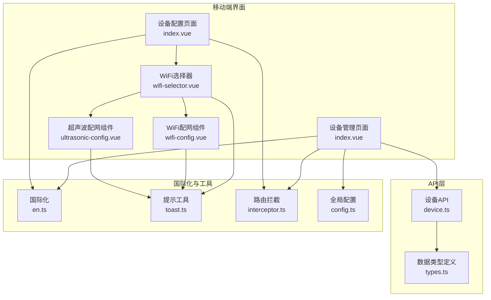
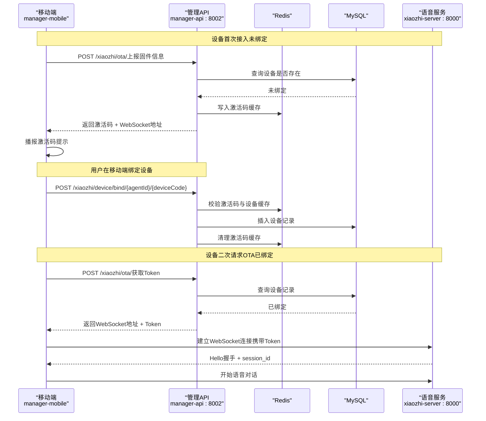
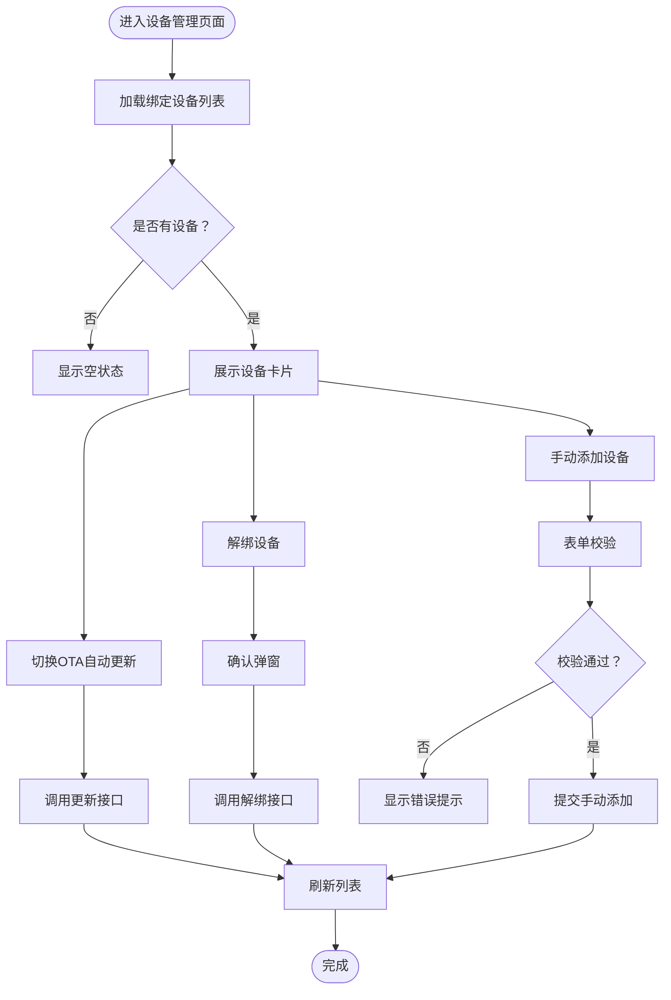
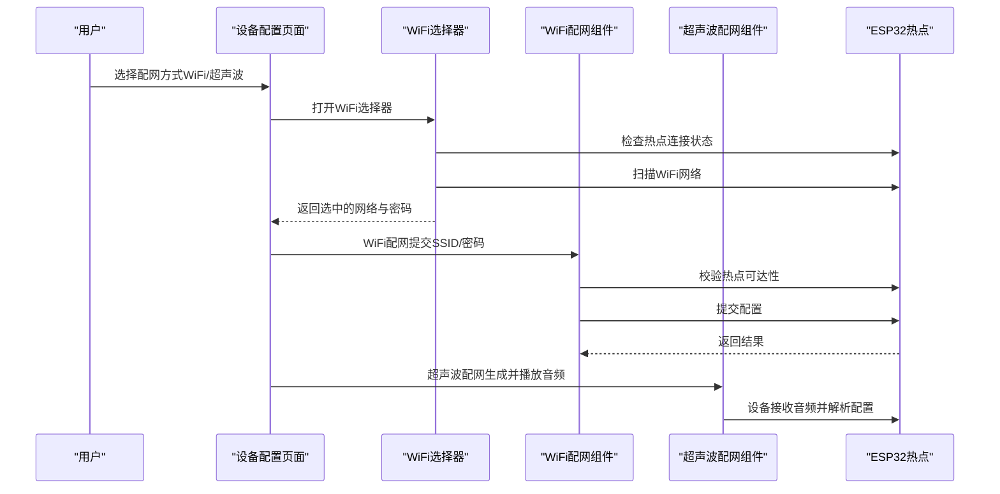
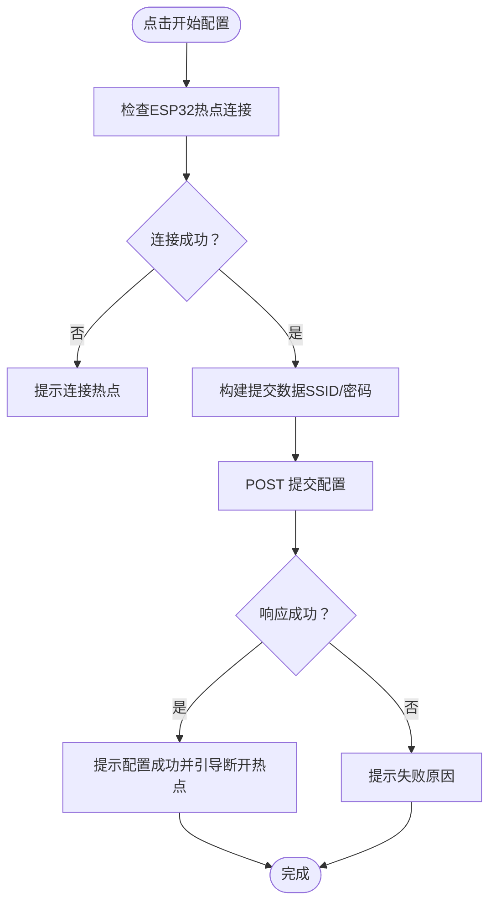
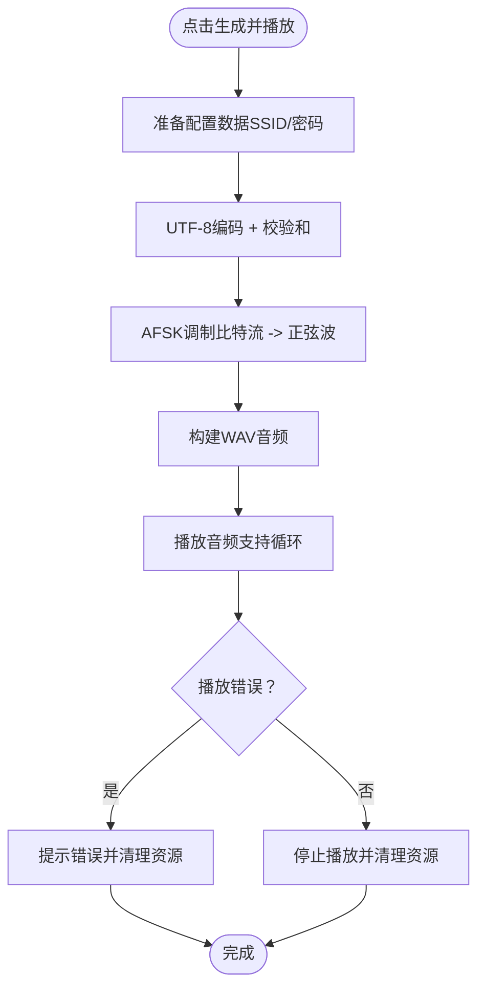
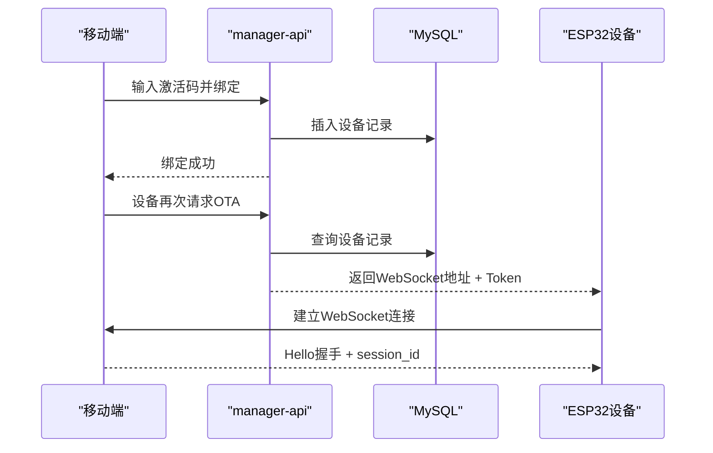
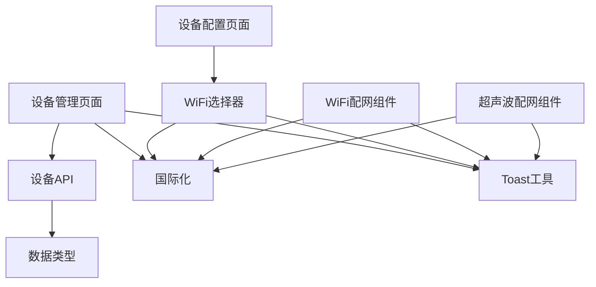

# 移动端设备管理

<cite>
**本文档引用的文件**
- [index.vue](file://main/manager-mobile/src/pages/device/index.vue)
- [device.ts](file://main/manager-mobile/src/api/device/device.ts)
- [types.ts](file://main/manager-mobile/src/api/device/types.ts)
- [index.vue](file://main/manager-mobile/src/pages/device-config/index.vue)
- [wifi-selector.vue](file://main/manager-mobile/src/pages/device-config/components/wifi-selector.vue)
- [wifi-config.vue](file://main/manager-mobile/src/pages/device-config/components/wifi-config.vue)
- [ultrasonic-config.vue](file://main/manager-mobile/src/pages/device-config/components/ultrasonic-config.vue)
- [device-onboarding-flow.md](file://main/xiaozhi-server/docs/device/device-onboarding-flow.md)
- [device-api-reference.md](file://main/xiaozhi-server/docs/device/device-api-reference.md)
- [toast.ts](file://main/manager-mobile/src/utils/toast.ts)
- [en.ts](file://main/manager-mobile/src/i18n/en.ts)
- [config.ts](file://main/manager-mobile/src/store/config.ts)
- [interceptor.ts](file://main/manager-mobile/src/router/interceptor.ts)
</cite>

## 目录
1. [简介](#简介)
2. [项目结构](#项目结构)
3. [核心组件](#核心组件)
4. [架构总览](#架构总览)
5. [详细组件分析](#详细组件分析)
6. [依赖分析](#依赖分析)
7. [性能考虑](#性能考虑)
8. [故障排查指南](#故障排查指南)
9. [结论](#结论)
10. [附录](#附录)

## 简介
本文件面向移动端设备管理功能，围绕设备列表展示、设备配置与绑定、WiFi与超声波配网、设备状态监控与连接管理、故障诊断、配置向导与参数验证、以及设备添加/删除/编辑等操作进行全面说明。文档同时结合移动端特有的扫描、连接建立与配置下发流程，帮助开发者与运维人员快速理解并高效维护该功能。

## 项目结构
移动端设备管理主要由以下模块构成：
- 设备管理页面：负责设备列表展示、绑定/解绑、OTA自动更新开关切换、手动添加设备等。
- 设备配置页面：提供WiFi配网与超声波配网两种方式，内含WiFi网络扫描、连接状态检测、配网提交与结果反馈。
- API层：封装设备相关HTTP请求，包括获取设备列表、绑定/解绑、设置OTA开关、获取固件类型等。
- 国际化与工具：提供多语言文案、Toast提示、路由拦截与全局配置管理。

**图表来源**
- [index.vue:1-632](file://main/manager-mobile/src/pages/device/index.vue#L1-L632)
- [index.vue:1-156](file://main/manager-mobile/src/pages/device-config/index.vue#L1-L156)
- [wifi-selector.vue:1-568](file://main/manager-mobile/src/pages/device-config/components/wifi-selector.vue#L1-L568)
- [wifi-config.vue:1-237](file://main/manager-mobile/src/pages/device-config/components/wifi-config.vue#L1-L237)
- [ultrasonic-config.vue:1-686](file://main/manager-mobile/src/pages/device-config/components/ultrasonic-config.vue#L1-L686)
- [device.ts:1-72](file://main/manager-mobile/src/api/device/device.ts#L1-L72)
- [types.ts:1-22](file://main/manager-mobile/src/api/device/types.ts#L1-L22)
- [en.ts:392-504](file://main/manager-mobile/src/i18n/en.ts#L392-L504)
- [toast.ts:1-66](file://main/manager-mobile/src/utils/toast.ts#L1-L66)
- [interceptor.ts:1-67](file://main/manager-mobile/src/router/interceptor.ts#L1-L67)
- [config.ts:1-67](file://main/manager-mobile/src/store/config.ts#L1-L67)

**章节来源**
- [index.vue:1-632](file://main/manager-mobile/src/pages/device/index.vue#L1-L632)
- [index.vue:1-156](file://main/manager-mobile/src/pages/device-config/index.vue#L1-L156)
- [wifi-selector.vue:1-568](file://main/manager-mobile/src/pages/device-config/components/wifi-selector.vue#L1-L568)
- [wifi-config.vue:1-237](file://main/manager-mobile/src/pages/device-config/components/wifi-config.vue#L1-L237)
- [ultrasonic-config.vue:1-686](file://main/manager-mobile/src/pages/device-config/components/ultrasonic-config.vue#L1-L686)
- [device.ts:1-72](file://main/manager-mobile/src/api/device/device.ts#L1-L72)
- [types.ts:1-22](file://main/manager-mobile/src/api/device/types.ts#L1-L22)
- [en.ts:392-504](file://main/manager-mobile/src/i18n/en.ts#L392-L504)
- [toast.ts:1-66](file://main/manager-mobile/src/utils/toast.ts#L1-L66)
- [interceptor.ts:1-67](file://main/manager-mobile/src/router/interceptor.ts#L1-L67)
- [config.ts:1-67](file://main/manager-mobile/src/store/config.ts#L1-L67)

## 核心组件
- 设备管理页面（index.vue）
  - 功能：展示绑定设备列表、切换OTA自动更新、解绑设备、打开绑定对话框、手动添加设备、获取固件类型列表。
  - 关键逻辑：加载设备列表、格式化最后连接时间、表单校验与错误提示、调用API执行绑定/解绑/更新操作。
- 设备配置页面（index.vue）
  - 功能：选择配网方式（WiFi/超声波）、展示WiFi网络选择器、触发配网操作。
- WiFi选择器（wifi-selector.vue）
  - 功能：检测xiaozhi热点连接状态、扫描WiFi网络、选择目标网络、输入密码并回传给父组件。
- WiFi配网组件（wifi-config.vue）
  - 功能：校验ESP32热点可达性、提交WiFi配置、处理成功/失败反馈。
- 超声波配网组件（ultrasonic-config.vue）
  - 功能：生成AFSK调制音频、播放音频、循环播放控制、错误处理与资源清理。
- 设备API（device.ts）
  - 功能：封装设备相关HTTP请求，包括获取固件类型、获取绑定设备列表、绑定/解绑、设置OTA开关等。
- 数据类型（types.ts）
  - 功能：定义设备与固件类型的数据结构。

**章节来源**
- [index.vue:100-372](file://main/manager-mobile/src/pages/device/index.vue#L100-L372)
- [index.vue:16-78](file://main/manager-mobile/src/pages/device-config/index.vue#L16-L78)
- [wifi-selector.vue:48-218](file://main/manager-mobile/src/pages/device-config/components/wifi-selector.vue#L48-L218)
- [wifi-config.vue:34-104](file://main/manager-mobile/src/pages/device-config/components/wifi-config.vue#L34-L104)
- [ultrasonic-config.vue:223-451](file://main/manager-mobile/src/pages/device-config/components/ultrasonic-config.vue#L223-L451)
- [device.ts:7-71](file://main/manager-mobile/src/api/device/device.ts#L7-L71)
- [types.ts:1-22](file://main/manager-mobile/src/api/device/types.ts#L1-L22)

## 架构总览
移动端设备管理与后端服务的交互遵循“智控台模式”（完整功能），设备首次接入通过OTA获取激活码，随后在管理端完成绑定；绑定后设备再次请求OTA以获取WebSocket地址与Token，进而建立实时连接并进行语音对话。

**图表来源**
- [device-onboarding-flow.md:28-172](file://main/xiaozhi-server/docs/device/device-onboarding-flow.md#L28-L172)
- [device-api-reference.md:18-215](file://main/xiaozhi-server/docs/device/device-api-reference.md#L18-L215)

**章节来源**
- [device-onboarding-flow.md:28-172](file://main/xiaozhi-server/docs/device/device-onboarding-flow.md#L28-L172)
- [device-api-reference.md:18-215](file://main/xiaozhi-server/docs/device/device-api-reference.md#L18-L215)

## 详细组件分析

### 设备管理页面（设备列表与绑定）
- 设备列表加载与展示
  - 通过API获取绑定设备列表，支持加载状态与空状态提示。
  - 展示设备类型名称、MAC地址、固件版本、最后连接时间。
- OTA自动更新开关
  - 调用更新接口切换autoUpdate状态，即时反馈成功/失败。
- 解绑设备
  - 弹窗确认后调用解绑接口，刷新列表。
- 手动添加设备
  - 表单校验（设备类型、固件版本、MAC地址格式），提交后刷新列表并清空表单。

**图表来源**
- [index.vue:100-372](file://main/manager-mobile/src/pages/device/index.vue#L100-L372)
- [device.ts:15-71](file://main/manager-mobile/src/api/device/device.ts#L15-L71)

**章节来源**
- [index.vue:100-372](file://main/manager-mobile/src/pages/device/index.vue#L100-L372)
- [device.ts:15-71](file://main/manager-mobile/src/api/device/device.ts#L15-L71)

### 设备配置页面（WiFi配网与超声波配网）
- 配网方式选择
  - 支持WiFi配网与超声波配网（超声波配网当前注释保留）。
- WiFi网络选择与连接状态检测
  - 检测xiaozhi热点连接状态，扫描WiFi网络，选择目标网络并输入密码。
- WiFi配网流程
  - 校验ESP32热点可达性，提交SSID与密码，处理成功/失败反馈。
- 超声波配网流程
  - 生成AFSK调制音频（WAV），播放音频并支持循环播放与停止，包含错误处理与资源清理。

**图表来源**
- [index.vue:16-78](file://main/manager-mobile/src/pages/device-config/index.vue#L16-L78)
- [wifi-selector.vue:48-130](file://main/manager-mobile/src/pages/device-config/components/wifi-selector.vue#L48-L130)
- [wifi-config.vue:34-104](file://main/manager-mobile/src/pages/device-config/components/wifi-config.vue#L34-L104)
- [ultrasonic-config.vue:223-451](file://main/manager-mobile/src/pages/device-config/components/ultrasonic-config.vue#L223-L451)

**章节来源**
- [index.vue:16-78](file://main/manager-mobile/src/pages/device-config/index.vue#L16-L78)
- [wifi-selector.vue:48-130](file://main/manager-mobile/src/pages/device-config/components/wifi-selector.vue#L48-L130)
- [wifi-config.vue:34-104](file://main/manager-mobile/src/pages/device-config/components/wifi-config.vue#L34-L104)
- [ultrasonic-config.vue:223-451](file://main/manager-mobile/src/pages/device-config/components/ultrasonic-config.vue#L223-L451)

### WiFi配网组件（技术细节）
- 连接检查
  - 通过HTTP请求访问ESP32热点的扫描接口，判断可达性。
- 配置提交
  - 根据网络是否加密决定是否传递密码，提交后解析响应并提示结果。
- 错误处理
  - 捕获网络异常与响应异常，统一提示用户检查网络连接。

**图表来源**
- [wifi-config.vue:34-104](file://main/manager-mobile/src/pages/device-config/components/wifi-config.vue#L34-L104)

**章节来源**
- [wifi-config.vue:34-104](file://main/manager-mobile/src/pages/device-config/components/wifi-config.vue#L34-L104)

### 超声波配网组件（技术细节）
- 音频生成
  - 将SSID与密码拼接后按UTF-8编码，计算校验和，转换为比特流，进行AFSK调制，生成WAV音频。
- 播放控制
  - 支持循环播放与停止，处理播放错误（资源忙、格式不支持、文件错误）。
- 资源清理
  - 播放结束或出错后清理音频上下文，避免内存泄漏。

**图表来源**
- [ultrasonic-config.vue:223-451](file://main/manager-mobile/src/pages/device-config/components/ultrasonic-config.vue#L223-L451)

**章节来源**
- [ultrasonic-config.vue:223-451](file://main/manager-mobile/src/pages/device-config/components/ultrasonic-config.vue#L223-L451)

### 设备绑定与配置下发（移动端视角）
- 绑定流程
  - 输入6位激活码，调用绑定接口，成功后刷新设备列表。
- 配置下发
  - 绑定成功后设备再次请求OTA，获取WebSocket地址与Token，建立连接并进行个性化配置加载与Hello握手。

**图表来源**
- [device-onboarding-flow.md:112-172](file://main/xiaozhi-server/docs/device/device-onboarding-flow.md#L112-L172)
- [device-api-reference.md:161-215](file://main/xiaozhi-server/docs/device/device-api-reference.md#L161-L215)

**章节来源**
- [device-onboarding-flow.md:112-172](file://main/xiaozhi-server/docs/device/device-onboarding-flow.md#L112-L172)
- [device-api-reference.md:161-215](file://main/xiaozhi-server/docs/device/device-api-reference.md#L161-L215)

## 依赖分析
- 组件耦合
  - 设备管理页面依赖设备API与国际化文案；设备配置页面依赖WiFi选择器与配网组件；WiFi选择器依赖Toast与国际化。
- 外部依赖
  - uni-app生态（页面、路由、拦截器、Toast等）。
  - 后端服务（manager-api与xiaozhi-server）。

**图表来源**
- [index.vue:1-632](file://main/manager-mobile/src/pages/device/index.vue#L1-L632)
- [index.vue:1-156](file://main/manager-mobile/src/pages/device-config/index.vue#L1-L156)
- [wifi-selector.vue:1-568](file://main/manager-mobile/src/pages/device-config/components/wifi-selector.vue#L1-L568)
- [wifi-config.vue:1-237](file://main/manager-mobile/src/pages/device-config/components/wifi-config.vue#L1-L237)
- [ultrasonic-config.vue:1-686](file://main/manager-mobile/src/pages/device-config/components/ultrasonic-config.vue#L1-L686)
- [device.ts:1-72](file://main/manager-mobile/src/api/device/device.ts#L1-L72)
- [types.ts:1-22](file://main/manager-mobile/src/api/device/types.ts#L1-L22)
- [en.ts:392-504](file://main/manager-mobile/src/i18n/en.ts#L392-L504)
- [toast.ts:1-66](file://main/manager-mobile/src/utils/toast.ts#L1-L66)

**章节来源**
- [index.vue:1-632](file://main/manager-mobile/src/pages/device/index.vue#L1-L632)
- [index.vue:1-156](file://main/manager-mobile/src/pages/device-config/index.vue#L1-L156)
- [wifi-selector.vue:1-568](file://main/manager-mobile/src/pages/device-config/components/wifi-selector.vue#L1-L568)
- [wifi-config.vue:1-237](file://main/manager-mobile/src/pages/device-config/components/wifi-config.vue#L1-L237)
- [ultrasonic-config.vue:1-686](file://main/manager-mobile/src/pages/device-config/components/ultrasonic-config.vue#L1-L686)
- [device.ts:1-72](file://main/manager-mobile/src/api/device/device.ts#L1-L72)
- [types.ts:1-22](file://main/manager-mobile/src/api/device/types.ts#L1-L22)
- [en.ts:392-504](file://main/manager-mobile/src/i18n/en.ts#L392-L504)
- [toast.ts:1-66](file://main/manager-mobile/src/utils/toast.ts#L1-L66)

## 性能考虑
- 列表渲染与懒加载
  - 设备列表采用轻量卡片布局，避免复杂嵌套；在大量设备场景下建议增加虚拟滚动或分页。
- 网络请求优化
  - 设备列表请求设置短缓存策略，避免频繁刷新；WiFi扫描与热点检测设置合理超时时间。
- 音频生成与播放
  - 超声波配网采用降低采样率与压缩音频体积，减少内存占用；播放结束后及时清理音频上下文。
- 国际化与本地化
  - 文案统一从国际化文件读取，避免重复字符串；按需加载语言包，减少首屏体积。

[本节为通用指导，无需具体文件引用]

## 故障排查指南
- WiFi配网失败
  - 检查热点连接状态与扫描响应；确认网络加密类型与密码是否正确；查看网络异常提示。
- 超声波配网播放失败
  - 检查音频资源是否生成成功、播放错误码（资源忙/格式不支持/文件错误）；确保手机音量适中，避免环境噪声干扰。
- 设备未绑定导致无法连接
  - 确认设备已通过激活码完成绑定；设备二次请求OTA应返回WebSocket地址与Token。
- 路由与登录
  - 页面访问受路由拦截保护，未登录用户将被重定向至登录页；确认登录状态与重定向参数。

**章节来源**
- [wifi-config.vue:97-104](file://main/manager-mobile/src/pages/device-config/components/wifi-config.vue#L97-L104)
- [ultrasonic-config.vue:386-424](file://main/manager-mobile/src/pages/device-config/components/ultrasonic-config.vue#L386-L424)
- [interceptor.ts:13-56](file://main/manager-mobile/src/router/interceptor.ts#L13-L56)

## 结论
移动端设备管理功能覆盖设备列表、绑定/解绑、OTA开关、WiFi与超声波配网等核心场景。通过清晰的组件划分与完善的错误处理，配合后端完整的激活/绑定与WebSocket连接流程，能够满足从设备接入到稳定运行的全链路需求。建议在实际部署中关注网络稳定性、音频质量与用户体验，持续优化配网流程与提示信息。

[本节为总结性内容，无需具体文件引用]

## 附录

### 设备添加/删除/编辑操作指南
- 添加设备
  - 通过“6位验证码绑定”或“手动添加设备”两种方式；手动添加需填写设备类型、固件版本与MAC地址。
- 删除设备
  - 在设备卡片右侧滑动触发解绑，确认后刷新列表。
- 编辑设备
  - 当前实现聚焦于绑定/解绑与OTA开关；如需扩展编辑功能，可在设备卡片中新增编辑入口并调用相应API。

**章节来源**
- [index.vue:194-273](file://main/manager-mobile/src/pages/device/index.vue#L194-L273)
- [device.ts:32-71](file://main/manager-mobile/src/api/device/device.ts#L32-L71)

### 设备离线处理、重连机制与配置同步策略
- 离线处理
  - 设备未绑定或Token过期时，WebSocket连接将被拒绝；前端应提示用户完成绑定或重新请求OTA。
- 重连机制
  - 建议在连接断开后定时重试，携带最新Token；对心跳保活进行监控，异常时主动重建连接。
- 配置同步
  - 设备二次请求OTA以获取最新配置与Token；前端在绑定成功后刷新设备列表与状态。

**章节来源**
- [device-onboarding-flow.md:147-172](file://main/xiaozhi-server/docs/device/device-onboarding-flow.md#L147-L172)
- [device-api-reference.md:218-307](file://main/xiaozhi-server/docs/device/device-api-reference.md#L218-L307)

### 移动端特有的扫描、连接建立与配置下发
- 扫描
  - WiFi选择器通过ESP32热点接口扫描可用网络，兼容多种响应格式。
- 连接建立
  - 通过OTA获取WebSocket地址与Token，建立持久连接并进行Hello握手。
- 配置下发
  - 语音服务侧异步加载个性化配置，完成后进入对话阶段。

**章节来源**
- [wifi-selector.vue:71-130](file://main/manager-mobile/src/pages/device-config/components/wifi-selector.vue#L71-L130)
- [device-onboarding-flow.md:174-307](file://main/xiaozhi-server/docs/device/device-onboarding-flow.md#L174-L307)
- [device-api-reference.md:218-307](file://main/xiaozhi-server/docs/device/device-api-reference.md#L218-L307)