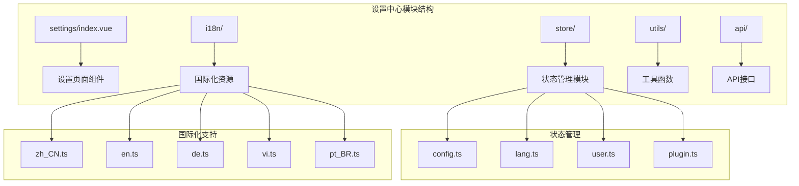
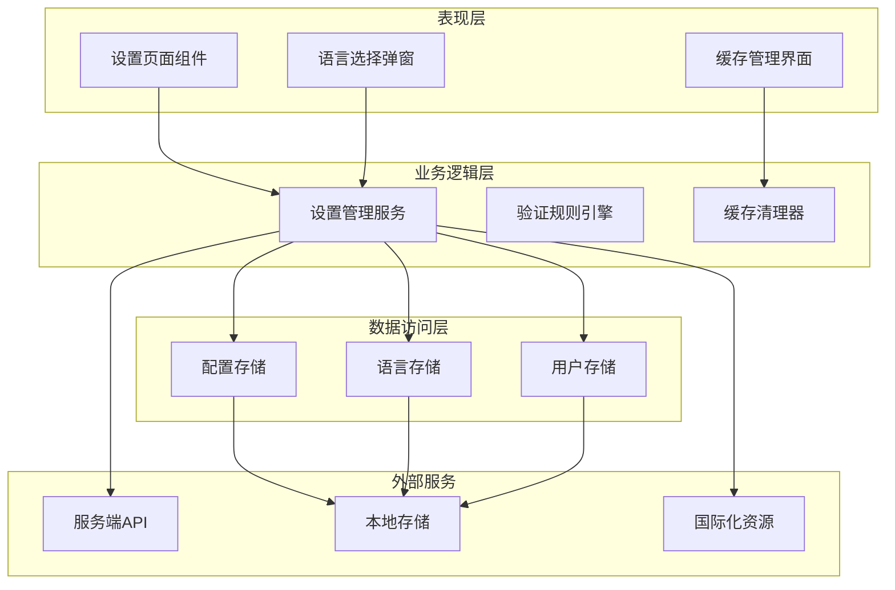
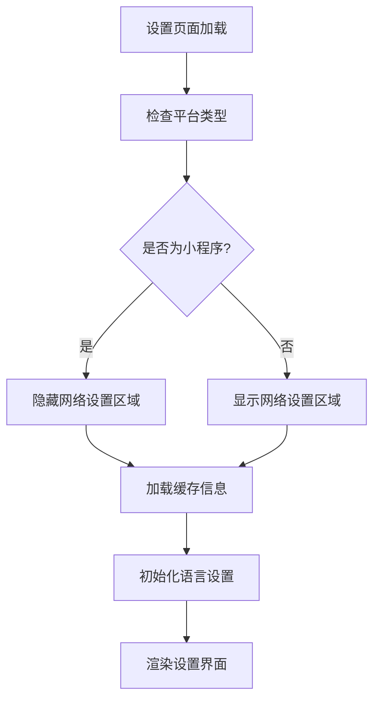
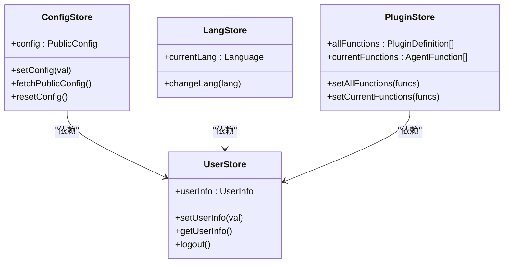
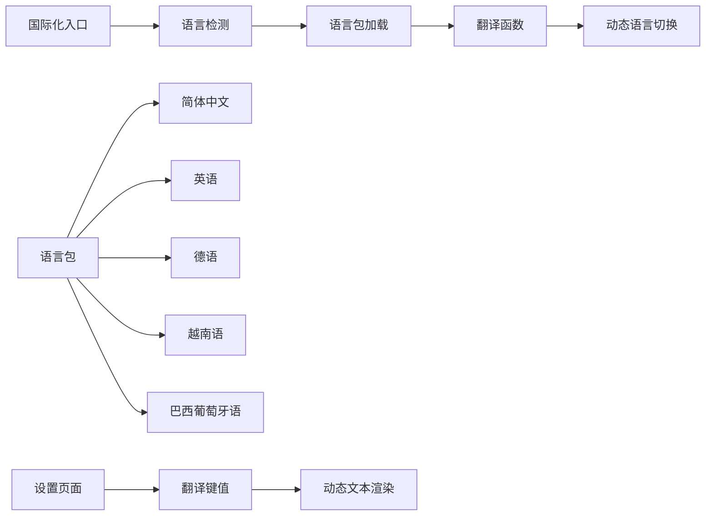
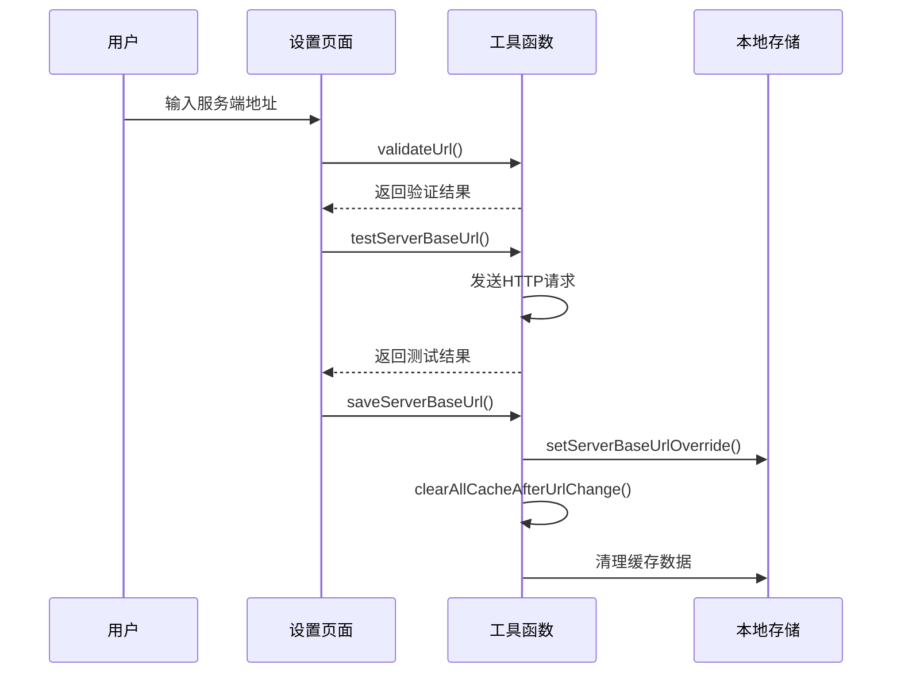
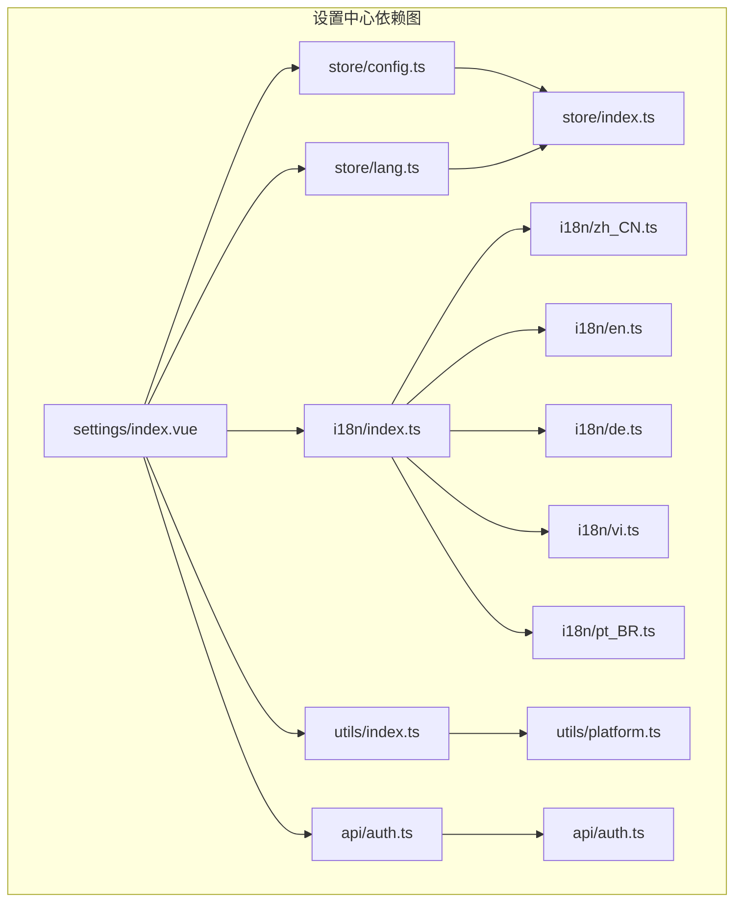

# 移动端设置中心

<cite>
**本文档引用的文件**
- [settings/index.vue](file://main/manager-mobile/src/pages/settings/index.vue)
- [config.ts](file://main/manager-mobile/src/store/config.ts)
- [lang.ts](file://main/manager-mobile/src/store/lang.ts)
- [index.ts](file://main/manager-mobile/src/i18n/index.ts)
- [zh_CN.ts](file://main/manager-mobile/src/i18n/zh_CN.ts)
- [en.ts](file://main/manager-mobile/src/i18n/en.ts)
- [de.ts](file://main/manager-mobile/src/i18n/de.ts)
- [vi.ts](file://main/manager-mobile/src/i18n/vi.ts)
- [pt_BR.ts](file://main/manager-mobile/src/i18n/pt_BR.ts)
- [index.ts](file://main/manager-mobile/src/utils/index.ts)
- [index.ts](file://main/manager-mobile/src/store/index.ts)
- [plugin.ts](file://main/manager-mobile/src/store/plugin.ts)
- [user.ts](file://main/manager-mobile/src/store/user.ts)
- [provider.ts](file://main/manager-mobile/src/store/provider.ts)
- [speedPitch.ts](file://main/manager-mobile/src/store/speedPitch.ts)
- [auth.ts](file://main/manager-mobile/src/api/auth.ts)
- [platform.ts](file://main/manager-mobile/src/utils/platform.ts)
</cite>

## 目录
1. [简介](#简介)
2. [项目结构](#项目结构)
3. [核心组件](#核心组件)
4. [架构概览](#架构概览)
5. [详细组件分析](#详细组件分析)
6. [依赖关系分析](#依赖关系分析)
7. [性能考虑](#性能考虑)
8. [故障排除指南](#故障排除指南)
9. [结论](#结论)
10. [附录](#附录)

## 简介

移动端设置中心是基于Vue.js 3 + uni-app构建的跨平台移动应用的核心配置管理模块。该模块提供了完整的应用配置、语言切换和主题设置功能，支持多语言国际化、缓存管理、网络配置等移动端特有的设置需求。

本设置中心采用现代化的前端架构，集成了Pinia状态管理、国际化支持、缓存持久化等先进技术，为用户提供了一致且高效的设置体验。

## 项目结构

移动端设置中心位于`main/manager-mobile/src/pages/settings/`目录下，采用模块化的文件组织结构：

**图表来源**
- [settings/index.vue:1-516](file://main/manager-mobile/src/pages/settings/index.vue#L1-L516)
- [config.ts:1-67](file://main/manager-mobile/src/store/config.ts#L1-L67)
- [lang.ts:1-40](file://main/manager-mobile/src/store/lang.ts#L1-L40)

**章节来源**
- [settings/index.vue:1-516](file://main/manager-mobile/src/pages/settings/index.vue#L1-L516)
- [config.ts:1-67](file://main/manager-mobile/src/store/config.ts#L1-L67)
- [lang.ts:1-40](file://main/manager-mobile/src/store/lang.ts#L1-L40)

## 核心组件

### 设置页面组件

设置页面是移动端设置中心的核心界面组件，提供了完整的设置管理功能：

- **网络设置区域**：支持服务端地址配置、地址验证、连接测试
- **缓存管理区域**：提供缓存信息查看、缓存清理功能
- **应用信息区域**：显示应用版本信息、关于页面
- **语言设置区域**：支持多语言切换、语言选择界面

### 状态管理模块

系统采用Pinia进行状态管理，包含多个专门的状态存储模块：

- **配置存储**：管理应用公共配置信息
- **语言存储**：维护用户语言偏好设置
- **用户存储**：处理用户信息和认证状态
- **插件存储**：管理智能体插件配置
- **供应商存储**：维护服务提供商信息
- **语音设置存储**：保存语音合成参数

### 国际化系统

支持六种语言的完整国际化支持：
- 中文（简体和繁体）
- 英语
- 德语
- 越南语
- 巴西葡萄牙语

**章节来源**
- [settings/index.vue:289-485](file://main/manager-mobile/src/pages/settings/index.vue#L289-L485)
- [config.ts:19-66](file://main/manager-mobile/src/store/config.ts#L19-L66)
- [lang.ts:12-40](file://main/manager-mobile/src/store/lang.ts#L12-L40)

## 架构概览

移动端设置中心采用分层架构设计，各层职责明确，耦合度低：

**图表来源**
- [settings/index.vue:11-287](file://main/manager-mobile/src/pages/settings/index.vue#L11-L287)
- [config.ts:25-54](file://main/manager-mobile/src/store/config.ts#L25-L54)
- [lang.ts:19-24](file://main/manager-mobile/src/store/lang.ts#L19-L24)

**章节来源**
- [settings/index.vue:11-287](file://main/manager-mobile/src/pages/settings/index.vue#L11-L287)
- [index.ts:1-22](file://main/manager-mobile/src/store/index.ts#L1-L22)

## 详细组件分析

### 设置页面组件分析

设置页面组件是整个设置中心的核心，采用了响应式设计和现代化的UI组件：

#### 核心功能特性

**图表来源**
- [settings/index.vue:275-286](file://main/manager-mobile/src/pages/settings/index.vue#L275-L286)

#### 网络设置功能

网络设置功能提供了灵活的服务端地址配置能力：

- **地址验证**：实时验证URL格式，支持正则表达式校验
- **连接测试**：自动测试服务端连通性
- **动态切换**：支持运行时切换服务端地址
- **缓存清理**：地址变更后自动清理相关缓存

#### 缓存管理系统

缓存管理提供了完整的缓存生命周期管理：

- **缓存监控**：实时显示应用缓存使用情况
- **批量清理**：一键清理所有缓存数据
- **智能清理**：区分不同类型的缓存进行针对性清理

**章节来源**
- [settings/index.vue:35-286](file://main/manager-mobile/src/pages/settings/index.vue#L35-L286)

### 状态管理架构

系统采用Pinia进行状态管理，实现了模块化的状态分离：

**图表来源**
- [config.ts:19-55](file://main/manager-mobile/src/store/config.ts#L19-L55)
- [lang.ts:12-29](file://main/manager-mobile/src/store/lang.ts#L12-L29)
- [user.ts:21-71](file://main/manager-mobile/src/store/user.ts#L21-L71)

#### 配置存储模块

配置存储模块管理应用的公共配置信息：

- **初始状态**：定义了完整的配置结构，包含注册开关、版本信息、ICP备案号等
- **持久化**：使用Pinia持久化插件，确保配置信息在应用重启后仍然有效
- **动态更新**：支持从服务端动态获取最新配置信息

#### 语言存储模块

语言存储模块负责管理用户的语言偏好：

- **默认语言**：支持多种语言，默认使用简体中文
- **持久化存储**：语言设置会持久化到本地存储
- **实时切换**：支持运行时切换语言而无需重启应用

**章节来源**
- [config.ts:6-66](file://main/manager-mobile/src/store/config.ts#L6-L66)
- [lang.ts:14-40](file://main/manager-mobile/src/store/lang.ts#L14-L40)

### 国际化系统设计

国际化系统采用了模块化的多语言支持架构：

**图表来源**
- [index.ts:27-62](file://main/manager-mobile/src/i18n/index.ts#L27-L62)
- [zh_CN.ts:1-504](file://main/manager-mobile/src/i18n/zh_CN.ts#L1-L504)

#### 翻译系统架构

翻译系统提供了完整的多语言支持：

- **键值对翻译**：每个翻译键对应特定的文本内容
- **参数化支持**：支持在翻译文本中使用参数占位符
- **动态加载**：根据当前语言动态加载相应的语言包
- **回退机制**：当找不到对应翻译时，自动回退到英文

#### 语言包结构

每个语言包都包含了完整的翻译内容：

- **设置页面翻译**：包含所有设置相关的界面文本
- **通用翻译**：包含常用的界面元素和提示信息
- **业务翻译**：包含具体的业务场景相关文本

**章节来源**
- [index.ts:1-79](file://main/manager-mobile/src/i18n/index.ts#L1-L79)
- [zh_CN.ts:286-323](file://main/manager-mobile/src/i18n/zh_CN.ts#L286-L323)

### 工具函数系统

工具函数系统提供了设置中心所需的各种辅助功能：

#### 服务器地址管理

**图表来源**
- [settings/index.vue:63-158](file://main/manager-mobile/src/pages/settings/index.vue#L63-L158)
- [index.ts:14-25](file://main/manager-mobile/src/utils/index.ts#L14-L25)

#### 缓存管理功能

缓存管理提供了完整的缓存生命周期管理：

- **缓存信息获取**：实时获取应用缓存使用情况
- **智能清理**：区分不同类型的数据进行针对性清理
- **安全清理**：确保清理过程不会影响应用核心功能

**章节来源**
- [index.ts:1-336](file://main/manager-mobile/src/utils/index.ts#L1-L336)
- [settings/index.vue:51-260](file://main/manager-mobile/src/pages/settings/index.vue#L51-L260)

## 依赖关系分析

移动端设置中心的依赖关系清晰明确，各模块之间耦合度低：

**图表来源**
- [settings/index.vue:12-18](file://main/manager-mobile/src/pages/settings/index.vue#L12-L18)
- [config.ts:1-3](file://main/manager-mobile/src/store/config.ts#L1-L3)
- [lang.ts:1-2](file://main/manager-mobile/src/store/lang.ts#L1-L2)

### 核心依赖关系

设置中心的主要依赖关系包括：

- **状态管理依赖**：设置页面依赖多个状态存储模块
- **国际化依赖**：设置页面依赖国际化系统
- **工具函数依赖**：设置页面依赖各种工具函数
- **API接口依赖**：设置页面依赖认证和配置API

### 第三方库依赖

系统使用了以下关键的第三方库：

- **Pinia**：现代化的状态管理库
- **Wot Design Uni**：uni-app的UI组件库
- **SM Crypto**：国密算法支持库
- **Alova**：HTTP客户端库

**章节来源**
- [settings/index.vue:12-18](file://main/manager-mobile/src/pages/settings/index.vue#L12-L18)
- [index.ts:1-14](file://main/manager-mobile/src/store/index.ts#L1-L14)

## 性能考虑

移动端设置中心在设计时充分考虑了性能优化：

### 内存管理

- **懒加载**：语言包采用按需加载策略
- **缓存优化**：合理使用浏览器缓存减少重复加载
- **内存泄漏防护**：及时清理事件监听器和定时器

### 网络性能

- **请求合并**：减少不必要的网络请求
- **超时控制**：设置合理的请求超时时间
- **错误重试**：实现智能的错误重试机制

### 用户体验优化

- **响应式设计**：适配不同尺寸的移动设备
- **离线支持**：部分功能支持离线使用
- **加载指示**：提供清晰的加载状态反馈

## 故障排除指南

### 常见问题及解决方案

#### 语言切换问题

**问题描述**：语言切换后界面文本没有更新

**解决方案**：
1. 检查语言存储是否正确保存
2. 确认翻译函数是否正确加载
3. 验证语言包文件完整性

#### 服务端地址配置失败

**问题描述**：设置服务端地址后应用无法正常连接

**解决方案**：
1. 验证URL格式是否正确
2. 检查网络连接状态
3. 确认服务端API是否正常运行
4. 查看错误日志获取详细信息

#### 缓存清理问题

**问题描述**：清理缓存后应用出现异常

**解决方案**：
1. 检查缓存清理范围是否正确
2. 确认关键数据是否被意外删除
3. 实施缓存恢复机制

**章节来源**
- [settings/index.vue:63-111](file://main/manager-mobile/src/pages/settings/index.vue#L63-L111)
- [index.ts:133-167](file://main/manager-mobile/src/utils/index.ts#L133-L167)

## 结论

移动端设置中心是一个功能完善、架构清晰的配置管理模块。它成功地整合了现代前端技术栈，提供了优秀的用户体验和强大的功能特性。

### 主要优势

- **模块化设计**：清晰的模块划分和职责分离
- **国际化支持**：完整的多语言支持体系
- **状态管理**：现代化的Pinia状态管理
- **性能优化**：全面的性能考虑和优化措施
- **扩展性强**：易于添加新的设置选项和功能

### 技术亮点

- 采用Vue.js 3 Composition API实现响应式开发
- 使用Pinia替代Vuex，提供更好的TypeScript支持
- 实现了完整的国际化解决方案
- 提供了灵活的缓存管理机制
- 支持多种平台的统一开发

移动端设置中心为后续的功能扩展奠定了坚实的基础，其架构设计和技术选型都体现了现代化前端开发的最佳实践。

## 附录

### 设置项分类组织

设置中心按照功能域进行分类组织：

1. **网络设置**：服务端地址配置、连接测试
2. **缓存管理**：缓存信息查看、缓存清理
3. **应用信息**：版本信息、关于页面
4. **语言设置**：多语言切换、语言偏好

### 默认值管理

系统实现了完善的默认值管理机制：

- **配置默认值**：应用启动时的初始配置
- **语言默认值**：用户语言偏好的默认设置
- **用户默认值**：用户信息的默认状态

### 配置持久化机制

采用多层次的配置持久化策略：

1. **本地存储**：使用uniStorageSync进行数据持久化
2. **状态管理**：Pinia持久化插件自动管理状态
3. **缓存策略**：智能的缓存更新和同步机制

### 国际化支持

完整的国际化支持包括：

- **语言包管理**：多语言资源文件组织
- **动态切换**：运行时语言切换支持
- **文本渲染**：翻译键值到实际文本的转换
- **参数化**：支持带参数的复杂翻译

### 验证规则和错误处理

系统实现了完善的验证和错误处理机制：

- **输入验证**：实时验证用户输入的有效性
- **错误提示**：友好的错误信息提示
- **异常处理**：全面的异常捕获和处理
- **用户反馈**：及时的用户操作反馈

### 设置重置和备份恢复

- **重置功能**：一键重置所有设置到默认值
- **备份机制**：支持设置数据的备份和导出
- **恢复功能**：提供设置数据的恢复和导入

### 移动端特有功能

针对移动端的特点，系统提供了：

- **平台适配**：自动适配不同平台的UI差异
- **性能优化**：针对移动设备的性能优化
- **离线支持**：部分功能的离线使用能力
- **权限管理**：移动端特有的权限处理