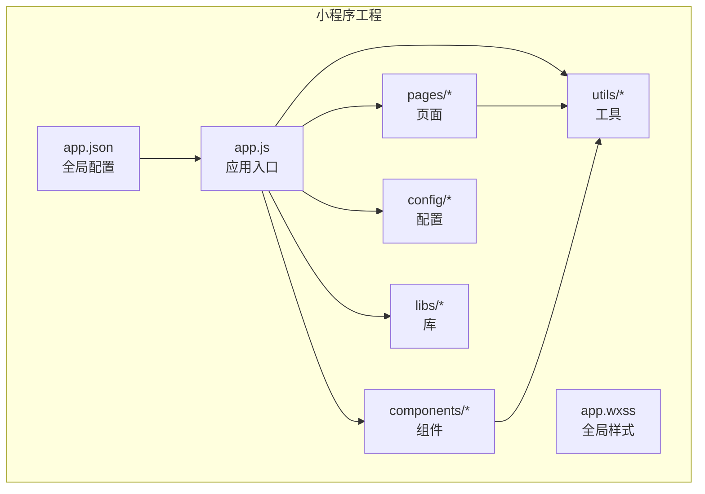
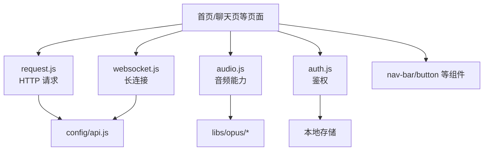
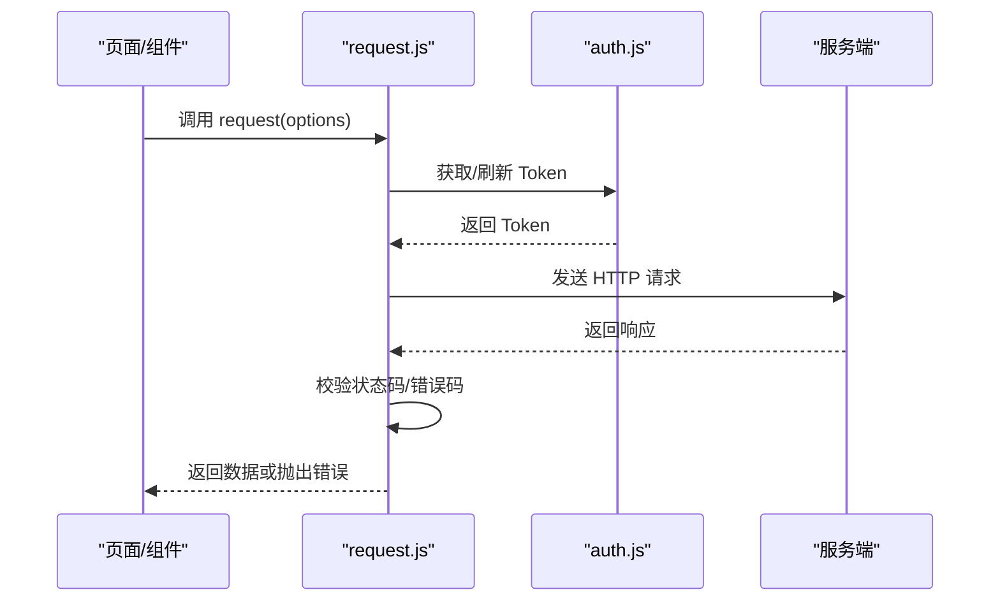
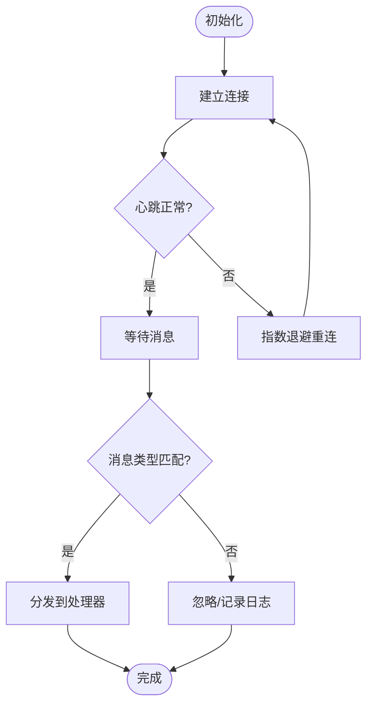
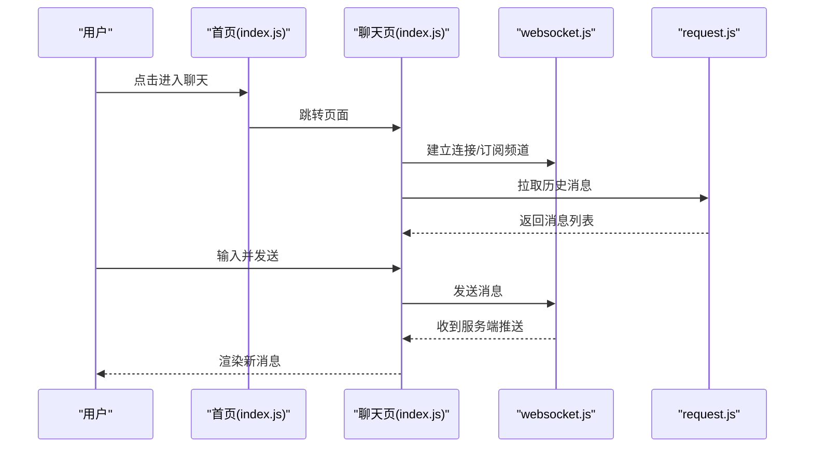
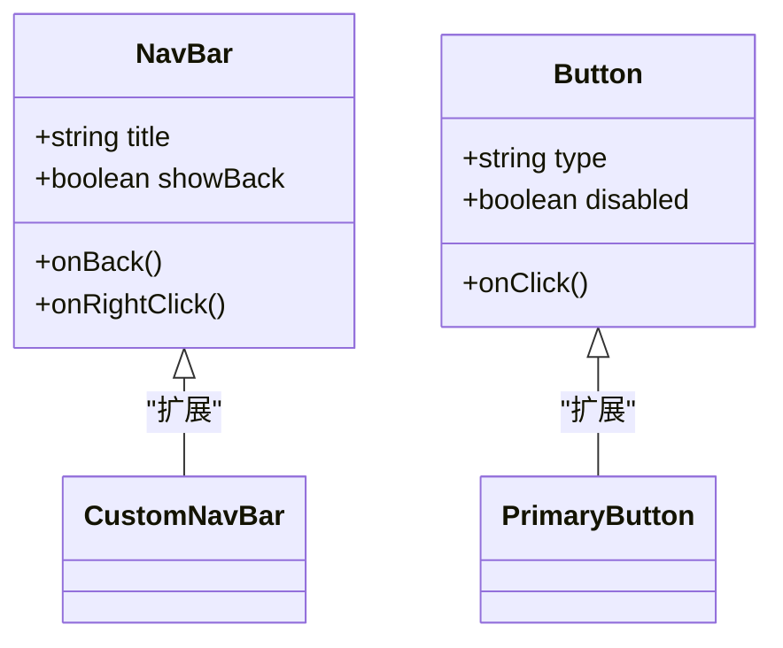
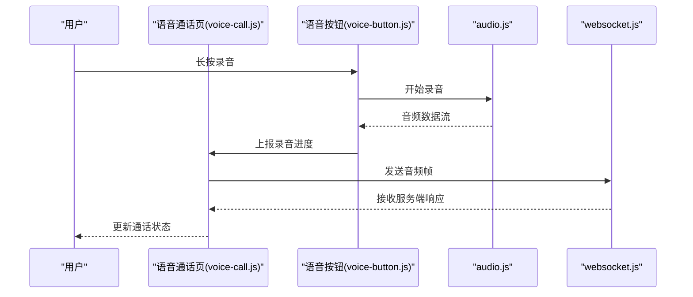
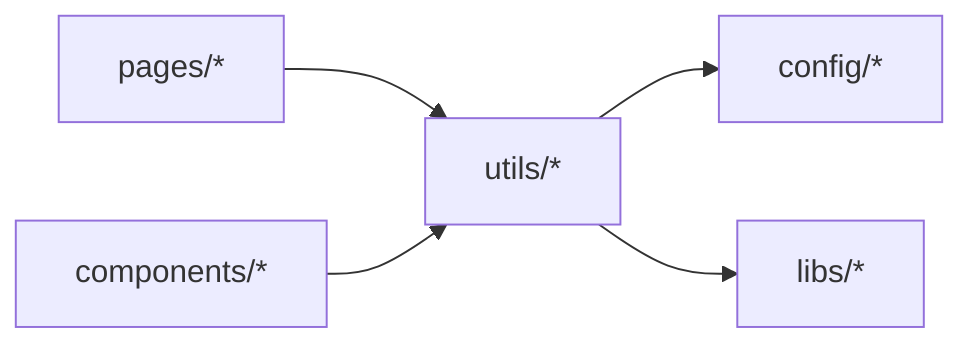

# 小程序开发指南

<cite>
**本文档引用的文件**   
- [main/egg-miniprogram/miniprogram/app.json](file://main/egg-miniprogram/miniprogram/app.json)
- [main/egg-miniprogram/miniprogram/app.js](file://main/egg-miniprogram/miniprogram/app.js)
- [main/egg-miniprogram/miniprogram/app.wxss](file://main/egg-miniprogram/miniprogram/app.wxss)
- [main/egg-miniprogram/miniprogram/config/api.js](file://main/egg-miniprogram/miniprogram/config/api.js)
- [main/egg-miniprogram/miniprogram/utils/request.js](file://main/egg-miniprogram/miniprogram/utils/request.js)
- [main/egg-miniprogram/miniprogram/utils/websocket.js](file://main/egg-miniprogram/miniprogram/utils/websocket.js)
- [main/egg-miniprogram/miniprogram/utils/auth.js](file://main/egg-miniprogram/miniprogram/utils/auth.js)
- [main/egg-miniprogram/miniprogram/utils/audio.js](file://main/egg-miniprogram/miniprogram/utils/audio.js)
- [main/egg-miniprogram/miniprogram/pages/home/index.js](file://main/egg-miniprogram/miniprogram/pages/home/index.js)
- [main/egg-miniprogram/miniprogram/pages/chat/index.js](file://main/egg-miniprogram/miniprogram/pages/chat/index.js)
- [main/egg-miniprogram/miniprogram/components/nav-bar/nav-bar.js](file://main/egg-miniprogram/miniprogram/components/nav-bar/nav-bar.js)
- [main/egg-miniprogram/miniprogram/components/button/button.js](file://main/egg-miniprogram/miniprogram/components/button/button.js)
- [main/egg-miniprogram/project.config.json](file://main/egg-miniprogram/project.config.json)
- [main/miniprogram/app.json](file://main/miniprogram/app.json)
- [main/miniprogram/app.js](file://main/miniprogram/app.js)
- [main/miniprogram/utils/request.js](file://main/miniprogram/utils/request.js)
- [main/miniprogram/utils/websocket.js](file://main/miniprogram/utils/websocket.js)
- [main/miniprogram/utils/logger.js](file://main/miniprogram/utils/logger.js)
- [main/miniprogram/pages/index/index.js](file://main/miniprogram/pages/index/index.js)
- [main/miniprogram/pages/voice-call/voice-call.js](file://main/miniprogram/pages/voice-call/voice-call.js)
- [main/miniprogram/components/voice-button/voice-button.js](file://main/miniprogram/components/voice-button/voice-button.js)
</cite>

## 目录
1. [简介](#简介)
2. [项目结构](#项目结构)
3. [核心组件](#核心组件)
4. [架构总览](#架构总览)
5. [详细组件分析](#详细组件分析)
6. [依赖分析](#依赖分析)
7. [性能考虑](#性能考虑)
8. [故障排查指南](#故障排查指南)
9. [结论](#结论)
10. [附录](#附录)

## 简介
本指南面向在仓库中开发小程序的工程师，覆盖环境搭建、工具链与 IDE 配置、开发规范、组件与页面开发模式、样式编写、调试与日志、错误处理、构建打包与资源管理、版本控制与协作流程等。文档基于仓库内两个小程序工程：
- main/egg-miniprogram：基于微信原生小程序的工程（WXML/WXSS/JS）
- main/miniprogram：另一个微信原生小程序工程

读者可据此快速上手并遵循统一的开发规范进行迭代。

## 项目结构
仓库包含多个子工程，与小程序相关的主要目录如下：
- main/egg-miniprogram：微信原生小程序工程，包含 pages、components、config、utils、libs 等
- main/miniprogram：另一套微信原生小程序工程，包含 pages、components、utils、config 等

典型目录职责：
- app.json：小程序全局配置（页面路由、窗口样式、tabBar 等）
- app.js：应用生命周期入口（初始化、全局状态、插件注册）
- app.wxss：全局样式
- pages：页面目录，每个页面由 .js/.json/.wxml/.wxss 组成
- components：自定义组件目录，结构与页面类似
- utils：通用工具模块（网络请求、WebSocket、音频、鉴权、日志等）
- config：业务常量与接口配置
- libs：第三方或自研库（如 opus 编解码）

图表来源
- [main/egg-miniprogram/miniprogram/app.json](file://main/egg-miniprogram/miniprogram/app.json)
- [main/egg-miniprogram/miniprogram/app.js](file://main/egg-miniprogram/miniprogram/app.js)
- [main/miniprogram/app.json](file://main/miniprogram/app.json)
- [main/miniprogram/app.js](file://main/miniprogram/app.js)

章节来源
- [main/egg-miniprogram/miniprogram/app.json](file://main/egg-miniprogram/miniprogram/app.json)
- [main/egg-miniprogram/miniprogram/app.js](file://main/egg-miniprogram/miniprogram/app.js)
- [main/miniprogram/app.json](file://main/miniprogram/app.json)
- [main/miniprogram/app.js](file://main/miniprogram/app.js)

## 核心组件
- 网络请求封装：统一拦截器、重试、超时、鉴权注入、错误提示
- WebSocket 客户端：长连接建立、心跳、断线重连、消息分发
- 音频能力：录音、播放、编码解码（opus）、音量与权限处理
- 鉴权模块：登录态获取、Token 刷新、安全存储
- 日志模块：分级日志、上报开关、脱敏策略

章节来源
- [main/egg-miniprogram/miniprogram/utils/request.js](file://main/egg-miniprogram/miniprogram/utils/request.js)
- [main/egg-miniprogram/miniprogram/utils/websocket.js](file://main/egg-miniprogram/miniprogram/utils/websocket.js)
- [main/egg-miniprogram/miniprogram/utils/audio.js](file://main/egg-miniprogram/miniprogram/utils/audio.js)
- [main/egg-miniprogram/miniprogram/utils/auth.js](file://main/egg-miniprogram/miniprogram/utils/auth.js)
- [main/miniprogram/utils/logger.js](file://main/miniprogram/utils/logger.js)

## 架构总览
小程序整体采用“页面 + 组件 + 工具”的分层架构：
- 页面层负责视图与交互逻辑
- 组件层提供可复用 UI 与行为
- 工具层提供网络、音频、鉴权、日志等横切能力
- 配置层集中管理 API 地址、功能开关、文案等

图表来源
- [main/egg-miniprogram/miniprogram/pages/home/index.js](file://main/egg-miniprogram/miniprogram/pages/home/index.js)
- [main/egg-miniprogram/miniprogram/pages/chat/index.js](file://main/egg-miniprogram/miniprogram/pages/chat/index.js)
- [main/egg-miniprogram/miniprogram/utils/request.js](file://main/egg-miniprogram/miniprogram/utils/request.js)
- [main/egg-miniprogram/miniprogram/utils/websocket.js](file://main/egg-miniprogram/miniprogram/utils/websocket.js)
- [main/egg-miniprogram/miniprogram/utils/audio.js](file://main/egg-miniprogram/miniprogram/utils/audio.js)
- [main/egg-miniprogram/miniprogram/config/api.js](file://main/egg-miniprogram/miniprogram/config/api.js)
- [main/egg-miniprogram/miniprogram/libs/opus/opus-decoder.js](file://main/egg-miniprogram/miniprogram/libs/opus/opus-decoder.js)

## 详细组件分析

### 网络请求封装（request.js）
- 职责：统一发起 HTTP 请求，处理鉴权头、超时、重试、错误码映射、用户提示
- 关键点：
  - 请求前注入 Token、设备标识、TraceId
  - 响应后统一处理 401/403/5xx，触发登出或刷新
  - 支持取消请求与防抖
- 使用建议：所有页面与组件通过该模块访问后端接口，避免重复实现

图表来源
- [main/egg-miniprogram/miniprogram/utils/request.js](file://main/egg-miniprogram/miniprogram/utils/request.js)
- [main/egg-miniprogram/miniprogram/utils/auth.js](file://main/egg-miniprogram/miniprogram/utils/auth.js)

章节来源
- [main/egg-miniprogram/miniprogram/utils/request.js](file://main/egg-miniprogram/miniprogram/utils/request.js)
- [main/egg-miniprogram/miniprogram/utils/auth.js](file://main/egg-miniprogram/miniprogram/utils/auth.js)

### WebSocket 客户端（websocket.js）
- 职责：维护与服务端的长连接，处理心跳、断线重连、消息路由
- 关键点：
  - 自动重连与退避策略
  - 心跳保活与超时检测
  - 消息类型分发与回调管理
- 使用建议：语音通话、实时消息等场景优先使用此模块

图表来源
- [main/egg-miniprogram/miniprogram/utils/websocket.js](file://main/egg-miniprogram/miniprogram/utils/websocket.js)

章节来源
- [main/egg-miniprogram/miniprogram/utils/websocket.js](file://main/egg-miniprogram/miniprogram/utils/websocket.js)

### 音频能力（audio.js）
- 职责：封装录音、播放、格式转换（opus）、权限申请、异常恢复
- 关键点：
  - 录音质量与时长限制
  - 播放缓冲与中断处理
  - 跨端兼容与降级策略
- 使用建议：语音输入、TTS 播放等统一走此模块

章节来源
- [main/egg-miniprogram/miniprogram/utils/audio.js](file://main/egg-miniprogram/miniprogram/utils/audio.js)

### 鉴权模块（auth.js）
- 职责：登录态管理、Token 获取与刷新、敏感信息存储
- 关键点：
  - 静默登录与授权弹窗
  - Token 过期自动刷新
  - 安全存储与清理
- 使用建议：所有需要鉴权的页面与接口均通过此模块

章节来源
- [main/egg-miniprogram/miniprogram/utils/auth.js](file://main/egg-miniprogram/miniprogram/utils/auth.js)

### 日志模块（logger.js）
- 职责：分级日志、上报开关、脱敏、采样
- 关键点：
  - 开发环境与生产环境不同输出策略
  - 关键路径埋点与错误堆栈收集
- 使用建议：在关键流程与异常分支插入日志

章节来源
- [main/miniprogram/utils/logger.js](file://main/miniprogram/utils/logger.js)

### 页面示例：首页与聊天页
- 首页：展示入口、导航、基础数据加载
- 聊天页：消息列表、输入框、发送按钮、WebSocket 收发

图表来源
- [main/egg-miniprogram/miniprogram/pages/home/index.js](file://main/egg-miniprogram/miniprogram/pages/home/index.js)
- [main/egg-miniprogram/miniprogram/pages/chat/index.js](file://main/egg-miniprogram/miniprogram/pages/chat/index.js)
- [main/egg-miniprogram/miniprogram/utils/websocket.js](file://main/egg-miniprogram/miniprogram/utils/websocket.js)
- [main/egg-miniprogram/miniprogram/utils/request.js](file://main/egg-miniprogram/miniprogram/utils/request.js)

章节来源
- [main/egg-miniprogram/miniprogram/pages/home/index.js](file://main/egg-miniprogram/miniprogram/pages/home/index.js)
- [main/egg-miniprogram/miniprogram/pages/chat/index.js](file://main/egg-miniprogram/miniprogram/pages/chat/index.js)

### 组件示例：导航栏与按钮
- 导航栏：标题、返回、右侧插槽
- 按钮：主题、禁用态、点击事件

图表来源
- [main/egg-miniprogram/miniprogram/components/nav-bar/nav-bar.js](file://main/egg-miniprogram/miniprogram/components/nav-bar/nav-bar.js)
- [main/egg-miniprogram/miniprogram/components/button/button.js](file://main/egg-miniprogram/miniprogram/components/button/button.js)

章节来源
- [main/egg-miniprogram/miniprogram/components/nav-bar/nav-bar.js](file://main/egg-miniprogram/miniprogram/components/nav-bar/nav-bar.js)
- [main/egg-miniprogram/miniprogram/components/button/button.js](file://main/egg-miniprogram/miniprogram/components/button/button.js)

### 语音通话页与语音按钮
- 语音通话页：通话状态、音频流、网络状态
- 语音按钮：长按录音、波形反馈、上传

图表来源
- [main/miniprogram/pages/voice-call/voice-call.js](file://main/miniprogram/pages/voice-call/voice-call.js)
- [main/miniprogram/components/voice-button/voice-button.js](file://main/miniprogram/components/voice-button/voice-button.js)
- [main/miniprogram/utils/websocket.js](file://main/miniprogram/utils/websocket.js)

章节来源
- [main/miniprogram/pages/voice-call/voice-call.js](file://main/miniprogram/pages/voice-call/voice-call.js)
- [main/miniprogram/components/voice-button/voice-button.js](file://main/miniprogram/components/voice-button/voice-button.js)

## 依赖分析
- 页面依赖工具：页面通过 utils 中的 request、websocket、audio、auth 等模块完成业务逻辑
- 组件依赖工具：组件复用工具模块，保证一致性
- 配置集中化：api.js 集中管理接口地址与环境变量
- 库隔离：libs/opus 作为独立库，避免污染业务代码

图表来源
- [main/egg-miniprogram/miniprogram/config/api.js](file://main/egg-miniprogram/miniprogram/config/api.js)
- [main/egg-miniprogram/miniprogram/utils/request.js](file://main/egg-miniprogram/miniprogram/utils/request.js)
- [main/egg-miniprogram/miniprogram/utils/websocket.js](file://main/egg-miniprogram/miniprogram/utils/websocket.js)

章节来源
- [main/egg-miniprogram/miniprogram/config/api.js](file://main/egg-miniprogram/miniprogram/config/api.js)
- [main/egg-miniprogram/miniprogram/utils/request.js](file://main/egg-miniprogram/miniprogram/utils/request.js)
- [main/egg-miniprogram/miniprogram/utils/websocket.js](file://main/egg-miniprogram/miniprogram/utils/websocket.js)

## 性能考虑
- 首屏优化：按需加载页面与组件，减少初始包体积
- 图片与资源：使用压缩与 CDN，懒加载非关键资源
- 网络优化：合并请求、缓存策略、失败重试与超时控制
- 音频处理：合理设置采样率与码率，避免频繁 GC
- 长连接：心跳间隔与重连退避平衡稳定性与能耗

## 故障排查指南
- 常见问题定位：
  - 网络请求失败：检查请求头、Token、超时与错误码映射
  - WebSocket 断开：查看心跳、重连次数、服务端状态
  - 录音失败：确认权限、媒体会话、设备兼容性
  - 页面白屏：检查 app.json 路由、组件引入、样式冲突
- 日志与调试：
  - 开启开发日志与上报开关
  - 关键路径埋点与错误堆栈采集
  - 使用开发者工具的 Network、Console、Performance 面板

章节来源
- [main/miniprogram/utils/logger.js](file://main/miniprogram/utils/logger.js)
- [main/egg-miniprogram/miniprogram/utils/request.js](file://main/egg-miniprogram/miniprogram/utils/request.js)
- [main/egg-miniprogram/miniprogram/utils/websocket.js](file://main/egg-miniprogram/miniprogram/utils/websocket.js)

## 结论
本指南围绕仓库内的两个小程序工程，提供了从环境搭建到开发规范、组件与页面实践、调试与构建、版本控制的完整说明。建议团队在现有工程基础上统一工具链与规范，提升协作效率与代码质量。

## 附录

### 开发环境搭建与工具链
- 安装微信开发者工具（稳定版），创建小程序项目并导入对应目录
- Node.js 与包管理器（如 pnpm/npm/yarn）用于脚本与依赖管理
- 可选：ESLint/Prettier、Husky、Commitlint 等代码质量与提交规范工具

章节来源
- [main/egg-miniprogram/project.config.json](file://main/egg-miniprogram/project.config.json)

### IDE 设置建议
- VS Code 推荐插件：微信小程序语法高亮、WXML 格式化、ESLint、Prettier、GitLens
- 编辑器配置：启用保存时格式化、Tab 转空格、行尾 LF、UTF-8 编码
- 调试：使用开发者工具的断点、Network 抓包、Console 日志

### 开发规范与命名约定
- 文件命名：页面与组件使用小写短横线命名（kebab-case），模块使用小写下划线或驼峰
- 目录组织：按功能划分 pages、components、utils、config、libs
- 代码风格：统一缩进、引号、分号；函数与变量语义清晰；注释简洁明确
- 组件设计：单一职责、Props/Events 清晰、避免过度耦合

### 组件开发模式与页面流程
- 组件：定义模板、样式、逻辑与属性；提供默认值与校验；暴露必要事件
- 页面：最小化逻辑，复杂逻辑下沉至工具或状态管理；合理使用生命周期
- 样式：模块化与复用，避免全局污染；使用 CSS 变量统一管理主题

### 调试技巧、日志与错误处理
- 调试：开发者工具断点、条件断点、性能面板、内存快照
- 日志：分级输出、关键路径埋点、错误堆栈与上下文信息
- 错误处理：统一捕获与提示；区分用户错误与系统错误；提供重试与降级

### 构建流程、打包优化与资源管理
- 构建：使用微信开发者工具构建与预览；CI 中自动化构建与测试
- 优化：分包加载、按需引入、图片压缩、CDN 加速
- 资源：静态资源分类管理，版本号与缓存策略

### 版本控制与协作开发流程
- 分支模型：主分支保护，功能分支开发，PR 评审与合并
- 提交规范：语义化提交信息，关联需求与问题单
- 协作：Issue 驱动、里程碑规划、发布清单与回滚预案