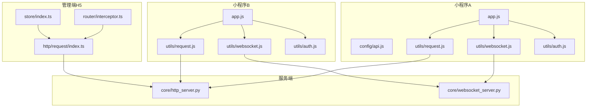
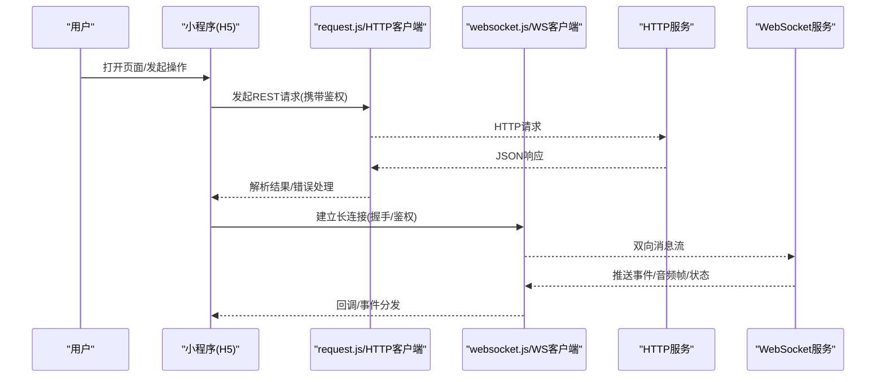
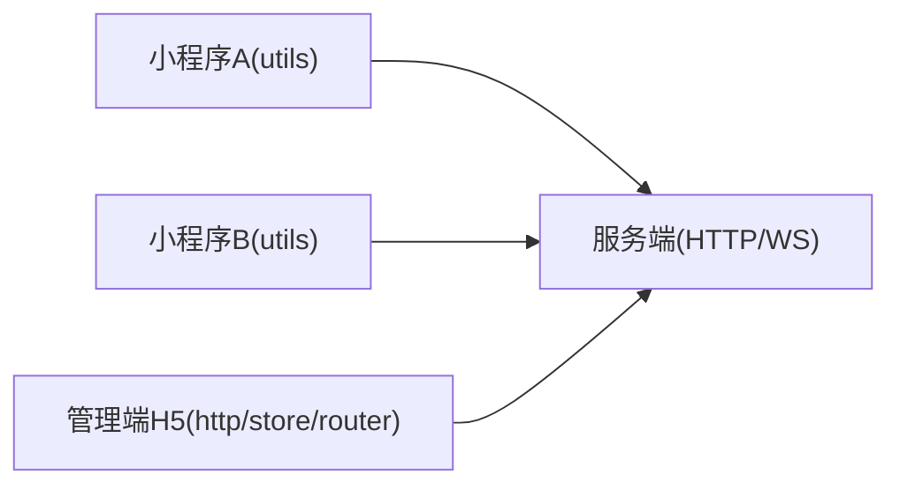

# 小程序架构设计

<cite>
**本文引用的文件**   
- [egg-miniprogram/DESIGN.md](file://main/egg-miniprogram/DESIGN.md)
- [egg-miniprogram/app.json](file://main/egg-miniprogram/miniprogram/app.json)
- [egg-miniprogram/app.js](file://main/egg-miniprogram/miniprogram/app.js)
- [egg-miniprogram/config/api.js](file://main/egg-miniprogram/miniprogram/config/api.js)
- [egg-miniprogram/utils/request.js](file://main/egg-miniprogram/miniprogram/utils/request.js)
- [egg-miniprogram/utils/websocket.js](file://main/egg-miniprogram/miniprogram/utils/websocket.js)
- [egg-miniprogram/utils/auth.js](file://main/egg-miniprogram/miniprogram/utils/auth.js)
- [miniprogram/DESIGN.md](file://main/miniprogram/DESIGN.md)
- [miniprogram/app.json](file://main/miniprogram/app.json)
- [miniprogram/app.js](file://main/miniprogram/app.js)
- [miniprogram/utils/request.js](file://main/miniprogram/utils/request.js)
- [miniprogram/utils/websocket.js](file://main/miniprogram/utils/websocket.js)
- [miniprogram/utils/auth.js](file://main/miniprogram/utils/auth.js)
- [manager-mobile/src/http/request/index.ts](file://main/manager-mobile/src/http/request/index.ts)
- [manager-mobile/src/store/index.ts](file://main/manager-mobile/src/store/index.ts)
- [manager-mobile/src/router/interceptor.ts](file://main/manager-mobile/src/router/interceptor.ts)
- [xiaozhi-server/core/http_server.py](file://main/xiaozhi-server/core/http_server.py)
- [xiaozhi-server/core/websocket_server.py](file://main/xiaozhi-server/core/websocket_server.py)
</cite>

## 目录
1. [引言](#引言)
2. [项目结构](#项目结构)
3. [核心组件](#核心组件)
4. [架构总览](#架构总览)
5. [详细组件分析](#详细组件分析)
6. [依赖分析](#依赖分析)
7. [性能考虑](#性能考虑)
8. [故障排查指南](#故障排查指南)
9. [结论](#结论)
10. [附录](#附录)

## 引言
本文件面向“小程序生态系统”的架构设计，聚焦两个小程序（egg-miniprogram 与 miniprogram）的共同架构模式、设计原则与技术选型。文档从分层架构、模块化设计、依赖管理策略入手，系统阐述前后端通信协议、API 接口设计、数据格式规范；并覆盖状态管理、事件总线、全局变量管理、插件与扩展机制、第三方服务集成；最后给出缓存策略、离线支持与性能监控方案，配合架构图表展示组件关系、数据流向与调用层次。

## 项目结构
仓库包含多个前端与后端子系统：
- 小程序 A：main/egg-miniprogram（微信原生小程序）
- 小程序 B：main/miniprogram（微信原生小程序）
- 管理端 H5：main/manager-mobile（uni-app + TypeScript）
- 服务端：main/xiaozhi-server（Python HTTP/WebSocket 服务）

图表来源
- [egg-miniprogram/app.js](file://main/egg-miniprogram/miniprogram/app.js)
- [egg-miniprogram/config/api.js](file://main/egg-miniprogram/miniprogram/config/api.js)
- [egg-miniprogram/utils/request.js](file://main/egg-miniprogram/miniprogram/utils/request.js)
- [egg-miniprogram/utils/websocket.js](file://main/egg-miniprogram/miniprogram/utils/websocket.js)
- [egg-miniprogram/utils/auth.js](file://main/egg-miniprogram/miniprogram/utils/auth.js)
- [miniprogram/app.js](file://main/miniprogram/app.js)
- [miniprogram/utils/request.js](file://main/miniprogram/utils/request.js)
- [miniprogram/utils/websocket.js](file://main/miniprogram/utils/websocket.js)
- [miniprogram/utils/auth.js](file://main/miniprogram/utils/auth.js)
- [manager-mobile/src/http/request/index.ts](file://main/manager-mobile/src/http/request/index.ts)
- [manager-mobile/src/store/index.ts](file://main/manager-mobile/src/store/index.ts)
- [manager-mobile/src/router/interceptor.ts](file://main/manager-mobile/src/router/interceptor.ts)
- [xiaozhi-server/core/http_server.py](file://main/xiaozhi-server/core/http_server.py)
- [xiaozhi-server/core/websocket_server.py](file://main/xiaozhi-server/core/websocket_server.py)

章节来源
- [egg-miniprogram/DESIGN.md](file://main/egg-miniprogram/DESIGN.md)
- [miniprogram/DESIGN.md](file://main/miniprogram/DESIGN.md)

## 核心组件
- 应用入口与配置
  - 小程序 A/B 均通过 app.js 初始化全局状态、日志、网络与 WebSocket 能力，并在 app.json 中声明页面路由与分包。
- 网络层
  - request.js 统一封装请求拦截、鉴权头注入、错误码处理与重试策略。
  - websocket.js 封装连接建立、心跳保活、断线重连、消息分发与队列。
- 认证与安全
  - auth.js 负责登录态获取、Token 存储与刷新、权限校验。
- 管理端 H5
  - http/request/index.ts 提供统一的 HTTP 客户端；store/index.ts 集中式状态管理；router/interceptor.ts 实现路由守卫与鉴权拦截。

章节来源
- [egg-miniprogram/app.js](file://main/egg-miniprogram/miniprogram/app.js)
- [egg-miniprogram/app.json](file://main/egg-miniprogram/miniprogram/app.json)
- [egg-miniprogram/utils/request.js](file://main/egg-miniprogram/miniprogram/utils/request.js)
- [egg-miniprogram/utils/websocket.js](file://main/egg-miniprogram/miniprogram/utils/websocket.js)
- [egg-miniprogram/utils/auth.js](file://main/egg-miniprogram/miniprogram/utils/auth.js)
- [miniprogram/app.js](file://main/miniprogram/app.js)
- [miniprogram/utils/request.js](file://main/miniprogram/utils/request.js)
- [miniprogram/utils/websocket.js](file://main/miniprogram/utils/websocket.js)
- [miniprogram/utils/auth.js](file://main/miniprogram/utils/auth.js)
- [manager-mobile/src/http/request/index.ts](file://main/manager-mobile/src/http/request/index.ts)
- [manager-mobile/src/store/index.ts](file://main/manager-mobile/src/store/index.ts)
- [manager-mobile/src/router/interceptor.ts](file://main/manager-mobile/src/router/interceptor.ts)

## 架构总览
整体采用“小程序/H5 前端 — 服务端 HTTP/WebSocket 网关 — 业务模块”的分层架构。小程序侧以模块化组织页面、组件、工具库与服务层；服务端提供 RESTful API 与实时双向通道，支撑语音通话、设备控制、内容交互等场景。

图表来源
- [egg-miniprogram/utils/request.js](file://main/egg-miniprogram/miniprogram/utils/request.js)
- [egg-miniprogram/utils/websocket.js](file://main/egg-miniprogram/miniprogram/utils/websocket.js)
- [miniprogram/utils/request.js](file://main/miniprogram/utils/request.js)
- [miniprogram/utils/websocket.js](file://main/miniprogram/utils/websocket.js)
- [xiaozhi-server/core/http_server.py](file://main/xiaozhi-server/core/http_server.py)
- [xiaozhi-server/core/websocket_server.py](file://main/xiaozhi-server/core/websocket_server.py)

## 详细组件分析

### 小程序通用分层与模块化
- 分层
  - 表现层：pages 与 components
  - 逻辑层：各页面的 logic.js / 业务方法
  - 服务层：services、utils（请求、WebSocket、鉴权、音频等）
  - 配置层：config（API 列表、常量、开关）
- 模块化
  - 按功能域拆分 utils/services/config，避免单文件膨胀
  - 通过 app.js 挂载全局能力（如 logger、auth、network），页面按需引入
- 依赖管理
  - 使用相对路径与别名（如有）明确依赖边界
  - 对第三方 SDK 进行二次封装，屏蔽平台差异

章节来源
- [egg-miniprogram/DESIGN.md](file://main/egg-miniprogram/DESIGN.md)
- [miniprogram/DESIGN.md](file://main/miniprogram/DESIGN.md)

### 前后端通信协议与 API 设计
- 协议
  - HTTP/HTTPS：用于鉴权、配置、资源拉取、业务 CRUD
  - WebSocket：用于实时音视频、设备指令、事件推送
- 接口设计
  - 统一返回体：code、message、data
  - 鉴权：Header 或 Query 中携带 Token，服务端校验后下发会话上下文
  - 分页：page/pageSize 或 cursor
- 数据格式
  - JSON 为主，二进制（如音频）通过分片或 Base64/URL 方式传输

章节来源
- [egg-miniprogram/config/api.js](file://main/egg-miniprogram/miniprogram/config/api.js)
- [egg-miniprogram/utils/request.js](file://main/egg-miniprogram/miniprogram/utils/request.js)
- [miniprogram/utils/request.js](file://main/miniprogram/utils/request.js)
- [xiaozhi-server/core/http_server.py](file://main/xiaozhi-server/core/http_server.py)

### 状态管理与事件总线
- 小程序
  - 页面级 state：data + 局部方法
  - 应用级 state：app.globalData 或 store（若引入）
  - 事件总线：自定义事件中心（发布/订阅）解耦跨页通信
- 管理端 H5
  - store/index.ts 集中式状态管理，模块划分清晰
  - router/interceptor.ts 做路由级鉴权与全局提示

章节来源
- [egg-miniprogram/app.js](file://main/egg-miniprogram/miniprogram/app.js)
- [miniprogram/app.js](file://main/miniprogram/app.js)
- [manager-mobile/src/store/index.ts](file://main/manager-mobile/src/store/index.ts)
- [manager-mobile/src/router/interceptor.ts](file://main/manager-mobile/src/router/interceptor.ts)

### 插件架构与扩展机制
- 服务端插件
  - 通过 plugins_func 加载外部函数，支持 ASR/TTS/LLM/工具等可插拔实现
- 小程序扩展
  - 组件化复用：公共组件抽取至 components
  - 能力扩展：通过 utils/services 封装第三方 SDK，对外暴露统一接口

章节来源
- [xiaozhi-server/plugins_func/loadplugins.py](file://main/xiaozhi-server/plugins_func/loadplugins.py)
- [xiaozhi-server/plugins_func/register.py](file://main/xiaozhi-server/plugins_func/register.py)

### 第三方服务集成
- 身份认证：微信登录流程，服务端校验后签发 Token
- 音视频：WebRTC/私有协议通过 WebSocket 承载信令与媒体流
- 云厂商：短信、对象存储、支付等通过独立 service 模块接入

章节来源
- [egg-miniprogram/utils/auth.js](file://main/egg-miniprogram/miniprogram/utils/auth.js)
- [miniprogram/utils/auth.js](file://main/miniprogram/utils/auth.js)
- [xiaozhi-server/core/websocket_server.py](file://main/xiaozhi-server/core/websocket_server.py)

### 缓存策略与离线支持
- 本地缓存
  - 小程序：wx.setStorageSync/getStorageSync 缓存配置、临时资源、鉴权信息
  - H5：localStorage/sessionStorage 与 Service Worker 缓存静态资源
- 离线策略
  - 关键页面首屏资源预缓存
  - 网络失败降级：返回空数据或占位图，提示用户重试

章节来源
- [egg-miniprogram/utils/request.js](file://main/egg-miniprogram/miniprogram/utils/request.js)
- [miniprogram/utils/request.js](file://main/miniprogram/utils/request.js)
- [manager-mobile/src/http/request/index.ts](file://main/manager-mobile/src/http/request/index.ts)

### 性能监控与埋点
- 前端埋点
  - 页面生命周期、接口耗时、错误上报
- 服务端监控
  - 请求链路追踪、慢查询告警、资源使用率

章节来源
- [egg-miniprogram/utils/request.js](file://main/egg-miniprogram/miniprogram/utils/request.js)
- [miniprogram/utils/request.js](file://main/miniprogram/utils/request.js)
- [manager-mobile/src/http/request/index.ts](file://main/manager-mobile/src/http/request/index.ts)

## 依赖分析
- 耦合度
  - 小程序与 server 仅通过 HTTP/WebSocket 契约耦合，低耦合高内聚
  - 各小程序共享相似 utils/services 抽象，便于复用
- 循环依赖
  - 通过事件总线与模块化拆分避免循环引用
- 外部依赖
  - 微信原生 API、第三方 SDK 统一在 utils/services 层封装

图表来源
- [egg-miniprogram/utils/request.js](file://main/egg-miniprogram/miniprogram/utils/request.js)
- [egg-miniprogram/utils/websocket.js](file://main/egg-miniprogram/miniprogram/utils/websocket.js)
- [miniprogram/utils/request.js](file://main/miniprogram/utils/request.js)
- [miniprogram/utils/websocket.js](file://main/miniprogram/utils/websocket.js)
- [manager-mobile/src/http/request/index.ts](file://main/manager-mobile/src/http/request/index.ts)
- [xiaozhi-server/core/http_server.py](file://main/xiaozhi-server/core/http_server.py)
- [xiaozhi-server/core/websocket_server.py](file://main/xiaozhi-server/core/websocket_server.py)

章节来源
- [egg-miniprogram/utils/request.js](file://main/egg-miniprogram/miniprogram/utils/request.js)
- [miniprogram/utils/request.js](file://main/miniprogram/utils/request.js)
- [manager-mobile/src/http/request/index.ts](file://main/manager-mobile/src/http/request/index.ts)

## 性能考虑
- 网络优化
  - 请求合并、去抖节流、超时与重试、压缩与缓存
- 渲染优化
  - 分包加载、懒加载、虚拟列表、图片压缩与 CDN
- 实时通信
  - 心跳保活、断线重连、背压与限流、音频编码优化（Opus）
- 服务端
  - 连接池、异步 I/O、缓存中间件、水平扩展

[本节为通用指导，不直接分析具体文件]

## 故障排查指南
- 常见问题
  - 鉴权失败：检查 Token 有效期与刷新流程
  - WebSocket 断开：检查心跳、防火墙与代理配置
  - 接口超时：检查服务端负载与数据库慢查询
- 定位手段
  - 前端日志：统一 logger 输出到控制台/云端
  - 抓包：Charles/Fiddler 查看请求链路
  - 服务端日志：TraceId 关联全链路

章节来源
- [egg-miniprogram/utils/request.js](file://main/egg-miniprogram/miniprogram/utils/request.js)
- [miniprogram/utils/request.js](file://main/miniprogram/utils/request.js)
- [manager-mobile/src/http/request/index.ts](file://main/manager-mobile/src/http/request/index.ts)

## 结论
两个小程序在服务端契约一致的前提下，采用相近的分层与模块化设计，具备良好可维护性与扩展性。通过统一的 HTTP/WebSocket 客户端、鉴权与错误处理，保障稳定性与一致性。结合缓存、离线与监控策略，可在复杂网络环境下提供稳定体验。建议持续完善插件化能力与性能观测体系，进一步提升生态的可扩展性与可运维性。

## 附录
- 术语
  - 小程序：微信原生小程序（egg-miniprogram、miniprogram）
  - 管理端 H5：基于 uni-app 的管理后台
  - 服务端：Python 实现的 HTTP/WebSocket 服务
- 参考
  - 各小程序 DESIGN.md 中的架构说明与演进规划

[本节为补充说明，不直接分析具体文件]