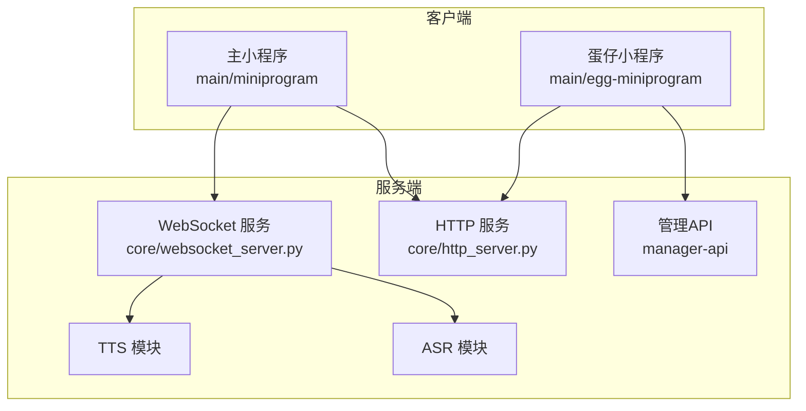
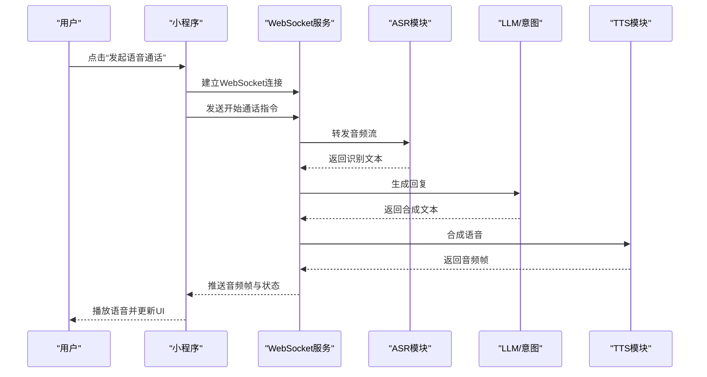
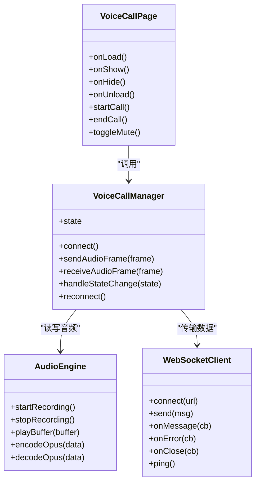
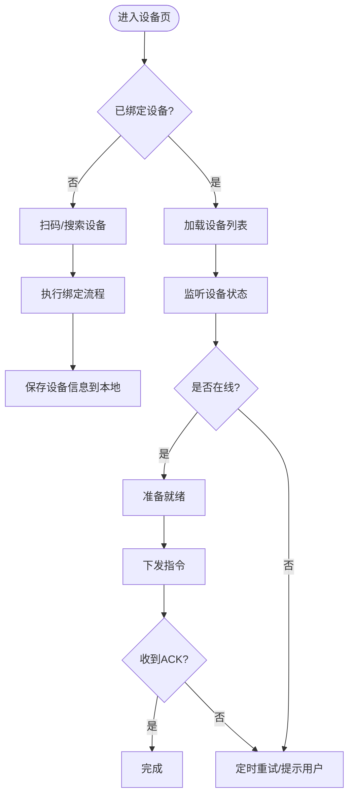
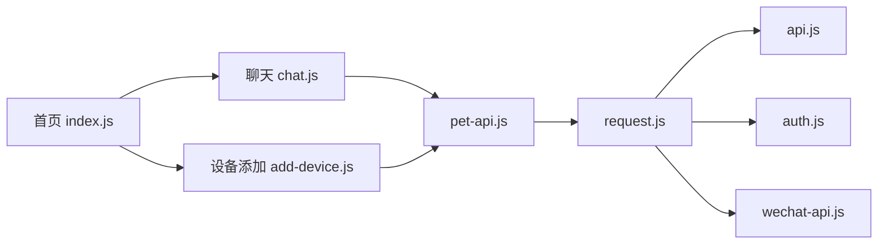
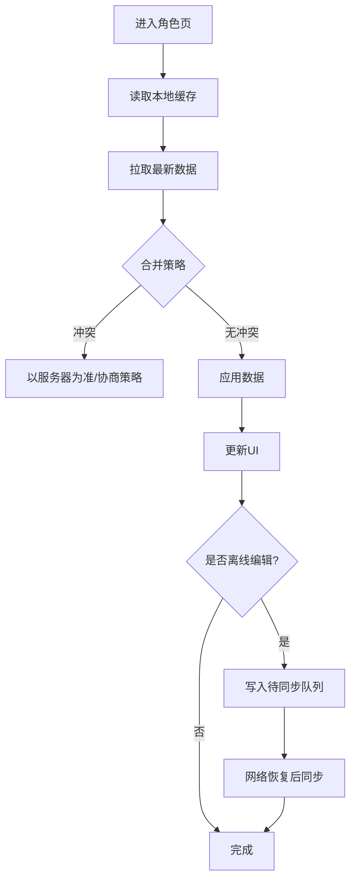
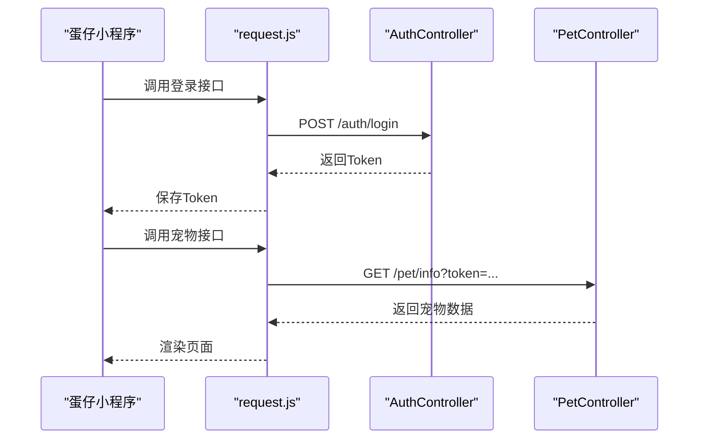
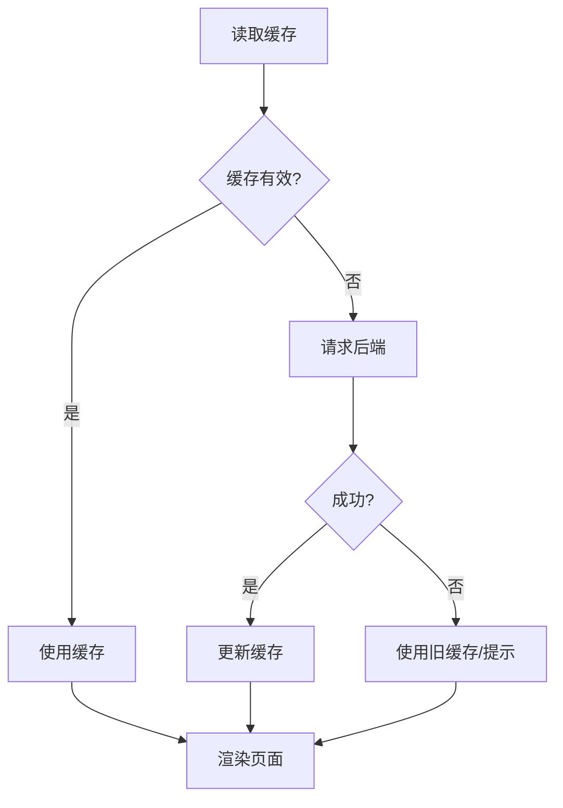
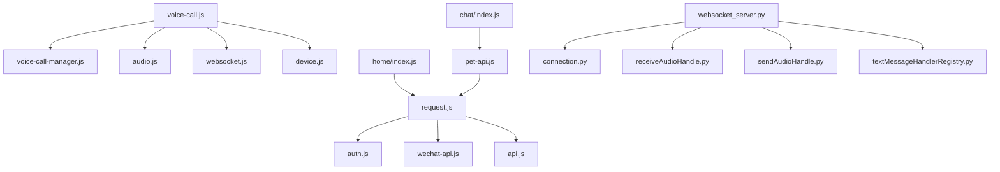

# 小程序生态

<cite>
**本文引用的文件**   
- [app.js](file://main/miniprogram/app.js)
- [app.json](file://main/miniprogram/app.json)
- [voice-call.js](file://main/miniprogram/pages/voice-call/voice-call.js)
- [voice-call-manager.js](file://main/miniprogram/utils/voice-call-manager.js)
- [websocket.js](file://main/miniprogram/utils/websocket.js)
- [audio.js](file://main/miniprogram/utils/audio.js)
- [device.js](file://main/miniprogram/utils/device.js)
- [egg-miniprogram/app.json](file://main/egg-miniprogram/miniprogram/app.json)
- [egg-miniprogram/config/api.js](file://main/egg-miniprogram/miniprogram/config/api.js)
- [egg-miniprogram/utils/request.js](file://main/egg-miniprogram/miniprogram/utils/request.js)
- [egg-miniprogram/utils/websocket.js](file://main/egg-miniprogram/miniprogram/utils/websocket.js)
- [egg-miniprogram/utils/auth.js](file://main/egg-miniprogram/miniprogram/utils/auth.js)
- [egg-miniprogram/utils/pet-api.js](file://main/egg-miniprogram/miniprogram/utils/pet-api.js)
- [egg-miniprogram/utils/wechat-api.js](file://main/egg-miniprogram/miniprogram/utils/wechat-api.js)
- [egg-miniprogram/pages/home/index.js](file://main/egg-miniprogram/miniprogram/pages/home/index.js)
- [egg-miniprogram/pages/chat/index.js](file://main/egg-miniprogram/miniprogram/pages/chat/index.js)
- [egg-miniprogram/pages/add-device/index.js](file://main/egg-miniprogram/miniprogram/pages/add-device/index.js)
- [egg-miniprogram/docs/page-navigation.md](file://main/egg-miniprogram/docs/page-navigation.md)
- [egg-miniprogram/DESIGN.md](file://main/egg-miniprogram/DESIGN.md)
- [egg-miniprogram/README.md](file://main/egg-miniprogram/README.md)
- [egg-miniprogram/project.config.json](file://main/egg-miniprogram/project.config.json)
- [egg-miniprogram/scripts/verify-project.js](file://main/egg-miniprogram/scripts/verify-project.js)
- [xiaozhi-server/app.py](file://main/xiaozhi-server/app.py)
- [xiaozhi-server/core/http_server.py](file://main/xiaozhi-server/core/http_server.py)
- [xiaozhi-server/core/websocket_server.py](file://main/xiaozhi-server/core/websocket_server.py)
- [xiaozhi-server/core/connection.py](file://main/xiaozhi-server/core/connection.py)
- [xiaozhi-server/core/handle/receiveAudioHandle.py](file://main/xiaozhi-server/core/handle/receiveAudioHandle.py)
- [xiaozhi-server/core/handle/sendAudioHandle.py](file://main/xiaozhi-server/core/handle/sendAudioHandle.py)
- [xiaozhi-server/core/handle/textMessageHandlerRegistry.py](file://main/xiaozhi-server/core/handle/textMessageHandlerRegistry.py)
- [xiaozhi-server/core/handle/textMessageType.py](file://main/xiaozhi-server/core/handle/textMessageType.py)
- [xiaozhi-server/core/providers/asr/__init__.py](file://main/xiaozhi-server/core/providers/asr/__init__.py)
- [xiaozhi-server/core/providers/tts/__init__.py](file://main/xiaozhi-server/core/providers/tts/__init__.py)
- [manager-api/src/main/java/xiaozhi/controller/AuthController.java](file://manager-api/src/main/java/xiaozhi/controller/AuthController.java)
- [manager-api/src/main/java/xiaozhi/controller/PetController.java](file://manager-api/src/main/java/xiaozhi/controller/PetController.java)
</cite>

## 目录
1. [简介](#简介)
2. [项目结构](#项目结构)
3. [核心组件](#核心组件)
4. [架构总览](#架构总览)
5. [详细组件分析](#详细组件分析)
6. [依赖关系分析](#依赖关系分析)
7. [性能考量](#性能考量)
8. [故障排查指南](#故障排查指南)
9. [结论](#结论)
10. [附录](#附录)

## 简介
本技术文档面向“小程序生态系统”，聚焦微信小程序与蛋仔小程序的实现，覆盖页面导航、音频处理、WebSocket 通信、设备连接管理；并深入说明蛋仔小程序的游戏化能力（角色系统、成就机制、社交互动、数据存储）。同时给出前后端通信协议、数据同步与离线缓存策略，以及开发规范、调试技巧、性能优化方法。文末提供语音通话、设备消息处理、用户状态管理的示例路径，并补充发布流程、版本管理与用户反馈收集等运营要点。

## 项目结构
仓库包含多条产品线：
- 主小程序 main/miniprogram：通用能力与语音通话、设备管理等基础功能
- 蛋仔小程序 main/egg-miniprogram：游戏化体验（角色、成就、社交、宠物养成）
- 服务端 main/xiaozhi-server：WebSocket/HTTP 服务、ASR/TTS、消息路由
- 管理后台 manager-api：Java 后端，提供认证、宠物等业务接口
- 其他辅助工程与文档

图表来源
- [app.json](file://main/miniprogram/app.json)
- [egg-miniprogram/app.json](file://main/egg-miniprogram/miniprogram/app.json)
- [xiaozhi-server/core/http_server.py](file://main/xiaozhi-server/core/http_server.py)
- [xiaozhi-server/core/websocket_server.py](file://main/xiaozhi-server/core/websocket_server.py)

章节来源
- [app.json](file://main/miniprogram/app.json)
- [egg-miniprogram/app.json](file://main/egg-miniprogram/miniprogram/app.json)
- [egg-miniprogram/README.md](file://main/egg-miniprogram/README.md)

## 核心组件
- 页面与导航
  - 主小程序通过 app.json 定义页面与 TabBar，页面间跳转使用 wx.navigateTo/wx.redirectTo 等
  - 蛋仔小程序在 docs/page-navigation.md 中约定了页面结构与路由策略
- 音频处理
  - 主小程序 utils/audio.js 封装录音、播放、编码解码（Opus）与流式控制
  - 语音通话页 voice-call.js 结合 voice-call-manager.js 管理通话生命周期
- WebSocket 通信
  - utils/websocket.js 封装连接、心跳、重连、消息分发
- 设备连接管理
  - utils/device.js 负责设备发现、绑定、状态上报与指令下发
- 蛋仔业务
  - config/api.js 集中配置后端接口
  - utils/request.js 统一请求封装（鉴权、重试、错误码处理）
  - utils/pet-api.js 提供宠物相关接口调用
  - utils/wechat-api.js 封装微信登录、用户信息获取等能力
  - utils/auth.js 维护登录态与 Token

章节来源
- [app.json](file://main/miniprogram/app.json)
- [egg-miniprogram/docs/page-navigation.md](file://main/egg-miniprogram/docs/page-navigation.md)
- [egg-miniprogram/DESIGN.md](file://main/egg-miniprogram/DESIGN.md)
- [egg-miniprogram/config/api.js](file://main/egg-miniprogram/miniprogram/config/api.js)
- [egg-miniprogram/utils/request.js](file://main/egg-miniprogram/miniprogram/utils/request.js)
- [egg-miniprogram/utils/pet-api.js](file://main/egg-miniprogram/miniprogram/utils/pet-api.js)
- [egg-miniprogram/utils/wechat-api.js](file://main/egg-miniprogram/miniprogram/utils/wechat-api.js)
- [egg-miniprogram/utils/auth.js](file://main/egg-miniprogram/miniprogram/utils/auth.js)
- [main/miniprogram/utils/audio.js](file://main/miniprogram/utils/audio.js)
- [main/miniprogram/utils/websocket.js](file://main/miniprogram/utils/websocket.js)
- [main/miniprogram/utils/device.js](file://main/miniprogram/utils/device.js)
- [main/miniprogram/pages/voice-call/voice-call.js](file://main/miniprogram/pages/voice-call/voice-call.js)
- [main/miniprogram/utils/voice-call-manager.js](file://main/miniprogram/utils/voice-call-manager.js)

## 架构总览
整体采用“小程序前端 + WebSocket/HTTP 双通道 + 服务端多模块”的架构。小程序通过 HTTP 完成鉴权与业务数据交互，通过 WebSocket 实现低延迟音视频与实时消息。服务端将 ASR/TTS、意图识别、记忆系统等解耦为可插拔 Provider，并通过消息类型注册表进行路由。

图表来源
- [xiaozhi-server/core/websocket_server.py](file://main/xiaozhi-server/core/websocket_server.py)
- [xiaozhi-server/core/handle/receiveAudioHandle.py](file://main/xiaozhi-server/core/handle/receiveAudioHandle.py)
- [xiaozhi-server/core/handle/sendAudioHandle.py](file://main/xiaozhi-server/core/handle/sendAudioHandle.py)
- [xiaozhi-server/core/handle/textMessageHandlerRegistry.py](file://main/xiaozhi-server/core/handle/textMessageHandlerRegistry.py)
- [xiaozhi-server/core/handle/textMessageType.py](file://main/xiaozhi-server/core/handle/textMessageType.py)
- [xiaozhi-server/core/providers/asr/__init__.py](file://main/xiaozhi-server/core/providers/asr/__init__.py)
- [xiaozhi-server/core/providers/tts/__init__.py](file://main/xiaozhi-server/core/providers/tts/__init__.py)

章节来源
- [xiaozhi-server/core/websocket_server.py](file://main/xiaozhi-server/core/websocket_server.py)
- [xiaozhi-server/core/connection.py](file://main/xiaozhi-server/core/connection.py)
- [xiaozhi-server/core/handle/receiveAudioHandle.py](file://main/xiaozhi-server/core/handle/receiveAudioHandle.py)
- [xiaozhi-server/core/handle/sendAudioHandle.py](file://main/xiaozhi-server/core/handle/sendAudioHandle.py)
- [xiaozhi-server/core/handle/textMessageHandlerRegistry.py](file://main/xiaozhi-server/core/handle/textMessageHandlerRegistry.py)
- [xiaozhi-server/core/handle/textMessageType.py](file://main/xiaozhi-server/core/handle/textMessageType.py)

## 详细组件分析

### 语音通话（主小程序）
- 入口与生命周期
  - 语音通话页 voice-call.js 负责 UI 与事件绑定，调用 voice-call-manager.js 管理通话状态机（空闲、呼叫中、通话中、挂断）
- 音频采集与播放
  - utils/audio.js 封装录音、播放、静音、音量控制与 Opus 编解码
- 网络通道
  - utils/websocket.js 负责连接、心跳、断线重连、消息订阅与分发
- 设备协同
  - utils/device.js 处理设备在线状态、指令下发与状态回传

图表来源
- [main/miniprogram/pages/voice-call/voice-call.js](file://main/miniprogram/pages/voice-call/voice-call.js)
- [main/miniprogram/utils/voice-call-manager.js](file://main/miniprogram/utils/voice-call-manager.js)
- [main/miniprogram/utils/audio.js](file://main/miniprogram/utils/audio.js)
- [main/miniprogram/utils/websocket.js](file://main/miniprogram/utils/websocket.js)

章节来源
- [main/miniprogram/pages/voice-call/voice-call.js](file://main/miniprogram/pages/voice-call/voice-call.js)
- [main/miniprogram/utils/voice-call-manager.js](file://main/miniprogram/utils/voice-call-manager.js)
- [main/miniprogram/utils/audio.js](file://main/miniprogram/utils/audio.js)
- [main/miniprogram/utils/websocket.js](file://main/miniprogram/utils/websocket.js)

### 设备连接管理（主小程序）
- 设备发现与绑定
  - 通过 device.js 调用后端接口或扫码流程完成绑定，维护设备列表与当前选中设备
- 状态同步
  - 监听设备状态上报（在线/离线、电量、信号），本地缓存最近一次状态，异常时提示用户
- 指令下发
  - 支持 OTA 升级、配置变更、功能开关等指令，带重试与超时控制

图表来源
- [main/miniprogram/utils/device.js](file://main/miniprogram/utils/device.js)
- [main/miniprogram/utils/websocket.js](file://main/miniprogram/utils/websocket.js)

章节来源
- [main/miniprogram/utils/device.js](file://main/miniprogram/utils/device.js)
- [main/miniprogram/utils/websocket.js](file://main/miniprogram/utils/websocket.js)

### 蛋仔小程序：页面导航与业务分层
- 页面导航
  - 遵循 docs/page-navigation.md 约定的页面组织与路由策略，TabBar 与子页面分离，避免深层嵌套
- 业务分层
  - 配置集中在 config/api.js，请求封装在 utils/request.js，业务接口在 pet-api.js，微信能力在 wechat-api.js，鉴权在 auth.js
- 典型页面
  - home/index.js 首页聚合入口
  - chat/index.js 聊天与任务入口
  - add-device/index.js 设备添加流程

图表来源
- [egg-miniprogram/pages/home/index.js](file://main/egg-miniprogram/miniprogram/pages/home/index.js)
- [egg-miniprogram/pages/chat/index.js](file://main/egg-miniprogram/miniprogram/pages/chat/index.js)
- [egg-miniprogram/pages/add-device/index.js](file://main/egg-miniprogram/miniprogram/pages/add-device/index.js)
- [egg-miniprogram/config/api.js](file://main/egg-miniprogram/miniprogram/config/api.js)
- [egg-miniprogram/utils/request.js](file://main/egg-miniprogram/miniprogram/utils/request.js)
- [egg-miniprogram/utils/pet-api.js](file://main/egg-miniprogram/miniprogram/utils/pet-api.js)
- [egg-miniprogram/utils/auth.js](file://main/egg-miniprogram/miniprogram/utils/auth.js)
- [egg-miniprogram/utils/wechat-api.js](file://main/egg-miniprogram/miniprogram/utils/wechat-api.js)

章节来源
- [egg-miniprogram/docs/page-navigation.md](file://main/egg-miniprogram/docs/page-navigation.md)
- [egg-miniprogram/DESIGN.md](file://main/egg-miniprogram/DESIGN.md)
- [egg-miniprogram/config/api.js](file://main/egg-miniprogram/miniprogram/config/api.js)
- [egg-miniprogram/utils/request.js](file://main/egg-miniprogram/miniprogram/utils/request.js)
- [egg-miniprogram/utils/pet-api.js](file://main/egg-miniprogram/miniprogram/utils/pet-api.js)
- [egg-miniprogram/utils/auth.js](file://main/egg-miniprogram/miniprogram/utils/auth.js)
- [egg-miniprogram/utils/wechat-api.js](file://main/egg-miniprogram/miniprogram/utils/wechat-api.js)

### 蛋仔小程序：游戏化能力（角色、成就、社交、存储）
- 角色系统
  - 角色属性、外观、技能通过 pet-api.js 暴露的接口进行获取与更新，本地缓存最近一次角色数据
- 成就机制
  - 成就进度由后端统计，前端轮询或 WebSocket 推送更新，失败时降级为本地记录
- 社交互动
  - 好友邀请、分享、排行榜等通过 wechat-api.js 与后端接口协作
- 数据存储
  - 关键数据落盘（如角色快照、成就进度），网络不可用时允许离线编辑，恢复后增量同步

图表来源
- [egg-miniprogram/utils/pet-api.js](file://main/egg-miniprogram/miniprogram/utils/pet-api.js)
- [egg-miniprogram/utils/request.js](file://main/egg-miniprogram/miniprogram/utils/request.js)
- [egg-miniprogram/utils/auth.js](file://main/egg-miniprogram/miniprogram/utils/auth.js)

章节来源
- [egg-miniprogram/utils/pet-api.js](file://main/egg-miniprogram/miniprogram/utils/pet-api.js)
- [egg-miniprogram/utils/request.js](file://main/egg-miniprogram/miniprogram/utils/request.js)
- [egg-miniprogram/utils/auth.js](file://main/egg-miniprogram/miniprogram/utils/auth.js)

### 小程序与后端通信协议与数据同步
- 鉴权与会话
  - 小程序通过 wechat-api.js 获取登录态，使用 request.js 携带 Token 访问后端
- HTTP 接口
  - 管理端 Java 控制器提供认证与宠物相关接口（AuthController、PetController）
- WebSocket 协议
  - 服务端 websocket_server.py 接收连接，connection.py 管理会话，receiveAudioHandle.py/sendAudioHandle.py 处理音频流，textMessageHandlerRegistry.py 按 textMessageType.py 分发消息

图表来源
- [egg-miniprogram/utils/request.js](file://main/egg-miniprogram/miniprogram/utils/request.js)
- [manager-api/src/main/java/xiaozhi/controller/AuthController.java](file://manager-api/src/main/java/xiaozhi/controller/AuthController.java)
- [manager-api/src/main/java/xiaozhi/controller/PetController.java](file://manager-api/src/main/java/xiaozhi/controller/PetController.java)

章节来源
- [egg-miniprogram/utils/request.js](file://main/egg-miniprogram/miniprogram/utils/request.js)
- [manager-api/src/main/java/xiaozhi/controller/AuthController.java](file://manager-api/src/main/java/xiaozhi/controller/AuthController.java)
- [manager-api/src/main/java/xiaozhi/controller/PetController.java](file://manager-api/src/main/java/xiaozhi/controller/PetController.java)
- [xiaozhi-server/core/websocket_server.py](file://main/xiaozhi-server/core/websocket_server.py)
- [xiaozhi-server/core/connection.py](file://main/xiaozhi-server/core/connection.py)
- [xiaozhi-server/core/handle/receiveAudioHandle.py](file://main/xiaozhi-server/core/handle/receiveAudioHandle.py)
- [xiaozhi-server/core/handle/sendAudioHandle.py](file://main/xiaozhi-server/core/handle/sendAudioHandle.py)
- [xiaozhi-server/core/handle/textMessageHandlerRegistry.py](file://main/xiaozhi-server/core/handle/textMessageHandlerRegistry.py)
- [xiaozhi-server/core/handle/textMessageType.py](file://main/xiaozhi-server/core/handle/textMessageType.py)

### 数据同步与离线缓存策略
- 缓存原则
  - 首屏关键数据优先缓存，非关键数据按需加载
- 冲突解决
  - 以服务器时间戳为准，必要时引入版本号或操作日志
- 失败处理
  - 网络异常时进入离线模式，操作入队，恢复后批量同步

图表来源
- [egg-miniprogram/utils/request.js](file://main/egg-miniprogram/miniprogram/utils/request.js)
- [egg-miniprogram/utils/pet-api.js](file://main/egg-miniprogram/miniprogram/utils/pet-api.js)

章节来源
- [egg-miniprogram/utils/request.js](file://main/egg-miniprogram/miniprogram/utils/request.js)
- [egg-miniprogram/utils/pet-api.js](file://main/egg-miniprogram/miniprogram/utils/pet-api.js)

## 依赖关系分析
- 前端依赖
  - 主小程序：voice-call.js 依赖 voice-call-manager.js、audio.js、websocket.js、device.js
  - 蛋仔小程序：各页面依赖 request.js、pet-api.js、auth.js、wechat-api.js、config/api.js
- 后端依赖
  - xiaozhi-server：websocket_server.py 依赖 connection.py、各类 handle 与 providers
  - manager-api：AuthController、PetController 提供 REST 接口

图表来源
- [main/miniprogram/pages/voice-call/voice-call.js](file://main/miniprogram/pages/voice-call/voice-call.js)
- [main/miniprogram/utils/voice-call-manager.js](file://main/miniprogram/utils/voice-call-manager.js)
- [main/miniprogram/utils/audio.js](file://main/miniprogram/utils/audio.js)
- [main/miniprogram/utils/websocket.js](file://main/miniprogram/utils/websocket.js)
- [main/miniprogram/utils/device.js](file://main/miniprogram/utils/device.js)
- [egg-miniprogram/pages/home/index.js](file://main/egg-miniprogram/miniprogram/pages/home/index.js)
- [egg-miniprogram/pages/chat/index.js](file://main/egg-miniprogram/miniprogram/pages/chat/index.js)
- [egg-miniprogram/utils/request.js](file://main/egg-miniprogram/miniprogram/utils/request.js)
- [egg-miniprogram/utils/pet-api.js](file://main/egg-miniprogram/miniprogram/utils/pet-api.js)
- [egg-miniprogram/utils/auth.js](file://main/egg-miniprogram/miniprogram/utils/auth.js)
- [egg-miniprogram/utils/wechat-api.js](file://main/egg-miniprogram/miniprogram/utils/wechat-api.js)
- [egg-miniprogram/config/api.js](file://main/egg-miniprogram/miniprogram/config/api.js)
- [xiaozhi-server/core/websocket_server.py](file://main/xiaozhi-server/core/websocket_server.py)
- [xiaozhi-server/core/connection.py](file://main/xiaozhi-server/core/connection.py)
- [xiaozhi-server/core/handle/receiveAudioHandle.py](file://main/xiaozhi-server/core/handle/receiveAudioHandle.py)
- [xiaozhi-server/core/handle/sendAudioHandle.py](file://main/xiaozhi-server/core/handle/sendAudioHandle.py)
- [xiaozhi-server/core/handle/textMessageHandlerRegistry.py](file://main/xiaozhi-server/core/handle/textMessageHandlerRegistry.py)

章节来源
- [main/miniprogram/pages/voice-call/voice-call.js](file://main/miniprogram/pages/voice-call/voice-call.js)
- [main/miniprogram/utils/voice-call-manager.js](file://main/miniprogram/utils/voice-call-manager.js)
- [main/miniprogram/utils/audio.js](file://main/miniprogram/utils/audio.js)
- [main/miniprogram/utils/websocket.js](file://main/miniprogram/utils/websocket.js)
- [main/miniprogram/utils/device.js](file://main/miniprogram/utils/device.js)
- [egg-miniprogram/pages/home/index.js](file://main/egg-miniprogram/miniprogram/pages/home/index.js)
- [egg-miniprogram/pages/chat/index.js](file://main/egg-miniprogram/miniprogram/pages/chat/index.js)
- [egg-miniprogram/utils/request.js](file://main/egg-miniprogram/miniprogram/utils/request.js)
- [egg-miniprogram/utils/pet-api.js](file://main/egg-miniprogram/miniprogram/utils/pet-api.js)
- [egg-miniprogram/utils/auth.js](file://main/egg-miniprogram/miniprogram/utils/auth.js)
- [egg-miniprogram/utils/wechat-api.js](file://main/egg-miniprogram/miniprogram/utils/wechat-api.js)
- [egg-miniprogram/config/api.js](file://main/egg-miniprogram/miniprogram/config/api.js)
- [xiaozhi-server/core/websocket_server.py](file://main/xiaozhi-server/core/websocket_server.py)
- [xiaozhi-server/core/connection.py](file://main/xiaozhi-server/core/connection.py)
- [xiaozhi-server/core/handle/receiveAudioHandle.py](file://main/xiaozhi-server/core/handle/receiveAudioHandle.py)
- [xiaozhi-server/core/handle/sendAudioHandle.py](file://main/xiaozhi-server/core/handle/sendAudioHandle.py)
- [xiaozhi-server/core/handle/textMessageHandlerRegistry.py](file://main/xiaozhi-server/core/handle/textMessageHandlerRegistry.py)

## 性能考量
- 音频链路
  - 使用 Opus 编码降低带宽，合理设置采样率与帧长，避免频繁 GC
- 网络层
  - WebSocket 心跳保活、指数退避重连、消息去抖与节流
- 渲染优化
  - 减少 setData 频率，分页加载与懒加载资源，图片压缩与 CDN
- 服务端
  - ASR/TTS 异步处理、批量化推理、连接池与线程池调优

[本节为通用指导，不直接分析具体文件]

## 故障排查指南
- 常见问题
  - 语音通话卡顿：检查音频编码参数、网络抖动、服务端负载
  - WebSocket 断线：查看心跳间隔、重连策略、防火墙策略
  - 设备掉线：确认设备状态上报、指令 ACK、网络可达性
- 定位手段
  - 小程序开发者工具 Network/Ws 面板、Console 日志
  - 服务端日志（连接、消息、错误堆栈）
  - 抓包分析（Wireshark/tcpdump）

章节来源
- [main/miniprogram/utils/websocket.js](file://main/miniprogram/utils/websocket.js)
- [main/miniprogram/utils/audio.js](file://main/miniprogram/utils/audio.js)
- [main/miniprogram/utils/device.js](file://main/miniprogram/utils/device.js)
- [xiaozhi-server/core/websocket_server.py](file://main/xiaozhi-server/core/websocket_server.py)
- [xiaozhi-server/core/connection.py](file://main/xiaozhi-server/core/connection.py)

## 结论
本生态以小程序为入口，结合 WebSocket 与 HTTP 双通道，实现了稳定的语音通话与设备管理能力；蛋仔小程序在此基础上构建了完整的角色、成就与社交体系。通过清晰的模块划分与统一的请求封装，提升了可维护性与扩展性。后续建议持续优化音频链路与服务端吞吐，完善离线同步与监控告警，提升用户体验与稳定性。

[本节为总结，不直接分析具体文件]

## 附录

### 开发规范
- 命名与目录
  - 页面按功能分组，utils 存放通用能力，config 集中配置
- 代码风格
  - ESLint/Prettier 统一格式，单元测试覆盖关键逻辑
- 安全
  - Token 存储与刷新、敏感信息加密、权限校验

[本节为通用指导，不直接分析具体文件]

### 调试技巧
- 小程序
  - 开启真机调试、打印关键变量、模拟弱网
- 服务端
  - 启用 DEBUG 日志、慢查询分析、内存/CPU 监控

[本节为通用指导，不直接分析具体文件]

### 性能优化方法
- 前端
  - 分包加载、预取关键数据、减少重绘重排
- 后端
  - 缓存热点数据、异步任务队列、数据库索引优化

[本节为通用指导，不直接分析具体文件]

### 发布流程与版本管理
- 小程序
  - project.config.json 配置环境，scripts/verify-project.js 校验项目完整性，提交前运行构建与测试
- 版本管理
  - 语义化版本、变更日志、灰度发布与回滚策略

章节来源
- [egg-miniprogram/project.config.json](file://main/egg-miniprogram/project.config.json)
- [egg-miniprogram/scripts/verify-project.js](file://main/egg-miniprogram/scripts/verify-project.js)

### 用户反馈收集
- 埋点与日志
  - 关键行为上报、错误捕获与堆栈收集
- 渠道
  - 小程序内反馈入口、客服系统、问卷与评分

[本节为通用指导，不直接分析具体文件]