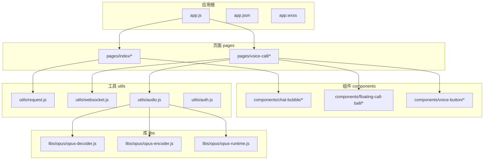
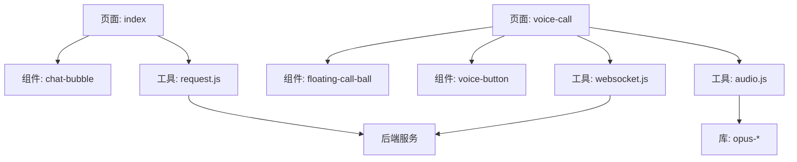
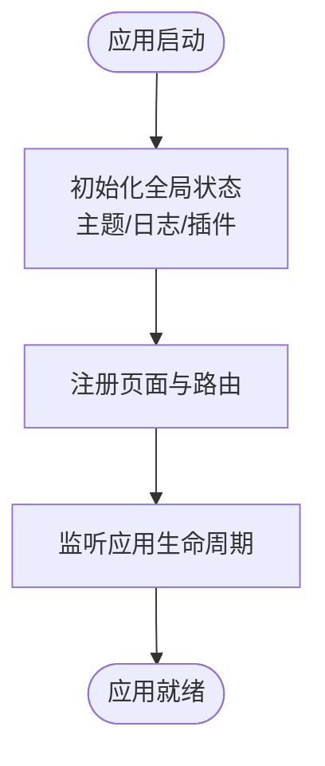
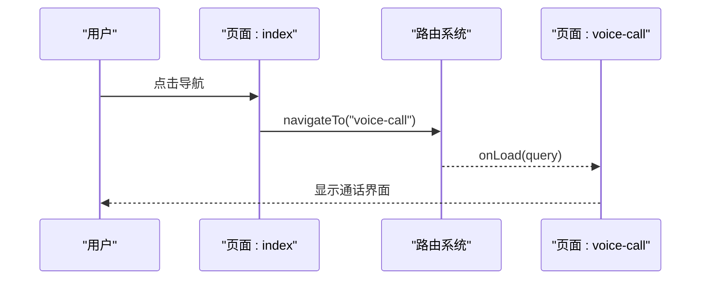
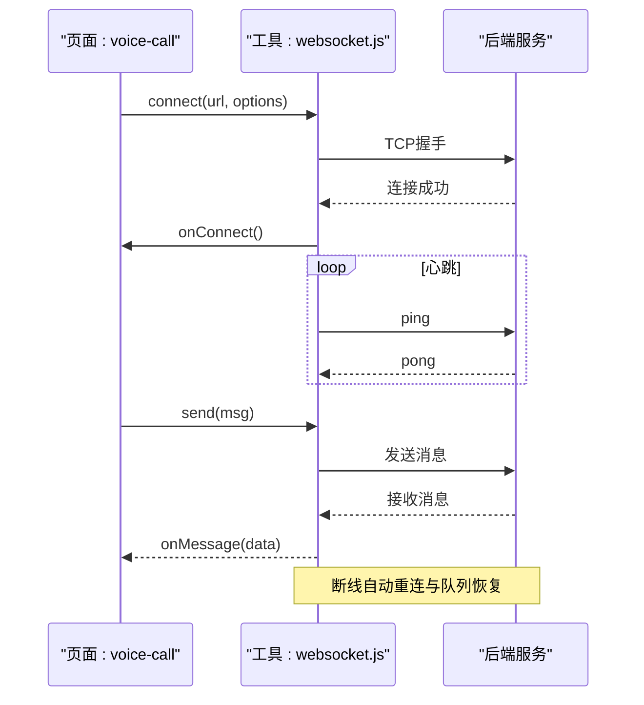
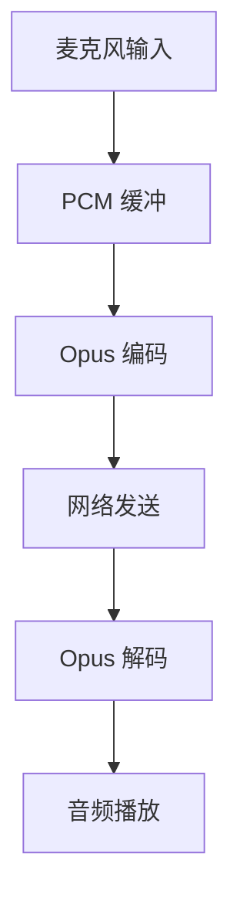
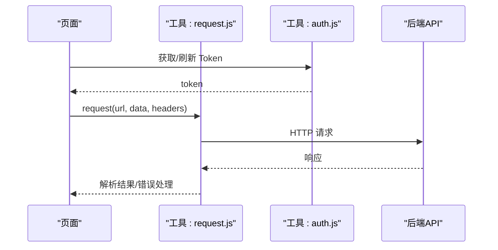
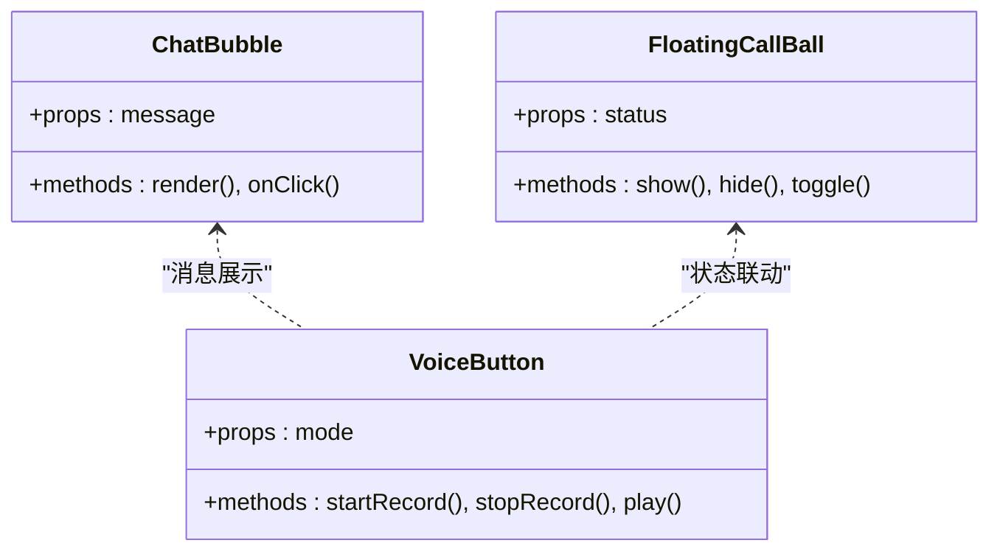
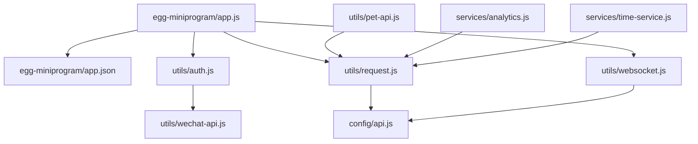
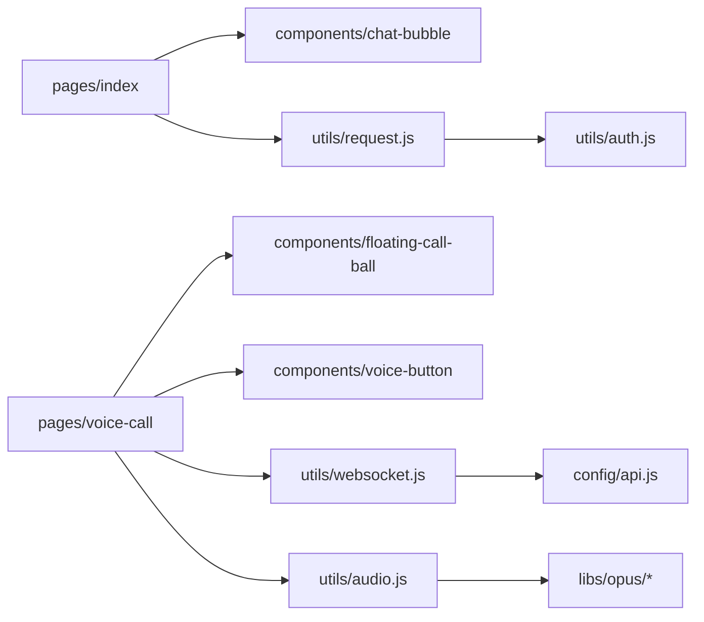

# 小程序架构设计

<cite>
**本文档引用的文件**   
- [app.js](file://main/miniprogram/app.js)
- [app.json](file://main/miniprogram/app.json)
- [app.wxss](file://main/miniprogram/app.wxss)
- [index/index.js](file://main/miniprogram/pages/index/index.js)
- [index/index.wxml](file://main/miniprogram/pages/index/index.wxml)
- [index/index.wxss](file://main/miniprogram/pages/index/index.wxss)
- [voice-call/voice-call.js](file://main/miniprogram/pages/voice-call/voice-call.js)
- [voice-call/voice-call.wxml](file://main/miniprogram/pages/voice-call/voice-call.wxml)
- [chat-bubble/chat-bubble.js](file://main/miniprogram/components/chat-bubble/chat-bubble.js)
- [floating-call-ball/floating-call-ball.js](file://main/miniprogram/components/floating-call-ball/floating-call-ball.js)
- [voice-button/voice-button.js](file://main/miniprogram/components/voice-button/voice-button.js)
- [request.js](file://main/miniprogram/utils/request.js)
- [websocket.js](file://main/miniprogram/utils/websocket.js)
- [audio.js](file://main/miniprogram/utils/audio.js)
- [auth.js](file://main/miniprogram/utils/auth.js)
- [opus-decoder.js](file://main/miniprogram/libs/opus/opus-decoder.js)
- [opus-encoder.js](file://main/miniprogram/libs/opus/opus-encoder.js)
- [opus-runtime.js](file://main/miniprogram/libs/opus/opus-runtime.js)
- [egg-miniprogram/app.json](file://main/egg-miniprogram/miniprogram/app.json)
- [egg-miniprogram/app.js](file://main/egg-miniprogram/miniprogram/app.js)
- [egg-miniprogram/config/api.js](file://main/egg-miniprogram/miniprogram/config/api.js)
- [egg-miniprogram/utils/request.js](file://main/egg-miniprogram/miniprogram/utils/request.js)
- [egg-miniprogram/utils/websocket.js](file://main/egg-miniprogram/miniprogram/utils/websocket.js)
- [egg-miniprogram/utils/auth.js](file://main/egg-miniprogram/miniprogram/utils/auth.js)
- [egg-miniprogram/utils/pet-api.js](file://main/egg-miniprogram/miniprogram/utils/pet-api.js)
- [egg-miniprogram/utils/wechat-api.js](file://main/egg-miniprogram/miniprogram/utils/wechat-api.js)
- [egg-miniprogram/services/analytics.js](file://main/egg-miniprogram/miniprogram/services/analytics.js)
- [egg-miniprogram/services/time-service.js](file://main/egg-miniprogram/miniprogram/services/time-service.js)
</cite>

## 目录
1. [引言](#引言)
2. [项目结构](#项目结构)
3. [核心组件](#核心组件)
4. [架构总览](#架构总览)
5. [详细组件分析](#详细组件分析)
6. [依赖关系分析](#依赖关系分析)
7. [性能考量](#性能考量)
8. [故障排查指南](#故障排查指南)
9. [结论](#结论)
10. [附录](#附录)

## 引言
本文件面向微信小程序的架构设计与实现，聚焦分层架构、模块化与组件化开发，覆盖原生小程序框架（WXML/WXSS/JavaScript）技术栈、项目组织原则、应用入口配置、页面生命周期管理、全局状态管理、路由导航机制，以及小程序与后端服务的通信架构、WebSocket 连接池管理与实时数据同步策略。文档同时给出架构图表与代码路径引用，帮助读者快速理解模块间依赖与数据流向，并提供性能优化与内存管理建议。

## 项目结构
本项目包含两套小程序工程：
- main/miniprogram：原生小程序示例工程，包含基础页面、通用组件、网络与音频工具库等。
- main/egg-miniprogram：基于 Egg 生态的小程序工程，提供 API 配置、鉴权、请求封装、WebSocket 工具、业务接口与服务层等。

整体目录遵循小程序标准规范：
- 应用级配置与样式：app.json、app.js、app.wxss
- 页面目录：pages/<page>/
- 组件目录：components/<component>/
- 工具与库：utils/、libs/、services/、config/

图表来源
- [app.js](file://main/miniprogram/app.js)
- [app.json](file://main/miniprogram/app.json)
- [index/index.js](file://main/miniprogram/pages/index/index.js)
- [voice-call/voice-call.js](file://main/miniprogram/pages/voice-call/voice-call.js)
- [chat-bubble/chat-bubble.js](file://main/miniprogram/components/chat-bubble/chat-bubble.js)
- [floating-call-ball/floating-call-ball.js](file://main/miniprogram/components/floating-call-ball/floating-call-ball.js)
- [voice-button/voice-button.js](file://main/miniprogram/components/voice-button/voice-button.js)
- [request.js](file://main/miniprogram/utils/request.js)
- [websocket.js](file://main/miniprogram/utils/websocket.js)
- [audio.js](file://main/miniprogram/utils/audio.js)
- [opus-decoder.js](file://main/miniprogram/libs/opus/opus-decoder.js)
- [opus-encoder.js](file://main/miniprogram/libs/opus/opus-encoder.js)
- [opus-runtime.js](file://main/miniprogram/libs/opus/opus-runtime.js)

章节来源
- [app.json](file://main/miniprogram/app.json)
- [app.js](file://main/miniprogram/app.js)
- [index/index.js](file://main/miniprogram/pages/index/index.js)
- [voice-call/voice-call.js](file://main/miniprogram/pages/voice-call/voice-call.js)

## 核心组件
- 应用入口与配置
  - app.js：初始化全局数据、注册插件、设置主题、监听应用生命周期。
  - app.json：定义页面路由、窗口样式、tabBar、分包与权限声明。
  - app.wxss：全局样式与主题变量。
- 页面与组件
  - index：首页逻辑与视图，承载基础交互与展示。
  - voice-call：语音通话页，负责录音、播放、消息收发与 UI 控制。
  - chat-bubble：聊天气泡组件，用于消息渲染与交互。
  - floating-call-ball：悬浮通话球，提供快捷入口与状态指示。
  - voice-button：语音按钮组件，封装录音与播放行为。
- 工具与库
  - request.js：HTTP 请求封装，统一拦截、重试、错误处理。
  - websocket.js：WebSocket 客户端封装，支持重连、心跳、消息队列。
  - audio.js：音频采集、编码、解码与播放管线。
  - auth.js：用户鉴权与会话管理。
  - opus-*：Opus 编解码运行时与工具。

章节来源
- [app.js](file://main/miniprogram/app.js)
- [app.json](file://main/miniprogram/app.json)
- [app.wxss](file://main/miniprogram/app.wxss)
- [index/index.js](file://main/miniprogram/pages/index/index.js)
- [voice-call/voice-call.js](file://main/miniprogram/pages/voice-call/voice-call.js)
- [chat-bubble/chat-bubble.js](file://main/miniprogram/components/chat-bubble/chat-bubble.js)
- [floating-call-ball/floating-call-ball.js](file://main/miniprogram/components/floating-call-ball/floating-call-ball.js)
- [voice-button/voice-button.js](file://main/miniprogram/components/voice-button/voice-button.js)
- [request.js](file://main/miniprogram/utils/request.js)
- [websocket.js](file://main/miniprogram/utils/websocket.js)
- [audio.js](file://main/miniprogram/utils/audio.js)
- [auth.js](file://main/miniprogram/utils/auth.js)
- [opus-decoder.js](file://main/miniprogram/libs/opus/opus-decoder.js)
- [opus-encoder.js](file://main/miniprogram/libs/opus/opus-encoder.js)
- [opus-runtime.js](file://main/miniprogram/libs/opus/opus-runtime.js)

## 架构总览
小程序采用“页面-组件-工具”的分层架构：
- 表现层：WXML + WXSS，组件化拆分 UI 能力。
- 逻辑层：JavaScript，页面与组件逻辑、事件处理、状态更新。
- 服务层：utils/services 提供 HTTP/WebSocket/音频/鉴权等能力。
- 数据流：页面通过组件与工具调用服务，服务与后端通信；状态在页面或全局对象中维护。

图表来源
- [index/index.js](file://main/miniprogram/pages/index/index.js)
- [voice-call/voice-call.js](file://main/miniprogram/pages/voice-call/voice-call.js)
- [chat-bubble/chat-bubble.js](file://main/miniprogram/components/chat-bubble/chat-bubble.js)
- [floating-call-ball/floating-call-ball.js](file://main/miniprogram/components/floating-call-ball/floating-call-ball.js)
- [voice-button/voice-button.js](file://main/miniprogram/components/voice-button/voice-button.js)
- [request.js](file://main/miniprogram/utils/request.js)
- [websocket.js](file://main/miniprogram/utils/websocket.js)
- [audio.js](file://main/miniprogram/utils/audio.js)
- [opus-decoder.js](file://main/miniprogram/libs/opus/opus-decoder.js)
- [opus-encoder.js](file://main/miniprogram/libs/opus/opus-encoder.js)
- [opus-runtime.js](file://main/miniprogram/libs/opus/opus-runtime.js)

## 详细组件分析

### 应用入口与配置
- app.js：初始化全局状态、主题、日志、插件；监听 onLaunch/onShow/onHide；提供全局方法供页面调用。
- app.json：注册页面、配置 tabBar、设置窗口样式、声明分包与权限。
- app.wxss：全局样式变量与基础样式。

图表来源
- [app.js](file://main/miniprogram/app.js)
- [app.json](file://main/miniprogram/app.json)
- [app.wxss](file://main/miniprogram/app.wxss)

章节来源
- [app.js](file://main/miniprogram/app.js)
- [app.json](file://main/miniprogram/app.json)
- [app.wxss](file://main/miniprogram/app.wxss)

### 页面生命周期与路由
- 页面生命周期：onLoad、onShow、onReady、onHide、onUnload、onPullDownRefresh、onReachBottom 等。
- 路由导航：wx.navigateTo、redirectTo、switchTab、navigateBack 等。
- 参数传递：URL query、globalData、组件 props。

图表来源
- [index/index.js](file://main/miniprogram/pages/index/index.js)
- [voice-call/voice-call.js](file://main/miniprogram/pages/voice-call/voice-call.js)

章节来源
- [index/index.js](file://main/miniprogram/pages/index/index.js)
- [voice-call/voice-call.js](file://main/miniprogram/pages/voice-call/voice-call.js)

### WebSocket 连接池与实时通信
- websocket.js：封装连接建立、心跳检测、断线重连、消息队列与事件分发。
- voice-call.js：使用 WebSocket 进行实时音视频信令与文本消息传输。
- 连接池策略：多路复用、按会话隔离、空闲回收、失败退避。

图表来源
- [websocket.js](file://main/miniprogram/utils/websocket.js)
- [voice-call/voice-call.js](file://main/miniprogram/pages/voice-call/voice-call.js)

章节来源
- [websocket.js](file://main/miniprogram/utils/websocket.js)
- [voice-call/voice-call.js](file://main/miniprogram/pages/voice-call/voice-call.js)

### 音频采集与编解码管线
- audio.js：封装录音、PCM 缓冲、Opus 编码、播放控制与音量调节。
- opus-*：Opus 编解码运行时与工具函数，提升压缩率与音质平衡。
- 数据流：麦克风 -> PCM -> Opus 编码 -> 网络发送；接收 -> Opus 解码 -> PCM -> 扬声器。

图表来源
- [audio.js](file://main/miniprogram/utils/audio.js)
- [opus-decoder.js](file://main/miniprogram/libs/opus/opus-decoder.js)
- [opus-encoder.js](file://main/miniprogram/libs/opus/opus-encoder.js)
- [opus-runtime.js](file://main/miniprogram/libs/opus/opus-runtime.js)

章节来源
- [audio.js](file://main/miniprogram/utils/audio.js)
- [opus-decoder.js](file://main/miniprogram/libs/opus/opus-decoder.js)
- [opus-encoder.js](file://main/miniprogram/libs/opus/opus-encoder.js)
- [opus-runtime.js](file://main/miniprogram/libs/opus/opus-runtime.js)

### HTTP 请求封装与鉴权
- request.js：统一请求封装，支持拦截器、重试、超时、错误码映射。
- auth.js：登录态管理、Token 刷新、权限校验。
- 典型流程：获取 Token -> 发起请求 -> 响应拦截 -> 错误处理。

图表来源
- [request.js](file://main/miniprogram/utils/request.js)
- [auth.js](file://main/miniprogram/utils/auth.js)

章节来源
- [request.js](file://main/miniprogram/utils/request.js)
- [auth.js](file://main/miniprogram/utils/auth.js)

### 组件化开发与数据绑定
- chat-bubble：消息气泡渲染，支持不同消息类型与交互。
- floating-call-ball：悬浮球状态与事件回调。
- voice-button：录音按钮状态机（空闲/录音中/播放中）。

图表来源
- [chat-bubble/chat-bubble.js](file://main/miniprogram/components/chat-bubble/chat-bubble.js)
- [floating-call-ball/floating-call-ball.js](file://main/miniprogram/components/floating-call-ball/floating-call-ball.js)
- [voice-button/voice-button.js](file://main/miniprogram/components/voice-button/voice-button.js)

章节来源
- [chat-bubble/chat-bubble.js](file://main/miniprogram/components/chat-bubble/chat-bubble.js)
- [floating-call-ball/floating-call-ball.js](file://main/miniprogram/components/floating-call-ball/floating-call-ball.js)
- [voice-button/voice-button.js](file://main/miniprogram/components/voice-button/voice-button.js)

### Egg 小程序工程扩展
- egg-miniprogram：提供 API 配置、鉴权、请求封装、WebSocket 工具、业务接口与服务层。
- config/api.js：集中管理接口地址与版本。
- utils/request.js：增强版请求封装，支持签名、缓存、降级。
- utils/websocket.js：连接池与心跳策略。
- utils/auth.js：微信登录与 Token 管理。
- utils/pet-api.js：宠物相关业务接口。
- utils/wechat-api.js：微信开放能力封装。
- services/analytics.js：埋点与统计。
- services/time-service.js：时间同步与本地缓存。

图表来源
- [egg-miniprogram/app.js](file://main/egg-miniprogram/miniprogram/app.js)
- [egg-miniprogram/app.json](file://main/egg-miniprogram/miniprogram/app.json)
- [egg-miniprogram/config/api.js](file://main/egg-miniprogram/miniprogram/config/api.js)
- [egg-miniprogram/utils/request.js](file://main/egg-miniprogram/miniprogram/utils/request.js)
- [egg-miniprogram/utils/websocket.js](file://main/egg-miniprogram/miniprogram/utils/websocket.js)
- [egg-miniprogram/utils/auth.js](file://main/egg-miniprogram/miniprogram/utils/auth.js)
- [egg-miniprogram/utils/pet-api.js](file://main/egg-miniprogram/miniprogram/utils/pet-api.js)
- [egg-miniprogram/utils/wechat-api.js](file://main/egg-miniprogram/miniprogram/utils/wechat-api.js)
- [egg-miniprogram/services/analytics.js](file://main/egg-miniprogram/miniprogram/services/analytics.js)
- [egg-miniprogram/services/time-service.js](file://main/egg-miniprogram/miniprogram/services/time-service.js)

章节来源
- [egg-miniprogram/app.js](file://main/egg-miniprogram/miniprogram/app.js)
- [egg-miniprogram/app.json](file://main/egg-miniprogram/miniprogram/app.json)
- [egg-miniprogram/config/api.js](file://main/egg-miniprogram/miniprogram/config/api.js)
- [egg-miniprogram/utils/request.js](file://main/egg-miniprogram/miniprogram/utils/request.js)
- [egg-miniprogram/utils/websocket.js](file://main/egg-miniprogram/miniprogram/utils/websocket.js)
- [egg-miniprogram/utils/auth.js](file://main/egg-miniprogram/miniprogram/utils/auth.js)
- [egg-miniprogram/utils/pet-api.js](file://main/egg-miniprogram/miniprogram/utils/pet-api.js)
- [egg-miniprogram/utils/wechat-api.js](file://main/egg-miniprogram/miniprogram/utils/wechat-api.js)
- [egg-miniprogram/services/analytics.js](file://main/egg-miniprogram/miniprogram/services/analytics.js)
- [egg-miniprogram/services/time-service.js](file://main/egg-miniprogram/miniprogram/services/time-service.js)

## 依赖关系分析
- 页面依赖组件与工具：页面通过组件封装 UI 能力，通过工具访问网络与媒体能力。
- 工具依赖库：音频工具依赖 Opus 编解码库；请求与 WebSocket 工具依赖配置与鉴权。
- 服务层解耦：业务接口与服务层分离，便于测试与替换实现。

图表来源
- [index/index.js](file://main/miniprogram/pages/index/index.js)
- [voice-call/voice-call.js](file://main/miniprogram/pages/voice-call/voice-call.js)
- [chat-bubble/chat-bubble.js](file://main/miniprogram/components/chat-bubble/chat-bubble.js)
- [floating-call-ball/floating-call-ball.js](file://main/miniprogram/components/floating-call-ball/floating-call-ball.js)
- [voice-button/voice-button.js](file://main/miniprogram/components/voice-button/voice-button.js)
- [request.js](file://main/miniprogram/utils/request.js)
- [websocket.js](file://main/miniprogram/utils/websocket.js)
- [audio.js](file://main/miniprogram/utils/audio.js)
- [auth.js](file://main/miniprogram/utils/auth.js)
- [opus-decoder.js](file://main/miniprogram/libs/opus/opus-decoder.js)
- [opus-encoder.js](file://main/miniprogram/libs/opus/opus-encoder.js)
- [opus-runtime.js](file://main/miniprogram/libs/opus/opus-runtime.js)

章节来源
- [index/index.js](file://main/miniprogram/pages/index/index.js)
- [voice-call/voice-call.js](file://main/miniprogram/pages/voice-call/voice-call.js)
- [request.js](file://main/miniprogram/utils/request.js)
- [websocket.js](file://main/miniprogram/utils/websocket.js)
- [audio.js](file://main/miniprogram/utils/audio.js)
- [auth.js](file://main/miniprogram/utils/auth.js)

## 性能考量
- 渲染优化
  - 减少 setData 频率与数据量，合并更新，避免大对象频繁赋值。
  - 使用虚拟列表或分页加载长列表，降低首屏压力。
  - 组件按需加载与懒加载，减少初始包体积。
- 网络优化
  - 请求合并与缓存，合理设置过期策略。
  - WebSocket 心跳与指数退避重连，避免雪崩。
  - 图片与资源 CDN 加速，启用 Gzip/Brotli。
- 音频与媒体
  - 使用 Opus 编码降低带宽占用，合理选择采样率与码率。
  - 音频缓冲与预加载，避免卡顿。
- 内存管理
  - 及时释放定时器与事件监听，避免泄漏。
  - 大对象与数组及时清理，避免累积增长。
  - 页面卸载时关闭 WebSocket 与音频通道。

[本节为通用指导，不直接分析具体文件]

## 故障排查指南
- 常见问题定位
  - 页面无法加载：检查 app.json 路由配置与页面路径。
  - 网络请求失败：查看 request.js 拦截器日志与错误码映射。
  - WebSocket 断线：检查心跳间隔、重连策略与服务器状态。
  - 音频异常：确认权限申请、设备兼容性与编码器配置。
- 调试手段
  - 使用 console.log 与自定义 logger 输出关键路径。
  - 利用开发者工具的 Network、Console、Performance 面板。
  - 对关键模块编写单元测试与集成测试。

章节来源
- [request.js](file://main/miniprogram/utils/request.js)
- [websocket.js](file://main/miniprogram/utils/websocket.js)
- [audio.js](file://main/miniprogram/utils/audio.js)
- [auth.js](file://main/miniprogram/utils/auth.js)

## 结论
本架构以小程序原生框架为基础，采用分层与组件化设计，结合统一的网络与 WebSocket 工具、音频编解码库与鉴权服务，形成可维护、可扩展且高性能的小程序解决方案。通过清晰的依赖关系与数据流，配合性能优化与内存管理策略，能够有效支撑实时音视频与复杂业务场景。建议在后续迭代中持续完善监控与测试体系，保障稳定性与用户体验。

[本节为总结性内容，不直接分析具体文件]

## 附录
- 术语说明
  - WXML：小程序标记语言，用于描述页面结构。
  - WXSS：小程序样式语言，支持 CSS 扩展。
  - JavaScript：小程序逻辑层语言，处理事件与数据。
  - Opus：高效音频编解码格式，适用于低延迟场景。
- 参考路径
  - 应用入口与配置：[app.js](file://main/miniprogram/app.js)、[app.json](file://main/miniprogram/app.json)、[app.wxss](file://main/miniprogram/app.wxss)
  - 页面与组件：[index/index.js](file://main/miniprogram/pages/index/index.js)、[voice-call/voice-call.js](file://main/miniprogram/pages/voice-call/voice-call.js)、[chat-bubble/chat-bubble.js](file://main/miniprogram/components/chat-bubble/chat-bubble.js)、[floating-call-ball/floating-call-ball.js](file://main/miniprogram/components/floating-call-ball/floating-call-ball.js)、[voice-button/voice-button.js](file://main/miniprogram/components/voice-button/voice-button.js)
  - 工具与库：[request.js](file://main/miniprogram/utils/request.js)、[websocket.js](file://main/miniprogram/utils/websocket.js)、[audio.js](file://main/miniprogram/utils/audio.js)、[auth.js](file://main/miniprogram/utils/auth.js)、[opus-decoder.js](file://main/miniprogram/libs/opus/opus-decoder.js)、[opus-encoder.js](file://main/miniprogram/libs/opus/opus-encoder.js)、[opus-runtime.js](file://main/miniprogram/libs/opus/opus-runtime.js)
  - Egg 小程序扩展：[egg-miniprogram/app.js](file://main/egg-miniprogram/miniprogram/app.js)、[egg-miniprogram/app.json](file://main/egg-miniprogram/miniprogram/app.json)、[egg-miniprogram/config/api.js](file://main/egg-miniprogram/miniprogram/config/api.js)、[egg-miniprogram/utils/request.js](file://main/egg-miniprogram/miniprogram/utils/request.js)、[egg-miniprogram/utils/websocket.js](file://main/egg-miniprogram/miniprogram/utils/websocket.js)、[egg-miniprogram/utils/auth.js](file://main/egg-miniprogram/miniprogram/utils/auth.js)、[egg-miniprogram/utils/pet-api.js](file://main/egg-miniprogram/miniprogram/utils/pet-api.js)、[egg-miniprogram/utils/wechat-api.js](file://main/egg-miniprogram/miniprogram/utils/wechat-api.js)、[egg-miniprogram/services/analytics.js](file://main/egg-miniprogram/miniprogram/services/analytics.js)、[egg-miniprogram/services/time-service.js](file://main/egg-miniprogram/miniprogram/services/time-service.js)

[本节为附录信息，不直接分析具体文件]