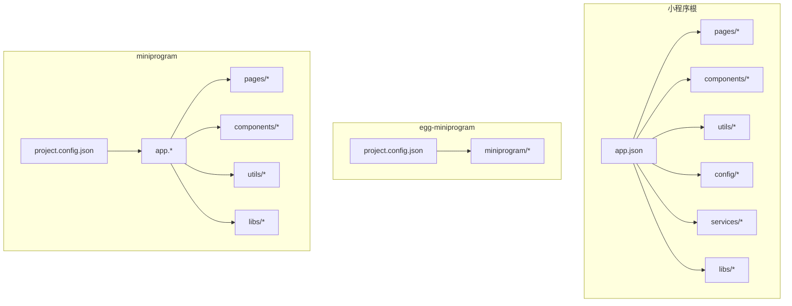
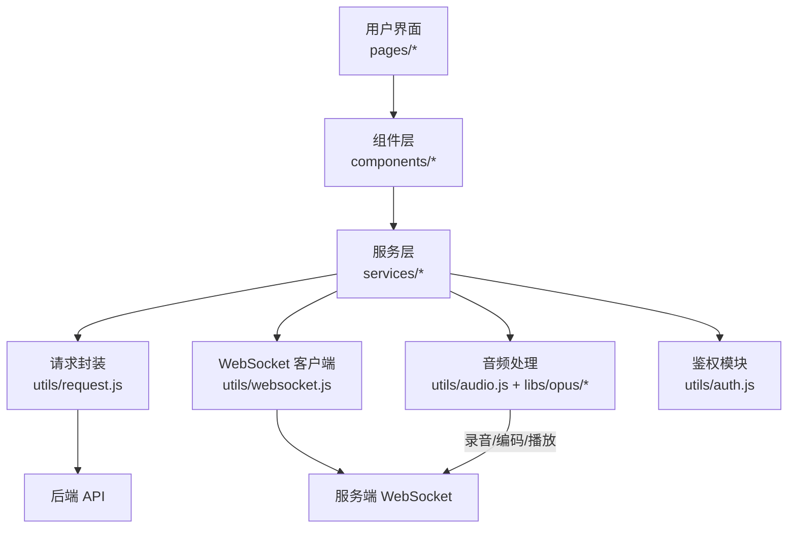
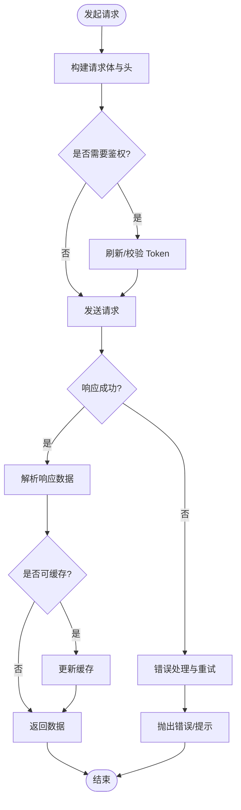
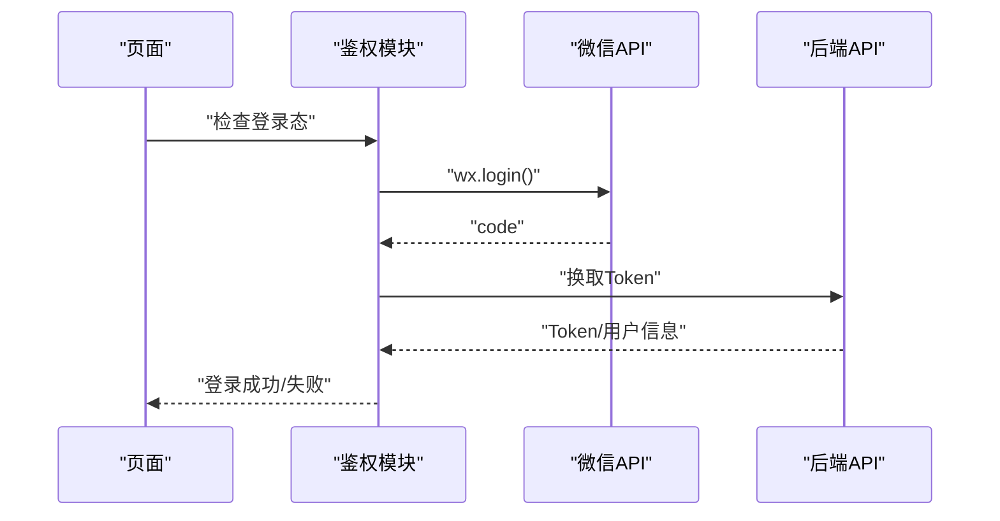
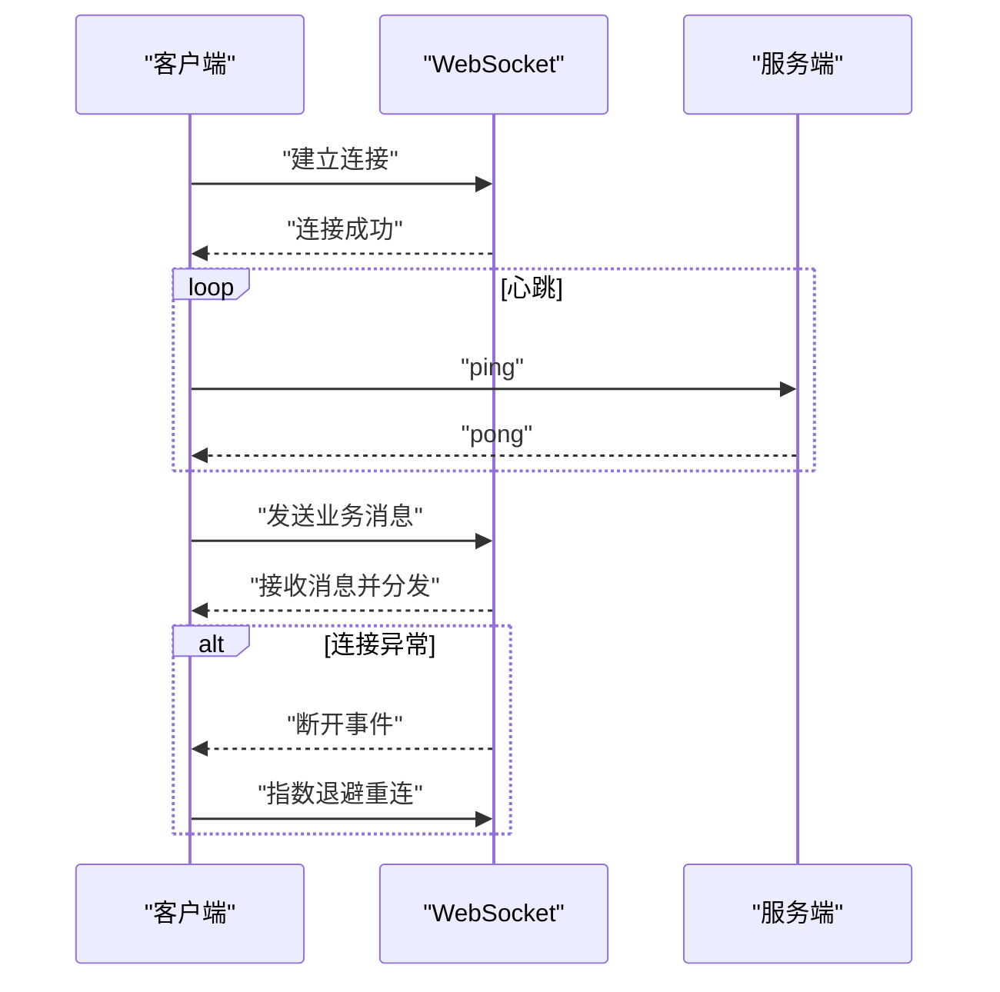
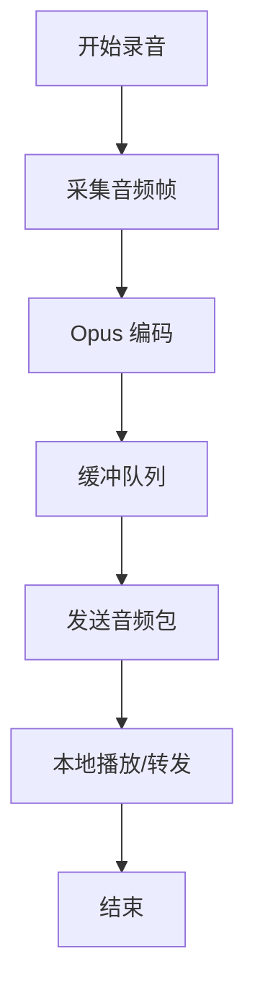
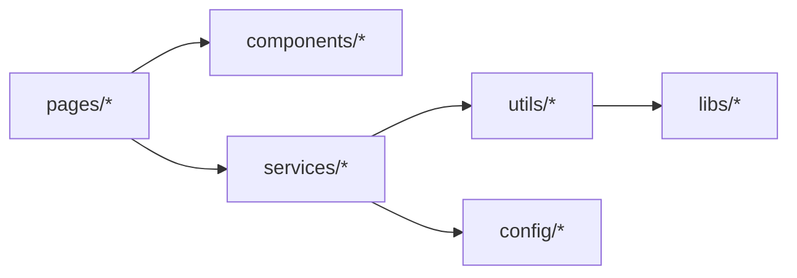

# 开发指南

<cite>
**本文档引用的文件**   
- [main/egg-miniprogram/project.config.json](file://main/egg-miniprogram/project.config.json)
- [main/egg-miniprogram/miniprogram/app.json](file://main/egg-miniprogram/miniprogram/app.json)
- [main/egg-miniprogram/miniprogram/app.js](file://main/egg-miniprogram/miniprogram/app.js)
- [main/egg-miniprogram/miniprogram/app.wxss](file://main/egg-miniprogram/miniprogram/app.wxss)
- [main/egg-miniprogram/miniprogram/pages/home/home.js](file://main/egg-miniprogram/miniprogram/pages/home/home.js)
- [main/egg-miniprogram/miniprogram/pages/chat/chat.js](file://main/egg-miniprogram/miniprogram/pages/chat/chat.js)
- [main/egg-miniprogram/miniprogram/utils/request.js](file://main/egg-miniprogram/miniprogram/utils/request.js)
- [main/egg-miniprogram/miniprogram/utils/auth.js](file://main/egg-miniprogram/miniprogram/utils/auth.js)
- [main/egg-miniprogram/miniprogram/utils/websocket.js](file://main/egg-miniprogram/miniprogram/utils/websocket.js)
- [main/egg-miniprogram/miniprogram/config/api.js](file://main/egg-miniprogram/miniprogram/config/api.js)
- [main/egg-miniprogram/miniprogram/services/analytics.js](file://main/egg-miniprogram/miniprogram/services/analytics.js)
- [main/egg-miniprogram/miniprogram/components/nav-bar/nav-bar.js](file://main/egg-miniprogram/miniprogram/components/nav-bar/nav-bar.js)
- [main/egg-miniprogram/miniprogram/components/button/custom-button.js](file://main/egg-miniprogram/miniprogram/components/button/custom-button.js)
- [main/miniprogram/project.config.json](file://main/miniprogram/project.config.json)
- [main/miniprogram/app.json](file://main/miniprogram/app.json)
- [main/miniprogram/app.js](file://main/miniprogram/app.js)
- [main/miniprogram/utils/request.js](file://main/miniprogram/utils/request.js)
- [main/miniprogram/utils/auth.js](file://main/miniprogram/utils/auth.js)
- [main/miniprogram/utils/websocket.js](file://main/miniprogram/utils/websocket.js)
- [main/miniprogram/utils/audio.js](file://main/miniprogram/utils/audio.js)
- [main/miniprogram/utils/logger.js](file://main/miniprogram/utils/logger.js)
- [main/miniprogram/pages/index/index.js](file://main/miniprogram/pages/index/index.js)
- [main/miniprogram/pages/voice-call/voice-call.js](file://main/miniprogram/pages/voice-call/voice-call.js)
- [main/miniprogram/components/chat-bubble/chat-bubble.js](file://main/miniprogram/components/chat-bubble/chat-bubble.js)
- [main/miniprogram/components/floating-call-ball/floating-call-ball.js](file://main/miniprogram/components/floating-call-ball/floating-call-ball.js)
- [main/miniprogram/components/voice-button/voice-button.js](file://main/miniprogram/components/voice-button/voice-button.js)
- [main/miniprogram/libs/opus/opus-runtime.js](file://main/miniprogram/libs/opus/opus-runtime.js)
</cite>

## 目录
1. [简介](#简介)
2. [项目结构](#项目结构)
3. [核心组件](#核心组件)
4. [架构总览](#架构总览)
5. [详细组件分析](#详细组件分析)
6. [依赖分析](#依赖分析)
7. [性能考虑](#性能考虑)
8. [故障排查指南](#故障排查指南)
9. [结论](#结论)
10. [附录](#附录)

## 简介
本指南面向微信小程序开发者，围绕仓库中的小程序工程（含 egg-miniprogram 与 miniprogram 两个子项目）提供从环境搭建、项目初始化、配置说明、开发流程到发布上线的完整实践。文档同时覆盖常用调试技巧、代码规范、团队协作与持续集成建议，帮助团队高效协作并稳定交付。

## 项目结构
本项目包含两套小程序实现：
- main/egg-miniprogram：基于原生小程序框架的“蛋仔”相关功能模块，采用模块化页面与组件组织方式。
- main/miniprogram：通用小程序入口，包含语音通话、聊天气泡、悬浮球等能力，以及音频编解码库集成。

典型目录职责：
- pages：按业务页面划分，每个页面由 .js/.json/.wxml/.wxss 组成。
- components：可复用 UI 组件，遵循独立目录与命名约定。
- utils：工具函数与网络、鉴权、WebSocket、音频处理等公共逻辑。
- config：接口地址、常量与业务配置。
- services：跨页面服务（如埋点、时间服务等）。
- libs：第三方或自研库（如 opus 运行时）。

图表来源
- [main/egg-miniprogram/project.config.json](file://main/egg-miniprogram/project.config.json)
- [main/miniprogram/project.config.json](file://main/miniprogram/project.config.json)
- [main/egg-miniprogram/miniprogram/app.json](file://main/egg-miniprogram/miniprogram/app.json)
- [main/miniprogram/app.json](file://main/miniprogram/app.json)

章节来源
- [main/egg-miniprogram/project.config.json](file://main/egg-miniprogram/project.config.json)
- [main/miniprogram/project.config.json](file://main/miniprogram/project.config.json)
- [main/egg-miniprogram/miniprogram/app.json](file://main/egg-miniprogram/miniprogram/app.json)
- [main/miniprogram/app.json](file://main/miniprogram/app.json)

## 核心组件
- 请求封装：统一封装网络请求，支持拦截器、错误处理、重试与超时控制。
- 鉴权模块：封装登录态获取、Token 管理、静默登录与授权流程。
- WebSocket：长连接建立、心跳保活、断线重连、消息分发。
- 音频处理：录音、播放、编码（Opus）、降噪与音量控制。
- 通用组件：导航栏、自定义按钮、聊天气泡、悬浮球、语音按钮等。

章节来源
- [main/egg-miniprogram/miniprogram/utils/request.js](file://main/egg-miniprogram/miniprogram/utils/request.js)
- [main/egg-miniprogram/miniprogram/utils/auth.js](file://main/egg-miniprogram/miniprogram/utils/auth.js)
- [main/egg-miniprogram/miniprogram/utils/websocket.js](file://main/egg-miniprogram/miniprogram/utils/websocket.js)
- [main/miniprogram/utils/audio.js](file://main/miniprogram/utils/audio.js)
- [main/miniprogram/components/chat-bubble/chat-bubble.js](file://main/miniprogram/components/chat-bubble/chat-bubble.js)
- [main/miniprogram/components/floating-call-ball/floating-call-ball.js](file://main/miniprogram/components/floating-call-ball/floating-call-ball.js)
- [main/miniprogram/components/voice-button/voice-button.js](file://main/miniprogram/components/voice-button/voice-button.js)

## 架构总览
小程序前端通过请求封装与后端 API 交互，使用 WebSocket 进行实时通信；音频流在端侧完成采集与编码后发送；鉴权贯穿所有敏感操作；组件层负责 UI 渲染与交互。

图表来源
- [main/egg-miniprogram/miniprogram/utils/request.js](file://main/egg-miniprogram/miniprogram/utils/request.js)
- [main/egg-miniprogram/miniprogram/utils/websocket.js](file://main/egg-miniprogram/miniprogram/utils/websocket.js)
- [main/miniprogram/utils/audio.js](file://main/miniprogram/utils/audio.js)
- [main/miniprogram/libs/opus/opus-runtime.js](file://main/miniprogram/libs/opus/opus-runtime.js)
- [main/miniprogram/utils/auth.js](file://main/miniprogram/utils/auth.js)

## 详细组件分析

### 请求封装（request.js）
- 职责：统一发起 HTTP 请求，处理请求头、参数序列化、响应解析、错误码映射、重试与超时。
- 关键点：
  - 拦截器：注入 Token、设备信息、追踪 ID。
  - 错误处理：区分网络异常、业务错误、超时，并提供友好提示。
  - 缓存策略：对只读数据做短期缓存，减少重复请求。
  - 日志输出：记录关键请求链路，便于问题定位。

图表来源
- [main/egg-miniprogram/miniprogram/utils/request.js](file://main/egg-miniprogram/miniprogram/utils/request.js)
- [main/miniprogram/utils/request.js](file://main/miniprogram/utils/request.js)

章节来源
- [main/egg-miniprogram/miniprogram/utils/request.js](file://main/egg-miniprogram/miniprogram/utils/request.js)
- [main/miniprogram/utils/request.js](file://main/miniprogram/utils/request.js)

### 鉴权模块（auth.js）
- 职责：管理用户登录态、Token 生命周期、静默登录、权限检查。
- 关键点：
  - 登录流程：调用微信登录接口获取 code，换取 Token。
  - 存储策略：安全存储 Token，避免明文泄露。
  - 自动续期：过期前主动刷新，失败时引导重新登录。
  - 权限校验：根据角色或功能开关限制访问。

图表来源
- [main/egg-miniprogram/miniprogram/utils/auth.js](file://main/egg-miniprogram/miniprogram/utils/auth.js)
- [main/miniprogram/utils/auth.js](file://main/miniprogram/utils/auth.js)

章节来源
- [main/egg-miniprogram/miniprogram/utils/auth.js](file://main/egg-miniprogram/miniprogram/utils/auth.js)
- [main/miniprogram/utils/auth.js](file://main/miniprogram/utils/auth.js)

### WebSocket 客户端（websocket.js）
- 职责：维护长连接、心跳检测、断线重连、消息路由。
- 关键点：
  - 连接管理：自动重连、指数退避、最大重试次数。
  - 心跳机制：定时 ping/pong，超时断开并触发重连。
  - 消息分发：按类型路由到对应处理器。
  - 状态同步：与服务器保持会话一致。

图表来源
- [main/egg-miniprogram/miniprogram/utils/websocket.js](file://main/egg-miniprogram/miniprogram/utils/websocket.js)
- [main/miniprogram/utils/websocket.js](file://main/miniprogram/utils/websocket.js)

章节来源
- [main/egg-miniprogram/miniprogram/utils/websocket.js](file://main/egg-miniprogram/miniprogram/utils/websocket.js)
- [main/miniprogram/utils/websocket.js](file://main/miniprogram/utils/websocket.js)

### 音频处理（audio.js + opus-runtime.js）
- 职责：录音、播放、编码（Opus）、降噪、音量控制。
- 关键点：
  - 录音：采样率、位深、缓冲策略优化。
  - 编码：使用 Opus 编码器降低带宽占用。
  - 播放：无缝拼接、延迟控制、静音检测。
  - 错误恢复：网络抖动下的丢包补偿与重传。

图表来源
- [main/miniprogram/utils/audio.js](file://main/miniprogram/utils/audio.js)
- [main/miniprogram/libs/opus/opus-runtime.js](file://main/miniprogram/libs/opus/opus-runtime.js)

章节来源
- [main/miniprogram/utils/audio.js](file://main/miniprogram/utils/audio.js)
- [main/miniprogram/libs/opus/opus-runtime.js](file://main/miniprogram/libs/opus/opus-runtime.js)

### 页面与组件示例
- 首页（home.js）：展示核心入口，加载基础数据，初始化全局状态。
- 聊天页（chat.js）：管理聊天记录、消息发送、滚动优化。
- 导航栏（nav-bar.js）：统一标题、返回行为、样式定制。
- 自定义按钮（custom-button.js）：封装点击态、禁用态、加载态。

章节来源
- [main/egg-miniprogram/miniprogram/pages/home/home.js](file://main/egg-miniprogram/miniprogram/pages/home/home.js)
- [main/egg-miniprogram/miniprogram/pages/chat/chat.js](file://main/egg-miniprogram/miniprogram/pages/chat/chat.js)
- [main/egg-miniprogram/miniprogram/components/nav-bar/nav-bar.js](file://main/egg-miniprogram/miniprogram/components/nav-bar/nav-bar.js)
- [main/egg-miniprogram/miniprogram/components/button/custom-button.js](file://main/egg-miniprogram/miniprogram/components/button/custom-button.js)

## 依赖分析
- 外部依赖：微信原生 API、可选的第三方库（如 Opus 运行时）。
- 内部依赖：页面依赖组件与服务，服务依赖工具模块，工具模块相互解耦。
- 风险点：避免循环依赖，确保模块边界清晰。

图表来源
- [main/egg-miniprogram/miniprogram/app.json](file://main/egg-miniprogram/miniprogram/app.json)
- [main/miniprogram/app.json](file://main/miniprogram/app.json)

章节来源
- [main/egg-miniprogram/miniprogram/app.json](file://main/egg-miniprogram/miniprogram/app.json)
- [main/miniprogram/app.json](file://main/miniprogram/app.json)

## 性能考虑
- 首屏优化：按需加载页面、分包加载、图片懒加载。
- 网络优化：请求合并、缓存策略、压缩传输。
- 渲染优化：减少 setData 频率、虚拟列表、避免频繁 DOM 操作。
- 内存管理：及时释放资源、清理定时器与监听器。
- 音频优化：合理采样率、缓冲大小、编码参数调优。

[本节为通用指导，不直接分析具体文件]

## 故障排查指南
- 常见问题：
  - 网络请求失败：检查域名白名单、证书、代理设置。
  - WebSocket 断连：确认心跳间隔、服务器可达性、防火墙规则。
  - 音频异常：检查麦克风权限、编码参数、播放路径。
  - 登录失败：核对 code 有效期、后端接口、Token 存储。
- 调试技巧：
  - 使用开发者工具的断点与网络面板。
  - 开启日志输出，记录关键链路。
  - 使用模拟器与真机对比验证。

章节来源
- [main/miniprogram/utils/logger.js](file://main/miniprogram/utils/logger.js)
- [main/egg-miniprogram/miniprogram/services/analytics.js](file://main/egg-miniprogram/miniprogram/services/analytics.js)

## 结论
本指南基于仓库中的小程序工程，提供了从环境搭建到发布上线的全流程实践。通过统一的请求封装、鉴权、WebSocket 与音频处理能力，结合规范的组件化与模块化设计，团队可高效协作并稳定交付高质量的小程序应用。建议在后续迭代中持续优化性能与可观测性，完善自动化测试与 CI/CD 流程。

[本节为总结性内容，不直接分析具体文件]

## 附录
- 开发环境搭建：安装微信开发者工具，导入项目，配置 AppID 与编译选项。
- 项目初始化：创建页面与组件，配置 app.json 路由与窗口样式。
- 依赖配置：在 project.config.json 中设置 npm 依赖与插件。
- 调试环境：启用 Source Map、开启日志、配置代理。
- 发布上线：提交代码、审核、灰度发布、监控与回滚策略。

[本节为通用指导，不直接分析具体文件]