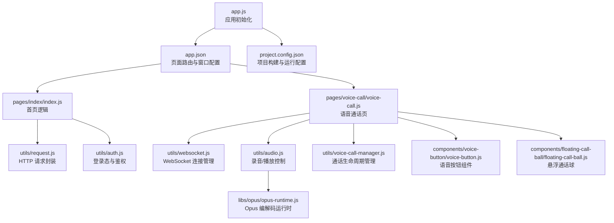
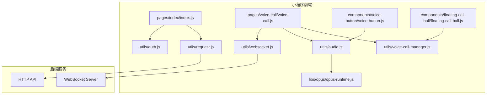
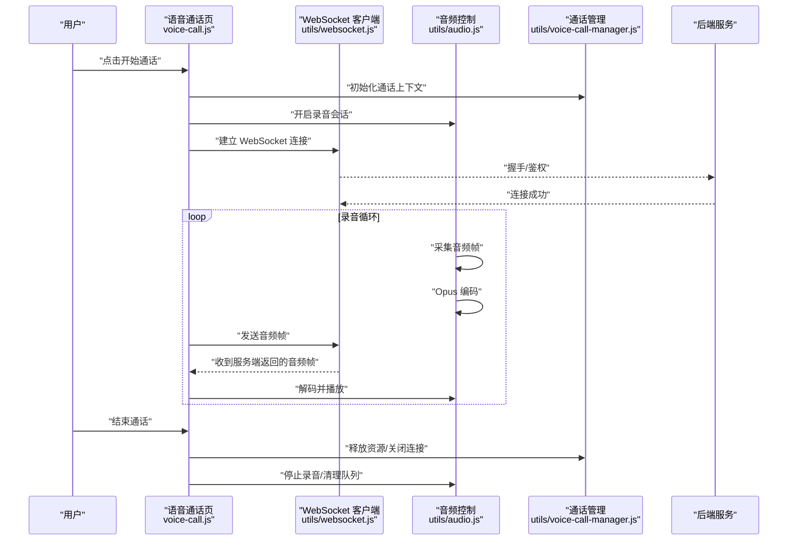
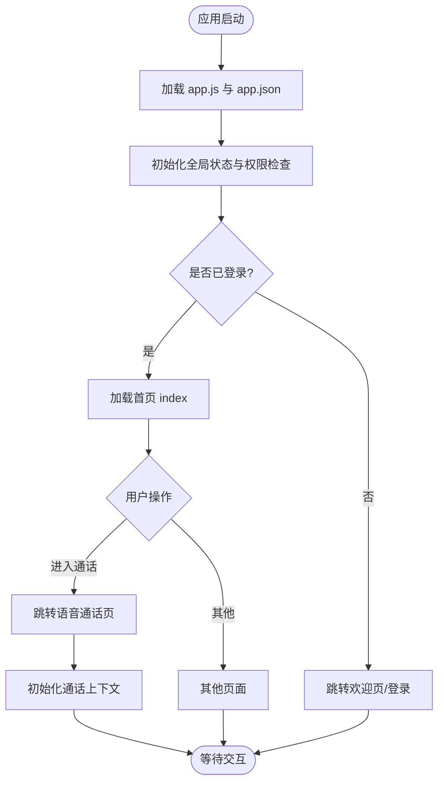
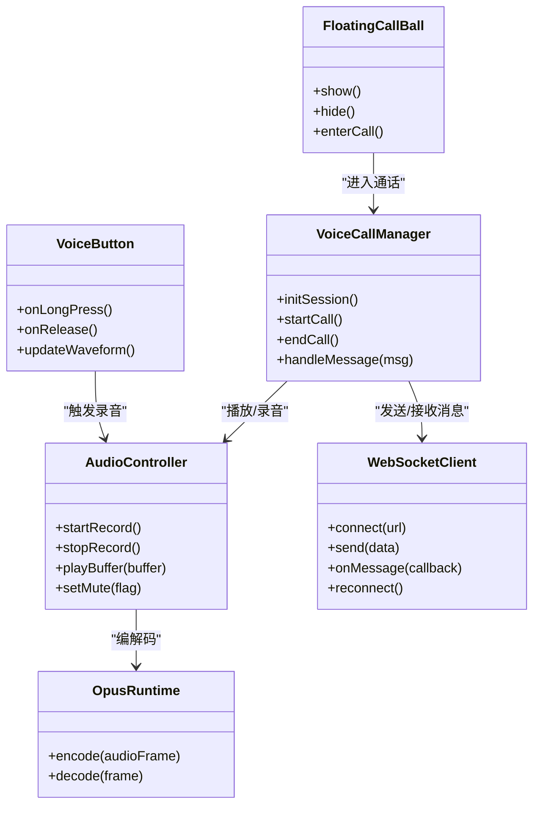
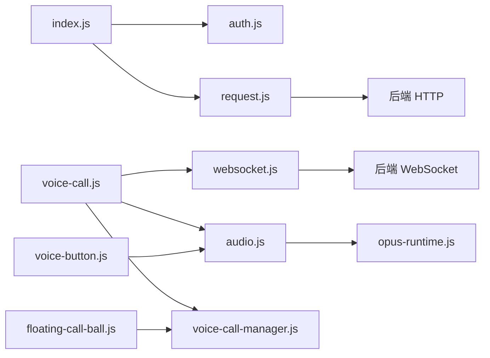

# 微信小程序概述

<cite>
**本文引用的文件**   
- [app.js](file://main/miniprogram/app.js)
- [app.json](file://main/miniprogram/app.json)
- [project.config.json](file://main/miniprogram/project.config.json)
- [index/index.js](file://main/miniprogram/pages/index/index.js)
- [voice-call/voice-call.js](file://main/miniprogram/pages/voice-call/voice-call.js)
- [utils/websocket.js](file://main/miniprogram/utils/websocket.js)
- [utils/request.js](file://main/miniprogram/utils/request.js)
- [utils/auth.js](file://main/miniprogram/utils/auth.js)
- [utils/device.js](file://main/miniprogram/utils/device.js)
- [utils/audio.js](file://main/miniprogram/utils/audio.js)
- [utils/voice-call-manager.js](file://main/miniprogram/utils/voice-call-manager.js)
- [components/voice-button/voice-button.js](file://main/miniprogram/components/voice-button/voice-button.js)
- [components/floating-call-ball/floating-call-ball.js](file://main/miniprogram/components/floating-call-ball/floating-call-ball.js)
- [libs/opus/opus-runtime.js](file://main/miniprogram/libs/opus/opus-runtime.js)
</cite>

## 目录
1. [简介](#简介)
2. [项目结构](#项目结构)
3. [核心组件](#核心组件)
4. [架构总览](#架构总览)
5. [详细组件分析](#详细组件分析)
6. [依赖关系分析](#依赖关系分析)
7. [性能考量](#性能考量)
8. [故障排查指南](#故障排查指南)
9. [结论](#结论)
10. [附录](#附录)

## 简介
本概述面向微信小程序端（位于 main/miniprogram），系统性梳理整体架构、技术栈与工程组织，重点覆盖语音通话、设备管理、用户认证、数据存储、后端通信、WebSocket 连接管理与实时数据同步等关键能力。同时提供开发环境搭建、项目配置说明、调试技巧、启动流程、页面导航逻辑、状态管理机制以及性能优化策略等实践要点，帮助开发者快速上手并高效迭代。

## 项目结构
小程序采用“页面 + 组件 + 工具库 + 资源”的分层组织方式：
- 入口与配置：app.js、app.json、project.config.json
- 页面模块：pages 下按功能划分（如首页 index、语音通话 voice-call 等）
- 公共组件：components（如语音按钮、悬浮通话球等）
- 工具与能力：utils（网络请求、WebSocket、认证、设备、音频、通话管理等）
- 第三方库：libs（如 Opus 编解码运行时）

图表来源
- [app.js:1-200](file://main/miniprogram/app.js#L1-L200)
- [app.json:1-200](file://main/miniprogram/app.json#L1-L200)
- [project.config.json:1-200](file://main/miniprogram/project.config.json#L1-L200)
- [index/index.js:1-200](file://main/miniprogram/pages/index/index.js#L1-L200)
- [voice-call/voice-call.js:1-200](file://main/miniprogram/pages/voice-call/voice-call.js#L1-L200)
- [utils/websocket.js:1-200](file://main/miniprogram/utils/websocket.js#L1-L200)
- [utils/request.js:1-200](file://main/miniprogram/utils/request.js#L1-L200)
- [utils/auth.js:1-200](file://main/miniprogram/utils/auth.js#L1-L200)
- [utils/audio.js:1-200](file://main/miniprogram/utils/audio.js#L1-L200)
- [utils/voice-call-manager.js:1-200](file://main/miniprogram/utils/voice-call-manager.js#L1-L200)
- [components/voice-button/voice-button.js:1-200](file://main/miniprogram/components/voice-button/voice-button.js#L1-L200)
- [components/floating-call-ball/floating-call-ball.js:1-200](file://main/miniprogram/components/floating-call-ball/floating-call-ball.js#L1-L200)
- [libs/opus/opus-runtime.js:1-200](file://main/miniprogram/libs/opus/opus-runtime.js#L1-L200)

章节来源
- [app.js:1-200](file://main/miniprogram/app.js#L1-L200)
- [app.json:1-200](file://main/miniprogram/app.json#L1-L200)
- [project.config.json:1-200](file://main/miniprogram/project.config.json#L1-L200)

## 核心组件
- 应用入口与配置
  - app.js：应用生命周期、全局状态初始化、权限与能力检查、全局事件监听。
  - app.json：页面路由、窗口样式、tabBar、网络超时与域名白名单等。
  - project.config.json：微信开发者工具配置、编译选项、分包与上传设置。
- 页面模块
  - 首页（index）：引导与入口、跳转至语音通话或设备管理。
  - 语音通话（voice-call）：通话界面、录音/播放、消息收发、状态展示。
- 公共组件
  - 语音按钮（voice-button）：长按录音、波形反馈、防误触。
  - 悬浮通话球（floating-call-ball）：全局快捷进入通话、最小化/恢复。
- 工具与能力
  - 网络请求（request）：统一封装 HTTP 请求、拦截器、错误处理。
  - WebSocket（websocket）：连接建立、心跳保活、断线重连、消息分发。
  - 认证（auth）：登录态获取、Token 存储与刷新、鉴权拦截。
  - 设备（device）：设备信息读取、绑定/解绑、OTA 升级提示。
  - 音频（audio）：录音会话、播放队列、静音/降噪开关。
  - 通话管理（voice-call-manager）：通话生命周期、状态机、资源释放。
- 第三方库
  - Opus 运行时（opus-runtime）：在小程序环境中进行音频编解码。

章节来源
- [app.js:1-200](file://main/miniprogram/app.js#L1-L200)
- [app.json:1-200](file://main/miniprogram/app.json#L1-L200)
- [project.config.json:1-200](file://main/miniprogram/project.config.json#L1-L200)
- [index/index.js:1-200](file://main/miniprogram/pages/index/index.js#L1-L200)
- [voice-call/voice-call.js:1-200](file://main/miniprogram/pages/voice-call/voice-call.js#L1-L200)
- [components/voice-button/voice-button.js:1-200](file://main/miniprogram/components/voice-button/voice-button.js#L1-L200)
- [components/floating-call-ball/floating-call-ball.js:1-200](file://main/miniprogram/components/floating-call-ball/floating-call-ball.js#L1-L200)
- [utils/request.js:1-200](file://main/miniprogram/utils/request.js#L1-L200)
- [utils/websocket.js:1-200](file://main/miniprogram/utils/websocket.js#L1-L200)
- [utils/auth.js:1-200](file://main/miniprogram/utils/auth.js#L1-L200)
- [utils/device.js:1-200](file://main/miniprogram/utils/device.js#L1-L200)
- [utils/audio.js:1-200](file://main/miniprogram/utils/audio.js#L1-L200)
- [utils/voice-call-manager.js:1-200](file://main/miniprogram/utils/voice-call-manager.js#L1-L200)
- [libs/opus/opus-runtime.js:1-200](file://main/miniprogram/libs/opus/opus-runtime.js#L1-L200)

## 架构总览
小程序通过“页面 + 组件 + 工具库”的协作完成端到端能力：
- 页面负责 UI 与交互，调用工具库完成业务逻辑。
- 组件封装可复用交互（如语音按钮、悬浮球）。
- 工具库抽象通用能力（网络、WebSocket、认证、音频、通话管理）。
- 与后端服务通过 HTTP 与 WebSocket 双通道通信，实现指令下发与实时音视频流。

图表来源
- [index/index.js:1-200](file://main/miniprogram/pages/index/index.js#L1-L200)
- [voice-call/voice-call.js:1-200](file://main/miniprogram/pages/voice-call/voice-call.js#L1-L200)
- [components/voice-button/voice-button.js:1-200](file://main/miniprogram/components/voice-button/voice-button.js#L1-L200)
- [components/floating-call-ball/floating-call-ball.js:1-200](file://main/miniprogram/components/floating-call-ball/floating-call-ball.js#L1-L200)
- [utils/request.js:1-200](file://main/miniprogram/utils/request.js#L1-L200)
- [utils/websocket.js:1-200](file://main/miniprogram/utils/websocket.js#L1-L200)
- [utils/auth.js:1-200](file://main/miniprogram/utils/auth.js#L1-L200)
- [utils/audio.js:1-200](file://main/miniprogram/utils/audio.js#L1-L200)
- [utils/voice-call-manager.js:1-200](file://main/miniprogram/utils/voice-call-manager.js#L1-L200)
- [libs/opus/opus-runtime.js:1-200](file://main/miniprogram/libs/opus/opus-runtime.js#L1-L200)

## 详细组件分析

### 语音通话流程（Sequence）
语音通话涉及录音、编码、发送、接收、解码与播放的全链路。

图表来源
- [voice-call/voice-call.js:1-200](file://main/miniprogram/pages/voice-call/voice-call.js#L1-L200)
- [utils/websocket.js:1-200](file://main/miniprogram/utils/websocket.js#L1-L200)
- [utils/audio.js:1-200](file://main/miniprogram/utils/audio.js#L1-L200)
- [utils/voice-call-manager.js:1-200](file://main/miniprogram/utils/voice-call-manager.js#L1-L200)
- [libs/opus/opus-runtime.js:1-200](file://main/miniprogram/libs/opus/opus-runtime.js#L1-L200)

章节来源
- [voice-call/voice-call.js:1-200](file://main/miniprogram/pages/voice-call/voice-call.js#L1-L200)
- [utils/websocket.js:1-200](file://main/miniprogram/utils/websocket.js#L1-L200)
- [utils/audio.js:1-200](file://main/miniprogram/utils/audio.js#L1-L200)
- [utils/voice-call-manager.js:1-200](file://main/miniprogram/utils/voice-call-manager.js#L1-L200)
- [libs/opus/opus-runtime.js:1-200](file://main/miniprogram/libs/opus/opus-runtime.js#L1-L200)

### 页面导航与启动流程（Flowchart）
小程序启动后根据 app.json 路由加载首页，再根据用户操作跳转到语音通话或其他页面。

图表来源
- [app.js:1-200](file://main/miniprogram/app.js#L1-L200)
- [app.json:1-200](file://main/miniprogram/app.json#L1-L200)
- [index/index.js:1-200](file://main/miniprogram/pages/index/index.js#L1-L200)
- [voice-call/voice-call.js:1-200](file://main/miniprogram/pages/voice-call/voice-call.js#L1-L200)

章节来源
- [app.js:1-200](file://main/miniprogram/app.js#L1-L200)
- [app.json:1-200](file://main/miniprogram/app.json#L1-L200)
- [index/index.js:1-200](file://main/miniprogram/pages/index/index.js#L1-L200)
- [voice-call/voice-call.js:1-200](file://main/miniprogram/pages/voice-call/voice-call.js#L1-L200)

### 组件类图（Object-Oriented）
以语音通话相关组件为例，展示类与职责关系。

图表来源
- [components/voice-button/voice-button.js:1-200](file://main/miniprogram/components/voice-button/voice-button.js#L1-L200)
- [components/floating-call-ball/floating-call-ball.js:1-200](file://main/miniprogram/components/floating-call-ball/floating-call-ball.js#L1-L200)
- [utils/audio.js:1-200](file://main/miniprogram/utils/audio.js#L1-L200)
- [utils/voice-call-manager.js:1-200](file://main/miniprogram/utils/voice-call-manager.js#L1-L200)
- [utils/websocket.js:1-200](file://main/miniprogram/utils/websocket.js#L1-L200)
- [libs/opus/opus-runtime.js:1-200](file://main/miniprogram/libs/opus/opus-runtime.js#L1-L200)

章节来源
- [components/voice-button/voice-button.js:1-200](file://main/miniprogram/components/voice-button/voice-button.js#L1-L200)
- [components/floating-call-ball/floating-call-ball.js:1-200](file://main/miniprogram/components/floating-call-ball/floating-call-ball.js#L1-L200)
- [utils/audio.js:1-200](file://main/miniprogram/utils/audio.js#L1-L200)
- [utils/voice-call-manager.js:1-200](file://main/miniprogram/utils/voice-call-manager.js#L1-L200)
- [utils/websocket.js:1-200](file://main/miniprogram/utils/websocket.js#L1-L200)
- [libs/opus/opus-runtime.js:1-200](file://main/miniprogram/libs/opus/opus-runtime.js#L1-L200)

## 依赖关系分析
- 页面依赖工具库：
  - 首页依赖认证与请求；语音通话页依赖 WebSocket、音频、通话管理。
- 组件依赖工具库：
  - 语音按钮依赖音频控制；悬浮通话球依赖通话管理。
- 工具库之间耦合：
  - 通话管理协调 WebSocket 与音频控制；音频控制依赖 Opus 运行时。
- 外部依赖：
  - HTTP 与 WebSocket 分别对接后端 API 与服务端长连接。

图表来源
- [index/index.js:1-200](file://main/miniprogram/pages/index/index.js#L1-L200)
- [voice-call/voice-call.js:1-200](file://main/miniprogram/pages/voice-call/voice-call.js#L1-L200)
- [components/voice-button/voice-button.js:1-200](file://main/miniprogram/components/voice-button/voice-button.js#L1-L200)
- [components/floating-call-ball/floating-call-ball.js:1-200](file://main/miniprogram/components/floating-call-ball/floating-call-ball.js#L1-L200)
- [utils/auth.js:1-200](file://main/miniprogram/utils/auth.js#L1-L200)
- [utils/request.js:1-200](file://main/miniprogram/utils/request.js#L1-L200)
- [utils/websocket.js:1-200](file://main/miniprogram/utils/websocket.js#L1-L200)
- [utils/audio.js:1-200](file://main/miniprogram/utils/audio.js#L1-L200)
- [utils/voice-call-manager.js:1-200](file://main/miniprogram/utils/voice-call-manager.js#L1-L200)
- [libs/opus/opus-runtime.js:1-200](file://main/miniprogram/libs/opus/opus-runtime.js#L1-L200)

章节来源
- [index/index.js:1-200](file://main/miniprogram/pages/index/index.js#L1-L200)
- [voice-call/voice-call.js:1-200](file://main/miniprogram/pages/voice-call/voice-call.js#L1-L200)
- [utils/websocket.js:1-200](file://main/miniprogram/utils/websocket.js#L1-L200)
- [utils/request.js:1-200](file://main/miniprogram/utils/request.js#L1-L200)
- [utils/auth.js:1-200](file://main/miniprogram/utils/auth.js#L1-L200)
- [utils/audio.js:1-200](file://main/miniprogram/utils/audio.js#L1-L200)
- [utils/voice-call-manager.js:1-200](file://main/miniprogram/utils/voice-call-manager.js#L1-L200)
- [libs/opus/opus-runtime.js:1-200](file://main/miniprogram/libs/opus/opus-runtime.js#L1-L200)

## 性能考量
- 网络请求优化
  - 使用 request 统一封装，启用缓存与重试策略，减少重复请求。
  - 合理设置超时与并发上限，避免阻塞主线程。
- WebSocket 连接管理
  - 心跳保活与指数退避重连，降低频繁断连开销。
  - 消息分片与节流，避免瞬时大量消息导致卡顿。
- 音频处理
  - 使用 Opus 编码降低带宽占用；合理设置采样率与码率。
  - 播放队列与缓冲策略，避免音画不同步。
- 内存管理
  - 及时释放录音/播放资源，避免内存泄漏。
  - 大对象与图片资源按需加载与懒加载。
- 渲染优化
  - 减少 setData 频率与数据量，使用局部更新。
  - 列表虚拟化与分页加载，提升滚动性能。

[本节为通用指导，不直接分析具体文件]

## 故障排查指南
- 常见问题定位
  - 登录失败：检查 auth 的登录态获取与 Token 刷新逻辑。
  - 网络连接异常：查看 request 的错误码与重试策略。
  - WebSocket 断连：确认心跳间隔、重连次数与服务器地址。
  - 音频无声音：检查录音权限、播放队列与 Opus 解码结果。
  - 通话中断：核查 voice-call-manager 的状态机与资源释放。
- 调试技巧
  - 使用开发者工具的 Console 与 Network 面板观察请求与 WS 消息。
  - 在关键路径添加日志输出，记录状态变化与异常堆栈。
  - 模拟弱网与高延迟场景，验证重连与降级策略。

章节来源
- [utils/auth.js:1-200](file://main/miniprogram/utils/auth.js#L1-L200)
- [utils/request.js:1-200](file://main/miniprogram/utils/request.js#L1-L200)
- [utils/websocket.js:1-200](file://main/miniprogram/utils/websocket.js#L1-L200)
- [utils/audio.js:1-200](file://main/miniprogram/utils/audio.js#L1-L200)
- [utils/voice-call-manager.js:1-200](file://main/miniprogram/utils/voice-call-manager.js#L1-L200)

## 结论
本小程序以清晰的模块化结构与工具库抽象，实现了从用户认证、设备管理到语音通话的完整链路。通过 HTTP 与 WebSocket 双通道通信，结合 Opus 编解码与稳健的连接管理，保障了实时性与稳定性。遵循本文的性能优化与故障排查建议，可进一步提升用户体验与系统可靠性。

[本节为总结性内容，不直接分析具体文件]

## 附录
- 开发环境搭建
  - 安装微信开发者工具，导入 main/miniprogram 目录。
  - 配置 project.config.json 中的 AppID、端口与域名白名单。
  - 确保后端服务可用，并在 utils/request.js 与 utils/websocket.js 中配置正确地址。
- 项目配置说明
  - app.json 中配置页面路由、窗口样式与 tabBar。
  - project.config.json 中设置编译选项、分包与上传参数。
- 调试技巧
  - 使用 Console、Network、Performance 面板定位问题。
  - 在关键函数前后打印日志，记录输入输出与异常信息。
- 启动流程与导航
  - 应用启动后根据 app.json 路由加载首页，再根据用户操作跳转。
  - 语音通话页初始化通话上下文，建立 WebSocket 连接并开始录音/播放。
- 状态管理
  - 使用全局状态与组件内状态结合，避免跨层级传递复杂数据。
  - 通话状态由 voice-call-manager 统一管理，保证一致性。

[本节为补充信息，不直接分析具体文件]