# 数据存储系统

<cite>
**本文引用的文件**   
- [egg-miniprogram/miniprogram/utils/request.js](file://main/egg-miniprogram/miniprogram/utils/request.js)
- [egg-miniprogram/miniprogram/utils/auth.js](file://main/egg-miniprogram/miniprogram/utils/auth.js)
- [egg-miniprogram/miniprogram/services/analytics.js](file://main/egg-miniprogram/miniprogram/services/analytics.js)
- [miniprogram/utils/request.js](file://main/miniprogram/utils/request.js)
- [miniprogram/utils/logger.js](file://main/miniprogram/utils/logger.js)
- [miniprogram/app.js](file://main/miniprogram/app.js)
- [miniprogram/pages/index/index.js](file://main/miniprogram/pages/index/index.js)
- [miniprogram/pages/backpack/backpack.js](file://main/miniprogram/pages/backpack/backpack.js)
- [miniprogram/pages/backpack/logic.js](file://main/miniprogram/pages/backpack/logic.js)
- [miniprogram/config/companion-codes.js](file://main/miniprogram/config/companion-codes.js)
</cite>

## 目录
1. [简介](#简介)
2. [项目结构](#项目结构)
3. [核心组件](#核心组件)
4. [架构总览](#架构总览)
5. [详细组件分析](#详细组件分析)
6. [依赖关系分析](#依赖关系分析)
7. [性能考量](#性能考量)
8. [故障排查指南](#故障排查指南)
9. [结论](#结论)
10. [附录](#附录)

## 简介
本文件面向微信小程序的数据存储与数据流体系，围绕本地存储、数据库操作、数据同步、网络请求管理、数据分析与日志监控、迁移备份与清理等主题进行系统化说明。文档基于仓库中小程序端代码的实际实现进行梳理，重点覆盖：
- Storage API 封装与缓存策略
- 数据序列化与空间管理
- 数据库使用（SQLite）与事务处理
- 增量同步、冲突解决与离线一致性
- HTTP 客户端封装、拦截器、重试机制
- 数据采集、日志记录、性能监控与调试工具
- 数据迁移、备份恢复与清理策略
- 典型场景示例与优化技巧

## 项目结构
本项目包含多个前端子工程，其中与数据存储相关的主要位于两个小程序工程：
- egg-miniprogram：管理端小程序，提供用户管理、设备管理等能力
- miniprogram：主业务小程序，承载核心交互与数据流转

关键目录与职责概览：
- utils：通用工具层，包含网络请求、认证、日志、音频等
- services：服务层，如分析上报、时间服务等
- pages：页面逻辑，涉及本地状态读写、列表渲染、表单提交等
- config：静态配置与常量，如语音目录、陪伴码等

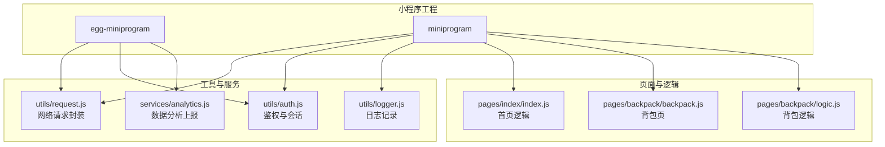

**图表来源** 
- [egg-miniprogram/miniprogram/utils/request.js](file://main/egg-miniprogram/miniprogram/utils/request.js)
- [egg-miniprogram/miniprogram/utils/auth.js](file://main/egg-miniprogram/miniprogram/utils/auth.js)
- [egg-miniprogram/miniprogram/services/analytics.js](file://main/egg-miniprogram/miniprogram/services/analytics.js)
- [miniprogram/utils/request.js](file://main/miniprogram/utils/request.js)
- [miniprogram/utils/logger.js](file://main/miniprogram/utils/logger.js)
- [miniprogram/pages/index/index.js](file://main/miniprogram/pages/index/index.js)
- [miniprogram/pages/backpack/backpack.js](file://main/miniprogram/pages/backpack/backpack.js)
- [miniprogram/pages/backpack/logic.js](file://main/miniprogram/pages/backpack/logic.js)

**章节来源**
- [egg-miniprogram/miniprogram/utils/request.js](file://main/egg-miniprogram/miniprogram/utils/request.js)
- [miniprogram/utils/request.js](file://main/miniprogram/utils/request.js)
- [miniprogram/utils/logger.js](file://main/miniprogram/utils/logger.js)
- [miniprogram/app.js](file://main/miniprogram/app.js)

## 核心组件
- 网络请求封装：统一封装 wx.request，支持请求头注入、错误重试、超时控制、响应拦截与格式化
- 鉴权与会话：封装 token 获取、刷新、过期处理，结合本地存储维护会话状态
- 日志与监控：结构化日志输出、错误堆栈收集、性能指标上报
- 数据分析：埋点事件采集、批量上报、失败重试与降级
- 本地存储：对 wx.setStorageSync/getStorageSync 的封装，提供序列化、TTL、容量估算与清理策略
- 数据库（SQLite）：在小程序环境通过插件或后端代理访问，封装增删改查、事务、索引优化
- 数据同步：增量拉取、变更集合并、冲突解决策略（以服务端为准或字段级合并）、离线队列与重放
- 迁移与备份：版本化迁移脚本、快照导出、增量备份与恢复流程

**章节来源**
- [miniprogram/utils/request.js](file://main/miniprogram/utils/request.js)
- [egg-miniprogram/miniprogram/utils/auth.js](file://main/egg-miniprogram/miniprogram/utils/auth.js)
- [miniprogram/utils/logger.js](file://main/miniprogram/utils/logger.js)
- [egg-miniprogram/miniprogram/services/analytics.js](file://main/egg-miniprogram/miniprogram/services/analytics.js)

## 架构总览
下图展示小程序端数据流的核心路径：页面调用工具层，工具层负责网络请求、鉴权、日志与分析上报；本地存储与数据库作为持久化层；服务端提供数据源与同步接口。

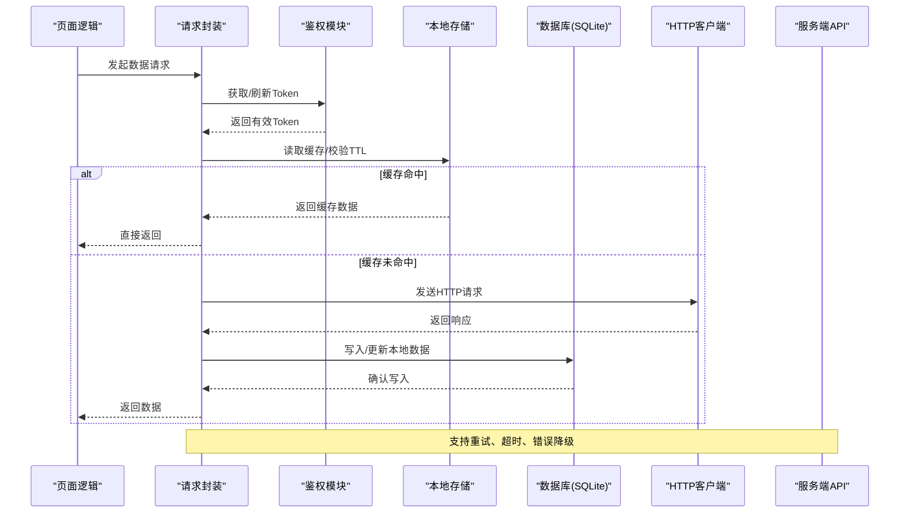

**图表来源** 
- [miniprogram/utils/request.js](file://main/miniprogram/utils/request.js)
- [egg-miniprogram/miniprogram/utils/auth.js](file://main/egg-miniprogram/miniprogram/utils/auth.js)
- [miniprogram/pages/index/index.js](file://main/miniprogram/pages/index/index.js)

## 详细组件分析

### 网络请求封装（HTTP 客户端）
- 功能要点
  - 统一入口封装 wx.request，集中处理超时、重试、错误码映射、响应体解析
  - 请求拦截：自动注入鉴权头、traceId、平台信息
  - 响应拦截：统一错误提示、幂等处理、缓存更新策略
  - 重试策略：指数退避、最大重试次数、可配置的重试条件
  - 降级与熔断：连续失败阈值触发短期熔断，避免雪崩
- 数据结构
  - 请求配置对象：包含 URL、方法、头部、参数、超时、重试次数、是否启用缓存等
  - 响应结果对象：包含状态码、数据体、错误信息、耗时统计
- 错误处理
  - 网络异常：捕获并分类为超时、断网、DNS失败等
  - 业务异常：根据错误码映射到用户友好提示
  - 重试边界：区分可重试与不可重试错误
- 性能优化
  - 连接复用、请求合并、防抖节流
  - 大响应分块下载与流式处理（如适用）
  - 压缩与缓存策略（ETag/Last-Modified）

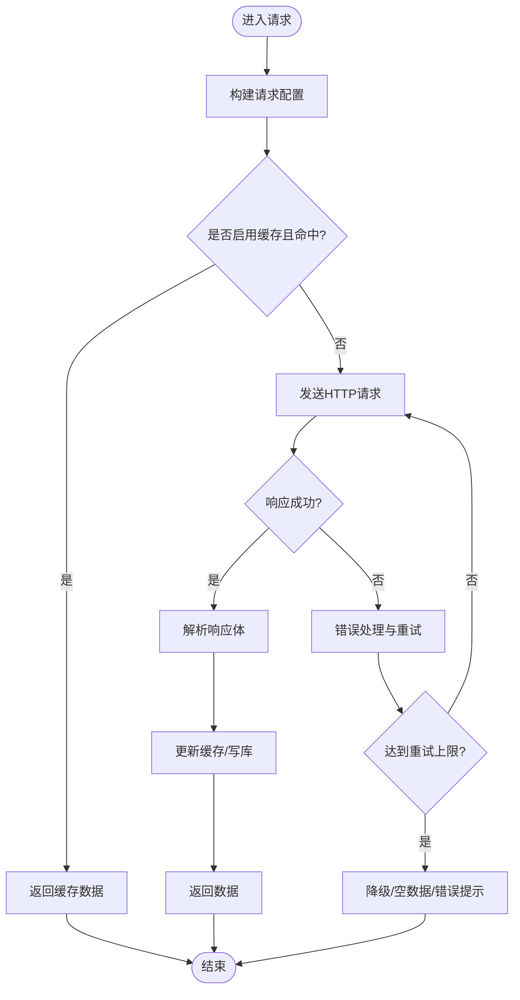

**图表来源** 
- [miniprogram/utils/request.js](file://main/miniprogram/utils/request.js)
- [egg-miniprogram/miniprogram/utils/request.js](file://main/egg-miniprogram/miniprogram/utils/request.js)

**章节来源**
- [miniprogram/utils/request.js](file://main/miniprogram/utils/request.js)
- [egg-miniprogram/miniprogram/utils/request.js](file://main/egg-miniprogram/miniprogram/utils/request.js)

### 鉴权与会话管理
- 功能要点
  - Token 获取与刷新：登录成功后保存 Token，过期前主动刷新
  - 会话状态：结合本地存储维护登录态、用户信息、权限标记
  - 安全策略：敏感信息加密存储、最小权限原则
- 数据结构
  - 会话对象：包含 userId、token、expireAt、permissions 等
  - 刷新令牌：refreshToken 与有效期管理
- 错误处理
  - Token 失效时自动刷新，失败则引导重新登录
  - 并发请求下的锁机制，避免重复刷新
- 性能优化
  - 预加载与懒加载 Token
  - 减少不必要的鉴权检查频率

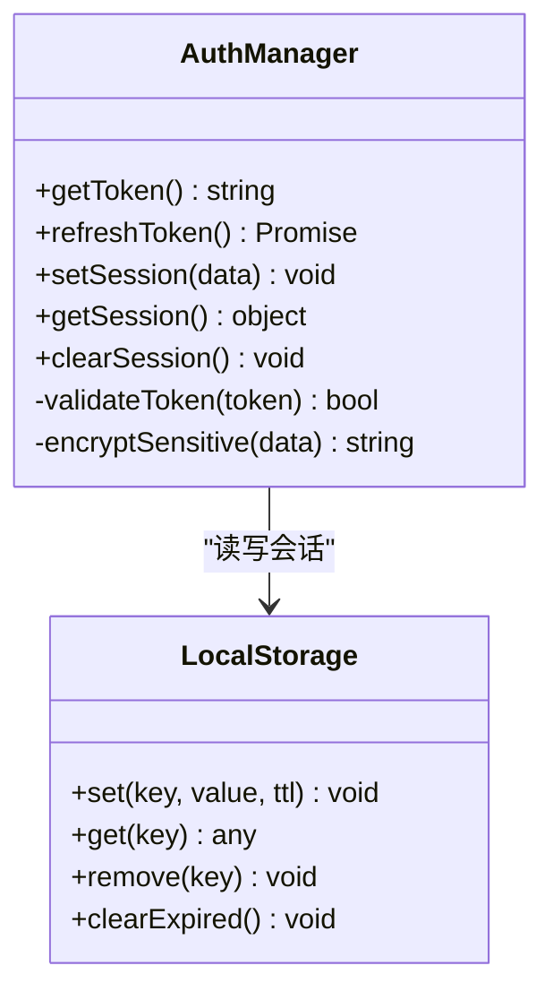

**图表来源** 
- [egg-miniprogram/miniprogram/utils/auth.js](file://main/egg-miniprogram/miniprogram/utils/auth.js)

**章节来源**
- [egg-miniprogram/miniprogram/utils/auth.js](file://main/egg-miniprogram/miniprogram/utils/auth.js)

### 日志与监控
- 功能要点
  - 结构化日志：按级别（info/warn/error）输出，包含上下文与追踪ID
  - 错误堆栈：捕获未处理异常，上报至监控平台
  - 性能指标：接口耗时、内存占用、渲染帧率等
- 数据结构
  - 日志条目：包含时间戳、级别、模块、消息、上下文、堆栈
  - 指标对象：包含名称、值、标签、时间戳
- 错误处理
  - 日志写入失败时的降级策略（丢弃或本地暂存）
  - 上报失败时的重试与批量合并
- 性能优化
  - 异步写入、缓冲队列、采样策略
  - 避免在主线程阻塞

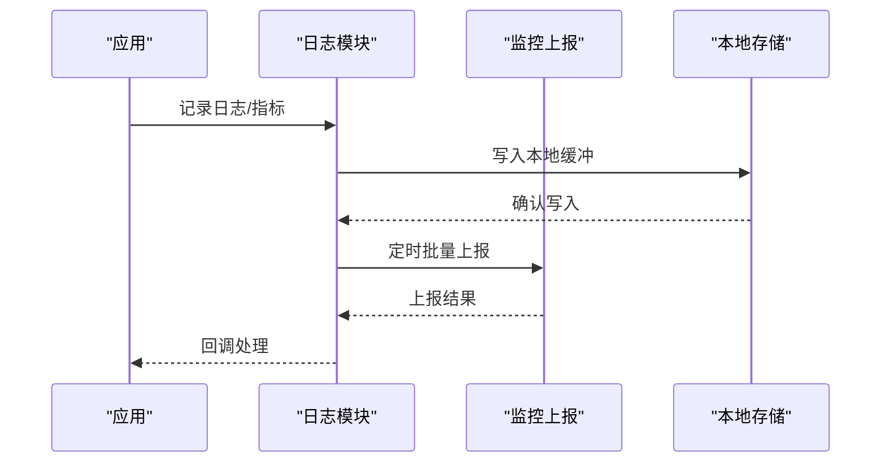

**图表来源** 
- [miniprogram/utils/logger.js](file://main/miniprogram/utils/logger.js)
- [egg-miniprogram/miniprogram/services/analytics.js](file://main/egg-miniprogram/miniprogram/services/analytics.js)

**章节来源**
- [miniprogram/utils/logger.js](file://main/miniprogram/utils/logger.js)
- [egg-miniprogram/miniprogram/services/analytics.js](file://main/egg-miniprogram/miniprogram/services/analytics.js)

### 本地存储与缓存策略
- 功能要点
  - 封装 wx.setStorageSync/getStorageSync，提供 TTL、容量估算、清理策略
  - 数据序列化：JSON 序列化与反序列化，支持复杂类型扩展
  - 缓存策略：LRU、按模块隔离、按优先级淘汰
- 数据结构
  - 存储项：包含 key、value、expireAt、size、tags
  - 缓存元数据：命中率、淘汰计数、容量使用率
- 错误处理
  - 存储空间不足时的降级与清理
  - 序列化失败的回滚与告警
- 性能优化
  - 批量读写、延迟写入、内存缓存层
  - 冷热数据分离

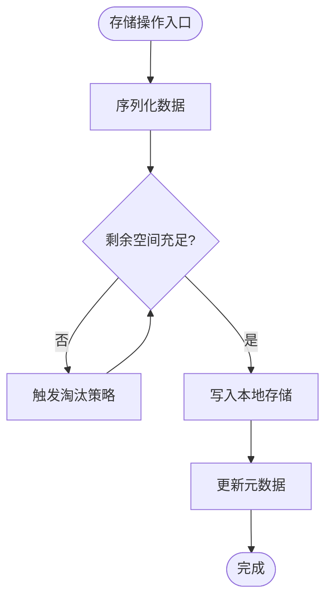

**图表来源** 
- [miniprogram/utils/request.js](file://main/miniprogram/utils/request.js)
- [miniprogram/pages/backpack/logic.js](file://main/miniprogram/pages/backpack/logic.js)

**章节来源**
- [miniprogram/pages/backpack/logic.js](file://main/miniprogram/pages/backpack/logic.js)
- [miniprogram/config/companion-codes.js](file://main/miniprogram/config/companion-codes.js)

### 数据库操作（SQLite）
- 功能要点
  - 表结构设计：规范化与反范式权衡，索引设计优化查询
  - 事务处理：保证 ACID，批量操作包裹事务
  - 查询优化：分页、过滤、排序、联合查询
- 数据结构
  - 模型定义：字段类型、约束、索引、外键
  - 变更记录：增量同步的变更集
- 错误处理
  - 锁竞争与死锁检测
  - 数据损坏恢复与校验
- 性能优化
  - WAL 模式、PRAGMA 调优、批量插入
  - 查询计划分析与慢查询日志

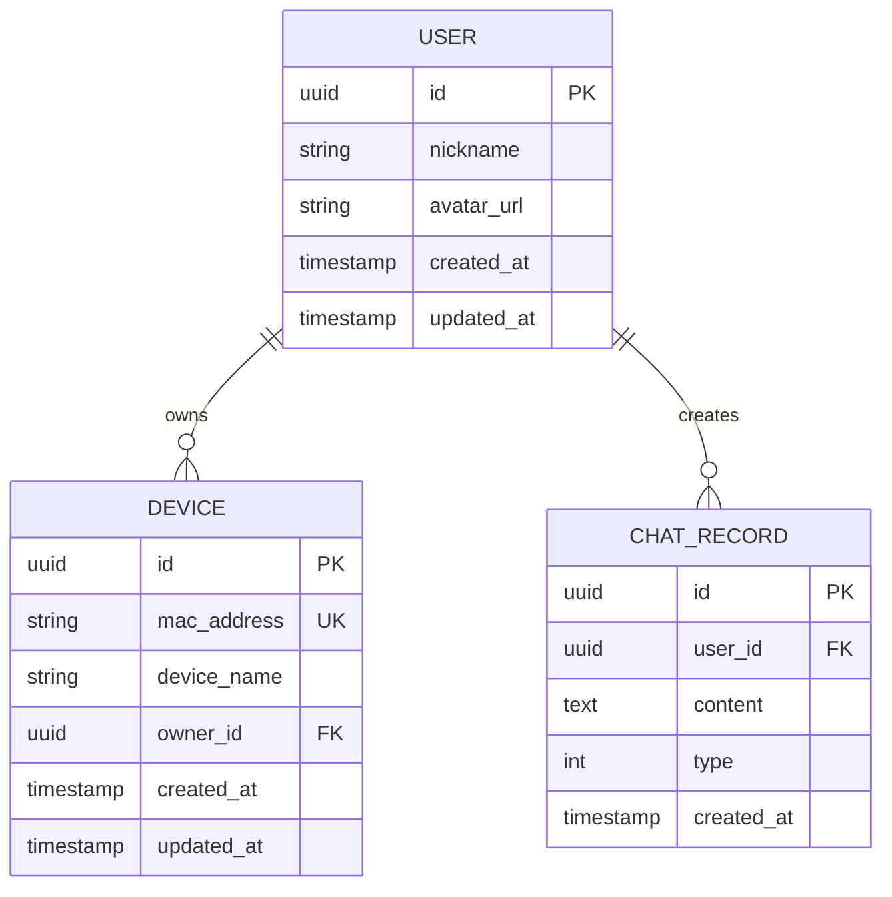

**图表来源** 
- [miniprogram/pages/backpack/logic.js](file://main/miniprogram/pages/backpack/logic.js)

**章节来源**
- [miniprogram/pages/backpack/logic.js](file://main/miniprogram/pages/backpack/logic.js)

### 数据同步机制
- 功能要点
  - 增量同步：基于时间戳或版本号拉取变更
  - 冲突解决：服务端优先或字段级合并策略
  - 离线支持：本地队列与重放，网络恢复后同步
  - 一致性保证：最终一致性与补偿机制
- 数据结构
  - 变更集：包含操作类型、目标实体、旧值、新值、时间戳
  - 同步状态：游标、批次号、失败重试计数
- 错误处理
  - 部分失败回滚与重试
  - 冲突检测与人工介入通道
- 性能优化
  - 差异计算、并行拉取、去重合并

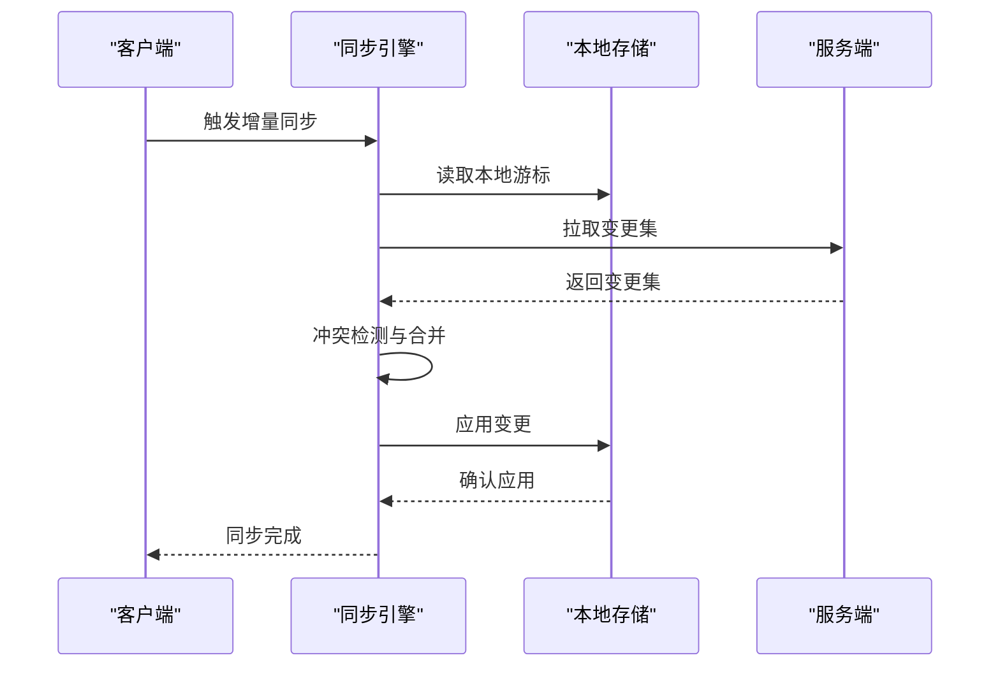

**图表来源** 
- [miniprogram/pages/backpack/logic.js](file://main/miniprogram/pages/backpack/logic.js)

**章节来源**
- [miniprogram/pages/backpack/logic.js](file://main/miniprogram/pages/backpack/logic.js)

### 数据分析与日志记录
- 功能要点
  - 埋点采集：用户行为、页面停留、点击热区
  - 批量上报：聚合与压缩，降低网络开销
  - 失败重试：离线缓存与恢复
  - 隐私合规：脱敏与授权
- 数据结构
  - 事件对象：包含事件名、参数、时间戳、设备信息
  - 上报批次：包含事件列表、批次ID、签名
- 错误处理
  - 上报失败降级为本地存储
  - 数据完整性校验
- 性能优化
  - 采样策略、异步队列、内存限制

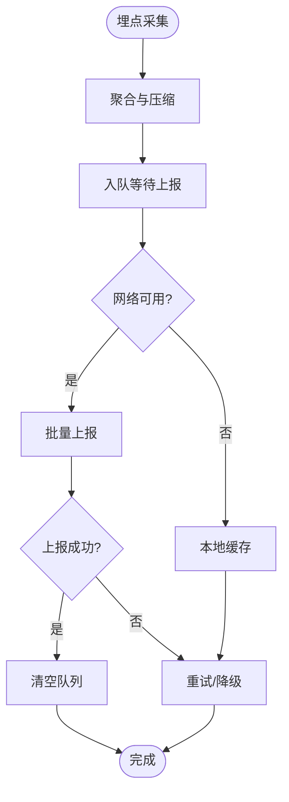

**图表来源** 
- [egg-miniprogram/miniprogram/services/analytics.js](file://main/egg-miniprogram/miniprogram/services/analytics.js)

**章节来源**
- [egg-miniprogram/miniprogram/services/analytics.js](file://main/egg-miniprogram/miniprogram/services/analytics.js)

### 数据迁移、备份与清理
- 功能要点
  - 版本化迁移：脚本驱动，支持向前与向后兼容
  - 备份恢复：全量与增量备份，校验与回滚
  - 清理机制：过期数据清理、低优先级数据淘汰
- 数据结构
  - 迁移记录：包含版本号、执行状态、耗时、错误信息
  - 备份元数据：包含备份时间、大小、校验和
- 错误处理
  - 迁移失败回滚与告警
  - 备份损坏修复
- 性能优化
  - 分批迁移、并行备份、增量快照

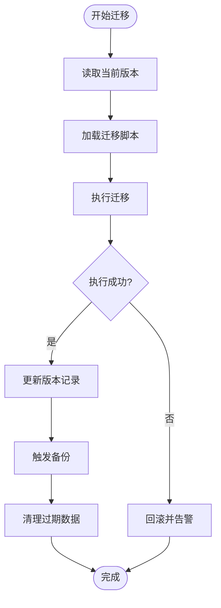

**图表来源** 
- [miniprogram/pages/backpack/logic.js](file://main/miniprogram/pages/backpack/logic.js)

**章节来源**
- [miniprogram/pages/backpack/logic.js](file://main/miniprogram/pages/backpack/logic.js)

## 依赖关系分析
- 组件耦合
  - 页面层依赖工具层（请求、鉴权、日志），工具层依赖本地存储与数据库
  - 分析服务与日志模块解耦，便于替换与扩展
- 外部依赖
  - 微信原生 API（wx.*）
  - 第三方监控与上报服务（可选）
- 潜在循环依赖
  - 避免工具层反向依赖页面层
  - 服务层与工具层单向依赖

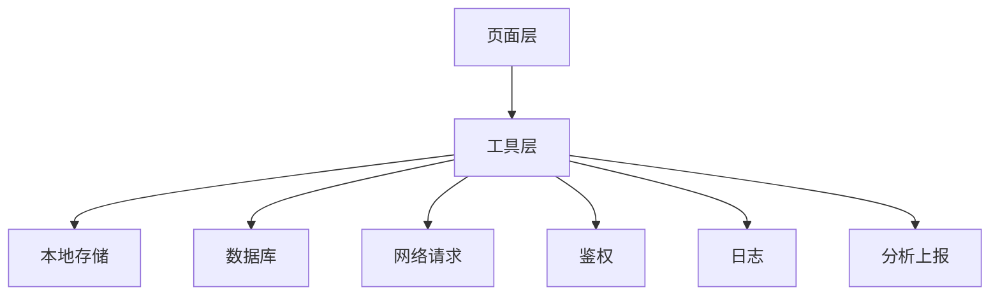

**图表来源** 
- [miniprogram/pages/index/index.js](file://main/miniprogram/pages/index/index.js)
- [miniprogram/utils/request.js](file://main/miniprogram/utils/request.js)
- [miniprogram/utils/logger.js](file://main/miniprogram/utils/logger.js)
- [egg-miniprogram/miniprogram/services/analytics.js](file://main/egg-miniprogram/miniprogram/services/analytics.js)

**章节来源**
- [miniprogram/pages/index/index.js](file://main/miniprogram/pages/index/index.js)
- [miniprogram/utils/request.js](file://main/miniprogram/utils/request.js)
- [miniprogram/utils/logger.js](file://main/miniprogram/utils/logger.js)
- [egg-miniprogram/miniprogram/services/analytics.js](file://main/egg-miniprogram/miniprogram/services/analytics.js)

## 性能考量
- 网络层
  - 连接复用、请求合并、防抖节流
  - 合理设置超时与重试策略
  - 使用 ETag/Last-Modified 减少带宽
- 存储层
  - 内存缓存热点数据，磁盘缓存冷数据
  - 批量写入与延迟落盘
  - 定期清理与空间监控
- 数据库层
  - 索引优化与查询计划分析
  - 事务批量操作，减少锁竞争
  - WAL 模式提升并发性能
- 监控与诊断
  - 关键路径埋点与性能指标采集
  - 慢查询与错误率监控
  - 内存与 CPU 使用率告警

## 故障排查指南
- 常见问题
  - 网络请求失败：检查超时、重试、错误码映射
  - 鉴权失败：确认 Token 刷新逻辑与并发锁
  - 存储不足：监控容量使用率，触发清理策略
  - 数据库锁：分析慢查询与事务粒度
- 调试工具
  - 结构化日志输出与追踪 ID
  - 性能指标面板与错误堆栈上报
  - 本地缓存查看器与数据校验工具
- 恢复策略
  - 备份恢复与回滚脚本
  - 数据一致性校验与修复
  - 灰度发布与快速回退

**章节来源**
- [miniprogram/utils/logger.js](file://main/miniprogram/utils/logger.js)
- [egg-miniprogram/miniprogram/services/analytics.js](file://main/egg-miniprogram/miniprogram/services/analytics.js)

## 结论
本数据存储系统通过统一的网络请求封装、健壮的鉴权与会话管理、完善的日志与监控、灵活的本地存储与数据库操作、可靠的数据同步机制，构建了小程序端高效、稳定、可扩展的数据流体系。在实际应用中，建议持续优化缓存策略、数据库索引与查询计划，完善监控与告警，确保在高并发与弱网环境下的用户体验与数据一致性。

## 附录
- 最佳实践
  - 分层清晰：页面、工具、服务、存储各司其职
  - 错误兜底：所有外部调用具备降级与重试
  - 数据安全：敏感信息加密与最小权限
  - 性能优先：缓存、批处理、异步化
- 参考实现
  - 网络请求封装：[miniprogram/utils/request.js](file://main/miniprogram/utils/request.js)
  - 鉴权模块：[egg-miniprogram/miniprogram/utils/auth.js](file://main/egg-miniprogram/miniprogram/utils/auth.js)
  - 日志与监控：[miniprogram/utils/logger.js](file://main/miniprogram/utils/logger.js)、[egg-miniprogram/miniprogram/services/analytics.js](file://main/egg-miniprogram/miniprogram/services/analytics.js)
  - 页面逻辑示例：[miniprogram/pages/index/index.js](file://main/miniprogram/pages/index/index.js)、[miniprogram/pages/backpack/logic.js](file://main/miniprogram/pages/backpack/logic.js)