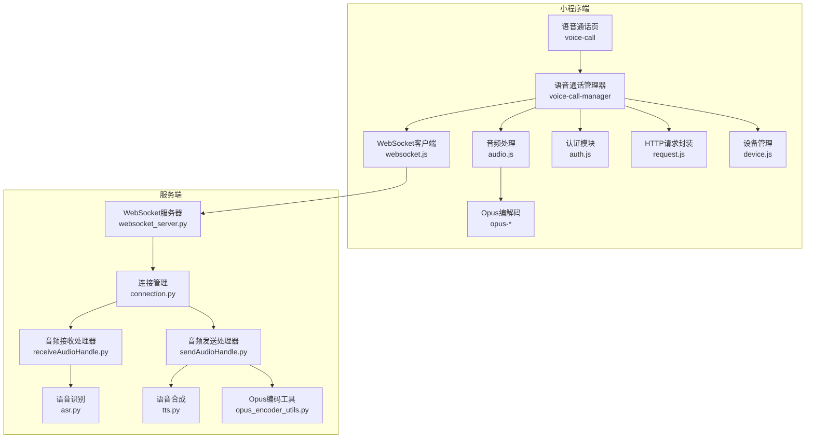
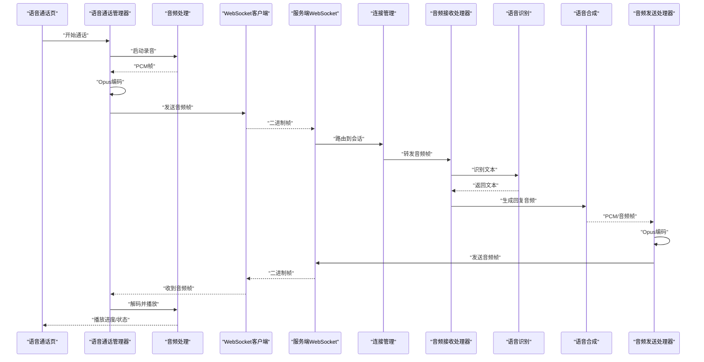
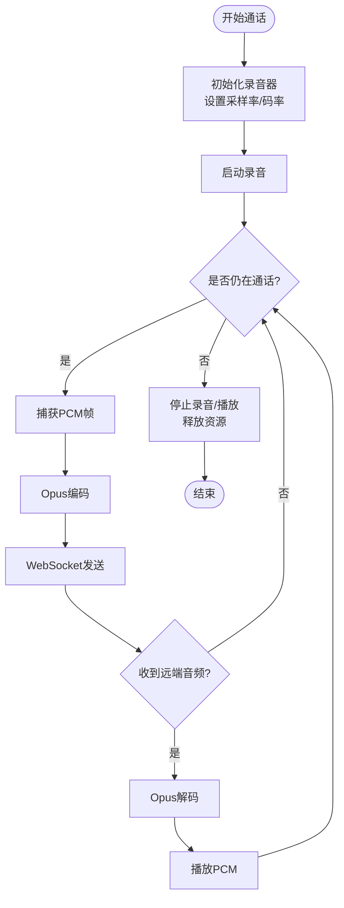
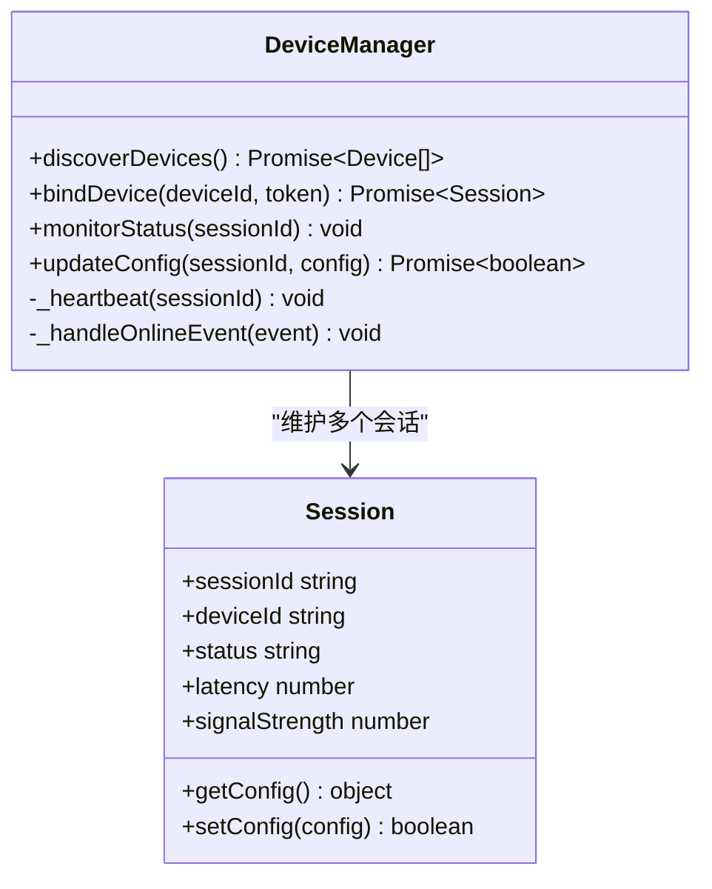
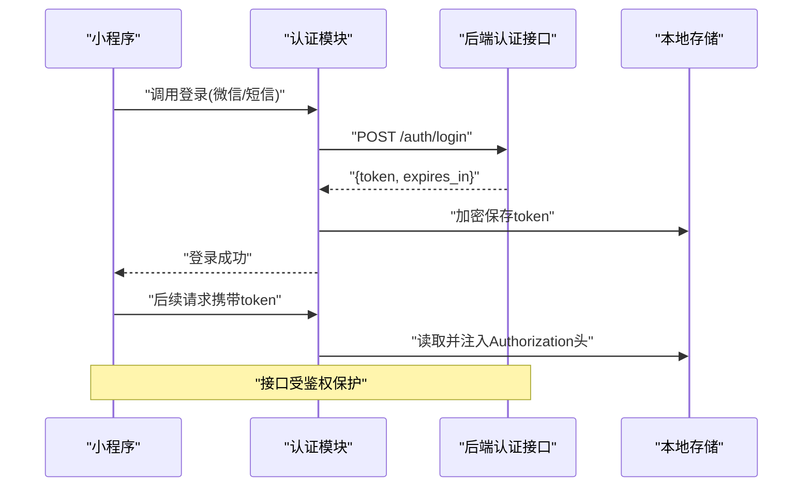
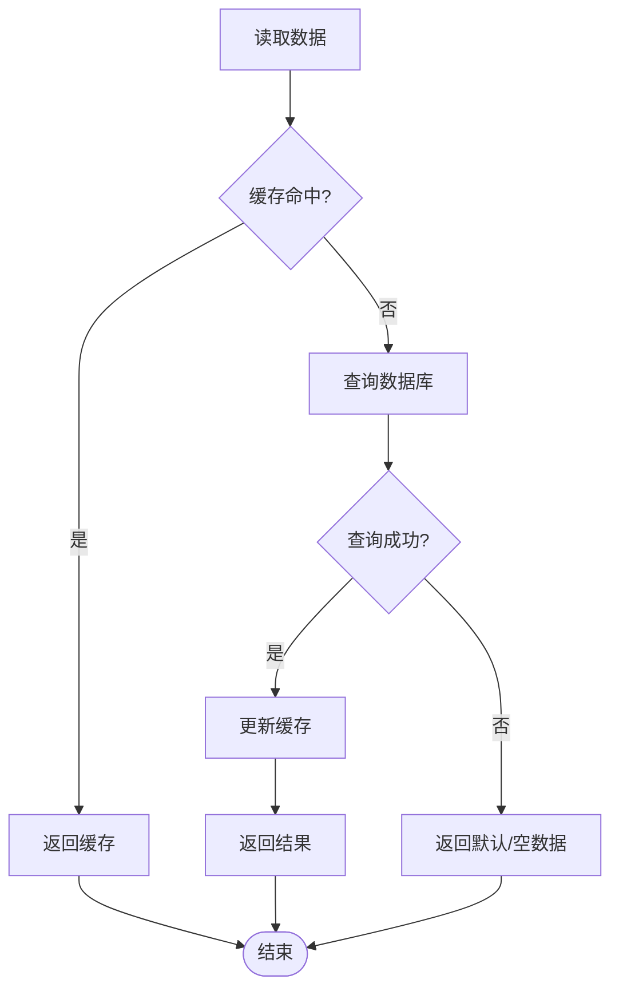
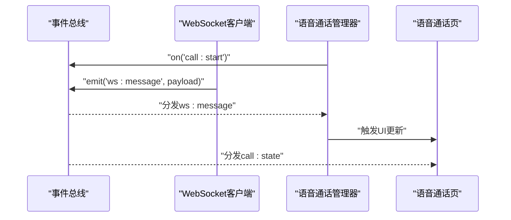
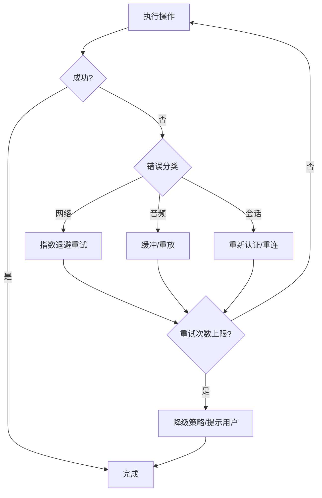
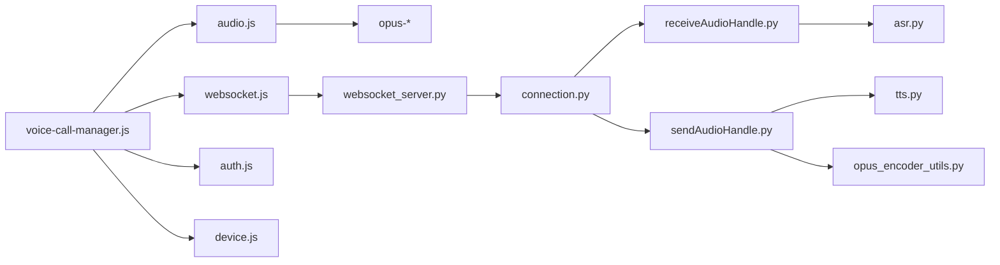

# 核心功能模块

<cite>
**本文引用的文件**   
- [voice-call.js](file://main/miniprogram/pages/voice-call/voice-call.js)
- [voice-call.wxml](file://main/miniprogram/pages/voice-call/voice-call.wxml)
- [voice-call.wxss](file://main/miniprogram/pages/voice-call/voice-call.wxss)
- [voice-call-manager.js](file://main/miniprogram/utils/voice-call-manager.js)
- [audio.js](file://main/miniprogram/utils/audio.js)
- [websocket.js](file://main/miniprogram/utils/websocket.js)
- [opus-decoder.js](file://main/miniprogram/libs/opus/opus-decoder.js)
- [opus-runtime.js](file://main/miniprogram/libs/opus/opus-runtime.js)
- [auth.js](file://main/miniprogram/utils/auth.js)
- [request.js](file://main/miniprogram/utils/request.js)
- [device.js](file://main/miniprogram/utils/device.js)
- [app.json](file://main/miniprogram/app.json)
- [app.js](file://main/miniprogram/app.js)
- [receiveAudioHandle.py](file://main/xiaozhi-server/core/handle/receiveAudioHandle.py)
- [sendAudioHandle.py](file://main/xiaozhi-server/core/handle/sendAudioHandle.py)
- [connection.py](file://main/xiaozhi-server/core/connection.py)
- [websocket_server.py](file://main/xiaozhi-server/core/websocket_server.py)
- [opus_encoder_utils.py](file://main/xiaozhi-server/core/utils/opus_encoder_utils.py)
- [tts.py](file://main/xiaozhi-server/core/utils/tts.py)
- [asr.py](file://main/xiaozhi-server/core/utils/asr.py)
</cite>

## 目录
1. [简介](#简介)
2. [项目结构](#项目结构)
3. [核心组件](#核心组件)
4. [架构总览](#架构总览)
5. [详细组件分析](#详细组件分析)
6. [依赖关系分析](#依赖关系分析)
7. [性能考虑](#性能考虑)
8. [故障排查指南](#故障排查指南)
9. [结论](#结论)
10. [附录](#附录)

## 简介
本文件面向微信小程序端与后端服务，系统化梳理语音通话、设备管理、用户认证、数据存储、消息推送与事件监听、错误处理与异常恢复等核心能力。文档从系统架构到代码级实现逐层展开，配合时序图、类图和流程图帮助读者快速理解数据流转与控制流，并提供可操作的API说明、配置参数与优化建议。

## 项目结构
小程序端以页面+工具库+音频编解码为核心组织：
- 页面层：语音通话页（voice-call）负责UI交互与状态展示
- 工具层：语音通话管理器（voice-call-manager）、音频处理（audio）、WebSocket通信（websocket）、认证（auth）、请求封装（request）、设备管理（device）
- 音频编解码：libs/opus 提供Opus编码/解码运行时
- 服务端：Python WebSocket 服务器、音频接收/发送处理器、ASR/TTS工具、连接管理等

**图表来源** 
- [voice-call.js](file://main/miniprogram/pages/voice-call/voice-call.js)
- [voice-call-manager.js](file://main/miniprogram/utils/voice-call-manager.js)
- [audio.js](file://main/miniprogram/utils/audio.js)
- [websocket.js](file://main/miniprogram/utils/websocket.js)
- [opus-decoder.js](file://main/miniprogram/libs/opus/opus-decoder.js)
- [opus-runtime.js](file://main/miniprogram/libs/opus/opus-runtime.js)
- [auth.js](file://main/miniprogram/utils/auth.js)
- [request.js](file://main/miniprogram/utils/request.js)
- [device.js](file://main/miniprogram/utils/device.js)
- [websocket_server.py](file://main/xiaozhi-server/core/websocket_server.py)
- [connection.py](file://main/xiaozhi-server/core/connection.py)
- [receiveAudioHandle.py](file://main/xiaozhi-server/core/handle/receiveAudioHandle.py)
- [sendAudioHandle.py](file://main/xiaozhi-server/core/handle/sendAudioHandle.py)
- [asr.py](file://main/xiaozhi-server/core/utils/asr.py)
- [tts.py](file://main/xiaozhi-server/core/utils/tts.py)
- [opus_encoder_utils.py](file://main/xiaozhi-server/core/utils/opus_encoder_utils.py)

**章节来源**
- [app.json](file://main/miniprogram/app.json)
- [app.js](file://main/miniprogram/app.js)

## 核心组件
- 语音通话模块：负责录音采集、Opus编码、实时传输、远端播放控制与UI反馈
- 设备管理模块：设备发现、配对连接、在线状态监控、参数配置下发
- 用户认证模块：登录注册、权限校验、会话管理与安全存储
- 数据存储模块：本地缓存、数据库操作、数据同步与离线支持
- 消息推送与事件监听：WebSocket事件分发、业务事件回调
- 错误处理与异常恢复：网络重试、断线重连、降级策略

**章节来源**
- [voice-call-manager.js](file://main/miniprogram/utils/voice-call-manager.js)
- [audio.js](file://main/miniprogram/utils/audio.js)
- [websocket.js](file://main/miniprogram/utils/websocket.js)
- [auth.js](file://main/miniprogram/utils/auth.js)
- [request.js](file://main/miniprogram/utils/request.js)
- [device.js](file://main/miniprogram/utils/device.js)

## 架构总览
小程序通过语音通话管理器协调录音、编码与WebSocket发送；服务端WebSocket接收音频帧，经ASR转文本后进入对话流程，TTS生成回复并编码为Opus回推至小程序播放。

**图表来源** 
- [voice-call-manager.js](file://main/miniprogram/utils/voice-call-manager.js)
- [audio.js](file://main/miniprogram/utils/audio.js)
- [websocket.js](file://main/miniprogram/utils/websocket.js)
- [websocket_server.py](file://main/xiaozhi-server/core/websocket_server.py)
- [connection.py](file://main/xiaozhi-server/core/connection.py)
- [receiveAudioHandle.py](file://main/xiaozhi-server/core/handle/receiveAudioHandle.py)
- [sendAudioHandle.py](file://main/xiaozhi-server/core/handle/sendAudioHandle.py)
- [asr.py](file://main/xiaozhi-server/core/utils/asr.py)
- [tts.py](file://main/xiaozhi-server/core/utils/tts.py)

## 详细组件分析

### 语音通话模块
- 录音与采集：使用小程序录音接口获取PCM帧，按固定时长分片
- 编码压缩：前端采用Opus编码器将PCM压缩为二进制帧，降低带宽占用
- 实时传输：通过WebSocket持续发送音频帧，服务端按帧顺序处理
- 播放控制：收到服务端音频帧后解码为PCM并播放，支持暂停/停止/音量控制
- UI联动：通话状态（准备中、通话中、静音、断开）与按钮状态联动

**图表来源** 
- [voice-call-manager.js](file://main/miniprogram/utils/voice-call-manager.js)
- [audio.js](file://main/miniprogram/utils/audio.js)
- [opus-decoder.js](file://main/miniprogram/libs/opus/opus-decoder.js)
- [opus-runtime.js](file://main/miniprogram/libs/opus/opus-runtime.js)

**章节来源**
- [voice-call.js](file://main/miniprogram/pages/voice-call/voice-call.js)
- [voice-call.wxml](file://main/miniprogram/pages/voice-call/voice-call.wxml)
- [voice-call.wxss](file://main/miniprogram/pages/voice-call/voice-call.wxss)
- [voice-call-manager.js](file://main/miniprogram/utils/voice-call-manager.js)
- [audio.js](file://main/miniprogram/utils/audio.js)

### 设备管理模块
- 设备发现：扫描或扫码获取设备信息，建立初始绑定
- 连接建立：通过WebSocket或HTTP握手完成鉴权与会话创建
- 状态监控：心跳检测、在线/离线状态上报、信号强度与延迟统计
- 配置管理：下发设备参数（如采样率、VAD阈值、TTS模型），支持OTA升级

**图表来源** 
- [device.js](file://main/miniprogram/utils/device.js)
- [websocket.js](file://main/miniprogram/utils/websocket.js)
- [request.js](file://main/miniprogram/utils/request.js)

**章节来源**
- [device.js](file://main/miniprogram/utils/device.js)
- [websocket.js](file://main/miniprogram/utils/websocket.js)

### 用户认证模块
- 登录注册：微信授权或手机号验证码登录，后端签发JWT/会话令牌
- 权限验证：接口级鉴权，角色/权限校验，敏感操作二次确认
- 会话管理：Token刷新、多端互踢、会话过期清理
- 安全存储：本地加密存储Token与敏感信息，避免明文泄露

**图表来源** 
- [auth.js](file://main/miniprogram/utils/auth.js)
- [request.js](file://main/miniprogram/utils/request.js)

**章节来源**
- [auth.js](file://main/miniprogram/utils/auth.js)
- [request.js](file://main/miniprogram/utils/request.js)

### 数据存储机制
- 本地缓存：键值对缓存常用配置与临时数据，支持过期策略
- 数据库操作：SQLite/WXStorage用于结构化数据持久化
- 数据同步：增量同步与冲突解决，保证多端一致性
- 离线支持：关键数据本地可用，网络恢复后自动同步

**图表来源** 
- [request.js](file://main/miniprogram/utils/request.js)
- [auth.js](file://main/miniprogram/utils/auth.js)

**章节来源**
- [request.js](file://main/miniprogram/utils/request.js)
- [auth.js](file://main/miniprogram/utils/auth.js)

### 消息推送与事件监听
- 事件总线：统一事件注册与分发，解耦模块间通信
- WebSocket事件：连接状态、音频帧、设备状态、配置变更等事件
- 错误事件：网络异常、解码失败、播放中断等异常上报

**图表来源** 
- [websocket.js](file://main/miniprogram/utils/websocket.js)
- [voice-call-manager.js](file://main/miniprogram/utils/voice-call-manager.js)

**章节来源**
- [websocket.js](file://main/miniprogram/utils/websocket.js)
- [voice-call-manager.js](file://main/miniprogram/utils/voice-call-manager.js)

### 错误处理与异常恢复
- 网络异常：超时、断网、握手失败，自动重试与降级
- 音频异常：编码失败、解码错误、播放卡顿，缓冲与重放
- 会话异常：Token失效、设备离线，提示重新登录或重连

**图表来源** 
- [request.js](file://main/miniprogram/utils/request.js)
- [audio.js](file://main/miniprogram/utils/audio.js)
- [auth.js](file://main/miniprogram/utils/auth.js)

**章节来源**
- [request.js](file://main/miniprogram/utils/request.js)
- [audio.js](file://main/miniprogram/utils/audio.js)
- [auth.js](file://main/miniprogram/utils/auth.js)

## 依赖关系分析
- 小程序端依赖：语音通话管理器依赖音频处理、WebSocket、认证与设备管理；音频处理依赖Opus编解码库
- 服务端依赖：WebSocket服务器依赖连接管理，音频处理器依赖ASR/TTS与Opus编码工具

**图表来源** 
- [voice-call-manager.js](file://main/miniprogram/utils/voice-call-manager.js)
- [audio.js](file://main/miniprogram/utils/audio.js)
- [websocket.js](file://main/miniprogram/utils/websocket.js)
- [auth.js](file://main/miniprogram/utils/auth.js)
- [device.js](file://main/miniprogram/utils/device.js)
- [websocket_server.py](file://main/xiaozhi-server/core/websocket_server.py)
- [connection.py](file://main/xiaozhi-server/core/connection.py)
- [receiveAudioHandle.py](file://main/xiaozhi-server/core/handle/receiveAudioHandle.py)
- [sendAudioHandle.py](file://main/xiaozhi-server/core/handle/sendAudioHandle.py)
- [asr.py](file://main/xiaozhi-server/core/utils/asr.py)
- [tts.py](file://main/xiaozhi-server/core/utils/tts.py)
- [opus_encoder_utils.py](file://main/xiaozhi-server/core/utils/opus_encoder_utils.py)

**章节来源**
- [voice-call-manager.js](file://main/miniprogram/utils/voice-call-manager.js)
- [websocket_server.py](file://main/xiaozhi-server/core/websocket_server.py)

## 性能考虑
- 前端编码优化：合理设置Opus码率与帧长，平衡音质与带宽；批量发送减少握手开销
- 播放缓冲：引入环形缓冲与预加载，降低卡顿概率；动态调整播放速率补偿抖动
- 网络优化：WebSocket复用连接，心跳保活；失败重试采用指数退避与最大重试次数限制
- 服务端吞吐：ASR/TTS异步流水线处理，GPU/CPU资源隔离；音频帧大小与采样率可调
- 内存管理：及时释放录音/播放资源，避免内存泄漏；大对象池化复用

[本节为通用指导，不直接分析具体文件]

## 故障排查指南
- 无法录音：检查麦克风权限、录音初始化参数、设备兼容性
- 无声播放：确认远端音频帧到达、解码器加载、播放权限与音量设置
- 连接不稳定：查看心跳间隔、丢包率、网络质量；必要时切换网络或降低码率
- 认证失败：检查Token有效期、签名校验、跨域与HTTPS配置
- 设备离线：核对设备在线状态上报、服务端会话清理策略

**章节来源**
- [audio.js](file://main/miniprogram/utils/audio.js)
- [websocket.js](file://main/miniprogram/utils/websocket.js)
- [auth.js](file://main/miniprogram/utils/auth.js)
- [device.js](file://main/miniprogram/utils/device.js)

## 结论
本方案通过小程序端与后端服务的协同，实现了稳定的语音通话链路：前端录音与Opus编码、实时传输、远端播放控制；服务端ASR/TTS流水线与Opus编码回推。结合设备管理、认证鉴权、数据存储与事件机制，形成完整的端到端解决方案。建议在性能与稳定性方面持续优化，提升用户体验与系统可靠性。

[本节为总结性内容，不直接分析具体文件]

## 附录
- API参考（示例路径）
  - 登录注册：POST /auth/login、POST /auth/register
  - 设备管理：GET /device/list、POST /device/bind、PUT /device/config
  - 语音通话：WebSocket wss://.../voice-call
- 配置参数（示例）
  - 录音：采样率、声道数、码率、帧长
  - Opus：码率、复杂度、 FEC开关
  - WebSocket：心跳间隔、重连策略、缓冲区大小
  - 服务端：ASR/TTS模型选择、并发线程数、队列长度

[本节为补充信息，不直接分析具体文件]