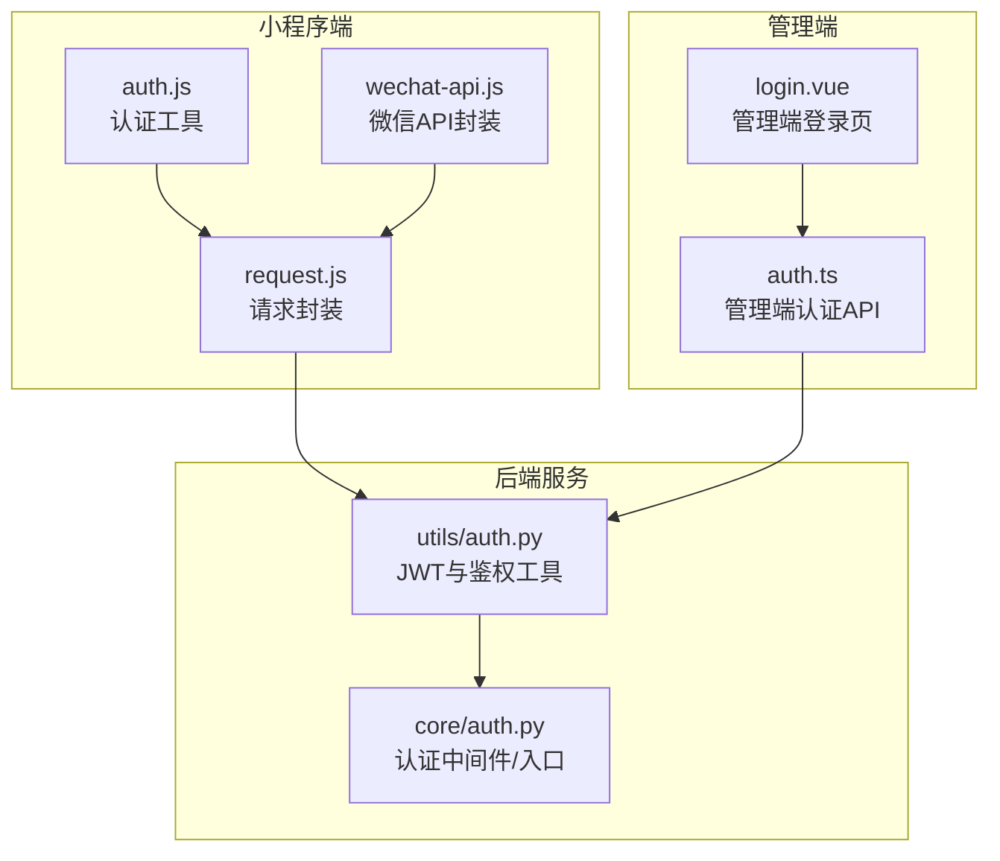
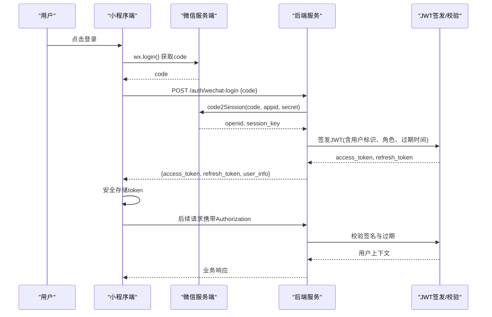
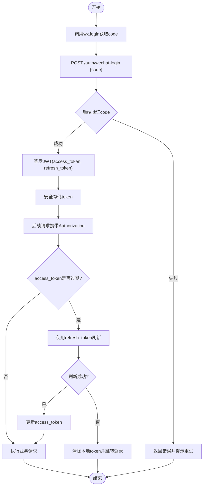
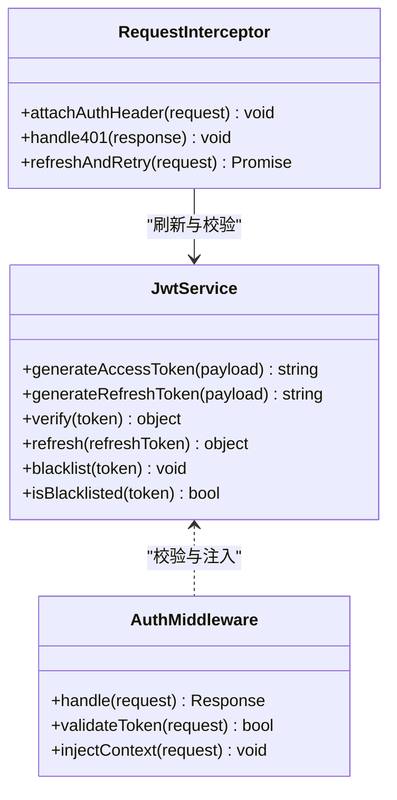
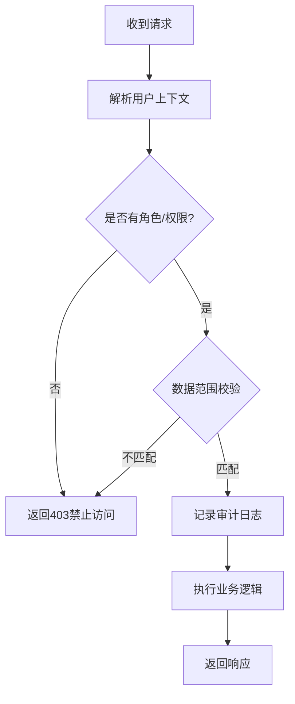
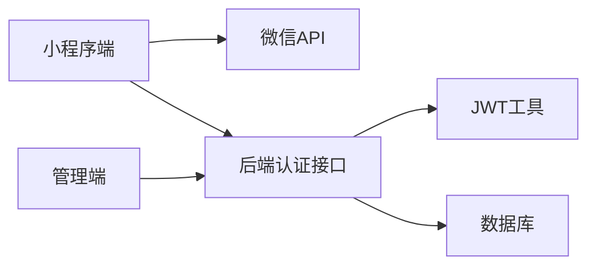

# 用户认证系统

<cite>
**本文引用的文件**   
- [egg-wechat-auth-design.md](file://docs/superpowers/specs/2026-07-11-egg-wechat-auth-design.md)
- [auth.js](file://main/egg-miniprogram/miniprogram/utils/auth.js)
- [request.js](file://main/egg-miniprogram/miniprogram/utils/request.js)
- [wechat-api.js](file://main/egg-miniprogram/miniprogram/utils/wechat-api.js)
- [manager-api auth.ts](file://main/manager-mobile/src/api/auth.ts)
- [manager-web login.vue](file://main/manager-web/src/views/login.vue)
- [xiaozhi-server utils/auth.py](file://main/xiaozhi-server/core/utils/auth.py)
- [xiaozhi-server core/auth.py](file://main/xiaozhi-server/core/auth.py)
</cite>

## 目录
1. [简介](#简介)
2. [项目结构](#项目结构)
3. [核心组件](#核心组件)
4. [架构总览](#架构总览)
5. [详细组件分析](#详细组件分析)
6. [依赖分析](#依赖分析)
7. [性能考虑](#性能考虑)
8. [故障排查指南](#故障排查指南)
9. [结论](#结论)
10. [附录](#附录)

## 简介
本文件面向微信小程序的用户认证系统，围绕微信登录集成、授权流程、OpenID映射、会话管理、JWT令牌机制（生成、验证、刷新、存储）、权限控制（角色、访问控制、数据隔离、操作审计）、安全存储（敏感信息加密、本地缓存保护、传输层安全）以及用户信息管理、密码重置、多设备登录与登出清理等能力进行系统化说明。文档同时提供认证流程图、API接口规范、错误处理机制与安全最佳实践，帮助开发者快速理解并落地实现。

## 项目结构
本项目包含小程序端、管理端（移动端与Web端）以及后端服务，认证相关代码分布在以下位置：
- 小程序端：utils/auth.js、utils/request.js、utils/wechat-api.js
- 管理端（移动端）：api/auth.ts
- 管理端（Web端）：views/login.vue
- 后端服务：core/utils/auth.py、core/auth.py

图表来源 
- [auth.js](file://main/egg-miniprogram/miniprogram/utils/auth.js)
- [request.js](file://main/egg-miniprogram/miniprogram/utils/request.js)
- [wechat-api.js](file://main/egg-miniprogram/miniprogram/utils/wechat-api.js)
- [manager-api auth.ts](file://main/manager-mobile/src/api/auth.ts)
- [manager-web login.vue](file://main/manager-web/src/views/login.vue)
- [xiaozhi-server utils/auth.py](file://main/xiaozhi-server/core/utils/auth.py)
- [xiaozhi-server core/auth.py](file://main/xiaozhi-server/core/auth.py)

章节来源
- [egg-wechat-auth-design.md](file://docs/superpowers/specs/2026-07-11-egg-wechat-auth-design.md)

## 核心组件
- 小程序认证工具（auth.js）：封装微信登录、授权、OpenID获取、Token存取与自动刷新逻辑。
- 请求封装（request.js）：统一拦截器，注入Authorization头、处理401重定向与刷新策略。
- 微信API封装（wechat-api.js）：调用微信服务端接口（如code2Session），完成临时凭证换取OpenID/UnionID。
- 管理端认证API（auth.ts）：管理端登录、注册、密码重置、Token获取与刷新。
- 管理端登录页（login.vue）：触发登录流程、展示错误、跳转受保护页面。
- 后端认证工具（utils/auth.py）：JWT签发、校验、刷新、黑名单与过期策略。
- 后端认证入口（core/auth.py）：鉴权中间件、路由级权限校验、会话上下文注入。

章节来源
- [auth.js](file://main/egg-miniprogram/miniprogram/utils/auth.js)
- [request.js](file://main/egg-miniprogram/miniprogram/utils/request.js)
- [wechat-api.js](file://main/egg-miniprogram/miniprogram/utils/wechat-api.js)
- [manager-api auth.ts](file://main/manager-mobile/src/api/auth.ts)
- [manager-web login.vue](file://main/manager-web/src/views/login.vue)
- [xiaozhi-server utils/auth.py](file://main/xiaozhi-server/core/utils/auth.py)
- [xiaozhi-server core/auth.py](file://main/xiaozhi-server/core/auth.py)

## 架构总览
整体认证架构采用“小程序/管理端 + 后端服务”的分层设计：
- 前端负责发起微信登录或账号密码登录，维护短期令牌与刷新令牌。
- 后端负责签发JWT、校验签名、维护会话状态与权限上下文。
- 通过统一的请求拦截器确保所有业务请求携带有效令牌，并在失效时自动刷新或引导重新登录。

图表来源 
- [wechat-api.js](file://main/egg-miniprogram/miniprogram/utils/wechat-api.js)
- [manager-api auth.ts](file://main/manager-mobile/src/api/auth.ts)
- [xiaozhi-server utils/auth.py](file://main/xiaozhi-server/core/utils/auth.py)
- [xiaozhi-server core/auth.py](file://main/xiaozhi-server/core/auth.py)

## 详细组件分析

### 小程序认证流程（微信登录）
- 授权流程：小程序端调用wx.login获取code，随后调用后端接口换取OpenID/UnionID，并建立会话。
- OpenID映射：后端根据openid查找或创建用户记录，绑定角色与权限。
- 会话管理：后端签发JWT（access_token、refresh_token），前端安全存储并在请求中注入。
- 自动刷新：当access_token过期时，使用refresh_token刷新新令牌；失败则引导重新登录。

图表来源 
- [auth.js](file://main/egg-miniprogram/miniprogram/utils/auth.js)
- [request.js](file://main/egg-miniprogram/miniprogram/utils/request.js)
- [wechat-api.js](file://main/egg-miniprogram/miniprogram/utils/wechat-api.js)
- [xiaozhi-server utils/auth.py](file://main/xiaozhi-server/core/utils/auth.py)
- [xiaozhi-server core/auth.py](file://main/xiaozhi-server/core/auth.py)

章节来源
- [auth.js](file://main/egg-miniprogram/miniprogram/utils/auth.js)
- [request.js](file://main/egg-miniprogram/miniprogram/utils/request.js)
- [wechat-api.js](file://main/egg-miniprogram/miniprogram/utils/wechat-api.js)
- [xiaozhi-server utils/auth.py](file://main/xiaozhi-server/core/utils/auth.py)
- [xiaozhi-server core/auth.py](file://main/xiaozhi-server/core/auth.py)

### JWT令牌机制
- 令牌生成：后端基于用户标识、角色、过期时间等信息签发JWT，并返回access_token与refresh_token。
- 令牌验证：请求进入鉴权中间件时校验签名、有效期与黑名单；通过后注入用户上下文。
- 令牌刷新：前端在access_token过期时使用refresh_token调用刷新接口，成功后更新本地存储。
- 存储策略：小程序端将access_token与refresh_token存入安全存储（如storage），避免明文泄露；必要时结合加密。

图表来源 
- [xiaozhi-server utils/auth.py](file://main/xiaozhi-server/core/utils/auth.py)
- [xiaozhi-server core/auth.py](file://main/xiaozhi-server/core/auth.py)
- [request.js](file://main/egg-miniprogram/miniprogram/utils/request.js)

章节来源
- [xiaozhi-server utils/auth.py](file://main/xiaozhi-server/core/utils/auth.py)
- [xiaozhi-server core/auth.py](file://main/xiaozhi-server/core/auth.py)
- [request.js](file://main/egg-miniprogram/miniprogram/utils/request.js)

### 权限控制系统
- 角色管理：用户模型包含角色字段，支持多角色分配与继承。
- 访问控制：路由级鉴权，校验用户角色与资源权限；未授权返回403。
- 数据隔离：按用户ID或租户ID过滤数据，防止越权访问。
- 操作审计：关键操作记录审计日志，包括用户、动作、时间、IP等。

图表来源 
- [xiaozhi-server core/auth.py](file://main/xiaozhi-server/core/auth.py)

章节来源
- [xiaozhi-server core/auth.py](file://main/xiaozhi-server/core/auth.py)

### 安全存储方案
- 敏感信息加密：对密码、密钥等敏感数据进行加密存储（如AES），避免明文。
- 本地缓存保护：小程序端使用安全存储API，限制访问范围；必要时增加二次校验。
- 传输层安全：全站启用HTTPS，强制TLS；Cookie设置Secure、HttpOnly、SameSite。

章节来源
- [auth.js](file://main/egg-miniprogram/miniprogram/utils/auth.js)
- [request.js](file://main/egg-miniprogram/miniprogram/utils/request.js)

### 用户信息管理、密码重置、多设备登录、登出清理
- 用户信息管理：支持头像、昵称、手机号等字段更新；变更需鉴权。
- 密码重置：通过短信/邮箱验证码重置密码，重置后强制刷新令牌。
- 多设备登录：支持同一用户多设备并发；可配置最大在线数与踢下线策略。
- 登出清理：清除本地token、撤销服务端会话、清空敏感缓存。

章节来源
- [manager-api auth.ts](file://main/manager-mobile/src/api/auth.ts)
- [manager-web login.vue](file://main/manager-web/src/views/login.vue)
- [xiaozhi-server utils/auth.py](file://main/xiaozhi-server/core/utils/auth.py)

## 依赖分析
认证模块的依赖关系如下：
- 小程序端依赖微信API与服务端认证接口。
- 管理端依赖认证API与JWT校验。
- 后端服务依赖JWT工具与数据库（用户、角色、审计）。

图表来源 
- [wechat-api.js](file://main/egg-miniprogram/miniprogram/utils/wechat-api.js)
- [manager-api auth.ts](file://main/manager-mobile/src/api/auth.ts)
- [xiaozhi-server utils/auth.py](file://main/xiaozhi-server/core/utils/auth.py)

章节来源
- [wechat-api.js](file://main/egg-miniprogram/miniprogram/utils/wechat-api.js)
- [manager-api auth.ts](file://main/manager-mobile/src/api/auth.ts)
- [xiaozhi-server utils/auth.py](file://main/xiaozhi-server/core/utils/auth.py)

## 性能考虑
- 令牌刷新：减少重复登录，提升用户体验；建议批量刷新与防抖。
- 缓存策略：对用户信息、角色权限进行短期缓存，降低数据库压力。
- 异步处理：登录与刷新采用异步队列，避免阻塞主线程。
- 连接池：数据库与外部API连接复用，提高吞吐。

[本节为通用指导，无需特定文件引用]

## 故障排查指南
- 常见问题：
  - code无效或过期：检查网络与微信服务端状态，重试登录。
  - JWT校验失败：确认签名、过期时间与黑名单状态。
  - 401未授权：检查Authorization头是否正确注入。
  - 刷新失败：确认refresh_token有效且未被吊销。
- 调试建议：
  - 打印请求头与响应体，定位问题阶段。
  - 查看服务端日志，关注鉴权中间件输出。
  - 使用抓包工具验证HTTPS与证书链。

章节来源
- [request.js](file://main/egg-miniprogram/miniprogram/utils/request.js)
- [xiaozhi-server utils/auth.py](file://main/xiaozhi-server/core/utils/auth.py)

## 结论
本认证系统以微信小程序登录为核心，结合JWT令牌与权限控制，构建了安全、可扩展的认证体系。通过统一的请求拦截与自动刷新机制，提升了用户体验与安全性。建议在部署时强化传输层安全与敏感信息加密，并完善操作审计与监控告警，以保障生产环境的稳定运行。

[本节为总结性内容，无需特定文件引用]

## 附录
- API接口规范（示例）：
  - POST /auth/wechat-login：传入code，返回access_token、refresh_token与用户信息。
  - POST /auth/refresh：传入refresh_token，返回新的access_token。
  - GET /auth/user/profile：获取当前用户信息。
  - PUT /auth/user/profile：更新用户信息。
  - POST /auth/password/reset：发送重置链接或验证码。
  - POST /auth/logout：登出，清除会话。
- 错误码约定：
  - 400：参数错误
  - 401：未认证或令牌无效
  - 403：权限不足
  - 404：资源不存在
  - 500：服务器内部错误

[本节为通用规范，无需特定文件引用]