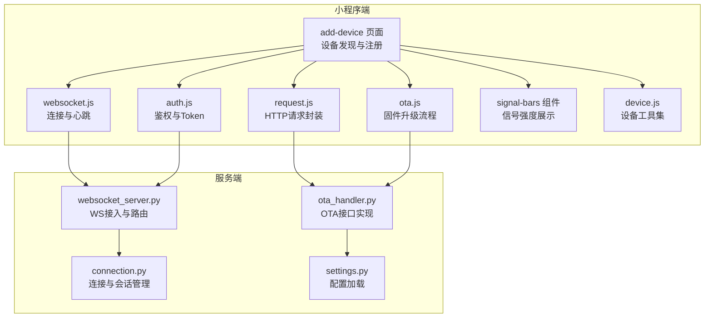
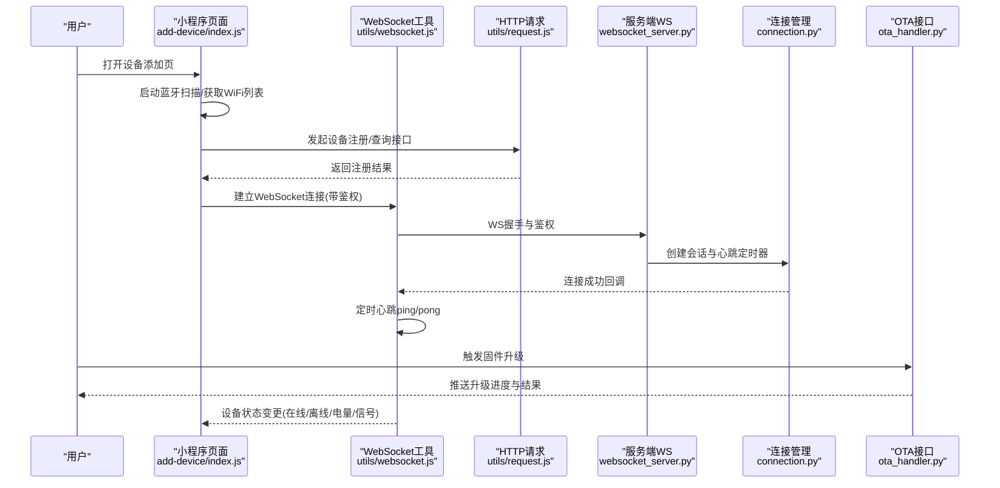
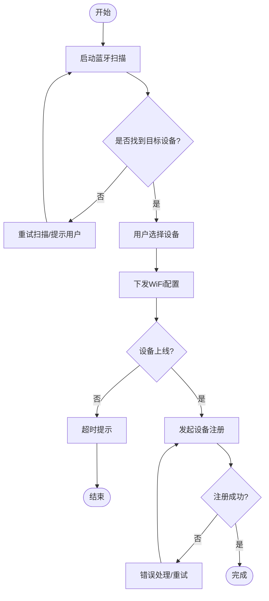
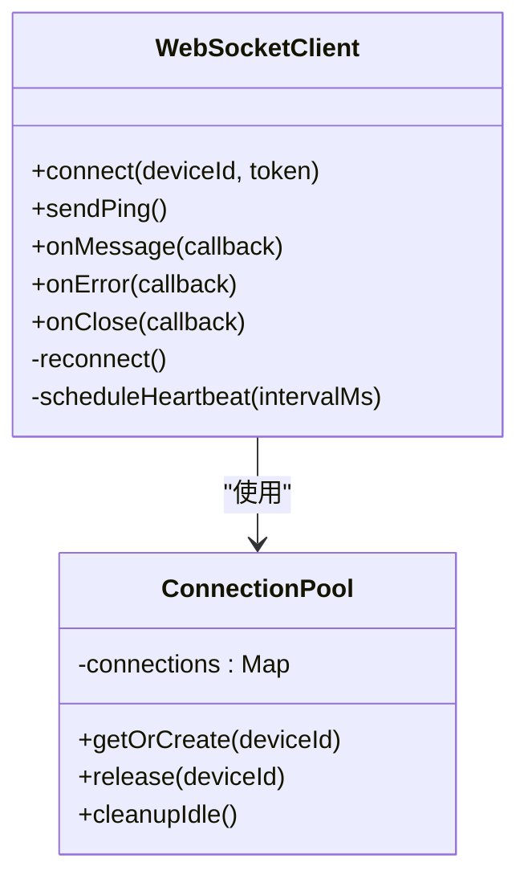
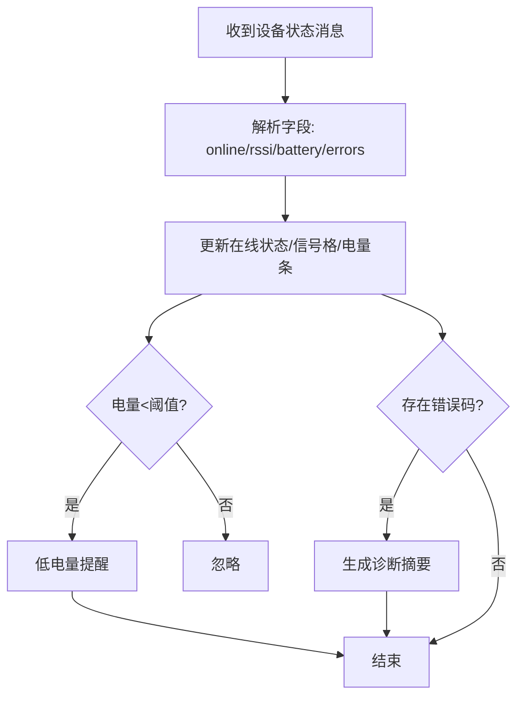
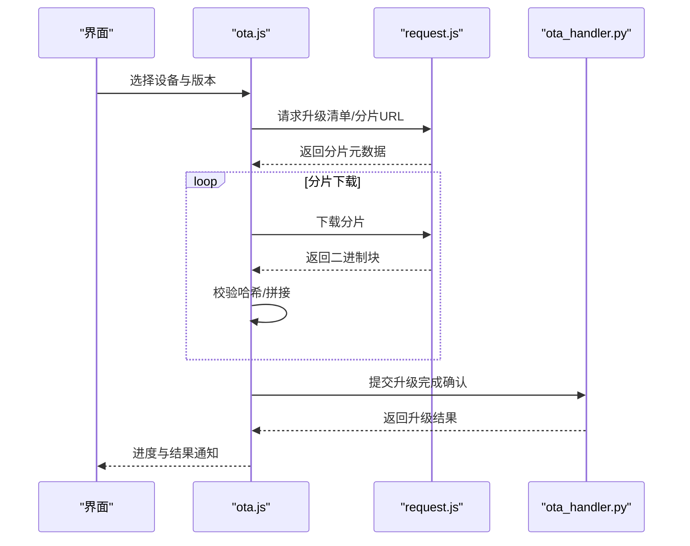
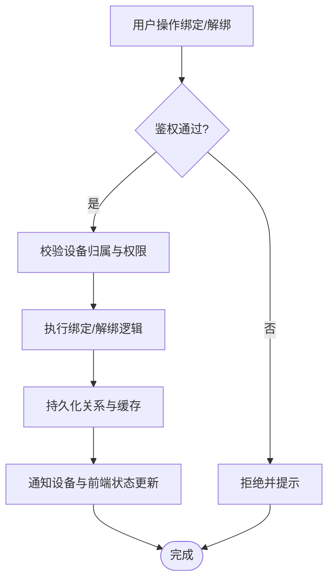
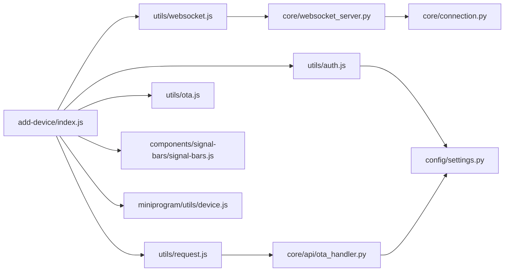

# 设备管理

<cite>
**本文引用的文件**   
- [main/egg-miniprogram/miniprogram/utils/websocket.js](file://main/egg-miniprogram/miniprogram/utils/websocket.js)
- [main/egg-miniprogram/miniprogram/utils/request.js](file://main/egg-miniprogram/miniprogram/utils/request.js)
- [main/egg-miniprogram/miniprogram/utils/auth.js](file://main/egg-miniprogram/miniprogram/utils/auth.js)
- [main/egg-miniprogram/miniprogram/utils/ota.js](file://main/egg-miniprogram/miniprogram/utils/ota.js)
- [main/egg-miniprogram/miniprogram/pages/add-device/index.js](file://main/egg-miniprogram/miniprogram/pages/add-device/index.js)
- [main/egg-miniprogram/miniprogram/pages/add-device/logic.js](file://main/egg-miniprogram/miniprogram/pages/add-device/logic.js)
- [main/egg-miniprogram/miniprogram/pages/home/index.js](file://main/egg-miniprogram/miniprogram/pages/home/index.js)
- [main/egg-miniprogram/miniprogram/components/signal-bars/signal-bars.js](file://main/egg-miniprogram/miniprogram/components/signal-bars/signal-bars.js)
- [main/miniprogram/utils/device.js](file://main/miniprogram/utils/device.js)
- [main/miniprogram/utils/websocket.js](file://main/miniprogram/utils/websocket.js)
- [main/miniprogram/utils/request.js](file://main/miniprogram/utils/request.js)
- [main/miniprogram/utils/auth.js](file://main/miniprogram/utils/auth.js)
- [main/xiaozhi-server/core/websocket_server.py](file://main/xiaozhi-server/core/websocket_server.py)
- [main/xiaozhi-server/core/connection.py](file://main/xiaozhi-server/core/connection.py)
- [main/xiaozhi-server/core/api/ota_handler.py](file://main/xiaozhi-server/core/api/ota_handler.py)
- [main/xiaozhi-server/config/settings.py](file://main/xiaozhi-server/config/settings.py)
</cite>

## 目录
1. [简介](#简介)
2. [项目结构](#项目结构)
3. [核心组件](#核心组件)
4. [架构总览](#架构总览)
5. [详细组件分析](#详细组件分析)
6. [依赖关系分析](#依赖关系分析)
7. [性能考虑](#性能考虑)
8. [故障排查指南](#故障排查指南)
9. [结论](#结论)
10. [附录：API与错误码、最佳实践](#附录api与错误码最佳实践)

## 简介
本文件为微信小程序“设备管理”功能的全面技术文档，覆盖设备发现（蓝牙扫描、WiFi配置、设备注册）、连接管理（WebSocket建立、心跳检测、断线重连、连接池）、状态监控（在线状态、信号强度、电量、故障诊断）、配置管理（参数设置、固件升级、配置同步、批量操作）、绑定与解绑、权限与安全等。文档同时给出端到端流程图、类图与时序图，并总结常见问题的定位方法与优化建议。

## 项目结构
本项目包含多个前端与后端子工程，与设备管理相关的关键位置如下：
- 小程序端（egg-miniprogram）：设备添加页面、WebSocket工具、请求封装、OTA升级、信号强度组件等
- 小程序端（miniprogram）：通用设备工具、WebSocket封装、请求与鉴权工具
- 服务端（xiaozhi-server）：WebSocket服务、连接管理、OTA接口、配置加载

**图表来源** 
- [main/egg-miniprogram/miniprogram/pages/add-device/index.js:1-200](file://main/egg-miniprogram/miniprogram/pages/add-device/index.js#L1-L200)
- [main/egg-miniprogram/miniprogram/utils/websocket.js:1-200](file://main/egg-miniprogram/miniprogram/utils/websocket.js#L1-L200)
- [main/egg-miniprogram/miniprogram/utils/request.js:1-200](file://main/egg-miniprogram/miniprogram/utils/request.js#L1-L200)
- [main/egg-miniprogram/miniprogram/utils/auth.js:1-200](file://main/egg-miniprogram/miniprogram/utils/auth.js#L1-L200)
- [main/egg-miniprogram/miniprogram/utils/ota.js:1-200](file://main/egg-miniprogram/miniprogram/utils/ota.js#L1-L200)
- [main/egg-miniprogram/miniprogram/components/signal-bars/signal-bars.js:1-200](file://main/egg-miniprogram/miniprogram/components/signal-bars/signal-bars.js#L1-L200)
- [main/miniprogram/utils/device.js:1-200](file://main/miniprogram/utils/device.js#L1-L200)
- [main/miniprogram/utils/websocket.js:1-200](file://main/miniprogram/utils/websocket.js#L1-L200)
- [main/miniprogram/utils/request.js:1-200](file://main/miniprogram/utils/request.js#L1-L200)
- [main/miniprogram/utils/auth.js:1-200](file://main/miniprogram/utils/auth.js#L1-L200)
- [main/xiaozhi-server/core/websocket_server.py:1-200](file://main/xiaozhi-server/core/websocket_server.py#L1-L200)
- [main/xiaozhi-server/core/connection.py:1-200](file://main/xiaozhi-server/core/connection.py#L1-L200)
- [main/xiaozhi-server/core/api/ota_handler.py:1-200](file://main/xiaozhi-server/core/api/ota_handler.py#L1-L200)
- [main/xiaozhi-server/config/settings.py:1-200](file://main/xiaozhi-server/config/settings.py#L1-L200)

**章节来源**
- [main/egg-miniprogram/miniprogram/pages/add-device/index.js:1-200](file://main/egg-miniprogram/miniprogram/pages/add-device/index.js#L1-L200)
- [main/egg-miniprogram/miniprogram/utils/websocket.js:1-200](file://main/egg-miniprogram/miniprogram/utils/websocket.js#L1-L200)
- [main/egg-miniprogram/miniprogram/utils/request.js:1-200](file://main/egg-miniprogram/miniprogram/utils/request.js#L1-L200)
- [main/egg-miniprogram/miniprogram/utils/auth.js:1-200](file://main/egg-miniprogram/miniprogram/utils/auth.js#L1-L200)
- [main/egg-miniprogram/miniprogram/utils/ota.js:1-200](file://main/egg-miniprogram/miniprogram/utils/ota.js#L1-L200)
- [main/egg-miniprogram/miniprogram/components/signal-bars/signal-bars.js:1-200](file://main/egg-miniprogram/miniprogram/components/signal-bars/signal-bars.js#L1-L200)
- [main/miniprogram/utils/device.js:1-200](file://main/miniprogram/utils/device.js#L1-L200)
- [main/miniprogram/utils/websocket.js:1-200](file://main/miniprogram/utils/websocket.js#L1-L200)
- [main/miniprogram/utils/request.js:1-200](file://main/miniprogram/utils/request.js#L1-L200)
- [main/miniprogram/utils/auth.js:1-200](file://main/miniprogram/utils/auth.js#L1-L200)
- [main/xiaozhi-server/core/websocket_server.py:1-200](file://main/xiaozhi-server/core/websocket_server.py#L1-L200)
- [main/xiaozhi-server/core/connection.py:1-200](file://main/xiaozhi-server/core/connection.py#L1-L200)
- [main/xiaozhi-server/core/api/ota.js:1-200](file://main/xiaozhi-server/core/api/ota_handler.py#L1-L200)
- [main/xiaozhi-server/config/settings.py:1-200](file://main/xiaozhi-server/config/settings.py#L1-L200)

## 核心组件
- 设备发现与注册
  - 蓝牙扫描：调用系统蓝牙API，过滤设备名或广播数据，触发用户选择后进入配网流程
  - WiFi配置：通过小程序配网能力下发SSID/密码至设备，设备完成联网后上报注册信息
  - 设备注册：向服务端提交设备标识、网络信息与认证凭据，完成绑定与鉴权
- 连接管理
  - WebSocket建立：携带鉴权头与设备ID建立长连接
  - 心跳检测：定时发送ping，接收pong；超时未响应则判定离线
  - 断线重连：指数退避重试，限制最大次数，失败回退到提示
  - 连接池：按设备维度维护连接实例，避免重复创建与资源泄漏
- 状态监控
  - 在线状态：基于心跳与连接事件更新
  - 信号强度：从设备上报的RSSI或质量指标映射为格数显示
  - 电量监测：读取设备上报电量百分比，低电量告警
  - 故障诊断：收集错误码、日志片段与最近操作，辅助定位
- 配置管理
  - 参数设置：下发键值对配置，支持校验与回滚
  - 固件升级：分片下载与校验，进度回调与异常恢复
  - 配置文件同步：拉取云端配置并合并本地差异
  - 批量操作：对多设备执行统一配置或升级任务
- 绑定与解绑
  - 绑定：扫码或手动输入设备ID，完成用户-设备关联
  - 解绑：移除关联并清理本地缓存与连接
- 权限控制与安全
  - Token鉴权：登录态与设备访问令牌校验
  - 传输安全：HTTPS与WSS强制启用
  - 最小权限：按角色控制可操作设备范围

**章节来源**
- [main/egg-miniprogram/miniprogram/pages/add-device/index.js:1-200](file://main/egg-miniprogram/miniprogram/pages/add-device/index.js#L1-L200)
- [main/egg-miniprogram/miniprogram/pages/add-device/logic.js:1-200](file://main/egg-miniprogram/miniprogram/pages/add-device/logic.js#L1-L200)
- [main/egg-miniprogram/miniprogram/utils/websocket.js:1-200](file://main/egg-miniprogram/miniprogram/utils/websocket.js#L1-L200)
- [main/egg-miniprogram/miniprogram/utils/request.js:1-200](file://main/egg-miniprogram/miniprogram/utils/request.js#L1-L200)
- [main/egg-miniprogram/miniprogram/utils/auth.js:1-200](file://main/egg-miniprogram/miniprogram/utils/auth.js#L1-L200)
- [main/egg-miniprogram/miniprogram/utils/ota.js:1-200](file://main/egg-miniprogram/miniprogram/utils/ota.js#L1-L200)
- [main/egg-miniprogram/miniprogram/components/signal-bars/signal-bars.js:1-200](file://main/egg-miniprogram/miniprogram/components/signal-bars/signal-bars.js#L1-L200)
- [main/miniprogram/utils/device.js:1-200](file://main/miniprogram/utils/device.js#L1-L200)
- [main/miniprogram/utils/websocket.js:1-200](file://main/miniprogram/utils/websocket.js#L1-L200)
- [main/miniprogram/utils/request.js:1-200](file://main/miniprogram/utils/request.js#L1-L200)
- [main/miniprogram/utils/auth.js:1-200](file://main/miniprogram/utils/auth.js#L1-L200)
- [main/xiaozhi-server/core/websocket_server.py:1-200](file://main/xiaozhi-server/core/websocket_server.py#L1-L200)
- [main/xiaozhi-server/core/connection.py:1-200](file://main/xiaozhi-server/core/connection.py#L1-L200)
- [main/xiaozhi-server/core/api/ota_handler.py:1-200](file://main/xiaozhi-server/core/api/ota_handler.py#L1-L200)
- [main/xiaozhi-server/config/settings.py:1-200](file://main/xiaozhi-server/config/settings.py#L1-L200)

## 架构总览
设备管理涉及小程序端与服务端的协作，整体交互如下：

**图表来源** 
- [main/egg-miniprogram/miniprogram/pages/add-device/index.js:1-200](file://main/egg-miniprogram/miniprogram/pages/add-device/index.js#L1-L200)
- [main/egg-miniprogram/miniprogram/utils/websocket.js:1-200](file://main/egg-miniprogram/miniprogram/utils/websocket.js#L1-L200)
- [main/egg-miniprogram/miniprogram/utils/request.js:1-200](file://main/egg-miniprogram/miniprogram/utils/request.js#L1-L200)
- [main/xiaozhi-server/core/websocket_server.py:1-200](file://main/xiaozhi-server/core/websocket_server.py#L1-L200)
- [main/xiaozhi-server/core/connection.py:1-200](file://main/xiaozhi-server/core/connection.py#L1-L200)
- [main/xiaozhi-server/core/api/ota_handler.py:1-200](file://main/xiaozhi-server/core/api/ota_handler.py#L1-L200)

## 详细组件分析

### 设备发现与注册流程
- 蓝牙扫描：调用系统API扫描周边设备，过滤目标设备名或广播字段，用户选择后进入配网
- WiFi配置：将SSID与密码下发至设备，设备联网后上报MAC/序列号与网络状态
- 设备注册：向服务端提交设备信息，完成用户-设备绑定与鉴权初始化

**图表来源** 
- [main/egg-miniprogram/miniprogram/pages/add-device/index.js:1-200](file://main/egg-miniprogram/miniprogram/pages/add-device/index.js#L1-L200)
- [main/egg-miniprogram/miniprogram/pages/add-device/logic.js:1-200](file://main/egg-miniprogram/miniprogram/pages/add-device/logic.js#L1-L200)
- [main/egg-miniprogram/miniprogram/utils/request.js:1-200](file://main/egg-miniprogram/miniprogram/utils/request.js#L1-L200)

**章节来源**
- [main/egg-miniprogram/miniprogram/pages/add-device/index.js:1-200](file://main/egg-miniprogram/miniprogram/pages/add-device/index.js#L1-L200)
- [main/egg-miniprogram/miniprogram/pages/add-device/logic.js:1-200](file://main/egg-miniprogram/miniprogram/pages/add-device/logic.js#L1-L200)
- [main/egg-miniprogram/miniprogram/utils/request.js:1-200](file://main/egg-miniprogram/miniprogram/utils/request.js#L1-L200)

### WebSocket连接管理与心跳
- 连接建立：携带鉴权头与设备ID建立WSS连接，服务端验证通过后创建会话
- 心跳机制：客户端定时发送ping，服务端回复pong；若连续N次无pong则判定离线
- 断线重连：指数退避策略，限制最大重试次数，失败时降级提示
- 连接池：按设备维度复用连接，避免频繁握手与资源泄露

**图表来源** 
- [main/egg-miniprogram/miniprogram/utils/websocket.js:1-200](file://main/egg-miniprogram/miniprogram/utils/websocket.js#L1-L200)
- [main/miniprogram/utils/websocket.js:1-200](file://main/miniprogram/utils/websocket.js#L1-L200)
- [main/xiaozhi-server/core/websocket_server.py:1-200](file://main/xiaozhi-server/core/websocket_server.py#L1-L200)
- [main/xiaozhi-server/core/connection.py:1-200](file://main/xiaozhi-server/core/connection.py#L1-L200)

**章节来源**
- [main/egg-miniprogram/miniprogram/utils/websocket.js:1-200](file://main/egg-miniprogram/miniprogram/utils/websocket.js#L1-L200)
- [main/miniprogram/utils/websocket.js:1-200](file://main/miniprogram/utils/websocket.js#L1-L200)
- [main/xiaozhi-server/core/websocket_server.py:1-200](file://main/xiaozhi-server/core/websocket_server.py#L1-L200)
- [main/xiaozhi-server/core/connection.py:1-200](file://main/xiaozhi-server/core/connection.py#L1-L200)

### 设备状态监控
- 在线状态：基于连接事件与心跳结果更新
- 信号强度：解析设备上报的RSSI或质量指标，映射为格数显示
- 电量监测：读取设备上报电量百分比，低于阈值触发提醒
- 故障诊断：聚合错误码、最近操作与日志片段，提供快速定位

**图表来源** 
- [main/egg-miniprogram/miniprogram/components/signal-bars/signal-bars.js:1-200](file://main/egg-miniprogram/miniprogram/components/signal-bars/signal-bars.js#L1-L200)
- [main/miniprogram/utils/device.js:1-200](file://main/miniprogram/utils/device.js#L1-L200)

**章节来源**
- [main/egg-miniprogram/miniprogram/components/signal-bars/signal-bars.js:1-200](file://main/egg-miniprogram/miniprogram/components/signal-bars/signal-bars.js#L1-L200)
- [main/miniprogram/utils/device.js:1-200](file://main/miniprogram/utils/device.js#L1-L200)

### 配置管理与固件升级
- 参数设置：下发键值对配置，服务端校验并持久化，设备侧生效
- 固件升级：分片下载、校验完整性、进度回调与异常恢复
- 配置文件同步：拉取云端配置，合并本地差异，冲突解决策略
- 批量操作：对多设备执行统一配置或升级任务，支持任务队列与状态跟踪

**图表来源** 
- [main/egg-miniprogram/miniprogram/utils/ota.js:1-200](file://main/egg-miniprogram/miniprogram/utils/ota.js#L1-L200)
- [main/egg-miniprogram/miniprogram/utils/request.js:1-200](file://main/egg-miniprogram/miniprogram/utils/request.js#L1-L200)
- [main/xiaozhi-server/core/api/ota_handler.py:1-200](file://main/xiaozhi-server/core/api/ota_handler.py#L1-L200)

**章节来源**
- [main/egg-miniprogram/miniprogram/utils/ota.js:1-200](file://main/egg-miniprogram/miniprogram/utils/ota.js#L1-L200)
- [main/egg-miniprogram/miniprogram/utils/request.js:1-200](file://main/egg-miniprogram/miniprogram/utils/request.js#L1-L200)
- [main/xiaozhi-server/core/api/ota_handler.py:1-200](file://main/xiaozhi-server/core/api/ota_handler.py#L1-L200)

### 绑定与解绑、权限与安全
- 绑定：用户登录后选择设备，提交绑定请求，服务端记录用户-设备关系
- 解绑：移除绑定关系，清理本地缓存与连接，释放服务端资源
- 权限控制：按角色限制设备可见性与操作范围，接口级鉴权
- 安全验证：Token校验、WSS加密、签名防篡改、敏感信息脱敏

**图表来源** 
- [main/egg-miniprogram/miniprogram/utils/auth.js:1-200](file://main/egg-miniprogram/miniprogram/utils/auth.js#L1-L200)
- [main/miniprogram/utils/auth.js:1-200](file://main/miniprogram/utils/auth.js#L1-L200)
- [main/xiaozhi-server/config/settings.py:1-200](file://main/xiaozhi-server/config/settings.py#L1-L200)

**章节来源**
- [main/egg-miniprogram/miniprogram/utils/auth.js:1-200](file://main/egg-miniprogram/miniprogram/utils/auth.js#L1-L200)
- [main/miniprogram/utils/auth.js:1-200](file://main/miniprogram/utils/auth.js#L1-L200)
- [main/xiaozhi-server/config/settings.py:1-200](file://main/xiaozhi-server/config/settings.py#L1-L200)

## 依赖关系分析
- 小程序端依赖：
  - add-device页面依赖websocket、request、auth、ota、signal-bars组件与device工具
  - miniprogram通用工具被多页面复用，保证一致性
- 服务端依赖：
  - websocket_server负责接入与路由，connection管理会话与心跳
  - ota_handler提供升级接口，settings提供配置加载

**图表来源** 
- [main/egg-miniprogram/miniprogram/pages/add-device/index.js:1-200](file://main/egg-miniprogram/miniprogram/pages/add-device/index.js#L1-L200)
- [main/egg-miniprogram/miniprogram/utils/websocket.js:1-200](file://main/egg-miniprogram/miniprogram/utils/websocket.js#L1-L200)
- [main/egg-miniprogram/miniprogram/utils/request.js:1-200](file://main/egg-miniprogram/miniprogram/utils/request.js#L1-L200)
- [main/egg-miniprogram/miniprogram/utils/auth.js:1-200](file://main/egg-miniprogram/miniprogram/utils/auth.js#L1-L200)
- [main/egg-miniprogram/miniprogram/utils/ota.js:1-200](file://main/egg-miniprogram/miniprogram/utils/ota.js#L1-L200)
- [main/egg-miniprogram/miniprogram/components/signal-bars/signal-bars.js:1-200](file://main/egg-miniprogram/miniprogram/components/signal-bars/signal-bars.js#L1-L200)
- [main/miniprogram/utils/device.js:1-200](file://main/miniprogram/utils/device.js#L1-L200)
- [main/xiaozhi-server/core/websocket_server.py:1-200](file://main/xiaozhi-server/core/websocket_server.py#L1-L200)
- [main/xiaozhi-server/core/connection.py:1-200](file://main/xiaozhi-server/core/connection.py#L1-L200)
- [main/xiaozhi-server/core/api/ota_handler.py:1-200](file://main/xiaozhi-server/core/api/ota_handler.py#L1-L200)
- [main/xiaozhi-server/config/settings.py:1-200](file://main/xiaozhi-server/config/settings.py#L1-L200)

**章节来源**
- [main/egg-miniprogram/miniprogram/pages/add-device/index.js:1-200](file://main/egg-miniprogram/miniprogram/pages/add-device/index.js#L1-L200)
- [main/egg-miniprogram/miniprogram/utils/websocket.js:1-200](file://main/egg-miniprogram/miniprogram/utils/websocket.js#L1-L200)
- [main/egg-miniprogram/miniprogram/utils/request.js:1-200](file://main/egg-miniprogram/miniprogram/utils/request.js#L1-L200)
- [main/egg-miniprogram/miniprogram/utils/auth.js:1-200](file://main/egg-miniprogram/miniprogram/utils/auth.js#L1-L200)
- [main/egg-miniprogram/miniprogram/utils/ota.js:1-200](file://main/egg-miniprogram/miniprogram/utils/ota.js#L1-L200)
- [main/egg-miniprogram/miniprogram/components/signal-bars/signal-bars.js:1-200](file://main/egg-miniprogram/miniprogram/components/signal-bars/signal-bars.js#L1-L200)
- [main/miniprogram/utils/device.js:1-200](file://main/miniprogram/utils/device.js#L1-L200)
- [main/xiaozhi-server/core/websocket_server.py:1-200](file://main/xiaozhi-server/core/websocket_server.py#L1-L200)
- [main/xiaozhi-server/core/connection.py:1-200](file://main/xiaozhi-server/core/connection.py#L1-L200)
- [main/xiaozhi-server/core/api/ota_handler.py:1-200](file://main/xiaozhi-server/core/api/ota_handler.py#L1-L200)
- [main/xiaozhi-server/config/settings.py:1-200](file://main/xiaozhi-server/config/settings.py#L1-L200)

## 性能考虑
- 心跳间隔与超时：合理设置ping间隔与超时阈值，平衡实时性与资源消耗
- 重连策略：指数退避与最大重试次数，避免雪崩效应
- 连接池：按设备维度复用连接，减少握手开销与内存占用
- 分片升级：大文件分片下载与并发控制，提升稳定性与速度
- 状态更新节流：高频状态消息进行去抖与合并，降低渲染压力

[本节为通用指导，不直接分析具体文件]

## 故障排查指南
- 常见问题
  - 无法发现设备：检查蓝牙权限、设备广播字段、扫描过滤条件
  - 配网失败：确认WiFi密码正确、设备支持配网协议、路由器兼容性
  - 连接不稳定：检查网络质量、心跳超时设置、服务器负载
  - 升级失败：核对分片完整性、哈希校验、网络中断恢复
- 定位方法
  - 查看小程序控制台日志与服务端日志
  - 抓取关键请求与WS消息，核对错误码与字段
  - 使用设备诊断功能导出最近操作与错误摘要

**章节来源**
- [main/egg-miniprogram/miniprogram/utils/websocket.js:1-200](file://main/egg-miniprogram/miniprogram/utils/websocket.js#L1-L200)
- [main/egg-miniprogram/miniprogram/utils/request.js:1-200](file://main/egg-miniprogram/miniprogram/utils/request.js#L1-L200)
- [main/xiaozhi-server/core/websocket_server.py:1-200](file://main/xiaozhi-server/core/websocket_server.py#L1-L200)
- [main/xiaozhi-server/core/connection.py:1-200](file://main/xiaozhi-server/core/connection.py#L1-L200)
- [main/xiaozhi-server/core/api/ota_handler.py:1-200](file://main/xiaozhi-server/core/api/ota_handler.py#L1-L200)

## 结论
设备管理模块在小程序端与服务端之间形成了清晰的职责划分与协作流程。通过规范的发现、注册、连接、监控、配置与升级机制，结合完善的鉴权与安全策略，能够为用户提供稳定可靠的设备管理能力。建议在性能与可靠性方面持续优化心跳与重连策略，完善批量操作与故障诊断能力，以提升用户体验与运维效率。

[本节为总结性内容，不直接分析具体文件]

## 附录：API与错误码、最佳实践

### API接口说明（示例）
- 设备注册
  - 路径：POST /api/device/register
  - 请求体：{ deviceId, mac, wifi_ssid, wifi_password, token }
  - 响应：{ code, message, data: { bindStatus, nextStep } }
- 设备状态查询
  - 路径：GET /api/device/status?deviceId=xxx
  - 响应：{ code, message, data: { online, rssi, battery, errors } }
- 参数设置
  - 路径：POST /api/device/config
  - 请求体：{ deviceId, params: { key: value } }
  - 响应：{ code, message, data: { ack } }
- 固件升级
  - 路径：POST /api/device/ota/start
  - 请求体：{ deviceId, version, manifestUrl }
  - 响应：{ code, message, data: { taskId, chunks } }

[本节为概念性接口定义，不直接引用具体文件]

### 错误码定义（示例）
- 200：成功
- 400：参数错误
- 401：未授权
- 403：权限不足
- 404：设备不存在
- 500：服务端内部错误
- 502：网关错误
- 503：服务不可用

[本节为概念性错误码定义，不直接引用具体文件]

### 异常处理策略
- 网络异常：捕获超时与断开，触发重连与降级提示
- 鉴权失败：刷新Token或引导重新登录
- 设备异常：收集错误码与日志，提示用户重试或联系技术支持
- 升级异常：保留已下载分片，支持断点续传与回滚

[本节为概念性策略说明，不直接引用具体文件]

### 最佳实践
- 使用WSS与HTTPS确保传输安全
- 合理设置心跳间隔与超时阈值
- 采用指数退避与最大重试次数控制重连
- 对高频状态消息进行去抖与合并
- 分片升级时进行完整性校验与进度反馈
- 权限控制遵循最小权限原则

[本节为概念性最佳实践，不直接引用具体文件]