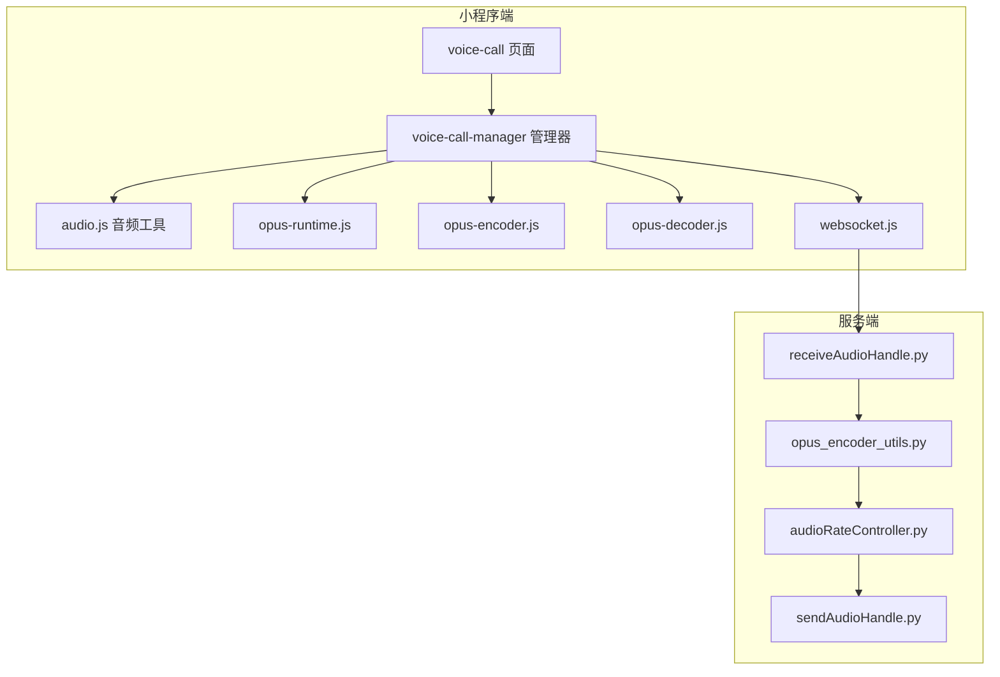
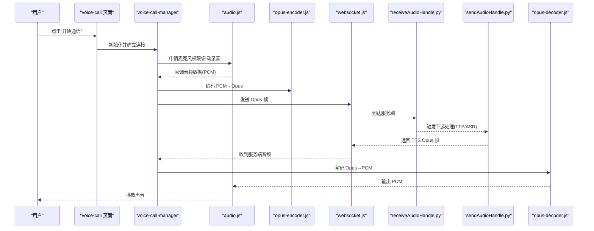
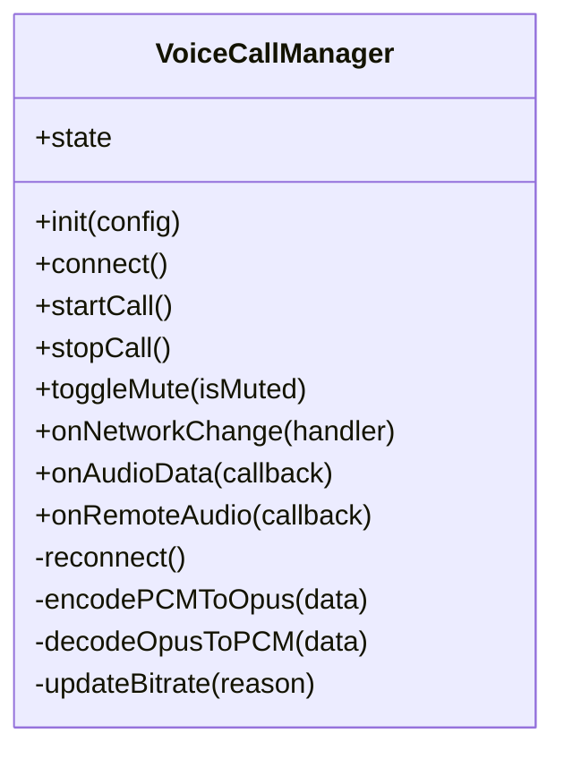
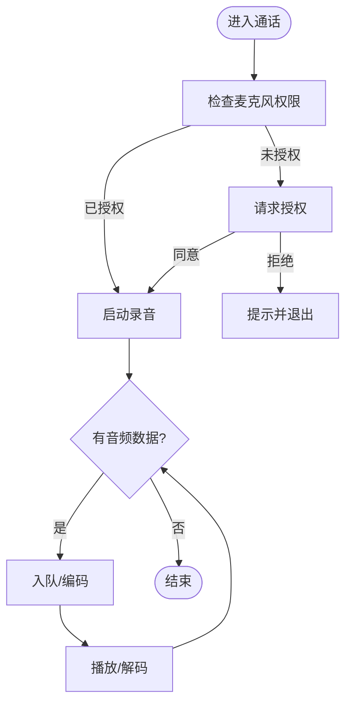
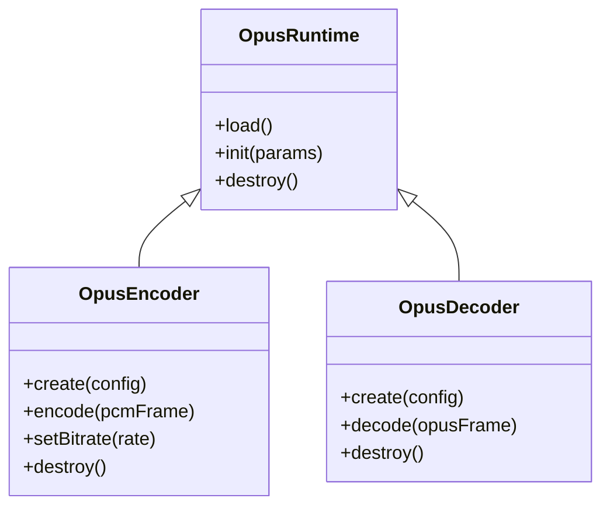
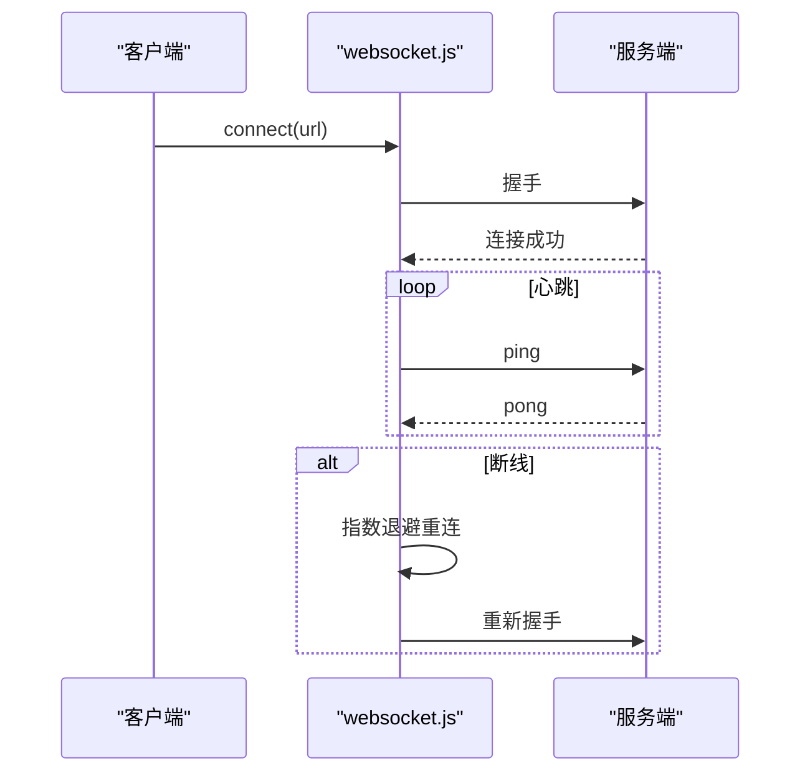
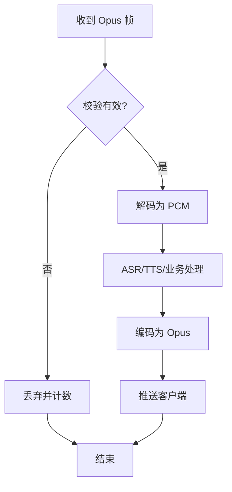
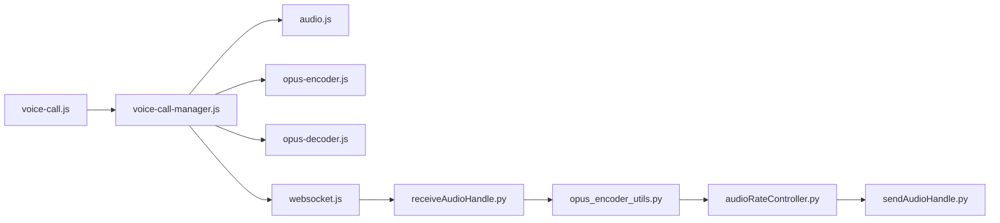

# 语音通话系统

<cite>
**本文引用的文件**   
- [voice-call.js](file://main/miniprogram/pages/voice-call/voice-call.js)
- [voice-call.wxml](file://main/miniprogram/pages/voice-call/voice-call.wxml)
- [voice-call.wxss](file://main/miniprogram/pages/voice-call/voice-call.wxss)
- [voice-call-manager.js](file://main/miniprogram/utils/voice-call-manager.js)
- [audio.js](file://main/miniprogram/utils/audio.js)
- [opus-runtime.js](file://main/miniprogram/libs/opus/opus-runtime.js)
- [opus-encoder.js](file://main/miniprogram/libs/opus/opus-encoder.js)
- [opus-decoder.js](file://main/miniprogram/libs/opus/opus-decoder.js)
- [websocket.js](file://main/miniprogram/utils/websocket.js)
- [receiveAudioHandle.py](file://main/xiaozhi-server/core/handle/receiveAudioHandle.py)
- [sendAudioHandle.py](file://main/xiaozhi-server/core/handle/sendAudioHandle.py)
- [opus_encoder_utils.py](file://main/xiaozhi-server/core/utils/opus_encoder_utils.py)
- [audioRateController.py](file://main/xiaozhi-server/core/utils/audioRateController.py)
</cite>

## 目录
1. [简介](#简介)
2. [项目结构](#项目结构)
3. [核心组件](#核心组件)
4. [架构总览](#架构总览)
5. [详细组件分析](#详细组件分析)
6. [依赖关系分析](#依赖关系分析)
7. [性能考量](#性能考量)
8. [故障排查指南](#故障排查指南)
9. [结论](#结论)
10. [附录：代码示例与最佳实践](#附录代码示例与最佳实践)

## 简介
本文件面向微信小程序端的语音通话系统，系统性阐述从麦克风采集、音频流处理、Opus 编码压缩、实时数据传输到服务端解码播放的完整链路。文档覆盖权限获取、会话管理、网络监控与错误恢复、降噪与回声消除策略、音量自适应调节，以及内存/CPU/电池优化建议，并提供可落地的初始化、静音切换、断线重连等实现要点与参考路径。

## 项目结构
小程序端围绕“页面层 + 管理器 + 音频工具 + Opus 编解码 + WebSocket”分层组织；服务端以“接收/发送音频处理器 + Opus 工具 + 速率控制”为核心。关键目录与职责如下：
- 页面层：voice-call 页面负责 UI 与交互入口
- 管理器：voice-call-manager 统一封装连接、状态机、事件回调
- 音频工具：audio.js 封装录音/播放、权限、静音、缓冲
- Opus 库：libs/opus 提供运行时、编码器、解码器
- 网络：utils/websocket.js 封装 WebSocket 生命周期与重试
- 服务端：core/handle 下 receiveAudioHandle.py、sendAudioHandle.py 负责收发；core/utils 下 opus_encoder_utils.py、audioRateController.py 负责编码与速率控制

图表来源
- [voice-call.js:1-200](file://main/miniprogram/pages/voice-call/voice-call.js#L1-L200)
- [voice-call-manager.js:1-300](file://main/miniprogram/utils/voice-call-manager.js#L1-L300)
- [audio.js:1-200](file://main/miniprogram/utils/audio.js#L1-L200)
- [opus-runtime.js:1-150](file://main/miniprogram/libs/opus/opus-runtime.js#L1-L150)
- [opus-encoder.js:1-150](file://main/miniprogram/libs/opus/opus-encoder.js#L1-L150)
- [opus-decoder.js:1-150](file://main/miniprogram/libs/opus/opus-decoder.js#L1-L150)
- [websocket.js:1-200](file://main/miniprogram/utils/websocket.js#L1-L200)
- [receiveAudioHandle.py:1-200](file://main/xiaozhi-server/core/handle/receiveAudioHandle.py#L1-L200)
- [sendAudioHandle.py:1-200](file://main/xiaozhi-server/core/handle/sendAudioHandle.py#L1-L200)
- [opus_encoder_utils.py:1-200](file://main/xiaozhi-server/core/utils/opus_encoder_utils.py#L1-L200)
- [audioRateController.py:1-200](file://main/xiaozhi-server/core/utils/audioRateController.py#L1-L200)

章节来源
- [voice-call.js:1-200](file://main/miniprogram/pages/voice-call/voice-call.js#L1-L200)
- [voice-call-manager.js:1-300](file://main/miniprogram/utils/voice-call-manager.js#L1-L300)
- [audio.js:1-200](file://main/miniprogram/utils/audio.js#L1-L200)
- [websocket.js:1-200](file://main/miniprogram/utils/websocket.js#L1-L200)
- [receiveAudioHandle.py:1-200](file://main/xiaozhi-server/core/handle/receiveAudioHandle.py#L1-L200)
- [sendAudioHandle.py:1-200](file://main/xiaozhi-server/core/handle/sendAudioHandle.py#L1-L200)
- [opus_encoder_utils.py:1-200](file://main/xiaozhi-server/core/utils/opus_encoder_utils.py#L1-L200)
- [audioRateController.py:1-200](file://main/xiaozhi-server/core/utils/audioRateController.py#L1-L200)

## 核心组件
- voice-call 页面：承载通话界面与用户操作（开始/结束通话、静音切换、音量显示）
- voice-call-manager：通话状态机、连接建立、音频流控制、网络监控、错误恢复
- audio.js：录音/播放封装、权限申请、静音开关、缓冲队列、采样率/码率配置
- libs/opus：运行时加载、编码器（PCM→Opus）、解码器（Opus→PCM）
- websocket.js：WebSocket 连接、心跳、自动重连、消息分发
- 服务端 receiveAudioHandle.py：接收客户端 Opus 帧，转 ASR/TTS 或透传
- 服务端 sendAudioHandle.py：生成 TTS 音频并推送到客户端
- opus_encoder_utils.py：Opus 参数配置与批量编码
- audioRateController.py：基于延迟/丢包的速率控制与缓冲调整

章节来源
- [voice-call.js:1-200](file://main/miniprogram/pages/voice-call/voice-call.js#L1-L200)
- [voice-call-manager.js:1-300](file://main/miniprogram/utils/voice-call-manager.js#L1-L300)
- [audio.js:1-200](file://main/miniprogram/utils/audio.js#L1-L200)
- [opus-runtime.js:1-150](file://main/miniprogram/libs/opus/opus-runtime.js#L1-L150)
- [opus-encoder.js:1-150](file://main/miniprogram/libs/opus/opus-encoder.js#L1-L150)
- [opus-decoder.js:1-150](file://main/miniprogram/libs/opus/opus-decoder.js#L1-L150)
- [websocket.js:1-200](file://main/miniprogram/utils/websocket.js#L1-L200)
- [receiveAudioHandle.py:1-200](file://main/xiaozhi-server/core/handle/receiveAudioHandle.py#L1-L200)
- [sendAudioHandle.py:1-200](file://main/xiaozhi-server/core/handle/sendAudioHandle.py#L1-L200)
- [opus_encoder_utils.py:1-200](file://main/xiaozhi-server/core/utils/opus_encoder_utils.py#L1-L200)
- [audioRateController.py:1-200](file://main/xiaozhi-server/core/utils/audioRateController.py#L1-L200)

## 架构总览
端到端流程：小程序采集 PCM → Opus 编码 → WebSocket 传输 → 服务端接收并可选 ASR/TTS → 服务端编码 TTS 为 Opus → 推送回客户端 → 解码播放。

图表来源
- [voice-call.js:1-200](file://main/miniprogram/pages/voice-call/voice-call.js#L1-L200)
- [voice-call-manager.js:1-300](file://main/miniprogram/utils/voice-call-manager.js#L1-L300)
- [audio.js:1-200](file://main/miniprogram/utils/audio.js#L1-L200)
- [opus-encoder.js:1-150](file://main/miniprogram/libs/opus/opus-encoder.js#L1-L150)
- [opus-decoder.js:1-150](file://main/miniprogram/libs/opus/opus-decoder.js#L1-L150)
- [websocket.js:1-200](file://main/miniprogram/utils/websocket.js#L1-L200)
- [receiveAudioHandle.py:1-200](file://main/xiaozhi-server/core/handle/receiveAudioHandle.py#L1-L200)
- [sendAudioHandle.py:1-200](file://main/xiaozhi-server/core/handle/sendAudioHandle.py#L1-L200)

## 详细组件分析

### 语音通话管理器（voice-call-manager）
- 职责：维护通话状态（空闲/连接中/通话中/断开），封装连接建立、握手协议、音频流启停、静音切换、网络监控与重连策略
- 关键机制：
  - 连接建立：创建 WebSocket，完成鉴权与能力协商（采样率、码率、是否启用 VAD/VQ）
  - 音频流控制：根据页面事件启动/停止录音与播放，管理编码器实例与解码器实例
  - 网络监控：心跳检测、断线重连（指数退避）、拥塞控制（降低码率/帧长）
  - 错误恢复：异常捕获、降级策略（如关闭降噪/回声消除、切换至更低码率）

图表来源
- [voice-call-manager.js:1-300](file://main/miniprogram/utils/voice-call-manager.js#L1-L300)

章节来源
- [voice-call-manager.js:1-300](file://main/miniprogram/utils/voice-call-manager.js#L1-L300)

### 音频工具（audio.js）
- 职责：封装微信小程序录音与播放 API，管理权限、采样率/通道数、静音开关、缓冲队列、播放延迟控制
- 关键点：
  - 权限获取：调用麦克风权限接口，失败时引导用户授权
  - 录音：按固定帧大小采集 PCM，回调给上层
  - 播放：解码后 PCM 入队播放，支持静音直通（不写入音频节点）
  - 缓冲与延迟：动态调整缓冲区大小以应对网络抖动

图表来源
- [audio.js:1-200](file://main/miniprogram/utils/audio.js#L1-L200)

章节来源
- [audio.js:1-200](file://main/miniprogram/utils/audio.js#L1-L200)

### Opus 编解码（libs/opus）
- opus-runtime.js：加载 WebAssembly/原生模块，初始化上下文
- opus-encoder.js：配置采样率、码率、复杂度、VBR/CBR，将 PCM 块编码为 Opus
- opus-decoder.js：将收到的 Opus 帧解码为 PCM，供播放器使用

图表来源
- [opus-runtime.js:1-150](file://main/miniprogram/libs/opus/opus-runtime.js#L1-L150)
- [opus-encoder.js:1-150](file://main/miniprogram/libs/opus/opus-encoder.js#L1-L150)
- [opus-decoder.js:1-150](file://main/miniprogram/libs/opus/opus-decoder.js#L1-L150)

章节来源
- [opus-runtime.js:1-150](file://main/miniprogram/libs/opus/opus-runtime.js#L1-L150)
- [opus-encoder.js:1-150](file://main/miniprogram/libs/opus/opus-encoder.js#L1-L150)
- [opus-decoder.js:1-150](file://main/miniprogram/libs/opus/opus-decoder.js#L1-L150)

### 网络通信（websocket.js）
- 职责：建立 WebSocket、心跳保活、断线重连、消息路由、错误上报
- 重连策略：指数退避、最大重试次数、网络状态监听（在线/离线）

图表来源
- [websocket.js:1-200](file://main/miniprogram/utils/websocket.js#L1-L200)

章节来源
- [websocket.js:1-200](file://main/miniprogram/utils/websocket.js#L1-L200)

### 服务端音频处理
- receiveAudioHandle.py：接收客户端 Opus 帧，进行 VAD/ASR 或透传，触发后续流程
- sendAudioHandle.py：生成 TTS 音频，编码为 Opus 并推送
- opus_encoder_utils.py：统一编码参数、批量编码、质量/码率控制
- audioRateController.py：根据延迟、丢包、缓冲水位动态调整码率/帧长

图表来源
- [receiveAudioHandle.py:1-200](file://main/xiaozhi-server/core/handle/receiveAudioHandle.py#L1-L200)
- [sendAudioHandle.py:1-200](file://main/xiaozhi-server/core/handle/sendAudioHandle.py#L1-L200)
- [opus_encoder_utils.py:1-200](file://main/xiaozhi-server/core/utils/opus_encoder_utils.py#L1-L200)
- [audioRateController.py:1-200](file://main/xiaozhi-server/core/utils/audioRateController.py#L1-L200)

章节来源
- [receiveAudioHandle.py:1-200](file://main/xiaozhi-server/core/handle/receiveAudioHandle.py#L1-L200)
- [sendAudioHandle.py:1-200](file://main/xiaozhi-server/core/handle/sendAudioHandle.py#L1-L200)
- [opus_encoder_utils.py:1-200](file://main/xiaozhi-server/core/utils/opus_encoder_utils.py#L1-L200)
- [audioRateController.py:1-200](file://main/xiaozhi-server/core/utils/audioRateController.py#L1-L200)

## 依赖关系分析
- 页面依赖管理器，管理器依赖音频工具、Opus 编解码、WebSocket
- 服务端接收/发送处理器依赖 Opus 工具与速率控制器
- 各模块通过明确的事件与回调解耦，避免循环依赖

图表来源
- [voice-call.js:1-200](file://main/miniprogram/pages/voice-call/voice-call.js#L1-L200)
- [voice-call-manager.js:1-300](file://main/miniprogram/utils/voice-call-manager.js#L1-L300)
- [audio.js:1-200](file://main/miniprogram/utils/audio.js#L1-L200)
- [opus-encoder.js:1-150](file://main/miniprogram/libs/opus/opus-encoder.js#L1-L150)
- [opus-decoder.js:1-150](file://main/miniprogram/libs/opus/opus-decoder.js#L1-L150)
- [websocket.js:1-200](file://main/miniprogram/utils/websocket.js#L1-L200)
- [receiveAudioHandle.py:1-200](file://main/xiaozhi-server/core/handle/receiveAudioHandle.py#L1-L200)
- [opus_encoder_utils.py:1-200](file://main/xiaozhi-server/core/utils/opus_encoder_utils.py#L1-L200)
- [audioRateController.py:1-200](file://main/xiaozhi-server/core/utils/audioRateController.py#L1-L200)
- [sendAudioHandle.py:1-200](file://main/xiaozhi-server/core/handle/sendAudioHandle.py#L1-L200)

章节来源
- [voice-call.js:1-200](file://main/miniprogram/pages/voice-call/voice-call.js#L1-L200)
- [voice-call-manager.js:1-300](file://main/miniprogram/utils/voice-call-manager.js#L1-L300)
- [audio.js:1-200](file://main/miniprogram/utils/audio.js#L1-L200)
- [websocket.js:1-200](file://main/miniprogram/utils/websocket.js#L1-L200)
- [receiveAudioHandle.py:1-200](file://main/xiaozhi-server/core/handle/receiveAudioHandle.py#L1-L200)
- [sendAudioHandle.py:1-200](file://main/xiaozhi-server/core/handle/sendAudioHandle.py#L1-L200)
- [opus_encoder_utils.py:1-200](file://main/xiaozhi-server/core/utils/opus_encoder_utils.py#L1-L200)
- [audioRateController.py:1-200](file://main/xiaozhi-server/core/utils/audioRateController.py#L1-L200)

## 性能考量
- 内存管理
  - 复用 Opus 编码器/解码器实例，避免频繁创建销毁
  - 限制音频缓冲队列长度，防止内存暴涨
  - 及时释放不再使用的资源（录音/播放句柄、WASM 上下文）
- CPU 占用优化
  - 合理设置采样率与帧长（如 16kHz、20ms 帧）
  - 在弱网环境下降低码率与复杂度
  - 将耗时编解码任务放入 Worker（若平台允许）
- 电池消耗控制
  - 非通话时立即释放麦克风与音频节点
  - 使用静音模式减少不必要的数据处理
  - 降低后台刷新频率与日志打印级别
- 网络与延迟
  - 动态码率控制与缓冲水位自适应
  - 心跳间隔与重连退避策略调优
  - 丢包检测与丢包补偿（服务端侧）

[本节为通用指导，不直接分析具体文件]

## 故障排查指南
- 权限问题
  - 现象：无法录音或播放
  - 排查：确认麦克风权限是否授予；查看权限回调错误码
  - 参考：[audio.js:1-200](file://main/miniprogram/utils/audio.js#L1-L200)
- 连接失败/频繁断线
  - 现象：无法建立通话或通话中断
  - 排查：检查 WebSocket 连接状态、心跳响应、网络类型变化
  - 参考：[websocket.js:1-200](file://main/miniprogram/utils/websocket.js#L1-L200)
- 音频卡顿/爆音
  - 现象：播放断续或有杂音
  - 排查：检查缓冲队列、解码速度、网络丢包；适当增大缓冲或降低码率
  - 参考：[voice-call-manager.js:1-300](file://main/miniprogram/utils/voice-call-manager.js#L1-L300)、[audio.js:1-200](file://main/miniprogram/utils/audio.js#L1-L200)
- 编码异常
  - 现象：服务端无音频或乱码
  - 排查：确认采样率、通道数、帧长一致；检查 Opus 配置
  - 参考：[opus-encoder.js:1-150](file://main/miniprogram/libs/opus/opus-encoder.js#L1-L150)、[opus_encoder_utils.py:1-200](file://main/xiaozhi-server/core/utils/opus_encoder_utils.py#L1-L200)
- 回声/噪音
  - 现象：对方听到回声或背景噪声大
  - 排查：开启回声消除与降噪；检查设备扬声器与麦克风隔离
  - 参考：[audio.js:1-200](file://main/miniprogram/utils/audio.js#L1-L200)

章节来源
- [audio.js:1-200](file://main/miniprogram/utils/audio.js#L1-L200)
- [websocket.js:1-200](file://main/miniprogram/utils/websocket.js#L1-L200)
- [voice-call-manager.js:1-300](file://main/miniprogram/utils/voice-call-manager.js#L1-L300)
- [opus-encoder.js:1-150](file://main/miniprogram/libs/opus/opus-encoder.js#L1-L150)
- [opus_encoder_utils.py:1-200](file://main/xiaozhi-server/core/utils/opus_encoder_utils.py#L1-L200)

## 结论
本语音通话系统以清晰的分层与模块化设计，实现了从采集、编码、传输到解码播放的完整闭环。通过合理的权限管理、稳健的网络重连、动态码率控制与 Opus 高效编解码，可在移动端获得低延迟、高清晰的通话体验。结合内存/CPU/电池优化与完善的故障排查手段，可进一步提升稳定性与用户体验。

[本节为总结性内容，不直接分析具体文件]

## 附录：代码示例与最佳实践
- 初始化录音与会话
  - 步骤：申请麦克风权限 → 启动录音 → 创建 Opus 编码器 → 建立 WebSocket → 发送握手信息
  - 参考路径：[audio.js:1-200](file://main/miniprogram/utils/audio.js#L1-L200)、[voice-call-manager.js:1-300](file://main/miniprogram/utils/voice-call-manager.js#L1-L300)、[websocket.js:1-200](file://main/miniprogram/utils/websocket.js#L1-L200)
- 管理音频会话
  - 步骤：开始通话时启动录音与播放、结束通话时释放资源、记录状态与事件
  - 参考路径：[voice-call-manager.js:1-300](file://main/miniprogram/utils/voice-call-manager.js#L1-L300)、[audio.js:1-200](file://main/miniprogram/utils/audio.js#L1-L200)
- 处理网络中断
  - 步骤：监听断线事件 → 指数退避重连 → 恢复音频流 → 通知 UI
  - 参考路径：[websocket.js:1-200](file://main/miniprogram/utils/websocket.js#L1-L200)、[voice-call-manager.js:1-300](file://main/miniprogram/utils/voice-call-manager.js#L1-L300)
- 实现静音切换
  - 步骤：切换静音标志 → 录音端跳过编码或直接发送静音帧 → 播放端跳过写入
  - 参考路径：[audio.js:1-200](file://main/miniprogram/utils/audio.js#L1-L200)、[voice-call-manager.js:1-300](file://main/miniprogram/utils/voice-call-manager.js#L1-L300)
- 音频质量优化
  - 降噪与回声消除：在录音链路上启用相关算法；确保硬件隔离
  - 音量自适应：根据输入电平动态调整增益，避免削波
  - 参考路径：[audio.js:1-200](file://main/miniprogram/utils/audio.js#L1-L200)
- 性能调优建议
  - 内存：限制缓冲长度、复用编解码器、及时释放资源
  - CPU：降低采样率/码率、使用更高效的编码参数
  - 电池：非通话释放资源、减少日志与调试开销
  - 参考路径：[opus-encoder.js:1-150](file://main/miniprogram/libs/opus/opus-encoder.js#L1-L150)、[opus-decoder.js:1-150](file://main/miniprogram/libs/opus/opus-decoder.js#L1-L150)、[audioRateController.py:1-200](file://main/xiaozhi-server/core/utils/audioRateController.py#L1-L200)

章节来源
- [audio.js:1-200](file://main/miniprogram/utils/audio.js#L1-L200)
- [voice-call-manager.js:1-300](file://main/miniprogram/utils/voice-call-manager.js#L1-L300)
- [websocket.js:1-200](file://main/miniprogram/utils/websocket.js#L1-L200)
- [opus-encoder.js:1-150](file://main/miniprogram/libs/opus/opus-encoder.js#L1-L150)
- [opus-decoder.js:1-150](file://main/miniprogram/libs/opus/opus-decoder.js#L1-L150)
- [audioRateController.py:1-200](file://main/xiaozhi-server/core/utils/audioRateController.py#L1-L200)