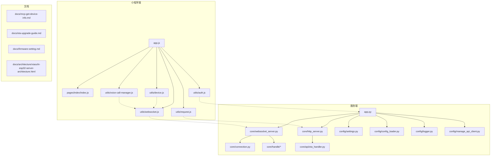
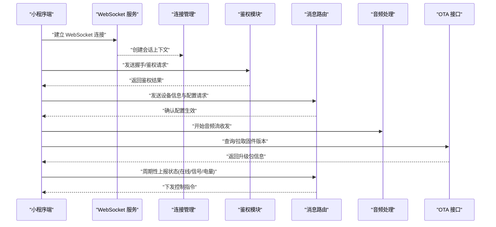
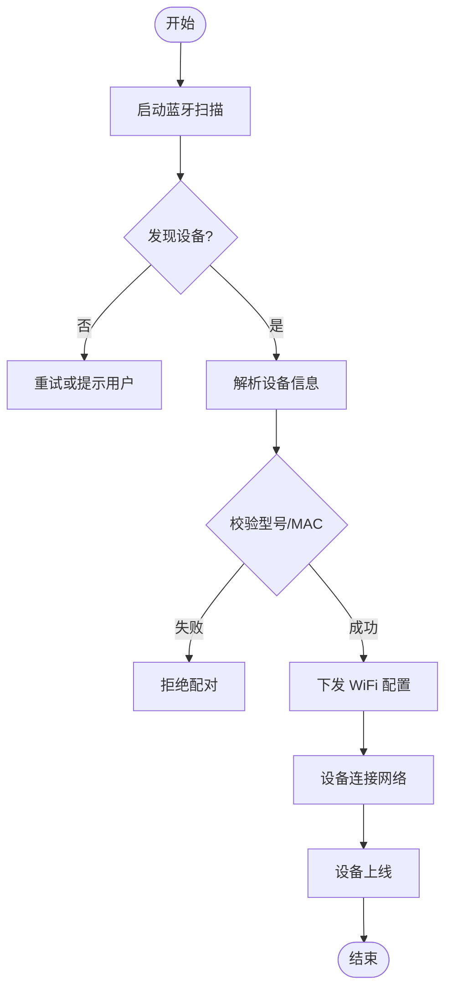
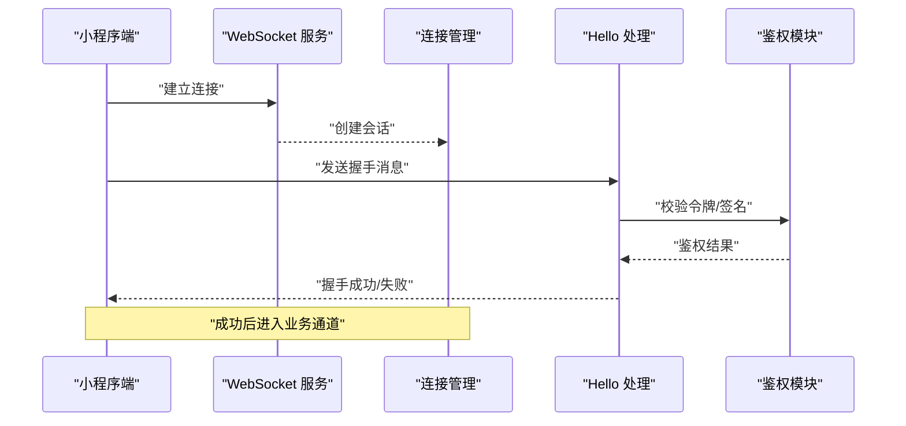
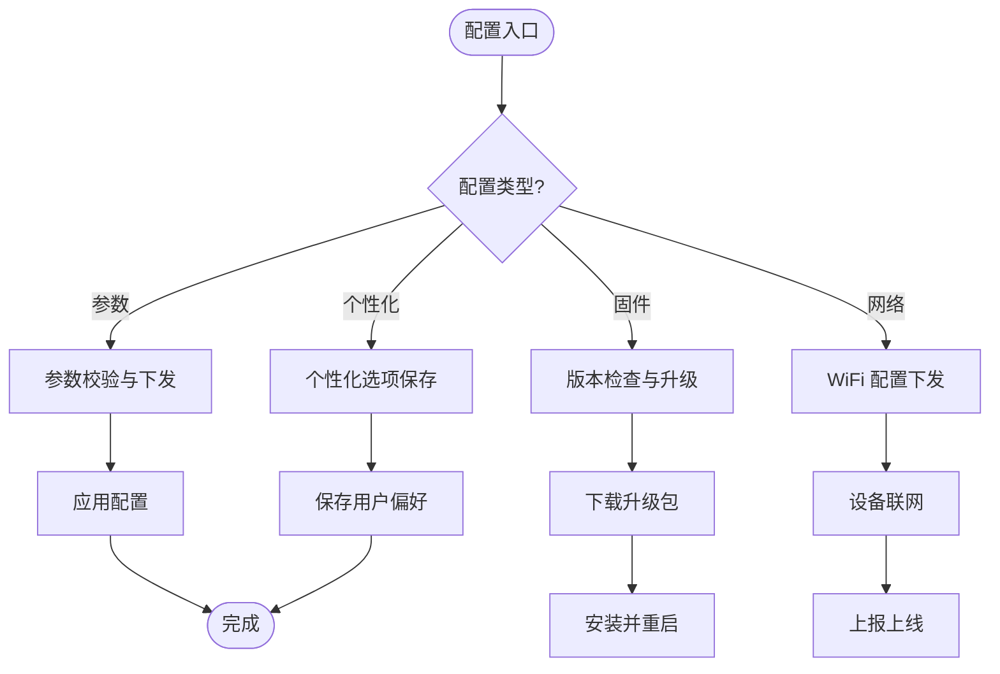
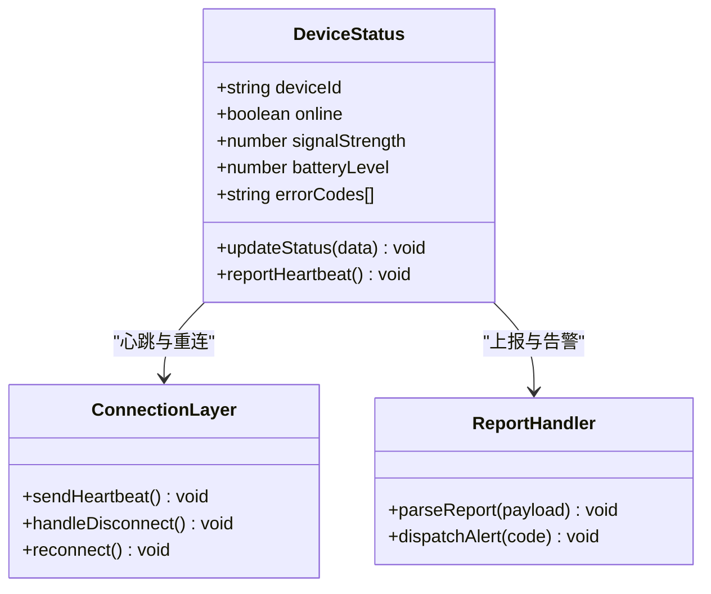
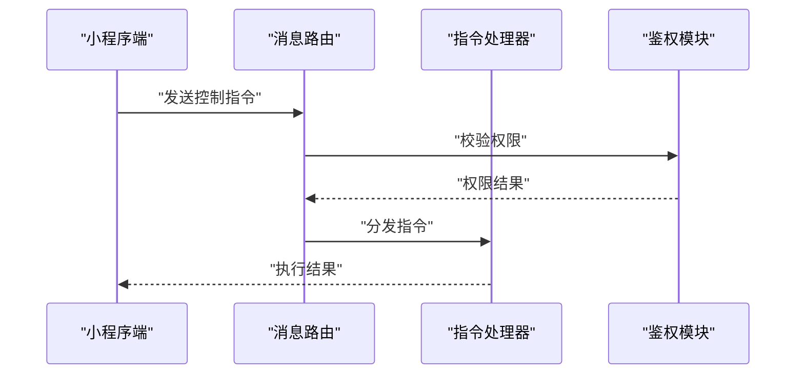
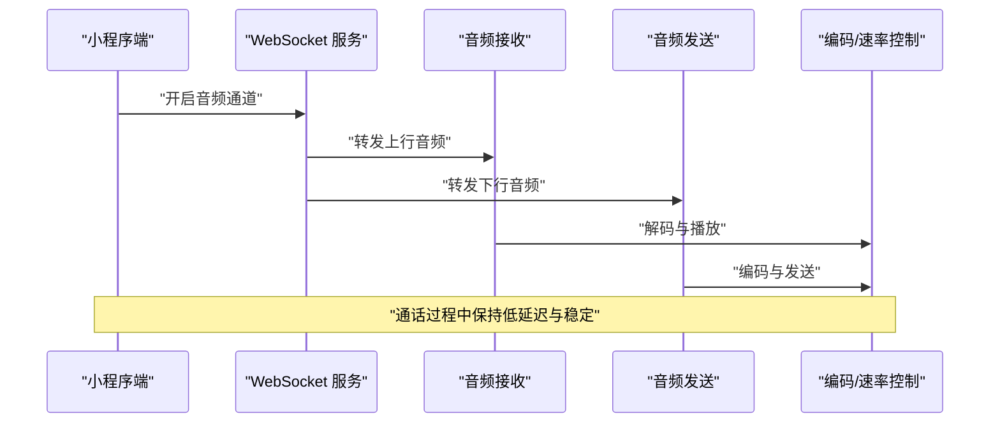
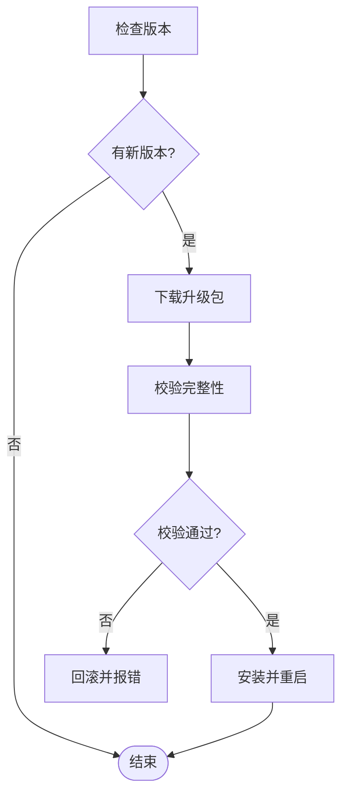
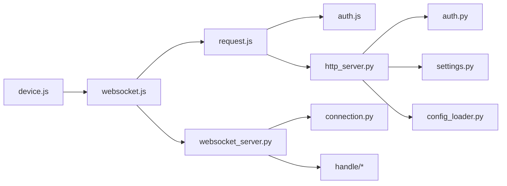

# 设备管理功能

<cite>
**本文引用的文件**   
- [小程序入口 app.js](file://main/miniprogram/app.js)
- [小程序配置 app.json](file://main/miniprogram/app.json)
- [小程序页面 index/index.js](file://main/miniprogram/pages/index/index.js)
- [小程序工具 device.js](file://main/miniprogram/utils/device.js)
- [小程序工具 websocket.js](file://main/miniprogram/utils/websocket.js)
- [小程序工具 request.js](file://main/miniprogram/utils/request.js)
- [小程序工具 auth.js](file://main/miniprogram/utils/auth.js)
- [小程序语音通话 voice-call-manager.js](file://main/miniprogram/utils/voice-call-manager.js)
- [服务端入口 app.py](file://main/xiaozhi-server/app.py)
- [服务端 HTTP 服务器 http_server.py](file://main/xiaozhi-server/core/http_server.py)
- [服务端 WebSocket 服务器 websocket_server.py](file://main/xiaozhi-server/core/websocket_server.py)
- [服务端连接管理 connection.py](file://main/xiaozhi-server/core/connection.py)
- [服务端 OTA 处理器 ota_handler.py](file://main/xiaozhi-server/core/api/ota_handler.py)
- [服务端认证模块 auth.py](file://main/xiaozhi-server/core/auth.py)
- [服务端设置 settings.py](file://main/xiaozhi-server/config/settings.py)
- [服务端日志 logger.py](file://main/xiaozhi-server/config/logger.py)
- [服务端配置加载器 config_loader.py](file://main/xiaozhi-server/config/config_loader.py)
- [服务端管理 API 客户端 manage_api_client.py](file://main/xiaozhi-server/config/manage_api_client.py)
- [服务端文本消息处理器 textMessageHandlerRegistry.py](file://main/xiaozhi-server/core/handle/textMessageHandlerRegistry.py)
- [服务端文本消息处理 textMessageProcessor.py](file://main/xiaozhi-server/core/handle/textMessageProcessor.py)
- [服务端文本消息类型 textMessageType.py](file://main/xiaozhi-server/core/handle/textMessageType.py)
- [服务端音频接收 receiveAudioHandle.py](file://main/xiaozhi-server/core/handle/receiveAudioHandle.py)
- [服务端音频发送 sendAudioHandle.py](file://main/xiaozhi-server/core/handle/sendAudioHandle.py)
- [服务端报告上报 reportHandle.py](file://main/xiaozhi-server/core/handle/reportHandle.py)
- [服务端意图处理 intentHandler.py](file://main/xiaozhi-server/core/handle/intentHandler.py)
- [服务端 Hello 处理 helloHandle.py](file://main/xiaozhi-server/core/handle/helloHandle.py)
- [服务端中止处理 abortHandle.py](file://main/xiaozhi-server/core/handle/abortHandle.py)
- [服务端工具 util.py](file://main/xiaozhi-server/core/utils/util.py)
- [服务端工具 current_time.py](file://main/xiaozhi-server/core/utils/current_time.py)
- [服务端工具 opus_encoder_utils.py](file://main/xiaozhi-server/core/utils/opus_encoder_utils.py)
- [服务端工具 audioRateController.py](file://main/xiaozhi-server/core/utils/audioRateController.py)
- [服务端工具 p3.py](file://main/xiaozhi-server/core/utils/p3.py)
- [服务端工具 prompt_manager.py](file://main/xiaozhi-server/core/utils/prompt_manager.py)
- [服务端工具 dialogue.py](file://main/xiaozhi-server/core/utils/dialogue.py)
- [服务端工具 llm.py](file://main/xiaozhi-server/core/utils/llm.py)
- [服务端工具 tts.py](file://main/xiaozhi-server/core/utils/tts.py)
- [服务端工具 asr.py](file://main/xiaozhi-server/core/utils/asr.py)
- [服务端工具 vad.py](file://main/xiaozhi-server/core/utils/vad.py)
- [服务端工具 vllm.py](file://main/xiaozhi-server/core/utils/vllm.py)
- [服务端工具 voiceprint_provider.py](file://main/xiaozhi-server/core/utils/voiceprint_provider.py)
- [服务端工具 wakeup_word.py](file://main/xiaozhi-server/core/utils/wakeup_word.py)
- [服务端工具 modules_initialize.py](file://main/xiaozhi-server/core/utils/modules_initialize.py)
- [服务端工具 gc_manager.py](file://main/xiaozhi-server/core/utils/gc_manager.py)
- [服务端工具 context_provider.py](file://main/xiaozhi-server/core/utils/context_provider.py)
- [服务端工具 output_counter.py](file://main/xiaozhi-server/core/utils/output_counter.py)
- [服务端工具 textUtils.py](file://main/xiaozhi-server/core/utils/textUtils.py)
- [服务端工具 cache 缓存](file://main/xiaozhi-server/core/utils/cache/)
- [服务端插件函数 loadplugins.py](file://main/xiaozhi-server/plugins_func/loadplugins.py)
- [服务端插件注册 register.py](file://main/xiaozhi-server/plugins_func/register.py)
- [服务端插件 functions](file://main/xiaozhi-server/plugins_func/functions/)
- [文档 mcp-get-device-info.md](file://docs/mcp-get-device-info.md)
- [文档 ota-upgrade-guide.md](file://docs/ota-upgrade-guide.md)
- [文档 firmware-setting.md](file://docs/firmware-setting.md)
- [文档 architecture xiaozhi-esp32-server-architecture.html](file://docs/architecture/xiaozhi-esp32-server-architecture.html)
</cite>

## 目录
1. [简介](#简介)
2. [项目结构](#项目结构)
3. [核心组件](#核心组件)
4. [架构总览](#架构总览)
5. [详细组件分析](#详细组件分析)
6. [依赖关系分析](#依赖关系分析)
7. [性能考虑](#性能考虑)
8. [故障排查指南](#故障排查指南)
9. [结论](#结论)
10. [附录](#附录)

## 简介
本文件面向微信小程序端的“设备管理”能力，围绕设备发现、连接建立、握手与鉴权、参数与网络配置、状态监控、远程控制、OTA 升级、权限与分组等主题进行系统化说明。内容基于仓库中的小程序端与服务端代码及文档整理而成，旨在帮助开发者快速理解并扩展设备管理能力。

## 项目结构
本项目包含小程序前端、后端服务与管理平台等多个子系统。与设备管理直接相关的核心位置如下：
- 小程序端：位于 main/miniprogram，涵盖应用入口、页面、工具库（设备、WebSocket、请求封装、鉴权）、语音通话管理等。
- 服务端：位于 main/xiaozhi-server，提供 HTTP/WebSocket 服务、连接管理、消息路由、音频流处理、OTA 接口、鉴权与配置加载等。
- 文档：docs 下包含设备信息获取、OTA 升级、固件设置、整体架构等参考材料。

图表来源
- [小程序入口 app.js](file://main/miniprogram/app.js)
- [小程序页面 index/index.js](file://main/miniprogram/pages/index/index.js)
- [小程序工具 device.js](file://main/miniprogram/utils/device.js)
- [小程序工具 websocket.js](file://main/miniprogram/utils/websocket.js)
- [小程序工具 request.js](file://main/miniprogram/utils/request.js)
- [小程序工具 auth.js](file://main/miniprogram/utils/auth.js)
- [小程序语音通话 voice-call-manager.js](file://main/miniprogram/utils/voice-call-manager.js)
- [服务端入口 app.py](file://main/xiaozhi-server/app.py)
- [服务端 HTTP 服务器 http_server.py](file://main/xiaozhi-server/core/http_server.py)
- [服务端 WebSocket 服务器 websocket_server.py](file://main/xiaozhi-server/core/websocket_server.py)
- [服务端连接管理 connection.py](file://main/xiaozhi-server/core/connection.py)
- [服务端 OTA 处理器 ota_handler.py](file://main/xiaozhi-server/core/api/ota_handler.py)
- [服务端设置 settings.py](file://main/xiaozhi-server/config/settings.py)
- [服务端日志 logger.py](file://main/xiaozhi-server/config/logger.py)
- [服务端配置加载器 config_loader.py](file://main/xiaozhi-server/config/config_loader.py)
- [服务端管理 API 客户端 manage_api_client.py](file://main/xiaozhi-server/config/manage_api_client.py)

章节来源
- [小程序入口 app.js](file://main/miniprogram/app.js)
- [小程序配置 app.json](file://main/miniprogram/app.json)
- [小程序页面 index/index.js](file://main/miniprogram/pages/index/index.js)
- [小程序工具 device.js](file://main/miniprogram/utils/device.js)
- [小程序工具 websocket.js](file://main/miniprogram/utils/websocket.js)
- [小程序工具 request.js](file://main/miniprogram/utils/request.js)
- [小程序工具 auth.js](file://main/miniprogram/utils/auth.js)
- [小程序语音通话 voice-call-manager.js](file://main/miniprogram/utils/voice-call-manager.js)
- [服务端入口 app.py](file://main/xiaozhi-server/app.py)
- [服务端 HTTP 服务器 http_server.py](file://main/xiaozhi-server/core/http_server.py)
- [服务端 WebSocket 服务器 websocket_server.py](file://main/xiaozhi-server/core/websocket_server.py)
- [服务端连接管理 connection.py](file://main/xiaozhi-server/core/connection.py)
- [服务端 OTA 处理器 ota_handler.py](file://main/xiaozhi-server/core/api/ota_handler.py)
- [服务端设置 settings.py](file://main/xiaozhi-server/config/settings.py)
- [服务端日志 logger.py](file://main/xiaozhi-server/config/logger.py)
- [服务端配置加载器 config_loader.py](file://main/xiaozhi-server/config/config_loader.py)
- [服务端管理 API 客户端 manage_api_client.py](file://main/xiaozhi-server/config/manage_api_client.py)

## 核心组件
- 设备发现与识别
  - 小程序端通过蓝牙扫描与 WiFi 配置流程完成设备发现；device.js 负责封装设备相关能力，如 MAC 地址、型号识别、信号强度等。
  - 服务端通过连接管理与消息路由识别设备身份，结合鉴权模块确保访问安全。
- 连接与握手
  - 小程序端使用 websocket.js 维护长连接；服务端 websocket_server.py 负责接入与生命周期管理，connection.py 维护会话上下文。
  - 握手阶段由 helloHandle.py 与 textMessageHandlerRegistry.py 协同完成，textMessageProcessor.py 统一处理文本消息。
- 配置与参数
  - 网络配置、个性化选项通过 HTTP API 下发，ota_handler.py 提供 OTA 升级接口；settings.py 与 config_loader.py 集中管理配置。
- 状态监控
  - 设备在线状态、信号强度、电量检测通过心跳与上报机制实现，reportHandle.py 负责处理设备上报数据。
- 控制与操作
  - 远程指令通过文本消息通道下发，audio 流处理由 receiveAudioHandle.py 与 sendAudioHandle.py 协作完成；语音通话由 voice-call-manager.js 协调。
- 权限与分组
  - 鉴权由 auth.py 统一管理；分组与批量管理可通过管理 API 客户端 manage_api_client.py 调用后端服务实现。

章节来源
- [小程序工具 device.js](file://main/miniprogram/utils/device.js)
- [小程序工具 websocket.js](file://main/miniprogram/utils/websocket.js)
- [小程序工具 request.js](file://main/miniprogram/utils/request.js)
- [小程序工具 auth.js](file://main/miniprogram/utils/auth.js)
- [小程序语音通话 voice-call-manager.js](file://main/miniprogram/utils/voice-call-manager.js)
- [服务端 WebSocket 服务器 websocket_server.py](file://main/xiaozhi-server/core/websocket_server.py)
- [服务端连接管理 connection.py](file://main/xiaozhi-server/core/connection.py)
- [服务端 Hello 处理 helloHandle.py](file://main/xiaozhi-server/core/handle/helloHandle.py)
- [服务端文本消息处理器 textMessageHandlerRegistry.py](file://main/xiaozhi-server/core/handle/textMessageHandlerRegistry.py)
- [服务端文本消息处理 textMessageProcessor.py](file://main/xiaozhi-server/core/handle/textMessageProcessor.py)
- [服务端报告上报 reportHandle.py](file://main/xiaozhi-server/core/handle/reportHandle.py)
- [服务端音频接收 receiveAudioHandle.py](file://main/xiaozhi-server/core/handle/receiveAudioHandle.py)
- [服务端音频发送 sendAudioHandle.py](file://main/xiaozhi-server/core/handle/sendAudioHandle.py)
- [服务端 OTA 处理器 ota_handler.py](file://main/xiaozhi-server/core/api/ota_handler.py)
- [服务端设置 settings.py](file://main/xiaozhi-server/config/settings.py)
- [服务端配置加载器 config_loader.py](file://main/xiaozhi-server/config/config_loader.py)
- [服务端管理 API 客户端 manage_api_client.py](file://main/xiaozhi-server/config/manage_api_client.py)

## 架构总览
系统采用前后端分离架构：小程序端通过 HTTP 与 WebSocket 与服务端交互；服务端提供统一的连接管理、消息路由、音频流处理与 OTA 能力。设备侧通过 BLE/WiFi 接入后，经由服务端完成鉴权与配置下发，随后进入稳定的音视频通信与状态上报循环。

图表来源
- [小程序工具 websocket.js](file://main/miniprogram/utils/websocket.js)
- [服务端 WebSocket 服务器 websocket_server.py](file://main/xiaozhi-server/core/websocket_server.py)
- [服务端连接管理 connection.py](file://main/xiaozhi-server/core/connection.py)
- [服务端认证模块 auth.py](file://main/xiaozhi-server/core/auth.py)
- [服务端文本消息处理器 textMessageHandlerRegistry.py](file://main/xiaozhi-server/core/handle/textMessageHandlerRegistry.py)
- [服务端音频接收 receiveAudioHandle.py](file://main/xiaozhi-server/core/handle/receiveAudioHandle.py)
- [服务端音频发送 sendAudioHandle.py](file://main/xiaozhi-server/core/handle/sendAudioHandle.py)
- [服务端 OTA 处理器 ota_handler.py](file://main/xiaozhi-server/core/api/ota_handler.py)

## 详细组件分析

### 设备发现与识别
- 蓝牙扫描
  - 小程序端通过蓝牙 API 扫描周边设备，device.js 封装了扫描回调、过滤规则与设备信息解析。
  - 识别策略包括 MAC 地址匹配、厂商特征码、设备型号字段校验。
- WiFi 配置
  - 通过配网流程将目标 WiFi 的 SSID/密码下发至设备，成功后设备自动连接并上线。
- 设备识别与型号检测
  - 首次连接时设备上报基础信息（型号、硬件版本、序列号），服务端记录并用于后续差异化处理。

章节来源
- [小程序工具 device.js](file://main/miniprogram/utils/device.js)
- [小程序页面 index/index.js](file://main/miniprogram/pages/index/index.js)

### 连接建立与握手协议
- 连接建立
  - 小程序端通过 websocket.js 发起连接，服务端 websocket_server.py 接受连接并初始化 connection.py 中的会话对象。
- 握手与鉴权
  - 握手阶段由 helloHandle.py 处理初始消息，auth.py 验证令牌或签名，通过后进入业务通道。
- 状态维护
  - 心跳保活、断线重连、异常恢复由连接层与小程序端共同保障。

图表来源
- [小程序工具 websocket.js](file://main/miniprogram/utils/websocket.js)
- [服务端 WebSocket 服务器 websocket_server.py](file://main/xiaozhi-server/core/websocket_server.py)
- [服务端连接管理 connection.py](file://main/xiaozhi-server/core/connection.py)
- [服务端 Hello 处理 helloHandle.py](file://main/xiaozhi-server/core/handle/helloHandle.py)
- [服务端认证模块 auth.py](file://main/xiaozhi-server/core/auth.py)

章节来源
- [小程序工具 websocket.js](file://main/miniprogram/utils/websocket.js)
- [服务端 WebSocket 服务器 websocket_server.py](file://main/xiaozhi-server/core/websocket_server.py)
- [服务端连接管理 connection.py](file://main/xiaozhi-server/core/connection.py)
- [服务端 Hello 处理 helloHandle.py](file://main/xiaozhi-server/core/handle/helloHandle.py)
- [服务端认证模块 auth.py](file://main/xiaozhi-server/core/auth.py)

### 设备配置管理
- 参数设置
  - 通过文本消息或 HTTP API 下发参数，textMessageProcessor.py 统一解析与分发。
- 固件版本
  - ota_handler.py 提供版本查询与升级包下载接口；小程序端可展示当前版本与升级进度。
- 网络配置
  - WiFi 配置在设备发现阶段下发，成功后设备自动联网并上报上线事件。
- 个性化选项
  - 用户偏好（语言、音量、唤醒词）通过配置接口持久化，服务端根据设备 ID 应用不同策略。

章节来源
- [服务端文本消息处理 textMessageProcessor.py](file://main/xiaozhi-server/core/handle/textMessageProcessor.py)
- [服务端 OTA 处理器 ota_handler.py](file://main/xiaozhi-server/core/api/ota_handler.py)
- [小程序工具 request.js](file://main/miniprogram/utils/request.js)

### 设备状态监控
- 在线状态
  - 通过心跳消息维持在线状态，连接层定期检测并更新状态。
- 信号强度
  - 设备上报 RSSI 或网络质量指标，小程序端可视化展示。
- 电量检测
  - 设备周期性上报电池电量，服务端存储并推送至前端。
- 故障诊断
  - 错误码与告警消息通过 reportHandle.py 上报，前端进行提示与引导修复。

图表来源
- [小程序工具 websocket.js](file://main/miniprogram/utils/websocket.js)
- [服务端连接管理 connection.py](file://main/xiaozhi-server/core/connection.py)
- [服务端报告上报 reportHandle.py](file://main/xiaozhi-server/core/handle/reportHandle.py)

章节来源
- [小程序工具 websocket.js](file://main/miniprogram/utils/websocket.js)
- [服务端连接管理 connection.py](file://main/xiaozhi-server/core/connection.py)
- [服务端报告上报 reportHandle.py](file://main/xiaozhi-server/core/handle/reportHandle.py)

### 设备操作控制
- 远程指令下发
  - 通过文本消息通道发送控制命令，textMessageHandlerRegistry.py 路由到具体处理器执行。
- 批量管理
  - 管理 API 客户端 manage_api_client.py 支持对多设备进行批量配置或操作。
- 分组管理
  - 按场景或区域对设备进行分组，服务端维护分组映射并支持批量下发。
- 权限控制
  - 鉴权模块 auth.py 校验操作者权限，防止越权控制。

图表来源
- [服务端文本消息处理器 textMessageHandlerRegistry.py](file://main/xiaozhi-server/core/handle/textMessageHandlerRegistry.py)
- [服务端认证模块 auth.py](file://main/xiaozhi-server/core/auth.py)
- [小程序工具 request.js](file://main/miniprogram/utils/request.js)

章节来源
- [服务端文本消息处理器 textMessageHandlerRegistry.py](file://main/xiaozhi-server/core/handle/textMessageHandlerRegistry.py)
- [服务端认证模块 auth.py](file://main/xiaozhi-server/core/auth.py)
- [小程序工具 request.js](file://main/miniprogram/utils/request.js)

### 音频流与语音通话
- 音频收发
  - receiveAudioHandle.py 与 sendAudioHandle.py 分别处理设备上行与下行音频流，opus_encoder_utils.py 与 audioRateController.py 负责编码与速率控制。
- 语音通话管理
  - voice-call-manager.js 协调小程序端通话生命周期，包括建立、暂停、挂断与错误恢复。

图表来源
- [小程序语音通话 voice-call-manager.js](file://main/miniprogram/utils/voice-call-manager.js)
- [服务端音频接收 receiveAudioHandle.py](file://main/xiaozhi-server/core/handle/receiveAudioHandle.py)
- [服务端音频发送 sendAudioHandle.py](file://main/xiaozhi-server/core/handle/sendAudioHandle.py)
- [服务端工具 opus_encoder_utils.py](file://main/xiaozhi-server/core/utils/opus_encoder_utils.py)
- [服务端工具 audioRateController.py](file://main/xiaozhi-server/core/utils/audioRateController.py)

章节来源
- [小程序语音通话 voice-call-manager.js](file://main/miniprogram/utils/voice-call-manager.js)
- [服务端音频接收 receiveAudioHandle.py](file://main/xiaozhi-server/core/handle/receiveAudioHandle.py)
- [服务端音频发送 sendAudioHandle.py](file://main/xiaozhi-server/core/handle/sendAudioHandle.py)
- [服务端工具 opus_encoder_utils.py](file://main/xiaozhi-server/core/utils/opus_encoder_utils.py)
- [服务端工具 audioRateController.py](file://main/xiaozhi-server/core/utils/audioRateController.py)

### OTA 升级流程
- 版本查询
  - 小程序端通过 HTTP API 查询当前固件版本与可用升级包。
- 下载与安装
  - 下载升级包后，设备按协议分片传输并校验完整性，完成后重启应用新版本。
- 回滚机制
  - 升级失败时自动回滚至上一版本，保证设备可用性。

图表来源
- [服务端 OTA 处理器 ota_handler.py](file://main/xiaozhi-server/core/api/ota_handler.py)
- [小程序工具 request.js](file://main/miniprogram/utils/request.js)

章节来源
- [服务端 OTA 处理器 ota_handler.py](file://main/xiaozhi-server/core/api/ota_handler.py)
- [小程序工具 request.js](file://main/miniprogram/utils/request.js)

## 依赖关系分析
- 小程序端依赖
  - device.js 依赖蓝牙与 WiFi 能力；websocket.js 依赖网络栈；request.js 封装 HTTP 请求；auth.js 管理令牌与会话。
- 服务端依赖
  - websocket_server.py 依赖 connection.py 与 handle 模块；http_server.py 暴露 REST API；auth.py 为各模块提供鉴权；settings.py 与 config_loader.py 提供配置。
- 外部集成
  - manage_api_client.py 对接管理服务；MCP 接口用于设备信息查询。

图表来源
- [小程序工具 device.js](file://main/miniprogram/utils/device.js)
- [小程序工具 websocket.js](file://main/miniprogram/utils/websocket.js)
- [小程序工具 request.js](file://main/miniprogram/utils/request.js)
- [小程序工具 auth.js](file://main/miniprogram/utils/auth.js)
- [服务端 WebSocket 服务器 websocket_server.py](file://main/xiaozhi-server/core/websocket_server.py)
- [服务端 HTTP 服务器 http_server.py](file://main/xiaozhi-server/core/http_server.py)
- [服务端连接管理 connection.py](file://main/xiaozhi-server/core/connection.py)
- [服务端认证模块 auth.py](file://main/xiaozhi-server/core/auth.py)
- [服务端设置 settings.py](file://main/xiaozhi-server/config/settings.py)
- [服务端配置加载器 config_loader.py](file://main/xiaozhi-server/config/config_loader.py)

章节来源
- [小程序工具 device.js](file://main/miniprogram/utils/device.js)
- [小程序工具 websocket.js](file://main/miniprogram/utils/websocket.js)
- [小程序工具 request.js](file://main/miniprogram/utils/request.js)
- [小程序工具 auth.js](file://main/miniprogram/utils/auth.js)
- [服务端 WebSocket 服务器 websocket_server.py](file://main/xiaozhi-server/core/websocket_server.py)
- [服务端 HTTP 服务器 http_server.py](file://main/xiaozhi-server/core/http_server.py)
- [服务端连接管理 connection.py](file://main/xiaozhi-server/core/connection.py)
- [服务端认证模块 auth.py](file://main/xiaozhi-server/core/auth.py)
- [服务端设置 settings.py](file://main/xiaozhi-server/config/settings.py)
- [服务端配置加载器 config_loader.py](file://main/xiaozhi-server/config/config_loader.py)

## 性能考虑
- 连接稳定性
  - 合理设置心跳间隔与超时时间，避免频繁重连导致资源抖动。
- 音频流优化
  - 使用合适的采样率与编码格式，降低带宽占用；动态调整发送速率以适配网络波动。
- 配置下发效率
  - 批量配置合并减少请求次数；增量更新避免全量覆盖。
- 内存与 GC
  - 关注连接对象与音频缓冲的生命周期，及时释放无用资源。

[本节为通用指导，不直接分析具体文件]

## 故障排查指南
- 常见问题
  - 蓝牙扫描失败：检查权限与设备可见性；确认扫描回调是否被正确注册。
  - 握手失败：核对鉴权令牌有效期与签名算法；查看服务端日志定位原因。
  - 音频卡顿：检查网络质量与编码参数；适当降低码率或启用自适应速率。
  - OTA 升级失败：校验升级包完整性；查看回滚日志与错误码。
- 日志与调试
  - 小程序端通过 console 与自定义日志工具输出关键路径；服务端通过 logger.py 记录详细上下文。

章节来源
- [小程序工具 device.js](file://main/miniprogram/utils/device.js)
- [小程序工具 websocket.js](file://main/miniprogram/utils/websocket.js)
- [小程序工具 auth.js](file://main/miniprogram/utils/auth.js)
- [服务端日志 logger.py](file://main/xiaozhi-server/config/logger.py)

## 结论
本设备管理方案以小程序端为中心，结合服务端连接管理、消息路由、音频流处理与 OTA 能力，形成完整的设备发现、连接、配置、监控与控制闭环。通过模块化设计与清晰的职责划分，便于扩展与维护。建议在生产环境中加强鉴权与限流策略，完善监控与告警体系，提升整体稳定性与用户体验。

[本节为总结性内容，不直接分析具体文件]

## 附录
- API 接口概览
  - 设备信息查询：通过 MCP 接口获取设备基本信息。
  - OTA 接口：版本查询、升级包下载、升级状态上报。
  - 配置接口：参数设置、网络配置、个性化选项。
- 数据结构
  - 设备信息：包含 MAC、型号、硬件版本、序列号等。
  - 状态上报：在线状态、信号强度、电量、错误码。
  - 控制指令：指令类型、参数、执行结果。
- 错误码说明
  - 鉴权失败、网络异常、配置无效、升级失败等常见错误码及其处理建议。

章节来源
- [文档 mcp-get-device-info.md](file://docs/mcp-get-device-info.md)
- [文档 ota-upgrade-guide.md](file://docs/ota-upgrade-guide.md)
- [文档 firmware-setting.md](file://docs/firmware-setting.md)
- [文档 architecture xiaozhi-esp32-server-architecture.html](file://docs/architecture/xiaozhi-esp32-server-architecture.html)