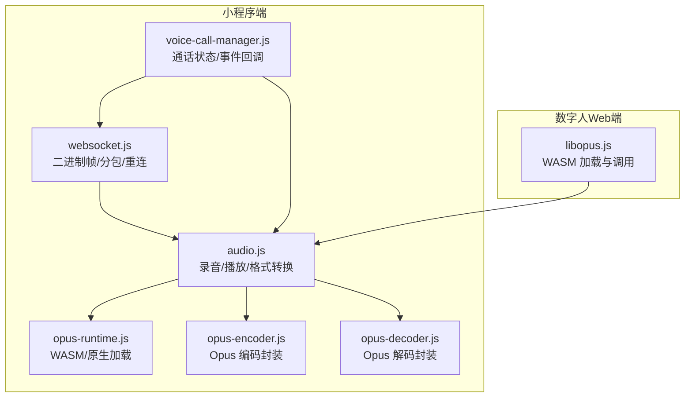
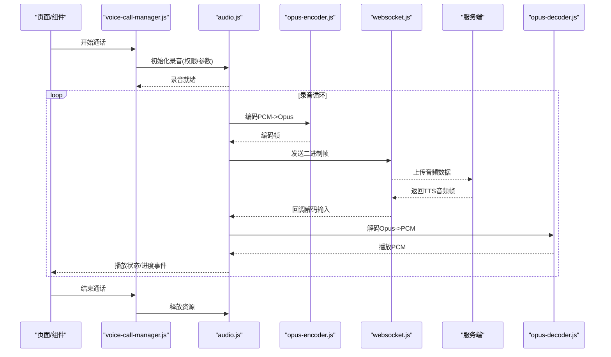
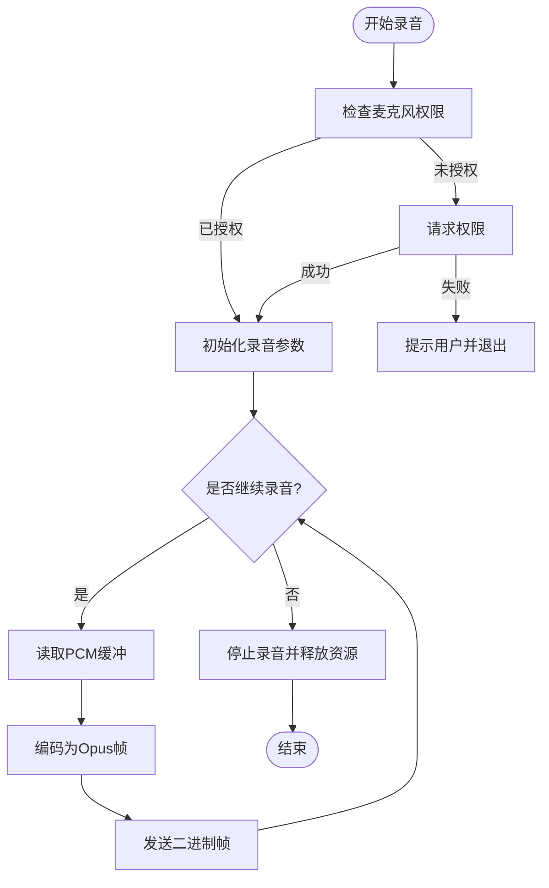
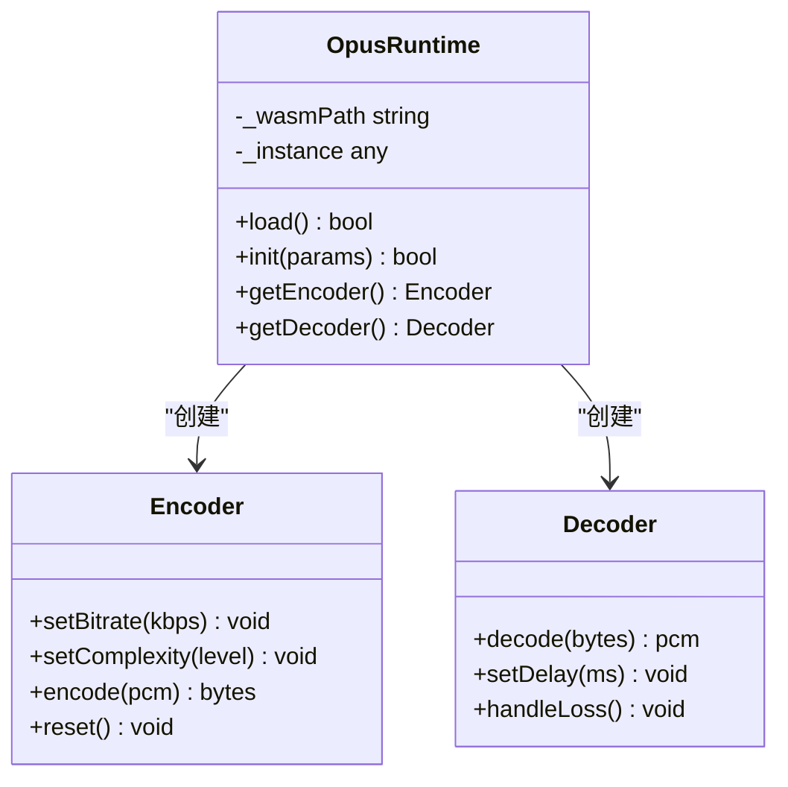
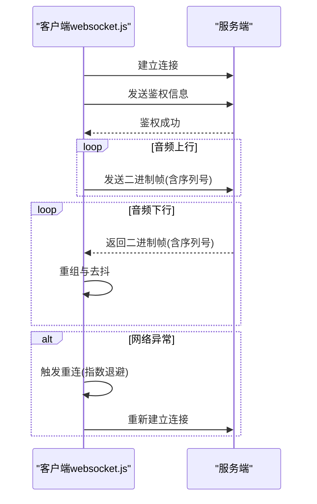
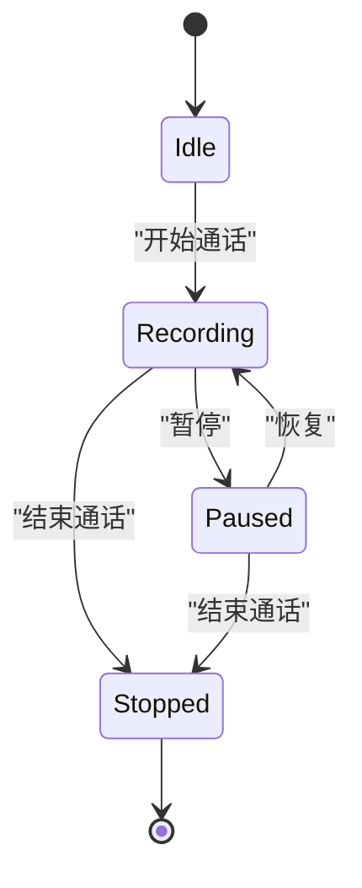
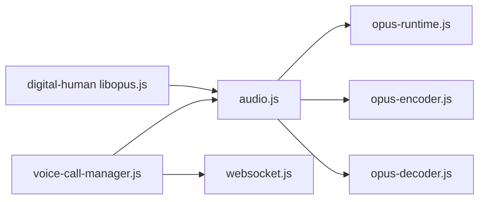

# 音频处理系统

<cite>
**本文引用的文件**   
- [miniprogram/utils/audio.js](file://main/miniprogram/utils/audio.js)
- [miniprogram/libs/opus/opus-runtime.js](file://main/miniprogram/libs/opus/opus-runtime.js)
- [miniprogram/libs/opus/opus-decoder.js](file://main/miniprogram/libs/opus/opus-decoder.js)
- [miniprogram/libs/opus/opus-encoder.js](file://main/miniprogram/libs/opus/opus-encoder.js)
- [miniprogram/utils/websocket.js](file://main/miniprogram/utils/websocket.js)
- [miniprogram/utils/voice-call-manager.js](file://main/miniprogram/utils/voice-call-manager.js)
- [egg-miniprogram/utils/audio.js](file://main/egg-miniprogram/utils/audio.js)
- [egg-miniprogram/libs/opus/opus-decoder.js](file://main/egg-miniprogram/libs/opus/opus-decoder.js)
- [egg-miniprogram/libs/opus/opus-runtime.js](file://main/egg-miniprogram/libs/opus/opus-runtime.js)
- [digital-human/js/core/audio/libopus.js](file://main/digital-human/js/core/audio/libopus.js)
- [digital-human/js/utils/libopus.js](file://main/digital-human/js/utils/libopus.js)
</cite>

## 目录
1. [简介](#简介)
2. [项目结构](#项目结构)
3. [核心组件](#核心组件)
4. [架构总览](#架构总览)
5. [详细组件分析](#详细组件分析)
6. [依赖关系分析](#依赖关系分析)
7. [性能考量](#性能考量)
8. [故障排查指南](#故障排查指南)
9. [结论](#结论)
10. [附录](#附录)

## 简介
本文件面向微信小程序的音频处理子系统，系统性阐述录音采集、Opus 编码与解码、流式播放控制、WebSocket 二进制帧传输、重连与错误恢复、以及跨平台兼容与性能优化策略。文档以仓库中的小程序端实现为依据，结合数字人 Web 端的 Opus 工具进行对比说明，帮助读者快速理解并落地高质量实时语音交互方案。

## 项目结构
本项目在多个子工程中实现了音频能力：
- miniprogram：主小程序工程，包含音频工具、Opus 运行时与编解码器封装、WebSocket 通信与通话管理器。
- egg-miniprogram：另一个小程序工程，提供类似的音频与 Opus 能力。
- digital-human：Web 端数字人演示，包含 libopus 集成与音频工具，用于对比与参考。

图表来源
- [miniprogram/utils/audio.js](file://main/miniprogram/utils/audio.js)
- [miniprogram/libs/opus/opus-runtime.js](file://main/miniprogram/libs/opus/opus-runtime.js)
- [miniprogram/libs/opus/opus-encoder.js](file://main/miniprogram/libs/opus/opus-encoder.js)
- [miniprogram/libs/opus/opus-decoder.js](file://main/miniprogram/libs/opus/opus-decoder.js)
- [miniprogram/utils/websocket.js](file://main/miniprogram/utils/websocket.js)
- [miniprogram/utils/voice-call-manager.js](file://main/miniprogram/utils/voice-call-manager.js)
- [digital-human/js/core/audio/libopus.js](file://main/digital-human/js/core/audio/libopus.js)

章节来源
- [miniprogram/utils/audio.js](file://main/miniprogram/utils/audio.js)
- [miniprogram/libs/opus/opus-runtime.js](file://main/miniprogram/libs/opus/opus-runtime.js)
- [miniprogram/libs/opus/opus-encoder.js](file://main/miniprogram/libs/opus/opus-encoder.js)
- [miniprogram/libs/opus/opus-decoder.js](file://main/miniprogram/libs/opus/opus-decoder.js)
- [miniprogram/utils/websocket.js](file://main/miniprogram/utils/websocket.js)
- [miniprogram/utils/voice-call-manager.js](file://main/miniprogram/utils/voice-call-manager.js)
- [digital-human/js/core/audio/libopus.js](file://main/digital-human/js/core/audio/libopus.js)

## 核心组件
- 音频采集与播放（audio.js）
  - 麦克风权限申请与初始化
  - 采样率、码率、声道数等质量参数配置
  - PCM 缓冲与转码为 Opus
  - 流式播放、缓冲管理、音量调节、播放状态监听
- Opus 编解码（opus-runtime.js / opus-encoder.js / opus-decoder.js）
  - WASM/原生运行时加载与实例化
  - 编码器参数（码率、复杂度、VBR/CBR、DTX 静音抑制）
  - 解码器参数（采样率、通道数、延迟补偿）
  - 实时编码优化（分帧、零拷贝、批量写入）
- 数据传输（websocket.js）
  - 二进制帧发送与接收
  - 分包策略与重组
  - 断线检测、指数退避重连、错误恢复
- 通话管理（voice-call-manager.js）
  - 生命周期管理（开始/暂停/结束）
  - 事件回调（录制中、编码完成、网络异常、播放状态）
  - 资源释放与内存回收

章节来源
- [miniprogram/utils/audio.js](file://main/miniprogram/utils/audio.js)
- [miniprogram/libs/opus/opus-runtime.js](file://main/miniprogram/libs/opus/opus-runtime.js)
- [miniprogram/libs/opus/opus-encoder.js](file://main/miniprogram/libs/opus/opus-encoder.js)
- [miniprogram/libs/opus/opus-decoder.js](file://main/miniprogram/libs/opus/opus-decoder.js)
- [miniprogram/utils/websocket.js](file://main/miniprogram/utils/websocket.js)
- [miniprogram/utils/voice-call-manager.js](file://main/miniprogram/utils/voice-call-manager.js)

## 架构总览
下图展示小程序端音频处理的整体数据流与控制流：从麦克风采集到编码、通过网络传输至服务端，再回传 TTS 音频，经解码与播放输出。

图表来源
- [miniprogram/utils/voice-call-manager.js](file://main/miniprogram/utils/voice-call-manager.js)
- [miniprogram/utils/audio.js](file://main/miniprogram/utils/audio.js)
- [miniprogram/libs/opus/opus-encoder.js](file://main/miniprogram/libs/opus/opus-encoder.js)
- [miniprogram/libs/opus/opus-decoder.js](file://main/miniprogram/libs/opus/opus-decoder.js)
- [miniprogram/utils/websocket.js](file://main/miniprogram/utils/websocket.js)

## 详细组件分析

### 音频采集与播放（audio.js）
- 功能要点
  - 麦克风权限申请：调用平台 API 获取授权，失败时引导用户手动开启。
  - 音频采集：设置采样率（如 16kHz）、声道（单声道）、比特深度；按固定时长切分 PCM 缓冲。
  - 格式转换：将 PCM 转换为 Opus 帧，支持 VBR/CBR、目标码率、复杂度、DTX 等参数。
  - 流式播放：基于 AudioContext/AudioBuffer 或小程序原生播放器，维护播放队列与缓冲水位。
  - 音量调节：通过 GainNode 或播放器 API 动态调整。
  - 播放状态监听：播放/暂停/停止/缓冲/错误事件回调。
- 关键流程
  - 启动录音 -> 周期性读取 PCM -> 编码为 Opus -> 入队发送
  - 接收远端音频帧 -> 解码为 PCM -> 入队播放 -> 监控缓冲水位
- 性能与兼容性
  - 使用 OffscreenAudioContext（若可用）降低主线程压力
  - 合理设置缓冲大小，避免卡顿与爆音
  - 移动端注意后台录音限制与系统省电策略

图表来源
- [miniprogram/utils/audio.js](file://main/miniprogram/utils/audio.js)

章节来源
- [miniprogram/utils/audio.js](file://main/miniprogram/utils/audio.js)

### Opus 运行时与编解码器（opus-runtime.js / opus-encoder.js / opus-decoder.js）
- 运行时加载
  - 优先加载 WASM 版本，回退到原生模块（若平台支持）
  - 初始化实例、分配缓冲区、缓存常用函数指针
- 编码器（opus-encoder.js）
  - 参数：采样率、通道数、码率（kbps）、复杂度（0-10）、VBR/CBR、DTX、应用模式（语音/音频）
  - 分帧策略：按 20ms/40ms 切分，减少延迟
  - 实时优化：复用缓冲区、批量编码、避免频繁 GC
- 解码器（opus-decoder.js）
  - 参数：采样率、通道数、期望延迟
  - 容错：丢包隐藏、插值平滑、抖动缓冲
  - 播放同步：与播放时钟对齐，避免漂移

图表来源
- [miniprogram/libs/opus/opus-runtime.js](file://main/miniprogram/libs/opus/opus-runtime.js)
- [miniprogram/libs/opus/opus-encoder.js](file://main/miniprogram/libs/opus/opus-encoder.js)
- [miniprogram/libs/opus/opus-decoder.js](file://main/miniprogram/libs/opus/opus-decoder.js)

章节来源
- [miniprogram/libs/opus/opus-runtime.js](file://main/miniprogram/libs/opus/opus-runtime.js)
- [miniprogram/libs/opus/opus-encoder.js](file://main/miniprogram/libs/opus/opus-encoder.js)
- [miniprogram/libs/opus/opus-decoder.js](file://main/miniprogram/libs/opus/opus-decoder.js)

### WebSocket 数据传输（websocket.js）
- 功能要点
  - 二进制帧收发：确保音频帧完整、有序到达
  - 分包与重组：按最大帧长拆分，接收端按序列号重组
  - 连接管理：心跳保活、超时检测、指数退避重连
  - 错误恢复：丢包统计、自适应码率、降级策略
- 关键流程
  - 建立连接 -> 鉴权 -> 进入通话会话 -> 双向二进制帧 -> 异常断开 -> 自动重连

图表来源
- [miniprogram/utils/websocket.js](file://main/miniprogram/utils/websocket.js)

章节来源
- [miniprogram/utils/websocket.js](file://main/miniprogram/utils/websocket.js)

### 通话管理（voice-call-manager.js）
- 功能要点
  - 生命周期：开始/暂停/恢复/结束，统一调度录音、编码、发送、解码、播放
  - 事件回调：onRecording/onEncoded/onNetworkError/onPlaying/onPaused/onStopped
  - 资源管理：及时释放录音器、解码器、缓冲区，避免内存泄漏
- 关键流程
  - 开始通话 -> 初始化音频链路 -> 启动编码与发送 -> 启动解码与播放 -> 异常处理与恢复 -> 结束清理

图表来源
- [miniprogram/utils/voice-call-manager.js](file://main/miniprogram/utils/voice-call-manager.js)

章节来源
- [miniprogram/utils/voice-call-manager.js](file://main/miniprogram/utils/voice-call-manager.js)

### 数字人 Web 端参考（libopus.js）
- 作用
  - 提供浏览器环境下的 Opus WASM 加载与调用封装
  - 与小程序端形成对照，便于统一编码参数与行为
- 关键点
  - 异步加载、错误回退、内存池复用
  - 与 Web Audio API 集成，实现低延迟播放

章节来源
- [digital-human/js/core/audio/libopus.js](file://main/digital-human/js/core/audio/libopus.js)
- [digital-human/js/utils/libopus.js](file://main/digital-human/js/utils/libopus.js)

## 依赖关系分析
- audio.js 依赖 opus-runtime.js、opus-encoder.js、opus-decoder.js 完成编解码
- voice-call-manager.js 协调 audio.js 与 websocket.js，管理整体流程
- websocket.js 负责与后端通信，保证二进制帧可靠传输
- 数字人 libopus.js 作为 Web 端参考，辅助统一参数与行为

图表来源
- [miniprogram/utils/voice-call-manager.js](file://main/miniprogram/utils/voice-call-manager.js)
- [miniprogram/utils/audio.js](file://main/miniprogram/utils/audio.js)
- [miniprogram/libs/opus/opus-runtime.js](file://main/miniprogram/libs/opus/opus-runtime.js)
- [miniprogram/libs/opus/opus-encoder.js](file://main/miniprogram/libs/opus/opus-encoder.js)
- [miniprogram/libs/opus/opus-decoder.js](file://main/miniprogram/libs/opus/opus-decoder.js)
- [miniprogram/utils/websocket.js](file://main/miniprogram/utils/websocket.js)
- [digital-human/js/core/audio/libopus.js](file://main/digital-human/js/core/audio/libopus.js)

章节来源
- [miniprogram/utils/voice-call-manager.js](file://main/miniprogram/utils/voice-call-manager.js)
- [miniprogram/utils/audio.js](file://main/miniprogram/utils/audio.js)
- [miniprogram/libs/opus/opus-runtime.js](file://main/miniprogram/libs/opus/opus-runtime.js)
- [miniprogram/libs/opus/opus-encoder.js](file://main/miniprogram/libs/opus/opus-encoder.js)
- [miniprogram/libs/opus/opus-decoder.js](file://main/miniprogram/libs/opus/opus-decoder.js)
- [miniprogram/utils/websocket.js](file://main/miniprogram/utils/websocket.js)
- [digital-human/js/core/audio/libopus.js](file://main/digital-human/js/core/audio/libopus.js)

## 性能考量
- 内存管理
  - 复用 PCM/Opus 缓冲区，避免频繁分配与 GC
  - 及时释放录音器、解码器、WASM 实例
- CPU 占用优化
  - 合理设置编码帧长（20ms/40ms），平衡延迟与计算量
  - 使用批量编码与解码，减少函数调用开销
  - 在可能的情况下使用 OffscreenAudioContext 或 Worker
- 电池消耗控制
  - 空闲时降低采样率或关闭录音
  - 网络不佳时自适应降码率，减少重传与功耗
- 播放体验
  - 维持合适的缓冲水位（例如 100-200ms），避免卡顿
  - 使用平滑增益过渡，减少爆音与削波

[本节为通用指导，不直接分析具体文件]

## 故障排查指南
- 常见问题
  - 麦克风权限被拒：检查权限申请流程与用户引导
  - 编码失败：确认采样率、通道数、码率与平台限制一致
  - 播放卡顿：检查缓冲水位、网络丢包、解码延迟
  - 断线重连：观察心跳与超时配置，调整退避策略
- 定位方法
  - 打印关键事件：录音开始/结束、编码帧大小、网络状态、播放状态
  - 统计指标：丢包率、平均延迟、CPU/内存峰值
  - 回放测试：本地录制与回放验证编解码链路

章节来源
- [miniprogram/utils/audio.js](file://main/miniprogram/utils/audio.js)
- [miniprogram/utils/websocket.js](file://main/miniprogram/utils/websocket.js)
- [miniprogram/utils/voice-call-manager.js](file://main/miniprogram/utils/voice-call-manager.js)

## 结论
本音频处理系统在小程序端实现了完整的录音、Opus 编解码、流式播放与 WebSocket 传输链路，并通过通话管理器统一协调生命周期与事件回调。通过合理的参数配置、缓冲管理与重连机制，可在移动端获得稳定、低延迟的语音交互体验。数字人 Web 端的 libopus 实现可作为参考，帮助统一跨平台行为。

[本节为总结性内容，不直接分析具体文件]

## 附录
- 配置参数建议
  - 采样率：16kHz（语音场景）
  - 码率：VBR 16-32kbps（根据网络动态调整）
  - 复杂度：4-6（平衡音质与CPU）
  - DTX：开启（静音抑制）
  - 缓冲：100-200ms（播放端）
- 事件回调清单
  - onRecording/onEncoded/onNetworkError/onPlaying/onPaused/onStopped
- 兼容性注意事项
  - 不同小程序内核对 OffscreenAudioContext 的支持差异
  - 移动端后台录音限制与系统省电策略影响

[本节为补充信息，不直接分析具体文件]