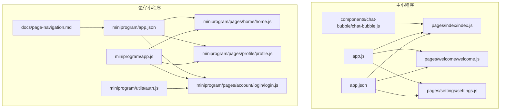
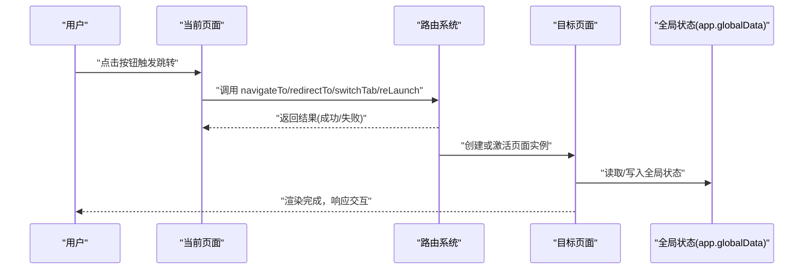
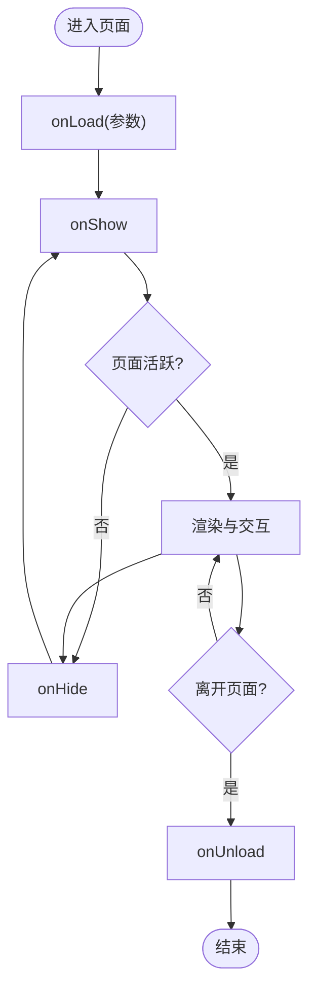
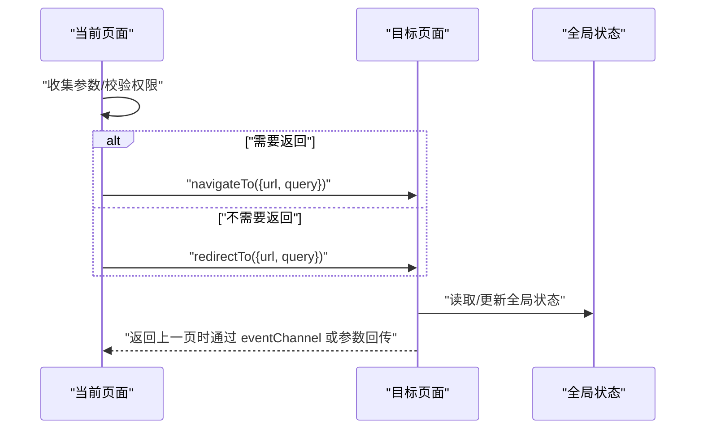
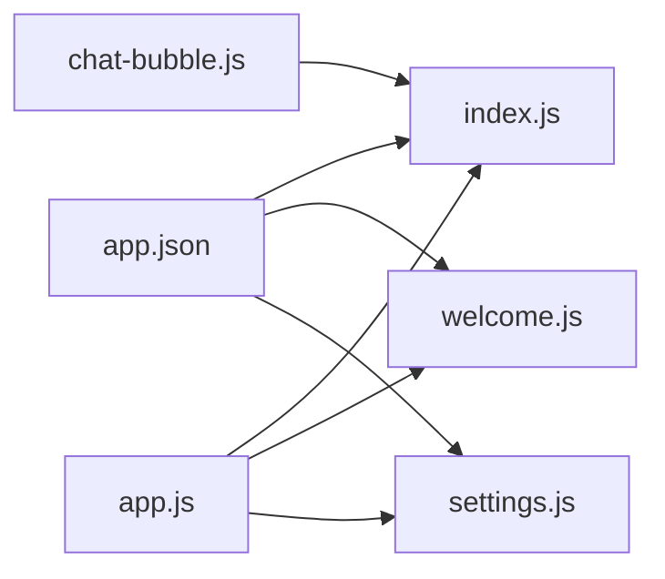

# 页面导航与路由

<cite>
**本文引用的文件**   
- [app.json](file://main/miniprogram/app.json)
- [app.js](file://main/miniprogram/app.js)
- [index/index.js](file://main/miniprogram/pages/index/index.js)
- [welcome/welcome.js](file://main/miniprogram/pages/welcome/welcome.js)
- [settings/settings.js](file://main/miniprogram/pages/settings/settings.js)
- [chat-bubble/chat-bubble.js](file://main/miniprogram/components/chat-bubble/chat-bubble.js)
- [voice-call/voice-call.js](file://main/miniprogram/pages/voice-call/voice-call.js)
- [egg-miniprogram/app.json](file://main/egg-miniprogram/miniprogram/app.json)
- [egg-miniprogram/app.js](file://main/egg-miniprogram/miniprogram/app.js)
- [egg-miniprogram/pages/home/home.js](file://main/egg-miniprogram/miniprogram/pages/home/home.js)
- [egg-miniprogram/pages/profile/profile.js](file://main/egg-miniprogram/miniprogram/pages/profile/profile.js)
- [egg-miniprogram/pages/account/login/login.js](file://main/egg-miniprogram/miniprogram/pages/account/login/login.js)
- [egg-miniprogram/utils/auth.js](file://main/egg-miniprogram/miniprogram/utils/auth.js)
- [egg-miniprogram/docs/page-navigation.md](file://main/egg-miniprogram/docs/page-navigation.md)
</cite>

## 目录
1. [引言](#引言)
2. [项目结构](#项目结构)
3. [核心组件](#核心组件)
4. [架构总览](#架构总览)
5. [详细组件分析](#详细组件分析)
6. [依赖关系分析](#依赖关系分析)
7. [性能考量](#性能考量)
8. [故障排查指南](#故障排查指南)
9. [结论](#结论)
10. [附录](#附录)

## 引言
本文件面向微信小程序的页面导航与路由系统，结合仓库中的两个小程序工程（主小程序 main/miniprogram 与蛋仔小程序 main/egg-miniprogram），系统性阐述：
- 小程序路由机制与页面栈管理
- 页面生命周期与参数传递、页面间通信
- 页面配置选项（导航栏、样式、下拉刷新、上拉加载）
- 跳转 API 的使用场景与最佳实践（navigateTo、redirectTo、switchTab、reLaunch）
- 传参方法、数据共享与全局状态管理
- 权限控制、动态路由、条件渲染等高级特性
- 性能优化、内存管理与用户体验提升

## 项目结构
本项目包含两套小程序代码：
- 主小程序：位于 main/miniprogram，包含 app.json、pages 与 components 等基础结构
- 蛋仔小程序：位于 main/egg-miniprogram/miniprogram，包含更丰富的页面与工具模块，并附带 page-navigation 文档

图表来源
- [app.json](file://main/miniprogram/app.json)
- [app.js](file://main/miniprogram/app.js)
- [index/index.js](file://main/miniprogram/pages/index/index.js)
- [welcome/welcome.js](file://main/miniprogram/pages/welcome/welcome.js)
- [settings/settings.js](file://main/miniprogram/pages/settings/settings.js)
- [chat-bubble/chat-bubble.js](file://main/miniprogram/components/chat-bubble/chat-bubble.js)
- [egg-miniprogram/app.json](file://main/egg-miniprogram/miniprogram/app.json)
- [egg-miniprogram/app.js](file://main/egg-miniprogram/miniprogram/app.js)
- [egg-miniprogram/pages/home/home.js](file://main/egg-miniprogram/miniprogram/pages/home/home.js)
- [egg-miniprogram/pages/profile/profile.js](file://main/egg-miniprogram/miniprogram/pages/profile/profile.js)
- [egg-miniprogram/pages/account/login/login.js](file://main/egg-miniprogram/pages/account/login/login.js)
- [egg-miniprogram/utils/auth.js](file://main/egg-miniprogram/miniprogram/utils/auth.js)
- [egg-miniprogram/docs/page-navigation.md](file://main/egg-miniprogram/docs/page-navigation.md)

章节来源
- [app.json](file://main/miniprogram/app.json)
- [egg-miniprogram/app.json](file://main/egg-miniprogram/miniprogram/app.json)

## 核心组件
- 应用入口与路由注册
  - app.json：集中声明 pages、tabBar、window 等全局配置，决定可访问页面与导航行为
  - app.js：应用级初始化逻辑，常用于设置全局状态、监听事件、埋点统计等
- 页面层
  - index、welcome、settings：示例页面，展示常规页面结构与跳转调用
- 组件层
  - chat-bubble：通用聊天气泡组件，体现组件内触发页面跳转或事件上报的模式
- 蛋仔小程序增强
  - app.json/app.js：更完善的页面与全局配置
  - home/profile/login：典型业务页面，涉及登录态校验与页面跳转
  - utils/auth.js：封装鉴权相关能力，配合页面进行权限控制
  - docs/page-navigation.md：官方或团队沉淀的路由与导航规范

章节来源
- [app.js](file://main/miniprogram/app.js)
- [index/index.js](file://main/miniprogram/pages/index/index.js)
- [welcome/welcome.js](file://main/miniprogram/pages/welcome/welcome.js)
- [settings/settings.js](file://main/miniprogram/pages/settings/settings.js)
- [chat-bubble/chat-bubble.js](file://main/miniprogram/components/chat-bubble/chat-bubble.js)
- [egg-miniprogram/app.js](file://main/egg-miniprogram/miniprogram/app.js)
- [egg-miniprogram/pages/home/home.js](file://main/egg-miniprogram/miniprogram/pages/home/home.js)
- [egg-miniprogram/pages/profile/profile.js](file://main/egg-miniprogram/miniprogram/pages/profile/profile.js)
- [egg-miniprogram/pages/account/login/login.js](file://main/egg-miniprogram/pages/account/login/login.js)
- [egg-miniprogram/utils/auth.js](file://main/egg-miniprogram/miniprogram/utils/auth.js)
- [egg-miniprogram/docs/page-navigation.md](file://main/egg-miniprogram/docs/page-navigation.md)

## 架构总览
小程序路由以 app.json 为入口，通过页面栈管理页面切换。页面间通过 URL 参数、全局对象、事件总线等方式通信；Tab 页与非 Tab 页采用不同跳转策略。

图表来源
- [app.json](file://main/miniprogram/app.json)
- [egg-miniprogram/app.json](file://main/egg-miniprogram/miniprogram/app.json)
- [index/index.js](file://main/miniprogram/pages/index/index.js)
- [welcome/welcome.js](file://main/miniprogram/pages/welcome/welcome.js)
- [settings/settings.js](file://main/miniprogram/pages/settings/settings.js)
- [egg-miniprogram/pages/home/home.js](file://main/egg-miniprogram/miniprogram/pages/home/home.js)
- [egg-miniprogram/pages/profile/profile.js](file://main/egg-miniprogram/miniprogram/pages/profile/profile.js)
- [egg-miniprogram/pages/account/login/login.js](file://main/egg-miniprogram/pages/account/login/login.js)

## 详细组件分析

### 页面栈与生命周期
- 页面栈管理
  - 非 Tab 页面使用 push/pop 模式，支持返回上一页
  - Tab 页面独立栈，不可被普通页面覆盖
- 生命周期要点
  - onLoad：接收页面参数，适合发起必要请求
  - onShow：每次显示时执行，适合刷新数据
  - onHide：隐藏时清理定时器、取消订阅
  - onUnload：卸载前释放资源，避免内存泄漏

章节来源
- [index/index.js](file://main/miniprogram/pages/index/index.js)
- [welcome/welcome.js](file://main/miniprogram/pages/welcome/welcome.js)
- [settings/settings.js](file://main/miniprogram/pages/settings/settings.js)
- [egg-miniprogram/pages/home/home.js](file://main/egg-miniprogram/miniprogram/pages/home/home.js)
- [egg-miniprogram/pages/profile/profile.js](file://main/egg-miniprogram/miniprogram/pages/profile/profile.js)
- [egg-miniprogram/pages/account/login/login.js](file://main/egg-miniprogram/pages/account/login/login.js)

### 页面配置选项
- 导航栏设置
  - 在 app.json 中统一配置 window 或各页面的 navigationBarTitleText、navigationBarBackgroundColor 等
- 页面样式
  - 每个页面可通过 .wxss 定义样式，也可引入全局样式
- 下拉刷新与上拉加载
  - 在页面 JSON 中启用 enablePullDownRefresh/onReachBottomDistance 等属性

章节来源
- [app.json](file://main/miniprogram/app.json)
- [egg-miniprogram/app.json](file://main/egg-miniprogram/miniprogram/app.json)

### 页面跳转方式与最佳实践
- navigateTo：保留当前页，跳转到新页面，支持返回
  - 适用：详情页、表单填写页等需要回退的场景
- redirectTo：关闭当前页，跳转到新页面
  - 适用：流程型页面，无需回退
- switchTab：切换到 Tab 页
  - 适用：底部导航切换
- reLaunch：关闭所有页面，打开到应用内的某个页面
  - 适用：退出登录、返回首页等重置场景

章节来源
- [index/index.js](file://main/miniprogram/pages/index/index.js)
- [welcome/welcome.js](file://main/miniprogram/pages/welcome/welcome.js)
- [settings/settings.js](file://main/miniprogram/pages/settings/settings.js)
- [egg-miniprogram/pages/home/home.js](file://main/egg-miniprogram/miniprogram/pages/home/home.js)
- [egg-miniprogram/pages/profile/profile.js](file://main/egg-miniprogram/miniprogram/pages/profile/profile.js)
- [egg-miniprogram/pages/account/login/login.js](file://main/egg-miniprogram/pages/account/login/login.js)

### 页面传参与通信
- URL 参数传递
  - 通过 url?k=v 形式传递轻量数据，注意长度限制与编码
- 全局状态共享
  - app.globalData 用于跨页面共享简单数据
- 事件总线/回调
  - 通过自定义事件或 eventChannel 实现页面间通信
- 组件通信
  - 组件内部通过 this.triggerEvent 向父页面发送事件

章节来源
- [chat-bubble/chat-bubble.js](file://main/miniprogram/components/chat-bubble/chat-bubble.js)
- [egg-miniprogram/utils/auth.js](file://main/egg-miniprogram/miniprogram/utils/auth.js)

### 权限控制与动态路由
- 权限控制
  - 在 onShow 或路由拦截处检查登录态与角色，未授权则跳转至登录页或提示
- 动态路由
  - 根据配置或后端返回动态生成可访问页面集合，结合 app.json 白名单控制
- 条件渲染
  - 基于用户状态或功能开关，在页面内条件渲染不同内容

章节来源
- [egg-miniprogram/pages/account/login/login.js](file://main/egg-miniprogram/pages/account/login/login.js)
- [egg-miniprogram/utils/auth.js](file://main/egg-miniprogram/miniprogram/utils/auth.js)
- [egg-miniprogram/docs/page-navigation.md](file://main/egg-miniprogram/docs/page-navigation.md)

### 语音通话页示例
- voice-call 页面通常承担实时音视频能力，需关注：
  - 页面进入时申请权限、建立连接
  - 页面隐藏时暂停媒体流、释放资源
  - 页面卸载时断开连接、清理定时器

章节来源
- [voice-call/voice-call.js](file://main/miniprogram/pages/voice-call/voice-call.js)

## 依赖关系分析
- app.json 作为路由与窗口配置的权威来源，影响所有页面可见性与导航行为
- 页面之间通过 app.js 的全局状态与工具模块进行耦合
- 组件与页面解耦，通过事件与参数通信

图表来源
- [app.json](file://main/miniprogram/app.json)
- [app.js](file://main/miniprogram/app.js)
- [index/index.js](file://main/miniprogram/pages/index/index.js)
- [welcome/welcome.js](file://main/miniprogram/pages/welcome/welcome.js)
- [settings/settings.js](file://main/miniprogram/pages/settings/settings.js)
- [chat-bubble/chat-bubble.js](file://main/miniprogram/components/chat-bubble/chat-bubble.js)

章节来源
- [app.json](file://main/miniprogram/app.json)
- [app.js](file://main/miniprogram/app.js)

## 性能考量
- 页面栈深度控制
  - 避免过深嵌套，必要时使用 redirectTo 或 reLaunch 减少栈压力
- 资源释放
  - 在 onHide/onUnload 中清理定时器、网络请求、媒体流与事件监听
- 首屏优化
  - 按需加载数据，延迟非必要请求；图片懒加载与压缩
- 列表性能
  - 合理使用虚拟列表、分页加载，避免一次性渲染大量节点
- 内存管理
  - 避免全局变量长期持有大对象；及时置空引用

[本节为通用指导，不直接分析具体文件]

## 故障排查指南
- 常见跳转失败
  - 检查 app.json 是否声明目标页面路径
  - 确认 URL 参数编码正确，避免特殊字符导致解析失败
- 权限问题
  - 检查登录态与角色校验逻辑，确保未授权时正确跳转
- 内存泄漏
  - 排查未在 onHide/onUnload 释放的资源（定时器、WebSocket、音频/视频流）
- 性能卡顿
  - 定位重渲染热点，减少 setData 频率与数据量

章节来源
- [egg-miniprogram/pages/account/login/login.js](file://main/egg-miniprogram/pages/account/login/login.js)
- [egg-miniprogram/utils/auth.js](file://main/egg-miniprogram/miniprogram/utils/auth.js)
- [voice-call/voice-call.js](file://main/miniprogram/pages/voice-call/voice-call.js)

## 结论
小程序路由体系以 app.json 为核心，结合页面栈与生命周期管理，形成稳定高效的导航模型。通过合理的跳转策略、参数传递与全局状态设计，可实现清晰的数据流与良好的用户体验。在实际工程中，应重视权限控制、动态路由与性能优化，确保在不同设备与网络环境下均能提供流畅体验。

## 附录
- 参考文档
  - 蛋仔小程序的路由与导航规范见 page-navigation.md，可作为团队开发约定与最佳实践参考

章节来源
- [egg-miniprogram/docs/page-navigation.md](file://main/egg-miniprogram/docs/page-navigation.md)