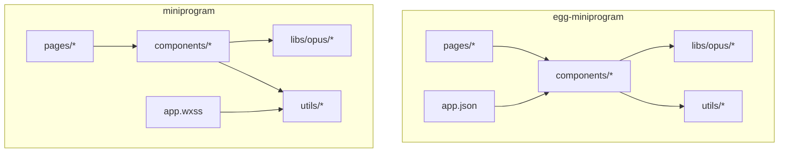
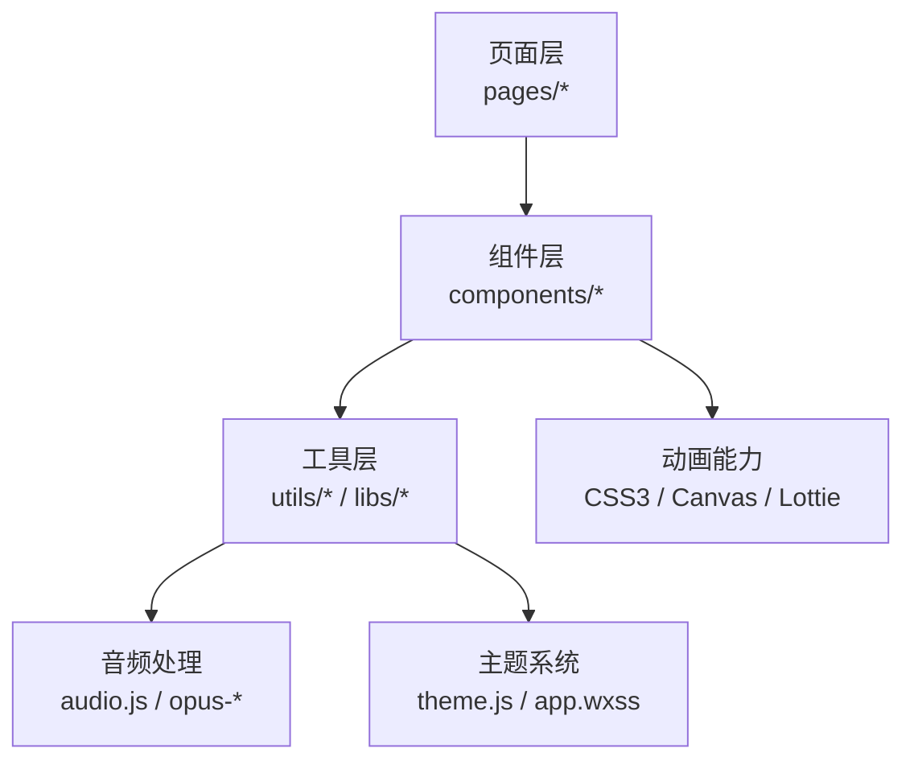
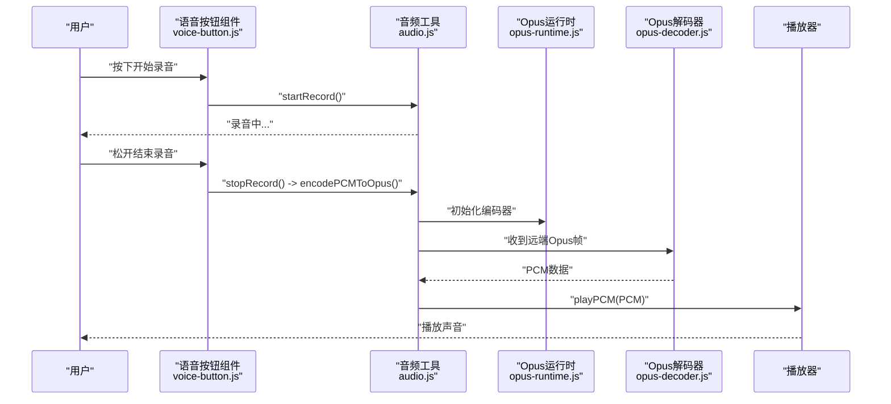
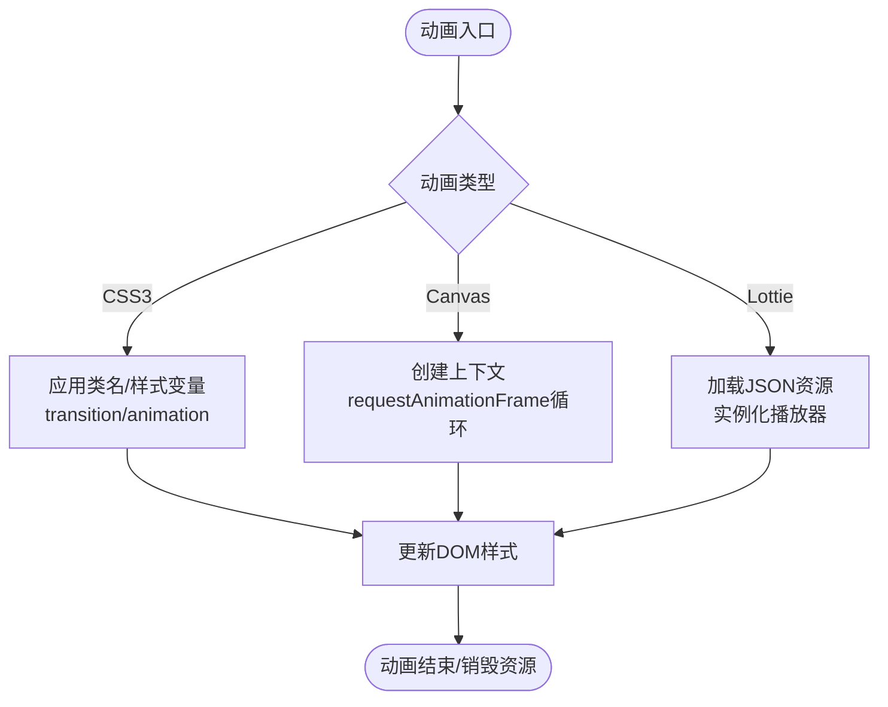
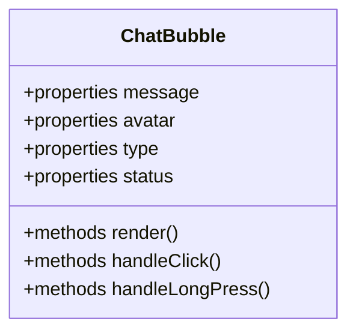
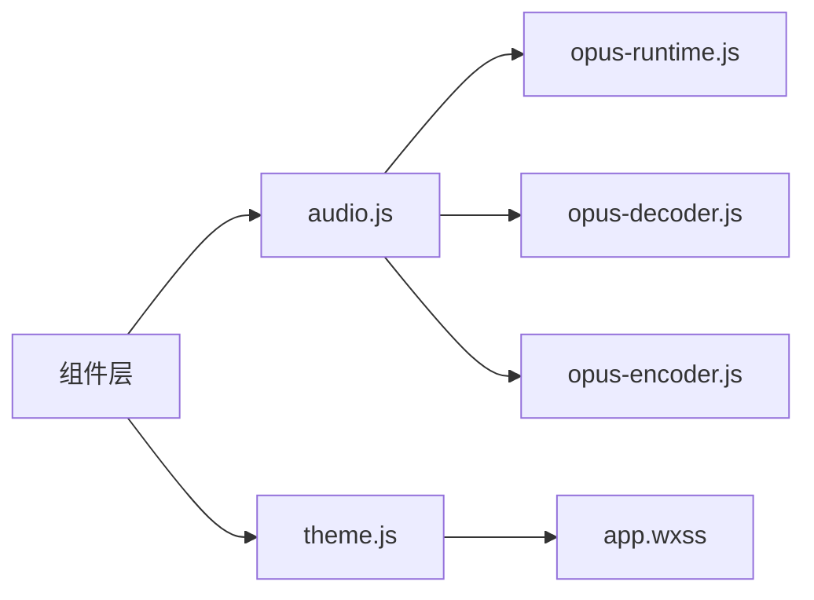

# UI 组件库

<cite>
**本文引用的文件**   
- [egg-miniprogram/DESIGN.md](file://main/egg-miniprogram/DESIGN.md)
- [egg-miniprogram/README.md](file://main/egg-miniprogram/README.md)
- [egg-miniprogram/miniprogram/app.json](file://main/egg-miniprogram/miniprogram/app.json)
- [egg-miniprogram/miniprogram/components/button/button.js](file://main/egg-miniprogram/miniprogram/components/button/button.js)
- [egg-miniprogram/miniprogram/components/card/card.js](file://main/egg-miniprogram/miniprogram/components/card/card.js)
- [egg-miniprogram/miniprogram/components/collapse-item/collapse-item.js](file://main/egg-miniprogram/miniprogram/components/collapse-item/collapse-item.js)
- [egg-miniprogram/miniprogram/components/egg-avatar/egg-avatar.js](file://main/egg-miniprogram/miniprogram/components/egg-avatar/egg-avatar.js)
- [egg-miniprogram/miniprogram/components/list-row/list-row.js](file://main/egg-miniprogram/miniprogram/components/list-row/list-row.js)
- [egg-miniprogram/miniprogram/components/mood-badge/mood-badge.js](file://main/egg-miniprogram/miniprogram/components/mood-badge/mood-badge.js)
- [egg-miniprogram/miniprogram/components/nav-bar/nav-bar.js](file://main/egg-miniprogram/miniprogram/components/nav-bar/nav-bar.js)
- [egg-miniprogram/miniprogram/components/pet-avatar/pet-avatar.js](file://main/egg-miniprogram/miniprogram/components/pet-avatar/pet-avatar.js)
- [egg-miniprogram/miniprogram/components/signal-bars/signal-bars.js](file://main/egg-miniprogram/miniprogram/components/signal-bars/signal-bars.js)
- [egg-miniprogram/miniprogram/components/switch-row/switch-row.js](file://main/egg-miniprogram/miniprogram/components/switch-row/switch-row.js)
- [egg-miniprogram/miniprogram/libs/opus/opus-decoder.js](file://main/egg-miniprogram/miniprogram/libs/opus/opus-decoder.js)
- [egg-miniprogram/miniprogram/libs/opus/opus-runtime.js](file://main/egg-miniprogram/miniprogram/libs/opus/opus-runtime.js)
- [egg-miniprogram/miniprogram/utils/audio.js](file://main/egg-miniprogram/miniprogram/utils/audio.js)
- [miniprogram/UI_REDESIGN_SUMMARY.md](file://main/miniprogram/UI_REDESIGN_SUMMARY.md)
- [miniprogram/app.wxss](file://main/miniprogram/app.wxss)
- [miniprogram/utils/theme.js](file://main/miniprogram/utils/theme.js)
- [miniprogram/components/chat-bubble/chat-bubble.js](file://main/miniprogram/components/chat-bubble/chat-bubble.js)
- [miniprogram/components/floating-call-ball/floating-call-ball.js](file://main/miniprogram/components/floating-call-ball/floating-call-ball.js)
- [miniprogram/components/voice-button/voice-button.js](file://main/miniprogram/components/voice-button/voice-button.js)
- [miniprogram/utils/audio.js](file://main/miniprogram/utils/audio.js)
- [miniprogram/libs/opus/opus-decoder.js](file://main/miniprogram/libs/opus/opus-decoder.js)
- [miniprogram/libs/opus/opus-encoder.js](file://main/miniprogram/libs/opus/opus-encoder.js)
- [miniprogram/libs/opus/opus-runtime.js](file://main/miniprogram/libs/opus/opus-runtime.js)
</cite>

## 目录
1. [引言](#引言)
2. [项目结构](#项目结构)
3. [核心组件](#核心组件)
4. [架构总览](#架构总览)
5. [详细组件分析](#详细组件分析)
6. [依赖关系分析](#依赖关系分析)
7. [性能考量](#性能考量)
8. [故障排查指南](#故障排查指南)
9. [结论](#结论)
10. [附录](#附录)

## 引言
本文件为“蛋仔小程序”UI 组件库的权威文档，聚焦于自定义组件的设计模式与实现原理，覆盖组件接口定义、属性传递、事件回调机制；深入解析音频处理（Opus 编解码、实时录音播放、音频流处理）；阐述动画效果技术（CSS3 动画、Canvas 绘制、Lottie 集成思路）；并给出响应式方案、主题切换机制与国际化支持。同时提供可复用业务组件、表单组件、交互组件的创建示例与最佳实践，以及测试策略、性能优化与兼容性处理建议。

## 项目结构
本项目包含两套小程序代码：
- egg-miniprogram：面向“蛋仔”业务的小程序前端，包含丰富的基础与业务组件、Opus 音频库与工具模块。
- miniprogram：通用小程序前端，包含聊天气泡、悬浮通话球、语音按钮等通用组件，以及 Opus 编解码与主题工具。

图表来源
- [egg-miniprogram/miniprogram/app.json:1-200](file://main/egg-miniprogram/miniprogram/app.json#L1-L200)
- [miniprogram/app.wxss:1-200](file://main/miniprogram/app.wxss#L1-L200)

章节来源
- [egg-miniprogram/DESIGN.md:1-200](file://main/egg-miniprogram/DESIGN.md#L1-L200)
- [egg-miniprogram/README.md:1-200](file://main/egg-miniprogram/README.md#L1-L200)
- [egg-miniprogram/miniprogram/app.json:1-200](file://main/egg-miniprogram/miniprogram/app.json#L1-L200)
- [miniprogram/UI_REDESIGN_SUMMARY.md:1-200](file://main/miniprogram/UI_REDESIGN_SUMMARY.md#L1-L200)

## 核心组件
以下为基础与常用组件，均遵循小程序自定义组件规范，通过 properties 暴露配置项，通过 this.triggerEvent 触发事件，便于页面层组合与状态管理。

- 按钮 Button：支持尺寸、类型、禁用态、图标、点击回调。
- 卡片 Card：支持标题、内容插槽、阴影、圆角、点击行为。
- 折叠项 CollapseItem：支持展开/收起、图标方向、内容插槽。
- 头像 EggAvatar/PetAvatar：支持图片源、占位图、尺寸、裁剪方式。
- 列表行 ListRow：支持标题、副标题、右侧操作区、点击反馈。
- 情绪徽章 MoodBadge：支持标签文本、颜色、形状。
- 导航栏 NavBar：支持标题、返回、右侧菜单、高度适配。
- 信号条 SignalBars：展示网络信号强度。
- 开关行 SwitchRow：支持开关控件、文案、禁用态、变更回调。

章节来源
- [egg-miniprogram/miniprogram/components/button/button.js:1-200](file://main/egg-miniprogram/miniprogram/components/button/button.js#L1-L200)
- [egg-miniprogram/miniprogram/components/card/card.js:1-200](file://main/egg-miniprogram/miniprogram/components/card/card.js#L1-L200)
- [egg-miniprogram/miniprogram/components/collapse-item/collapse-item.js:1-200](file://main/egg-miniprogram/miniprogram/components/collapse-item/collapse-item.js#L1-L200)
- [egg-miniprogram/miniprogram/components/egg-avatar/egg-avatar.js:1-200](file://main/egg-miniprogram/miniprogram/components/egg-avatar/egg-avatar.js#L1-L200)
- [egg-miniprogram/miniprogram/components/list-row/list-row.js:1-200](file://main/egg-miniprogram/miniprogram/components/list-row/list-row.js#L1-L200)
- [egg-miniprogram/miniprogram/components/mood-badge/mood-badge.js:1-200](file://main/egg-miniprogram/miniprogram/components/mood-badge/mood-badge.js#L1-L200)
- [egg-miniprogram/miniprogram/components/nav-bar/nav-bar.js:1-200](file://main/egg-miniprogram/miniprogram/components/nav-bar/nav-bar.js#L1-L200)
- [egg-miniprogram/miniprogram/components/pet-avatar/pet-avatar.js:1-200](file://main/egg-miniprogram/miniprogram/components/pet-avatar/pet-avatar.js#L1-L200)
- [egg-miniprogram/miniprogram/components/signal-bars/signal-bars.js:1-200](file://main/egg-miniprogram/miniprogram/components/signal-bars/signal-bars.js#L1-L200)
- [egg-miniprogram/miniprogram/components/switch-row/switch-row.js:1-200](file://main/egg-miniprogram/miniprogram/components/switch-row/switch-row.js#L1-L200)

## 架构总览
组件库采用“页面-组件-工具库”分层架构：
- 页面层：组织业务逻辑与视图，按需引入组件。
- 组件层：封装可复用的 UI 能力，统一属性与事件契约。
- 工具层：音频、网络、主题、日志等横切能力。

图表来源
- [egg-miniprogram/miniprogram/app.json:1-200](file://main/egg-miniprogram/miniprogram/app.json#L1-L200)
- [miniprogram/app.wxss:1-200](file://main/miniprogram/app.wxss#L1-L200)

## 详细组件分析

### 自定义组件设计模式与接口约定
- 属性（properties）：集中声明组件对外暴露的配置项，包括类型、默认值、观察者（observer）。
- 数据（data）：组件内部状态，避免直接修改外部传入的 props。
- 方法（methods）：封装内部交互逻辑，必要时通过 this.triggerEvent 向父级抛出事件。
- 生命周期：onLoad/onReady 用于初始化资源；onUnload 释放资源。
- 样式：使用 rpx 或百分比进行响应式布局，结合 CSS 变量实现主题化。

章节来源
- [egg-miniprogram/miniprogram/components/button/button.js:1-200](file://main/egg-miniprogram/miniprogram/components/button/button.js#L1-L200)
- [egg-miniprogram/miniprogram/components/card/card.js:1-200](file://main/egg-miniprogram/miniprogram/components/card/card.js#L1-L200)
- [egg-miniprogram/miniprogram/components/collapse-item/collapse-item.js:1-200](file://main/egg-miniprogram/miniprogram/components/collapse-item/collapse-item.js#L1-L200)
- [egg-miniprogram/miniprogram/components/egg-avatar/egg-avatar.js:1-200](file://main/egg-miniprogram/miniprogram/components/egg-avatar/egg-avatar.js#L1-L200)
- [egg-miniprogram/miniprogram/components/list-row/list-row.js:1-200](file://main/egg-miniprogram/miniprogram/components/list-row/list-row.js#L1-L200)
- [egg-miniprogram/miniprogram/components/mood-badge/mood-badge.js:1-200](file://main/egg-miniprogram/miniprogram/components/mood-badge/mood-badge.js#L1-L200)
- [egg-miniprogram/miniprogram/components/nav-bar/nav-bar.js:1-200](file://main/egg-miniprogram/miniprogram/components/nav-bar/nav-bar.js#L1-L200)
- [egg-miniprogram/miniprogram/components/pet-avatar/pet-avatar.js:1-200](file://main/egg-miniprogram/miniprogram/components/pet-avatar/pet-avatar.js#L1-L200)
- [egg-miniprogram/miniprogram/components/signal-bars/signal-bars.js:1-200](file://main/egg-miniprogram/miniprogram/components/signal-bars/signal-bars.js#L1-L200)
- [egg-miniprogram/miniprogram/components/switch-row/switch-row.js:1-200](file://main/egg-miniprogram/miniprogram/components/switch-row/switch-row.js#L1-L200)

### 音频处理组件（Opus 编解码、实时录音播放、音频流处理）
- 编解码：基于 libs/opus 下的 opus-decoder.js、opus-encoder.js、opus-runtime.js，完成二进制 Opus 帧到 PCM 的解码与 PCM 到 Opus 的编码。
- 录音与播放：通过 utils/audio.js 封装录音机、播放器、缓冲队列与重采样，保证低延迟与稳定播放。
- 流式处理：在长连接场景下，按帧拼接解码、去抖、丢包补偿，确保流畅性。

图表来源
- [miniprogram/components/voice-button/voice-button.js:1-200](file://main/miniprogram/components/voice-button/voice-button.js#L1-L200)
- [miniprogram/utils/audio.js:1-200](file://main/miniprogram/utils/audio.js#L1-L200)
- [miniprogram/libs/opus/opus-runtime.js:1-200](file://main/miniprogram/libs/opus/opus-runtime.js#L1-L200)
- [miniprogram/libs/opus/opus-decoder.js:1-200](file://main/miniprogram/libs/opus/opus-decoder.js#L1-L200)
- [miniprogram/libs/opus/opus-encoder.js:1-200](file://main/miniprogram/libs/opus/opus-encoder.js#L1-L200)

章节来源
- [miniprogram/utils/audio.js:1-200](file://main/miniprogram/utils/audio.js#L1-L200)
- [miniprogram/libs/opus/opus-decoder.js:1-200](file://main/miniprogram/libs/opus/opus-decoder.js#L1-L200)
- [miniprogram/libs/opus/opus-encoder.js:1-200](file://main/miniprogram/libs/opus/opus-encoder.js#L1-L200)
- [miniprogram/libs/opus/opus-runtime.js:1-200](file://main/miniprogram/libs/opus/opus-runtime.js#L1-L200)
- [egg-miniprogram/miniprogram/utils/audio.js:1-200](file://main/egg-miniprogram/miniprogram/utils/audio.js#L1-L200)
- [egg-miniprogram/miniprogram/libs/opus/opus-decoder.js:1-200](file://main/egg-miniprogram/miniprogram/libs/opus/opus-decoder.js#L1-L200)
- [egg-miniprogram/miniprogram/libs/opus/opus-runtime.js:1-200](file://main/egg-miniprogram/miniprogram/libs/opus/opus-runtime.js#L1-L200)

### 动画效果实现（CSS3、Canvas、Lottie）
- CSS3 动画：使用 transform、opacity、transition 实现轻量动效，如按钮按压、卡片入场、进度条过渡。
- Canvas 绘制：用于波形可视化、粒子特效、动态背景等高性能渲染场景。
- Lottie 动画：通过加载 .json 描述文件，在小程序中播放复杂矢量动画，适合品牌活动页与引导流程。

章节来源
- [miniprogram/app.wxss:1-200](file://main/miniprogram/app.wxss#L1-L200)

### 响应式设计实现方案
- 单位与栅格：优先使用 rpx 与 flex 布局，自动适配不同屏幕密度与尺寸。
- 断点策略：在 app.wxss 中定义全局断点变量，配合媒体查询调整布局。
- 安全区域：使用 env(safe-area-inset-*) 适配刘海屏与底部横条。

章节来源
- [miniprogram/app.wxss:1-200](file://main/miniprogram/app.wxss#L1-L200)

### 主题切换机制
- 主题变量：通过 CSS 变量或小程序样式变量集中管理主色、辅色、文字色、背景色。
- 动态切换：在 theme.js 中维护当前主题，页面或组件监听变化并更新样式。
- 持久化：将主题选择保存到本地存储，启动时恢复。

章节来源
- [miniprogram/utils/theme.js:1-200](file://main/miniprogram/utils/theme.js#L1-L200)
- [miniprogram/app.wxss:1-200](file://main/miniprogram/app.wxss#L1-L200)

### 国际化支持
- 语言包：在各子项目中维护 i18n 文件（如 zh_CN.ts、en.ts 等），统一导出翻译函数。
- 动态切换：根据用户设置或系统语言切换当前 locale，并刷新界面文案。
- 组件内文案：组件内部文案从 i18n 获取，避免硬编码。

章节来源
- [manager-mobile/src/i18n/index.ts:1-200](file://main/manager-mobile/src/i18n/index.ts#L1-L200)
- [manager-mobile/src/i18n/zh_CN.ts:1-200](file://main/manager-mobile/src/i18n/zh_CN.ts#L1-L200)
- [manager-mobile/src/i18n/en.ts:1-200](file://main/manager-mobile/src/i18n/en.ts#L1-L200)

### 可复用业务组件示例（以聊天气泡为例）
- 职责：展示对话消息，支持文本、时间戳、头像、状态指示。
- 属性：message、avatar、type、status。
- 事件：点击消息、长按操作（复制、删除）。
- 样式：根据 type/status 动态切换样式。

图表来源
- [miniprogram/components/chat-bubble/chat-bubble.js:1-200](file://main/miniprogram/components/chat-bubble/chat-bubble.js#L1-L200)

章节来源
- [miniprogram/components/chat-bubble/chat-bubble.js:1-200](file://main/miniprogram/components/chat-bubble/chat-bubble.js#L1-L200)

### 表单组件示例（以开关行为例）
- 职责：提供开关控件与说明文案，支持禁用态与校验提示。
- 属性：label、checked、disabled、onChange。
- 事件：onChange 回调通知父组件状态变化。
- 样式：跟随主题变量，保持视觉一致性。

章节来源
- [egg-miniprogram/miniprogram/components/switch-row/switch-row.js:1-200](file://main/egg-miniprogram/miniprogram/components/switch-row/switch-row.js#L1-L200)

### 交互组件示例（以悬浮通话球为例）
- 职责：提供悬浮入口，快速进入通话或语音功能。
- 属性：position、icon、visible。
- 事件：onClick、onDragEnd。
- 动画：拖拽移动、缩放、淡入淡出。

章节来源
- [miniprogram/components/floating-call-ball/floating-call-ball.js:1-200](file://main/miniprogram/components/floating-call-ball/floating-call-ball.js#L1-L200)

## 依赖关系分析
组件与工具之间的依赖清晰，避免循环引用：
- 组件依赖 audio.js 进行录音/播放。
- audio.js 依赖 opus-* 进行编解码。
- 主题与样式由 app.wxss 与 theme.js 统一管理。

图表来源
- [miniprogram/utils/audio.js:1-200](file://main/miniprogram/utils/audio.js#L1-L200)
- [miniprogram/libs/opus/opus-runtime.js:1-200](file://main/miniprogram/libs/opus/opus-runtime.js#L1-L200)
- [miniprogram/libs/opus/opus-decoder.js:1-200](file://main/miniprogram/libs/opus/opus-decoder.js#L1-L200)
- [miniprogram/libs/opus/opus-encoder.js:1-200](file://main/miniprogram/libs/opus/opus-encoder.js#L1-L200)
- [miniprogram/utils/theme.js:1-200](file://main/miniprogram/utils/theme.js#L1-L200)
- [miniprogram/app.wxss:1-200](file://main/miniprogram/app.wxss#L1-L200)

章节来源
- [miniprogram/utils/audio.js:1-200](file://main/miniprogram/utils/audio.js#L1-L200)
- [miniprogram/utils/theme.js:1-200](file://main/miniprogram/utils/theme.js#L1-L200)
- [miniprogram/app.wxss:1-200](file://main/miniprogram/app.wxss#L1-L200)

## 性能考量
- 音频流：合理设置缓冲区大小与采样率，避免频繁 GC；解码后及时释放中间对象。
- 动画：优先使用 CSS3 与 will-change，减少重排重绘；Canvas 动画使用 requestAnimationFrame。
- 资源加载：懒加载 Lottie JSON 与图片，预加载关键资源。
- 组件粒度：拆分大组件为小组件，按需渲染，减少 setData 频率。

[本节为通用指导，不直接分析具体文件]

## 故障排查指南
- 录音失败：检查权限申请、麦克风占用、浏览器/小程序环境限制。
- 播放卡顿：检查网络抖动、解码耗时、缓冲区不足；增加缓冲与丢包补偿。
- 主题不生效：确认 CSS 变量是否被覆盖，组件是否正确监听主题变化。
- 国际化缺失：确认语言包是否加载，key 是否存在，locale 是否正确切换。

章节来源
- [miniprogram/utils/audio.js:1-200](file://main/miniprogram/utils/audio.js#L1-L200)
- [miniprogram/utils/theme.js:1-200](file://main/miniprogram/utils/theme.js#L1-L200)

## 结论
本组件库以清晰的层次结构与统一的接口约定，提供了高内聚、低耦合的可复用 UI 能力。音频处理通过 Opus 编解码与流式缓冲保障实时性与稳定性；动画与主题系统提升用户体验与可定制性；国际化与响应式方案满足多语言与多设备需求。建议在业务开发中严格遵循组件契约，持续完善测试与性能监控，确保长期可维护性与扩展性。

## 附录
- 组件清单与用途参考：见各组件 JS 文件中的 properties 与 methods 定义。
- 音频 API 参考：audio.js 与 opus-* 模块的方法签名与参数说明。
- 主题与样式变量：app.wxss 与 theme.js 中的变量定义与切换逻辑。