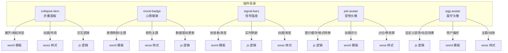
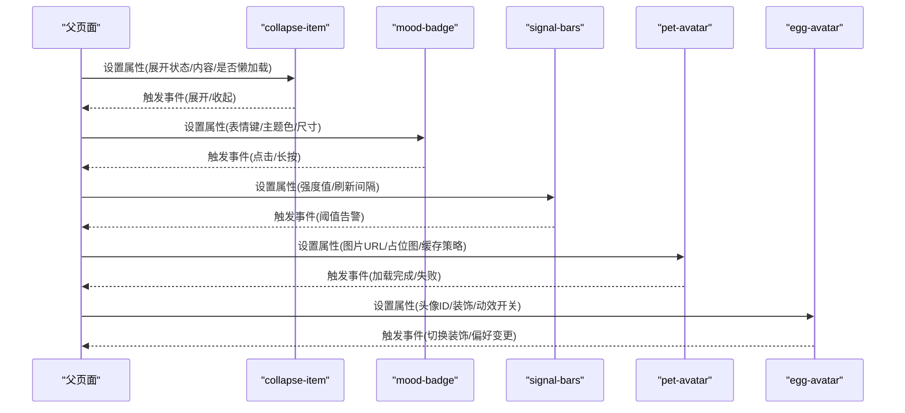
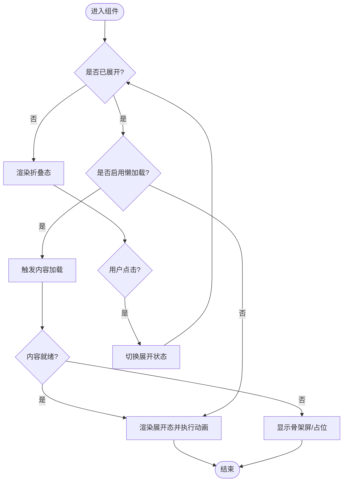
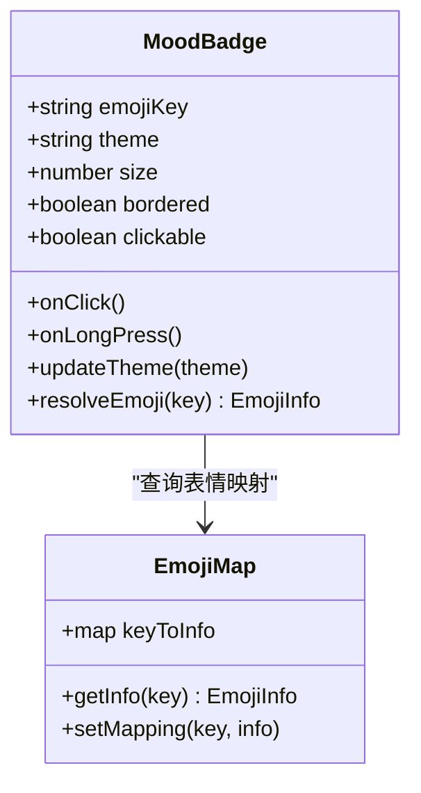
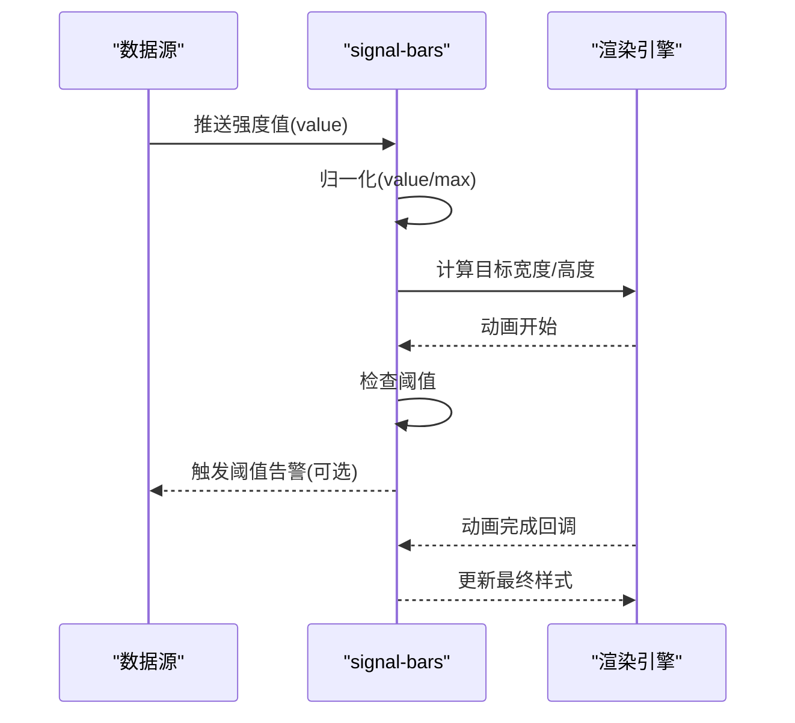
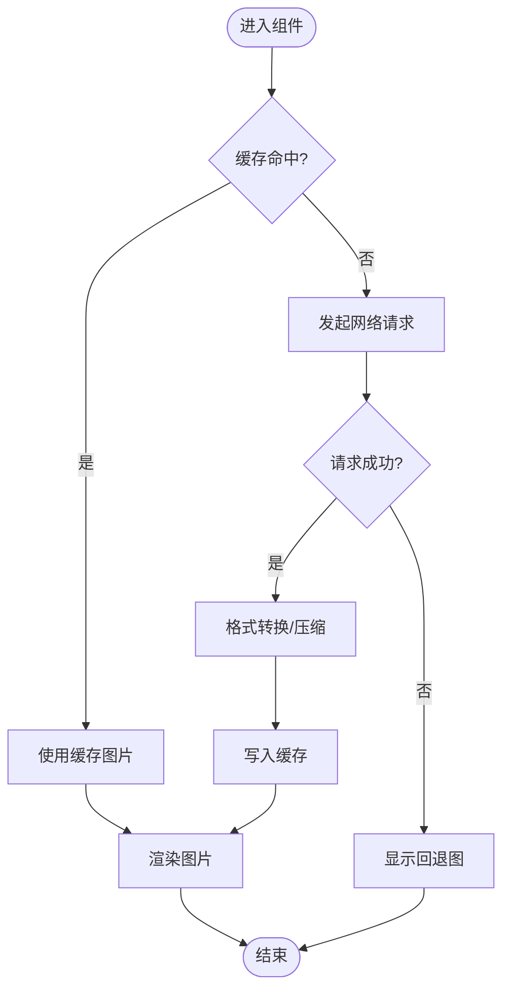
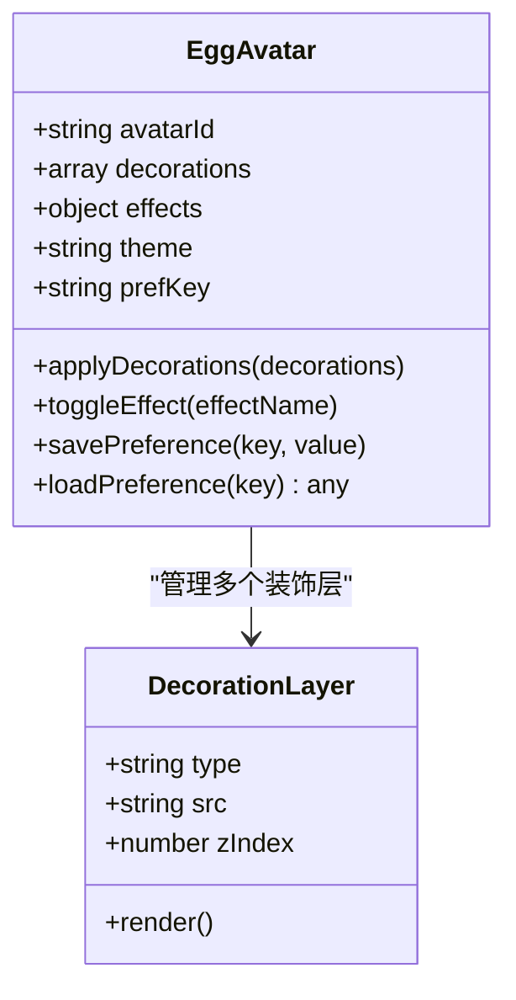
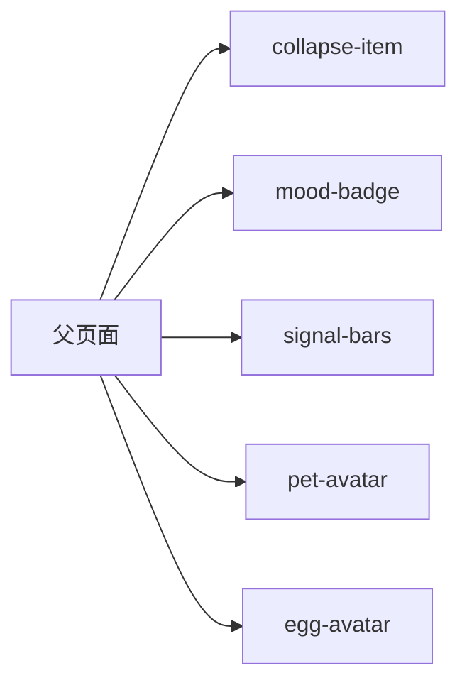

# 业务组件

<cite>
**本文引用的文件**   
- [collapse-item.js](file://main/egg-miniprogram/miniprogram/components/collapse-item/collapse-item.js)
- [collapse-item.wxml](file://main/egg-miniprogram/miniprogram/components/collapse-item/collapse-item.wxml)
- [collapse-item.wxss](file://main/egg-miniprogram/miniprogram/components/collapse-item/collapse-item.wxss)
- [mood-badge.js](file://main/egg-miniprogram/miniprogram/components/mood-badge/mood-badge.js)
- [mood-badge.wxml](file://main/egg-miniprogram/miniprogram/components/mood-badge/mood-badge.wxml)
- [mood-badge.wxss](file://main/egg-miniprogram/miniprogram/components/mood-badge/mood-badge.wxss)
- [signal-bars.js](file://main/egg-miniprogram/miniprogram/components/signal-bars/signal-bars.js)
- [signal-bars.wxml](file://main/egg-miniprogram/miniprogram/components/signal-bars/signal-bars.wxml)
- [signal-bars.wxss](file://main/egg-miniprogram/miniprogram/components/signal-bars/signal-bars.wxss)
- [pet-avatar.js](file://main/egg-miniprogram/miniprogram/components/pet-avatar/pet-avatar.js)
- [pet-avatar.wxml](file://main/egg-miniprogram/miniprogram/components/pet-avatar/pet-avatar.wxml)
- [pet-avatar.wxss](file://main/egg-miniprogram/miniprogram/components/pet-avatar/pet-avatar.wxss)
- [egg-avatar.js](file://main/egg-miniprogram/miniprogram/components/egg-avatar/egg-avatar.js)
- [egg-avatar.wxml](file://main/egg-miniprogram/miniprogram/components/egg-avatar/egg-avatar.wxml)
- [egg-avatar.wxss](file://main/egg-miniprogram/miniprogram/components/egg-avatar/egg-avatar.wxss)
</cite>

## 目录
1. [简介](#简介)
2. [项目结构](#项目结构)
3. [核心组件](#核心组件)
4. [架构总览](#架构总览)
5. [详细组件分析](#详细组件分析)
6. [依赖分析](#依赖分析)
7. [性能考虑](#性能考虑)
8. [故障排查指南](#故障排查指南)
9. [结论](#结论)
10. [附录](#附录) 

## 简介
本文件为蛋仔小程序的业务专用组件文档，聚焦以下五个组件的实现与使用：折叠面板（collapse-item）、心情徽章（mood-badge）、信号强度（signal-bars）、宠物头像（pet-avatar）、蛋仔头像（egg-avatar）。内容涵盖组件接口、配置选项、事件处理、动画与渲染机制、数据驱动设计、资源管理与优化策略，以及典型应用场景。

## 项目结构
这些组件位于 egg-miniprogram 的 components 目录下，每个组件由标准的微信小程序四件套组成：js、wxml、wxss、json。各组件职责清晰，遵循“数据驱动 + 样式分离”的设计原则。

图表来源 
- [collapse-item.js](file://main/egg-miniprogram/miniprogram/components/collapse-item/collapse-item.js)
- [collapse-item.wxml](file://main/egg-miniprogram/miniprogram/components/collapse-item/collapse-item.wxml)
- [collapse-item.wxss](file://main/egg-miniprogram/miniprogram/components/collapse-item/collapse-item.wxss)
- [mood-badge.js](file://main/egg-miniprogram/miniprogram/components/mood-badge/mood-badge.js)
- [mood-badge.wxml](file://main/egg-miniprogram/miniprogram/components/mood-badge/mood-badge.wxml)
- [mood-badge.wxss](file://main/egg-miniprogram/miniprogram/components/mood-badge/mood-badge.wxss)
- [signal-bars.js](file://main/egg-miniprogram/miniprogram/components/signal-bars/signal-bars.js)
- [signal-bars.wxml](file://main/egg-miniprogram/miniprogram/components/signal-bars/signal-bars.wxml)
- [signal-bars.wxss](file://main/egg-miniprogram/miniprogram/components/signal-bars/signal-bars.wxss)
- [pet-avatar.js](file://main/egg-miniprogram/miniprogram/components/pet-avatar/pet-avatar.js)
- [pet-avatar.wxml](file://main/egg-miniprogram/miniprogram/components/pet-avatar/pet-avatar.wxml)
- [pet-avatar.wxss](file://main/egg-miniprogram/miniprogram/components/pet-avatar/pet-avatar.wxss)
- [egg-avatar.js](file://main/egg-miniprogram/miniprogram/components/egg-avatar/egg-avatar.js)
- [egg-avatar.wxml](file://main/egg-miniprogram/miniprogram/components/egg-avatar/egg-avatar.wxml)
- [egg-avatar.wxss](file://main/egg-miniprogram/miniprogram/components/egg-avatar/egg-avatar.wxss)

章节来源
- [collapse-item.js](file://main/egg-miniprogram/miniprogram/components/collapse-item/collapse-item.js)
- [mood-badge.js](file://main/egg-miniprogram/miniprogram/components/mood-badge/mood-badge.js)
- [signal-bars.js](file://main/egg-miniprogram/miniprogram/components/signal-bars/signal-bars.js)
- [pet-avatar.js](file://main/egg-miniprogram/miniprogram/components/pet-avatar/pet-avatar.js)
- [egg-avatar.js](file://main/egg-miniprogram/miniprogram/components/egg-avatar/egg-avatar.js)

## 核心组件
本节对五个业务组件进行概览性说明，后续章节将逐一深入。

- 折叠面板 collapse-item：提供可展开/收起的内容区块，支持嵌套、懒加载与平滑过渡动画。
- 心情徽章 mood-badge：基于数据驱动的徽章展示，支持表情映射、多主题颜色、动态更新。
- 信号强度 signal-bars：可视化信号强度，包含进度条动画、颜色渐变与实时刷新能力。
- 宠物头像 pet-avatar：面向宠物的头像组件，具备图片缓存、格式转换与加载优化。
- 蛋仔头像 egg-avatar：面向用户的个性化头像，支持自定义装饰、动态效果与用户偏好设置。

章节来源
- [collapse-item.js](file://main/egg-miniprogram/miniprogram/components/collapse-item/collapse-item.js)
- [mood-badge.js](file://main/egg-miniprogram/miniprogram/components/mood-badge/mood-badge.js)
- [signal-bars.js](file://main/egg-miniprogram/miniprogram/components/signal-bars/signal-bars.js)
- [pet-avatar.js](file://main/egg-miniprogram/miniprogram/components/pet-avatar/pet-avatar.js)
- [egg-avatar.js](file://main/egg-miniprogram/miniprogram/components/egg-avatar/egg-avatar.js)

## 架构总览
组件整体采用“属性驱动 + 事件回调”的单向数据流模式。父页面通过属性向子组件传递数据，子组件通过事件向上层触发交互反馈。动画与样式通过 wxss 控制，逻辑集中在 js 中，模板 wxml 负责结构与绑定。

图表来源 
- [collapse-item.js](file://main/egg-miniprogram/miniprogram/components/collapse-item/collapse-item.js)
- [mood-badge.js](file://main/egg-miniprogram/miniprogram/components/mood-badge/mood-badge.js)
- [signal-bars.js](file://main/egg-miniprogram/miniprogram/components/signal-bars/signal-bars.js)
- [pet-avatar.js](file://main/egg-miniprogram/miniprogram/components/pet-avatar/pet-avatar.js)
- [egg-avatar.js](file://main/egg-miniprogram/miniprogram/components/egg-avatar/egg-avatar.js)

## 详细组件分析

### 折叠面板 collapse-item
- 功能要点
  - 展开/收起动画：通过高度或 transform 实现平滑过渡，避免重排抖动。
  - 内容懒加载：仅在展开时加载内容，减少首屏压力。
  - 嵌套支持：允许在面板内再次嵌套其他 collapse-item，层级管理需保证状态独立。
- 关键实现思路
  - 状态管理：维护 isExpanded、contentLoaded、height 等属性。
  - 动画策略：使用 CSS transition 或小程序动画 API，确保低端机型流畅。
  - 懒加载：监听展开事件后按需请求或渲染内容。
  - 嵌套处理：为每个实例分配唯一标识，避免状态污染。
- 接口与事件
  - 属性：expanded、lazy、nested、duration、easing 等。
  - 事件：expand、collapse、loadContent。
- 使用场景
  - 长列表详情区、FAQ 折叠区、设置项分组。

图表来源 
- [collapse-item.js](file://main/egg-miniprogram/miniprogram/components/collapse-item/collapse-item.js)
- [collapse-item.wxml](file://main/egg-miniprogram/miniprogram/components/collapse-item/collapse-item.wxml)
- [collapse-item.wxss](file://main/egg-miniprogram/miniprogram/components/collapse-item/collapse-item.wxss)

章节来源
- [collapse-item.js](file://main/egg-miniprogram/miniprogram/components/collapse-item/collapse-item.js)
- [collapse-item.wxml](file://main/egg-miniprogram/miniprogram/components/collapse-item/collapse-item.wxml)
- [collapse-item.wxss](file://main/egg-miniprogram/miniprogram/components/collapse-item/collapse-item.wxss)

### 心情徽章 mood-badge
- 功能要点
  - 数据驱动：通过表情键映射到图标与文案，支持动态更新。
  - 颜色主题：根据情绪类型或全局主题切换颜色。
  - 交互反馈：点击/长按触发事件，便于上层统计或联动。
- 关键实现思路
  - 映射表：维护 emojiKey -> {icon, label, color} 的映射。
  - 主题系统：支持多套配色方案，可通过属性切换。
  - 响应式更新：属性变化时重新计算显示内容与样式。
- 接口与事件
  - 属性：emojiKey、theme、size、bordered、clickable。
  - 事件：click、longpress、themeChange。
- 使用场景
  - 聊天消息情绪标签、用户状态指示、任务优先级标记。

图表来源 
- [mood-badge.js](file://main/egg-miniprogram/miniprogram/components/mood-badge/mood-badge.js)
- [mood-badge.wxml](file://main/egg-miniprogram/miniprogram/components/mood-badge/mood-badge.wxml)
- [mood-badge.wxss](file://main/egg-miniprogram/miniprogram/components/mood-badge/mood-badge.wxss)

章节来源
- [mood-badge.js](file://main/egg-miniprogram/miniprogram/components/mood-badge/mood-badge.js)
- [mood-badge.wxml](file://main/egg-miniprogram/miniprogram/components/mood-badge/mood-badge.wxml)
- [mood-badge.wxss](file://main/egg-miniprogram/miniprogram/components/mood-badge/mood-badge.wxss)

### 信号强度 signal-bars
- 功能要点
  - 进度条动画：根据强度值动态调整填充宽度或柱高。
  - 颜色渐变：低/中/高信号对应不同颜色区间。
  - 实时刷新：支持定时轮询或事件驱动更新。
- 关键实现思路
  - 数值归一化：将原始信号值映射到 0~100 百分比。
  - 动画帧：使用 requestAnimationFrame 或 CSS transition 实现平滑过渡。
  - 刷新策略：节流/防抖避免频繁重绘。
- 接口与事件
  - 属性：value、max、unit、gradient、animate、interval。
  - 事件：thresholdAlert、updateComplete。
- 使用场景
  - 设备连接质量指示、网络状态可视化、电池电量提示。

图表来源 
- [signal-bars.js](file://main/egg-miniprogram/miniprogram/components/signal-bars/signal-bars.js)
- [signal-bars.wxml](file://main/egg-miniprogram/miniprogram/components/signal-bars/signal-bars.wxml)
- [signal-bars.wxss](file://main/egg-miniprogram/miniprogram/components/signal-bars/signal-bars.wxss)

章节来源
- [signal-bars.js](file://main/egg-miniprogram/miniprogram/components/signal-bars/signal-bars.js)
- [signal-bars.wxml](file://main/egg-miniprogram/miniprogram/components/signal-bars/signal-bars.wxml)
- [signal-bars.wxss](file://main/egg-miniprogram/miniprogram/components/signal-bars/signal-bars.wxss)

### 宠物头像 pet-avatar
- 功能要点
  - 图片缓存：本地缓存已加载的图片，减少重复请求。
  - 格式转换：根据平台能力选择最优格式（如 webp）。
  - 加载优化：占位图、骨架屏、错误回退图。
- 关键实现思路
  - 缓存策略：内存缓存 + 磁盘缓存，LRU 淘汰。
  - 预加载：根据可视区域预测并预加载相邻头像。
  - 降级策略：网络失败时显示默认图，避免白块。
- 接口与事件
  - 属性：src、placeholder、fallback、cachePolicy、format、size。
  - 事件：loadSuccess、loadError、cacheHit。
- 使用场景
  - 好友列表头像、宠物展示页、收藏卡片封面。

图表来源 
- [pet-avatar.js](file://main/egg-miniprogram/miniprogram/components/pet-avatar/pet-avatar.js)
- [pet-avatar.wxml](file://main/egg-miniprogram/miniprogram/components/pet-avatar/pet-avatar.wxml)
- [pet-avatar.wxss](file://main/egg-miniprogram/miniprogram/components/pet-avatar/pet-avatar.wxss)

章节来源
- [pet-avatar.js](file://main/egg-miniprogram/miniprogram/components/pet-avatar/pet-avatar.js)
- [pet-avatar.wxml](file://main/egg-miniprogram/miniprogram/components/pet-avatar/pet-avatar.wxml)
- [pet-avatar.wxss](file://main/egg-miniprogram/miniprogram/components/pet-avatar/pet-avatar.wxss)

### 蛋仔头像 egg-avatar
- 功能要点
  - 自定义装饰：支持叠加贴纸、边框、背景等装饰元素。
  - 动态效果：呼吸、旋转、闪烁等微动效。
  - 用户偏好：记住用户选择的装饰与主题。
- 关键实现思路
  - 图层合成：多层图片叠加，注意 z-index 与裁剪。
  - 动效控制：CSS 动画或小程序动画 API，按性能选择。
  - 偏好存储：本地持久化用户选择，快速恢复。
- 接口与事件
  - 属性：avatarId、decorations、effects、theme、prefKey。
  - 事件：decorationChange、effectToggle、savePreference。
- 使用场景
  - 用户主页头像、社交名片、游戏角色展示。

图表来源 
- [egg-avatar.js](file://main/egg-miniprogram/miniprogram/components/egg-avatar/egg-avatar.js)
- [egg-avatar.wxml](file://main/egg-miniprogram/miniprogram/components/egg-avatar/egg-avatar.wxml)
- [egg-avatar.wxss](file://main/egg-miniprogram/miniprogram/components/egg-avatar/egg-avatar.wxss)

章节来源
- [egg-avatar.js](file://main/egg-miniprogram/miniprogram/components/egg-avatar/egg-avatar.js)
- [egg-avatar.wxml](file://main/egg-miniprogram/miniprogram/components/egg-avatar/egg-avatar.wxml)
- [egg-avatar.wxss](file://main/egg-miniprogram/miniprogram/components/egg-avatar/egg-avatar.wxss)

## 依赖分析
组件之间保持松耦合，主要通过父页面协调。无直接相互依赖，便于独立测试与替换。

图表来源 
- [collapse-item.js](file://main/egg-miniprogram/miniprogram/components/collapse-item/collapse-item.js)
- [mood-badge.js](file://main/egg-miniprogram/miniprogram/components/mood-badge/mood-badge.js)
- [signal-bars.js](file://main/egg-miniprogram/miniprogram/components/signal-bars/signal-bars.js)
- [pet-avatar.js](file://main/egg-miniprogram/miniprogram/components/pet-avatar/pet-avatar.js)
- [egg-avatar.js](file://main/egg-miniprogram/miniprogram/components/egg-avatar/egg-avatar.js)

章节来源
- [collapse-item.js](file://main/egg-miniprogram/miniprogram/components/collapse-item/collapse-item.js)
- [mood-badge.js](file://main/egg-miniprogram/miniprogram/components/mood-badge/mood-badge.js)
- [signal-bars.js](file://main/egg-miniprogram/miniprogram/components/signal-bars/signal-bars.js)
- [pet-avatar.js](file://main/egg-miniprogram/miniprogram/components/pet-avatar/pet-avatar.js)
- [egg-avatar.js](file://main/egg-miniprogram/miniprogram/components/egg-avatar/egg-avatar.js)

## 性能考虑
- 动画性能：优先使用 transform 与 opacity，避免触发布局重排；复杂动画使用 requestAnimationFrame。
- 渲染优化：合理使用 wx:key 提升列表渲染效率；避免在模板中进行复杂计算。
- 资源加载：图片懒加载、预加载、缓存复用；使用 CDN 与合适格式（webp）。
- 内存管理：及时释放不再使用的缓存与定时器；避免闭包持有大对象。
- 低端机适配：降级动画效果，减少并发请求，缩短首屏时间。

## 故障排查指南
- 折叠面板无法展开
  - 检查 expanded 属性是否正确绑定；确认懒加载逻辑未阻塞渲染。
  - 查看控制台是否有高度计算异常或样式冲突。
- 心情徽章不显示或颜色错误
  - 核对 emojiKey 是否在映射表中；确认主题色配置未被覆盖。
  - 检查 wxml 绑定路径与数据更新时机。
- 信号强度不刷新或卡顿
  - 检查 interval 设置是否过短导致频繁重绘；确认数值归一化逻辑正确。
  - 观察动画是否被系统节流限制。
- 宠物头像加载失败
  - 验证图片 URL 有效性；检查缓存策略是否命中。
  - 确认 fallback 图路径正确，网络错误有兜底展示。
- 蛋仔头像装饰不生效
  - 检查 decorations 数组结构与层级顺序；确认动效开关状态。
  - 查看本地偏好存储是否读取成功。

章节来源
- [collapse-item.js](file://main/egg-miniprogram/miniprogram/components/collapse-item/collapse-item.js)
- [mood-badge.js](file://main/egg-miniprogram/miniprogram/components/mood-badge/mood-badge.js)
- [signal-bars.js](file://main/egg-miniprogram/miniprogram/components/signal-bars/signal-bars.js)
- [pet-avatar.js](file://main/egg-miniprogram/miniprogram/components/pet-avatar/pet-avatar.js)
- [egg-avatar.js](file://main/egg-miniprogram/miniprogram/components/egg-avatar/egg-avatar.js)

## 结论
上述五个业务组件围绕“数据驱动、样式分离、事件通信”的核心原则构建，覆盖了常见的 UI 交互与展示需求。通过合理的动画策略、资源管理与错误兜底，能够在多种设备上提供稳定且流畅的体验。建议在扩展新功能时保持组件边界清晰，避免跨组件强耦合，以提升可维护性与可测试性。

## 附录
- 最佳实践
  - 统一属性命名规范，明确必填与可选字段。
  - 为每个组件编写最小可用示例，便于快速集成。
  - 使用埋点上报关键交互事件，辅助数据分析。
- 扩展建议
  - 为 collapse-item 增加滚动吸附与锚点跳转。
  - 为 mood-badge 支持自定义 SVG 图标与动态表情。
  - 为 signal-bars 增加波形图与历史趋势展示。
  - 为 pet-avatar 增加缩略图生成与批量上传。
  - 为 egg-avatar 增加 AR 预览与分享海报导出。