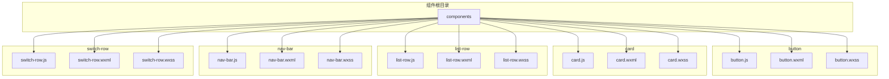
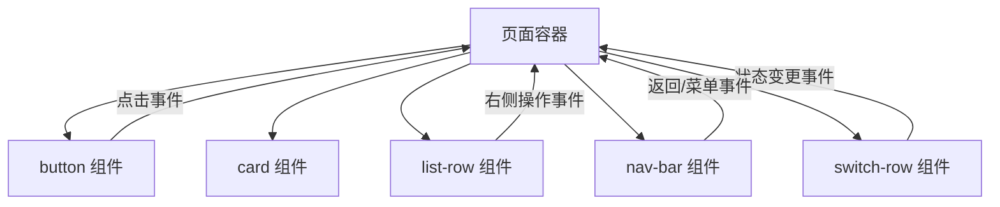
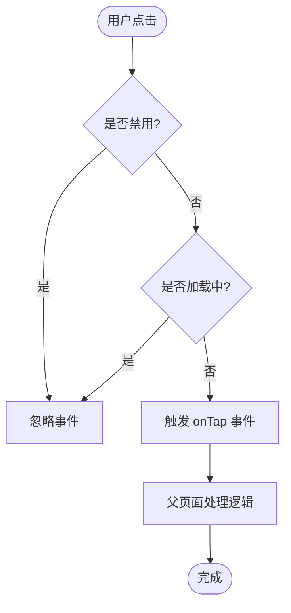
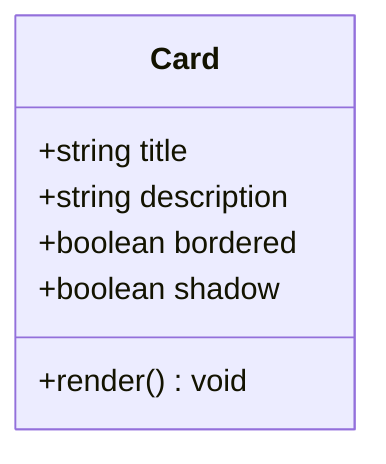
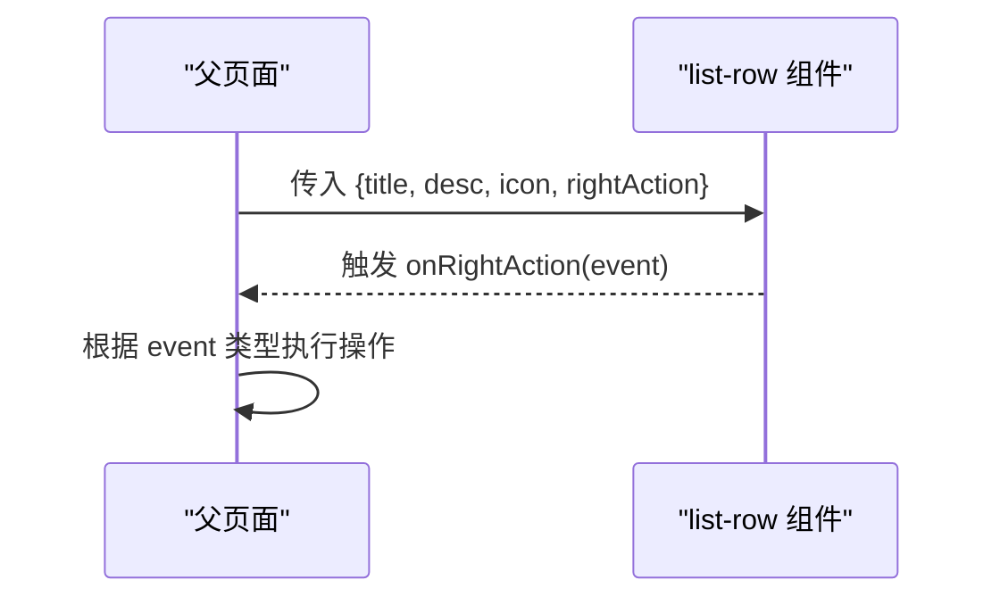
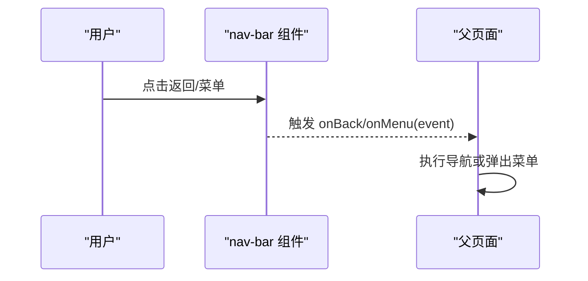
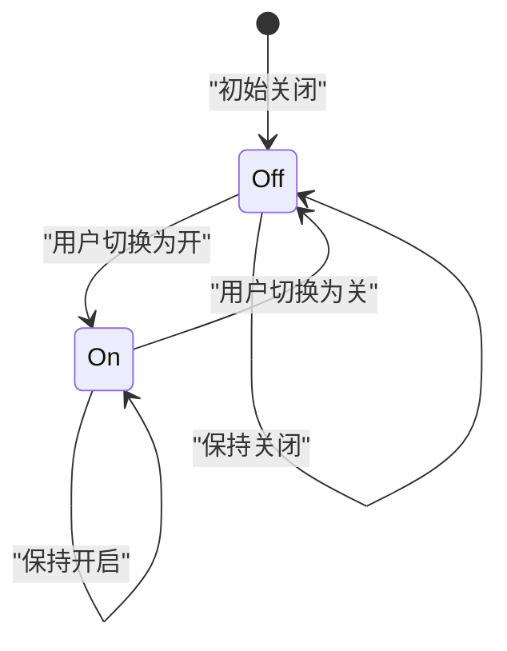
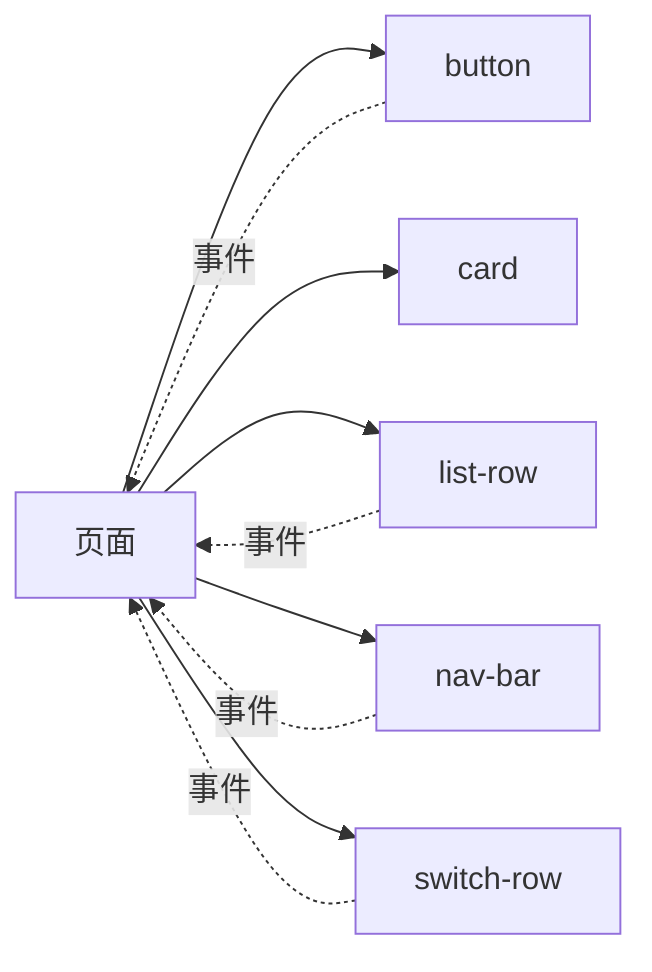

# 基础组件

<cite>
**本文引用的文件**   
- [egg-miniprogram/components/button/button.js](file://main/egg-miniprogram/miniprogram/components/button/button.js)
- [egg-miniprogram/components/button/button.wxml](file://main/egg-miniprogram/miniprogram/components/button/button.wxml)
- [egg-miniprogram/components/button/button.wxss](file://main/egg-miniprogram/miniprogram/components/button/button.wxss)
- [egg-miniprogram/components/card/card.js](file://main/egg-miniprogram/miniprogram/components/card/card.js)
- [egg-miniprogram/components/card/card.wxml](file://main/egg-miniprogram/miniprogram/components/card/card.wxml)
- [egg-miniprogram/components/card/card.wxss](file://main/egg-miniprogram/miniprogram/components/card/card.wxss)
- [egg-miniprogram/components/list-row/list-row.js](file://main/egg-miniprogram/miniprogram/components/list-row/list-row.js)
- [egg-miniprogram/components/list-row/list-row.wxml](file://main/egg-miniprogram/miniprogram/components/list-row/list-row.wxml)
- [egg-miniprogram/components/list-row/list-row.wxss](file://main/egg-miniprogram/miniprogram/components/list-row/list-row.wxss)
- [egg-miniprogram/components/nav-bar/nav-bar.js](file://main/egg-miniprogram/miniprogram/components/nav-bar/nav-bar.js)
- [egg-miniprogram/components/nav-bar/nav-bar.wxml](file://main/egg-miniprogram/miniprogram/components/nav-bar/nav-bar.wxml)
- [egg-miniprogram/components/nav-bar/nav-bar.wxss](file://main/egg-miniprogram/miniprogram/components/nav-bar/nav-bar.wxss)
- [egg-miniprogram/components/switch-row/switch-row.js](file://main/egg-miniprogram/miniprogram/components/switch-row/switch-row.js)
- [egg-miniprogram/components/switch-row/switch-row.wxml](file://main/egg-miniprogram/miniprogram/components/switch-row/switch-row.wxml)
- [egg-miniprogram/components/switch-row/switch-row.wxss](file://main/egg-miniprogram/miniprogram/components/switch-row/switch-row.wxss)
</cite>

## 目录
1. [简介](#简介)
2. [项目结构](#项目结构)
3. [核心组件](#核心组件)
4. [架构总览](#架构总览)
5. [详细组件分析](#详细组件分析)
6. [依赖关系分析](#依赖关系分析)
7. [性能考量](#性能考量)
8. [故障排查指南](#故障排查指南)
9. [结论](#结论)
10. [附录](#附录)

## 简介
本文件为蛋仔小程序的基础 UI 组件文档，聚焦以下五个组件：按钮（button）、卡片（card）、列表行（list-row）、导航栏（nav-bar）、开关行（switch-row）。内容涵盖样式定制、状态管理、事件处理、数据绑定、复用机制、无障碍支持等，并提供属性配置、事件回调、使用示例与最佳实践，帮助开发者快速集成与扩展。

## 项目结构
蛋仔小程序的自定义基础组件位于 miniprogram/components 目录下，每个组件由 .js、.wxml、.wxss 三部分组成，遵循微信小程序组件规范。

图表来源
- [egg-miniprogram/components/button/button.js](file://main/egg-miniprogram/miniprogram/components/button/button.js)
- [egg-miniprogram/components/button/button.wxml](file://main/egg-miniprogram/miniprogram/components/button/button.wxml)
- [egg-miniprogram/components/button/button.wxss](file://main/egg-miniprogram/miniprogram/components/button/button.wxss)
- [egg-miniprogram/components/card/card.js](file://main/egg-miniprogram/miniprogram/components/card/card.js)
- [egg-miniprogram/components/card/card.wxml](file://main/egg-miniprogram/miniprogram/components/card/card.wxml)
- [egg-miniprogram/components/card/card.wxss](file://main/egg-miniprogram/miniprogram/components/card/card.wxss)
- [egg-miniprogram/components/list-row/list-row.js](file://main/egg-miniprogram/miniprogram/components/list-row/list-row.js)
- [egg-miniprogram/components/list-row/list-row.wxml](file://main/egg-miniprogram/miniprogram/components/list-row/list-row.wxml)
- [egg-miniprogram/components/list-row/list-row.wxss](file://main/egg-miniprogram/miniprogram/components/list-row/list-row.wxss)
- [egg-miniprogram/components/nav-bar/nav-bar.js](file://main/egg-miniprogram/miniprogram/components/nav-bar/nav-bar.js)
- [egg-miniprogram/components/nav-bar/nav-bar.wxml](file://main/egg-miniprogram/miniprogram/components/nav-bar/nav-bar.wxml)
- [egg-miniprogram/components/nav-bar/nav-bar.wxss](file://main/egg-miniprogram/miniprogram/components/nav-bar/nav-bar.wxss)
- [egg-miniprogram/components/switch-row/switch-row.js](file://main/egg-miniprogram/miniprogram/components/switch-row/switch-row.js)
- [egg-miniprogram/components/switch-row/switch-row.wxml](file://main/egg-miniprogram/miniprogram/components/switch-row/switch-row.wxml)
- [egg-miniprogram/components/switch-row/switch-row.wxss](file://main/egg-miniprogram/miniprogram/components/switch-row/switch-row.wxss)

章节来源
- [egg-miniprogram/components/button/button.js](file://main/egg-miniprogram/miniprogram/components/button/button.js)
- [egg-miniprogram/components/button/button.wxml](file://main/egg-miniprogram/miniprogram/components/button/button.wxml)
- [egg-miniprogram/components/button/button.wxss](file://main/egg-miniprogram/miniprogram/components/button/button.wxss)
- [egg-miniprogram/components/card/card.js](file://main/egg-miniprogram/miniprogram/components/card/card.js)
- [egg-miniprogram/components/card/card.wxml](file://main/egg-miniprogram/miniprogram/components/card/card.wxml)
- [egg-miniprogram/components/card/card.wxss](file://main/egg-miniprogram/miniprogram/components/card/card.wxss)
- [egg-miniprogram/components/list-row/list-row.js](file://main/egg-miniprogram/miniprogram/components/list-row/list-row.js)
- [egg-miniprogram/components/list-row/list-row.wxml](file://main/egg-miniprogram/miniprogram/components/list-row/list-row.wxml)
- [egg-miniprogram/components/list-row/list-row.wxss](file://main/egg-miniprogram/miniprogram/components/list-row/list-row.wxss)
- [egg-miniprogram/components/nav-bar/nav-bar.js](file://main/egg-miniprogram/miniprogram/components/nav-bar/nav-bar.js)
- [egg-miniprogram/components/nav-bar/nav-bar.wxml](file://main/egg-miniprogram/miniprogram/components/nav-bar/nav-bar.wxml)
- [egg-miniprogram/components/nav-bar/nav-bar.wxss](file://main/egg-miniprogram/miniprogram/components/nav-bar/nav-bar.wxss)
- [egg-miniprogram/components/switch-row/switch-row.js](file://main/egg-miniprogram/miniprogram/components/switch-row/switch-row.js)
- [egg-miniprogram/components/switch-row/switch-row.wxml](file://main/egg-miniprogram/miniprogram/components/switch-row/switch-row.wxml)
- [egg-miniprogram/components/switch-row/switch-row.wxss](file://main/egg-miniprogram/miniprogram/components/switch-row/switch-row.wxss)

## 核心组件
本节概述各组件的职责与能力边界，便于快速定位与选型。

- 按钮（button）
  - 职责：提供可点击的交互元素，支持多种样式变体与禁用态，统一点击反馈与事件冒泡。
  - 关键能力：样式定制（颜色、尺寸、圆角、阴影）、状态管理（默认/按下/禁用/加载）、点击事件处理（onTap/onLongPress）。
  - 适用场景：表单提交、页面跳转、功能触发。

- 卡片（card）
  - 职责：承载一组相关内容，具备统一的边框与阴影风格，便于信息分组展示。
  - 关键能力：内容布局（标题、描述、插槽）、边框样式（圆角、描边）、阴影效果（层级、扩散半径）。
  - 适用场景：信息块、操作入口、结果展示。

- 列表行（list-row）
  - 职责：标准化单行列表项，支持图标、主副文本、右侧操作区，便于高复用渲染。
  - 关键能力：数据绑定（title/desc/icon/rightAction）、图标显示（本地或网络图）、右侧操作（箭头/开关/按钮）。
  - 适用场景：设置页、选项列表、消息条目。

- 导航栏（nav-bar）
  - 职责：提供页面级导航能力，包括标题、返回按钮、菜单扩展。
  - 关键能力：标题设置（居中/左对齐）、返回按钮（显隐/自定义）、菜单扩展（更多/搜索/分享）。
  - 适用场景：页面头部、全局导航。

- 开关行（switch-row）
  - 职责：提供开关式设置项，包含状态切换、动画过渡、无障碍标签。
  - 关键能力：状态切换（开/关）、动画效果（平滑过渡）、无障碍支持（aria-label/role）。
  - 适用场景：偏好设置、功能开关。

章节来源
- [egg-miniprogram/components/button/button.js](file://main/egg-miniprogram/miniprogram/components/button/button.js)
- [egg-miniprogram/components/button/button.wxml](file://main/egg-miniprogram/miniprogram/components/button/button.wxml)
- [egg-miniprogram/components/button/button.wxss](file://main/egg-miniprogram/miniprogram/components/button/button.wxss)
- [egg-miniprogram/components/card/card.js](file://main/egg-miniprogram/miniprogram/components/card/card.js)
- [egg-miniprogram/components/card/card.wxml](file://main/egg-miniprogram/miniprogram/components/card/card.wxml)
- [egg-miniprogram/components/card/card.wxss](file://main/egg-miniprogram/miniprogram/components/card/card.wxss)
- [egg-miniprogram/components/list-row/list-row.js](file://main/egg-miniprogram/miniprogram/components/list-row/list-row.js)
- [egg-miniprogram/components/list-row/list-row.wxml](file://main/egg-miniprogram/miniprogram/components/list-row/list-row.wxml)
- [egg-miniprogram/components/list-row/list-row.wxss](file://main/egg-miniprogram/miniprogram/components/list-row/list-row.wxss)
- [egg-miniprogram/components/nav-bar/nav-bar.js](file://main/egg-miniprogram/miniprogram/components/nav-bar/nav-bar.js)
- [egg-miniprogram/components/nav-bar/nav-bar.wxml](file://main/egg-miniprogram/miniprogram/components/nav-bar/nav-bar.wxml)
- [egg-miniprogram/components/nav-bar/nav-bar.wxss](file://main/egg-miniprogram/miniprogram/components/nav-bar/nav-bar.wxss)
- [egg-miniprogram/components/switch-row/switch-row.js](file://main/egg-miniprogram/miniprogram/components/switch-row/switch-row.js)
- [egg-miniprogram/components/switch-row/switch-row.wxml](file://main/egg-miniprogram/miniprogram/components/switch-row/switch-row.wxml)
- [egg-miniprogram/components/switch-row/switch-row.wxss](file://main/egg-miniprogram/miniprogram/components/switch-row/switch-row.wxss)

## 架构总览
下图展示了各组件在页面中的典型调用关系与事件流向。页面通过属性向组件传递配置，组件内部维护自身状态并通过事件向上抛出，父页面监听并处理业务逻辑。

图表来源
- [egg-miniprogram/components/button/button.js](file://main/egg-miniprogram/miniprogram/components/button/button.js)
- [egg-miniprogram/components/button/button.wxml](file://main/egg-miniprogram/miniprogram/components/button/button.wxml)
- [egg-miniprogram/components/card/card.js](file://main/egg-miniprogram/miniprogram/components/card/card.js)
- [egg-miniprogram/components/card/card.wxml](file://main/egg-miniprogram/miniprogram/components/card/card.wxml)
- [egg-miniprogram/components/list-row/list-row.js](file://main/egg-miniprogram/miniprogram/components/list-row/list-row.js)
- [egg-miniprogram/components/list-row/list-row.wxml](file://main/egg-miniprogram/miniprogram/components/list-row/list-row.wxml)
- [egg-miniprogram/components/nav-bar/nav-bar.js](file://main/egg-miniprogram/miniprogram/components/nav-bar/nav-bar.js)
- [egg-miniprogram/components/nav-bar/nav-bar.wxml](file://main/egg-miniprogram/miniprogram/components/nav-bar/nav-bar.wxml)
- [egg-miniprogram/components/switch-row/switch-row.js](file://main/egg-miniprogram/miniprogram/components/switch-row/switch-row.js)
- [egg-miniprogram/components/switch-row/switch-row.wxml](file://main/egg-miniprogram/miniprogram/components/switch-row/switch-row.wxml)

## 详细组件分析

### 按钮组件（button）
- 样式定制
  - 支持主题色、尺寸（大/中/小）、圆角、禁用态灰度、加载指示器。
  - 通过 wxss 变量或类名覆盖默认样式，建议集中管理主题色与间距。
- 状态管理
  - 内置默认/按下/禁用/加载四种状态，可通过属性控制。
  - 长按与点击反馈建议使用平台原生能力，避免重复实现。
- 点击事件处理
  - 暴露 onTap/onLongPress 等事件，父页面可捕获并执行路由跳转或业务逻辑。
  - 建议在高频点击处加入防抖，避免重复请求。

图表来源
- [egg-miniprogram/components/button/button.js](file://main/egg-miniprogram/miniprogram/components/button/button.js)
- [egg-miniprogram/components/button/button.wxml](file://main/egg-miniprogram/miniprogram/components/button/button.wxml)
- [egg-miniprogram/components/button/button.wxss](file://main/egg-miniprogram/miniprogram/components/button/button.wxss)

章节来源
- [egg-miniprogram/components/button/button.js](file://main/egg-miniprogram/miniprogram/components/button/button.js)
- [egg-miniprogram/components/button/button.wxml](file://main/egg-miniprogram/miniprogram/components/button/button.wxml)
- [egg-miniprogram/components/button/button.wxss](file://main/egg-miniprogram/miniprogram/components/button/button.wxss)

### 卡片组件（card）
- 内容布局
  - 支持标题、描述、插槽区域；推荐将复杂内容放入插槽，保持组件简洁。
  - 内边距与分割线应保持一致性，便于视觉层次划分。
- 边框样式
  - 圆角与描边统一化，适配不同背景色；深色模式需调整描边对比度。
- 阴影效果
  - 使用轻量阴影提升层级感，避免过度阴影导致性能下降。

图表来源
- [egg-miniprogram/components/card/card.js](file://main/egg-miniprogram/miniprogram/components/card/card.js)
- [egg-miniprogram/components/card/card.wxml](file://main/egg-miniprogram/miniprogram/components/card/card.wxml)
- [egg-miniprogram/components/card/card.wxss](file://main/egg-miniprogram/miniprogram/components/card/card.wxss)

章节来源
- [egg-miniprogram/components/card/card.js](file://main/egg-miniprogram/miniprogram/components/card/card.js)
- [egg-miniprogram/components/card/card.wxml](file://main/egg-miniprogram/miniprogram/components/card/card.wxml)
- [egg-miniprogram/components/card/card.wxss](file://main/egg-miniprogram/miniprogram/components/card/card.wxss)

### 列表行组件（list-row）
- 复用机制
  - 通过 props 驱动渲染：title、desc、icon、rightAction 等字段组合出不同形态。
  - 推荐使用虚拟列表或分页加载，避免一次性渲染过多节点。
- 数据绑定
  - 单向数据流，父页面持有数据源，子组件仅负责展示与事件上报。
- 图标显示
  - 支持本地资源与网络图片，建议统一占位图与错误回退策略。
- 右侧操作
  - 支持箭头、开关、按钮等，点击事件统一通过事件冒泡上报。

图表来源
- [egg-miniprogram/components/list-row/list-row.js](file://main/egg-miniprogram/miniprogram/components/list-row/list-row.js)
- [egg-miniprogram/components/list-row/list-row.wxml](file://main/egg-miniprogram/miniprogram/components/list-row/list-row.wxml)
- [egg-miniprogram/components/list-row/list-row.wxss](file://main/egg-miniprogram/miniprogram/components/list-row/list-row.wxss)

章节来源
- [egg-miniprogram/components/list-row/list-row.js](file://main/egg-miniprogram/miniprogram/components/list-row/list-row.js)
- [egg-miniprogram/components/list-row/list-row.wxml](file://main/egg-miniprogram/miniprogram/components/list-row/list-row.wxml)
- [egg-miniprogram/components/list-row/list-row.wxss](file://main/egg-miniprogram/miniprogram/components/list-row/list-row.wxss)

### 导航栏组件（nav-bar）
- 标题设置
  - 支持居中/左对齐、动态更新；长标题建议截断或省略。
- 返回按钮
  - 可配置显隐与自定义图标；返回行为建议封装为统一方法。
- 菜单扩展
  - 支持更多/搜索/分享等扩展按钮，点击事件通过事件上报给父页面。

图表来源
- [egg-miniprogram/components/nav-bar/nav-bar.js](file://main/egg-miniprogram/miniprogram/components/nav-bar/nav-bar.js)
- [egg-miniprogram/components/nav-bar/nav-bar.wxml](file://main/egg-miniprogram/miniprogram/components/nav-bar/nav-bar.wxml)
- [egg-miniprogram/components/nav-bar/nav-bar.wxss](file://main/egg-miniprogram/miniprogram/components/nav-bar/nav-bar.wxss)

章节来源
- [egg-miniprogram/components/nav-bar/nav-bar.js](file://main/egg-miniprogram/miniprogram/components/nav-bar/nav-bar.js)
- [egg-miniprogram/components/nav-bar/nav-bar.wxml](file://main/egg-miniprogram/miniprogram/components/nav-bar/nav-bar.wxml)
- [egg-miniprogram/components/nav-bar/nav-bar.wxss](file://main/egg-miniprogram/miniprogram/components/nav-bar/nav-bar.wxss)

### 开关行组件（switch-row）
- 交互逻辑
  - 支持开/关两种状态切换，切换时触发 onChange 事件，父页面同步状态。
- 动画效果
  - 使用 CSS transition 实现平滑过渡，避免频繁重排。
- 无障碍支持
  - 提供 aria-label/role 等属性，确保读屏设备正确播报。

图表来源
- [egg-miniprogram/components/switch-row/switch-row.js](file://main/egg-miniprogram/miniprogram/components/switch-row/switch-row.js)
- [egg-miniprogram/components/switch-row/switch-row.wxml](file://main/egg-miniprogram/miniprogram/components/switch-row/switch-row.wxml)
- [egg-miniprogram/components/switch-row/switch-row.wxss](file://main/egg-miniprogram/miniprogram/components/switch-row/switch-row.wxss)

章节来源
- [egg-miniprogram/components/switch-row/switch-row.js](file://main/egg-miniprogram/miniprogram/components/switch-row/switch-row.js)
- [egg-miniprogram/components/switch-row/switch-row.wxml](file://main/egg-miniprogram/miniprogram/components/switch-row/switch-row.wxml)
- [egg-miniprogram/components/switch-row/switch-row.wxss](file://main/egg-miniprogram/miniprogram/components/switch-row/switch-row.wxss)

## 依赖关系分析
组件之间保持低耦合，主要通过属性与事件进行通信，避免直接引用彼此实现。页面作为编排者，协调各组件的数据流与事件流。

图表来源
- [egg-miniprogram/components/button/button.js](file://main/egg-miniprogram/miniprogram/components/button/button.js)
- [egg-miniprogram/components/card/card.js](file://main/egg-miniprogram/miniprogram/components/card/card.js)
- [egg-miniprogram/components/list-row/list-row.js](file://main/egg-miniprogram/miniprogram/components/list-row/list-row.js)
- [egg-miniprogram/components/nav-bar/nav-bar.js](file://main/egg-miniprogram/miniprogram/components/nav-bar/nav-bar.js)
- [egg-miniprogram/components/switch-row/switch-row.js](file://main/egg-miniprogram/miniprogram/components/switch-row/switch-row.js)

章节来源
- [egg-miniprogram/components/button/button.js](file://main/egg-miniprogram/miniprogram/components/button/button.js)
- [egg-miniprogram/components/card/card.js](file://main/egg-miniprogram/miniprogram/components/card/card.js)
- [egg-miniprogram/components/list-row/list-row.js](file://main/egg-miniprogram/miniprogram/components/list-row/list-row.js)
- [egg-miniprogram/components/nav-bar/nav-bar.js](file://main/egg-miniprogram/miniprogram/components/nav-bar/nav-bar.js)
- [egg-miniprogram/components/switch-row/switch-row.js](file://main/egg-miniprogram/miniprogram/components/switch-row/switch-row.js)

## 性能考量
- 列表渲染
  - 对 list-row 大量渲染场景，采用分页或虚拟滚动，减少首屏压力。
- 样式优化
  - 避免过深嵌套与复杂选择器，合理使用 wxss 变量与类复用。
- 事件处理
  - 对高频事件（如点击、滑动）增加防抖/节流，降低不必要的计算。
- 图片资源
  - 使用合适尺寸与格式，启用懒加载与占位图，减少带宽占用。

[本节为通用指导，不直接分析具体文件]

## 故障排查指南
- 按钮无响应
  - 检查是否处于禁用或加载状态；确认事件绑定是否正确。
- 卡片样式异常
  - 检查 wxss 覆盖优先级与盒模型；确认边框与阴影参数是否合理。
- 列表行错位或重叠
  - 检查 flex/grid 布局与内边距；确认图标与文本长度溢出处理。
- 导航栏标题未更新
  - 检查属性更新时机与页面生命周期；确认事件冒泡未被拦截。
- 开关状态不同步
  - 检查父页面状态更新逻辑；确认 onChange 事件是否被正确处理。

章节来源
- [egg-miniprogram/components/button/button.js](file://main/egg-miniprogram/miniprogram/components/button/button.js)
- [egg-miniprogram/components/card/card.js](file://main/egg-miniprogram/miniprogram/components/card/card.js)
- [egg-miniprogram/components/list-row/list-row.js](file://main/egg-miniprogram/miniprogram/components/list-row/list-row.js)
- [egg-miniprogram/components/nav-bar/nav-bar.js](file://main/egg-miniprogram/miniprogram/components/nav-bar/nav-bar.js)
- [egg-miniprogram/components/switch-row/switch-row.js](file://main/egg-miniprogram/miniprogram/components/switch-row/switch-row.js)

## 结论
上述五个基础组件覆盖了蛋仔小程序常见的交互与展示需求。通过统一的属性与事件契约，组件具备良好的可复用性与可扩展性。建议在实际项目中结合主题系统与设计规范，持续完善样式与交互细节，确保一致的用户体验。

[本节为总结性内容，不直接分析具体文件]

## 附录
- 使用示例（以属性与事件为主，不包含代码片段）
  - button
    - 属性：type、size、disabled、loading
    - 事件：onTap、onLongPress
    - 示例：用于“提交”“返回”“更多”等操作
  - card
    - 属性：title、description、bordered、shadow
    - 插槽：content
    - 示例：用于“个人信息”“订单详情”等区块
  - list-row
    - 属性：title、desc、icon、rightAction
    - 事件：onRightAction
    - 示例：用于“设置项”“消息条目”等列表
  - nav-bar
    - 属性：title、showBack、menuItems
    - 事件：onBack、onMenu
    - 示例：用于“页面头部”“全局导航”
  - switch-row
    - 属性：checked、label、disabled
    - 事件：onChange
    - 示例：用于“通知开关”“隐私设置”

[本节为补充说明，不直接分析具体文件]