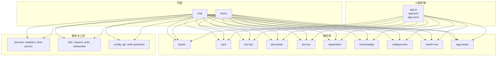
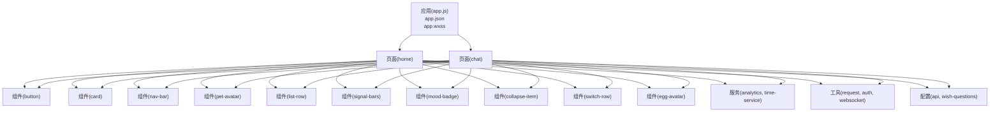
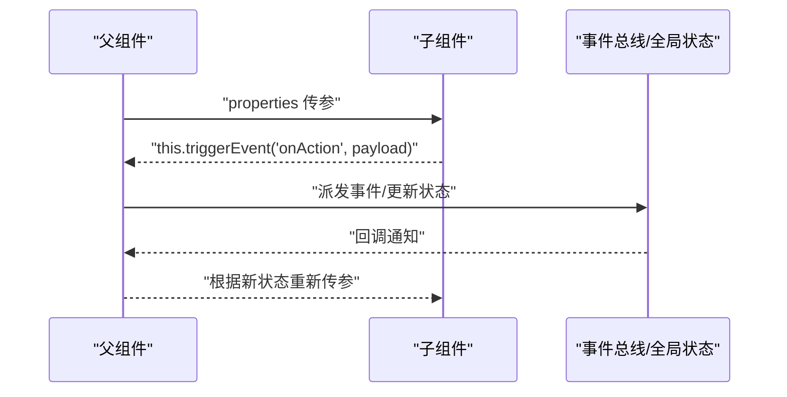
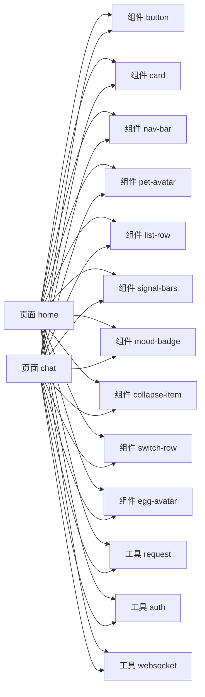

# 组件开发指南

<cite>
**本文档引用的文件**   
- [egg-miniprogram/README.md](file://main/egg-miniprogram/README.md)
- [egg-miniprogram/DESIGN.md](file://main/egg-miniprogram/DESIGN.md)
- [egg-miniprogram/app.json](file://main/egg-miniprogram/miniprogram/app.json)
- [egg-miniprogram/app.js](file://main/egg-miniprogram/miniprogram/app.js)
- [egg-miniprogram/app.wxss](file://main/egg-miniprogram/miniprogram/app.wxss)
- [egg-miniprogram/components/button/index.json](file://main/egg-miniprogram/miniprogram/components/button/index.json)
- [egg-miniprogram/components/button/index.wxml](file://main/egg-miniprogram/miniprogram/components/button/index.wxml)
- [egg-miniprogram/components/button/index.wxss](file://main/egg-miniprogram/miniprogram/components/button/index.wxss)
- [egg-miniprogram/components/button/index.js](file://main/egg-miniprogram/miniprogram/components/button/index.js)
- [egg-miniprogram/components/card/index.json](file://main/egg-miniprogram/miniprogram/components/card/index.json)
- [egg-miniprogram/components/card/index.wxml](file://main/egg-miniprogram/miniprogram/components/card/index.wxml)
- [egg-miniprogram/components/card/index.wxss](file://main/egg-miniprogram/miniprogram/components/card/index.wxss)
- [egg-miniprogram/components/card/index.js](file://main/egg-miniprogram/miniprogram/components/card/index.js)
- [egg-miniprogram/components/nav-bar/index.json](file://main/egg-miniprogram/miniprogram/components/nav-bar/index.json)
- [egg-miniprogram/components/nav-bar/index.wxml](file://main/egg-miniprogram/miniprogram/components/nav-bar/index.wxml)
- [egg-miniprogram/components/nav-bar/index.wxss](file://main/egg-miniprogram/miniprogram/components/nav-bar/index.wxss)
- [egg-miniprogram/components/nav-bar/index.js](file://main/egg-miniprogram/miniprogram/miniprogram/components/nav-bar/index.js)
- [egg-miniprogram/components/pet-avatar/index.json](file://main/egg-miniprogram/miniprogram/components/pet-avatar/index.json)
- [egg-miniprogram/components/pet-avatar/index.wxml](file://main/egg-miniprogram/miniprogram/components/pet-avatar/index.wxml)
- [egg-miniprogram/components/pet-avatar/index.wxss](file://main/egg-miniprogram/miniprogram/components/pet-avatar/index.wxss)
- [egg-miniprogram/components/pet-avatar/index.js](file://main/egg-miniprogram/miniprogram/components/pet-avatar/index.js)
- [egg-miniprogram/components/list-row/index.json](file://main/egg-miniprogram/miniprogram/components/list-row/index.json)
- [egg-miniprogram/components/list-row/index.wxml](file://main/egg-miniprogram/miniprogram/components/list-row/index.wxml)
- [egg-miniprogram/components/list-row/index.wxss](file://main/egg-miniprogram/miniprogram/components/list-row/index.wxss)
- [egg-miniprogram/components/list-row/index.js](file://main/egg-miniprogram/miniprogram/components/list-row/index.js)
- [egg-miniprogram/components/signal-bars/index.json](file://main/egg-miniprogram/miniprogram/components/signal-bars/index.json)
- [egg-miniprogram/components/signal-bars/index.wxml](file://main/egg-miniprogram/miniprogram/components/signal-bars/index.wxml)
- [egg-miniprogram/components/signal-bars/index.wxss](file://main/egg-miniprogram/miniprogram/components/signal-bars/index.wxss)
- [egg-miniprogram/components/signal-bars/index.js](file://main/egg-miniprogram/miniprogram/components/signal-bars/index.js)
- [egg-miniprogram/components/mood-badge/index.json](file://main/egg-miniprogram/miniprogram/components/mood-badge/index.json)
- [egg-miniprogram/components/mood-badge/index.wxml](file://main/egg-miniprogram/miniprogram/components/mood-badge/index.wxml)
- [egg-miniprogram/components/mood-badge/index.wxss](file://main/egg-miniprogram/miniprogram/components/mood-badge/index.wxss)
- [egg-miniprogram/components/mood-badge/index.js](file://main/egg-miniprogram/miniprogram/components/mood-badge/index.js)
- [egg-miniprogram/components/collapse-item/index.json](file://main/egg-miniprogram/miniprogram/components/collapse-item/index.json)
- [egg-miniprogram/components/collapse-item/index.wxml](file://main/egg-miniprogram/miniprogram/components/collapse-item/index.wxml)
- [egg-miniprogram/components/collapse-item/index.wxss](file://main/egg-miniprogram/miniprogram/components/collapse-item/index.wxss)
- [egg-miniprogram/components/collapse-item/index.js](file://main/egg-miniprogram/miniprogram/components/collapse-item/index.js)
- [egg-miniprogram/components/switch-row/index.json](file://main/egg-miniprogram/miniprogram/components/switch-row/index.json)
- [egg-miniprogram/components/switch-row/index.wxml](file://main/egg-miniprogram/miniprogram/components/switch-row/index.wxml)
- [egg-miniprogram/components/switch-row/index.wxss](file://main/egg-miniprogram/miniprogram/components/switch-row/index.wxss)
- [egg-miniprogram/components/switch-row/index.js](file://main/egg-miniprogram/miniprogram/components/switch-row/index.js)
- [egg-miniprogram/components/egg-avatar/index.json](file://main/egg-miniprogram/miniprogram/components/egg-avatar/index.json)
- [egg-miniprogram/components/egg-avatar/index.wxml](file://main/egg-miniprogram/miniprogram/components/egg-avatar/index.wxml)
- [egg-miniprogram/components/egg-avatar/index.wxss](file://main/egg-miniprogram/miniprogram/components/egg-avatar/index.wxss)
- [egg-miniprogram/components/egg-avatar/index.js](file://main/egg-miniprogram/miniprogram/components/egg-avatar/index.js)
- [egg-miniprogram/pages/home/home.json](file://main/egg-miniprogram/miniprogram/pages/home/home.json)
- [egg-miniprogram/pages/home/home.wxml](file://main/egg-miniprogram/miniprogram/pages/home/home.wxml)
- [egg-miniprogram/pages/home/home.js](file://main/egg-miniprogram/miniprogram/pages/home/home.js)
- [egg-miniprogram/pages/chat/chat.json](file://main/egg-miniprogram/miniprogram/pages/chat/chat.json)
- [egg-miniprogram/pages/chat/chat.wxml](file://main/egg-miniprogram/miniprogram/pages/chat/chat.wxml)
- [egg-miniprogram/pages/chat/chat.js](file://main/egg-miniprogram/miniprogram/pages/chat/chat.js)
- [egg-miniprogram/services/analytics.js](file://main/egg-miniprogram/miniprogram/services/analytics.js)
- [egg-miniprogram/services/time-service.js](file://main/egg-miniprogram/miniprogram/services/time-service.js)
- [egg-miniprogram/utils/request.js](file://main/egg-miniprogram/miniprogram/utils/request.js)
- [egg-miniprogram/utils/auth.js](file://main/egg-miniprogram/miniprogram/utils/auth.js)
- [egg-miniprogram/utils/websocket.js](file://main/egg-miniprogram/miniprogram/utils/websocket.js)
- [egg-miniprogram/config/api.js](file://main/egg-miniprogram/miniprogram/config/api.js)
- [egg-miniprogram/config/wish-questions.js](file://main/egg-miniprogram/miniprogram/config/wish-questions.js)
</cite>

## 目录
1. [简介](#简介)
2. [项目结构](#项目结构)
3. [核心组件](#核心组件)
4. [架构总览](#架构总览)
5. [详细组件分析](#详细组件分析)
6. [依赖关系分析](#依赖关系分析)
7. [性能考虑](#性能考虑)
8. [故障排查指南](#故障排查指南)
9. [结论](#结论)
10. [附录](#附录)

## 简介
本指南面向蛋仔小程序的微信小程序组件开发，围绕 WXML 模板结构、WXSS 样式组织、JS 逻辑封装、组件接口设计（属性、事件、插槽）、生命周期管理、通信机制（父子、兄弟、跨层级）、测试策略（单元、集成、UI）与性能优化（虚拟滚动、懒加载、内存泄漏防护）提供系统化说明。文档同时给出从需求分析到上线部署的全流程指导，并基于仓库中现有组件与页面进行对照讲解，帮助读者快速上手并产出高质量可复用组件。

## 项目结构
蛋仔小程序前端位于 main/egg-miniprogram/miniprogram 目录下，采用“按功能域划分”的组织方式：
- components：通用组件集合，每个组件以独立文件夹组织，包含 index.json、index.wxml、index.wxss、index.js
- pages：业务页面，每个页面同样由 json/wxml/wxss/js 组成
- services：应用级服务（如埋点、时间服务）
- utils：工具函数与网络、鉴权、WebSocket 等能力封装
- config：配置项（API、文案等）
- app.*：应用入口与全局样式

图表来源
- [egg-miniprogram/app.json](file://main/egg-miniprogram/miniprogram/app.json)
- [egg-miniprogram/components/button/index.json](file://main/egg-miniprogram/miniprogram/components/button/index.json)
- [egg-miniprogram/components/card/index.json](file://main/egg-miniprogram/miniprogram/components/card/index.json)
- [egg-miniprogram/components/nav-bar/index.json](file://main/egg-miniprogram/miniprogram/components/nav-bar/index.json)
- [egg-miniprogram/components/pet-avatar/index.json](file://main/egg-miniprogram/miniprogram/components/pet-avatar/index.json)
- [egg-miniprogram/components/list-row/index.json](file://main/egg-miniprogram/miniprogram/components/list-row/index.json)
- [egg-miniprogram/components/signal-bars/index.json](file://main/egg-miniprogram/miniprogram/components/signal-bars/index.json)
- [egg-miniprogram/components/mood-badge/index.json](file://main/egg-miniprogram/miniprogram/components/mood-badge/index.json)
- [egg-miniprogram/components/collapse-item/index.json](file://main/egg-miniprogram/miniprogram/components/collapse-item/index.json)
- [egg-miniprogram/components/switch-row/index.json](file://main/egg-miniprogram/miniprogram/components/switch-row/index.json)
- [egg-miniprogram/components/egg-avatar/index.json](file://main/egg-miniprogram/miniprogram/components/egg-avatar/index.json)
- [egg-miniprogram/pages/home/home.json](file://main/egg-miniprogram/miniprogram/pages/home/home.json)
- [egg-miniprogram/pages/chat/chat.json](file://main/egg-miniprogram/miniprogram/pages/chat/chat.json)

章节来源
- [egg-miniprogram/README.md](file://main/egg-miniprogram/README.md)
- [egg-miniprogram/DESIGN.md](file://main/egg-miniprogram/DESIGN.md)
- [egg-miniprogram/app.json](file://main/egg-miniprogram/miniprogram/app.json)

## 核心组件
以下组件在项目中已实现，可作为开发与复用的参考：
- button：基础按钮，支持点击事件与外观定制
- card：卡片容器，承载内容区块
- nav-bar：导航栏，支持标题、返回、右侧操作
- pet-avatar：宠物头像展示，支持尺寸与状态
- list-row：列表行，用于信息条目展示
- signal-bars：信号强度指示器
- mood-badge：情绪徽章，用于状态标签
- collapse-item：折叠面板项，支持展开/收起
- switch-row：开关行，用于设置项
- egg-avatar：蛋仔头像组件，支持多种形态

这些组件遵循统一的目录结构与命名规范，便于按需引入与主题化扩展。

章节来源
- [egg-miniprogram/components/button/index.json](file://main/egg-miniprogram/miniprogram/components/button/index.json)
- [egg-miniprogram/components/button/index.wxml](file://main/egg-miniprogram/miniprogram/components/button/index.wxml)
- [egg-miniprogram/components/button/index.wxss](file://main/egg-miniprogram/miniprogram/components/button/index.wxss)
- [egg-miniprogram/components/button/index.js](file://main/egg-miniprogram/miniprogram/components/button/index.js)
- [egg-miniprogram/components/card/index.json](file://main/egg-miniprogram/miniprogram/components/card/index.json)
- [egg-miniprogram/components/card/index.wxml](file://main/egg-miniprogram/miniprogram/components/card/index.wxml)
- [egg-miniprogram/components/card/index.wxss](file://main/egg-miniprogram/miniprogram/components/card/index.wxss)
- [egg-miniprogram/components/card/index.js](file://main/egg-miniprogram/miniprogram/components/card/index.js)
- [egg-miniprogram/components/nav-bar/index.json](file://main/egg-miniprogram/miniprogram/components/nav-bar/index.json)
- [egg-miniprogram/components/nav-bar/index.wxml](file://main/egg-miniprogram/miniprogram/components/nav-bar/index.wxml)
- [egg-miniprogram/components/nav-bar/index.wxss](file://main/egg-miniprogram/miniprogram/components/nav-bar/index.wxss)
- [egg-miniprogram/components/nav-bar/index.js](file://main/egg-miniprogram/miniprogram/components/nav-bar/index.js)
- [egg-miniprogram/components/pet-avatar/index.json](file://main/egg-miniprogram/miniprogram/components/pet-avatar/index.json)
- [egg-miniprogram/components/pet-avatar/index.wxml](file://main/egg-miniprogram/miniprogram/components/pet-avatar/index.wxml)
- [egg-miniprogram/components/pet-avatar/index.wxss](file://main/egg-miniprogram/miniprogram/components/pet-avatar/index.wxss)
- [egg-miniprogram/components/pet-avatar/index.js](file://main/egg-miniprogram/miniprogram/components/pet-avatar/index.js)
- [egg-miniprogram/components/list-row/index.json](file://main/egg-miniprogram/miniprogram/components/list-row/index.json)
- [egg-miniprogram/components/list-row/index.wxml](file://main/egg-miniprogram/miniprogram/components/list-row/index.wxml)
- [egg-miniprogram/components/list-row/index.wxss](file://main/egg-miniprogram/miniprogram/components/list-row/index.wxss)
- [egg-miniprogram/components/list-row/index.js](file://main/egg-miniprogram/miniprogram/components/list-row/index.js)
- [egg-miniprogram/components/signal-bars/index.json](file://main/egg-miniprogram/miniprogram/components/signal-bars/index.json)
- [egg-miniprogram/components/signal-bars/index.wxml](file://main/egg-miniprogram/miniprogram/components/signal-bars/index.wxml)
- [egg-miniprogram/components/signal-bars/index.wxss](file://main/egg-miniprogram/components/signal-bars/index.wxss)
- [egg-miniprogram/components/signal-bars/index.js](file://main/egg-miniprogram/miniprogram/components/signal-bars/index.js)
- [egg-miniprogram/components/mood-badge/index.json](file://main/egg-miniprogram/miniprogram/components/mood-badge/index.json)
- [egg-miniprogram/components/mood-badge/index.wxml](file://main/egg-miniprogram/miniprogram/components/mood-badge/index.wxml)
- [egg-miniprogram/components/mood-badge/index.wxss](file://main/egg-miniprogram/miniprogram/components/mood-badge/index.wxss)
- [egg-miniprogram/components/mood-badge/index.js](file://main/egg-miniprogram/miniprogram/components/mood-badge/index.js)
- [egg-miniprogram/components/collapse-item/index.json](file://main/egg-miniprogram/miniprogram/components/collapse-item/index.json)
- [egg-miniprogram/components/collapse-item/index.wxml](file://main/egg-miniprogram/miniprogram/components/collapse-item/index.wxml)
- [egg-miniprogram/components/collapse-item/index.wxss](file://main/egg-miniprogram/miniprogram/components/collapse-item/index.wxss)
- [egg-miniprogram/components/collapse-item/index.js](file://main/egg-miniprogram/miniprogram/components/collapse-item/index.js)
- [egg-miniprogram/components/switch-row/index.json](file://main/egg-miniprogram/miniprogram/components/switch-row/index.json)
- [egg-miniprogram/components/switch-row/index.wxml](file://main/egg-miniprogram/miniprogram/components/switch-row/index.wxml)
- [egg-miniprogram/components/switch-row/index.wxss](file://main/egg-miniprogram/miniprogram/components/switch-row/index.wxss)
- [egg-miniprogram/components/switch-row/index.js](file://main/egg-miniprogram/miniprogram/components/switch-row/index.js)
- [egg-miniprogram/components/egg-avatar/index.json](file://main/egg-miniprogram/miniprogram/components/egg-avatar/index.json)
- [egg-miniprogram/components/egg-avatar/index.wxml](file://main/egg-miniprogram/miniprogram/components/egg-avatar/index.wxml)
- [egg-miniprogram/components/egg-avatar/index.wxss](file://main/egg-miniprogram/miniprogram/components/egg-avatar/index.wxss)
- [egg-miniprogram/components/egg-avatar/index.js](file://main/egg-miniprogram/miniprogram/components/egg-avatar/index.js)

## 架构总览
小程序整体架构由“应用层 + 页面层 + 组件层 + 服务/工具层”构成。页面通过 JSON 声明使用组件，WXML 模板组合组件，JS 处理交互与数据流，WXSS 统一样式。服务与工具为页面与组件提供能力支撑。

图表来源
- [egg-miniprogram/app.js](file://main/egg-miniprogram/miniprogram/app.js)
- [egg-miniprogram/app.json](file://main/egg-miniprogram/miniprogram/app.json)
- [egg-miniprogram/pages/home/home.json](file://main/egg-miniprogram/miniprogram/pages/home/home.json)
- [egg-miniprogram/pages/chat/chat.json](file://main/egg-miniprogram/miniprogram/pages/chat/chat.json)
- [egg-miniprogram/services/analytics.js](file://main/egg-miniprogram/miniprogram/services/analytics.js)
- [egg-miniprogram/services/time-service.js](file://main/egg-miniprogram/miniprogram/services/time-service.js)
- [egg-miniprogram/utils/request.js](file://main/egg-miniprogram/miniprogram/utils/request.js)
- [egg-miniprogram/utils/auth.js](file://main/egg-miniprogram/miniprogram/utils/auth.js)
- [egg-miniprogram/utils/websocket.js](file://main/egg-miniprogram/miniprogram/utils/websocket.js)
- [egg-miniprogram/config/api.js](file://main/egg-miniprogram/miniprogram/config/api.js)
- [egg-miniprogram/config/wish-questions.js](file://main/egg-miniprogram/miniprogram/config/wish-questions.js)

## 详细组件分析

### 组件接口设计原则
- 属性定义：在组件 JSON 中声明 properties，明确类型、默认值与校验；对外暴露最小必要接口，避免过度耦合
- 事件绑定：通过 methods 暴露事件回调，使用 this.triggerEvent('eventName', payload) 向父组件传递事件与数据
- 插槽使用：合理使用默认插槽与具名插槽，提升组件的可定制性；避免在插槽内强依赖父组件内部结构
- 样式隔离：组件样式使用 BEM 或类名前缀，避免污染全局样式；必要时提供主题变量

章节来源
- [egg-miniprogram/components/button/index.json](file://main/egg-miniprogram/miniprogram/components/button/index.json)
- [egg-miniprogram/components/button/index.wxml](file://main/egg-miniprogram/miniprogram/components/button/index.wxml)
- [egg-miniprogram/components/button/index.js](file://main/egg-miniprogram/miniprogram/components/button/index.js)
- [egg-miniprogram/components/card/index.json](file://main/egg-miniprogram/miniprogram/components/card/index.json)
- [egg-miniprogram/components/card/index.wxml](file://main/egg-miniprogram/miniprogram/components/card/index.wxml)
- [egg-miniprogram/components/card/index.js](file://main/egg-miniprogram/miniprogram/components/card/index.js)
- [egg-miniprogram/components/nav-bar/index.json](file://main/egg-miniprogram/miniprogram/components/nav-bar/index.json)
- [egg-miniprogram/components/nav-bar/index.wxml](file://main/egg-miniprogram/miniprogram/components/nav-bar/index.wxml)
- [egg-miniprogram/components/nav-bar/index.js](file://main/egg-miniprogram/miniprogram/components/nav-bar/index.js)
- [egg-miniprogram/components/pet-avatar/index.json](file://main/egg-miniprogram/miniprogram/components/pet-avatar/index.json)
- [egg-miniprogram/components/pet-avatar/index.wxml](file://main/egg-miniprogram/miniprogram/components/pet-avatar/index.wxml)
- [egg-miniprogram/components/pet-avatar/index.js](file://main/egg-miniprogram/miniprogram/components/pet-avatar/index.js)
- [egg-miniprogram/components/list-row/index.json](file://main/egg-miniprogram/miniprogram/components/list-row/index.json)
- [egg-miniprogram/components/list-row/index.wxml](file://main/egg-miniprogram/miniprogram/components/list-row/index.wxml)
- [egg-miniprogram/components/list-row/index.js](file://main/egg-miniprogram/miniprogram/components/list-row/index.js)
- [egg-miniprogram/components/signal-bars/index.json](file://main/egg-miniprogram/miniprogram/components/signal-bars/index.json)
- [egg-miniprogram/components/signal-bars/index.wxml](file://main/egg-miniprogram/components/signal-bars/index.wxml)
- [egg-miniprogram/components/signal-bars/index.js](file://main/egg-miniprogram/miniprogram/components/signal-bars/index.js)
- [egg-miniprogram/components/mood-badge/index.json](file://main/egg-miniprogram/miniprogram/components/mood-badge/index.json)
- [egg-miniprogram/components/mood-badge/index.wxml](file://main/egg-miniprogram/components/mood-badge/index.wxml)
- [egg-miniprogram/components/mood-badge/index.js](file://main/egg-miniprogram/miniprogram/components/mood-badge/index.js)
- [egg-miniprogram/components/collapse-item/index.json](file://main/egg-miniprogram/miniprogram/components/collapse-item/index.json)
- [egg-miniprogram/components/collapse-item/index.wxml](file://main/egg-miniprogram/components/collapse-item/index.wxml)
- [egg-miniprogram/components/collapse-item/index.js](file://main/egg-miniprogram/miniprogram/components/collapse-item/index.js)
- [egg-miniprogram/components/switch-row/index.json](file://main/egg-miniprogram/miniprogram/components/switch-row/index.json)
- [egg-miniprogram/components/switch-row/index.wxml](file://main/egg-miniprogram/components/switch-row/index.wxml)
- [egg-miniprogram/components/switch-row/index.js](file://main/egg-miniprogram/miniprogram/components/switch-row/index.js)
- [egg-miniprogram/components/egg-avatar/index.json](file://main/egg-miniprogram/miniprogram/components/egg-avatar/index.json)
- [egg-miniprogram/components/egg-avatar/index.wxml](file://main/egg-miniprogram/miniprogram/components/egg-avatar/index.wxml)
- [egg-miniprogram/components/egg-avatar/index.js](file://main/egg-miniprogram/miniprogram/components/egg-avatar/index.js)

### 组件生命周期管理
- 初始化：组件构造时完成属性解析与初始状态设置，避免在构造函数中进行耗时操作
- 更新：监听属性变化，按需触发局部渲染；减少 setData 调用频率与数据量
- 销毁：在 detached/onUnload 中清理定时器、事件监听、WebSocket 连接等，防止内存泄漏

章节来源
- [egg-miniprogram/components/button/index.js](file://main/egg-miniprogram/miniprogram/components/button/index.js)
- [egg-miniprogram/components/card/index.js](file://main/egg-miniprogram/miniprogram/components/card/index.js)
- [egg-miniprogram/components/nav-bar/index.js](file://main/egg-miniprogram/miniprogram/components/nav-bar/index.js)
- [egg-miniprogram/components/pet-avatar/index.js](file://main/egg-miniprogram/miniprogram/components/pet-avatar/index.js)
- [egg-miniprogram/components/list-row/index.js](file://main/egg-miniprogram/miniprogram/components/list-row/index.js)
- [egg-miniprogram/components/signal-bars/index.js](file://main/egg-miniprogram/miniprogram/components/signal-bars/index.js)
- [egg-miniprogram/components/mood-badge/index.js](file://main/egg-miniprogram/miniprogram/components/mood-badge/index.js)
- [egg-miniprogram/components/collapse-item/index.js](file://main/egg-miniprogram/miniprogram/components/collapse-item/index.js)
- [egg-miniprogram/components/switch-row/index.js](file://main/egg-miniprogram/miniprogram/components/switch-row/index.js)
- [egg-miniprogram/components/egg-avatar/index.js](file://main/egg-miniprogram/miniprogram/components/egg-avatar/index.js)

### 组件通信机制
- 父子通信：父组件通过 properties 传值给子组件；子组件通过 this.triggerEvent 向上抛出事件
- 兄弟通信：通过共同父组件中转，或使用全局事件总线（谨慎使用，避免耦合）
- 跨层级通信：使用 Page/App 级别的事件系统或集中式状态管理（如 store），避免深层级 props drilling

图表来源
- [egg-miniprogram/components/button/index.js](file://main/egg-miniprogram/miniprogram/components/button/index.js)
- [egg-miniprogram/components/card/index.js](file://main/egg-miniprogram/miniprogram/components/card/index.js)
- [egg-miniprogram/components/nav-bar/index.js](file://main/egg-miniprogram/miniprogram/components/nav-bar/index.js)
- [egg-miniprogram/components/pet-avatar/index.js](file://main/egg-miniprogram/miniprogram/components/pet-avatar/index.js)
- [egg-miniprogram/components/list-row/index.js](file://main/egg-miniprogram/miniprogram/components/list-row/index.js)
- [egg-miniprogram/components/signal-bars/index.js](file://main/egg-miniprogram/miniprogram/components/signal-bars/index.js)
- [egg-miniprogram/components/mood-badge/index.js](file://main/egg-miniprogram/miniprogram/components/mood-badge/index.js)
- [egg-miniprogram/components/collapse-item/index.js](file://main/egg-miniprogram/miniprogram/components/collapse-item/index.js)
- [egg-miniprogram/components/switch-row/index.js](file://main/egg-miniprogram/miniprogram/components/switch-row/index.js)
- [egg-miniprogram/components/egg-avatar/index.js](file://main/egg-miniprogram/miniprogram/components/egg-avatar/index.js)

### 组件测试策略
- 单元测试：对组件方法、工具函数进行断言，覆盖边界条件与异常路径
- 集成测试：验证组件与页面、服务、工具的协作流程，确保数据流正确
- UI 测试：使用小程序自动化框架或截图对比，验证渲染结果与交互反馈

章节来源
- [egg-miniprogram/utils/request.js](file://main/egg-miniprogram/miniprogram/utils/request.js)
- [egg-miniprogram/utils/auth.js](file://main/egg-miniprogram/miniprogram/utils/auth.js)
- [egg-miniprogram/utils/websocket.js](file://main/egg-miniprogram/miniprogram/utils/websocket.js)
- [egg-miniprogram/services/analytics.js](file://main/egg-miniprogram/miniprogram/services/analytics.js)
- [egg-miniprogram/services/time-service.js](file://main/egg-miniprogram/miniprogram/services/time-service.js)

### 组件性能优化技巧
- 虚拟滚动：长列表使用虚拟化渲染，仅渲染可视区域节点，降低 DOM 压力
- 懒加载：图片与资源按需加载，首屏优先加载关键资源
- 内存泄漏防护：及时清理定时器、事件监听、WebSocket 连接；避免闭包持有大对象引用
- 渲染优化：合并 setData 调用，减少数据变更频率；使用 wx:key 提升列表渲染效率

章节来源
- [egg-miniprogram/components/list-row/index.js](file://main/egg-miniprogram/miniprogram/components/list-row/index.js)
- [egg-miniprogram/components/signal-bars/index.js](file://main/egg-miniprogram/miniprogram/components/signal-bars/index.js)
- [egg-miniprogram/components/collapse-item/index.js](file://main/egg-miniprogram/miniprogram/components/collapse-item/index.js)
- [egg-miniprogram/components/egg-avatar/index.js](file://main/egg-miniprogram/miniprogram/components/egg-avatar/index.js)
- [egg-miniprogram/utils/websocket.js](file://main/egg-miniprogram/miniprogram/utils/websocket.js)

### 完整组件开发示例（从需求到上线）
- 需求分析：明确组件用途、输入输出、交互行为与样式要求
- 结构设计：确定 WXML 骨架、WXSS 样式范围、JS 方法与事件
- 接口设计：定义 properties、events、slots，编写使用示例
- 实现与自测：完成代码后，进行单元测试与集成测试，覆盖常见场景
- 联调与验收：与页面与服务联调，验证数据流与错误处理
- 发布与监控：提交代码，构建发布，接入埋点与错误上报，持续监控

章节来源
- [egg-miniprogram/README.md](file://main/egg-miniprogram/README.md)
- [egg-miniprogram/DESIGN.md](file://main/egg-miniprogram/DESIGN.md)
- [egg-miniprogram/app.json](file://main/egg-miniprogram/miniprogram/app.json)
- [egg-miniprogram/pages/home/home.json](file://main/egg-miniprogram/miniprogram/pages/home/home.json)
- [egg-miniprogram/pages/chat/chat.json](file://main/egg-miniprogram/miniprogram/pages/chat/chat.json)

## 依赖关系分析
组件与页面之间的依赖主要体现在 JSON 声明与模块引用上。页面通过 JSON 引入组件，组件之间尽量保持低耦合，通过事件与属性进行通信。服务与工具被页面与组件共享，需保证稳定性与幂等性。

图表来源
- [egg-miniprogram/pages/home/home.json](file://main/egg-miniprogram/miniprogram/pages/home/home.json)
- [egg-miniprogram/pages/chat/chat.json](file://main/egg-miniprogram/miniprogram/pages/chat/chat.json)
- [egg-miniprogram/components/button/index.json](file://main/egg-miniprogram/miniprogram/components/button/index.json)
- [egg-miniprogram/components/card/index.json](file://main/egg-miniprogram/miniprogram/components/card/index.json)
- [egg-miniprogram/components/nav-bar/index.json](file://main/egg-miniprogram/miniprogram/components/nav-bar/index.json)
- [egg-miniprogram/components/pet-avatar/index.json](file://main/egg-miniprogram/miniprogram/components/pet-avatar/index.json)
- [egg-miniprogram/components/list-row/index.json](file://main/egg-miniprogram/miniprogram/components/list-row/index.json)
- [egg-miniprogram/components/signal-bars/index.json](file://main/egg-miniprogram/miniprogram/components/signal-bars/index.json)
- [egg-miniprogram/components/mood-badge/index.json](file://main/egg-miniprogram/miniprogram/components/mood-badge/index.json)
- [egg-miniprogram/components/collapse-item/index.json](file://main/egg-miniprogram/miniprogram/components/collapse-item/index.json)
- [egg-miniprogram/components/switch-row/index.json](file://main/egg-miniprogram/miniprogram/components/switch-row/index.json)
- [egg-miniprogram/components/egg-avatar/index.json](file://main/egg-miniprogram/miniprogram/components/egg-avatar/index.json)
- [egg-miniprogram/utils/request.js](file://main/egg-miniprogram/miniprogram/utils/request.js)
- [egg-miniprogram/utils/auth.js](file://main/egg-miniprogram/miniprogram/utils/auth.js)
- [egg-miniprogram/utils/websocket.js](file://main/egg-miniprogram/miniprogram/utils/websocket.js)

章节来源
- [egg-miniprogram/pages/home/home.json](file://main/egg-miniprogram/miniprogram/pages/home/home.json)
- [egg-miniprogram/pages/chat/chat.json](file://main/egg-miniprogram/miniprogram/pages/chat/chat.json)
- [egg-miniprogram/utils/request.js](file://main/egg-miniprogram/miniprogram/utils/request.js)
- [egg-miniprogram/utils/auth.js](file://main/egg-miniprogram/miniprogram/utils/auth.js)
- [egg-miniprogram/utils/websocket.js](file://main/egg-miniprogram/miniprogram/utils/websocket.js)

## 性能考虑
- 渲染性能：减少 setData 次数与数据体积，使用局部更新与增量更新
- 资源加载：图片与音频等资源按需加载，启用缓存策略
- 网络请求：合并请求、重试与超时控制，避免阻塞主线程
- 内存管理：及时释放不再使用的对象与监听器，避免循环引用

[本节为通用性能建议，不直接分析具体文件]

## 故障排查指南
- 常见问题：组件未渲染、事件未触发、样式冲突、网络请求失败
- 定位方法：检查组件 JSON 声明是否正确、属性与事件是否匹配、样式作用域是否冲突、网络错误码与日志
- 修复建议：修正属性类型与默认值、增加错误分支处理、拆分复杂逻辑、添加埋点与日志

章节来源
- [egg-miniprogram/utils/request.js](file://main/egg-miniprogram/miniprogram/utils/request.js)
- [egg-miniprogram/utils/auth.js](file://main/egg-miniprogram/miniprogram/utils/auth.js)
- [egg-miniprogram/utils/websocket.js](file://main/egg-miniprogram/miniprogram/utils/websocket.js)
- [egg-miniprogram/services/analytics.js](file://main/egg-miniprogram/miniprogram/services/analytics.js)

## 结论
通过本指南，开发者可以系统掌握蛋仔小程序组件的开发规范与实践要点，包括接口设计、生命周期、通信机制、测试策略与性能优化。结合仓库中的现有组件与页面，能够快速构建高质量、可维护、可扩展的组件体系，并顺利完成从需求到上线的全流程交付。

[本节为总结性内容，不直接分析具体文件]

## 附录
- 组件清单与用途：参见“核心组件”部分
- 页面与组件引用关系：参见“依赖关系分析”部分
- 服务与工具说明：参见“架构总览”与“依赖关系分析”部分

[本节为补充信息，不直接分析具体文件]