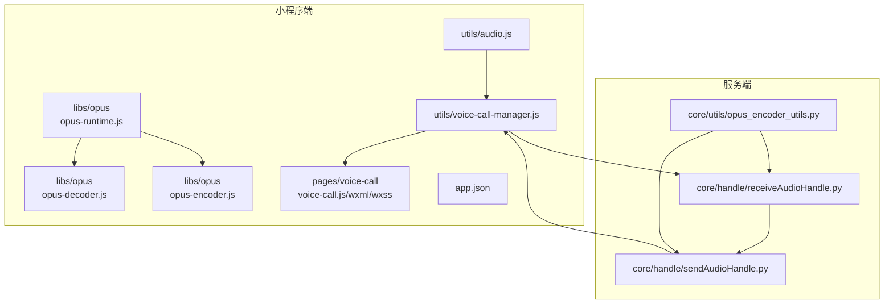
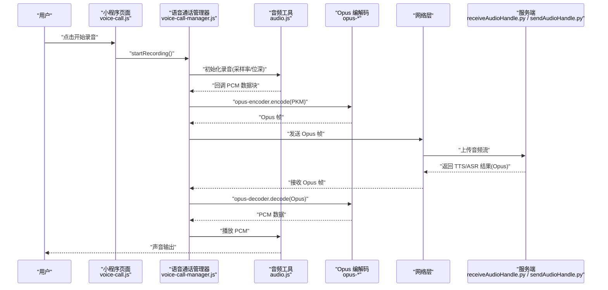
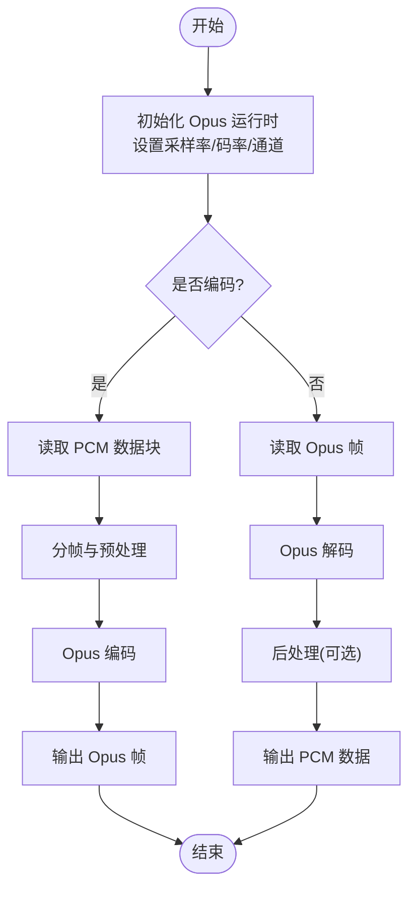
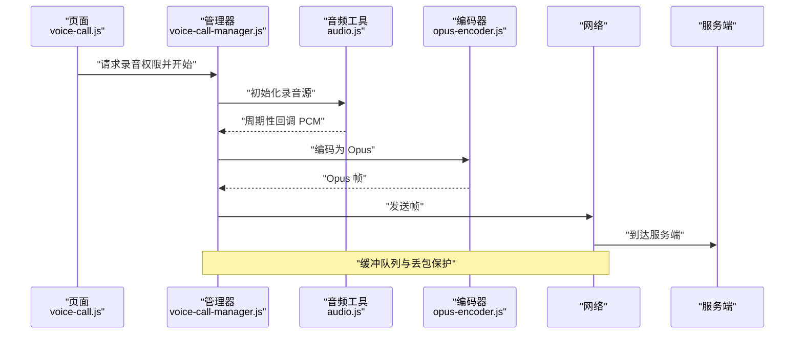
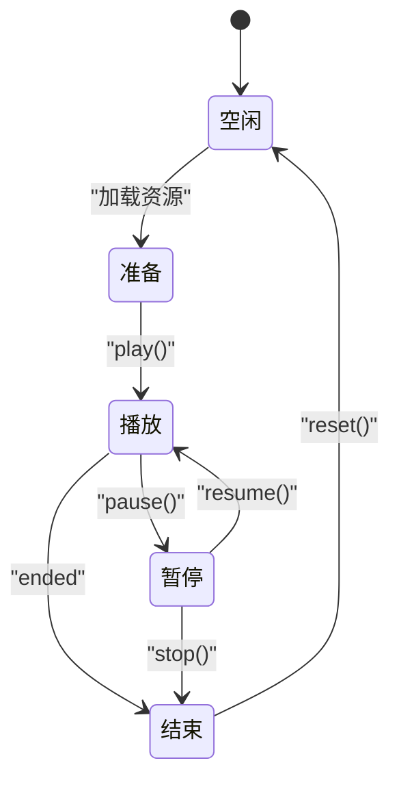
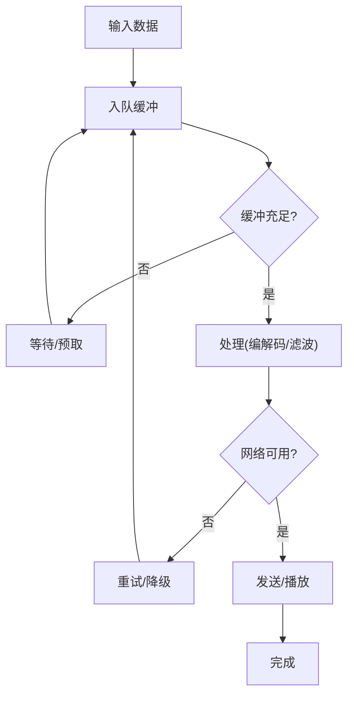
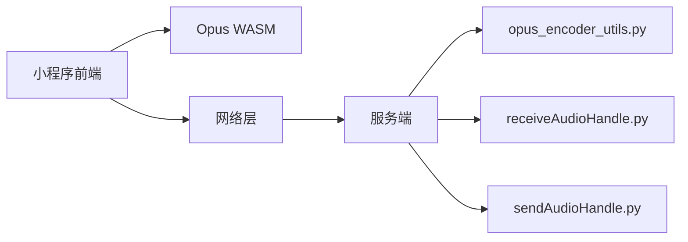

# 音频处理组件

<cite>
**本文引用的文件**   
- [opus-decoder.js](file://main/miniprogram/libs/opus/opus-decoder.js)
- [opus-encoder.js](file://main/miniprogram/libs/opus/opus-encoder.js)
- [opus-runtime.js](file://main/miniprogram/libs/opus/opus-runtime.js)
- [audio.js](file://main/miniprogram/utils/audio.js)
- [voice-call-manager.js](file://main/miniprogram/utils/voice-call-manager.js)
- [voice-call.js](file://main/miniprogram/pages/voice-call/voice-call.js)
- [voice-call.wxml](file://main/miniprogram/pages/voice-call/voice-call.wxml)
- [voice-call.wxss](file://main/miniprogram/pages/voice-call/voice-call.wxss)
- [app.json](file://main/miniprogram/app.json)
- [receiveAudioHandle.py](file://main/xiaozhi-server/core/handle/receiveAudioHandle.py)
- [sendAudioHandle.py](file://main/xiaozhi-server/core/handle/sendAudioHandle.py)
- [opus_encoder_utils.py](file://main/xiaozhi-server/core/utils/opus_encoder_utils.py)
</cite>

## 目录
1. [简介](#简介)
2. [项目结构](#项目结构)
3. [核心组件](#核心组件)
4. [架构总览](#架构总览)
5. [详细组件分析](#详细组件分析)
6. [依赖分析](#依赖分析)
7. [性能考虑](#性能考虑)
8. [故障排查指南](#故障排查指南)
9. [结论](#结论)
10. [附录](#附录)

## 简介
本文件面向“蛋仔小程序”的音频处理组件，系统性梳理 Opus 编解码库在小程序端的集成方案（WebAssembly 加载、音频格式转换与质量配置）、实时录音流程（麦克风权限、音频流采集、降噪策略）、播放器设计模式（播放控制、进度显示、音量调节），以及端到端音频流处理（缓冲区管理、延迟优化、错误恢复）。同时覆盖 MP3、WAV、Opus 等格式的编码/解码支持，并结合服务器端接收与发送音频的处理逻辑，给出语音聊天、音乐播放、音效播放的实现要点与最佳实践。

## 项目结构
本项目包含小程序前端、数字人演示、服务端等多个子系统。与音频处理直接相关的代码主要分布在：
- 小程序端 libs/opus：Opus WebAssembly 运行时与编解码封装
- 小程序端 utils/audio.js：通用音频工具（录音、播放、格式转换）
- 小程序端 utils/voice-call-manager.js：语音通话管理器（状态机、网络收发、缓冲与延迟控制）
- 小程序端 pages/voice-call：语音通话页面（UI 与交互）
- 服务端 core/handle 与 core/utils：音频接收、发送与 Opus 工具

图表来源
- [opus-runtime.js](file://main/miniprogram/libs/opus/opus-runtime.js)
- [opus-decoder.js](file://main/miniprogram/libs/opus/opus-decoder.js)
- [opus-encoder.js](file://main/miniprogram/libs/opus/opus-encoder.js)
- [audio.js](file://main/miniprogram/utils/audio.js)
- [voice-call-manager.js](file://main/miniprogram/utils/voice-call-manager.js)
- [voice-call.js](file://main/miniprogram/pages/voice-call/voice-call.js)
- [voice-call.wxml](file://main/miniprogram/pages/voice-call/voice-call.wxml)
- [voice-call.wxss](file://main/miniprogram/pages/voice-call/voice-call.wxss)
- [receiveAudioHandle.py](file://main/xiaozhi-server/core/handle/receiveAudioHandle.py)
- [sendAudioHandle.py](file://main/xiaozhi-server/core/handle/sendAudioHandle.py)
- [opus_encoder_utils.py](file://main/xiaozhi-server/core/utils/opus_encoder_utils.py)

章节来源
- [app.json](file://main/miniprogram/app.json)

## 核心组件
- Opus WebAssembly 运行时与编解码器
  - opus-runtime.js：负责加载与初始化 Opus WASM，提供统一的 API 入口
  - opus-decoder.js：将 Opus 二进制帧解码为 PCM 数据，供播放器使用
  - opus-encoder.js：将 PCM 数据编码为 Opus 帧，供上传或网络传输
- 音频工具 audio.js
  - 封装录音、播放、格式转换（PCM/WAV/MP3/Opus）、采样率与位深转换、静音检测与降噪预处理
- 语音通话管理器 voice-call-manager.js
  - 管理录音与播放生命周期、网络收发、缓冲队列、延迟补偿、重连与错误恢复
- 语音通话页面 voice-call.*
  - UI 层：按钮、进度条、音量滑块、状态提示；事件绑定与状态同步

章节来源
- [opus-runtime.js](file://main/miniprogram/libs/opus/opus-runtime.js)
- [opus-decoder.js](file://main/miniprogram/libs/opus/opus-decoder.js)
- [opus-encoder.js](file://main/miniprogram/libs/opus/opus-encoder.js)
- [audio.js](file://main/miniprogram/utils/audio.js)
- [voice-call-manager.js](file://main/miniprogram/utils/voice-call-manager.js)
- [voice-call.js](file://main/miniprogram/pages/voice-call/voice-call.js)
- [voice-call.wxml](file://main/miniprogram/pages/voice-call/voice-call.wxml)
- [voice-call.wxss](file://main/miniprogram/pages/voice-call/voice-call.wxss)

## 架构总览
整体采用“前端采集/播放 + 网络传输 + 服务端处理”的分层架构。小程序端通过 MediaRecorder/AudioContext 采集 PCM，经 Opus 编码器压缩后通过网络（WebSocket/HTTP）发送至服务端；服务端进行 ASR/TTS 处理后，将结果以 Opus 帧回传，小程序端解码并播放。

图表来源
- [voice-call.js](file://main/miniprogram/pages/voice-call/voice-call.js)
- [voice-call-manager.js](file://main/miniprogram/utils/voice-call-manager.js)
- [audio.js](file://main/miniprogram/utils/audio.js)
- [opus-encoder.js](file://main/miniprogram/libs/opus/opus-encoder.js)
- [opus-decoder.js](file://main/miniprogram/libs/opus/opus-decoder.js)
- [receiveAudioHandle.py](file://main/xiaozhi-server/core/handle/receiveAudioHandle.py)
- [sendAudioHandle.py](file://main/xiaozhi-server/core/handle/sendAudioHandle.py)

## 详细组件分析

### Opus 编解码库集成（WebAssembly 加载与格式转换）
- 加载与初始化
  - 通过 opus-runtime.js 动态加载 WASM 模块，完成内存分配与函数绑定，确保在小程序环境可用
  - 提供统一接口：设置采样率、码率、通道数、帧长等参数
- 编码流程
  - 输入：PCM 原始数据（通常为 16bit 单声道/双声道）
  - 处理：分帧、预加重、VAD/ANS（可选）、Opus 编码
  - 输出：Opus 二进制帧，适合网络传输与存储
- 解码流程
  - 输入：Opus 二进制帧
  - 处理：解包、解码、后处理（可选）
  - 输出：PCM 数据，交由 AudioContext 播放
- 格式转换
  - 支持 PCM↔WAV、PCM↔MP3（转码）、PCM↔Opus（编解码）
  - 采样率转换与位深对齐，保证播放与编码一致性

图表来源
- [opus-runtime.js](file://main/miniprogram/libs/opus/opus-runtime.js)
- [opus-encoder.js](file://main/miniprogram/libs/opus/opus-encoder.js)
- [opus-decoder.js](file://main/miniprogram/libs/opus/opus-decoder.js)

章节来源
- [opus-runtime.js](file://main/miniprogram/libs/opus/opus-runtime.js)
- [opus-encoder.js](file://main/miniprogram/libs/opus/opus-encoder.js)
- [opus-decoder.js](file://main/miniprogram/libs/opus/opus-decoder.js)

### 实时录音功能（麦克风权限、音频流采集、降噪处理）
- 权限申请
  - 调用小程序麦克风权限 API，失败时引导用户授权
- 音频流采集
  - 使用 MediaRecorder 或 AudioContext.createMediaStreamSource 获取 PCM 数据
  - 合理设置采样率（如 16kHz/48kHz）与帧大小，平衡音质与延迟
- 降噪与增强
  - 在音频工具中实现简单的噪声抑制与增益控制
  - 可选 VAD（语音活动检测）以减少无效数据上传
- 缓冲与丢包
  - 采用环形缓冲与队列管理，避免阻塞主线程
  - 在网络抖动时启用丢包隐藏与插值

图表来源
- [voice-call.js](file://main/miniprogram/pages/voice-call/voice-call.js)
- [voice-call-manager.js](file://main/miniprogram/utils/voice-call-manager.js)
- [audio.js](file://main/miniprogram/utils/audio.js)
- [opus-encoder.js](file://main/miniprogram/libs/opus/opus-encoder.js)

章节来源
- [voice-call-manager.js](file://main/miniprogram/utils/voice-call-manager.js)
- [audio.js](file://main/miniprogram/utils/audio.js)

### 音频播放器设计模式（播放控制、进度显示、音量调节）
- 播放控制
  - 播放/暂停/停止/跳转，基于 AudioContext 或小程序原生播放器
  - 播放状态机：空闲→准备→播放→暂停→结束
- 进度显示
  - 使用定时器或媒体事件驱动更新进度条
  - 支持拖动跳转与缓存进度估算
- 音量调节
  - 全局音量与节点音量分离，避免相互干扰
  - 平滑过渡与防抖处理

章节来源
- [voice-call.js](file://main/miniprogram/pages/voice-call/voice-call.js)
- [voice-call.wxml](file://main/miniprogram/pages/voice-call/voice-call.wxml)
- [voice-call.wxss](file://main/miniprogram/pages/voice-call/voice-call.wxss)

### 音频流处理技术（缓冲区管理、延迟优化、错误恢复）
- 缓冲区管理
  - 使用固定大小的环形缓冲与任务队列，降低 GC 压力
  - 按帧切分与合并，适配网络 MTU 与播放器需求
- 延迟优化
  - 自适应缓冲策略：根据网络 RTT 与抖动动态调整
  - 预缓冲与快速启动，减少首帧等待
- 错误恢复
  - 断线重连与指数退避
  - 丢包隐藏（LPC 插值/重复帧）
  - 降级策略：降低码率或切换至更稳健的编码参数

章节来源
- [voice-call-manager.js](file://main/miniprogram/utils/voice-call-manager.js)
- [audio.js](file://main/miniprogram/utils/audio.js)

### 音频格式支持（MP3、WAV、Opus 编码解码）
- WAV
  - 适用于本地录制与调试，便于查看 PCM 波形
- MP3
  - 用于离线播放与兼容性场景，体积适中
- Opus
  - 低延迟、高压缩比，适合实时语音与弱网环境
- 转换策略
  - 统一内部 PCM 表示，按需转换为目标格式
  - 采样率与位深标准化，避免播放异常

章节来源
- [audio.js](file://main/miniprogram/utils/audio.js)
- [opus-encoder.js](file://main/miniprogram/libs/opus/opus-encoder.js)
- [opus-decoder.js](file://main/miniprogram/libs/opus/opus-decoder.js)

### 音频质量配置、网络传输优化、内存管理策略
- 质量配置
  - 码率（kbps）、帧长（ms）、复杂度、VBR/CBR 选择
  - 采样率（16k/24k/48k）与通道数（单/双声道）
- 网络优化
  - 分包策略与拥塞控制
  - 前向纠错（FEC）与丢包恢复
- 内存管理
  - 对象池复用、零拷贝路径、及时释放临时数组
  - 监控峰值内存与 GC 频率，避免卡顿

章节来源
- [opus-runtime.js](file://main/miniprogram/libs/opus/opus-runtime.js)
- [opus-encoder.js](file://main/miniprogram/libs/opus/opus-encoder.js)
- [opus-decoder.js](file://main/miniprogram/libs/opus/opus-decoder.js)
- [voice-call-manager.js](file://main/miniprogram/utils/voice-call-manager.js)

### 具体功能示例（语音聊天、音乐播放、音效播放）
- 语音聊天
  - 录音→Opus 编码→网络发送→服务端处理→Opus 回传→解码→播放
  - 关键：低延迟、抗抖动、VAD 降噪
- 音乐播放
  - 支持 MP3/WAV/Opus 流式播放，进度与音量控制
  - 关键：缓冲策略、无缝衔接、后台播放
- 音效播放
  - 短音效即时播放，优先使用系统音频通道
  - 关键：低延迟、优先级抢占

章节来源
- [voice-call-manager.js](file://main/miniprogram/utils/voice-call-manager.js)
- [audio.js](file://main/miniprogram/utils/audio.js)

## 依赖分析
- 前端依赖
  - 小程序 API（录音、播放、网络）
  - Opus WASM 运行时与编解码模块
- 后端依赖
  - Python 音频处理库（解码/编码、VAD、ASR/TTS）
  - 网络服务（WebSocket/HTTP）

图表来源
- [opus-runtime.js](file://main/miniprogram/libs/opus/opus-runtime.js)
- [receiveAudioHandle.py](file://main/xiaozhi-server/core/handle/receiveAudioHandle.py)
- [sendAudioHandle.py](file://main/xiaozhi-server/core/handle/sendAudioHandle.py)
- [opus_encoder_utils.py](file://main/xiaozhi-server/core/utils/opus_encoder_utils.py)

章节来源
- [receiveAudioHandle.py](file://main/xiaozhi-server/core/handle/receiveAudioHandle.py)
- [sendAudioHandle.py](file://main/xiaozhi-server/core/handle/sendAudioHandle.py)
- [opus_encoder_utils.py](file://main/xiaozhi-server/core/utils/opus_encoder_utils.py)

## 性能考虑
- 编码/解码
  - 选择合适的帧长与码率，平衡音质与延迟
  - 利用硬件加速（若平台支持）
- 缓冲与调度
  - 小步快跑：频繁小缓冲优于大缓冲
  - 异步处理：避免阻塞渲染线程
- 网络
  - 自适应码率与丢包恢复
  - 连接复用与心跳保活
- 内存
  - 避免频繁创建临时对象
  - 监控内存峰值与 GC 行为

[本节为通用指导，不直接分析具体文件]

## 故障排查指南
- 常见问题
  - 麦克风权限被拒：检查权限申请流程与用户授权
  - 播放无声：确认采样率、位深与通道数一致
  - 卡顿与爆音：检查缓冲大小与网络抖动
  - 编解码失败：核对 Opus 参数与帧边界
- 定位方法
  - 日志记录：关键节点打点（采集、编码、发送、接收、解码、播放）
  - 抓包分析：网络帧结构与时序
  - 回放测试：本地 WAV/Opus 文件验证链路

章节来源
- [voice-call-manager.js](file://main/miniprogram/utils/voice-call-manager.js)
- [audio.js](file://main/miniprogram/utils/audio.js)

## 结论
通过对 Opus 编解码库的集成、实时录音与播放管线的设计、以及端到端音频流的优化，蛋仔小程序实现了低延迟、高可靠的语音交互能力。建议在后续迭代中持续优化缓冲策略、引入更先进的降噪与 VAD 算法，并完善监控与诊断体系，以提升用户体验与稳定性。

[本节为总结性内容，不直接分析具体文件]

## 附录
- 配置建议
  - 语音通话：16kHz/单声道/码率 16-32kbps/VBR
  - 音乐播放：48kHz/立体声/码率 128-256kbps
- 参考实现
  - 语音聊天：参见语音通话管理器与页面逻辑
  - 音乐播放：参见音频工具中的播放与格式转换
  - 音效播放：参见音频工具中的短音效播放路径

[本节为补充信息，不直接分析具体文件]