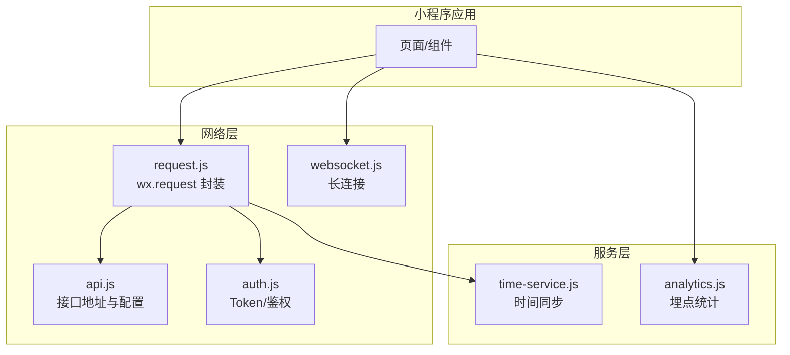
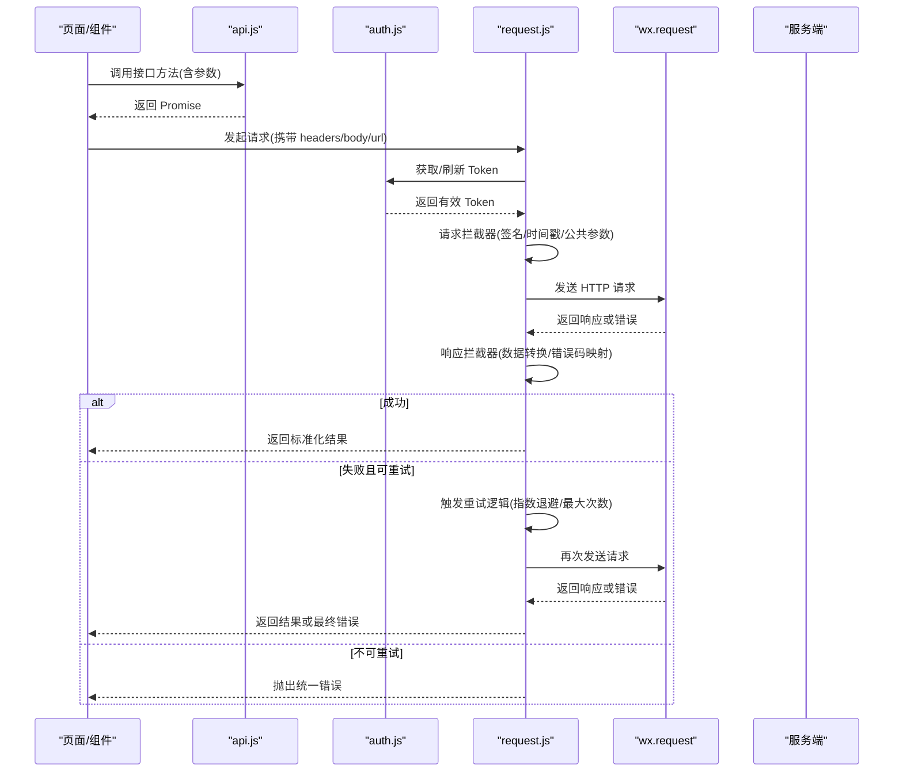
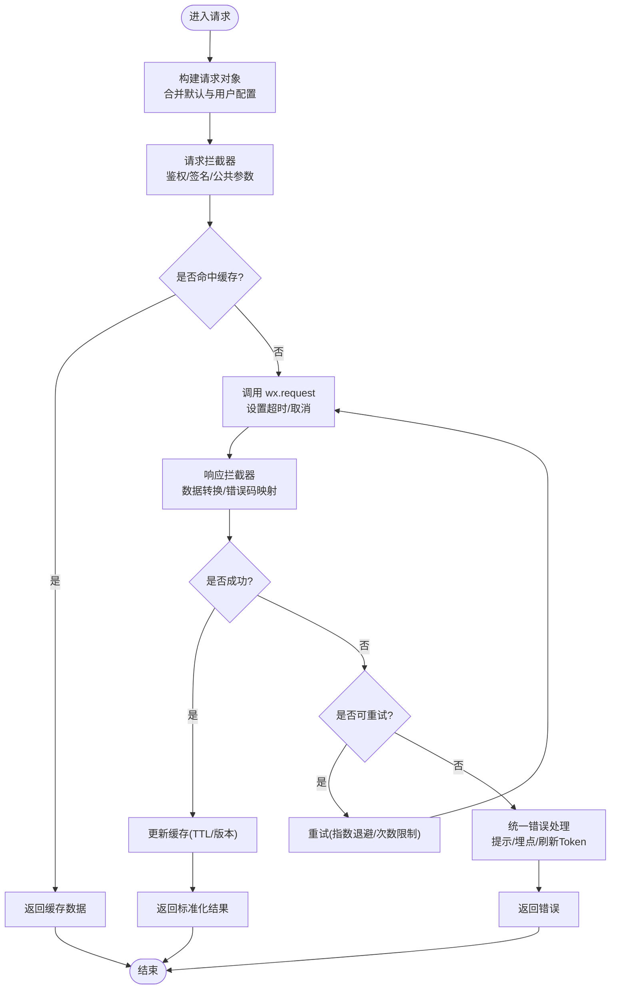
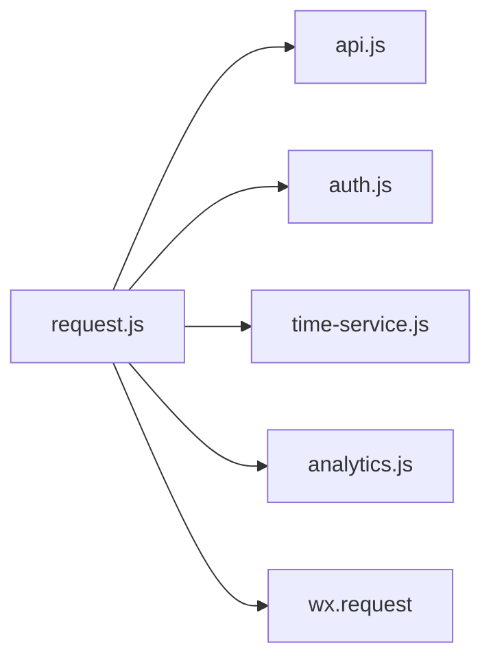

# HTTP 请求封装

<cite>
**本文引用的文件**   
- [request.js](file://main/egg-miniprogram/miniprogram/utils/request.js)
- [api.js](file://main/egg-miniprogram/miniprogram/config/api.js)
- [auth.js](file://main/egg-miniprogram/miniprogram/utils/auth.js)
- [websocket.js](file://main/egg-miniprogram/miniprogram/utils/websocket.js)
- [time-service.js](file://main/egg-miniprogram/miniprogram/services/time-service.js)
- [analytics.js](file://main/egg-miniprogram/miniprogram/services/analytics.js)
</cite>

## 目录
1. [简介](#简介)
2. [项目结构](#项目结构)
3. [核心组件](#核心组件)
4. [架构总览](#架构总览)
5. [详细组件分析](#详细组件分析)
6. [依赖关系分析](#依赖关系分析)
7. [性能考虑](#性能考虑)
8. [故障排查指南](#故障排查指南)
9. [结论](#结论)
10. [附录](#附录)

## 简介
本文件为蛋仔小程序的 HTTP 请求封装系统提供系统化文档，重点围绕 request.js 的实现原理与使用方式展开。内容涵盖：
- wx.request 的统一封装
- 请求拦截器与响应拦截器的设计
- 错误处理机制与统一提示
- API 配置管理（环境变量、接口地址、参数格式化）
- 重试机制、超时处理、取消请求等高级能力
- 统一的加载状态管理与性能优化策略（缓存、并发控制、内存管理）

该文档既适合前端开发者快速上手，也便于维护者深入理解实现细节。

## 项目结构
在 egg-miniprogram 中，HTTP 相关代码主要分布在以下位置：
- utils/request.js：HTTP 请求封装核心
- config/api.js：API 地址与基础配置
- utils/auth.js：鉴权与 Token 管理
- utils/websocket.js：长连接通信（与 HTTP 互补）
- services/time-service.js：时间同步与本地时钟校正
- services/analytics.js：埋点与统计上报

图表来源
- [request.js:1-200](file://main/egg-miniprogram/miniprogram/utils/request.js#L1-L200)
- [api.js:1-200](file://main/egg-miniprogram/miniprogram/config/api.js#L1-L200)
- [auth.js:1-200](file://main/egg-miniprogram/miniprogram/utils/auth.js#L1-L200)
- [websocket.js:1-200](file://main/egg-miniprogram/miniprogram/utils/websocket.js#L1-L200)
- [time-service.js:1-200](file://main/egg-miniprogram/miniprogram/services/time-service.js#L1-L200)
- [analytics.js:1-200](file://main/egg-miniprogram/miniprogram/services/analytics.js#L1-L200)

章节来源
- [request.js:1-200](file://main/egg-miniprogram/miniprogram/utils/request.js#L1-L200)
- [api.js:1-200](file://main/egg-miniprogram/miniprogram/config/api.js#L1-L200)

## 核心组件
- request.js：对 wx.request 进行统一封装，提供请求/响应拦截器、错误处理、重试、超时、取消、缓存、并发控制等能力。
- api.js：集中管理接口路径、基础 URL、环境切换、公共参数注入。
- auth.js：负责登录态、Token 获取与刷新、鉴权失败处理。
- time-service.js：提供时间同步能力，用于服务端时间校验或日志对齐。
- websocket.js：提供 WebSocket 连接管理，与 HTTP 形成互补。
- analytics.js：统一埋点上报，记录请求成功率、耗时、错误码分布等。

章节来源
- [request.js:1-200](file://main/egg-miniprogram/miniprogram/utils/request.js#L1-L200)
- [api.js:1-200](file://main/egg-miniprogram/miniprogram/config/api.js#L1-L200)
- [auth.js:1-200](file://main/egg-miniprogram/miniprogram/utils/auth.js#L1-L200)
- [time-service.js:1-200](file://main/egg-miniprogram/miniprogram/services/time-service.js#L1-L200)
- [websocket.js:1-200](file://main/egg-miniprogram/miniprogram/utils/websocket.js#L1-L200)
- [analytics.js:1-200](file://main/egg-miniprogram/miniprogram/services/analytics.js#L1-L200)

## 架构总览
下图展示了从业务调用到网络请求、再到响应处理的完整链路，以及拦截器、错误处理、重试、缓存、并发控制等关键节点。

图表来源
- [request.js:1-200](file://main/egg-miniprogram/miniprogram/utils/request.js#L1-L200)
- [api.js:1-200](file://main/egg-miniprogram/miniprogram/config/api.js#L1-L200)
- [auth.js:1-200](file://main/egg-miniprogram/miniprogram/utils/auth.js#L1-L200)

## 详细组件分析

### request.js：HTTP 请求封装核心
- 封装目标
  - 统一入口：对外暴露 get/post/put/delete 等方法，内部基于 wx.request。
  - 拦截器：请求前注入公共参数、签名、时间戳；响应后做数据解包、错误码映射、类型转换。
  - 错误处理：区分网络错误、超时、业务错误码，统一提示与埋点。
  - 高级特性：重试、超时、取消、缓存、并发控制、加载状态。
- 关键流程
  - 构建请求对象：合并默认配置与用户配置，规范化 method、url、headers、data。
  - 请求拦截：鉴权、签名、时间戳、公共参数、幂等键生成。
  - 执行请求：调用 wx.request，设置 timeout，支持 AbortController 或自定义取消。
  - 响应拦截：解析 data、code、message，转换为统一结构；根据 code 决定成功/失败分支。
  - 错误处理：网络异常、超时、业务错误码分类处理；必要时触发 Token 刷新与重试。
  - 重试机制：按策略（固定间隔/指数退避）重试，限制最大次数与去重。
  - 缓存策略：GET 请求可按 key 缓存，支持 TTL、失效条件、版本化。
  - 并发控制：限制同时进行的请求数，避免雪崩。
  - 加载状态：统一管理 loading，支持全局与局部开关。
- 数据结构
  - 请求体：包含 url、method、params、data、headers、options（timeout、retry、cache、cancel）。
  - 响应体：包含 code、message、data、timestamp、traceId。
- 复杂度与性能
  - 重试与缓存带来额外计算与内存占用，需合理设置 TTL 与上限。
  - 并发控制通过队列或信号量实现，避免过多并发导致资源竞争。
- 错误处理
  - 网络错误：断网、DNS 失败、SSL 错误等。
  - 超时：超过配置的 timeout 毫秒。
  - 业务错误：后端返回非 0 的 code，结合 message 提示。
  - 鉴权失败：401/Token 过期，自动刷新并重试一次。
- 取消请求
  - 支持通过 cancelToken 或 AbortController 取消未完成的请求，释放资源。
- 示例用法
  - 统一请求封装：调用封装方法传入 url、method、data，返回 Promise。
  - 统一错误处理：在 catch 中统一处理错误提示与埋点。
  - 加载状态管理：在请求前开启 loading，完成后关闭。

图表来源
- [request.js:1-200](file://main/egg-miniprogram/miniprogram/utils/request.js#L1-L200)

章节来源
- [request.js:1-200](file://main/egg-miniprogram/miniprogram/utils/request.js#L1-L200)

### api.js：API 配置管理
- 环境变量与基础 URL
  - 通过环境变量或配置文件切换开发/测试/生产环境的基础 URL。
  - 支持多域名或多端（小程序/H5）差异化配置。
- 接口地址管理
  - 集中定义接口路径，避免硬编码，便于维护与迁移。
  - 支持路径模板与动态参数替换。
- 公共参数注入
  - 自动注入版本号、设备信息、语言、时区、时间戳等公共参数。
  - 支持按需覆盖或扩展。
- 示例用法
  - 在页面或服务中直接调用 api.get('/user/info')，无需关心基础 URL 与公共参数。

章节来源
- [api.js:1-200](file://main/egg-miniprogram/miniprogram/config/api.js#L1-L200)

### auth.js：鉴权与 Token 管理
- Token 获取与刷新
  - 首次登录获取 Token，后续请求自动注入 headers。
  - Token 过期时自动刷新，并重新发起原请求。
- 鉴权失败处理
  - 捕获 401 或特定错误码，清理本地状态并引导重新登录。
- 安全建议
  - 敏感信息加密存储，避免明文保存。
  - 定期轮换 Token，缩短有效期。

章节来源
- [auth.js:1-200](file://main/egg-miniprogram/miniprogram/utils/auth.js#L1-L200)

### time-service.js：时间同步
- 作用
  - 与服务端时间同步，确保客户端时间准确，用于签名、日志、定时任务。
- 实现要点
  - 周期性拉取服务端时间，计算偏移量并校正本地时间。
  - 在网络异常时回退到本地时间，保证可用性。

章节来源
- [time-service.js:1-200](file://main/egg-miniprogram/miniprogram/services/time-service.js#L1-L200)

### websocket.js：长连接通信
- 作用
  - 与 HTTP 互补，提供实时双向通信能力（如聊天、事件推送）。
- 实现要点
  - 连接建立、心跳保活、断线重连、消息队列。
  - 与 HTTP 共享鉴权信息，避免重复登录。

章节来源
- [websocket.js:1-200](file://main/egg-miniprogram/miniprogram/utils/websocket.js#L1-L200)

### analytics.js：埋点与统计
- 作用
  - 统一记录请求成功率、耗时、错误码分布、用户行为等。
- 实现要点
  - 异步上报，避免阻塞主流程。
  - 支持批量上报与降级策略（离线缓存）。

章节来源
- [analytics.js:1-200](file://main/egg-miniprogram/miniprogram/services/analytics.js#L1-L200)

## 依赖关系分析
- request.js 依赖
  - api.js：获取基础 URL 与公共参数。
  - auth.js：获取与刷新 Token。
  - time-service.js：获取当前时间戳或校正时间。
  - analytics.js：上报请求指标。
- 外部依赖
  - wx.request：底层网络请求。
  - 可选：AbortController 或自定义取消令牌。

图表来源
- [request.js:1-200](file://main/egg-miniprogram/miniprogram/utils/request.js#L1-L200)
- [api.js:1-200](file://main/egg-miniprogram/miniprogram/config/api.js#L1-L200)
- [auth.js:1-200](file://main/egg-miniprogram/miniprogram/utils/auth.js#L1-L200)
- [time-service.js:1-200](file://main/egg-miniprogram/miniprogram/services/time-service.js#L1-L200)
- [analytics.js:1-200](file://main/egg-miniprogram/miniprogram/services/analytics.js#L1-L200)

章节来源
- [request.js:1-200](file://main/egg-miniprogram/miniprogram/utils/request.js#L1-L200)
- [api.js:1-200](file://main/egg-miniprogram/miniprogram/config/api.js#L1-L200)
- [auth.js:1-200](file://main/egg-miniprogram/miniprogram/utils/auth.js#L1-L200)
- [time-service.js:1-200](file://main/egg-miniprogram/miniprogram/services/time-service.js#L1-L200)
- [analytics.js:1-200](file://main/egg-miniprogram/miniprogram/services/analytics.js#L1-L200)

## 性能考虑
- 请求缓存
  - 对 GET 请求启用缓存，设置合理的 TTL 与失效条件（如用户操作、版本变更）。
  - 缓存键应包含必要上下文（用户 ID、环境、参数），避免脏读。
- 并发控制
  - 限制同时进行的请求数量，避免资源竞争与服务器压力。
  - 使用队列或信号量实现，支持优先级与取消。
- 内存管理
  - 及时清理取消的请求与缓存项，防止内存泄漏。
  - 大对象序列化与反序列化注意性能开销。
- 重试策略
  - 仅对幂等请求启用重试，避免重复提交。
  - 采用指数退避与抖动，避免雪崩效应。
- 超时与取消
  - 合理设置超时时间，避免长时间占用资源。
  - 支持取消未完成的请求，提升用户体验。

[本节为通用指导，不直接分析具体文件]

## 故障排查指南
- 常见问题
  - 网络错误：检查网络连接、DNS 解析、SSL 证书。
  - 超时：调整 timeout 配置，检查服务端响应时间与负载。
  - 鉴权失败：确认 Token 有效性，检查刷新逻辑与存储。
  - 业务错误：查看后端返回的 code 与 message，定位问题。
- 调试技巧
  - 开启详细日志，记录请求与响应。
  - 使用埋点数据分析错误率与耗时分布。
  - 模拟弱网与高延迟场景，验证重试与超时逻辑。
- 恢复策略
  - 自动重试与降级，保障核心功能可用。
  - 用户友好提示，引导重试或切换网络。

章节来源
- [request.js:1-200](file://main/egg-miniprogram/miniprogram/utils/request.js#L1-L200)
- [analytics.js:1-200](file://main/egg-miniprogram/miniprogram/services/analytics.js#L1-L200)

## 结论
request.js 作为蛋仔小程序的 HTTP 请求封装核心，提供了统一的请求入口、拦截器、错误处理、重试、超时、取消、缓存、并发控制等能力，显著提升了代码的可维护性与用户体验。配合 api.js、auth.js、time-service.js、websocket.js、analytics.js 等模块，形成了完整的网络层解决方案。在实际使用中，建议遵循最佳实践，合理配置参数，持续监控与优化性能。

[本节为总结性内容，不直接分析具体文件]

## 附录
- 示例用法
  - 统一请求封装：调用封装方法传入 url、method、data，返回 Promise。
  - 统一错误处理：在 catch 中统一处理错误提示与埋点。
  - 加载状态管理：在请求前开启 loading，完成后关闭。
- 参考文件
  - [request.js](file://main/egg-miniprogram/miniprogram/utils/request.js)
  - [api.js](file://main/egg-miniprogram/miniprogram/config/api.js)
  - [auth.js](file://main/egg-miniprogram/miniprogram/utils/auth.js)
  - [websocket.js](file://main/egg-miniprogram/miniprogram/utils/websocket.js)
  - [time-service.js](file://main/egg-miniprogram/miniprogram/services/time-service.js)
  - [analytics.js](file://main/egg-miniprogram/miniprogram/services/analytics.js)

[本节为附录内容，不直接分析具体文件]