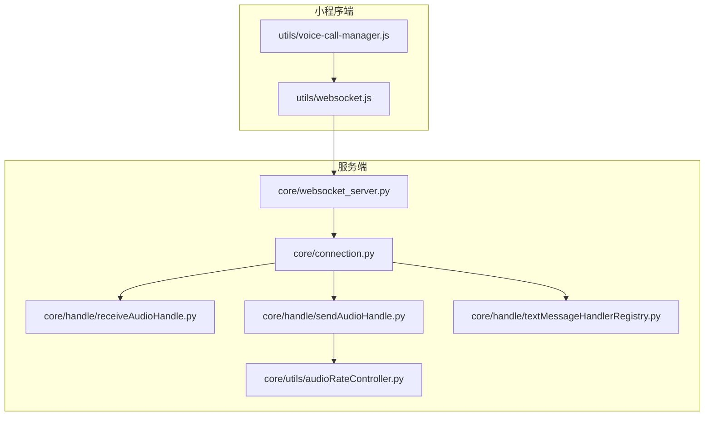
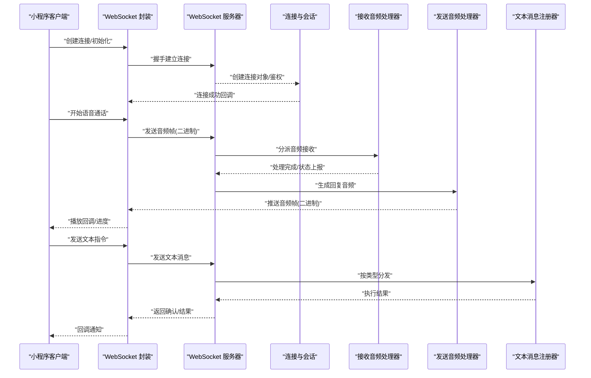
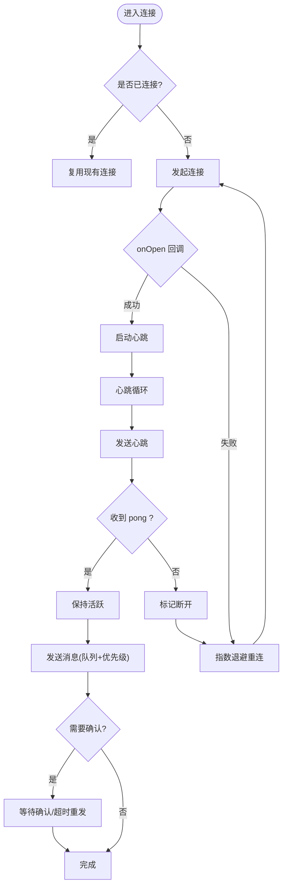
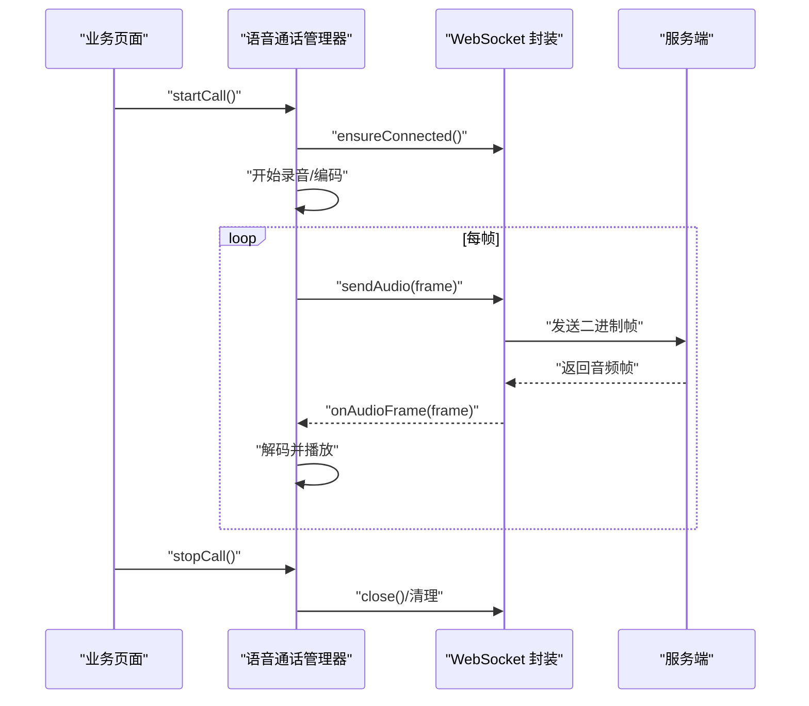
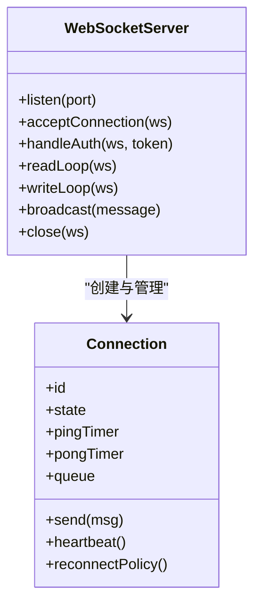
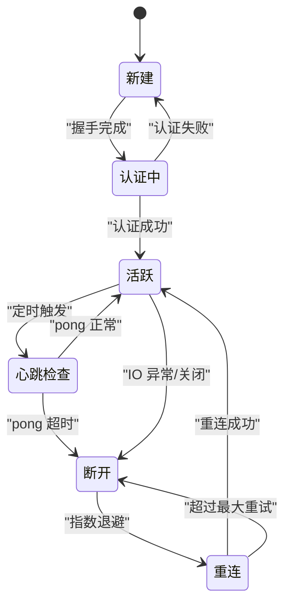
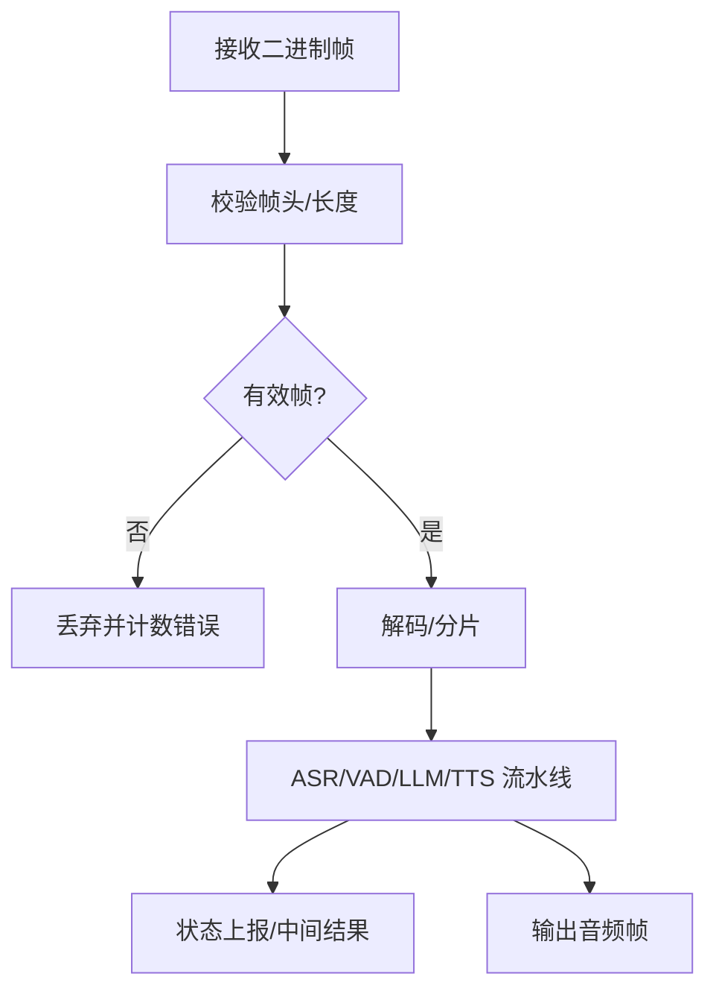
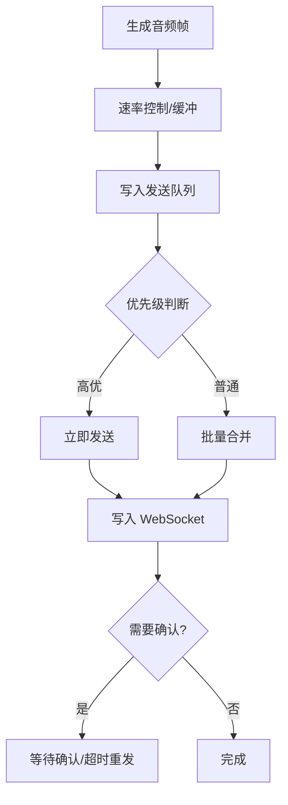
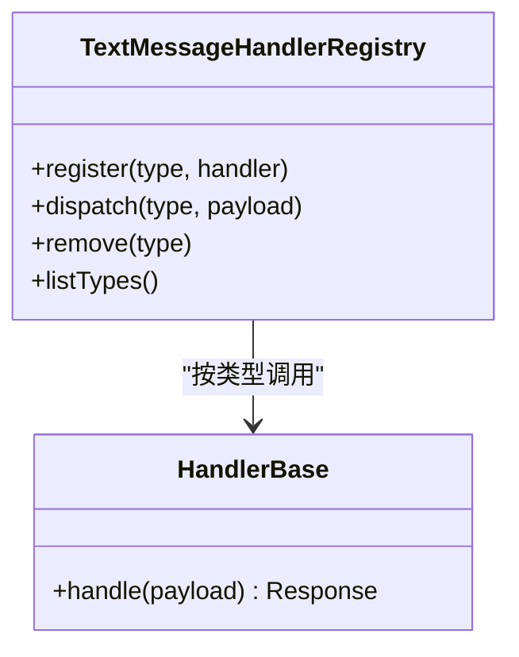
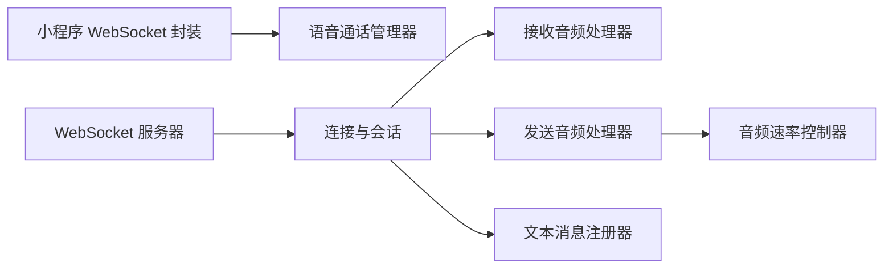

# WebSocket 通信

<cite>
**本文引用的文件**   
- [websocket.js](file://main/egg-miniprogram/miniprogram/utils/websocket.js)
- [voice-call-manager.js](file://main/miniprogram/utils/voice-call-manager.js)
- [websocket_server.py](file://main/xiaozhi-server/core/websocket_server.py)
- [connection.py](file://main/xiaozhi-server/core/connection.py)
- [receiveAudioHandle.py](file://main/xiaozhi-server/core/handle/receiveAudioHandle.py)
- [sendAudioHandle.py](file://main/xiaozhi-server/core/handle/sendAudioHandle.py)
- [textMessageHandlerRegistry.py](file://main/xiaozhi-server/core/handle/textMessageHandlerRegistry.py)
- [audioRateController.py](file://main/xiaozhi-server/core/utils/audioRateController.py)
</cite>

## 目录
1. [简介](#简介)
2. [项目结构](#项目结构)
3. [核心组件](#核心组件)
4. [架构总览](#架构总览)
5. [详细组件分析](#详细组件分析)
6. [依赖关系分析](#依赖关系分析)
7. [性能考量](#性能考量)
8. [故障排查指南](#故障排查指南)
9. [结论](#结论)
10. [附录](#附录)

## 简介
本文件面向“蛋仔小程序”的 WebSocket 实时通信系统，覆盖连接管理（建立、心跳、断线重连、连接池）、消息处理（序列化、事件分发、回调）、连接状态管理（监听、错误恢复、资源清理），以及高级能力（消息队列、优先级、批量发送）。文档同时给出服务端与客户端的关键实现路径与流程图，帮助读者快速定位并理解可靠通信的实现要点。

## 项目结构
本项目包含三端关键代码：
- 小程序端：WebSocket 封装与语音通话管理器
- 服务端：WebSocket 服务、连接与会话、音频收发处理器、文本消息路由
- 工具模块：音频速率控制等

**图表来源** 
- [websocket.js](file://main/egg-miniprogram/miniprogram/utils/websocket.js)
- [voice-call-manager.js](file://main/miniprogram/utils/voice-call-manager.js)
- [websocket_server.py](file://main/xiaozhi-server/core/websocket_server.py)
- [connection.py](file://main/xiaozhi-server/core/connection.py)
- [receiveAudioHandle.py](file://main/xiaozhi-server/core/handle/receiveAudioHandle.py)
- [sendAudioHandle.py](file://main/xiaozhi-server/core/handle/sendAudioHandle.py)
- [textMessageHandlerRegistry.py](file://main/xiaozhi-server/core/handle/textMessageHandlerRegistry.py)
- [audioRateController.py](file://main/xiaozhi-server/core/utils/audioRateController.py)

**章节来源**
- [websocket.js](file://main/egg-miniprogram/miniprogram/utils/websocket.js)
- [voice-call-manager.js](file://main/miniprogram/utils/voice-call-manager.js)
- [websocket_server.py](file://main/xiaozhi-server/core/websocket_server.py)
- [connection.py](file://main/xiaozhi-server/core/connection.py)
- [receiveAudioHandle.py](file://main/xiaozhi-server/core/handle/receiveAudioHandle.py)
- [sendAudioHandle.py](file://main/xiaozhi-server/core/handle/sendAudioHandle.py)
- [textMessageHandlerRegistry.py](file://main/xiaozhi-server/core/handle/textMessageHandlerRegistry.py)
- [audioRateController.py](file://main/xiaozhi-server/core/utils/audioRateController.py)

## 核心组件
- 小程序端 WebSocket 封装：负责连接生命周期、心跳、重连、事件订阅与回调派发。
- 语音通话管理器：协调录音、编码、发送与播放，驱动 WebSocket 上行/下行数据流。
- 服务端 WebSocket 服务器：接受连接、鉴权、会话绑定、读写循环。
- 连接与会话：维护连接状态、消息路由、心跳检测、错误恢复。
- 音频处理器：接收与发送音频帧，进行速率控制与缓冲管理。
- 文本消息注册器：按类型分发文本指令到对应处理器。

**章节来源**
- [websocket.js](file://main/egg-miniprogram/miniprogram/utils/websocket.js)
- [voice-call-manager.js](file://main/miniprogram/utils/voice-call-manager.js)
- [websocket_server.py](file://main/xiaozhi-server/core/websocket_server.py)
- [connection.py](file://main/xiaozhi-server/core/connection.py)
- [receiveAudioHandle.py](file://main/xiaozhi-server/core/handle/receiveAudioHandle.py)
- [sendAudioHandle.py](file://main/xiaozhi-server/core/handle/sendAudioHandle.py)
- [textMessageHandlerRegistry.py](file://main/xiaozhi-server/core/handle/textMessageHandlerRegistry.py)

## 架构总览
下图展示从客户端发起连接到服务端处理音频与文本消息的整体流程。

**图表来源** 
- [websocket.js](file://main/egg-miniprogram/miniprogram/utils/websocket.js)
- [websocket_server.py](file://main/xiaozhi-server/core/websocket_server.py)
- [connection.py](file://main/xiaozhi-server/core/connection.py)
- [receiveAudioHandle.py](file://main/xiaozhi-server/core/handle/receiveAudioHandle.py)
- [sendAudioHandle.py](file://main/xiaozhi-server/core/handle/sendAudioHandle.py)
- [textMessageHandlerRegistry.py](file://main/xiaozhi-server/core/handle/textMessageHandlerRegistry.py)

## 详细组件分析

### 小程序端 WebSocket 封装
职责
- 连接建立与销毁：封装 wx.connectSocket / closeSocket，统一入口。
- 心跳机制：定时 ping/pong，超时判定断线。
- 断线重连：指数退避、最大重试次数、失败回退策略。
- 事件分发：onOpen/onClose/onError/onMessage 统一派发至业务回调。
- 消息队列与优先级：对高优先消息（如控制指令）优先发送，普通消息批量合并。
- 可靠性保障：可选的消息确认与重发、去抖与限流。

关键流程
- 连接建立：握手成功后触发 onOpen，启动心跳定时器。
- 心跳检测：周期性发送心跳；未收到 pong 则标记断开并触发重连。
- 断线重连：根据网络状态与配置进行指数退避重连，直至成功或达到上限。
- 消息发送：先入队，再按优先级与批量化策略发送；支持确认与重发。
- 资源清理：关闭连接、清除定时器与队列、释放回调引用。

**图表来源** 
- [websocket.js](file://main/egg-miniprogram/miniprogram/utils/websocket.js)

**章节来源**
- [websocket.js](file://main/egg-miniprogram/miniprogram/utils/websocket.js)

### 语音通话管理器
职责
- 协调录音与编码：采集音频、编码为 OPUS/PCM，按帧切分。
- 上行发送：通过 WebSocket 发送音频帧，控制发送速率与丢包策略。
- 下行播放：接收音频帧，解码并播放，处理抖动与延迟。
- 状态同步：与 WebSocket 层协同，处理连接异常导致的暂停/恢复。

交互时序

**图表来源** 
- [voice-call-manager.js](file://main/miniprogram/utils/voice-call-manager.js)
- [websocket.js](file://main/egg-miniprogram/miniprogram/utils/websocket.js)

**章节来源**
- [voice-call-manager.js](file://main/miniprogram/utils/voice-call-manager.js)
- [websocket.js](file://main/egg-miniprogram/miniprogram/utils/websocket.js)

### 服务端 WebSocket 服务器
职责
- 监听端口、接受连接、鉴权与会话绑定。
- 读写循环：读取客户端帧，分发给对应处理器；将响应写回客户端。
- 心跳与保活：检测空闲连接，主动下发心跳或关闭超时连接。
- 错误处理：捕获异常、记录日志、触发清理与重连提示。

**图表来源** 
- [websocket_server.py](file://main/xiaozhi-server/core/websocket_server.py)
- [connection.py](file://main/xiaozhi-server/core/connection.py)

**章节来源**
- [websocket_server.py](file://main/xiaozhi-server/core/websocket_server.py)
- [connection.py](file://main/xiaozhi-server/core/connection.py)

### 连接与会话
职责
- 维护连接状态机：新建、认证、活跃、心跳、断开、重连。
- 心跳检测：定时 ping，统计 pong 成功率，阈值触发重连。
- 消息队列：按优先级排序，批量发送，避免拥塞。
- 错误恢复：捕获 IO 异常，指数退避重连，清理资源。

**图表来源** 
- [connection.py](file://main/xiaozhi-server/core/connection.py)

**章节来源**
- [connection.py](file://main/xiaozhi-server/core/connection.py)

### 音频接收处理器
职责
- 解析二进制音频帧，校验长度与格式。
- 送入 ASR/VAD/LLM/TTS 流水线，生成回复。
- 上报中间状态（如识别进度、静音检测）。

**图表来源** 
- [receiveAudioHandle.py](file://main/xiaozhi-server/core/handle/receiveAudioHandle.py)

**章节来源**
- [receiveAudioHandle.py](file://main/xiaozhi-server/core/handle/receiveAudioHandle.py)

### 音频发送处理器
职责
- 组装音频帧，控制发送速率与缓冲。
- 与客户端播放节奏对齐，减少卡顿与延迟。
- 支持批量发送与优先级调度。

**图表来源** 
- [sendAudioHandle.py](file://main/xiaozhi-server/core/handle/sendAudioHandle.py)
- [audioRateController.py](file://main/xiaozhi-server/core/utils/audioRateController.py)

**章节来源**
- [sendAudioHandle.py](file://main/xiaozhi-server/core/handle/sendAudioHandle.py)
- [audioRateController.py](file://main/xiaozhi-server/core/utils/audioRateController.py)

### 文本消息注册器
职责
- 维护消息类型到处理器的映射。
- 按类型路由文本指令，执行后返回结果。
- 支持动态注册与热更新处理器。

**图表来源** 
- [textMessageHandlerRegistry.py](file://main/xiaozhi-server/core/handle/textMessageHandlerRegistry.py)

**章节来源**
- [textMessageHandlerRegistry.py](file://main/xiaozhi-server/core/handle/textMessageHandlerRegistry.py)

## 依赖关系分析
- 小程序端依赖 WebSocket 封装与语音通话管理器，二者解耦便于替换底层实现。
- 服务端 WebSocket 服务器依赖连接与会话模块，音频与文本处理器通过连接对象注入。
- 音频速率控制器被发送处理器使用，确保稳定吞吐。

**图表来源** 
- [websocket.js](file://main/egg-miniprogram/miniprogram/utils/websocket.js)
- [voice-call-manager.js](file://main/miniprogram/utils/voice-call-manager.js)
- [websocket_server.py](file://main/xiaozhi-server/core/websocket_server.py)
- [connection.py](file://main/xiaozhi-server/core/connection.py)
- [receiveAudioHandle.py](file://main/xiaozhi-server/core/handle/receiveAudioHandle.py)
- [sendAudioHandle.py](file://main/xiaozhi-server/core/handle/sendAudioHandle.py)
- [audioRateController.py](file://main/xiaozhi-server/core/utils/audioRateController.py)
- [textMessageHandlerRegistry.py](file://main/xiaozhi-server/core/handle/textMessageHandlerRegistry.py)

**章节来源**
- [websocket.js](file://main/egg-miniprogram/miniprogram/utils/websocket.js)
- [voice-call-manager.js](file://main/miniprogram/utils/voice-call-manager.js)
- [websocket_server.py](file://main/xiaozhi-server/core/websocket_server.py)
- [connection.py](file://main/xiaozhi-server/core/connection.py)
- [receiveAudioHandle.py](file://main/xiaozhi-server/core/handle/receiveAudioHandle.py)
- [sendAudioHandle.py](file://main/xiaozhi-server/core/handle/sendAudioHandle.py)
- [audioRateController.py](file://main/xiaozhi-server/core/utils/audioRateController.py)
- [textMessageHandlerRegistry.py](file://main/xiaozhi-server/core/handle/textMessageHandlerRegistry.py)

## 性能考量
- 连接复用：在小程序端维持单例连接，避免频繁握手开销；服务端复用连接对象，减少上下文切换。
- 消息压缩：对文本消息启用 gzip/deflate（若协议支持），音频帧保持二进制以减少序列化成本。
- 内存优化：限制队列长度与帧大小，及时释放缓冲区；使用对象池复用编码器/解码器实例。
- 速率控制：发送侧基于目标码率与网络状况动态调整帧间隔；接收侧平滑播放，降低抖动。
- 批量发送：合并小消息，减少系统调用与网络包数量。
- 心跳调优：根据网络质量动态调整心跳周期与超时阈值，平衡保活与能耗。

[本节为通用指导，不直接分析具体文件]

## 故障排查指南
常见问题与定位步骤
- 连接无法建立
  - 检查小程序端网络权限与域名白名单。
  - 查看服务端握手与鉴权逻辑，确认 Token 有效性。
- 频繁断线重连
  - 观察心跳成功率与超时设置；检查网络波动与代理行为。
  - 确认服务端空闲连接策略与最大并发限制。
- 音频卡顿或延迟
  - 检查发送速率控制与缓冲策略；核对客户端播放缓冲与解码耗时。
  - 评估服务端流水线耗时（ASR/LLM/TTS）与线程池配置。
- 消息丢失或重复
  - 启用消息确认与重发；检查队列顺序与幂等性设计。
  - 核对服务端广播与点对点路由逻辑。

可参考的实现位置
- 小程序端心跳与重连：见 WebSocket 封装的心跳循环与重连策略。
- 服务端连接状态与错误处理：见连接与会话的状态机与异常捕获。
- 音频处理链路：见接收与发送处理器及速率控制器。

**章节来源**
- [websocket.js](file://main/egg-miniprogram/miniprogram/utils/websocket.js)
- [connection.py](file://main/xiaozhi-server/core/connection.py)
- [receiveAudioHandle.py](file://main/xiaozhi-server/core/handle/receiveAudioHandle.py)
- [sendAudioHandle.py](file://main/xiaozhi-server/core/handle/sendAudioHandle.py)
- [audioRateController.py](file://main/xiaozhi-server/core/utils/audioRateController.py)

## 结论
通过小程序端 WebSocket 封装与服务端连接/处理器协作，实现了稳定的实时通信能力。心跳检测、断线重连、消息队列与优先级、音频速率控制共同保障了低延迟与高可靠。建议在生产环境持续监控连接健康度与端到端时延，结合网络条件动态调参，以获得最佳用户体验。

[本节为总结性内容，不直接分析具体文件]

## 附录
- 示例：可靠的 WebSocket 通信
  - 小程序端：确保连接成功后再发送首帧；心跳失败触发重连；消息确认与超时重发。
  - 服务端：连接状态机明确；心跳超时自动清理；队列满时拒绝或降级。
- 示例：消息确认机制
  - 客户端发送带 ID 的消息，服务端返回 ACK；未收到 ACK 则重发。
- 示例：连接监控
  - 统计连接数、心跳成功率、消息吞吐与延迟；异常告警与自动恢复。

[本节为概念性说明，不直接分析具体文件]