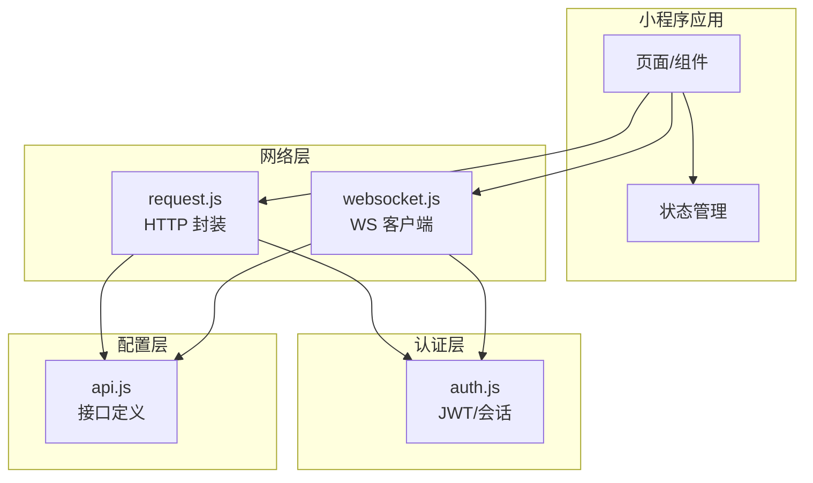
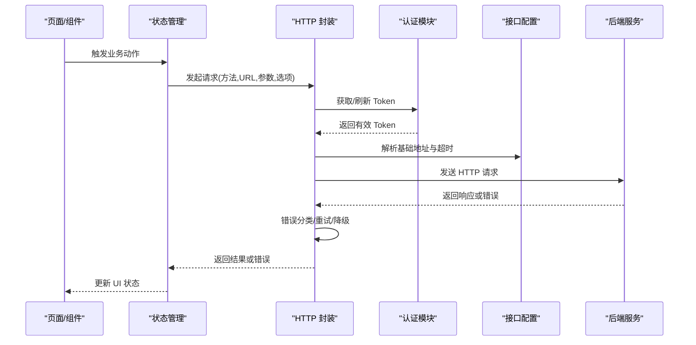
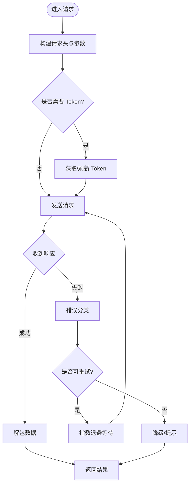
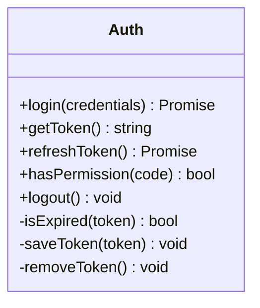
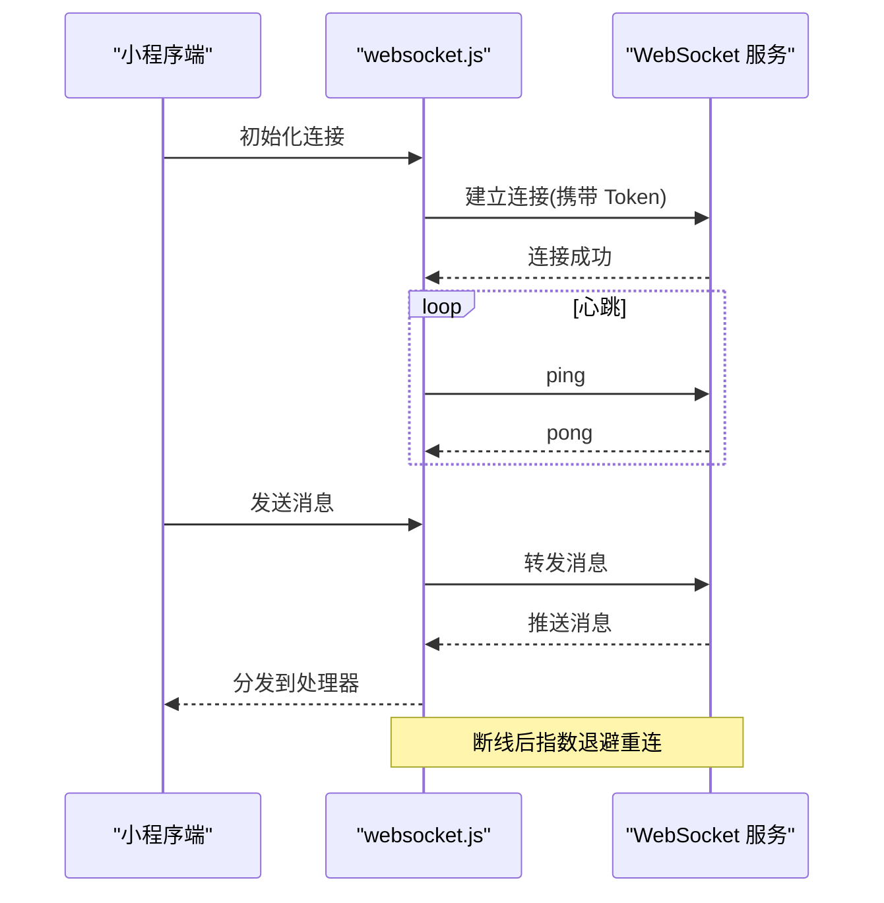
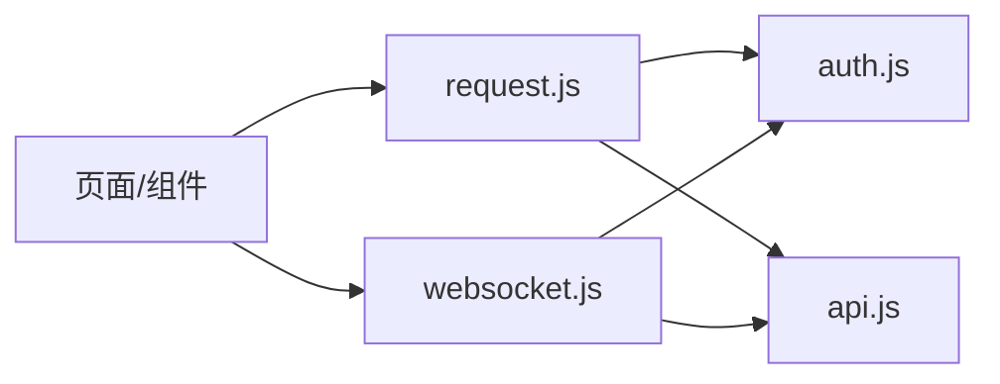

# 数据管理

<cite>
**本文引用的文件**   
- [egg-miniprogram/miniprogram/utils/request.js](file://main/egg-miniprogram/miniprogram/utils/request.js)
- [egg-miniprogram/miniprogram/utils/auth.js](file://main/egg-miniprogram/miniprogram/utils/auth.js)
- [egg-miniprogram/miniprogram/utils/websocket.js](file://main/egg-miniprogram/miniprogram/utils/websocket.js)
- [egg-miniprogram/miniprogram/config/api.js](file://main/egg-miniprogram/miniprogram/config/api.js)
- [miniprogram/utils/request.js](file://main/miniprogram/utils/request.js)
- [miniprogram/utils/auth.js](file://main/miniprogram/utils/auth.js)
- [miniprogram/utils/websocket.js](file://main/miniprogram/utils/websocket.js)
</cite>

## 目录
1. [简介](#简介)
2. [项目结构](#项目结构)
3. [核心组件](#核心组件)
4. [架构总览](#架构总览)
5. [详细组件分析](#详细组件分析)
6. [依赖关系分析](#依赖关系分析)
7. [性能考虑](#性能考虑)
8. [故障排查指南](#故障排查指南)
9. [结论](#结论)
10. [附录](#附录)

## 简介
本文件面向“蛋仔小程序”的数据管理系统，聚焦以下目标：
- HTTP 请求封装：拦截器、错误处理、重试机制
- 认证系统：JWT 令牌管理、权限控制、会话保持
- WebSocket 实时通信：连接管理、消息处理、断线重连
- 本地存储与缓存：策略设计、数据同步方案
- 安全与隐私：数据安全、隐私保护
- 性能优化：网络、渲染、内存与并发控制
- 实战示例：API 封装、状态管理、数据持久化的实现要点

## 项目结构
本项目包含两套小程序代码路径，均提供数据管理能力：
- main/egg-miniprogram/miniprogram：新版蛋仔小程序（推荐）
- main/miniprogram：旧版小程序（兼容维护）

关键目录与职责：
- utils/request.js：HTTP 请求封装（拦截、重试、错误处理）
- utils/auth.js：认证相关（登录、JWT 存取、鉴权）
- utils/websocket.js：WebSocket 客户端（连接、心跳、重连、消息分发）
- config/api.js：接口常量与基础配置（域名、超时、版本等）

图表来源
- [egg-miniprogram/miniprogram/utils/request.js](file://main/egg-miniprogram/miniprogram/utils/request.js)
- [egg-miniprogram/miniprogram/utils/websocket.js](file://main/egg-miniprogram/miniprogram/utils/websocket.js)
- [egg-miniprogram/miniprogram/utils/auth.js](file://main/egg-miniprogram/miniprogram/utils/auth.js)
- [egg-miniprogram/miniprogram/config/api.js](file://main/egg-miniprogram/miniprogram/config/api.js)

章节来源
- [egg-miniprogram/miniprogram/utils/request.js](file://main/egg-miniprogram/miniprogram/utils/request.js)
- [egg-miniprogram/miniprogram/utils/auth.js](file://main/egg-miniprogram/miniprogram/utils/auth.js)
- [egg-miniprogram/miniprogram/utils/websocket.js](file://main/egg-miniprogram/miniprogram/utils/websocket.js)
- [egg-miniprogram/miniprogram/config/api.js](file://main/egg-miniprogram/miniprogram/config/api.js)
- [miniprogram/utils/request.js](file://main/miniprogram/utils/request.js)
- [miniprogram/utils/auth.js](file://main/miniprogram/utils/auth.js)
- [miniprogram/utils/websocket.js](file://main/miniprogram/utils/websocket.js)

## 核心组件
- HTTP 请求封装（request.js）
  - 功能：统一发起请求、自动附加 Token、错误码归一化、失败重试、超时控制、日志埋点
  - 关键点：请求/响应拦截、幂等性判断、退避重试、降级策略
- 认证模块（auth.js）
  - 功能：登录流程、Token 获取与刷新、权限校验、会话保持、过期检测
  - 关键点：Token 存储位置、刷新时机、静默刷新、登出清理
- WebSocket 客户端（websocket.js）
  - 功能：长连接建立、心跳保活、消息路由、断线重连、队列缓冲
  - 关键点：指数退避重连、消息去重、背压控制、异常恢复
- 接口配置（api.js）
  - 功能：基础 URL、版本前缀、超时、重试次数、环境切换
  - 关键点：多环境隔离、灰度开关、敏感信息脱敏

章节来源
- [egg-miniprogram/miniprogram/utils/request.js](file://main/egg-miniprogram/miniprogram/utils/request.js)
- [egg-miniprogram/miniprogram/utils/auth.js](file://main/egg-miniprogram/miniprogram/utils/auth.js)
- [egg-miniprogram/miniprogram/utils/websocket.js](file://main/egg-miniprogram/miniprogram/utils/websocket.js)
- [egg-miniprogram/miniprogram/config/api.js](file://main/egg-miniprogram/miniprogram/config/api.js)
- [miniprogram/utils/request.js](file://main/miniprogram/utils/request.js)
- [miniprogram/utils/auth.js](file://main/miniprogram/utils/auth.js)
- [miniprogram/utils/websocket.js](file://main/miniprogram/utils/websocket.js)

## 架构总览
整体数据流遵循“页面/组件 → 状态管理 → 网络层 → 服务端”的分层模型。认证贯穿 HTTP 与 WebSocket；请求封装负责错误与重试；WebSocket 负责实时数据通道。

图表来源
- [egg-miniprogram/miniprogram/utils/request.js](file://main/egg-miniprogram/miniprogram/utils/request.js)
- [egg-miniprogram/miniprogram/utils/auth.js](file://main/egg-miniprogram/miniprogram/utils/auth.js)
- [egg-miniprogram/miniprogram/config/api.js](file://main/egg-miniprogram/miniprogram/config/api.js)

章节来源
- [egg-miniprogram/miniprogram/utils/request.js](file://main/egg-miniprogram/miniprogram/utils/request.js)
- [egg-miniprogram/miniprogram/utils/auth.js](file://main/egg-miniprogram/miniprogram/utils/auth.js)
- [egg-miniprogram/miniprogram/config/api.js](file://main/egg-miniprogram/miniprogram/config/api.js)

## 详细组件分析

### HTTP 请求封装（request.js）
- 设计要点
  - 请求拦截：统一注入 Authorization、TraceId、时间戳、签名等头
  - 响应拦截：统一解包 data/error、状态码映射、错误提示
  - 重试机制：对可重试错误（网络抖动、限流）进行指数退避重试
  - 超时与取消：支持请求超时、页面销毁时取消未决请求
  - 幂等与缓存：GET 幂等、可选本地缓存与 ETag 协商
- 错误处理
  - 网络错误：DNS/连接/超时/中断
  - 业务错误：4xx/5xx、业务码非 0、字段校验失败
  - 降级策略：离线模式、默认值、友好提示
- 性能优化
  - 请求合并与节流
  - 批量接口聚合
  - 压缩与分页加载

图表来源
- [egg-miniprogram/miniprogram/utils/request.js](file://main/egg-miniprogram/miniprogram/utils/request.js)
- [miniprogram/utils/request.js](file://main/miniprogram/utils/request.js)

章节来源
- [egg-miniprogram/miniprogram/utils/request.js](file://main/egg-miniprogram/miniprogram/utils/request.js)
- [miniprogram/utils/request.js](file://main/miniprogram/utils/request.js)

### 认证系统（auth.js）
- 设计要点
  - 登录流程：调用登录接口获取 Token，设置有效期与刷新策略
  - Token 管理：安全存储、过期检测、静默刷新、失效清理
  - 权限控制：角色/能力位校验、路由守卫、接口级鉴权
  - 会话保持：跨页签/生命周期内保持、后台存活策略
- 安全建议
  - 避免明文存储敏感信息
  - 限制 Token 作用域与生存期
  - 防重放与签名校验

图表来源
- [egg-miniprogram/miniprogram/utils/auth.js](file://main/egg-miniprogram/miniprogram/utils/auth.js)
- [miniprogram/utils/auth.js](file://main/miniprogram/utils/auth.js)

章节来源
- [egg-miniprogram/miniprogram/utils/auth.js](file://main/egg-miniprogram/miniprogram/utils/auth.js)
- [miniprogram/utils/auth.js](file://main/miniprogram/utils/auth.js)

### WebSocket 实时通信（websocket.js）
- 设计要点
  - 连接管理：单例连接、多实例隔离、连接池
  - 心跳保活：定时 ping/pong、超时判定
  - 消息处理：按类型路由、去重、顺序保证
  - 断线重连：指数退避、最大重试次数、优雅恢复
  - 背压与队列：消息积压保护、丢弃策略
- 错误恢复
  - 网络异常自动恢复
  - 服务端主动断开时的友好提示
  - 关键消息确认与重发

图表来源
- [egg-miniprogram/miniprogram/utils/websocket.js](file://main/egg-miniprogram/miniprogram/utils/websocket.js)
- [miniprogram/utils/websocket.js](file://main/miniprogram/utils/websocket.js)

章节来源
- [egg-miniprogram/miniprogram/utils/websocket.js](file://main/egg-miniprogram/miniprogram/utils/websocket.js)
- [miniprogram/utils/websocket.js](file://main/miniprogram/utils/websocket.js)

### 接口配置（api.js）
- 内容说明
  - 基础域名与环境变量
  - 接口版本前缀与路径模板
  - 默认超时、重试次数、是否启用缓存
  - 灰度/开关配置
- 使用建议
  - 通过环境变量区分开发/测试/生产
  - 敏感配置不入库，运行时注入
  - 接口变更需保留向后兼容

章节来源
- [egg-miniprogram/miniprogram/config/api.js](file://main/egg-miniprogram/miniprogram/config/api.js)

## 依赖关系分析
- 组件耦合
  - request.js 依赖 auth.js 获取 Token，依赖 api.js 获取基础配置
  - websocket.js 依赖 auth.js 完成鉴权握手
  - 页面/组件仅依赖抽象接口，降低耦合
- 外部依赖
  - 微信原生网络与 WebSocket API
  - 可选：加密库、日志上报、埋点 SDK

图表来源
- [egg-miniprogram/miniprogram/utils/request.js](file://main/egg-miniprogram/miniprogram/utils/request.js)
- [egg-miniprogram/miniprogram/utils/websocket.js](file://main/egg-miniprogram/miniprogram/utils/websocket.js)
- [egg-miniprogram/miniprogram/utils/auth.js](file://main/egg-miniprogram/miniprogram/utils/auth.js)
- [egg-miniprogram/miniprogram/config/api.js](file://main/egg-miniprogram/miniprogram/config/api.js)

章节来源
- [egg-miniprogram/miniprogram/utils/request.js](file://main/egg-miniprogram/miniprogram/utils/request.js)
- [egg-miniprogram/miniprogram/utils/websocket.js](file://main/egg-miniprogram/miniprogram/utils/websocket.js)
- [egg-miniprogram/miniprogram/utils/auth.js](file://main/egg-miniprogram/miniprogram/utils/auth.js)
- [egg-miniprogram/miniprogram/config/api.js](file://main/egg-miniprogram/miniprogram/config/api.js)

## 性能考虑
- 网络层
  - 合理设置超时与重试上限，避免雪崩
  - 请求合并与节流，减少重复请求
  - 分页与懒加载，降低首屏压力
- 缓存策略
  - 热点数据短期缓存，配合版本号与失效策略
  - 强一致场景禁用缓存或使用 ETag
- 渲染与内存
  - 列表虚拟化、按需渲染
  - 及时释放事件监听与定时器
- 实时通信
  - 心跳间隔与超时阈值调优
  - 消息队列长度限制与丢弃策略

## 故障排查指南
- 常见问题定位
  - 401/403：检查 Token 有效性、权限配置、刷新逻辑
  - 5xx：查看服务端日志、限流与熔断策略
  - 网络错误：检查 DNS、代理、证书与弱网环境
  - WebSocket 频繁断线：检查心跳、服务端负载、防火墙策略
- 调试手段
  - 开启详细日志与 TraceId 追踪
  - 抓包工具验证请求/响应体
  - 模拟弱网与高延迟场景
- 恢复策略
  - 用户侧提示与重试入口
  - 降级页面与默认数据
  - 关键操作二次确认与幂等保障

章节来源
- [egg-miniprogram/miniprogram/utils/request.js](file://main/egg-miniprogram/miniprogram/utils/request.js)
- [egg-miniprogram/miniprogram/utils/websocket.js](file://main/egg-miniprogram/miniprogram/utils/websocket.js)
- [egg-miniprogram/miniprogram/utils/auth.js](file://main/egg-miniprogram/miniprogram/utils/auth.js)

## 结论
通过统一的 HTTP 封装、健壮的认证体系与可靠的 WebSocket 客户端，蛋仔小程序实现了稳定高效的数据管理与实时通信。结合合理的缓存与本地存储策略，可在保证一致性的同时提升用户体验。建议在后续迭代中持续完善监控、埋点与自动化测试，进一步提升系统的可观测性与稳定性。

## 附录
- 最佳实践清单
  - 所有网络请求走统一封装，禁止直接调用底层 API
  - Token 最小权限原则与短时效策略
  - 关键接口增加幂等与重试保护
  - 实时消息具备去重与顺序保证
  - 敏感数据本地不落盘或加密存储
- 参考实现路径
  - HTTP 封装：[egg-miniprogram/miniprogram/utils/request.js](file://main/egg-miniprogram/miniprogram/utils/request.js)、[miniprogram/utils/request.js](file://main/miniprogram/utils/request.js)
  - 认证模块：[egg-miniprogram/miniprogram/utils/auth.js](file://main/egg-miniprogram/miniprogram/utils/auth.js)、[miniprogram/utils/auth.js](file://main/miniprogram/utils/auth.js)
  - WebSocket 客户端：[egg-miniprogram/miniprogram/utils/websocket.js](file://main/egg-miniprogram/miniprogram/utils/websocket.js)、[miniprogram/utils/websocket.js](file://main/miniprogram/utils/websocket.js)
  - 接口配置：[egg-miniprogram/miniprogram/config/api.js](file://main/egg-miniprogram/miniprogram/config/api.js)