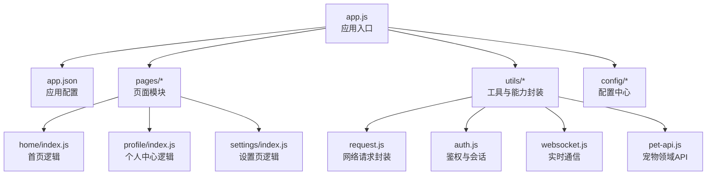
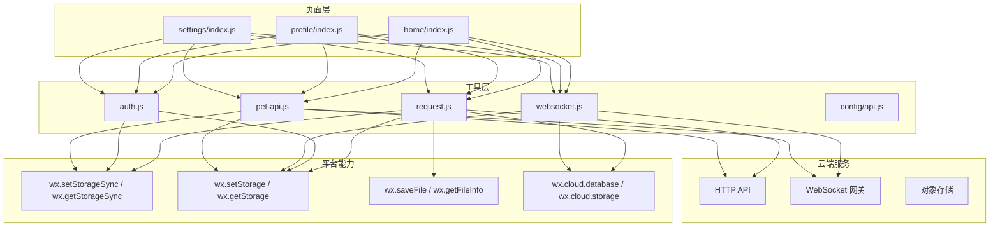
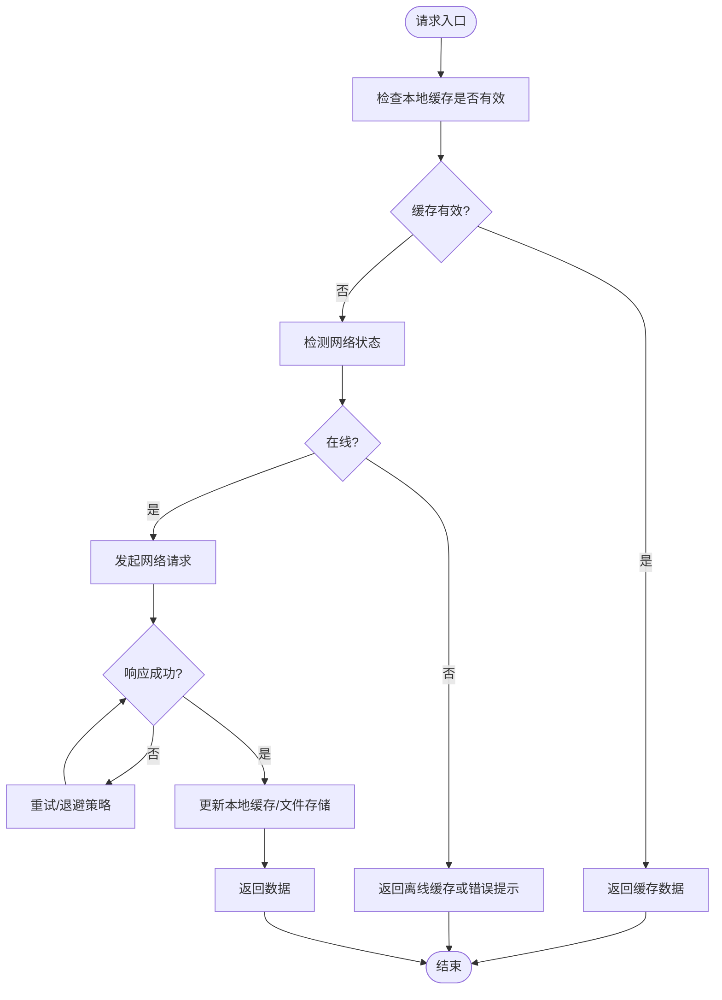
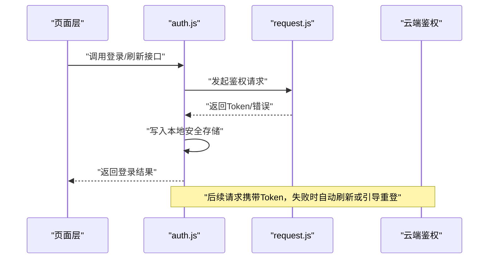
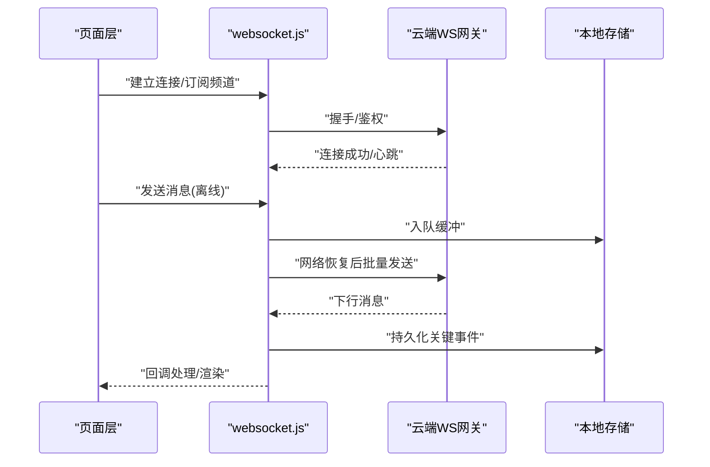
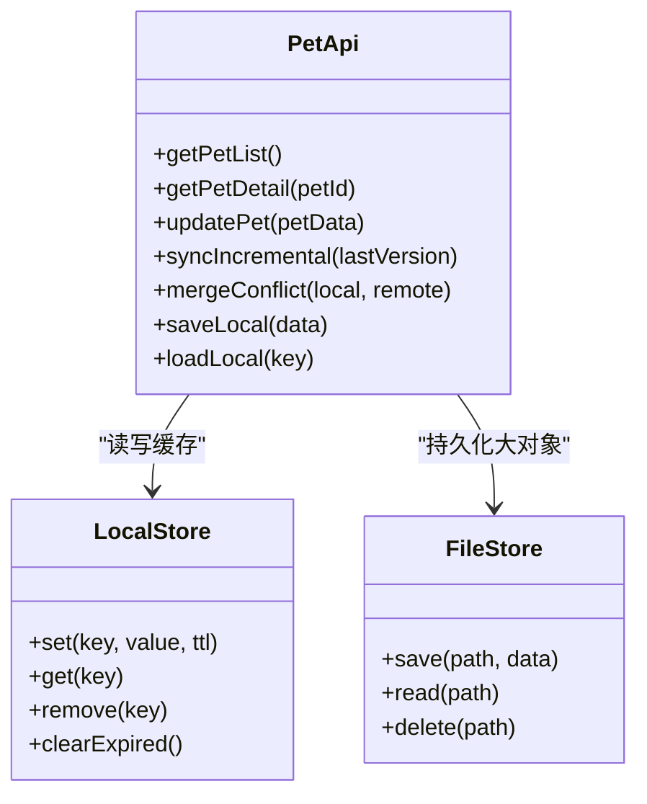
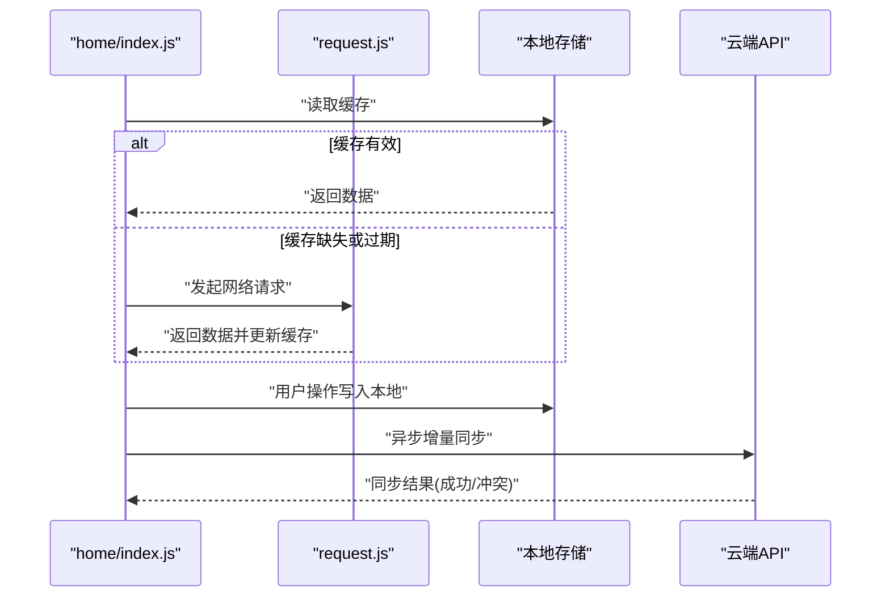
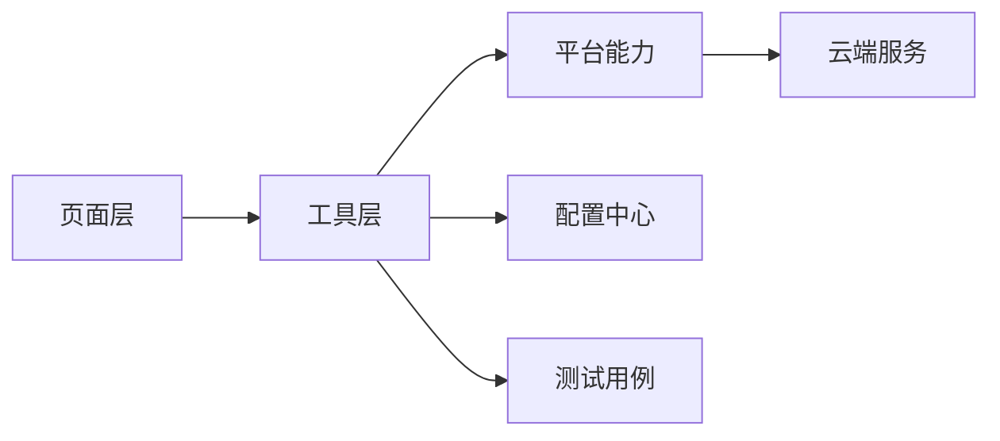

# 本地存储

<cite>
**本文引用的文件**   
- [egg-miniprogram/README.md](file://main/egg-miniprogram/README.md)
- [egg-miniprogram/app.json](file://main/egg-miniprogram/miniprogram/app.json)
- [egg-miniprogram/app.js](file://main/egg-miniprogram/miniprogram/app.js)
- [egg-miniprogram/utils/request.js](file://main/egg-miniprogram/miniprogram/utils/request.js)
- [egg-miniprogram/utils/auth.js](file://main/egg-miniprogram/miniprogram/utils/auth.js)
- [egg-miniprogram/utils/websocket.js](file://main/egg-miniprogram/miniprogram/utils/websocket.js)
- [egg-miniprogram/utils/pet-api.js](file://main/egg-miniprogram/miniprogram/utils/pet-api.js)
- [egg-miniprogram/utils/pet-store-actions.test.js](file://main/egg-miniprogram/miniprogram/utils/pet-store-actions.test.js)
- [egg-miniprogram/utils/pet-store.test.js](file://main/egg-miniprogram/miniprogram/utils/pet-store.test.js)
- [egg-miniprogram/pages/home/index.js](file://main/egg-miniprogram/miniprogram/pages/home/index.js)
- [egg-miniprogram/pages/profile/index.js](file://main/egg-miniprogram/miniprogram/pages/profile/index.js)
- [egg-miniprogram/pages/settings/index.js](file://main/egg-miniprogram/miniprogram/pages/settings/index.js)
- [egg-miniprogram/config/api.js](file://main/egg-miniprogram/miniprogram/config/api.js)
</cite>

## 目录
1. [简介](#简介)
2. [项目结构](#项目结构)
3. [核心组件](#核心组件)
4. [架构总览](#架构总览)
5. [详细组件分析](#详细组件分析)
6. [依赖分析](#依赖分析)
7. [性能考虑](#性能考虑)
8. [故障排查指南](#故障排查指南)
9. [结论](#结论)
10. [附录](#附录)

## 简介
本文件为蛋仔小程序的本地存储系统提供系统化文档，覆盖数据持久化策略（本地缓存、数据库、文件存储）、数据存储结构（用户数据、宠物数据、配置信息）、数据同步机制（本地与云端同步、冲突解决、增量更新）、数据迁移与版本管理、备份恢复、离线支持、数据安全与隐私保护以及存储空间优化。内容基于仓库中 egg-miniprogram 子项目的实际代码结构与实现进行归纳与说明，帮助开发者快速理解并扩展本地存储能力。

## 项目结构
egg-miniprogram 采用微信小程序标准工程结构，关键目录与职责如下：
- miniprogram/app.js：应用入口，负责全局初始化、生命周期与基础状态装配。
- miniprogram/app.json：应用配置，包含页面路由、窗口样式、分包等。
- miniprogram/pages/*：各业务页面，承载具体交互与页面级状态。
- miniprogram/utils/*：通用工具与能力封装，包括网络请求、鉴权、WebSocket、宠物相关 API 与测试用例。
- miniprogram/config/*：配置项集中管理，如 API 端点、常量等。

图表来源
- [egg-miniprogram/app.js](file://main/egg-miniprogram/miniprogram/app.js)
- [egg-miniprogram/app.json](file://main/egg-miniprogram/miniprogram/app.json)
- [egg-miniprogram/utils/request.js](file://main/egg-miniprogram/miniprogram/utils/request.js)
- [egg-miniprogram/utils/auth.js](file://main/egg-miniprogram/miniprogram/utils/auth.js)
- [egg-miniprogram/utils/websocket.js](file://main/egg-miniprogram/miniprogram/utils/websocket.js)
- [egg-miniprogram/utils/pet-api.js](file://main/egg-miniprogram/miniprogram/utils/pet-api.js)
- [egg-miniprogram/pages/home/index.js](file://main/egg-miniprogram/miniprogram/pages/home/index.js)
- [egg-miniprogram/pages/profile/index.js](file://main/egg-miniprogram/miniprogram/pages/profile/index.js)
- [egg-miniprogram/pages/settings/index.js](file://main/egg-miniprogram/miniprogram/pages/settings/index.js)

章节来源
- [egg-miniprogram/README.md](file://main/egg-miniprogram/README.md)
- [egg-miniprogram/app.json](file://main/egg-miniprogram/miniprogram/app.json)
- [egg-miniprogram/app.js](file://main/egg-miniprogram/miniprogram/app.js)

## 核心组件
围绕本地存储与数据流的关键组件包括：
- 网络请求封装（request.js）：统一 HTTP 请求、错误处理、重试与缓存策略入口。
- 鉴权与会话（auth.js）：登录态、Token 管理、会话过期处理与本地安全存储。
- WebSocket 通信（websocket.js）：长连接建立、心跳、断线重连、消息队列与离线缓冲。
- 宠物领域 API（pet-api.js）：宠物数据的增删改查、增量更新与冲突合并接口。
- 页面层（home/profile/settings）：页面级状态与本地缓存读写、UI 渲染与用户操作触发。
- 配置中心（config/api.js）：API 地址、功能开关、版本信息等集中管理。

章节来源
- [egg-miniprogram/utils/request.js](file://main/egg-miniprogram/miniprogram/utils/request.js)
- [egg-miniprogram/utils/auth.js](file://main/egg-miniprogram/miniprogram/utils/auth.js)
- [egg-miniprogram/utils/websocket.js](file://main/egg-miniprogram/miniprogram/utils/websocket.js)
- [egg-miniprogram/utils/pet-api.js](file://main/egg-miniprogram/miniprogram/utils/pet-api.js)
- [egg-miniprogram/pages/home/index.js](file://main/egg-miniprogram/miniprogram/pages/home/index.js)
- [egg-miniprogram/pages/profile/index.js](file://main/egg-miniprogram/miniprogram/pages/profile/index.js)
- [egg-miniprogram/pages/settings/index.js](file://main/egg-miniprogram/miniprogram/pages/settings/index.js)
- [egg-miniprogram/config/api.js](file://main/egg-miniprogram/miniprogram/config/api.js)

## 架构总览
本地存储与数据流的整体架构遵循“页面层 → 工具层 → 平台能力”的分层设计，结合云端服务实现一致性与可用性保障。

图表来源
- [egg-miniprogram/pages/home/index.js](file://main/egg-miniprogram/miniprogram/pages/home/index.js)
- [egg-miniprogram/pages/profile/index.js](file://main/egg-miniprogram/miniprogram/pages/profile/index.js)
- [egg-miniprogram/pages/settings/index.js](file://main/egg-miniprogram/miniprogram/pages/settings/index.js)
- [egg-miniprogram/utils/request.js](file://main/egg-miniprogram/miniprogram/utils/request.js)
- [egg-miniprogram/utils/auth.js](file://main/egg-miniprogram/miniprogram/utils/auth.js)
- [egg-miniprogram/utils/websocket.js](file://main/egg-miniprogram/miniprogram/utils/websocket.js)
- [egg-miniprogram/utils/pet-api.js](file://main/egg-miniprogram/miniprogram/utils/pet-api.js)
- [egg-miniprogram/config/api.js](file://main/egg-miniprogram/miniprogram/config/api.js)

## 详细组件分析

### 网络请求封装（request.js）
- 职责：统一发起 HTTP 请求、处理响应与错误、封装缓存键与过期策略、重试与退避。
- 本地缓存策略：对只读或低频变更的数据使用 wx.setStorageSync/wx.getStorageSync 做短期缓存；对大体积资源使用 wx.saveFile 持久化到文件系统。
- 离线支持：当网络不可用时返回缓存结果或提示离线模式；对写操作入队延迟执行。
- 一致性保证：通过 ETag/Last-Modified 或版本号字段判断缓存有效性；必要时强制刷新。

图表来源
- [egg-miniprogram/utils/request.js](file://main/egg-miniprogram/miniprogram/utils/request.js)

章节来源
- [egg-miniprogram/utils/request.js](file://main/egg-miniprogram/miniprogram/utils/request.js)

### 鉴权与会话（auth.js）
- 职责：登录流程、Token 获取与刷新、会话过期处理、敏感信息本地安全存储。
- 本地存储：使用 wx.setStorageSync 保存 Token 与用户基本信息；必要时使用加密存储或签名校验。
- 失效处理：拦截器检测 401/403，自动刷新 Token 或引导重新登录；清理无效缓存。
- 安全建议：避免明文存储敏感信息，限制缓存时间，定期清理过期数据。

图表来源
- [egg-miniprogram/utils/auth.js](file://main/egg-miniprogram/miniprogram/utils/auth.js)
- [egg-miniprogram/utils/request.js](file://main/egg-miniprogram/miniprogram/utils/request.js)

章节来源
- [egg-miniprogram/utils/auth.js](file://main/egg-miniprogram/miniprogram/utils/auth.js)

### WebSocket 通信（websocket.js）
- 职责：建立长连接、心跳保活、断线重连、消息队列与离线缓冲。
- 本地缓冲：在断网时将上行消息入队，网络恢复后批量发送；下行消息按序处理并落盘。
- 一致性：对关键事件采用幂等处理与去重；服务端确认机制确保可靠投递。
- 资源优化：控制消息大小与频率，避免频繁重建连接。

图表来源
- [egg-miniprogram/utils/websocket.js](file://main/egg-miniprogram/miniprogram/utils/websocket.js)

章节来源
- [egg-miniprogram/utils/websocket.js](file://main/egg-miniprogram/miniprogram/utils/websocket.js)

### 宠物领域 API（pet-api.js）
- 职责：宠物数据的增删改查、增量更新、冲突合并、版本控制。
- 本地结构：用户数据、宠物数据、配置信息以 JSON 形式存储在本地缓存或文件中；关键字段包含版本号、时间戳、哈希校验。
- 同步策略：拉取差异数据（增量），合并冲突（以时间戳或版本号为准），回滚失败操作。
- 测试支撑：提供 pet-store.test.js 与 pet-store-actions.test.js 验证读写与合并逻辑。

图表来源
- [egg-miniprogram/utils/pet-api.js](file://main/egg-miniprogram/miniprogram/utils/pet-api.js)
- [egg-miniprogram/utils/pet-store.test.js](file://main/egg-miniprogram/miniprogram/utils/pet-store.test.js)
- [egg-miniprogram/utils/pet-store-actions.test.js](file://main/egg-miniprogram/miniprogram/utils/pet-store-actions.test.js)

章节来源
- [egg-miniprogram/utils/pet-api.js](file://main/egg-miniprogram/miniprogram/utils/pet-api.js)
- [egg-miniprogram/utils/pet-store.test.js](file://main/egg-miniprogram/miniprogram/utils/pet-store.test.js)
- [egg-miniprogram/utils/pet-store-actions.test.js](file://main/egg-miniprogram/miniprogram/utils/pet-store-actions.test.js)

### 页面层与本地缓存
- home/index.js：加载首页数据，优先读取本地缓存，网络失败时降级显示；用户操作触发本地更新与异步同步。
- profile/index.js：用户资料编辑，本地即时生效，后台增量同步；冲突时提示用户选择保留策略。
- settings/index.js：设置项本地持久化，支持热更新与恢复默认值；敏感设置加密存储。

图表来源
- [egg-miniprogram/pages/home/index.js](file://main/egg-miniprogram/miniprogram/pages/home/index.js)
- [egg-miniprogram/utils/request.js](file://main/egg-miniprogram/miniprogram/utils/request.js)

章节来源
- [egg-miniprogram/pages/home/index.js](file://main/egg-miniprogram/miniprogram/pages/home/index.js)
- [egg-miniprogram/pages/profile/index.js](file://main/egg-miniprogram/miniprogram/pages/profile/index.js)
- [egg-miniprogram/pages/settings/index.js](file://main/egg-miniprogram/miniprogram/pages/settings/index.js)

## 依赖分析
- 页面层依赖工具层提供的 request、auth、websocket、pet-api 等能力。
- 工具层依赖微信小程序平台能力（本地缓存、文件存储、云开发）。
- 配置中心统一管理 API 端点与功能开关，降低耦合度。
- 测试用例覆盖核心路径，保障数据一致性与稳定性。

图表来源
- [egg-miniprogram/pages/home/index.js](file://main/egg-miniprogram/miniprogram/pages/home/index.js)
- [egg-miniprogram/utils/request.js](file://main/egg-miniprogram/miniprogram/utils/request.js)
- [egg-miniprogram/utils/auth.js](file://main/egg-miniprogram/miniprogram/utils/auth.js)
- [egg-miniprogram/utils/websocket.js](file://main/egg-miniprogram/miniprogram/utils/websocket.js)
- [egg-miniprogram/utils/pet-api.js](file://main/egg-miniprogram/miniprogram/utils/pet-api.js)
- [egg-miniprogram/config/api.js](file://main/egg-miniprogram/miniprogram/config/api.js)

章节来源
- [egg-miniprogram/config/api.js](file://main/egg-miniprogram/miniprogram/config/api.js)

## 性能考虑
- 缓存策略：区分冷热数据，热点数据使用内存缓存，冷数据使用文件存储；合理设置 TTL 与容量上限。
- 请求优化：合并请求、分页加载、按需拉取；使用 ETag/Last-Modified 减少带宽。
- WebSocket：控制心跳间隔与消息批处理，避免频繁重建连接。
- 存储优化：压缩大对象、定期清理过期数据、分库分表式键命名空间。
- 离线体验：预加载关键资源，离线队列限流与重试退避。

## 故障排查指南
- 网络异常：检查 request.js 的错误码与重试策略，确认缓存是否被正确回退。
- 鉴权失败：查看 auth.js 的 Token 刷新逻辑与本地存储是否被清理。
- WebSocket 断连：检查 websocket.js 的心跳与重连机制，确认消息队列是否堆积。
- 数据不一致：对比本地版本号与云端，定位冲突合并逻辑；使用测试用例复现问题。
- 存储空间不足：监控文件存储与缓存大小，实施清理策略与用户提示。

章节来源
- [egg-miniprogram/utils/request.js](file://main/egg-miniprogram/miniprogram/utils/request.js)
- [egg-miniprogram/utils/auth.js](file://main/egg-miniprogram/miniprogram/utils/auth.js)
- [egg-miniprogram/utils/websocket.js](file://main/egg-miniprogram/miniprogram/utils/websocket.js)
- [egg-miniprogram/utils/pet-api.js](file://main/egg-miniprogram/miniprogram/utils/pet-api.js)

## 结论
蛋仔小程序的本地存储系统以分层架构为基础，结合网络请求封装、鉴权与会话管理、WebSocket 通信与宠物领域 API，实现了可靠的本地缓存、离线支持与数据一致性保障。通过合理的缓存策略、增量同步与冲突合并机制，系统在用户体验与数据可靠性之间取得平衡。未来可进一步引入更细粒度的权限控制、更强的加密与审计能力，以及更智能的存储优化策略。

## 附录
- 数据模型建议：用户数据、宠物数据、配置信息应包含 id、version、timestamp、hash 等元数据，便于版本管理与冲突检测。
- 备份恢复：定期导出本地数据至云端或外部存储；恢复时进行完整性校验与冲突合并。
- 安全与隐私：最小化敏感信息存储，启用传输加密与本地加密；遵循平台隐私政策与合规要求。
- 版本管理：通过 config/api.js 管理功能开关与 API 版本，配合客户端灰度发布与回滚策略。