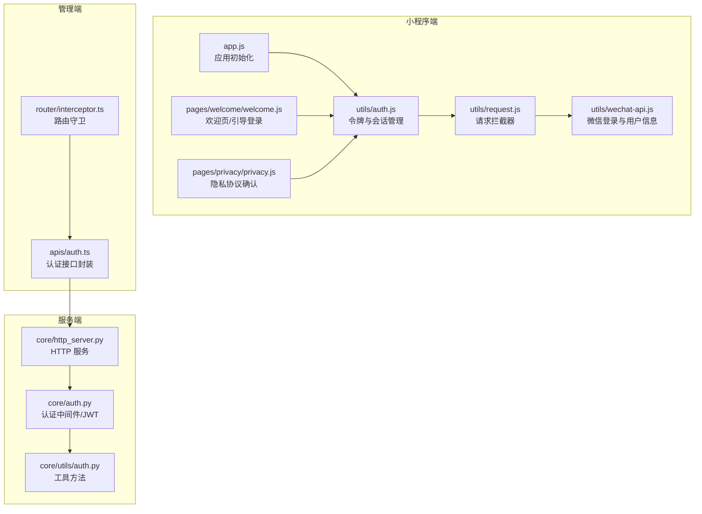
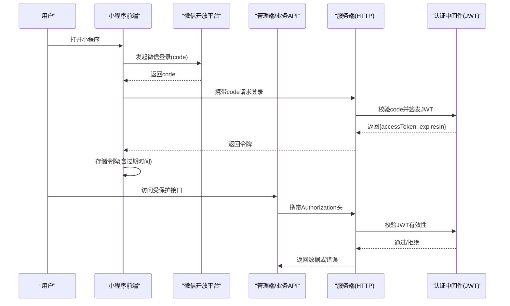
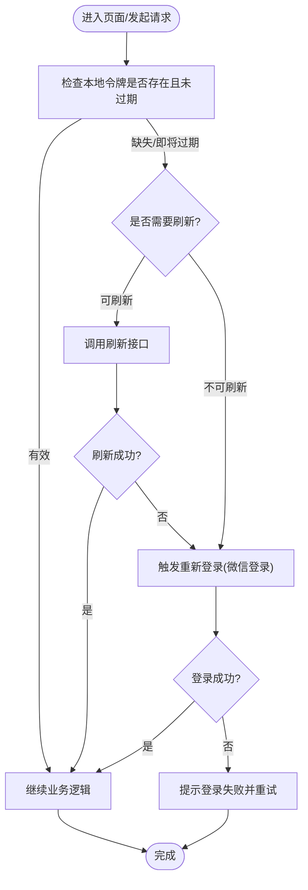
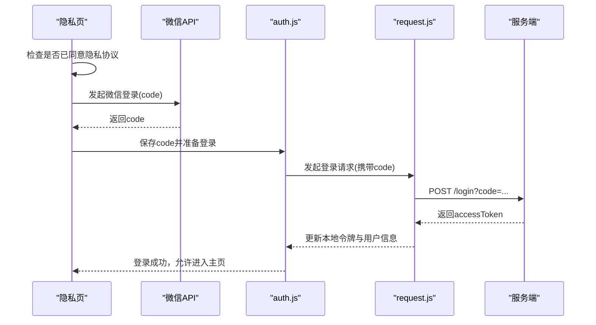
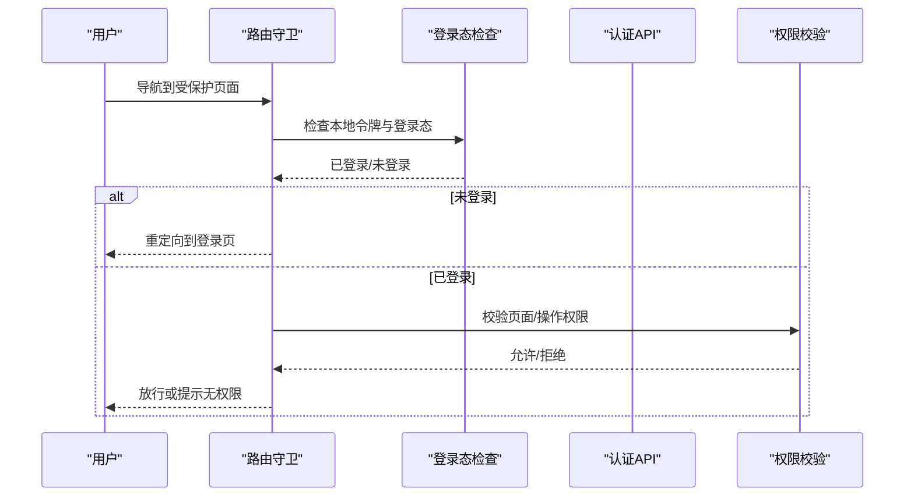
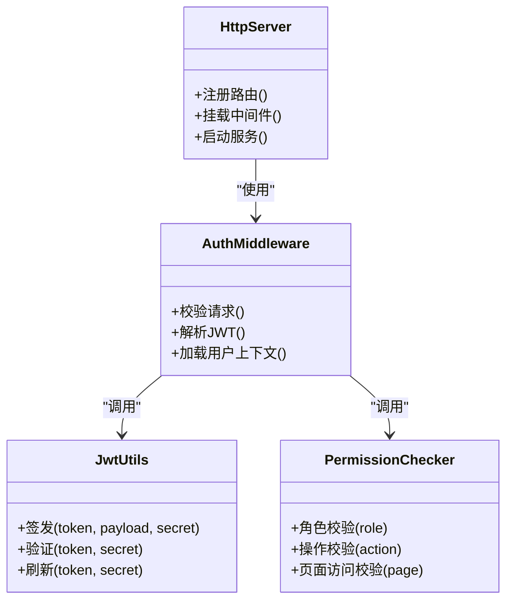
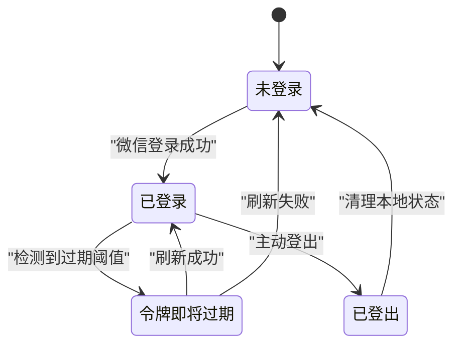
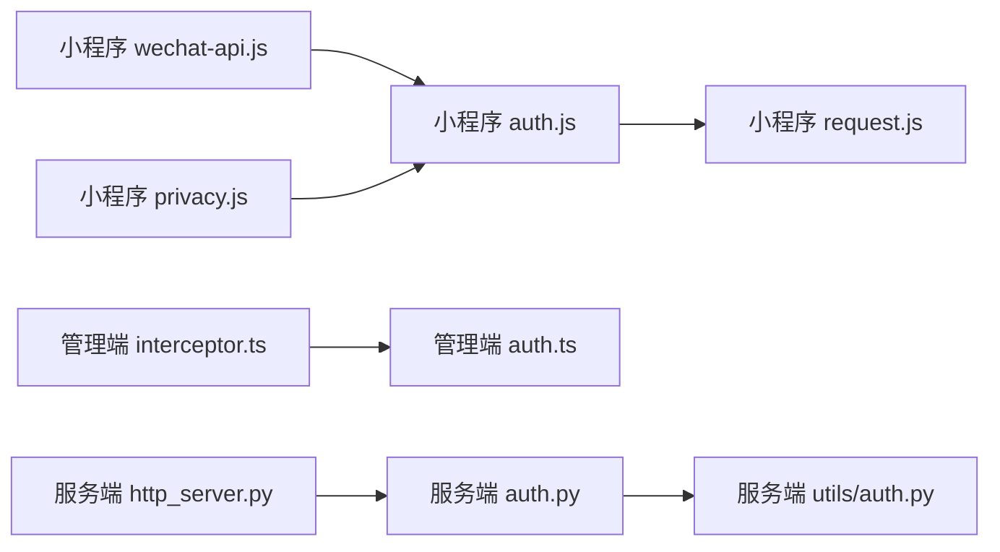

# 认证系统

<cite>
**本文引用的文件**   
- [egg-miniprogram/utils/auth.js](file://main/egg-miniprogram/miniprogram/utils/auth.js)
- [egg-miniprogram/utils/wechat-api.js](file://main/egg-miniprogram/miniprogram/utils/wechat-api.js)
- [egg-miniprogram/utils/request.js](file://main/egg-miniprogram/miniprogram/utils/request.js)
- [egg-miniprogram/app.js](file://main/egg-miniprogram/miniprogram/app.js)
- [egg-miniprogram/pages/welcome/welcome.js](file://main/egg-miniprogram/miniprogram/pages/welcome/welcome.js)
- [egg-miniprogram/pages/privacy/privacy.js](file://main/egg-miniprogram/miniprogram/pages/privacy/privacy.js)
- [manager-web/src/apis/auth.ts](file://main/manager-mobile/src/api/auth.ts)
- [manager-web/src/router/interceptor.ts](file://main/manager-mobile/src/router/interceptor.ts)
- [xiaozhi-server/core/auth.py](file://main/xiaozhi-server/core/auth.py)
- [xiaozhi-server/core/utils/auth.py](file://main/xiaozhi-server/core/utils/auth.py)
- [xiaozhi-server/core/http_server.py](file://main/xiaozhi-server/core/http_server.py)
</cite>

## 目录
1. [简介](#简介)
2. [项目结构](#项目结构)
3. [核心组件](#核心组件)
4. [架构总览](#架构总览)
5. [详细组件分析](#详细组件分析)
6. [依赖分析](#依赖分析)
7. [性能考虑](#性能考虑)
8. [故障排查指南](#故障排查指南)
9. [结论](#结论)
10. [附录](#附录)

## 简介
本文件面向“蛋仔小程序”的认证与授权体系，系统性阐述 JWT 令牌生命周期（获取、存储、刷新、失效）、用户会话管理（登录状态保持、自动登录、登出处理）、权限控制（角色权限、操作权限、页面访问控制），以及微信授权流程、用户信息获取与隐私协议处理。文档同时给出前后端关键实现路径与流程图示，帮助开发者快速定位并完善相关能力。

## 项目结构
围绕认证与授权，本项目涉及以下关键模块：
- 小程序前端（egg-miniprogram）：负责微信登录、JWT 获取与存储、请求拦截、页面级鉴权、隐私协议校验。
- 管理端（manager-mobile/web）：统一鉴权拦截器、路由守卫、API 调用封装。
- 服务端（xiaozhi-server）：HTTP 服务入口、认证中间件、JWT 签发与校验、会话与权限数据源对接。

**图表来源** 
- [egg-miniprogram/app.js](file://main/egg-miniprogram/miniprogram/app.js)
- [egg-miniprogram/utils/auth.js](file://main/egg-miniprogram/miniprogram/utils/auth.js)
- [egg-miniprogram/utils/request.js](file://main/egg-miniprogram/miniprogram/utils/request.js)
- [egg-miniprogram/pages/welcome/welcome.js](file://main/egg-miniprogram/miniprogram/pages/welcome/welcome.js)
- [egg-miniprogram/pages/privacy/privacy.js](file://main/egg-miniprogram/miniprogram/pages/privacy/privacy.js)
- [egg-miniprogram/utils/wechat-api.js](file://main/egg-miniprogram/miniprogram/utils/wechat-api.js)
- [manager-mobile/src/router/interceptor.ts](file://main/manager-mobile/src/router/interceptor.ts)
- [manager-mobile/src/api/auth.ts](file://main/manager-mobile/src/api/auth.ts)
- [xiaozhi-server/core/http_server.py](file://main/xiaozhi-server/core/http_server.py)
- [xiaozhi-server/core/auth.py](file://main/xiaozhi-server/core/auth.py)
- [xiaozhi-server/core/utils/auth.py](file://main/xiaozhi-server/core/utils/auth.py)

**章节来源**
- [egg-miniprogram/app.js](file://main/egg-miniprogram/miniprogram/app.js)
- [egg-miniprogram/utils/auth.js](file://main/egg-miniprogram/miniprogram/utils/auth.js)
- [egg-miniprogram/utils/request.js](file://main/egg-miniprogram/miniprogram/utils/request.js)
- [manager-mobile/src/router/interceptor.ts](file://main/manager-mobile/src/router/interceptor.ts)
- [manager-mobile/src/api/auth.ts](file://main/manager-mobile/src/api/auth.ts)
- [xiaozhi-server/core/http_server.py](file://main/xiaozhi-server/core/http_server.py)
- [xiaozhi-server/core/auth.py](file://main/xiaozhi-server/core/auth.py)
- [xiaozhi-server/core/utils/auth.py](file://main/xiaozhi-server/core/utils/auth.py)

## 核心组件
- 令牌与会话管理（小程序端）
  - 职责：生成/解析 JWT、本地持久化、过期检测、自动刷新、登出清理。
  - 关键文件：[egg-miniprogram/utils/auth.js](file://main/egg-miniprogram/miniprogram/utils/auth.js)
- 微信授权与用户信息
  - 职责：调用微信登录、换取 code、拉取用户信息、隐私协议前置校验。
  - 关键文件：[egg-miniprogram/utils/wechat-api.js](file://main/egg-miniprogram/miniprogram/utils/wechat-api.js)、[egg-miniprogram/pages/privacy/privacy.js](file://main/egg-miniprogram/miniprogram/pages/privacy/privacy.js)
- 请求拦截与令牌注入
  - 职责：统一在请求头注入 Authorization、处理 401/403 跳转、刷新重试。
  - 关键文件：[egg-miniprogram/utils/request.js](file://main/egg-miniprogram/miniprogram/utils/request.js)
- 管理端鉴权拦截
  - 职责：路由守卫检查登录态、未登录重定向、权限不足提示。
  - 关键文件：[manager-mobile/src/router/interceptor.ts](file://main/manager-mobile/src/router/interceptor.ts)、[manager-mobile/src/api/auth.ts](file://main/manager-mobile/src/api/auth.ts)
- 服务端认证与权限
  - 职责：JWT 签发与校验、中间件鉴权、角色/权限校验、敏感参数保护。
  - 关键文件：[xiaozhi-server/core/auth.py](file://main/xiaozhi-server/core/auth.py)、[xiaozhi-server/core/utils/auth.py](file://main/xiaozhi-server/core/utils/auth.py)、[xiaozhi-server/core/http_server.py](file://main/xiaozhi-server/core/http_server.py)

**章节来源**
- [egg-miniprogram/utils/auth.js](file://main/egg-miniprogram/miniprogram/utils/auth.js)
- [egg-miniprogram/utils/wechat-api.js](file://main/egg-miniprogram/miniprogram/utils/wechat-api.js)
- [egg-miniprogram/utils/request.js](file://main/egg-miniprogram/miniprogram/utils/request.js)
- [manager-mobile/src/router/interceptor.ts](file://main/manager-mobile/src/router/interceptor.ts)
- [manager-mobile/src/api/auth.ts](file://main/manager-mobile/src/api/auth.ts)
- [xiaozhi-server/core/auth.py](file://main/xiaozhi-server/core/auth.py)
- [xiaozhi-server/core/utils/auth.py](file://main/xiaozhi-server/core/utils/auth.py)
- [xiaozhi-server/core/http_server.py](file://main/xiaozhi-server/core/http_server.py)

## 架构总览
整体认证链路涵盖“小程序微信登录 → 后端签发 JWT → 前端存储与注入 → 受保护资源访问 → 权限校验”。

**图表来源** 
- [egg-miniprogram/utils/wechat-api.js](file://main/egg-miniprogram/miniprogram/utils/wechat-api.js)
- [egg-miniprogram/utils/request.js](file://main/egg-miniprogram/miniprogram/utils/request.js)
- [xiaozhi-server/core/http_server.py](file://main/xiaozhi-server/core/http_server.py)
- [xiaozhi-server/core/auth.py](file://main/xiaozhi-server/core/auth.py)

## 详细组件分析

### 小程序端：JWT 令牌管理与会话
- 令牌获取与存储
  - 登录成功后将 accessToken、expiresIn 等写入本地存储，并记录登录时间戳。
  - 参考实现路径：[egg-miniprogram/utils/auth.js](file://main/egg-miniprogram/miniprogram/utils/auth.js)
- 过期检测与自动刷新
  - 每次请求前检查令牌是否即将过期；若过期则尝试刷新或重新登录。
  - 参考实现路径：[egg-miniprogram/utils/request.js](file://main/egg-miniprogram/miniprogram/utils/request.js)
- 登出处理
  - 清除本地令牌、用户信息、会话标记，并跳转至登录或首页。
  - 参考实现路径：[egg-miniprogram/utils/auth.js](file://main/egg-miniprogram/miniprogram/utils/auth.js)

**图表来源** 
- [egg-miniprogram/utils/auth.js](file://main/egg-miniprogram/miniprogram/utils/auth.js)
- [egg-miniprogram/utils/request.js](file://main/egg-miniprogram/miniprogram/utils/request.js)

**章节来源**
- [egg-miniprogram/utils/auth.js](file://main/egg-miniprogram/miniprogram/utils/auth.js)
- [egg-miniprogram/utils/request.js](file://main/egg-miniprogram/miniprogram/utils/request.js)

### 小程序端：微信授权与隐私协议
- 微信授权流程
  - 调用 wx.login 获取 code，再向后端换取 JWT。
  - 参考实现路径：[egg-miniprogram/utils/wechat-api.js](file://main/egg-miniprogram/miniprogram/utils/wechat-api.js)
- 隐私协议前置校验
  - 首次进入需同意隐私协议，否则限制功能或跳转协议页。
  - 参考实现路径：[egg-miniprogram/pages/privacy/privacy.js](file://main/egg-miniprogram/miniprogram/pages/privacy/privacy.js)
- 用户信息获取
  - 在授权通过后拉取头像、昵称等基础信息并缓存。
  - 参考实现路径：[egg-miniprogram/utils/wechat-api.js](file://main/egg-miniprogram/miniprogram/utils/wechat-api.js)

**图表来源** 
- [egg-miniprogram/pages/privacy/privacy.js](file://main/egg-miniprogram/miniprogram/pages/privacy/privacy.js)
- [egg-miniprogram/utils/wechat-api.js](file://main/egg-miniprogram/miniprogram/utils/wechat-api.js)
- [egg-miniprogram/utils/auth.js](file://main/egg-miniprogram/miniprogram/utils/auth.js)
- [egg-miniprogram/utils/request.js](file://main/egg-miniprogram/miniprogram/utils/request.js)

**章节来源**
- [egg-miniprogram/utils/wechat-api.js](file://main/egg-miniprogram/miniprogram/utils/wechat-api.js)
- [egg-miniprogram/pages/privacy/privacy.js](file://main/egg-miniprogram/miniprogram/pages/privacy/privacy.js)
- [egg-miniprogram/utils/auth.js](file://main/egg-miniprogram/miniprogram/utils/auth.js)
- [egg-miniprogram/utils/request.js](file://main/egg-miniprogram/miniprogram/utils/request.js)

### 管理端：路由守卫与鉴权
- 路由守卫
  - 在进入页面时检查本地令牌与权限，未登录重定向到登录页，无权限提示或跳转。
  - 参考实现路径：[manager-mobile/src/router/interceptor.ts](file://main/manager-mobile/src/router/interceptor.ts)
- 认证接口封装
  - 统一封装登录、刷新、退出等接口调用，并处理响应中的鉴权错误。
  - 参考实现路径：[manager-mobile/src/api/auth.ts](file://main/manager-mobile/src/api/auth.ts)

**图表来源** 
- [manager-mobile/src/router/interceptor.ts](file://main/manager-mobile/src/router/interceptor.ts)
- [manager-mobile/src/api/auth.ts](file://main/manager-mobile/src/api/auth.ts)

**章节来源**
- [manager-mobile/src/router/interceptor.ts](file://main/manager-mobile/src/router/interceptor.ts)
- [manager-mobile/src/api/auth.ts](file://main/manager-mobile/src/api/auth.ts)

### 服务端：JWT 签发与校验、权限控制
- HTTP 服务入口
  - 注册路由、挂载认证中间件、统一错误处理。
  - 参考实现路径：[xiaozhi-server/core/http_server.py](file://main/xiaozhi-server/core/http_server.py)
- 认证中间件与 JWT
  - 校验 Authorization 头、解析 JWT、校验签名与过期、加载用户上下文。
  - 参考实现路径：[xiaozhi-server/core/auth.py](file://main/xiaozhi-server/core/auth.py)、[xiaozhi-server/core/utils/auth.py](file://main/xiaozhi-server/core/utils/auth.py)
- 权限控制
  - 基于角色与操作码进行鉴权，支持页面级与接口级控制。
  - 参考实现路径：[xiaozhi-server/core/auth.py](file://main/xiaozhi-server/core/auth.py)

**图表来源** 
- [xiaozhi-server/core/http_server.py](file://main/xiaozhi-server/core/http_server.py)
- [xiaozhi-server/core/auth.py](file://main/xiaozhi-server/core/auth.py)
- [xiaozhi-server/core/utils/auth.py](file://main/xiaozhi-server/core/utils/auth.py)

**章节来源**
- [xiaozhi-server/core/http_server.py](file://main/xiaozhi-server/core/http_server.py)
- [xiaozhi-server/core/auth.py](file://main/xiaozhi-server/core/auth.py)
- [xiaozhi-server/core/utils/auth.py](file://main/xiaozhi-server/core/utils/auth.py)

### 概念性总览：令牌生命周期与权限模型
- 令牌生命周期
  - 获取 → 存储 → 使用 → 过期检测 → 刷新/重新登录 → 失效清理
- 权限模型
  - 角色权限（RBAC）：用户-角色-资源的映射
  - 操作权限：对具体动作（增删改查）的控制
  - 页面访问控制：路由级白名单/黑名单

[此图为概念示意，不直接对应具体源码文件]

## 依赖分析
- 前端依赖
  - 小程序端：auth.js 依赖 request.js 进行网络请求；wechat-api.js 提供微信登录能力；privacy.js 控制隐私协议前置。
  - 管理端：interceptor.ts 依赖 auth.ts 的接口封装。
- 后端依赖
  - http_server.py 依赖 auth.py 与 utils/auth.py 提供认证与工具方法。

**图表来源** 
- [egg-miniprogram/utils/auth.js](file://main/egg-miniprogram/miniprogram/utils/auth.js)
- [egg-miniprogram/utils/request.js](file://main/egg-miniprogram/miniprogram/utils/request.js)
- [egg-miniprogram/utils/wechat-api.js](file://main/egg-miniprogram/miniprogram/utils/wechat-api.js)
- [egg-miniprogram/pages/privacy/privacy.js](file://main/egg-miniprogram/miniprogram/pages/privacy/privacy.js)
- [manager-mobile/src/router/interceptor.ts](file://main/manager-mobile/src/router/interceptor.ts)
- [manager-mobile/src/api/auth.ts](file://main/manager-mobile/src/api/auth.ts)
- [xiaozhi-server/core/http_server.py](file://main/xiaozhi-server/core/http_server.py)
- [xiaozhi-server/core/auth.py](file://main/xiaozhi-server/core/auth.py)
- [xiaozhi-server/core/utils/auth.py](file://main/xiaozhi-server/core/utils/auth.py)

**章节来源**
- [egg-miniprogram/utils/auth.js](file://main/egg-miniprogram/miniprogram/utils/auth.js)
- [egg-miniprogram/utils/request.js](file://main/egg-miniprogram/miniprogram/utils/request.js)
- [egg-miniprogram/utils/wechat-api.js](file://main/egg-miniprogram/miniprogram/utils/wechat-api.js)
- [egg-miniprogram/pages/privacy/privacy.js](file://main/egg-miniprogram/miniprogram/pages/privacy/privacy.js)
- [manager-mobile/src/router/interceptor.ts](file://main/manager-mobile/src/router/interceptor.ts)
- [manager-mobile/src/api/auth.ts](file://main/manager-mobile/src/api/auth.ts)
- [xiaozhi-server/core/http_server.py](file://main/xiaozhi-server/core/http_server.py)
- [xiaozhi-server/core/auth.py](file://main/xiaozhi-server/core/auth.py)
- [xiaozhi-server/core/utils/auth.py](file://main/xiaozhi-server/core/utils/auth.py)

## 性能考虑
- 令牌刷新策略
  - 采用“提前刷新”机制，在接近过期时静默刷新，避免频繁重新登录。
- 请求去抖与重试
  - 对并发刷新请求进行去抖，避免重复刷新；对 401 错误进行限次重试。
- 本地存储优化
  - 仅存储必要字段（token、过期时间、用户标识），减少序列化开销。
- 服务端校验优化
  - JWT 校验尽量无状态，必要时结合缓存（如黑名单）提升性能。

[本节为通用指导，不直接分析具体文件]

## 故障排查指南
- 常见问题
  - 令牌无效/过期：检查本地存储的令牌与过期时间，确认刷新逻辑是否触发。
  - 微信登录失败：检查 code 有效期、网络连通性与后端登录接口。
  - 权限不足：核对用户角色与操作权限配置，检查路由守卫与接口鉴权。
  - 隐私协议未同意：确保隐私页逻辑阻止进入受限页面。
- 定位建议
  - 前端：查看 request.js 的错误回调与拦截逻辑；检查 auth.js 的存储与刷新函数。
  - 后端：查看 auth.py 的中间件日志与 JWT 校验结果；确认 http_server.py 的路由挂载。

**章节来源**
- [egg-miniprogram/utils/request.js](file://main/egg-miniprogram/miniprogram/utils/request.js)
- [egg-miniprogram/utils/auth.js](file://main/egg-miniprogram/miniprogram/utils/auth.js)
- [xiaozhi-server/core/auth.py](file://main/xiaozhi-server/core/auth.py)
- [xiaozhi-server/core/http_server.py](file://main/xiaozhi-server/core/http_server.py)

## 结论
本认证体系以 JWT 为核心，结合小程序微信授权与管理端路由守卫，形成端到端的身份与权限控制闭环。通过统一的请求拦截、令牌刷新与权限校验，既保证了用户体验，也提升了安全性。建议在后续迭代中持续完善令牌加密、防重放攻击与细粒度权限模型，以满足更复杂的业务场景。

[本节为总结，不直接分析具体文件]

## 附录
- 代码示例路径（用于实现参考）
  - 令牌管理：[egg-miniprogram/utils/auth.js](file://main/egg-miniprogram/miniprogram/utils/auth.js)
  - 微信授权与用户信息：[egg-miniprogram/utils/wechat-api.js](file://main/egg-miniprogram/miniprogram/utils/wechat-api.js)
  - 请求拦截与令牌注入：[egg-miniprogram/utils/request.js](file://main/egg-miniprogram/miniprogram/utils/request.js)
  - 隐私协议处理：[egg-miniprogram/pages/privacy/privacy.js](file://main/egg-miniprogram/miniprogram/pages/privacy/privacy.js)
  - 管理端鉴权拦截：[manager-mobile/src/router/interceptor.ts](file://main/manager-mobile/src/router/interceptor.ts)、[manager-mobile/src/api/auth.ts](file://main/manager-mobile/src/api/auth.ts)
  - 服务端认证与权限：[xiaozhi-server/core/auth.py](file://main/xiaozhi-server/core/auth.py)、[xiaozhi-server/core/utils/auth.py](file://main/xiaozhi-server/core/utils/auth.py)、[xiaozhi-server/core/http_server.py](file://main/xiaozhi-server/core/http_server.py)

[本节为索引，不直接分析具体文件]