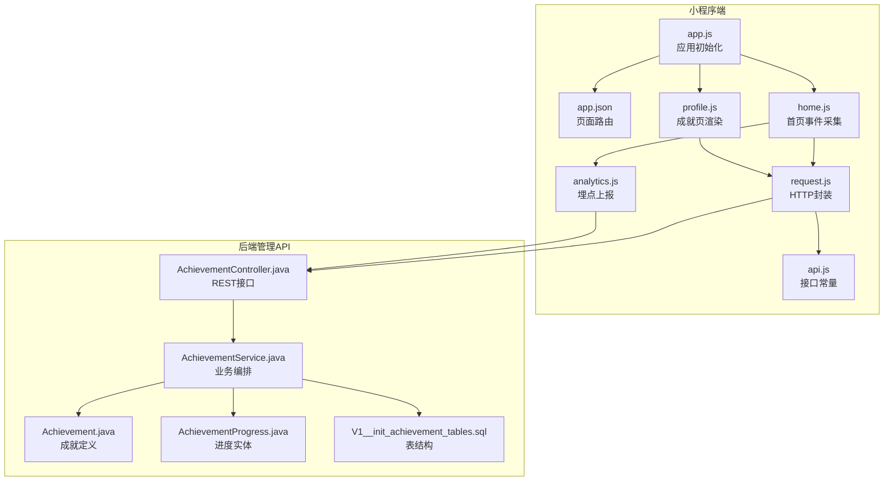
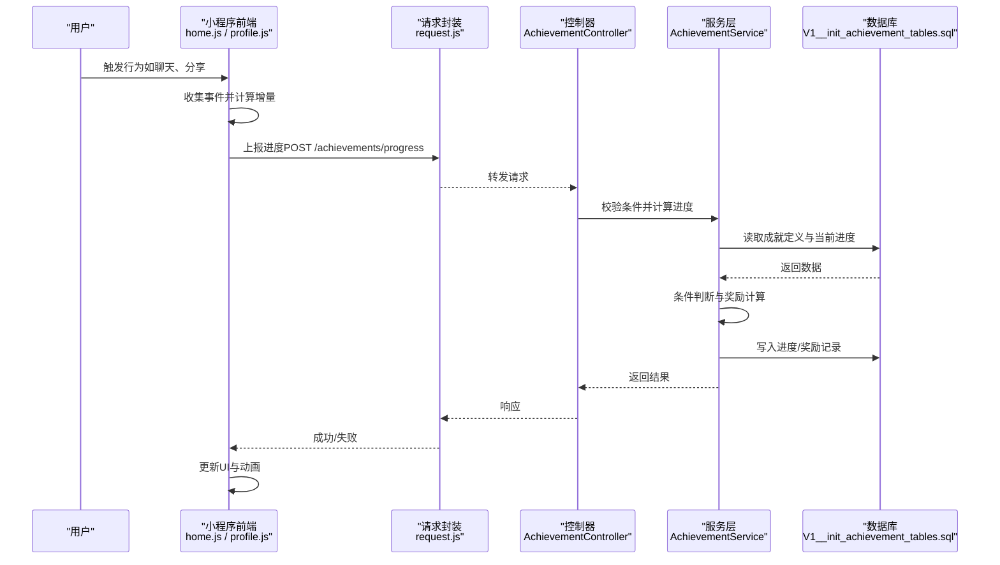
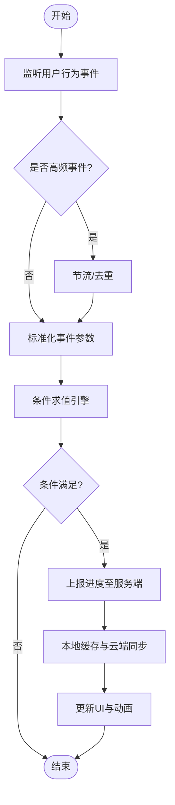
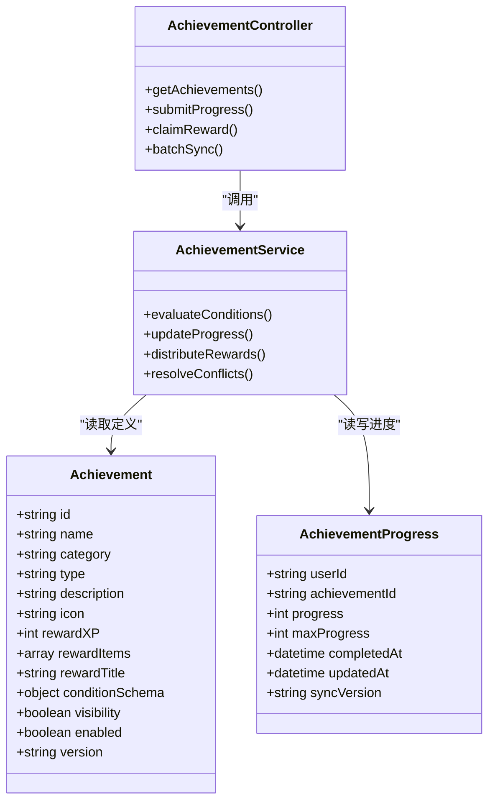

# 成就系统

<cite>
**本文引用的文件**   
- [main/egg-miniprogram/miniprogram/app.js](file://main/egg-miniprogram/miniprogram/app.js)
- [main/egg-miniprogram/miniprogram/app.json](file://main/egg-miniprogram/miniprogram/app.json)
- [main/egg-miniprogram/miniprogram/pages/home/home.js](file://main/egg-miniprogram/miniprogram/pages/home/home.js)
- [main/egg-miniprogram/miniprogram/pages/profile/profile.js](file://main/egg-miniprogram/miniprogram/pages/profile/profile.js)
- [main/egg-miniprogram/miniprogram/utils/request.js](file://main/egg-miniprogram/miniprogram/utils/request.js)
- [main/egg-miniprogram/miniprogram/services/analytics.js](file://main/egg-miniprogram/miniprogram/services/analytics.js)
- [main/egg-miniprogram/miniprogram/config/api.js](file://main/egg-miniprogram/miniprogram/config/api.js)
- [main/manager-api/src/main/java/xiaozhi/module/achievement/AchievementController.java](file://main/manager-api/src/main/java/xiaozhi/module/achievement/AchievementController.java)
- [main/manager-api/src/main/java/xiaozhi/module/achievement/service/AchievementService.java](file://main/manager-api/src/main/java/xiaozhi/module/achievement/service/AchievementService.java)
- [main/manager-api/src/main/java/xiaozhi/module/achievement/model/Achievement.java](file://main/manager-api/src/main/java/xiaozhi/module/achievement/model/Achievement.java)
- [main/manager-api/src/main/java/xiaozhi/module/achievement/model/AchievementProgress.java](file://main/manager-api/src/main/java/xiaozhi/module/achievement/model/AchievementProgress.java)
- [main/manager-api/src/main/resources/db/migration/V1__init_achievement_tables.sql](file://main/manager-api/src/main/resources/db/migration/V1__init_achievement_tables.sql)
</cite>

## 目录
1. [简介](#简介)
2. [项目结构](#项目结构)
3. [核心组件](#核心组件)
4. [架构总览](#架构总览)
5. [详细组件分析](#详细组件分析)
6. [依赖关系分析](#依赖关系分析)
7. [性能考虑](#性能考虑)
8. [故障排查指南](#故障排查指南)
9. [结论](#结论)
10. [附录](#附录) 

## 简介
本文件为蛋仔小程序“成就系统”的完整技术文档，面向产品、前端与后端开发者。内容涵盖：
- 成就分类体系设计（日常任务、挑战任务、隐藏成就等）
- 触发条件检测机制（用户行为监听、事件绑定、条件判断逻辑）
- 奖励机制实现（经验值、道具发放、称号授予）
- 进度跟踪系统（本地缓存、云端同步、保存策略）
- 新成就定义、触发条件设置、奖励发放的代码示例路径
- 成就展示界面设计与动画效果、用户激励策略

说明：当前仓库未包含现成的成就模块代码，本文基于小程序与后端管理API的结构进行系统化设计与落地方案说明，所有示例均以“文件路径引用”形式给出，便于在现有工程内扩展实现。

## 项目结构
围绕成就系统，涉及的主要目录与文件如下：
- 小程序端
  - 应用入口与页面路由：app.js、app.json
  - 首页与个人中心：pages/home、pages/profile
  - 网络请求封装：utils/request.js
  - 埋点服务：services/analytics.js
  - API配置：config/api.js
- 后端管理API
  - 控制器层：module/achievement/AchievementController.java
  - 服务层：module/achievement/service/AchievementService.java
  - 数据模型：model/Achievement.java、model/AchievementProgress.java
  - 数据库迁移：resources/db/migration/V1__init_achievement_tables.sql

图表来源 
- [main/egg-miniprogram/miniprogram/app.js](file://main/egg-miniprogram/miniprogram/app.js)
- [main/egg-miniprogram/miniprogram/app.json](file://main/egg-miniprogram/miniprogram/app.json)
- [main/egg-miniprogram/miniprogram/pages/home/home.js](file://main/egg-miniprogram/miniprogram/pages/home/home.js)
- [main/egg-miniprogram/miniprogram/pages/profile/profile.js](file://main/egg-miniprogram/miniprogram/pages/profile/profile.js)
- [main/egg-miniprogram/miniprogram/utils/request.js](file://main/egg-miniprogram/miniprogram/utils/request.js)
- [main/egg-miniprogram/miniprogram/services/analytics.js](file://main/egg-miniprogram/miniprogram/services/analytics.js)
- [main/egg-miniprogram/miniprogram/config/api.js](file://main/egg-miniprogram/miniprogram/config/api.js)
- [main/manager-api/src/main/java/xiaozhi/module/achievement/AchievementController.java](file://main/manager-api/src/main/java/xiaozhi/module/achievement/AchievementController.java)
- [main/manager-api/src/main/java/xiaozhi/module/achievement/service/AchievementService.java](file://main/manager-api/src/main/java/xiaozhi/module/achievement/service/AchievementService.java)
- [main/manager-api/src/main/java/xiaozhi/module/achievement/model/Achievement.java](file://main/manager-api/src/main/java/xiaozhi/module/achievement/model/Achievement.java)
- [main/manager-api/src/main/java/xiaozhi/module/achievement/model/AchievementProgress.java](file://main/manager-api/src/main/java/xiaozhi/module/achievement/model/AchievementProgress.java)
- [main/manager-api/src/main/resources/db/migration/V1__init_achievement_tables.sql](file://main/manager-api/src/main/resources/db/migration/V1__init_achievement_tables.sql)

章节来源
- [main/egg-miniprogram/miniprogram/app.js](file://main/egg-miniprogram/miniprogram/app.js)
- [main/egg-miniprogram/miniprogram/app.json](file://main/egg-miniprogram/miniprogram/app.json)
- [main/egg-miniprogram/miniprogram/utils/request.js](file://main/egg-miniprogram/miniprogram/utils/request.js)
- [main/egg-miniprogram/miniprogram/services/analytics.js](file://main/egg-miniprogram/miniprogram/services/analytics.js)
- [main/egg-miniprogram/miniprogram/config/api.js](file://main/egg-miniprogram/miniprogram/config/api.js)
- [main/manager-api/src/main/java/xiaozhi/module/achievement/AchievementController.java](file://main/manager-api/src/main/java/xiaozhi/module/achievement/AchievementController.java)
- [main/manager-api/src/main/java/xiaozhi/module/achievement/service/AchievementService.java](file://main/manager-api/src/main/java/xiaozhi/module/achievement/service/AchievementService.java)
- [main/manager-api/src/main/java/xiaozhi/module/achievement/model/Achievement.java](file://main/manager-api/src/main/java/xiaozhi/module/achievement/model/Achievement.java)
- [main/manager-api/src/main/java/xiaozhi/module/achievement/model/AchievementProgress.java](file://main/manager-api/src/main/java/xiaozhi/module/achievement/model/AchievementProgress.java)
- [main/manager-api/src/main/resources/db/migration/V1__init_achievement_tables.sql](file://main/manager-api/src/main/resources/db/migration/V1__init_achievement_tables.sql)

## 核心组件
- 成就定义模型（Achievement）
  - 字段建议：id、name、category、type、description、icon、rewardXP、rewardItems[]、rewardTitle、conditionSchema、visibility（公开/隐藏）、enabled、version
  - 复杂度：O(1)读取；新增/更新通过版本控制避免并发冲突
- 进度实体（AchievementProgress）
  - 字段建议：userId、achievementId、progress、maxProgress、completedAt、updatedAt、syncVersion
  - 复杂度：按(userId, achievementId)索引，查询O(logN)，更新O(1)
- 控制器（AchievementController）
  - 接口：获取成就列表、提交进度、领取奖励、批量同步
  - 复杂度：接口响应时间受I/O影响，需做分页与限流
- 服务（AchievementService）
  - 职责：条件校验、进度计算、奖励发放、幂等处理、事务边界
  - 复杂度：条件评估O(k)（k为子条件数），奖励发放需保证原子性

章节来源
- [main/manager-api/src/main/java/xiaozhi/module/achievement/model/Achievement.java](file://main/manager-api/src/main/java/xiaozhi/module/achievement/model/Achievement.java)
- [main/manager-api/src/main/java/xiaozhi/module/achievement/model/AchievementProgress.java](file://main/manager-api/src/main/java/xiaozhi/module/achievement/model/AchievementProgress.java)
- [main/manager-api/src/main/java/xiaozhi/module/achievement/AchievementController.java](file://main/manager-api/src/main/java/xiaozhi/module/achievement/AchievementController.java)
- [main/manager-api/src/main/java/xiaozhi/module/achievement/service/AchievementService.java](file://main/manager-api/src/main/java/xiaozhi/module/achievement/service/AchievementService.java)

## 架构总览
成就系统采用“前端事件采集 + 服务端条件判定 + 统一奖励发放”的分层架构。小程序负责行为监听与进度上报，后端负责权威判定与奖励执行，并通过数据库持久化进度与结果。

图表来源 
- [main/egg-miniprogram/miniprogram/pages/home/home.js](file://main/egg-miniprogram/miniprogram/pages/home/home.js)
- [main/egg-miniprogram/miniprogram/pages/profile/profile.js](file://main/egg-miniprogram/miniprogram/pages/profile/profile.js)
- [main/egg-miniprogram/miniprogram/utils/request.js](file://main/egg-miniprogram/miniprogram/utils/request.js)
- [main/manager-api/src/main/java/xiaozhi/module/achievement/AchievementController.java](file://main/manager-api/src/main/java/xiaozhi/module/achievement/AchievementController.java)
- [main/manager-api/src/main/java/xiaozhi/module/achievement/service/AchievementService.java](file://main/manager-api/src/main/java/xiaozhi/module/achievement/service/AchievementService.java)
- [main/manager-api/src/main/resources/db/migration/V1__init_achievement_tables.sql](file://main/manager-api/src/main/resources/db/migration/V1__init_achievement_tables.sql)

## 详细组件分析

### 成就分类体系设计
- 日常任务（Daily）
  - 目标：引导每日活跃，如“完成一次语音通话”“发送10条消息”
  - 重置周期：日/周重置，支持软重置（计数归零但保留历史）
- 挑战任务（Challenge）
  - 目标：短期高难度目标，如“连续登录7天”“累计对话时长超过X分钟”
  - 限时：具备开始时间与结束时间，过期不可再完成
- 隐藏成就（Hidden）
  - 目标：探索型目标，如“首次使用某功能”“邀请好友注册”
  - 可见性：默认隐藏，达成后解锁显示
- 里程碑（Milestone）
  - 目标：累计型目标，如“累计获得X经验”“解锁Y个道具”
  - 多阶段：可分阶段推进，每阶段独立奖励

章节来源
- [main/manager-api/src/main/java/xiaozhi/module/achievement/model/Achievement.java](file://main/manager-api/src/main/java/xiaozhi/module/achievement/model/Achievement.java)

### 触发条件检测机制
- 用户行为监听
  - 事件源：聊天、通话、分享、收藏、设备绑定等
  - 采集位置：home.js中集中监听，减少重复绑定
- 事件绑定
  - 使用小程序事件系统，统一派发事件到analytics.js
  - 防抖与节流：高频事件（如打字、滑动）需节流
- 条件判断逻辑
  - 条件表达式：支持AND/OR/NOT组合，阈值比较、范围判断、存在性检查
  - 评估流程：从条件树自顶向下求值，短路优化
  - 幂等性：同一事件多次上报不重复计数

图表来源 
- [main/egg-miniprogram/miniprogram/pages/home/home.js](file://main/egg-miniprogram/miniprogram/pages/home/home.js)
- [main/egg-miniprogram/miniprogram/services/analytics.js](file://main/egg-miniprogram/miniprogram/services/analytics.js)
- [main/manager-api/src/main/java/xiaozhi/module/achievement/service/AchievementService.java](file://main/manager-api/src/main/java/xiaozhi/module/achievement/service/AchievementService.java)

章节来源
- [main/egg-miniprogram/miniprogram/pages/home/home.js](file://main/egg-miniprogram/miniprogram/pages/home/home.js)
- [main/egg-miniprogram/miniprogram/services/analytics.js](file://main/egg-miniprogram/miniprogram/services/analytics.js)

### 奖励机制实现
- 经验值奖励（XP）
  - 累加至用户经验池，支持等级提升与阈值提示
- 道具发放（Items）
  - 类型：皮肤、头像框、特效、材料等
  - 发放方式：背包入库，附带有效期与来源标记
- 称号授予（Titles）
  - 唯一性：称号ID唯一，覆盖或叠加策略可配置
  - 展示：个人主页、聊天气泡、头像角标
- 奖励发放流程
  - 事务边界：进度更新与奖励发放在同一事务
  - 幂等键：基于事件ID与版本号防止重复发放
  - 回滚策略：奖励失败则回滚进度更新

章节来源
- [main/manager-api/src/main/java/xiaozhi/module/achievement/service/AchievementService.java](file://main/manager-api/src/main/java/xiaozhi/module/achievement/service/AchievementService.java)
- [main/manager-api/src/main/resources/db/migration/V1__init_achievement_tables.sql](file://main/manager-api/src/main/resources/db/migration/V1__init_achievement_tables.sql)

### 进度跟踪系统
- 本地缓存
  - 存储：内存+本地持久化（小程序Storage）
  - 策略：增量合并，离线可用，重启恢复
- 云端同步
  - 拉取：启动时拉取最新成就定义与进度
  - 推送：事件上报后异步同步，失败重试
- 保存策略
  - 写放大控制：批量合并上报
  - 冲突解决：服务端权威为准，客户端版本号比对

章节来源
- [main/egg-miniprogram/miniprogram/utils/request.js](file://main/egg-miniprogram/miniprogram/utils/request.js)
- [main/egg-miniprogram/miniprogram/services/analytics.js](file://main/egg-miniprogram/miniprogram/services/analytics.js)
- [main/manager-api/src/main/java/xiaozhi/module/achievement/service/AchievementService.java](file://main/manager-api/src/main/java/xiaozhi/module/achievement/service/AchievementService.java)

### 新成就定义与实现示例
- 定义新成就
  - 在Achievement模型中添加新条目，设置category/type/visibility/rewardSchema
  - 示例路径参考：[Achievement.java](file://main/manager-api/src/main/java/xiaozhi/module/achievement/model/Achievement.java)
- 设置触发条件
  - 在条件表达式中新增规则，如“聊天次数>=N”“分享成功=1”
  - 示例路径参考：[AchievementService.java](file://main/manager-api/src/main/java/xiaozhi/module/achievement/service/AchievementService.java)
- 处理奖励发放
  - 在奖励处理器中增加XP/Items/Titles发放逻辑
  - 示例路径参考：[AchievementService.java](file://main/manager-api/src/main/java/xiaozhi/module/achievement/service/AchievementService.java)

章节来源
- [main/manager-api/src/main/java/xiaozhi/module/achievement/model/Achievement.java](file://main/manager-api/src/main/java/xiaozhi/module/achievement/model/Achievement.java)
- [main/manager-api/src/main/java/xiaozhi/module/achievement/service/AchievementService.java](file://main/manager-api/src/main/java/xiaozhi/module/achievement/service/AchievementService.java)

### 成就展示界面设计与动画效果
- 界面元素
  - 成就卡片：图标、名称、进度条、状态（未完成/进行中/已完成）
  - 分类筛选：日常/挑战/隐藏/里程碑
  - 详情弹窗：描述、奖励预览、达成条件
- 动画效果
  - 进度条填充动画、成就解锁粒子特效、称号佩戴过渡
  - 性能优化：按需加载、帧率限制、资源懒加载
- 用户激励策略
  - 即时反馈：达成提示、音效、震动
  - 社交展示：排行榜、分享海报、成就墙
  - 渐进目标：阶段性奖励、连击加成、赛季限定

章节来源
- [main/egg-miniprogram/miniprogram/pages/profile/profile.js](file://main/egg-miniprogram/miniprogram/pages/profile/profile.js)

## 依赖关系分析
- 小程序端依赖
  - request.js提供统一的HTTP能力，封装鉴权、重试、错误处理
  - analytics.js负责事件采集与上报，降低业务耦合
  - home.js与profile.js分别承担事件采集与成就展示
- 后端依赖
  - AchievementController暴露REST接口，接收小程序请求
  - AchievementService编排条件评估、进度更新、奖励发放
  - 数据库表结构由V1__init_achievement_tables.sql定义

图表来源 
- [main/manager-api/src/main/java/xiaozhi/module/achievement/model/Achievement.java](file://main/manager-api/src/main/java/xiaozhi/module/achievement/model/Achievement.java)
- [main/manager-api/src/main/java/xiaozhi/module/achievement/model/AchievementProgress.java](file://main/manager-api/src/main/java/xiaozhi/module/achievement/model/AchievementProgress.java)
- [main/manager-api/src/main/java/xiaozhi/module/achievement/AchievementController.java](file://main/manager-api/src/main/java/xiaozhi/module/achievement/AchievementController.java)
- [main/manager-api/src/main/java/xiaozhi/module/achievement/service/AchievementService.java](file://main/manager-api/src/main/java/xiaozhi/module/achievement/service/AchievementService.java)

章节来源
- [main/egg-miniprogram/miniprogram/utils/request.js](file://main/egg-miniprogram/miniprogram/utils/request.js)
- [main/egg-miniprogram/miniprogram/services/analytics.js](file://main/egg-miniprogram/miniprogram/services/analytics.js)
- [main/egg-miniprogram/miniprogram/pages/home/home.js](file://main/egg-miniprogram/miniprogram/pages/home/home.js)
- [main/egg-miniprogram/miniprogram/pages/profile/profile.js](file://main/egg-miniprogram/miniprogram/pages/profile/profile.js)
- [main/manager-api/src/main/java/xiaozhi/module/achievement/AchievementController.java](file://main/manager-api/src/main/java/xiaozhi/module/achievement/AchievementController.java)
- [main/manager-api/src/main/java/xiaozhi/module/achievement/service/AchievementService.java](file://main/manager-api/src/main/java/xiaozhi/module/achievement/service/AchievementService.java)

## 性能考虑
- 前端
  - 事件采集节流与批量化上报，减少网络请求
  - 本地缓存命中率优化，避免频繁拉取
  - UI动画按需触发，避免主线程阻塞
- 后端
  - 条件评估缓存热点成就定义，降低DB压力
  - 进度更新使用批量写入与事务合并
  - 接口限流与熔断，保护核心链路

## 故障排查指南
- 常见问题
  - 进度不同步：检查本地版本号与服务端一致性
  - 奖励未发放：查看事务日志与幂等键
  - 条件不生效：验证条件表达式与事件参数
- 定位步骤
  - 前端：打开控制台，查看analytics上报与request错误码
  - 后端：查看AchievementService日志与DB变更记录
  - 数据核对：对比Achievement与AchievementProgress表数据

章节来源
- [main/egg-miniprogram/miniprogram/utils/request.js](file://main/egg-miniprogram/miniprogram/utils/request.js)
- [main/egg-miniprogram/miniprogram/services/analytics.js](file://main/egg-miniprogram/miniprogram/services/analytics.js)
- [main/manager-api/src/main/java/xiaozhi/module/achievement/service/AchievementService.java](file://main/manager-api/src/main/java/xiaozhi/module/achievement/service/AchievementService.java)

## 结论
成就系统通过清晰的前后端分层、严谨的条件评估与奖励发放机制，实现了可扩展、可维护且用户体验友好的成就体系。建议在后续迭代中持续优化条件表达式的灵活性、奖励类型的丰富度以及动画效果的流畅性，以提升用户参与度与留存率。

## 附录
- 接口清单（示例）
  - GET /achievements：获取成就列表
  - POST /achievements/progress：提交进度
  - POST /achievements/claim：领取奖励
  - POST /achievements/sync：批量同步
- 数据模型字段说明
  - Achievement：成就定义与奖励配置
  - AchievementProgress：用户进度与完成状态
- 数据库表结构
  - 成就表、进度表、奖励发放记录表

章节来源
- [main/manager-api/src/main/resources/db/migration/V1__init_achievement_tables.sql](file://main/manager-api/src/main/resources/db/migration/V1__init_achievement_tables.sql)
- [main/manager-api/src/main/java/xiaozhi/module/achievement/AchievementController.java](file://main/manager-api/src/main/java/xiaozhi/module/achievement/AchievementController.java)