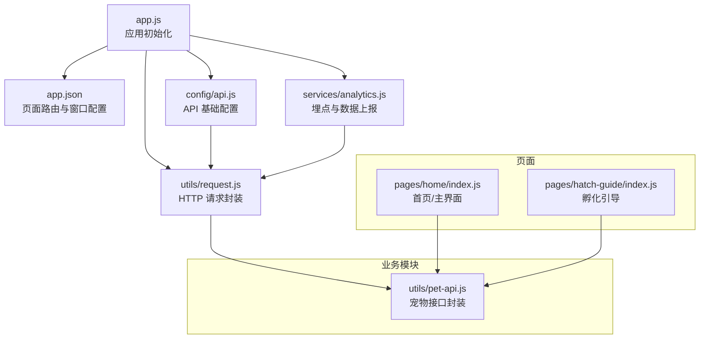
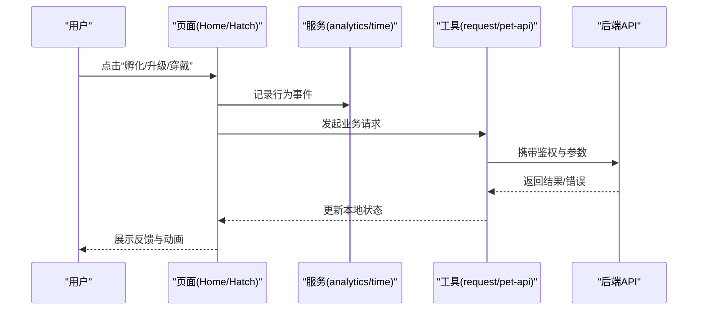
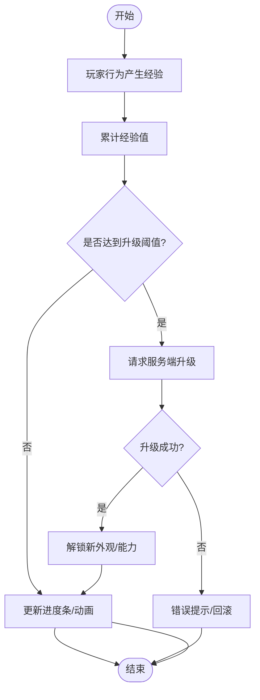
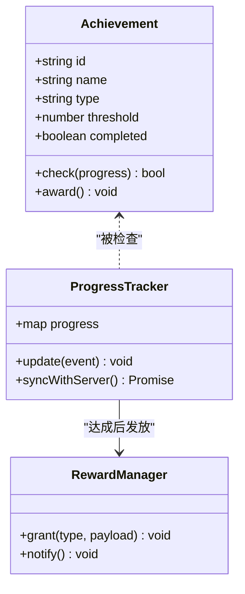
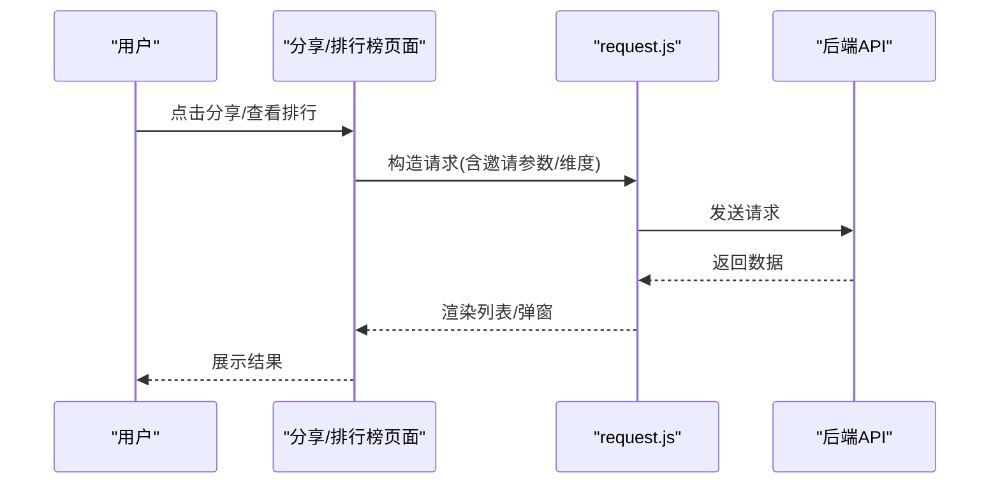
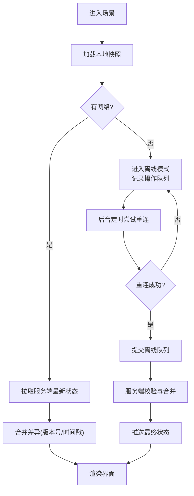
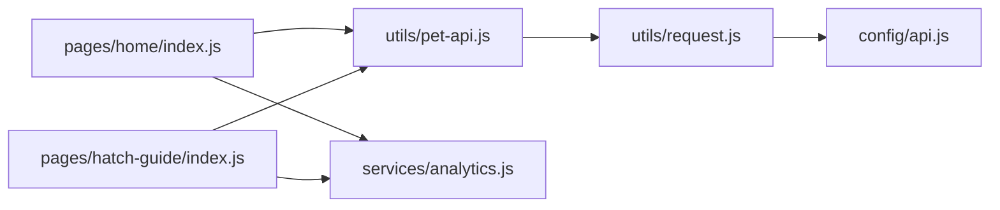

# 游戏化系统

<cite>
**本文引用的文件**   
- [egg-miniprogram/DESIGN.md](file://main/egg-miniprogram/DESIGN.md)
- [egg-miniprogram/README.md](file://main/egg-miniprogram/README.md)
- [egg-miniprogram/miniprogram/app.js](file://main/egg-miniprogram/miniprogram/app.js)
- [egg-miniprogram/miniprogram/app.json](file://main/egg-miniprogram/miniprogram/app.json)
- [egg-miniprogram/miniprogram/config/api.js](file://main/egg-miniprogram/miniprogram/config/api.js)
- [egg-miniprogram/miniprogram/utils/request.js](file://main/egg-miniprogram/miniprogram/utils/request.js)
- [egg-miniprogram/miniprogram/utils/pet-api.js](file://main/egg-miniprogram/miniprogram/utils/pet-api.js)
- [egg-miniprogram/miniprogram/services/analytics.js](file://main/egg-miniprogram/miniprogram/services/analytics.js)
- [egg-miniprogram/miniprogram/pages/home/index.js](file://main/egg-miniprogram/miniprogram/pages/home/index.js)
- [egg-miniprogram/miniprogram/pages/hatch-guide/index.js](file://main/egg-miniprogram/miniprogram/pages/hatch-guide/index.js)
- [egg-miniprogram/docs/egg-pet-identity-and-hatch-api.md](file://main/egg-miniprogram/docs/egg-pet-identity-and-hatch-api.md)
- [superpowers/plans/2026-05-07-ai-pet.md](file://docs/superpowers/plans/2026-05-07-ai-pet.md)
- [superpowers/plans/2026-07-11-egg-hatch-cultivation-frontend.md](file://docs/superpowers/plans/2026-07-11-egg-hatch-cultivation-frontend.md)
- [superpowers/specs/2026-07-11-egg-hatch-cultivation-frontend-design.md](file://docs/superpowers/specs/2026-07-11-egg-hatch-cultivation-frontend-design.md)
</cite>

## 目录
1. [简介](#简介)
2. [项目结构](#项目结构)
3. [核心组件](#核心组件)
4. [架构总览](#架构总览)
5. [详细组件分析](#详细组件分析)
6. [依赖分析](#依赖分析)
7. [性能考虑](#性能考虑)
8. [故障排查指南](#故障排查指南)
9. [结论](#结论)
10. [附录](#附录)

## 简介
本文件为“蛋仔小程序”的游戏化系统提供系统化、可落地的技术文档。围绕角色养成（宠物属性与成长曲线、等级提升）、成就系统（触发条件、奖励机制、进度跟踪）、社交互动（好友、分享、排行榜），以及游戏循环、状态同步与离线数据处理进行深度解析，并给出实现要点与最佳实践。内容基于仓库中的设计文档、前端代码结构与接口约定进行归纳，确保读者既能把握整体架构，也能快速定位到具体实现位置。

## 项目结构
蛋仔小程序位于 main/egg-miniprogram 目录，采用微信小程序工程结构：
- miniprogram：小程序主体，包含页面、组件、服务、工具库与配置
- docs：与蛋仔相关的接口与设计说明
- superpowers：产品规划与规格文档，涵盖孵化、养成、前端交互等

关键入口与组织方式：
- 应用入口 app.js 负责初始化全局状态、网络与埋点能力
- 页面按功能划分，如 home（首页/主界面）、hatch-guide（孵化引导）等
- 配置集中在 config/api.js，统一 API 基地址与版本策略
- 通用请求封装在 utils/request.js，保障鉴权、重试与错误处理
- 宠物相关接口封装在 utils/pet-api.js，屏蔽底层差异
- 数据分析通过 services/analytics.js 上报关键事件

图表来源
- [egg-miniprogram/miniprogram/app.js:1-200](file://main/egg-miniprogram/miniprogram/app.js#L1-L200)
- [egg-miniprogram/miniprogram/app.json:1-200](file://main/egg-miniprogram/miniprogram/app.json#L1-L200)
- [egg-miniprogram/miniprogram/config/api.js:1-200](file://main/egg-miniprogram/miniprogram/config/api.js#L1-L200)
- [egg-miniprogram/miniprogram/utils/request.js:1-200](file://main/egg-miniprogram/miniprogram/utils/request.js#L1-L200)
- [egg-miniprogram/miniprogram/services/analytics.js:1-200](file://main/egg-miniprogram/miniprogram/services/analytics.js#L1-L200)
- [egg-miniprogram/miniprogram/utils/pet-api.js:1-200](file://main/egg-miniprogram/miniprogram/utils/pet-api.js#L1-L200)
- [egg-miniprogram/miniprogram/pages/home/index.js:1-200](file://main/egg-miniprogram/miniprogram/pages/home/index.js#L1-L200)
- [egg-miniprogram/miniprogram/pages/hatch-guide/index.js:1-200](file://main/egg-miniprogram/miniprogram/pages/hatch-guide/index.js#L1-L200)

章节来源
- [egg-miniprogram/DESIGN.md:1-200](file://main/egg-miniprogram/DESIGN.md#L1-L200)
- [egg-miniprogram/README.md:1-200](file://main/egg-miniprogram/README.md#L1-L200)
- [egg-miniprogram/miniprogram/app.js:1-200](file://main/egg-miniprogram/miniprogram/app.js#L1-L200)
- [egg-miniprogram/miniprogram/app.json:1-200](file://main/egg-miniprogram/miniprogram/app.json#L1-L200)

## 核心组件
- 应用层（App）：负责全局生命周期、网络与埋点初始化、错误边界与降级策略
- 页面层（Pages）：承载用户交互与业务视图，如首页、孵化引导、背包、收藏卡等
- 服务层（Services）：跨页面共享的能力，如时间服务、埋点服务
- 工具层（Utils）：请求封装、宠物接口、音频、鉴权、OTA 等
- 配置层（Config）：API 基址、版本控制、功能开关

职责边界清晰，便于扩展与维护。例如 pet-api.js 将宠物相关 HTTP 调用集中管理，页面只需关注业务逻辑；request.js 统一处理鉴权、重试、错误提示与日志。

章节来源
- [egg-miniprogram/miniprogram/app.js:1-200](file://main/egg-miniprogram/miniprogram/app.js#L1-L200)
- [egg-miniprogram/miniprogram/utils/request.js:1-200](file://main/egg-miniprogram/miniprogram/utils/request.js#L1-L200)
- [egg-miniprogram/miniprogram/utils/pet-api.js:1-200](file://main/egg-miniprogram/miniprogram/utils/pet-api.js#L1-L200)
- [egg-miniprogram/miniprogram/services/analytics.js:1-200](file://main/egg-miniprogram/miniprogram/services/analytics.js#L1-L200)

## 架构总览
从客户端到服务端的数据流遵循“页面→服务→工具→API”的单向链路，配合埋点与服务端校验形成闭环。

图表来源
- [egg-miniprogram/miniprogram/pages/home/index.js:1-200](file://main/egg-miniprogram/miniprogram/pages/home/index.js#L1-L200)
- [egg-miniprogram/miniprogram/pages/hatch-guide/index.js:1-200](file://main/egg-miniprogram/miniprogram/pages/hatch-guide/index.js#L1-L200)
- [egg-miniprogram/miniprogram/utils/request.js:1-200](file://main/egg-miniprogram/miniprogram/utils/request.js#L1-L200)
- [egg-miniprogram/miniprogram/utils/pet-api.js:1-200](file://main/egg-miniprogram/miniprogram/utils/pet-api.js#L1-L200)
- [egg-miniprogram/miniprogram/services/analytics.js:1-200](file://main/egg-miniprogram/miniprogram/services/analytics.js#L1-L200)

## 详细组件分析

### 角色养成系统（宠物属性、成长曲线、等级提升）
- 属性管理
  - 属性维度建议包括：体力、智力、魅力、幸运等，支持动态增减与上限随等级提升
  - 属性变更需走服务端校验，防止篡改；客户端做乐观更新与回滚
- 成长曲线
  - 经验值与等级关系采用分段函数或查表法，保证平滑且可控
  - 每日任务、互动、孵化等行为产出经验，设置上限与衰减避免刷取
- 等级提升机制
  - 升级判定在服务端完成，客户端仅展示进度条与动画
  - 升级后解锁新外观、技能或玩法，通过配置下发

图表来源
- [egg-miniprogram/miniprogram/utils/pet-api.js:1-200](file://main/egg-miniprogram/miniprogram/utils/pet-api.js#L1-L200)
- [egg-miniprogram/miniprogram/utils/request.js:1-200](file://main/egg-miniprogram/miniprogram/utils/request.js#L1-L200)
- [egg-miniprogram/docs/egg-pet-identity-and-hatch-api.md:1-200](file://main/egg-miniprogram/docs/egg-pet-identity-and-hatch-api.md#L1-L200)

章节来源
- [egg-miniprogram/docs/egg-pet-identity-and-hatch-api.md:1-200](file://main/egg-miniprogram/docs/egg-pet-identity-and-hatch-api.md#L1-L200)
- [superpowers/plans/2026-05-07-ai-pet.md:1-200](file://docs/superpowers/plans/2026-05-07-ai-pet.md#L1-L200)
- [superpowers/plans/2026-07-11-egg-hatch-cultivation-frontend.md:1-200](file://docs/superpowers/plans/2026-07-11-egg-hatch-cultivation-frontend.md#L1-L200)
- [superpowers/specs/2026-07-11-egg-hatch-cultivation-frontend-design.md:1-200](file://docs/superpowers/specs/2026-07-11-egg-hatch-cultivation-frontend-design.md#L1-L200)

### 成就系统（触发条件、奖励机制、进度跟踪）
- 触发条件
  - 行为类：连续登录、对话次数、孵化次数
  - 数值类：累计经验、等级、亲密度
  - 事件类：首次穿戴装备、首次分享
- 奖励机制
  - 一次性奖励：道具、外观、称号
  - 持续性奖励：经验加成、掉落率提升
  - 防重复领取：服务端去重，客户端缓存领取状态
- 进度跟踪
  - 客户端维护本地进度快照，断网时仍可显示
  - 联网后增量同步，冲突以服务端为准

图表来源
- [egg-miniprogram/miniprogram/services/analytics.js:1-200](file://main/egg-miniprogram/miniprogram/services/analytics.js#L1-L200)
- [egg-miniprogram/miniprogram/utils/request.js:1-200](file://main/egg-miniprogram/miniprogram/utils/request.js#L1-L200)

章节来源
- [superpowers/specs/2026-07-11-egg-hatch-cultivation-frontend-design.md:1-200](file://docs/superpowers/specs/2026-07-11-egg-hatch-cultivation-frontend-design.md#L1-L200)
- [egg-miniprogram/miniprogram/services/analytics.js:1-200](file://main/egg-miniprogram/miniprogram/services/analytics.js#L1-L200)

### 社交互动（好友系统、分享机制、排行榜）
- 好友系统
  - 邀请码/二维码绑定，关联好友关系链
  - 在线状态与最近互动记录缓存
- 分享机制
  - 生成带参数的分享卡片，落地页自动回填邀请信息
  - 分享行为计入成就与激励
- 排行榜
  - 按维度（等级、亲密度、收集度）分页拉取
  - 本地缓存最近一次榜单，减少重复请求

图表来源
- [egg-miniprogram/miniprogram/utils/request.js:1-200](file://main/egg-miniprogram/miniprogram/utils/request.js#L1-L200)
- [egg-miniprogram/miniprogram/config/api.js:1-200](file://main/egg-miniprogram/miniprogram/config/api.js#L1-L200)

章节来源
- [egg-miniprogram/miniprogram/config/api.js:1-200](file://main/egg-miniprogram/miniprogram/config/api.js#L1-L200)
- [egg-miniprogram/miniprogram/utils/request.js:1-200](file://main/egg-miniprogram/miniprogram/utils/request.js#L1-L200)

### 游戏循环设计与状态同步
- 游戏循环
  - 短周期：资源刷新、冷却计时、在线心跳
  - 中周期：日常任务重置、周常活动
  - 长周期：赛季结算、排行榜重置
- 状态同步
  - 客户端维护本地状态快照，使用版本号/时间戳合并
  - 冲突解决以服务端为准，必要时回滚客户端状态
- 离线处理
  - 离线队列记录操作，恢复连接后批量提交
  - 幂等接口设计，避免重复提交导致异常

图表来源
- [egg-miniprogram/miniprogram/utils/request.js:1-200](file://main/egg-miniprogram/miniprogram/utils/request.js#L1-L200)
- [egg-miniprogram/miniprogram/services/analytics.js:1-200](file://main/egg-miniprogram/miniprogram/services/analytics.js#L1-L200)

章节来源
- [egg-miniprogram/miniprogram/utils/request.js:1-200](file://main/egg-miniprogram/miniprogram/utils/request.js#L1-L200)
- [egg-miniprogram/miniprogram/services/analytics.js:1-200](file://main/egg-miniprogram/miniprogram/services/analytics.js#L1-L200)

### 具体功能实现示例（路径指引）
- 宠物进化
  - 触发入口：首页/孵化引导页面
  - 关键流程：校验材料→调用升级接口→成功后更新外观与属性
  - 参考路径：[pet-api.js:1-200](file://main/egg-miniprogram/miniprogram/utils/pet-api.js#L1-L200)、[home/index.js:1-200](file://main/egg-miniprogram/miniprogram/pages/home/index.js#L1-L200)、[hatch-guide/index.js:1-200](file://main/egg-miniprogram/miniprogram/pages/hatch-guide/index.js#L1-L200)
- 装备穿戴
  - 触发入口：背包页面
  - 关键流程：选择装备→调用穿戴接口→更新角色外观与属性
  - 参考路径：[pet-api.js:1-200](file://main/egg-miniprogram/miniprogram/utils/pet-api.js#L1-L200)、[request.js:1-200](file://main/egg-miniprogram/miniprogram/utils/request.js#L1-L200)
- 任务完成
  - 触发入口：任务面板/行为回调
  - 关键流程：累计进度→达到阈值→提交完成→发放奖励
  - 参考路径：[analytics.js:1-200](file://main/egg-miniprogram/miniprogram/services/analytics.js#L1-L200)、[request.js:1-200](file://main/egg-miniprogram/miniprogram/utils/request.js#L1-L200)

章节来源
- [egg-miniprogram/miniprogram/utils/pet-api.js:1-200](file://main/egg-miniprogram/miniprogram/utils/pet-api.js#L1-L200)
- [egg-miniprogram/miniprogram/utils/request.js:1-200](file://main/egg-miniprogram/miniprogram/utils/request.js#L1-L200)
- [egg-miniprogram/miniprogram/services/analytics.js:1-200](file://main/egg-miniprogram/miniprogram/services/analytics.js#L1-L200)
- [egg-miniprogram/miniprogram/pages/home/index.js:1-200](file://main/egg-miniprogram/miniprogram/pages/home/index.js#L1-L200)
- [egg-miniprogram/miniprogram/pages/hatch-guide/index.js:1-200](file://main/egg-miniprogram/miniprogram/pages/hatch-guide/index.js#L1-L200)

### 用户激励机制与留存策略
- 激励机制
  - 新手引导与首充礼包
  - 签到、连续登录、活跃度任务
  - 成就与称号体系
- 留存策略
  - 每日目标与限时活动
  - 社交裂变（邀请码、分享返利）
  - 个性化推荐（根据行为调整任务难度与奖励）

章节来源
- [egg-miniprogram/miniprogram/services/analytics.js:1-200](file://main/egg-miniprogram/miniprogram/services/analytics.js#L1-L200)
- [egg-miniprogram/miniprogram/config/api.js:1-200](file://main/egg-miniprogram/miniprogram/config/api.js#L1-L200)

### 数据分析集成
- 埋点范围：启动、页面停留、关键按钮点击、任务完成、分享、失败错误
- 上报策略：批量上报、离线缓存、失败重试
- 指标看板：DAU、留存、付费转化、任务完成率

章节来源
- [egg-miniprogram/miniprogram/services/analytics.js:1-200](file://main/egg-miniprogram/miniprogram/services/analytics.js#L1-L200)
- [egg-miniprogram/miniprogram/utils/request.js:1-200](file://main/egg-miniprogram/miniprogram/utils/request.js#L1-L200)

## 依赖分析
- 页面依赖工具与服务：页面通过 request.js 与 pet-api.js 访问后端，analytics.js 负责埋点
- 配置驱动：api.js 统一管理接口基址与版本，便于灰度与回滚
- 外部依赖：微信生态能力（登录、分享、支付）由平台 SDK 提供

图表来源
- [egg-miniprogram/miniprogram/pages/home/index.js:1-200](file://main/egg-miniprogram/miniprogram/pages/home/index.js#L1-L200)
- [egg-miniprogram/miniprogram/pages/hatch-guide/index.js:1-200](file://main/egg-miniprogram/miniprogram/pages/hatch-guide/index.js#L1-L200)
- [egg-miniprogram/miniprogram/utils/pet-api.js:1-200](file://main/egg-miniprogram/miniprogram/utils/pet-api.js#L1-L200)
- [egg-miniprogram/miniprogram/utils/request.js:1-200](file://main/egg-miniprogram/miniprogram/utils/request.js#L1-L200)
- [egg-miniprogram/miniprogram/config/api.js:1-200](file://main/egg-miniprogram/miniprogram/config/api.js#L1-L200)
- [egg-miniprogram/miniprogram/services/analytics.js:1-200](file://main/egg-miniprogram/miniprogram/services/analytics.js#L1-L200)

章节来源
- [egg-miniprogram/miniprogram/config/api.js:1-200](file://main/egg-miniprogram/miniprogram/config/api.js#L1-L200)
- [egg-miniprogram/miniprogram/utils/request.js:1-200](file://main/egg-miniprogram/miniprogram/utils/request.js#L1-L200)
- [egg-miniprogram/miniprogram/utils/pet-api.js:1-200](file://main/egg-miniprogram/miniprogram/utils/pet-api.js#L1-L200)

## 性能考虑
- 请求优化
  - 合并请求、缓存热点数据、分页拉取
  - 超时与重试策略，指数退避
- 渲染优化
  - 列表虚拟化、按需加载图片与资源
  - 动画使用原生能力，减少 JS 计算
- 内存与包体
  - 分包加载、懒加载非关键页面
  - 资源压缩与 CDN 加速

## 故障排查指南
- 常见问题
  - 网络异常：检查鉴权、超时、重试策略
  - 状态不一致：核对版本号/时间戳，强制拉取服务端状态
  - 埋点缺失：确认事件上报时机与参数完整性
- 调试手段
  - 开启详细日志，定位请求与响应
  - 使用本地模拟数据验证 UI 与交互
  - 分阶段灰度发布，观察错误率与性能指标

章节来源
- [egg-miniprogram/miniprogram/utils/request.js:1-200](file://main/egg-miniprogram/miniprogram/utils/request.js#L1-L200)
- [egg-miniprogram/miniprogram/services/analytics.js:1-200](file://main/egg-miniprogram/miniprogram/services/analytics.js#L1-L200)

## 结论
本方案以清晰的层次化架构与统一的工具/服务抽象，支撑了蛋仔小程序的角色养成、成就系统与社交互动等核心玩法。通过严格的服务端校验、稳健的状态同步与完善的埋点体系，既保证了体验流畅，也为后续增长与商业化打下坚实基础。建议在迭代中持续完善离线队列、反作弊与数据看板，进一步提升留存与收益。

## 附录
- 相关设计文档与计划
  - [AI 宠物计划:1-200](file://docs/superpowers/plans/2026-05-07-ai-pet.md#L1-L200)
  - [蛋仔孵化养成前端计划:1-200](file://docs/superpowers/plans/2026-07-11-egg-hatch-cultivation-frontend.md#L1-L200)
  - [蛋仔孵化养成前端设计:1-200](file://docs/superpowers/specs/2026-07-11-egg-hatch-cultivation-frontend-design.md#L1-L200)
  - [宠物身份与孵化接口说明:1-200](file://main/egg-miniprogram/docs/egg-pet-identity-and-hatch-api.md#L1-L200)