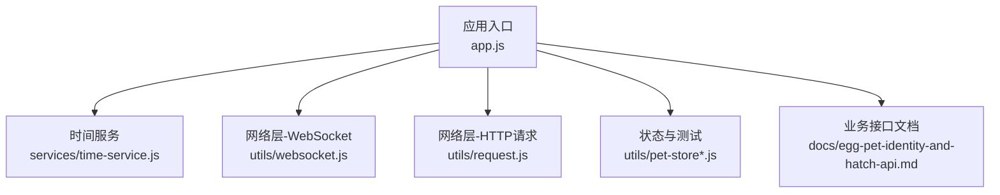
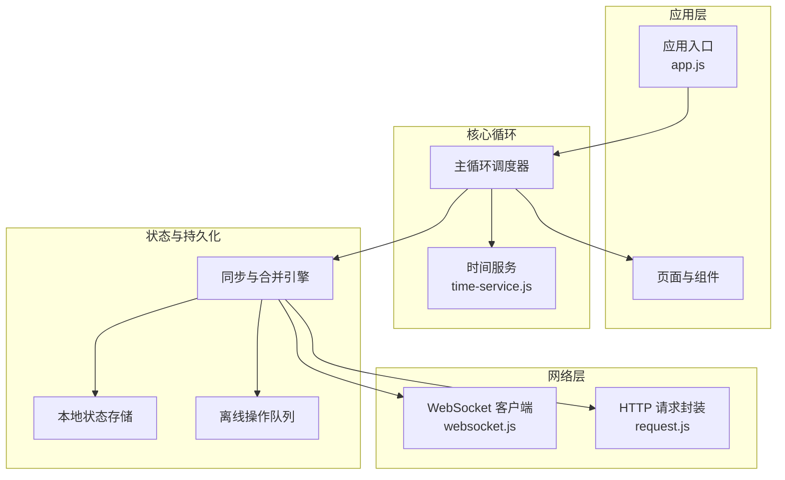
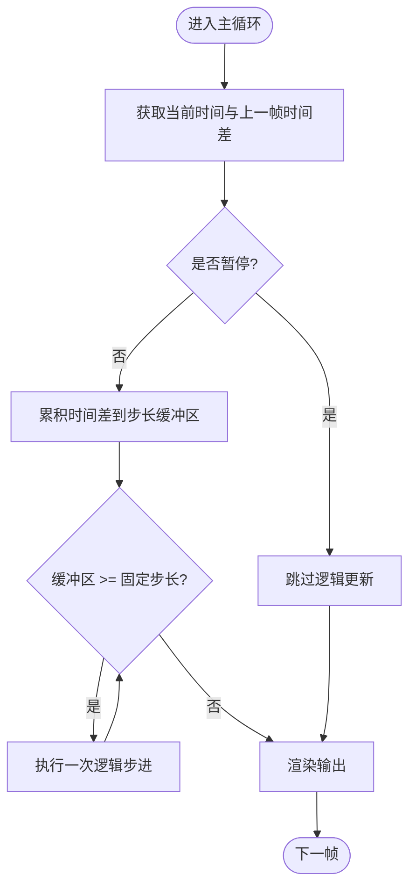
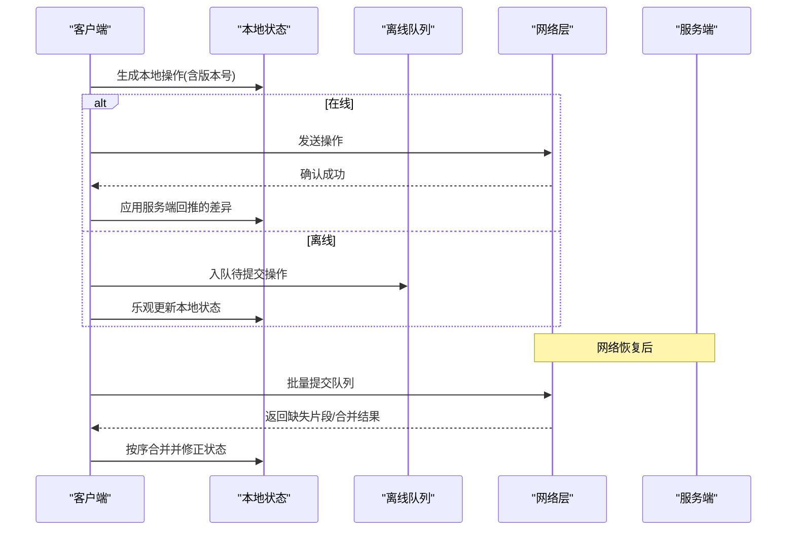
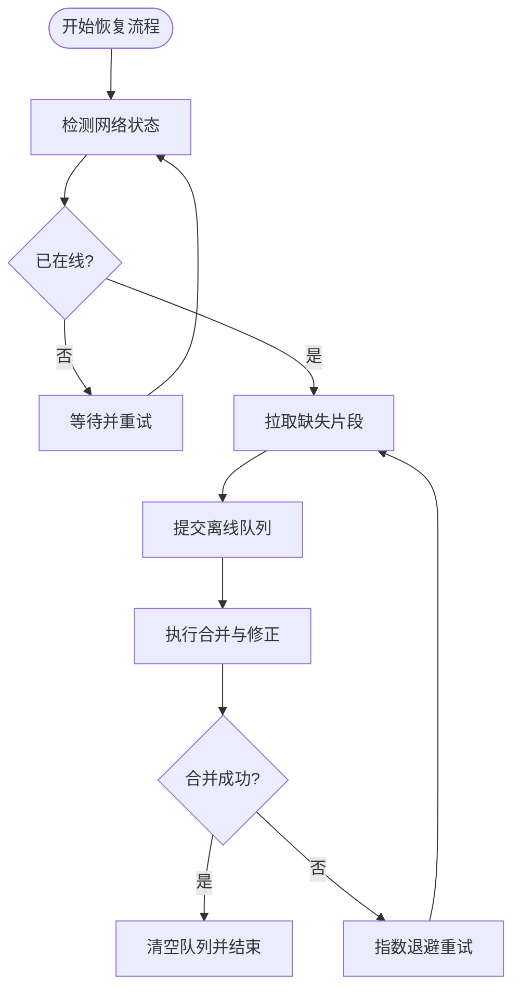
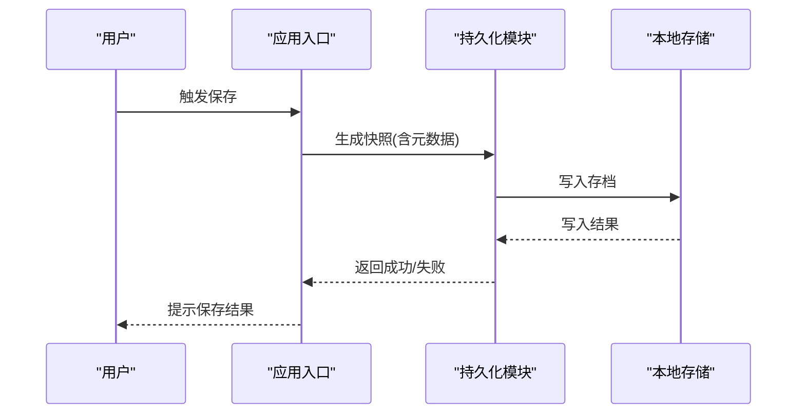
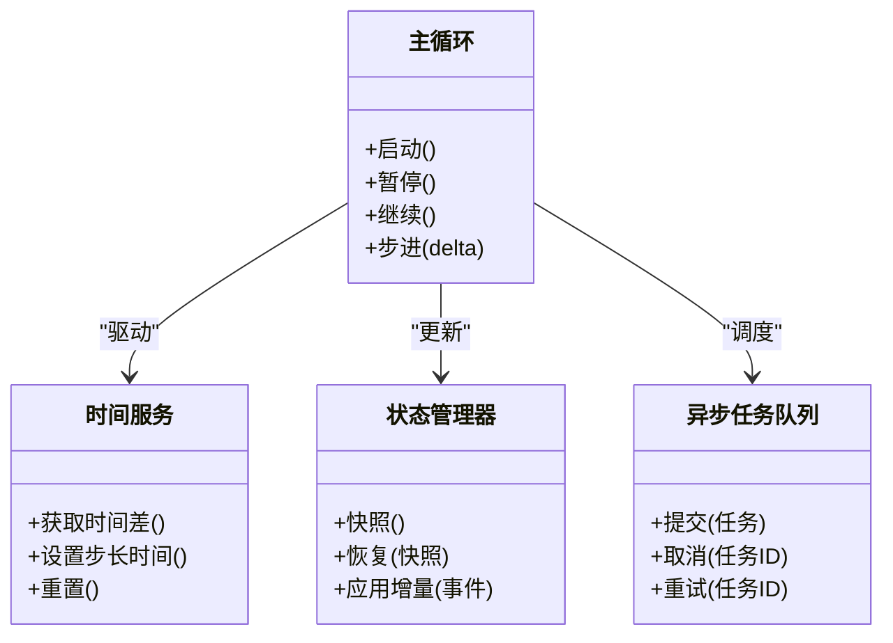
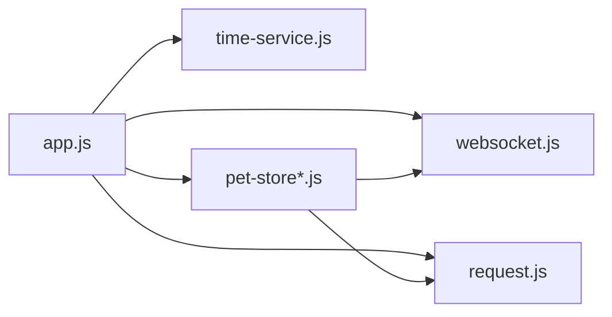

# 游戏循环与状态管理

<cite>
**本文引用的文件**   
- [app.js](file://main/egg-miniprogram/miniprogram/app.js)
- [time-service.js](file://main/egg-miniprogram/miniprogram/services/time-service.js)
- [websocket.js](file://main/egg-miniprogram/miniprogram/utils/websocket.js)
- [request.js](file://main/egg-miniprogram/miniprogram/utils/request.js)
- [pet-store-actions.test.js](file://main/egg-miniprogram/miniprogram/utils/pet-store-actions.test.js)
- [pet-store.test.js](file://main/egg-miniprogram/miniprogram/utils/pet-store.test.js)
- [egg-pet-identity-and-hatch-api.md](file://main/egg-miniprogram/docs/egg-pet-identity-and-hatch-api.md)
</cite>

## 目录
1. [简介](#简介)
2. [项目结构](#项目结构)
3. [核心组件](#核心组件)
4. [架构总览](#架构总览)
5. [详细组件分析](#详细组件分析)
6. [依赖关系分析](#依赖关系分析)
7. [性能考虑](#性能考虑)
8. [故障排查指南](#故障排查指南)
9. [结论](#结论)
10. [附录](#附录)

## 简介
本文件面向“蛋仔小程序”的游戏循环与状态管理系统，系统性阐述主循环架构、帧率控制与时间管理、状态同步策略（本地与云端）、离线数据处理方案、状态持久化机制，以及暂停/继续、快照、异步任务管理等关键实现要点。文档同时给出性能优化建议、内存管理与异常恢复策略，帮助读者快速理解并落地相关设计。

## 项目结构
本项目为微信小程序工程，围绕“蛋仔宠物”玩法，涉及页面、服务、工具库与文档等模块。与游戏循环和状态管理密切相关的代码主要位于 miniprogram 目录下：
- 应用入口与生命周期：app.js
- 时间服务：services/time-service.js
- 网络层：utils/websocket.js、utils/request.js
- 状态与测试：utils/pet-store*.js（用于验证状态流转）
- 业务接口说明：docs/egg-pet-identity-and-hatch-api.md

**图示来源** 
- [app.js](file://main/egg-miniprogram/miniprogram/app.js)
- [time-service.js](file://main/egg-miniprogram/miniprogram/services/time-service.js)
- [websocket.js](file://main/egg-miniprogram/miniprogram/utils/websocket.js)
- [request.js](file://main/egg-miniprogram/miniprogram/utils/request.js)
- [pet-store-actions.test.js](file://main/egg-miniprogram/miniprogram/utils/pet-store-actions.test.js)
- [pet-store.test.js](file://main/egg-miniprogram/miniprogram/utils/pet-store.test.js)
- [egg-pet-identity-and-hatch-api.md](file://main/egg-miniprogram/docs/egg-pet-identity-and-hatch-api.md)

**章节来源**
- [app.js](file://main/egg-miniprogram/miniprogram/app.js)
- [time-service.js](file://main/egg-miniprogram/miniprogram/services/time-service.js)
- [websocket.js](file://main/egg-miniprogram/miniprogram/utils/websocket.js)
- [request.js](file://main/egg-miniprogram/miniprogram/utils/request.js)
- [pet-store-actions.test.js](file://main/egg-miniprogram/miniprogram/utils/pet-store-actions.test.js)
- [pet-store.test.js](file://main/egg-miniprogram/miniprogram/utils/pet-store.test.js)
- [egg-pet-identity-and-hatch-api.md](file://main/egg-miniprogram/docs/egg-pet-identity-and-hatch-api.md)

## 核心组件
- 应用入口 app.js：负责初始化全局上下文、注册生命周期钩子、启动或协调时间服务与网络层，是游戏循环的调度中心。
- 时间服务 time-service.js：提供稳定的时间源与帧节拍，驱动渲染与逻辑更新，解耦帧率与业务逻辑。
- WebSocket 客户端 websocket.js：维护长连接、消息收发、断线重连、心跳保活，支撑实时状态同步。
- HTTP 请求封装 request.js：统一鉴权、重试、错误处理与缓存策略，服务于非实时数据交互。
- 状态与测试 pet-store*.js：定义状态模型与变更流程，并通过测试用例验证状态机与冲突解决逻辑。

**章节来源**
- [app.js](file://main/egg-miniprogram/miniprogram/app.js)
- [time-service.js](file://main/egg-miniprogram/miniprogram/services/time-service.js)
- [websocket.js](file://main/egg-miniprogram/miniprogram/utils/websocket.js)
- [request.js](file://main/egg-miniprogram/miniprogram/utils/request.js)
- [pet-store-actions.test.js](file://main/egg-miniprogram/miniprogram/utils/pet-store-actions.test.js)
- [pet-store.test.js](file://main/egg-miniprogram/miniprogram/utils/pet-store.test.js)

## 架构总览
下图展示游戏循环与状态管理的整体架构：应用入口协调时间服务与网络层；时间服务按固定节拍驱动逻辑更新与渲染；网络层在在线时进行增量同步，离线时将操作入队并在恢复后合并提交。

**图示来源** 
- [app.js](file://main/egg-miniprogram/miniprogram/app.js)
- [time-service.js](file://main/egg-miniprogram/miniprogram/services/time-service.js)
- [websocket.js](file://main/egg-miniprogram/miniprogram/utils/websocket.js)
- [request.js](file://main/egg-miniprogram/miniprogram/utils/request.js)

## 详细组件分析

### 主循环与帧率控制
- 主循环职责：每帧执行输入处理、逻辑更新、渲染输出；通过时间服务提供的 delta 时间推进状态机。
- 帧率控制：采用固定步长累加器模式，确保物理与逻辑更新稳定；渲染帧可独立于逻辑帧，避免卡顿。
- 时间管理：使用高精度时间源，统一时钟；支持暂停/继续，冻结逻辑更新但保持渲染刷新。

**图示来源** 
- [time-service.js](file://main/egg-miniprogram/miniprogram/services/time-service.js)
- [app.js](file://main/egg-miniprogram/miniprogram/app.js)

**章节来源**
- [time-service.js](file://main/egg-miniprogram/miniprogram/services/time-service.js)
- [app.js](file://main/egg-miniprogram/miniprogram/app.js)

### 状态同步策略（本地与云端）
- 增量更新：服务端推送差异事件，客户端按序列号顺序应用，避免全量覆盖导致抖动。
- 冲突解决：以服务端权威为准，结合操作版本号与时间戳进行合并；对不可逆操作采用幂等与去重。
- 离线队列：网络不可用时将用户操作写入队列，恢复后按序提交并拉取缺失片段，完成合并。

**图示来源** 
- [websocket.js](file://main/egg-miniprogram/miniprogram/utils/websocket.js)
- [request.js](file://main/egg-miniprogram/miniprogram/utils/request.js)
- [pet-store.test.js](file://main/egg-miniprogram/miniprogram/utils/pet-store.test.js)
- [pet-store-actions.test.js](file://main/egg-miniprogram/miniprogram/utils/pet-store-actions.test.js)
- [egg-pet-identity-and-hatch-api.md](file://main/egg-miniprogram/docs/egg-pet-identity-and-hatch-api.md)

**章节来源**
- [websocket.js](file://main/egg-miniprogram/miniprogram/utils/websocket.js)
- [request.js](file://main/egg-miniprogram/miniprogram/utils/request.js)
- [pet-store.test.js](file://main/egg-miniprogram/miniprogram/utils/pet-store.test.js)
- [pet-store-actions.test.js](file://main/egg-miniprogram/miniprogram/utils/pet-store-actions.test.js)
- [egg-pet-identity-and-hatch-api.md](file://main/egg-miniprogram/docs/egg-pet-identity-and-hatch-api.md)

### 离线数据处理方案
- 离线操作队列：记录操作类型、参数、时间戳与版本号，保证有序性与幂等性。
- 数据合并策略：基于版本号的三路合并（本地、服务端、冲突集），优先保留服务端权威结果。
- 网络恢复流程：检测连接状态，触发补拉与提交；失败则退避重试，直至成功或达到上限。

**图示来源** 
- [websocket.js](file://main/egg-miniprogram/miniprogram/utils/websocket.js)
- [request.js](file://main/egg-miniprogram/miniprogram/utils/request.js)

**章节来源**
- [websocket.js](file://main/egg-miniprogram/miniprogram/utils/websocket.js)
- [request.js](file://main/egg-miniprogram/miniprogram/utils/request.js)

### 游戏状态持久化
- 自动保存：在关键节点（场景切换、玩家退出、定时阈值）触发快照写入。
- 手动保存：用户主动触发，立即落盘并提示成功。
- 备份恢复：支持导出/导入存档，恢复时校验完整性与版本兼容性。

**图示来源** 
- [app.js](file://main/egg-miniprogram/miniprogram/app.js)

**章节来源**
- [app.js](file://main/egg-miniprogram/miniprogram/app.js)

### 暂停/继续、状态快照与异步任务管理
- 暂停/继续：冻结逻辑步进，保持渲染；恢复时从上次断点继续，不丢失进度。
- 状态快照：序列化关键状态字段，用于回溯与调试；支持对比与回放。
- 异步任务管理：统一任务队列与优先级，支持取消、重试与超时；与主循环解耦，避免阻塞。

**图示来源** 
- [app.js](file://main/egg-miniprogram/miniprogram/app.js)
- [time-service.js](file://main/egg-miniprogram/miniprogram/services/time-service.js)

**章节来源**
- [app.js](file://main/egg-miniprogram/miniprogram/app.js)
- [time-service.js](file://main/egg-miniprogram/miniprogram/services/time-service.js)

## 依赖关系分析
- 松耦合设计：时间服务与主循环解耦，网络层与状态管理分离，便于替换与扩展。
- 依赖方向：应用入口依赖时间服务、网络层与状态管理；状态管理依赖网络层进行同步。
- 外部集成：WebSocket 与 HTTP 作为外部通信通道，需处理鉴权、错误与重连。

**图示来源** 
- [app.js](file://main/egg-miniprogram/miniprogram/app.js)
- [time-service.js](file://main/egg-miniprogram/miniprogram/services/time-service.js)
- [websocket.js](file://main/egg-miniprogram/miniprogram/utils/websocket.js)
- [request.js](file://main/egg-miniprogram/miniprogram/utils/request.js)
- [pet-store-actions.test.js](file://main/egg-miniprogram/miniprogram/utils/pet-store-actions.test.js)
- [pet-store.test.js](file://main/egg-miniprogram/miniprogram/utils/pet-store.test.js)

**章节来源**
- [app.js](file://main/egg-miniprogram/miniprogram/app.js)
- [time-service.js](file://main/egg-miniprogram/miniprogram/services/time-service.js)
- [websocket.js](file://main/egg-miniprogram/miniprogram/utils/websocket.js)
- [request.js](file://main/egg-miniprogram/miniprogram/utils/request.js)
- [pet-store-actions.test.js](file://main/egg-miniprogram/miniprogram/utils/pet-store-actions.test.js)
- [pet-store.test.js](file://main/egg-miniprogram/miniprogram/utils/pet-store.test.js)

## 性能考虑
- 帧率与逻辑步长：固定步长减少抖动，渲染帧独立提升流畅度。
- 增量同步：仅传输差异，降低带宽与解析开销。
- 批处理与合并：批量提交离线操作，减少网络往返。
- 内存管理：及时释放临时对象，避免大对象常驻；快照按需生成与清理。
- 错误处理：网络失败指数退避，状态合并失败回滚至安全点。

[本节为通用指导，不直接分析具体文件]

## 故障排查指南
- 网络问题：检查 WebSocket 连接状态与心跳；查看重连日志与退避策略。
- 状态不一致：比对本地与服务端版本号，定位缺失或重复事件。
- 性能瓶颈：监控主循环耗时与渲染帧率，识别阻塞任务。
- 持久化失败：检查存储空间与权限，验证存档完整性与版本兼容。

**章节来源**
- [websocket.js](file://main/egg-miniprogram/miniprogram/utils/websocket.js)
- [request.js](file://main/egg-miniprogram/miniprogram/utils/request.js)
- [pet-store.test.js](file://main/egg-miniprogram/miniprogram/utils/pet-store.test.js)
- [pet-store-actions.test.js](file://main/egg-miniprogram/miniprogram/utils/pet-store-actions.test.js)

## 结论
通过时间服务驱动的固定步长主循环、增量状态同步与离线队列合并机制，蛋仔小程序实现了稳定流畅的游戏体验与可靠的状态一致性。配合完善的持久化与异常恢复策略，系统具备良好的可扩展性与鲁棒性。建议在后续迭代中持续优化批处理与内存管理，进一步提升性能与用户体验。

[本节为总结性内容，不直接分析具体文件]

## 附录
- 参考接口文档：详见 egg-pet-identity-and-hatch-api.md，了解身份与孵化相关 API 约定。
- 测试用例：pet-store*.js 中的用例可用于验证状态机与冲突解决逻辑的正确性。

**章节来源**
- [egg-pet-identity-and-hatch-api.md](file://main/egg-miniprogram/docs/egg-pet-identity-and-hatch-api.md)
- [pet-store.test.js](file://main/egg-miniprogram/miniprogram/utils/pet-store.test.js)
- [pet-store-actions.test.js](file://main/egg-miniprogram/miniprogram/utils/pet-store-actions.test.js)