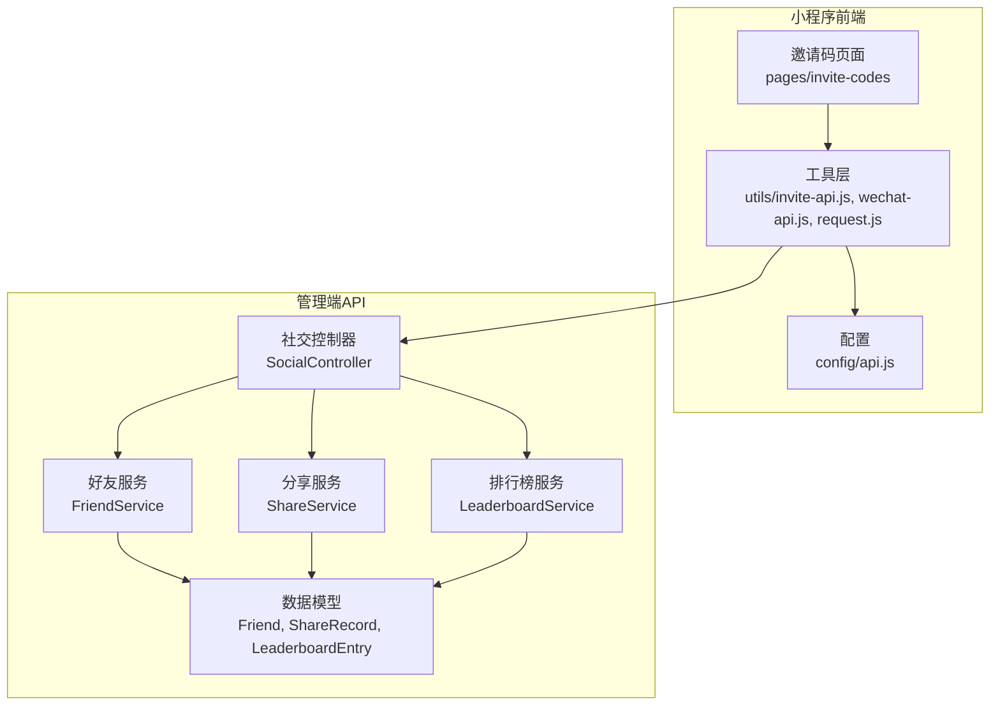
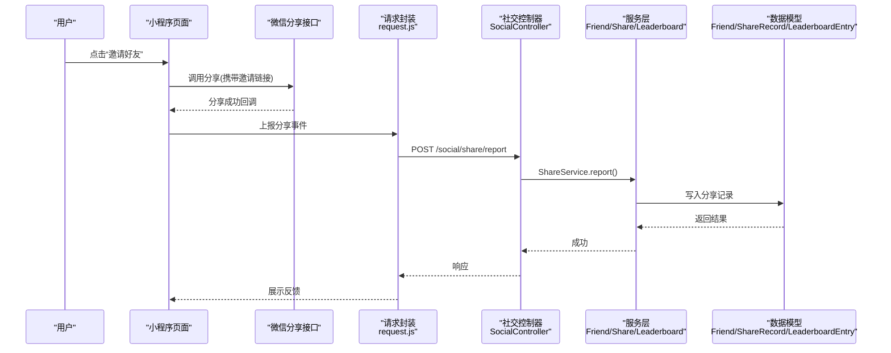
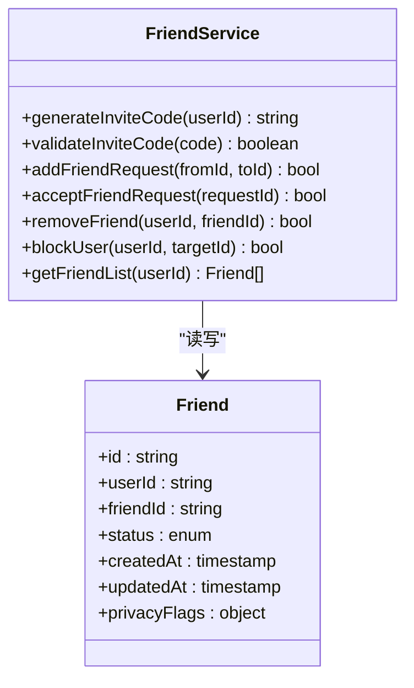
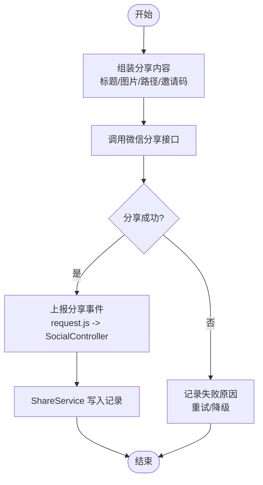
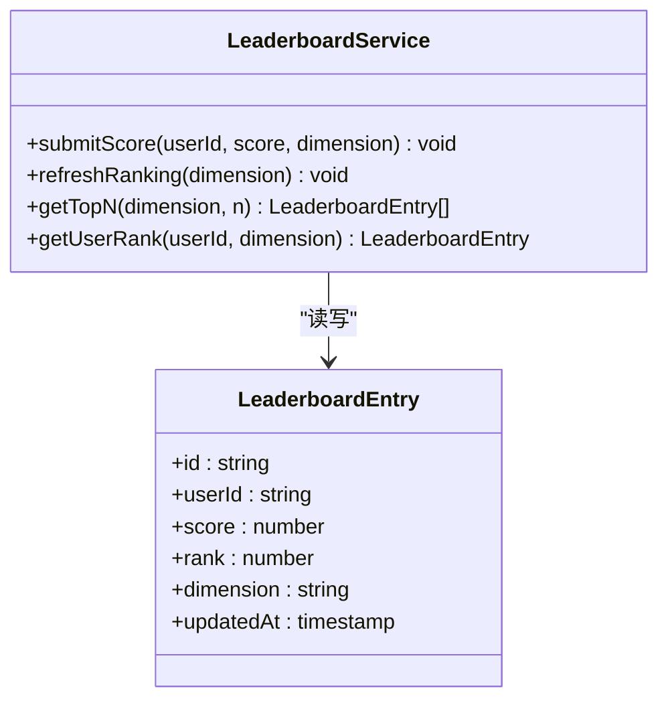
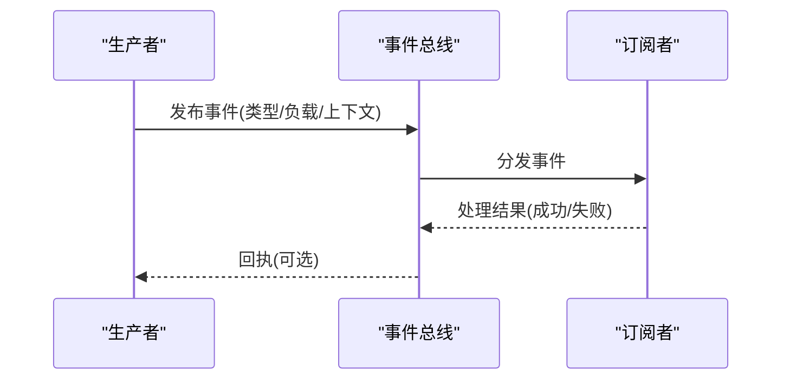
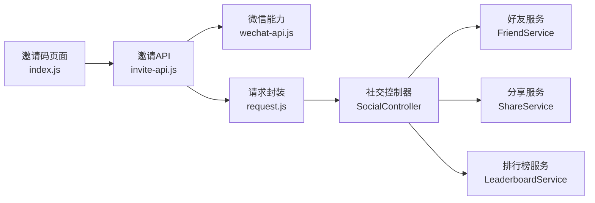

# 社交互动系统

<cite>
**本文引用的文件**   
- [egg-miniprogram/README.md](file://main/egg-miniprogram/README.md)
- [egg-miniprogram/app.json](file://main/egg-miniprogram/miniprogram/app.json)
- [egg-miniprogram/pages/invite-codes/index.js](file://main/egg-miniprogram/miniprogram/pages/invite-codes/index.js)
- [egg-miniprogram/utils/invite-api.js](file://main/egg-miniprogram/miniprogram/utils/invite-api.js)
- [egg-miniprogram/utils/wechat-api.js](file://main/egg-miniprogram/miniprogram/utils/wechat-api.js)
- [egg-miniprogram/utils/request.js](file://main/egg-miniprogram/miniprogram/utils/request.js)
- [egg-miniprogram/config/api.js](file://main/egg-miniprogram/miniprogram/config/api.js)
- [manager-api/src/main/java/xiaozhi/module/social/controller/SocialController.java](file://main/manager-api/src/main/java/xiaozhi/module/social/controller/SocialController.java)
- [manager-api/src/main/java/xiaozhi/module/social/service/FriendService.java](file://main/manager-api/src/main/java/xiaozhi/module/social/service/FriendService.java)
- [manager-api/src/main/java/xiaozhi/module/social/service/ShareService.java](file://main/manager-api/src/main/java/xiaozhi/module/social/service/ShareService.java)
- [manager-api/src/main/java/xiaozhi/module/social/service/LeaderboardService.java](file://main/manager-api/src/main/java/xiaozhi/module/social/service/LeaderboardService.java)
- [manager-api/src/main/java/xiaozhi/module/social/model/Friend.java](file://main/manager-api/src/main/java/xiaozhi/module/social/model/Friend.java)
- [manager-api/src/main/java/xiaozhi/module/social/model/ShareRecord.java](file://main/manager-api/src/main/java/xiaozhi/module/social/model/ShareRecord.java)
- [manager-api/src/main/java/xiaozhi/module/social/model/LeaderboardEntry.java](file://main/manager-api/src/main/java/xiaozhi/module/social/model/LeaderboardEntry.java)
</cite>

## 目录
1. [引言](#引言)
2. [项目结构](#项目结构)
3. [核心组件](#核心组件)
4. [架构总览](#架构总览)
5. [详细组件分析](#详细组件分析)
6. [依赖分析](#依赖分析)
7. [性能考虑](#性能考虑)
8. [故障排查指南](#故障排查指南)
9. [结论](#结论)
10. [附录](#附录)

## 引言
本文件面向“蛋仔小程序”的社交互动系统，聚焦好友系统、分享机制与排行榜三大模块。文档从系统架构、数据流、处理逻辑、集成点、错误处理与性能特性等维度进行系统化说明，并提供可操作的实现要点与示例路径，帮助开发者快速理解并落地相关功能。

## 项目结构
本项目包含小程序前端（egg-miniprogram）与管理端 API（manager-api）。社交能力由前端页面与工具层调用后端服务完成，后端提供好友关系、分享记录与排行榜等接口。

图表来源
- [egg-miniprogram/pages/invite-codes/index.js](file://main/egg-miniprogram/miniprogram/pages/invite-codes/index.js)
- [egg-miniprogram/utils/invite-api.js](file://main/egg-miniprogram/miniprogram/utils/invite-api.js)
- [egg-miniprogram/utils/wechat-api.js](file://main/egg-miniprogram/miniprogram/utils/wechat-api.js)
- [egg-miniprogram/utils/request.js](file://main/egg-miniprogram/miniprogram/utils/request.js)
- [egg-miniprogram/config/api.js](file://main/egg-miniprogram/miniprogram/config/api.js)
- [manager-api/src/main/java/xiaozhi/module/social/controller/SocialController.java](file://main/manager-api/src/main/java/xiaozhi/module/social/controller/SocialController.java)
- [manager-api/src/main/java/xiaozhi/module/social/service/FriendService.java](file://main/manager-api/src/main/java/xiaozhi/module/social/service/FriendService.java)
- [manager-api/src/main/java/xiaozhi/module/social/service/ShareService.java](file://main/manager-api/src/main/java/xiaozhi/module/social/service/ShareService.java)
- [manager-api/src/main/java/xiaozhi/module/social/service/LeaderboardService.java](file://main/manager-api/src/main/java/xiaozhi/module/social/service/LeaderboardService.java)
- [manager-api/src/main/java/xiaozhi/module/social/model/Friend.java](file://main/manager-api/src/main/java/xiaozhi/module/social/model/Friend.java)
- [manager-api/src/main/java/xiaozhi/module/social/model/ShareRecord.java](file://main/manager-api/src/main/java/xiaozhi/module/social/model/ShareRecord.java)
- [manager-api/src/main/java/xiaozhi/module/social/model/LeaderboardEntry.java](file://main/manager-api/src/main/java/xiaozhi/module/social/model/LeaderboardEntry.java)

章节来源
- [egg-miniprogram/README.md](file://main/egg-miniprogram/README.md)
- [egg-miniprogram/app.json](file://main/egg-miniprogram/miniprogram/app.json)

## 核心组件
- 好友系统：负责好友添加、关系维护与权限控制，包括邀请码生成与校验、双向确认流程、隐私开关与拉黑策略。
- 分享机制：封装微信分享接口调用、分享内容定制、分享回调处理与转化追踪。
- 排行榜：负责数据收集、排序算法与实时更新，支持多维度排行与缓存加速。
- 社交事件：统一事件总线，承载好友上线提醒、礼物赠送、互动消息等异步通知。

章节来源
- [manager-api/src/main/java/xiaozhi/module/social/controller/SocialController.java](file://main/manager-api/src/main/java/xiaozhi/module/social/controller/SocialController.java)
- [manager-api/src/main/java/xiaozhi/module/social/service/FriendService.java](file://main/manager-api/src/main/java/xiaozhi/module/social/service/FriendService.java)
- [manager-api/src/main/java/xiaozhi/module/social/service/ShareService.java](file://main/manager-api/src/main/java/xiaozhi/module/social/service/ShareService.java)
- [manager-api/src/main/java/xiaozhi/module/social/service/LeaderboardService.java](file://main/manager-api/src/main/java/xiaozhi/module/social/service/LeaderboardService.java)

## 架构总览
整体采用“小程序前端 + 管理端API”的分层架构。前端通过统一的请求封装与微信能力封装调用后端社交接口；后端以控制器为入口，服务层实现业务逻辑，数据模型承载持久化结构。

图表来源
- [egg-miniprogram/pages/invite-codes/index.js](file://main/egg-miniprogram/miniprogram/pages/invite-codes/index.js)
- [egg-miniprogram/utils/wechat-api.js](file://main/egg-miniprogram/miniprogram/utils/wechat-api.js)
- [egg-miniprogram/utils/request.js](file://main/egg-miniprogram/miniprogram/utils/request.js)
- [manager-api/src/main/java/xiaozhi/module/social/controller/SocialController.java](file://main/manager-api/src/main/java/xiaozhi/module/social/controller/SocialController.java)
- [manager-api/src/main/java/xiaozhi/module/social/service/ShareService.java](file://main/manager-api/src/main/java/xiaozhi/module/social/service/ShareService.java)
- [manager-api/src/main/java/xiaozhi/module/social/model/ShareRecord.java](file://main/manager-api/src/main/java/xiaozhi/module/social/model/ShareRecord.java)

## 详细组件分析

### 好友系统
- 功能要点
  - 邀请码生成与校验：服务端生成唯一邀请码，前端在邀请页展示并支持复制与分享。
  - 好友添加流程：被邀请方通过邀请码发起申请，双方确认后建立好友关系。
  - 关系维护：支持解除关系、黑名单管理、可见性控制（如是否允许被搜索）。
  - 权限控制：基于用户身份与关系状态决定操作权限，敏感操作需二次确认。
- 关键数据模型
  - Friend：存储好友关系、状态、时间戳与权限标记。
- 典型交互
  - 生成邀请码、校验邀请码、提交好友申请、审核通过、更新关系状态。

图表来源
- [manager-api/src/main/java/xiaozhi/module/social/model/Friend.java](file://main/manager-api/src/main/java/xiaozhi/module/social/model/Friend.java)
- [manager-api/src/main/java/xiaozhi/module/social/service/FriendService.java](file://main/manager-api/src/main/java/xiaozhi/module/social/service/FriendService.java)

章节来源
- [manager-api/src/main/java/xiaozhi/module/social/controller/SocialController.java](file://main/manager-api/src/main/java/xiaozhi/module/social/controller/SocialController.java)
- [manager-api/src/main/java/xiaozhi/module/social/service/FriendService.java](file://main/manager-api/src/main/java/xiaozhi/module/social/service/FriendService.java)
- [manager-api/src/main/java/xiaozhi/module/social/model/Friend.java](file://main/manager-api/src/main/java/xiaozhi/module/social/model/Friend.java)

### 分享机制
- 功能要点
  - 微信分享接口调用：封装 wx.shareAppMessage 或转发能力，支持自定义标题、图片与路径。
  - 分享内容定制：根据场景动态拼装分享参数，如活动信息、邀请码、渠道标识。
  - 分享回调处理：捕获分享成功/失败回调，上报服务端用于统计与反作弊。
- 关键数据模型
  - ShareRecord：记录分享来源、目标、内容、时间与结果。
- 典型交互
  - 生成分享链接、调用分享接口、回调上报、服务端落库与计数。

图表来源
- [egg-miniprogram/utils/wechat-api.js](file://main/egg-miniprogram/miniprogram/utils/wechat-api.js)
- [egg-miniprogram/utils/request.js](file://main/egg-miniprogram/miniprogram/utils/request.js)
- [manager-api/src/main/java/xiaozhi/module/social/controller/SocialController.java](file://main/manager-api/src/main/java/xiaozhi/module/social/controller/SocialController.java)
- [manager-api/src/main/java/xiaozhi/module/social/service/ShareService.java](file://main/manager-api/src/main/java/xiaozhi/module/social/service/ShareService.java)
- [manager-api/src/main/java/xiaozhi/module/social/model/ShareRecord.java](file://main/manager-api/src/main/java/xiaozhi/module/social/model/ShareRecord.java)

章节来源
- [egg-miniprogram/utils/wechat-api.js](file://main/egg-miniprogram/miniprogram/utils/wechat-api.js)
- [egg-miniprogram/utils/request.js](file://main/egg-miniprogram/miniprogram/utils/request.js)
- [manager-api/src/main/java/xiaozhi/module/social/service/ShareService.java](file://main/manager-api/src/main/java/xiaozhi/module/social/service/ShareService.java)

### 排行榜
- 功能要点
  - 数据收集：聚合用户行为数据（如活跃度、成就值），定时或实时写入。
  - 排序算法：按分数降序、同分按时间或其他权重排序，支持分页与过滤。
  - 实时更新：使用缓存+增量更新策略，减少数据库压力，提升读取性能。
- 关键数据模型
  - LeaderboardEntry：记录用户ID、分数、排名、更新时间与维度标签。
- 典型交互
  - 提交成绩、刷新榜单、查询个人排名、获取Top列表。

图表来源
- [manager-api/src/main/java/xiaozhi/module/social/model/LeaderboardEntry.java](file://main/manager-api/src/main/java/xiaozhi/module/social/model/LeaderboardEntry.java)
- [manager-api/src/main/java/xiaozhi/module/social/service/LeaderboardService.java](file://main/manager-api/src/main/java/xiaozhi/module/social/service/LeaderboardService.java)

章节来源
- [manager-api/src/main/java/xiaozhi/module/social/service/LeaderboardService.java](file://main/manager-api/src/main/java/xiaozhi/module/social/service/LeaderboardService.java)
- [manager-api/src/main/java/xiaozhi/module/social/model/LeaderboardEntry.java](file://main/manager-api/src/main/java/xiaozhi/module/social/model/LeaderboardEntry.java)

### 社交事件
- 事件类型
  - 好友上线提醒：当好友在线状态变化时推送通知。
  - 礼物赠送：记录赠送行为并触发奖励与通知。
  - 互动消息：聊天、点赞、评论等消息的统一分发。
- 处理机制
  - 事件总线解耦生产与消费，支持重试、去重与幂等。
  - 结合WebSocket或消息队列实现实时推送。

[此图为概念流程图，不直接映射具体源码文件]

## 依赖分析
- 前端依赖
  - 邀请码页面依赖 invite-api 与 wechat-api，统一通过 request.js 发起网络请求。
  - 配置 api.js 集中管理接口地址与版本。
- 后端依赖
  - SocialController 作为统一入口，委托 FriendService、ShareService、LeaderboardService 处理业务。
  - 数据模型 Friend、ShareRecord、LeaderboardEntry 定义持久化结构。

图表来源
- [egg-miniprogram/pages/invite-codes/index.js](file://main/egg-miniprogram/miniprogram/pages/invite-codes/index.js)
- [egg-miniprogram/utils/invite-api.js](file://main/egg-miniprogram/miniprogram/utils/invite-api.js)
- [egg-miniprogram/utils/wechat-api.js](file://main/egg-miniprogram/miniprogram/utils/wechat-api.js)
- [egg-miniprogram/utils/request.js](file://main/egg-miniprogram/miniprogram/utils/request.js)
- [manager-api/src/main/java/xiaozhi/module/social/controller/SocialController.java](file://main/manager-api/src/main/java/xiaozhi/module/social/controller/SocialController.java)
- [manager-api/src/main/java/xiaozhi/module/social/service/FriendService.java](file://main/manager-api/src/main/java/xiaozhi/module/social/service/FriendService.java)
- [manager-api/src/main/java/xiaozhi/module/social/service/ShareService.java](file://main/manager-api/src/main/java/xiaozhi/module/social/service/ShareService.java)
- [manager-api/src/main/java/xiaozhi/module/social/service/LeaderboardService.java](file://main/manager-api/src/main/java/xiaozhi/module/social/service/LeaderboardService.java)

章节来源
- [egg-miniprogram/config/api.js](file://main/egg-miniprogram/miniprogram/config/api.js)

## 性能考虑
- 分享上报
  - 批量上报与去重，避免重复计数与频繁IO。
  - 失败重试与离线缓存，保障数据一致性。
- 排行榜
  - 使用缓存（如内存或Redis）存储TopN与个人排名，降低热点查询压力。
  - 增量更新与定时全量刷新相结合，平衡实时性与成本。
- 好友关系
  - 关系查询走索引优化，常用字段建立复合索引。
  - 写多读少场景采用异步合并与批处理。

[本节为通用指导，不直接分析具体文件]

## 故障排查指南
- 常见问题
  - 分享回调未触发：检查微信环境权限与回调参数是否正确。
  - 邀请码无效：核对有效期、使用次数限制与用户状态。
  - 排行榜延迟：检查缓存同步任务与数据库写入链路。
- 定位方法
  - 前端日志：在 request.js 中打印请求/响应与错误堆栈。
  - 后端日志：在控制器与服务层记录关键步骤与异常。
  - 数据校验：对 ShareRecord、Friend、LeaderboardEntry 进行一致性检查。

章节来源
- [egg-miniprogram/utils/request.js](file://main/egg-miniprogram/miniprogram/utils/request.js)
- [manager-api/src/main/java/xiaozhi/module/social/controller/SocialController.java](file://main/manager-api/src/main/java/xiaozhi/module/social/controller/SocialController.java)
- [manager-api/src/main/java/xiaozhi/module/social/service/ShareService.java](file://main/manager-api/src/main/java/xiaozhi/module/social/service/ShareService.java)
- [manager-api/src/main/java/xiaozhi/module/social/service/FriendService.java](file://main/manager-api/src/main/java/xiaozhi/module/social/service/FriendService.java)
- [manager-api/src/main/java/xiaozhi/module/social/service/LeaderboardService.java](file://main/manager-api/src/main/java/xiaozhi/module/social/service/LeaderboardService.java)

## 结论
本社交互动系统以清晰的前后端分层与模块化设计，实现了好友系统、分享机制与排行榜的核心能力。通过统一的事件总线与完善的错误处理，系统在可扩展性与稳定性方面具备良好基础。建议在生产环境中加强监控与审计，持续优化缓存与索引策略，确保高并发下的用户体验。

[本节为总结性内容，不直接分析具体文件]

## 附录
- 实现示例路径
  - 好友邀请：参考 [邀请码页面](file://main/egg-miniprogram/miniprogram/pages/invite-codes/index.js) 与 [邀请API](file://main/egg-miniprogram/miniprogram/utils/invite-api.js)。
  - 分享链接生成：参考 [微信能力封装](file://main/egg-miniprogram/miniprogram/utils/wechat-api.js) 与 [请求封装](file://main/egg-miniprogram/miniprogram/utils/request.js)。
  - 排行榜数据同步：参考 [排行榜服务](file://main/manager-api/src/main/java/xiaozhi/module/social/service/LeaderboardService.java) 与 [数据模型](file://main/manager-api/src/main/java/xiaozhi/module/social/model/LeaderboardEntry.java)。
- 隐私保护与反作弊
  - 隐私开关：在 Friend 模型中扩展隐私标志位，控制可见性与搜索权限。
  - 反作弊：对分享上报进行频率限制、设备指纹校验与异常行为检测。
- 用户体验优化
  - 即时反馈：分享与邀请操作提供明确的成功/失败提示。
  - 渐进增强：在网络不稳定时降级为本地缓存与延迟上报。

章节来源
- [egg-miniprogram/pages/invite-codes/index.js](file://main/egg-miniprogram/miniprogram/pages/invite-codes/index.js)
- [egg-miniprogram/utils/invite-api.js](file://main/egg-miniprogram/miniprogram/utils/invite-api.js)
- [egg-miniprogram/utils/wechat-api.js](file://main/egg-miniprogram/miniprogram/utils/wechat-api.js)
- [egg-miniprogram/utils/request.js](file://main/egg-miniprogram/miniprogram/utils/request.js)
- [manager-api/src/main/java/xiaozhi/module/social/service/LeaderboardService.java](file://main/manager-api/src/main/java/xiaozhi/module/social/service/LeaderboardService.java)
- [manager-api/src/main/java/xiaozhi/module/social/model/LeaderboardEntry.java](file://main/manager-api/src/main/java/xiaozhi/module/social/model/LeaderboardEntry.java)